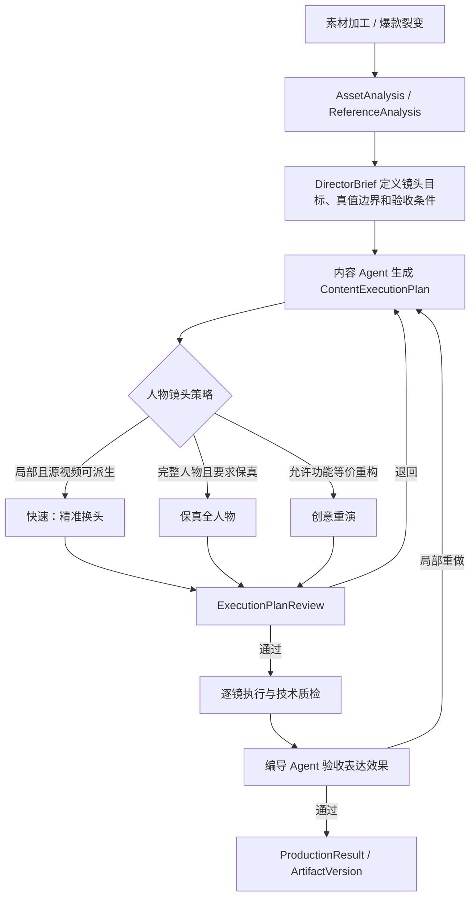

# PRD v3.3 与人物替换三模式兼容性评审

> 评审日期：2026-09-23  
> 对照文档：`/Users/julia_chen/Downloads/PRD-灵枢AI当前系统-v3.md`  
> 评审范围：快速、专家、创意三种人物替换路线及其在灵枢整体内容生产链中的位置

## 1. 结论

三个模式作为**内容 Agent 的逐镜生产策略**与 PRD 兼容；如果把它们作为普通用户必须选择的第三个内容入口，或把 Runway/Kling/Seedance/Act-Two 直接展示给普通用户，则与 PRD 不兼容。

必须完成四项调整：

1. 三个模式不新增一级入口，统一归入“素材加工”和“爆款裂变”两条主链；
2. 一键托管默认由内容 Agent 逐镜自动选模式，只有高级设置允许人工覆盖；
3. 先判断视频来源和授权，再决定能否把原视频作为底片；
4. 三模式结果必须进入 `ContentExecutionPlan → ExecutionPlanReview → ProductionResult`，不能建立一条独立旁路。

## 2. 兼容项

| 三模式设计 | PRD 对应要求 | 结论 |
|---|---|---|
| 按镜头选择快速、专家或创意路线 | 内容 Agent 针对每个镜头选择制作方式，不能整片只用一个模型 | 兼容 |
| 快速模式保护身体、服装、动作和背景 | 局部特效只能修改指定区域，不重绘锁定人物、产品或文字 | 兼容 |
| 专家模式设置动作、手部、身份、背景和音轨门禁 | 技术质检与编导表达验收分离，失败只重做受影响镜头 | 兼容 |
| 创意模式允许功能等价重演 | 无法完整复刻时允许 `functional_equivalent`，但不能虚构事实 | 兼容 |
| Provider 抽象和候选模型路由 | PRD 不绑定单一供应商，内容 Agent 比较成本、耗时、成功率和权利风险 | 兼容 |
| 保存输入、模型、成本、质量和版本 | 每次调用记录输入/输出版本、成本、耗时、错误和 provenance | 兼容 |
| 授权不完整时阻断成片 | 人物、参考视频、音乐、商标和素材必须有明确权利边界 | 兼容 |

## 3. 当前冲突和修正

### 3.1 三个模式不能成为第三种内容入口

PRD 明确内容制作只保留“素材加工”和“爆款裂变”。因此三个模式只描述某个**人物镜头如何执行**：

```text
素材加工 / 爆款裂变
  → DirectorBrief
  → ContentExecutionPlan
  → 某个人物镜头的 personStrategy = fast | expert | creative
```

普通用户看到“系统将保留原表演换人物”或“系统将重新演绎此镜头”即可。模式选择器放入高级设置，不占据默认主流程。

### 3.2 普通用户不能选择供应商

当前规划中的 Kling → Seedance → Act-Two 是内部候选顺序，不应作为固定产品文案。系统应通过能力注册表结合以下因素动态路由：

- 输入画幅、人物景别、动作和遮挡；
- 必须保护的事实和区域；
- 历史真实成功率；
- 预算、预计耗时和重试上限；
- 授权、数据出境和供应商可用性。

高级界面可以显示“保真全人物重演”，模型名、提示词和内部评分默认收起。

### 3.3 外部参考不能默认作为底片

这是最重要的产品边界。三模式在两种素材来源下含义不同：

| 视频来源 | 快速模式 | 专家模式 | 创意模式 |
|---|---|---|---|
| 客户自有或已明确授权的源视频 | 可以在原片上局部换头 | 可以全人物替换并回贴原背景 | 可以重演或重构 |
| 外部爆款参考，仅获得分析权 | 不得直接输出换头后的参考原片 | 不得保留原背景、原音乐或其他受保护画面 | 根据 `ReferenceAnalysis` 重建结构和镜头功能，使用客户素材或合规生成内容 |

因此提交前必须拥有：

- `sourceKind = customer_asset | licensed_asset | external_reference`；
- `rightsScope`：允许分析、允许派生、允许商业发布的独立状态；
- `editableRegions` 与 `protectedRegions`；
- 音乐、人物、商标、场景和产品的独立权利结论。

`external_reference` 默认只进入分析和导演规划，不能直接进入快速/专家视频编辑管线。

### 3.4 “专家模式”命名容易与 PRD 的“高级模式”混淆

PRD 中“高级模式”表示用户愿意逐镜控制。人物路线里的“专家模式”表示全人物保真重演，两者不是同一个维度。建议：

- 内部枚举继续使用 `expert`，保持代码稳定；
- 面向用户改为“保真全人物”；
- 它和“精准换头”“创意重演”都放在高级设置的“人物处理方式”中。

### 3.5 严格模式不能承诺绝对保真

PRD 强调能力不匹配时必须返回四级可行性。快速/专家模式应先做输入预检，再给出：

- `full_fidelity`：可满足全部锁定项；
- `functional_equivalent`：改用创意重演，但镜头作用和事实强度不变；
- `goal_degraded`：动作、证明强度或结构会下降，需要上游确认；
- `blocked_for_facts_or_rights`：权利或真实证据不足，禁止执行。

只有 `full_fidelity` 才能显示严格锁定承诺。模型生成完成后仍需质量门禁验证，不能依赖供应商自述。

## 4. 在整体产品链中的正确位置



三模式不是导演输入。`DirectorBrief` 只定义结果要求，不能写死 Runway 或具体模型。内容 Agent 在 `ContentExecutionPlan` 中选择策略和 Provider，编导 Agent 审核它是否满足镜头目标和事实边界。

## 5. 数据契约建议

在 `ContentExecutionPlan.shots[]` 增加人物处理段，而不是新建孤立任务体系：

```ts
interface PersonExecutionStrategy {
  mode: 'fast' | 'expert' | 'creative';
  sourceKind: 'customer_asset' | 'licensed_asset' | 'external_reference';
  feasibility: 'full_fidelity' | 'functional_equivalent' | 'goal_degraded' | 'blocked_for_facts_or_rights';
  targetAvatarId: string;
  lockedElements: string[];
  editableRegions: string[];
  providerRoute: string[]; // 仅服务端和高级诊断可见
  estimatedCost: number;
  estimatedSeconds: number;
  expectedSuccessRate: number;
  maxAttempts: number;
  fallbackMode?: 'expert' | 'creative';
  rightsDecisionId: string;
  qualityProfile: string;
}
```

输出写入 `ProductionResult.shots[]`，记录 attempt、实际成本、Provider、质量报告、失败原因、派生素材和 provenance。原视频始终只读，所有输出生成新的 `ArtifactVersion`。

## 6. 默认路由规则

| 条件 | 默认策略 |
|---|---|
| 客户授权视频，要求只更换面部＋头部＋发型，身体和服装必须保留 | 快速 |
| 客户授权视频，需要替换完整人物，动作和镜头必须尽量保持 | 保真全人物 |
| 外部参考视频，只有分析/借鉴权限 | 创意重演或功能等价镜头，不允许直接换人输出 |
| 源镜头含真实工厂、客户案例、产品效果证明 | 优先原始客户素材；不得用人物替换掩盖事实来源 |
| 遮挡严重、多人、快速动作，严格模式预检不通过 | 尝试功能等价创意路线；影响目标时标记 `goal_degraded` |
| 预算或重试次数达到上限 | 进入 `needs_budget` 或 `failed_recoverable`，停止付费调用 |

## 7. 对开发计划的影响

### 立即调整

1. 将三模式选择器从默认主流程降为高级设置；托管模式自动选择；
2. 增加 `sourceKind + rightsScope` 前置门禁；
3. 将人物策略嵌入 `ContentExecutionPlan` 和逐镜四级可行性；
4. 用户文案隐藏模型和供应商，内部诊断保留完整路由；
5. 将“专家模式”用户文案改成“保真全人物”；
6. 加入单镜头成本、耗时、成功率、最大重试和 fallback；
7. 快速/保真全人物只有在客户自有或已授权可派生视频上开放。

### 保持不变

- 质量指标提取和硬门禁继续开发；
- Runway 多模型小样赛继续进行，但结果写入能力注册表；
- 快速模式本地逐帧替换 MVP 继续进行；
- 结果回流素材库、版本管理、失败重试和逐镜重做继续复用现有链路。

## 8. 最终判断

完成上述调整后，三个模式与 PRD v3.3 的整体规划兼容，并能成为“爆款裂变”中人物镜头的核心执行能力。当前代码的技术契约可以保留，但默认 UI、来源授权门禁、四级可行性以及 `ContentExecutionPlan` 集成必须在进入真实生成前完成。
