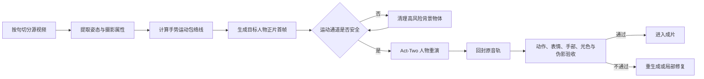

# Runway 人物替换三模式开发测试规划

> 更新日期：2026-09-22  
> 状态：本地开发规划，不涉及生产部署

## 当前阶段决策：先验证效果，暂不接 API

当前处于模型效果测试和技术准入阶段，目标是确认三种人物处理路线的实际画面质量、稳定性、成本和适用边界，而不是建设正式供应商集成。

- 暂不接入 Runway API，也不把网页自动化作为生产任务通道；
- 测试成片统一通过已经登录的 Runway 网页生成；
- 每次网页测试必须记录模型、输入素材、参数、时长、画幅、积分消耗、生成结果和验收报告；
- 优先生成 3–5 秒短样片，自动验收后只复测最接近门槛的候选，避免无效消耗积分；
- 网页生成结果只作为模型准入证据和内部测试素材，不进入正式发布链路；
- 当前不开发 API 密钥管理、供应商任务轮询、回调和生产并发；相关工作推迟到模型通过准入测试后；
- 正式生产阶段仍需改用可审计的服务端 API/Provider Worker，网页端不会作为长期生产方案。

当前网页测试顺序：Kling 3.0 Motion Control → Seedance 2.5 → Act-Two 基线。每个模型必须使用同一组固定源片和人物参考图，并通过同一套自动与人工验收标准。

## 长期生产环境兼容性判断

结论：当前技术方向可以作为长期生产架构的基础，但现阶段实现仍属于验证版，不能直接作为长期生产环境。当前先完成模型效果验证；下面的生产化要求在模型通过准入后再实施。

### 可以长期保留的技术与设计

- React、TypeScript、Node.js、Express、PocketBase/对象存储和 FFmpeg；
- 三模式作为 `ContentExecutionPlan` 的逐镜人物处理策略；
- Provider 抽象，避免业务界面和任务数据绑定 Runway 或某一个模型；
- 来源、肖像、派生制作和商业发布授权门禁；
- 按镜头执行、失败重试、质量报告、版本管理和完整 provenance；
- Runway 作为云端候选模型平台之一，而不是唯一生产供应商。

### 当前尚未达到生产要求的部分

1. **视觉验收环境**：MediaPipe、OpenCV、身份模型和口型模型应封装为固定版本的独立 QA Worker 容器；模型文件和依赖不能在生产任务运行时临时下载。
2. **质量检测覆盖**：FFmpeg 已能检查时长、音轨、冻结和整帧变化，但还需稳定实现人物分割、身份、姿态、手部、遮挡、口型和附件伪影检测。MediaPipe 只承担预检和基础门禁，不能单独认证商业质量。
3. **供应商调用**：Runway 网页适合当前模型评测，不适合长期生产。网页 UI 变化会影响幂等、并发、重试、成本核算和任务恢复；模型准入后必须改用正式 API 或可审计 Provider 接口。
4. **快速模式引擎**：当前已有策略和验收框架，但“面部＋头部＋发型”联合替换仍需完成人物跟踪、联合蒙版、遮挡恢复、颜色融合和跨帧一致性。
5. **任务基础设施**：长期任务需要持久化队列、Worker 租约、超时、熔断、幂等键、断点恢复和死信任务，不能依赖单个服务进程的内存状态。
6. **数据与成本治理**：每次调用需要保存供应商、模型版本、输入摘要、实际积分、耗时、失败原因和输出版本，并设置租户日/月预算、单镜头尝试上限和供应商切换规则。

### 正式生产阶段目标架构

```text
内容 Agent
→ ContentExecutionPlan
→ 持久化人物任务队列
→ 本地快速模式 Worker / 云端 Provider Worker
→ 独立 QA Worker
→ 编导 Agent 验收
→ 派生素材与版本库
→ 成片渲染
```

- **快速模式**：由自有 GPU 或受控推理服务完成，保证指定区域可控；
- **保真全人物**：通过 Provider Registry 动态选择模型，Runway 只是候选之一；
- **创意重演**：优先使用云端多模态视频模型；
- **QA Worker**：组合 FFmpeg、OpenCV/MediaPipe、身份模型和口型模型，独立于生成 Worker；
- **Runway 网页**：只用于当前模型准入测试，不进入正式生产任务链。

模型通过准入后，上线前至少还需完成：容器化 QA Worker、正式 Provider API、快速模式生成引擎、持久化任务队列，以及使用 10–20 条人工标注样本校准验收阈值。

## 开发进度（2026-09-23）

- [x] P0 三模式产品契约：`fast | expert | creative` 已进入前端类型、分镜计划和模式选择界面；
- [x] 快速模式固定为“面部＋头部＋发型”三项一起替换；
- [x] 专家模式候选顺序固化为 Kling Motion Control → Seedance → Act-Two；
- [x] 严格模式的生成镜头统一进入质检，不再直接显示为可用候选；
- [x] P1 第一部分：质量指标结构、缺失指标阻断及三模式阈值判定器；
- [x] PRD v3.3 对齐：三模式改为一键托管的逐镜策略，人工选择收进高级设置；
- [x] 来源与授权门禁：外部参考默认只做结构分析与创意重演，严格换人路线自动阻断；
- [x] 四级可行性已进入分镜计划：`full_fidelity / functional_equivalent / goal_degraded / blocked_for_facts_or_rights`；
- [x] 用户文案使用“保真全人物”，默认界面隐藏具体模型和供应商；
- [ ] P1 第二部分：FFmpeg、姿态、手部、身份、背景和伪影指标提取；
- [x] P1 第二部分基础层：FFmpeg 技术验收 CLI 已实现时长、音轨相关性、整帧差异、运动差异和冻结不一致检测；
- [x] P1 第二部分视觉模型基础层：MediaPipe/OpenCV 已实现姿态误差、手部 PCK、人物蒙版外背景 SSIM、面部外观代理和关键点突变统计；目标人物身份硬模型、附件/穿插检测仍待补齐；
- [x] P4 基础契约：服务端人物执行策略、预算、最大重试、fallback 和 `/person-replacement/plan` 路由已接入；
- [ ] P2 Runway 三模型固定样本小样赛；
- [ ] P3 快速模式本地逐帧替换 MVP；
- [x] P3 第一步：快速模式逐帧预检 Worker，已覆盖人脸跟踪、正/轻侧脸比例、手头遮挡、多人和跟踪跳变，并输出 JSON 门禁与诊断视频；
- [ ] P3 第二步：接入人脸解析/头发分割与目标身份生成，开始产出真正换头候选；
- [x] P3 第二步基础层：接入 MediaPipe 多类分割，产出面部＋头部＋完整头发联合蒙版，测试片相邻帧 IoU P05 为 0.8294；
- [x] P3 首个换头候选：复用已有 Act-Two 驱动结果生成本地头部回贴版，时长、帧率、分辨率和原音轨全部保持；自动验收因背景 SSIM 0.9685（门槛 0.98）失败；
- [x] P3 发型轮廓兼容门禁：目标短发对原长发区域的 P05 覆盖率只有 47.9%，已阻断该组合，避免把残留原发型伪装成成功；
- [ ] P3 第三步：使用发型轮廓兼容的已授权目标人物复测，并接入商用可合规的身份/表情驱动模型；

本阶段验证：人物策略专项测试 9/9、媒体 QA 测试 2/2、服务端转换策略测试全部通过，TypeScript 检查和 Vite 生产构建通过。历史 Act-Two 两条结果的音轨相关性均为 0.999966，整帧相似度分别为 0.699 和 0.676。视觉 QA 中，专家样片姿态误差 0.0713、背景 SSIM 0.8940、伪影计数 0；Preset 5 姿态误差 0.4150、背景 SSIM 0.7684、伪影计数 1。两条样片均未检出可配对手部关键点，严格门禁不能通过，与人工验收结论一致。

## 1. 产品结论

Runway 保留在三个模式中，但承担不同职责。严格保真与生成自由度不能共用同一条生成链路，也不能共用同一组验收承诺。

结合《PRD：灵枢 AI 经营工作台 v3.3》后，三个模式被定义为 `ContentExecutionPlan` 中的**逐镜人物处理策略**，不是“素材加工 / 爆款裂变”之外的新入口。一键托管由内容 Agent 自动选择；模式、模型和供应商只在高级设置或内部诊断中展示。

快速与专家路线仅适用于客户自有或明确授权可派生的源视频。外部爆款参考默认只能用于 `ReferenceAnalysis`、结构迁移和创意重演，不得直接保留其背景、音乐、人物或其他受保护画面。完整兼容性结论见《PRD-v3.3与人物替换三模式兼容性评审.md》。

| 模式 | 用户目标 | Runway 的职责 | 主处理链路 | 对原片的承诺 |
|---|---|---|---|---|
| 快速模式 | 面部、头部、发型一起替换 | 生成人物标准参考图、补充角度和发型素材 | 本地逐帧跟踪、头部区域替换、遮挡恢复、时序融合、原音轨回封 | 身体、服装、姿势、动作、构图、背景、口播不变 |
| 专家模式 | 完整人物替换并尽量复现原表演 | 多模型候选生成器 | Runway 候选生成 + 本地人物抠像回贴原背景 + 自动质检 + 人工终审 | 构图、出镜位置、动作节奏、口播尽量一致；未达门槛即失败，不伪装为成功 |
| 创意模式 | 用目标人物重新演绎爆款分镜 | 主生成引擎 | Runway 参考生成、编辑、扩展和重演 | 保留脚本意图和镜头功能，允许改变动作、服装、背景、机位和构图 |

## 2. 三个模式中的 Runway 用法

### 2.1 快速模式：精准换头

快速模式不直接使用 Runway 视频生成结果作为成片。Runway 只负责把企业人物资产整理为正面、左右侧面、不同表情和统一光照的参考图组。本地管线完成：

1. 检测并跟踪原人物面部、头部、头发和遮挡关系；
2. 生成每帧联合替换蒙版，三项必须一起替换；
3. 保留原身体、服装、双手、背景和全部运动；
4. 对边缘、肤色、光照和连续帧做融合；
5. 直接复制原音轨，不重新生成语音；
6. 蒙版外像素变化超过门槛时整条任务失败。

这样才能兑现“只换面部＋头部＋发型”的产品承诺。Aleph/Edit Studio 属于全帧生成，只适合作为内部实验或失败镜头的人工备选。

### 2.2 专家模式：全人物保真重演

专家模式将 Runway 当作候选模型平台，而不是默认只调用 Act-Two。第一轮测试顺序：

1. **Kling 3.0 Motion Control**：优先测试。它明确以参考视频传递全身动作、手势和表情，并支持保留原声；选择 Video Orientation，提示词要求固定机位和静态背景。
2. **Seedance 2.5 Edit / Reference**：第二候选。用原视频约束结构、动作和声音，用人物图约束身份；成本更高，只测试 Kling 未通过的代表镜头。
3. **Act-Two**：仅作为正面、半身、低遮挡、低手势幅度的口播兜底。人物图路线会自行增加环境运动，不能承担严格锁定背景和构图的承诺。
4. **Aleph/Edit Studio**：不进入专家模式自动主链路。

每个模型的输出都先提取人物蒙版，再回贴到原视频背景底片。之后通过姿态、手部、身份、背景、口型、音轨和时长门禁；任何硬指标失败都不得进入正式成片。

### 2.3 创意模式：人物创意重演

创意模式由 Runway 主导：

- Act-Two：半身人物表演和口播；
- Kling Motion Control：动作复刻和全身表演；
- Seedance Reference/Edit：多参考人物、场景、视频和音频联合控制；
- Aleph/Edit Studio：改服装、环境、光线和整体视觉；
- Agent/Workflows：编排候选模型和重试。

该模式仍保留口播文本、品牌禁用项、时长范围和镜头意图，但界面必须明确提示允许重构画面，不能显示“原构图与姿势锁定”。

## 3. 已完成实测及结论

| 路线 | 结果 | 可保留能力 | 主要失败 |
|---|---|---|---|
| Aleph 2.0，5 秒 | 不通过 | 可理解编辑意图 | 改变服装、背景、光线、人物比例和口型；整帧重绘 |
| Act-Two，自有人物图，5 秒 | 不通过 | 原音轨波形相关系数约 0.99996 | 原 L 手势消失，构图和服装变化 |
| Act-Two，平台医生示例，5 秒 | 不通过 | 有手部运动，原音轨保留 | 原单手手势变为双手新动作，听诊器拉伸漂浮并穿过面部 |

结论：Act-Two 可以继续用于低动作口播和创意模式，但当前证据不支持把它定义为专家模式的唯一引擎。

## 4. 下一步开发阶段

### P0：三模式产品契约（0.5–1 天）

- 将 `PersonReplacementMode` 扩展为 `fast | expert | creative`；
- 三种模式分别配置锁定项、风险提示、输入要求和验收规则；
- 快速模式文案固定为“面部＋头部＋发型一起替换”；
- 专家模式所有生成镜头默认进入自动质检，不再默认标记为可用；
- 创意模式移除姿势、构图、服装和背景的硬锁定；
- 在提交前展示预计秒数、模型、分辨率和积分预算。

### P1：自动验收工具（2–3 天）

先开发验收，再继续付费试模型，避免只靠肉眼反复消耗积分。

- FFmpeg/ffprobe：时长、帧率、分辨率、音轨和逐帧抽样；
- MediaPipe Pose/Hands：身体关节和手部轨迹；
- 人脸识别：目标人物身份相似度；
- 人物分割：人物区域与背景区域分开测量；
- SSIM/LPIPS：背景、身体和整体结构差异；
- 光流与关键点抖动：检测闪烁、漂移和瞬移；
- 异常规则：手穿脸、肢体突变、附件拉伸、多人增生、画面冻结；
- 输出可视化报告：并排视频、差异热图、失败时间码和指标 JSON。

首版建议门槛：

| 指标 | 快速模式 | 专家模式 | 创意模式 |
|---|---:|---:|---:|
| 时长差 | 不超过 1 帧 | 不超过 1 帧 | 不超过 0.25 秒 |
| 原音轨相关系数 | ≥ 0.995 | ≥ 0.995 | 文本一致或用户允许换声 |
| 蒙版外背景 SSIM | ≥ 0.98 | ≥ 0.95（回贴后） | 不设硬门槛 |
| 身体姿态归一化误差 | 原身体不变 | ≤ 0.06 画面对角线 | 不设硬门槛 |
| 手部关键点 PCK | 原双手不变 | ≥ 0.85 | 不设硬门槛 |
| 目标身份 | 必须通过 | 必须通过 | 必须通过 |
| 明显肢体/附件伪影 | 0 | 0 | 人工复核 |

这些阈值先作为基准线，用 10–20 条人工标注样本校准后再冻结。

### P2：专家模式模型小样赛（1–2 天）

建立 3 类固定测试片，每类先裁 3–5 秒：

1. 正面口播 + 单手明确手势；
2. 手靠近脸部 + 短暂遮挡；
3. 半身或全身移动 + 身体转向。

人物参考图统一要求：单人、四肢可见、无易漂浮附件、姿态和源视频起始帧相近。每个模型先只跑一版：Kling Motion Control、Seedance 2.5、Act-Two 基线。自动验收后仅对得分最高且接近门槛的模型再跑一次，建议本轮设置 300 积分上限。

输出模型排行榜，不只记录“好/不好”：

- 身份 20%；
- 姿态与手势 30%；
- 构图与背景 20%；
- 口型和音频 15%；
- 时序稳定与伪影 15%。

专家模式只有在至少一种模型连续通过三类测试后才开放正式生成按钮；否则保持“实验预览”。

### P3：快速模式本地 MVP（3–5 天）

- 头部联合蒙版和逐帧跟踪；
- 企业人物参考图规范化；
- 遮挡层恢复，手经过面部时保持前后关系；
- 时序融合、颜色和光照匹配；
- 原音轨无损回封；
- 2–3 秒预览、失败时间码和局部重试；
- 接入 P1 自动验收。

先用当前 5 秒口播测试片通过，再增加侧脸、快速转头、手遮脸、眼镜和长发样本。

### P4：统一任务编排（3–5 天）

- 建立 `PersonReplacementProvider`，UI 不绑定具体模型；
- 保存输入快照、模型版本、参数、积分、输出和质量报告；
- 支持排队、取消、失败阶段重试和候选版本对比；
- 专家模式按输入条件路由模型，并允许降级为人工复核；
- 当前测试阶段统一使用已登录的 Runway 网页生成模型基准成片，暂不接 API；模型准入后，正式产品再接可审计的服务端任务接口。

### P5：创意模式（2–3 天）

- 增加创意强度、服装、场景、镜头和动作提示；
- 提供“保留口播”“允许换声”独立开关；
- 输出 2–3 个候选并进入现有分镜版本管理；
- 验收重点改为身份、内容、连续性、口播和商业观感。

## 5. 推荐执行顺序

立即完成 P0 和 P1；随后并行推进 P2 小样赛与 P3 快速模式 MVP。P2 决定专家模式最终采用哪一个 Runway 模型，P3 则建立真正可兑现严格保真的基础能力。最后接统一任务编排和创意模式。

这一顺序不会因为单个云端模型更新而推翻产品架构，也能最早得到一个可用、可验收的快速模式。

## 6. Kling 3.0 Motion 受控小样（2026-09-23）

本轮只生成一次，不使用相同模型、输入和参数自动复测。

- 输入：`IMG_1865-first5s-SDR.mp4`，5 秒、1080 × 1920、24fps、原声；
- 目标人物：Runway 资产中的男性人物图；平台先将参考图匹配为源视频 9:16 输出比例；
- 模型与参数：Kling 3.0 Motion，720p，Character Orientation = Video，Original Sound = On；
- 提示词：要求传递原表演、表情、口型和手势，并锁定固定机位、构图、时序、姿势和口播；
- 成本：65 credits，余额 972 → 907；
- 输出：5 秒、720 × 1280、30fps、H.264 + AAC。

自动验收：时长差 0 帧，整帧相似度 0.7007，姿态归一化误差 0.1299，背景 SSIM 0.8863，关键点突变 0。五个整秒抽帧显示人物身份稳定，原 L 形单手手势在语义、左右手和大致时序上明显优于 Act-Two；但人物尺度、肩线、服装和参考图自带墙面图案进入成片，未锁定原构图与原背景。手部模型仍未获得可配对关键点，专家模式严格门禁不能通过。

音频两侧均为 48kHz 双声道 AAC，长度一致；逐样本波形相关性为 -0.022，但允许 0.75 秒时移后的峰值相关性为 0.473，短时对数频谱余弦为 0.758、能量包络相关性为 0.764。说明音轨并非可验证的无损复制，现有证据也不足以证明口播文本被改写；在 ASR 文本一致性加入前，口播项标记为“待复核”，不能通过硬门禁。

模型准入结论：**Kling 3.0 Motion 不进入专家模式正式成片主链路**。它可保留为创意模式和专家实验预览候选，并作为后续“人物生成后回贴原背景”方案的候选人物层。下一次付费测试应切换 Seedance 路线；只有发现明确输入或参数错误并能预测改善指标时，才提出一次 Kling 复测，不能自动消耗积分。

## 7. 人物层回贴原背景 MVP（2026-09-23）

已新增 `scripts/person_layer_composite.py`，以原视频为时间轴和背景，使用 MediaPipe Selfie Segmentation 提取 Kling 人物层，逐帧清除原人物区域、羽化合成，并通过 FFmpeg 直接复制原音轨。全流程本地运行，不新增 Runway 积分消耗。

三轮自检后的 V3 输出为 `kling-person-layer-original-background-mvp-v3.mp4`：5 秒、720 × 1280、24fps，时长差 0 帧，原音轨相关性 1.000，背景 SSIM 0.9522，姿态误差 0.1265，关键点突变 0。相较 Kling 原始输出的背景 SSIM 0.8863，回贴方法已证明能够恢复并锁定大部分原背景；右侧目标图自带蓝色墙面图案被移除。

当前仍不准入专家正式成片：姿态误差高于 0.06；手部 PCK 缺失；MediaPipe 人像分割会漏掉源片快速手势，少数帧在新人物肩后留下浅红色手部残影。下一版需要将 Pose/Hands 关键点生成的肢体胶囊蒙版与人物分割蒙版取并集，并用 SAM 2/MatAnyone 或视频修复模型替代 OpenCV 大区域逐帧修复。

### Pose/Hands 联合蒙版 V4

已在本地合成脚本中加入肩、肘、腕、拇指、食指和小指端点组成的双臂胶囊蒙版，并分别并入源人物清除区域和候选人物保留区域。V4 保持 0 Runway credits，5 秒视频本机处理约 3–4 分钟。

V4 指标：背景 SSIM 0.9519、姿态误差 0.1246、原音轨相关性 1.000、关键点突变 0。相较 V3 的背景 SSIM 0.9522、姿态误差 0.1265，数值基本持平，仅有轻微姿态改善。整秒抽帧显示快速抬手残影仍存在，原因不是单纯的肢体蒙版范围不足，而是 OpenCV 大区域修复会从人物边缘采样红色/肤色像素重新填回背景。

结论：低成本 Pose/Hands 升级已完成，但不能单独解决当前残影。下一有效技术步骤应直接更换背景修复器，使用时序视频修复或静态机位 clean plate；继续调整基础蒙版阈值的收益很低。

### 静态机位 Clean Plate V5–V7 与神经修复接口

新增 `clean-plate` 背景模式：从源视频多帧收集人物区域外的可见像素，对永久遮挡区进行低分辨率修复，再作为统一背景底图。视觉最佳版本为 V6：5 秒素材本机约 35 秒完成，背景 SSIM 0.9456、姿态误差 0.1195、原音轨直接复制。它显著减少了手部残影并移除了目标图背景，但静态底图会丢失原背景细微时序变化，未达到 0.95 门槛。V5/V7 的实拍区与修复区混合会形成固定轮廓线，已废弃并将脚本恢复为 V6 配置。

已新增 `scripts/person_replacement_repair_bundle.py`，可导出逐帧原画和人物＋肢体清除蒙版；当前固定样本已生成 120 帧图片和 120 帧蒙版。`person_layer_composite.py` 新增 `--background-video`，GPU 修复服务返回无人物背景视频后可直接接回人物合成与原音轨回封。

生产选型限制：ProPainter 官方许可仅限非商业用途，不能进入灵枢生产链路；SAM 2 主要解决视频分割，不负责背景生成。生产修复器应选择可商业使用的实现，例如 Apache-2.0 路线，并在独立 GPU worker 中运行。当前本机没有 PyTorch/GPU 修复运行时，因此本阶段完成可审计输入包和回接接口，不在 Mac 上安装重型 CUDA 模型。

## 8. 快速模式本地 MVP 实测（2026-09-23）

快速模式已形成可重复执行的本地链路：`fast_head_preflight.py` 先检测单人、正侧脸、手遮挡、跟踪跳变和头发蒙版稳定性；`fast_head_composite.py` 将 Runway Act-Two 提供的目标人物动态头部按面部锚点回贴原视频，只替换面部、头部和发型，并直接复制原音轨；`fast_head_pipeline.py` 串联预检、合成、技术验收和视觉验收，统一输出 JSON 证据。手部遮挡恢复使用手部关键点定位与皮肤分割交集，避免仅按骨架线条回贴。

固定 5 秒源片预检通过：人脸检出率 100%、正脸至轻侧脸 100%、手部遮挡帧 18.33%、多人脸 0%、跟踪跳变 P95 0.009627、头部蒙版时序 IoU P05 0.829361。新增长发目标使用 Runway Act-Two 生成一次，成本 25 credits；后续合成与验收均为本地处理，不新增 Runway 成本。

V5 成片保持 1080 × 1920、24fps、5 秒，时长差 0 帧，原音轨相关性 1.000，姿态误差 0.04764，手部 PCK 0.97619，关键点突变 0。它证明原身体、姿势、手势节奏、构图、背景时间轴和口播音轨可以保留，目标人物面部与长发也能随表情驱动。

本样片仍未通过正式门禁：目标头发轮廓覆盖原头部区域 P05 为 82.71%，低于 90%；背景 SSIM 为 0.96190，低于快速模式 0.98。画面中仍能看到原人物较长发梢，手进入头发区域时也会暴露源人物与目标人物肤色差。尝试仅把目标头发层横向放大 1.16、纵向放大 1.12 后，覆盖率只提高到 84.50%，同时出现双层发丝轮廓，因此该方法不作为默认方案。

结论：快速模式在“目标发型轮廓覆盖原发型、单人正面或轻侧面、手遮挡较少”的条件下进入有限场景可用；当前长发源片与目标资产组合被自动阻断，不能伪装为通过。已新增 `fast_target_compatibility.py`，在调用付费模型前比较目标参考图与源片头发轮廓；同一目标图的生成前预测覆盖率为 83.37%，与成片 82.71% 接近，能够在本轮生成前正确阻断并节省 25 credits。只有预测覆盖率达到 90% 才进入 Runway 生成；未达到时要求选择更宽、更长的目标发型或切换专家/创意路线。

人工抽帧时发现 V5 的头顶灰色椭圆晕圈来自辅助连通椭圆被错误并入最终蒙版。V6 已改用真实面部凸包，只让语义头发与面部像素进入合成层；晕圈消失，背景 SSIM 从 0.96190 提升至 0.97102。修正后的真实发型覆盖率为 78.95%，说明旧算法还高估了覆盖程度。V6 仍可见头顶和胸前旧发梢、脸颈肤色切口以及手遮挡时的肤色差，因此人工验收仍判定不通过。

## 9. 光头男性＋农村厨房目标人物测试方案（2026-09-23）

下一轮使用固定 3 秒口播源片验证“逐句生成正片首帧，再由视频模型重演原表演”的路线。目标人物设为虚构的 35–45 岁东亚成年光头男性，穿深蓝色圆领上衣；目标场景为真实、朴素的中国农村厨房。生成首帧时以源视频第一帧为构图参考，保持 9:16 竖屏、固定机位、人物尺度、出镜位置、上半身姿势、肩线、手臂位置、头部角度和视线方向，不添加文字或其他人物。

这一样本同时承担两类验证：一是光头轮廓能否消除快速模式中旧发梢残留和双层发型的问题；二是整张正片首帧能否让后续人物重演从一开始就锁定目标人物、服装和农村厨房场景。它属于首帧驱动的专家模式候选测试，不代表快速模式已经支持更换背景；快速模式的正式约束仍是只替换面部、头部和发型，并保留原身体、服装、构图、姿势、动作、背景和口播。

执行顺序：先生成并人工验收目标首帧，再以同一张首帧分别运行 Act-Two 和可用的动作控制候选；生成时保留原音频或在本地回封原音轨。若整段人物、背景或服装漂移，则按句切分为 2–4 秒片段，为每句生成对应首帧后分别驱动，最后按原时间轴拼接。

验收重点包括：光头边界连续且无原发丝残留；五官和身份跨帧稳定；每一句的表情、口型、头部运动、手势和身体动作与源片时间点对应；固定机位、人物尺度和构图不漂移；农村厨房的灶台、墙面、炊具等结构不跳变；原口播内容、时长和音轨保持一致。专家模式继续使用姿态误差 ≤ 0.06、手部 PCK ≥ 0.85、回贴后背景 SSIM ≥ 0.95、原音轨相关系数 ≥ 0.995、明显伪影为 0 的门槛。

阶段记录：目标图第一次生成任务在完成前被中止，当时没有产生可验收图片，也未消耗 Runway 视频生成积分；后续已按下述方案恢复并完成测试。

### 两条技术路线实测结果

目标首帧已重新生成完成：虚构的东亚成年光头男性、深蓝色圆领上衣、真实农村厨房，9:16 构图。使用同一目标首帧和 `source-first3s-moderated.mp4` 对照测试两条路线：

1. **Act-Two 表演迁移**：输出 3.04 秒、720 × 1280、24fps，消耗 20 credits。前三秒人物身份、光头轮廓、服装和厨房保持稳定；姿态误差 0.04237，通过专家模式 0.06 门槛；表情轨迹 MAE 0.01705、口部轨迹 MAE 0.03304，均优于本轮 Seedance。手势语义和时点基本正确，但手靠近面部时有明显运动模糊，自动手部 PCK 0.90476 仅来自 1 个可配对样本，证据量不足，仍需人工终审。
2. **Seedance 2.5 图像＋视频联合参考**：输出 5.04 秒、720 × 1280、24fps，消耗 195 credits。人物、光头、服装和农村厨房的视觉一致性较好，L 形手势的轮廓比 Act-Two 更清楚；但姿态误差 0.08627、手部 PCK 0.07143、表情轨迹 MAE 0.02204、口部轨迹 MAE 0.04059，均未达到本轮保真目标。模型最短生成 5 秒，而驱动片只有 3 秒，后 2 秒属于模型续写，不能算作原表演复刻。

Kling 3.0 Motion 使用该目标图提交时被平台内容审核拒绝，积分自动退回，没有生成可比较样片。为避免对同一组合重复触发审核，本轮将第二条有效对照路线改为 Seedance 2.5。

本轮实际扣除 215 credits：Runway 余额由 810 降至 595，其中 Act-Two 为 20 credits，Seedance 2.5 为 195 credits，Kling 拒绝任务未计费。所有验收文件保存在 `/Users/julia_chen/Downloads/edit/runway-person-test/bald-rural-kitchen/`：

- `bald-man-rural-kitchen-keyframe-v1.png`：目标正片首帧；
- `act-two-bald-rural-kitchen-first3s-v1.mp4`：Act-Two 三秒结果；
- `seedance-bald-rural-kitchen-v1.mp4`：Seedance 五秒结果；
- `source-acttwo-seedance-first3s-comparison.mp4`：源片、Act-Two、Seedance 前三秒三栏对照；
- `source-acttwo-seedance-contact-sheet.jpg`：0、1、2 秒人工抽帧对照；
- `expression-report.json`：逐帧表情与口部轨迹指标；
- `act-two-visual-qa.json`、`seedance-visual-qa.json`：姿态、手部和时序伪影指标。

背景 SSIM 没有作为本轮准入依据，因为目标首帧按测试要求主动把原白墙场景改成了农村厨房；源背景与目标背景本来就不同。人工抽帧确认两条路线在前三秒均能保持农村厨房的主要结构，未出现明显场景跳切。

本轮结论：**Act-Two 作为逐句首帧驱动的默认方案更合适**。它在姿态和逐句表情指标上更接近源片，成本约为 Seedance 的十分之一，并能按 3 秒原时长输出。Seedance 可保留为手势轮廓或场景质感的高成本候选，但当前结果不足以证明 195 credits 带来更高的整体复刻度。正式链路应按句切成 2–4 秒，生成对应正片首帧，默认走 Act-Two，再回封原音轨并执行自动验收；只有 Act-Two 的手部或遮挡失败且镜头价值足够高时，才升级到 Seedance 候选。

### 下一阶段：逐句首帧锁定光线与画风

当前样片已经证明人物身份、光头轮廓、场景和主要动作可以复刻，但目标首帧使用了明显的暖色窗光、较高动态范围和偏摄影棚式的清晰度，与源片柔和、均匀、低对比度的手机口播画面不一致。视频模型会继承并放大首帧的摄影属性，因此只锁人物和构图仍不足以实现画面风格保真。

下一版将每句话的源视频起始帧作为正片首帧生成底图。生成时除人物、服装和场景外，还必须锁定：主光方向、阴影位置与软硬程度、色温、曝光、对比度、饱和度、焦段、透视、景深、人物尺度、手机画质、锐度、噪点和压缩质感。提示词不使用会主动改变摄影风格的宽泛描述，例如“电影感”和“商业大片”。

每个镜头保存结构化视觉参数：`lightingDirection`、`colorTemperature`、`exposure`、`contrast`、`saturation`、`depthOfField`、`cameraAngle`、`subjectScale`、`backgroundLayout` 和 `visualStyle`。同一分镜的重新生成必须复用这些参数。默认按口播句子切成 2–4 秒；若一句内部姿势或光线变化明显，则增加中间锚点或末帧约束。

生成后增加本地视觉归一化：以受控首帧为基准，逐帧校正曝光、白平衡和对比度；人物肤色与背景分别匹配；恢复源片的锐度、噪点和压缩质感；检测相邻帧的亮度、色温和饱和度跳变。该阶段不新增 Runway credits。

下一轮 A/B 测试固定使用同一段 3 秒驱动片、同一光头男性和同一农村厨房：A 为上一版暖色窗光首帧，B 为按源片摄影属性生成的柔和均匀光首帧。两版均走 Act-Two。除姿态、手部和表情指标外，新增首帧色彩距离、逐帧曝光漂移、白平衡漂移、背景结构稳定性和主观画风一致性评分。若 B 版动作指标不退化且画风一致性明显提高，则“正片首帧摄影属性锁定”进入专家模式默认链路。

#### A/B/C 实测进展：锁光有效，但首帧必须清空手势运动通道

2026-09-23 已使用同一段 `source-first3s-moderated.mp4` 完成三版 Act-Two 对照，每版均为 3 秒、9:16、手势开启：

- **V1 暖色窗光基线**：表情轨迹 MAE 0.017051，口部轨迹 MAE 0.033036，姿态误差 0.04237。动作可用，但中心画面亮度、反差、色彩和饱和度与源片差异明显。
- **V2 摄影属性锁定**：表情轨迹 MAE 降至 0.015685，口部轨迹 MAE 降至 0.027020，姿态误差 0.04922。相对 V1，亮度均值误差从 46.43 降至 30.65，综合色彩误差从 2.67 降至 1.32，饱和度误差从 20.24 降至 4.54，证明控制首帧光线、白平衡、反差和饱和度有效。但是人物抬手时，背景锅铲被误带到前景并穿过面部，属于严重伪影，V2 不通过人工验收。
- **V3 锁光＋清洁手势通道**：在 V2 基础上清除人物头肩和双手运动路径后方的锅、铲、碗及反光器具，只保留哑光旧墙和画面边缘的农村厨房信息。表情轨迹 MAE 进一步降至 0.015229，口部轨迹 MAE 0.028095，眉眼轨迹 MAE 0.008796，姿态误差 0.04262；亮度误差 26.02、反差误差 22.12、饱和度误差 3.69，均为三版最佳。人工抽帧确认 V2 的金属器具穿脸伪影已经消失，L 形手势、闭眼和口型时点仍与源片对应。

V3 的自动手部 PCK 为 0.51190（4 个可配对样本），没有达到专家模式 0.85 门槛。抽帧显示主要原因是近镜头手掌尺度、遮挡和身份变化导致关键点距离增大，并非再次出现背景器具伪影。因此当前结论是：**V3 是三版中最好的视觉方案，但仍属于专家模式候选，不应直接自动放行**。正式链路需同时执行人工伪影检查；自动手部指标低时进入局部修复或候选重生成。

本轮新增两次 Act-Two 生成，共消耗 40 credits，余额由 595 降至 555。新增文件保存在 `/Users/julia_chen/Downloads/edit/runway-person-test/bald-rural-kitchen/`：

- `bald-man-rural-kitchen-lightlocked-v2.png`：按源片摄影属性重新生成的锁光首帧；
- `act-two-bald-rural-kitchen-lightlocked-first3s-v2.mp4`：V2 锁光成片；
- `bald-man-rural-kitchen-lightlocked-clean-corridor-v3.png`：清除手势运动通道背景器具的 V3 首帧；
- `act-two-bald-rural-kitchen-lightlocked-clean-corridor-first3s-v3.mp4`：V3 成片；
- `source-acttwo-v1-v2-v3-comparison.mp4`：源片、V1、V2、V3 四栏动态对照；
- `source-acttwo-v1-v2-v3-contact-sheet-3frames.jpg`：三时点四栏抽帧；
- `expression-report-v1-v2-v3.json`、`lighting-style-report-v1-v2-v3.json`、`act-two-v3-visual-qa.json`：表情、光色和姿态验收数据。

由本轮结果新增首帧硬约束：人物头部、肩部、前臂和预计手势包络线后方不得出现悬挂器具、细长物体、反光金属、文字、格栅或高对比边缘；农村厨房语义应放在画面外缘、低于桌面或静态远景。首帧预检必须先根据驱动视频姿态关键点计算手势运动包络线，再对该区域做显著物体检测。检测不通过时先清理背景，不直接提交视频生成。

#### 为什么 V3 最好，以及值得产品化的能力

V3 的优势不是单纯提高画面观感，而是同时解决了画风偏差和生成伪影两个影响交付的问题。V1 的动作稳定，但首帧偏暖、反差较大，带有明显的生成图摄影质感；V2 把亮度、白平衡、反差和饱和度拉近源片，却因为背景锅铲位于手势运动路径内，在人物抬手时出现器具穿过面部的严重伪影；V3 保留锁光效果，同时清空人物头肩、前臂和双手运动区域后方的复杂物体，因此取得当前最好的综合结果。

| 指标 | V1 | V2 | V3 | 结论 |
| --- | ---: | ---: | ---: | --- |
| 表情轨迹 MAE，越低越好 | 0.017051 | 0.015685 | **0.015229** | V3 最接近源表情变化 |
| 姿态误差，越低越好 | **0.04237** | 0.04922 | 0.04262 | V3 基本追平 V1 |
| 亮度均值误差，越低越好 | 46.43 | 30.65 | **26.02** | V3 最接近源曝光 |
| 反差误差，越低越好 | 26.54 | 24.98 | **22.12** | V3 最接近源反差 |
| 饱和度误差，越低越好 | 20.24 | 4.54 | **3.69** | V3 最接近源色彩强度 |
| 明显背景物体伪影 | 无 | 锅铲穿脸 | **无** | V3 修复 V2 的严重回归 |

值得产品化的不是某一张 V3 首帧，而是以下可重复执行的生产链路：

1. **源片摄影属性自动提取**：逐镜头提取曝光、色温、反差、饱和度、主光方向、阴影软硬、锐度、噪点和压缩质感，并把结果作为目标首帧的硬约束，避免换人后自动变成另一种光线或画风。
2. **手势运动包络线预检**：在生成目标首帧前，先根据驱动视频中的头部、双肩、手肘、手腕和手指关键点计算运动包络线，标出人物动作可能经过的背景区域。
3. **高风险背景物体检测与清理**：检查运动包络线内是否存在锅铲、细长物体、反光金属、文字、格栅、树枝或高对比边缘。检测失败时只清理风险区域，保持人物、构图、光线和场景语义不变。场景特征应放在画面外缘、桌面以下或确定不会与人物动作交叠的静态区域。
4. **逐句首帧驱动**：默认按口播句子切成 2–4 秒，根据每句开始时的姿态、表情和摄影属性生成对应首帧，再使用 Act-Two 重演，降低长片段中的人物、动作和画风漂移。
5. **生成后多指标门禁**：同时检查姿态、表情、口型、手部、背景稳定性和明显伪影。手部指标不足或发现遮挡伪影时，不直接交付，自动进入候选重生成、背景清理或局部修复。

建议的专家模式默认链路如下：



V3 证明“动作分析 → 摄影属性锁定 → 手势通道清理 → Act-Two 重演 → 自动验收”具有产品化价值。当前仍不能直接自动放行：V3 的手部 PCK 为 0.51190，低于专家模式 0.85 门槛。下一阶段应优先实现首帧风险预检、失败自动重试和局部修复，而不是继续无约束地更换视频模型。

## 2026-09-24 Seedance 2.0 Fast：真实人物素材提示词消融测试

使用同一段 3 秒工厂英文口播、同一目标人物全身照完成三种专家模式提示词结构。目标人物照片先单独登记，第二条消息只上传驱动视频，避免网页端两个附件偶发只绑定一个。所有输出固定 9:16、4 秒，前 3 秒原速、第 4 秒冻结末帧。

| 结构 | 整帧相似度 | 姿态误差 ↓ | 手部 PCK ↑ | 双腕运动相关性 ↑ | 背景 SSIM ↑ | 结论 |
| --- | ---: | ---: | ---: | ---: | ---: | --- |
| V1 均衡职责与保真约束 | 0.7346 | 0.0911 | 0 | -0.2409 | **0.3323** | 综合最稳，但合手时点错位 |
| V2 三段动作时间锚点 | 0.7392 | **0.0807** | **0.1822** | -0.0289 | 0.3066 | 局部姿态改善，双手来回振荡 |
| V3 极简素材职责 | **0.7623** | 0.2357 | 0 | **0.1062** | 0.2872 | 运动趋势略好，景别与场景严重漂移 |

完整文件与逐帧时间序列位于 `output/seedance-user-two-tests/edit/`。验收器新增肩宽归一化的 `wristSeparationMae`、`wristMotionCorrelation` 和 `wristSeparationTimeline`，用于识别“整体姿态相似、手势时点却错误”的假通过。

本轮得到的提示词边界如下：

1. **不要把每个手势翻译成详细自然语言动作。** Seedance 会同时响应视频运动条件和文字动作，两者竞争时会产生提前合手、重复开合或额外挥手。
2. **也不能只写一句‘逐帧复制’。** 极简提示会降低构图与背景约束权重，模型会主动选择更标准的工厂景别。
3. **Seedance 候选使用 V1 的中等长度模板。** 只写清照片与视频的职责、人物替换范围、固定镜头与背景、音频时间轴和输出时长；动作细节交给驱动视频，不再写语义动作清单。
4. **一次提示词不能保证全部要求。** 同一模型与素材仍有明显随机性。若保留 Seedance 路线，应同提示词生成 2–3 个候选，再按姿态、双腕运动、背景和身份稳定性自动选片；仍未过门槛则切 Act-Two 或局部修复，不能继续无限追加提示词。

推荐的 Seedance 专家模式候选模板：

> 沿用已登记的全身照片，只作为目标人物身份、完整发型、体型和服装参考。使用本次驱动视频作为唯一镜头、构图、人物位置与尺度、身体与双手运动、头部与表情、嘴型、英文口播节奏、背景和照明轨道。将源人物从头到脚整体替换为目标人物；保持固定机位、焦距、裁切和源时间轴，不增加动作、运镜、场景、产品镜头或文字。前 N 秒与源视频同速，剩余平台最短时长冻结末帧。原音轨由后处理回封。

这套模板用于生成候选，不代表严格保真承诺。要满足构图、姿势、口播和背景全部不变，当前默认方案仍是逐句首帧锁定的 Act-Two 重演；快速模式则必须使用头部跟踪、分割和局部合成。Seedance 2.0 Fast 仅作为专家模式补充候选。
