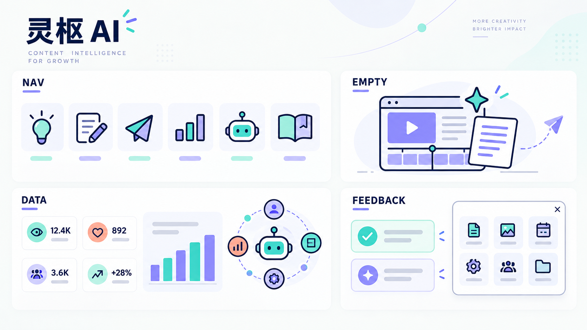

# 灵枢 AI 视觉语言 V1

这份文档用于统一灵枢 AI 的页面风格、信息密度、弹窗尺寸、操作反馈和社媒平台标识。目标不是把页面做得更“花”，而是让用户一眼看懂：现在在哪里、系统正在做什么、下一步能做什么。

## 视觉方向板

视觉关键词：**深海军蓝粗轮廓、青绿 / 薰衣草双色、几何模块、清晰留白、带业务含义的小型图形**。

这张方向板包含四种可复用表达：

| 模块 | 用途 | 页面示例 |
| --- | --- | --- |
| NAV | 小尺寸功能图标，强调轮廓和双色填充 | 左侧导航、功能入口 |
| EMPTY | 用插画解释“这里以后会出现什么” | 我的创作空状态、暂无任务 |
| DATA | 数字 + 小型图表 + 状态关系 | 智能经营、内容监控、投放总览 |
| FEEDBACK | 成功/提示浮层与固定尺寸弹窗 | 开始生成、保存设置、验收、发布 |

> 说明：方向板中的数据仅用于展示视觉结构。产品页面只显示业务系统真实回传的数据，未知值继续显示“—”或“待接入”。

## 1. 基础风格

### 色彩

| 角色 | 色值 | 使用方式 |
| --- | --- | --- |
| 主轮廓 | `#10244A` | 图标轮廓、主要标题、关键按钮 |
| 青绿 | `#2FD1C5` | 成功、运行中、内容增长 |
| 薰衣草 | `#8B7CF6` | 智能能力、数据洞察、辅助强调 |
| 珊瑚橙 | `#FF8E72` | 待处理、风险提醒、成本信号 |
| 薄荷底 | `#DDF8ED` | 青绿模块的浅背景 |
| 页面底 | `#F8FAF8` | 工作区背景 |

同一张卡片最多使用一个主强调色和一个辅助强调色。真实社媒平台颜色不被这套色彩覆盖。

### 图形

- 功能图标使用 2–3 px 的深蓝轮廓，并带一块青绿或薰衣草填充。
- 图标必须来自明确的业务隐喻，例如灵感=灯泡、发布=纸飞机、经营=图表；避免无意义的四角星、随机机器人头像和通用魔法棒堆叠。
- 大插画由界面真实对象组成，例如视频框、口播稿、时间轴、数据图、Agent 协作关系；不能用纯装饰占据页面。
- 小尺寸图标背景统一为圆角方形，激活态使用青绿到薰衣草的淡双色底。

## 2. 信息密度与页面构成

一个业务首页至少包含三层信息：

1. **结果层**：当前最重要的数字与状态。
2. **解释层**：趋势、构成、覆盖范围或任务分布。
3. **行动层**：用户下一步可执行的操作。

例如“智能经营”不能只放四张数字卡。四个核心数字下面继续显示内容队列、完成交付、等待验收、运行中 Agent，以及四个平台的真实覆盖情况。没有数据时保留结构并明确显示 0 或待接入，不能用模拟趋势补空。

“我的创作”没有任务时，使用创作流程插画 + 三步说明 + 单一主按钮。空状态区域保持足够高度，让页面看起来是完整的工作台，而不是只剩一个小提示。

## 3. 弹窗与选择框

### 固定尺寸

| 弹窗类型 | 宽度 | 高度 | 适用场景 |
| --- | --- | --- | --- |
| 紧凑型 | 768 px | 576 px | 路径选择、阶段选择、确认操作 |
| 标准型 | 1024 px | 736 px | 详情预览、生产实况 |
| 宽屏型 | 1280 px | 800 px | Agent 设置、新手引导、复杂配置 |

高度受视口限制；内容不足时保持框架高度，内容过多时只滚动弹窗内部。标题区、内容区、底部动作区的位置固定。

### 栅格

- 选项卡使用自动等宽栅格；桌面端单项最小宽度 240 px。
- 普通表单默认两列；移动端统一回落为一列。
- 同一层级的选择项必须同高，不允许一个选项单独占一整排，除非它是长文本输入或上传区。
- 主按钮固定放在右下角或内容流程的自然终点；取消/返回使用次级样式。

## 4. 操作反馈

所有会改变数据或启动任务的动作都要给出明确反馈：

- 开始生成：`成功开始生成 👏`，并说明任务已进入“我的创作”。
- 保存设置：说明保存成功，以及从何时生效。
- 验收内容：说明单条或整批结果已保存。
- 登记发布 / 回传数据：说明后续数据会进入复盘。
- 失败：保留用户刚才的输入，指出失败原因和可重试动作。

成功反馈采用右上角浮层，默认停留约 4 秒，可手动关闭。页面内仍保留与任务状态强相关的长期提示，两者不互相替代。

## 5. 真实社媒平台标识

YouTube、TikTok、Instagram、Facebook、Messenger 等真实平台，在按钮、筛选、账号卡、内容标签和数据排行里使用各自真实品牌图形。平台文字仅用于：

- 屏幕阅读器标签；
- 原生下拉选项的兼容显示；
- 必须区分产品名称的说明性正文。

不允许用通用播放、相机、地球或首字母圆形图标代替真实平台标识；也不把真实平台 Logo 改成灵枢的青绿/薰衣草双色。

## 6. 已落地范围

- 左侧导航：新增双色粗线几何图标体系。
- 全局反馈：新增成功、信息、提醒、错误四种浮层反馈。
- 核心弹窗：制作方式、社媒阶段、Agent 生产实况、Agent 设置、新手引导、内容动作和成品预览采用固定尺寸规范。
- 智能经营：核心数据下新增经营脉冲、平台覆盖与 Agent 协作图形。
- 我的创作：新增完整图文空状态和三步创作入口。
- 社媒标识：智能经营平台切换、平台覆盖、账号卡、成品与发布记录优先显示真实 Logo。

## 7. 后续图文改造优先级

1. 灵感中心：用“发现范围 / 热度 / 收藏 / 可复刻性”四种小型图形增强卡片信息层级。
2. 发布与渠道：把日历、账号状态和发布队列统一成同一套时间/状态视觉。
3. 内容监控：为账号矩阵增加平台构成与连接健康图，避免纯表格堆叠。
4. 投放总览：使用真实消耗、素材表现和转化路径图；不使用装饰性假图表。
