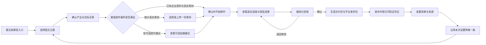
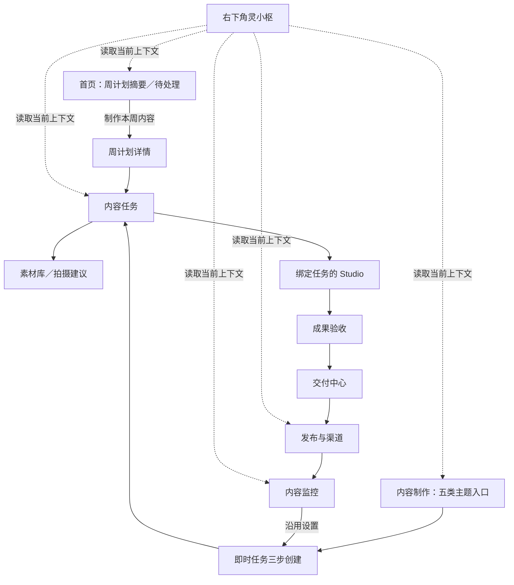

# 灵枢社媒内容生成｜专业 SaaS 前端交互改版设计文档

> 文档版本：v1.0
> 日期：2026-09-20
> 产品基线：《PRD-社媒内容制作工作流》v1.6「主题与内容结构解耦版」
> 适用范围：首页数字员工中的周内容入口，以及「灵感中心 → 内容制作 → 发布与渠道 → 内容监控」社媒主链路
> 当前状态：可进入 Figma／墨刀原型与前端拆分；不代表代码已实现或能力已上线

## 0. 结论先行

这次改版的核心不是“把文字换成更多卡片”，而是把整个社媒链路统一成一套用户能预测的操作语言：

> **卡片负责选择，列表负责管理，抽屉负责查看，完整页面负责执行，弹窗只负责确认；右下角灵小枢是唯一自然语言对话入口。**

当前产品最主要的问题不是缺功能，而是价值、状态和入口没有按用户决策顺序出现。用户先看见大量解释、字段和内部状态，真正能点击的下一步反而不突出。

改版后，用户应在：

- 5 秒内看懂“我现在能得到什么”；
- 30 秒内找到唯一下一步；
- 60 秒内建立第一条即时内容任务；
- 任意时刻都能回答“现在进行到哪、在等谁、下一步点哪里”；
- 完成第一份交付后，直接沿用产品、主题和设置创建下一条内容。

### 0.1 需要立即锁定的产品决策

1. 首页数字员工只承担周计划与批量内容；「内容制作」只承担单条即时生成，两处不再出现模式切换。
2. 「内容制作」首屏直接展示五类主题图文入口，不先展示工作流说明。
3. 主题只决定“讲什么”；当前 v1.6 的拍摄清单是可选建议，不能被前端显示成必拍硬门槛。
4. 即时创建只要求主题、产品、目标买家和一句具体诉求；平台、语言、比例、CTA 等继承默认值并进入“更多设置”。
5. 任务通过列表／项目卡管理，不再通过下拉框切换。
6. 任务详情默认用右侧抽屉；上传、制作、验收等重操作进入完整页面。
7. 所有可操作状态只保留一个视觉主按钮。
8. 页面内“灵小枢操作台”统一改为“下一步”或“任务操作”，不再出现第二个助手人格。
9. 交付包、平台发布包和发布成功是三个不同状态；下载发布包绝不能显示成已发布。
10. 所有专业页共用现有《灵枢全局视觉体系 v1.0》，不再新增一套颜色、圆角或阴影语言。

### 0.2 “把客户骗进来”的正向产品定义

这里不采用虚假倒计时、虚假活跃人数、虚假成果或“必然爆款”等暗黑模式。真正提高转化的方式是：

- **价值前置**：先给输出示例、交付内容和使用场景，再解释系统。
- **降低承诺成本**：先点图文卡，再逐步补信息，不先面对复杂表单。
- **过程可见**：把进度、预计时间、待用户动作和成果预览持续放在可见位置。
- **风险后置且透明**：账号授权、发布方式和高级设置只在需要时出现，但不隐藏真实限制。
- **复用已有投入**：完成一次后，用“沿用本次设置再做一条”形成下一轮，而不是让用户重新填写。

## 1. 产品边界与设计基线

### 1.1 必须遵守的 PRD 约束

| 约束 | 前端含义 |
| --- | --- |
| 两个入口分工 | 首页数字员工是周计划；内容制作是即时单条。不可在内容制作弹窗里再次选择“立即创作／周计划” |
| 用户只做三类动作 | 明确主题、拍摄／上传素材、验收成果；其余配置默认继承或系统自动完成 |
| 五类一级主题 | 产品与卖点、场景与解决方案、工厂／企业与供应保障、定制与合作流程、客户案例与合作成果，另有弱一级“自定义主题” |
| 主题与内容结构解耦 | 痛点、对比、实证、趋势、FAQ 属于后台内容结构，不与主题并列，也不成为客户必选项 |
| v1.6 最低制作条件 | 已关联企业资料和至少一份真实素材即可制作；五类主题的镜头建议默认不阻塞 |
| 一个状态一个主动作 | 页面可存在多个次要查看动作，但只能有一个高强调业务动作 |
| 不显示内部原理 | 客户不见公式 ID、模型、Prompt、内部路由、技术生成模式、任务编号、哈希和错误堆栈 |
| 发布包为默认能力 | 不连接账号也能完成内容与平台发布包；账号授权不是创作前置条件 |
| 数据必须可验证 | 未返回的指标显示“暂无数据”，没有凭证不能标“已发布” |
| 抖音与 TikTok 分离 | 名称、连接状态、发布方式、回执和数据不可混用 |

### 1.2 本文范围

本文覆盖：

- 首页中的社媒内容入口与周计划摘要；
- 内容制作首页、即时任务创建、任务列表、任务详情与制作交接；
- 灵感、企业素材和拍摄建议；
- 成品预览、验收、交付包与发布包；
- 发布登记、内容监控与下一轮复用；
- 全局组件、状态、文案、响应式、埋点和实施顺序。

本文不覆盖：

- 付费投流、报价订单、支付、外呼、自动互动或完整 CRM；
- 爆款公式后台的业务内容设计；
- 未经真实验收的官方直发能力；
- 整个产品的品牌重塑；
- 新增任何功能页 Prompt／聊天输入框。

## 2. 当前前端诊断

### 2.1 核心问题

| 当前区域 | 现状 | 对用户的影响 | 改版方向 |
| --- | --- | --- | --- |
| 首页 | 直接嵌入完整 `SocialContentWorkspace`，下面才是业务进度与结果 | 新用户找不到使用入口；老用户看不到最紧急动作 | 首页只保留入口、待处理、进行中和近期结果，任务详情进抽屉 |
| 内容制作首页 | 标题、长说明、“两种使用方式”和静态四步条先占据首屏 | 用户先阅读产品说明，再寻找按钮 | 五类主题图文卡直接成为首屏入口；说明压缩成一句 |
| 新建任务 | 四步大弹窗；第一步已出现名称、目标、客户、市场、语言和日期 | 价值尚未出现就要求填写大量字段 | 改为三步独立页；仅保留必要字段；自动保存 |
| 素材选择 | 文件名、搜索、来源、备注、禁用词和 CTA 同页出现 | 不知道哪些素材已够用，也不知道下一步 | 显示缩略图与准备度；高级资料进入抽屉 |
| 任务详情 | 阶段条、周摘要、准备、交付、成果和右侧操作台等量平铺 | 每块都重要，等于没有重点 | 列表管理＋详情抽屉＋独立执行页；只强调下一步 |
| 成果验收 | 统一文件图标加文字摘要 | 用户感受不到“产品已经做出东西” | 以视频封面、图文缩略图和真实预览为主 |
| 发布页 | 日历、队列、账号、平台文案、发布设置和抖音发布包混在长页 | 用户难以理解当前在做哪一步 | “待发布／日历／发布记录”三视图，详情放右栏 |
| 内容监控 | 第一屏先显示平台能力卡，内容数据在下方表格 | 页面在解释能力，而不是帮助复盘 | 结果、趋势、内容排名优先；连接状态折叠 |
| 灵小枢 | 页面右侧另有“灵小枢操作台”，移动端还有固定操作栏 | 出现两个灵小枢心智，且可能互相遮挡 | 页面内改名“下一步”；对话只留全局右下入口 |

### 2.2 当前代码中应直接复用的部分

| 现有实现 | 保留价值 | 改造方式 |
| --- | --- | --- |
| `InspirationDashboard` 的媒体卡片与右侧详情栏 | 已经接近“视觉浏览＋渐进详情” | 沉淀为统一 `MediaCard` 与 `DetailDrawer` |
| `StudioWorkbenchFrame` 三栏工作台 | 适合专业内容编辑 | 保留骨架，减少重复摘要和过深标签 |
| `SocialTaskCommandPanel` 的状态驱动动作逻辑 | 已能根据状态计算主动作 | 只保留逻辑，视觉改为 `NextActionPanel`，移除灵小枢命名 |
| `SocialTaskSourcesStep` 的资料选择与上传能力 | 已具备数据与错误处理 | 改为缩略图选择器、最低条件与可选建议两层 |
| `SocialArtifactPreviewDialog` | 已有预览能力 | 抽为统一 `MediaPreview`，支持抽屉和全屏 |
| `DouyinPublicationPackagePanel` 的发布证据状态机 | 已有真实业务闭环 | 隐藏 JSON、哈希和内部 ID，改为三步业务流程 |
| 发布确认弹窗 | 适合高风险动作 | 保留，统一文案和确认层级 |
| `GlobalAssistant` | 唯一自然语言入口 | 所有页面保留，并与移动端操作栏避让 |

### 2.3 当前代码中必须消除的冲突

- 首页与内容制作页不能继续同时渲染完整任务工作区。
- 普通导航点击“内容制作”必须稳定回到内容项目中心；只有携带明确任务上下文才进入 Studio。
- 内容制作页不能再提供“立即创作／加入周计划”切换。
- 客户默认界面不得显示发布包 JSON、package hash、内部 package ID。
- 如果进度百分比不是来自可计算任务，不显示人为映射的 20%／50%／80%；用真实阶段与完成数量代替。
- starter 模式不能关闭右下角灵小枢；它是唯一对话入口。

## 3. 统一转化路径

### 3.1 核心飞轮



### 3.2 内容制作首页的生命周期逻辑

| 用户状态 | 首屏优先内容 | 创作入口呈现 |
| --- | --- | --- |
| 首次进入、无任务 | 五类主题卡＋一个明确示例 | 五张大卡；自定义主题为文字入口 |
| 有待处理事项 | “需要你处理”置顶 | 创作入口收成“开始新内容”横条 |
| 正在制作 | 当前阶段、真实完成数量、可离开提示 | 入口保持次级 |
| 有待验收成果 | 媒体预览＋“验收成品” | 新建入口不抢占主操作 |
| 已交付未发布 | 最近交付＋“下载／生成发布包” | 提供“再做一条”次级动作 |
| 已发布有数据 | 内容效果＋“复用本条” | 形成下一轮入口 |

### 3.3 首次价值原则

入口卡展示顺序固定为：

1. 代表画面或真实示例缩略图；
2. 结果名称；
3. 会得到什么；
4. 最少需要准备什么；
5. 预计时间，仅在后端有可靠 SLA／ETA 时显示；
6. 单一动作“开始制作”。

禁止在入口卡展示：内部公式、Agent、技术路线、模型、评分、预计播放量或无法兑现的“爆款”承诺。

## 4. 信息架构与导航

### 4.1 一级结构

建议保留现有社媒一级导航数量，但统一名称与职责：

| 一级入口 | 只解决什么 | 默认视图 |
| --- | --- | --- |
| 首页／智能经营 | 本周该做什么、需要我处理什么 | 周计划摘要、待处理、业务结果 |
| 灵感中心 | 找方向、浏览参考、管理素材与拍摄建议 | 爆款灵感；页内标签为“爆款灵感／我的素材／拍摄建议” |
| 内容制作 | 创建、继续与管理内容任务 | 内容项目中心，不自动进入上次 Studio |
| 发布与渠道 | 处理可发布内容、排期与发布记录 | 待发布列表 |
| 内容监控 | 看真实效果、异常和复用机会 | 内容表现总览 |
| 渠道设置 | 管理账号授权与连接状态 | 连接列表，不混入内容表现 |

脚本库、交付详情等属于任务上下文，不作为普通用户必须理解的一级导航。

### 4.2 页面恢复与浏览器历史

- 普通点击“内容制作”：打开内容项目中心。
- 点击某条任务：把 `taskId` 与 `view` 写入 URL，并打开详情抽屉。
- 点击“进入制作”：打开绑定该任务的 Studio。
- 浏览器后退：回到该任务详情或项目中心。
- 刷新：恢复当前任务与当前步骤，不依赖“最近任务”猜测。
- 重新从侧栏点击“内容制作”：关闭遗留任务上下文，回项目中心。
- 多标签页：每个标签页保留自身显式任务上下文，不能由 localStorage 的最近任务互相串线。

可分享、可刷新和可在新标签打开的任务上下文必须写入真实 URL；History State 只保存非必要的返回位置和瞬时 UI 状态，不能代替 `taskId/view` 深链。

## 5. 全局交互规范

### 5.1 五种容器的职责

| 容器 | 使用场景 | 不用于 |
| --- | --- | --- |
| 卡片 | 入口选择、媒体预览、少量并列方案 | 长列表、历史记录、密集数据 |
| 列表／表格 | 任务、发布记录、监控明细、版本 | 需要情绪吸引的首次入口 |
| 右侧抽屉 | 查看详情、轻量调整、保留列表上下文 | 多步骤创建、大文件编辑、完整制作 |
| 完整页面 | 创建、上传、制作、验收等连续任务 | 一次确认或一句错误说明 |
| 弹窗 | 删除、发布、批量确认等高风险确认 | 多步骤工作流、长表单、常规详情 |

### 5.2 页面密度

- 颜色、间距、圆角、阴影与组件行为统一遵循 `docs/product/PRD-灵枢AI全系统UI设计规范-v2-2026-10-09.md`。
- 常规圆角使用 6–8px；避免全页 `rounded-2xl` 和卡片套卡片。
- 常规面板不使用阴影；只有抽屉、弹层和悬浮操作使用低对比阴影。
- 正文不小于 12px；重要业务信息不使用 9–10px。
- 说明文字最多两行；更多内容放问号提示、抽屉或帮助中心。
- 表格和任务列表使用平面分隔线，不把每一行做成独立大卡。

### 5.3 操作层级

- 同一个状态只有一个高强调主按钮。
- 同一组选项可以有多张同级选择卡，它们共同构成一次选择，不算多个主动作。
- 次要动作使用描边按钮；低频动作进入“更多”。
- 可撤销的轻操作直接执行并提示；不可逆或会真实发布的动作必须确认。
- 页面内错误就地出现并把焦点移到错误字段；不把所有错误堆在长页底部。
- 草稿自动保存，显示“刚刚已保存”；不再用“保存草稿”和“继续”争夺主按钮。

### 5.4 状态颜色

| 语义 | 颜色与表现 |
| --- | --- |
| 当前选择／进行中／成功 | 品牌绿，同时显示文字 |
| 需要用户处理 | 暖杏底＋深暖色文字，只用于真实人工动作 |
| 系统处理中 | 中性灰绿＋进度或时间，不制造紧迫感 |
| 信息与未开始 | 灰绿中性色 |
| 错误／失败 | 红色，仅用于确实失败且可恢复的状态 |

不要为每一种状态发明新颜色；颜色永远配合文字或图标。

### 5.5 唯一对话入口

- 所有功能页不出现 Prompt 输入框或聊天气泡式表单。
- 自定义主题、修改备注仍可以使用普通字段，但必须有明确字段名、用途和字数限制。
- 页面内不使用“灵小枢操作台”“灵小枢帮你安排”“问灵小枢”等第二入口。
- 用户只能主动点击右下角灵小枢；助手展开时自动读取当前 `page + taskId + stage` 上下文。
- 右下灵小枢在所有客户页面保留，包括 starter 模式。
- 移动端存在底部主操作栏时，灵小枢向上避让操作栏高度与安全区；二者不能重叠。

## 6. 逐页改版方案

### 6.1 首页／数字员工：只承担周计划与经营状态

#### 首屏顺序

1. 本周需要你处理；
2. 本周内容计划与唯一下一步；
3. 正在进行的周任务；
4. 最近交付与经营结果；
5. 其他业务进度。

首页不放“做新品样片”等即时创作入口，也不承担内容监控或客服的跨模块启动。可画式图文入口统一放在「内容制作」首页；这样“首页＝周计划、内容制作＝即时单条”的 PRD 边界和转化数据保持一致。

周计划未建立时，首页只显示一张结果卡：

| 入口 | 输出 | 用户准备 | 主动作 |
| --- | --- | --- | --- |
| 制作本周内容 | 本周主题组合、集中素材建议、代表样片与批次交付 | 本周主推产品与目标 | 安排本周内容 |

卡片使用真实缩略图或克制插图，不使用大段描述。无可靠 ETA 时不显示具体小时数。

#### 需要删除或迁移

- 删除首页内完整 `SocialContentWorkspace`。
- 首页最多展示三条任务摘要，点击后打开详情抽屉。
- “为什么做／真实产出／下一步／依据”默认折叠为结论、状态和动作；依据进入详情。
- “补充或纠正业务信息”改为结构化“修改业务资料”按钮；如果用户需要对话，由用户自行点击固定在右下角的灵小枢，页面不再提供第二入口。

### 6.2 内容制作首页：内容项目中心

#### 新用户骨架

```text
内容制作                                      [查看全部项目]
围绕一个真实业务主题，开始制作一条内容

[产品与卖点] [场景与解决方案] [工厂／企业与供应保障]
[定制与合作流程] [客户案例与合作成果]
                                      自定义主题 →

最近示例（仅展示有明确“示例”标识的真实样例）
```

五张主题卡需要图像化：

- 产品与卖点：产品近景／细节；
- 场景与解决方案：真实使用场景；
- 工厂与供应保障／企业与供应保障：仅在企业资料能证明自有工厂时显示“工厂与供应保障”，否则显示“企业与供应保障”；
- 定制与合作流程：样品、包装或流程节点；
- 客户案例与合作成果：经授权的案例成果或中性示意。

素材来源优先级：租户真实素材 > 经授权行业样例 > 中性插图。不得把竞品素材伪装成客户成果。

#### 老用户骨架

```text
需要你处理（0–3 条，置顶）
正在制作（紧凑列表）
最近交付（媒体缩略图）

[＋ 开始新内容]                         [查看全部项目]
```

静态四步流程条从常驻首屏移除。首次使用可在主题卡下方显示一行轻提示：“选主题 → 准备素材 → 自动制作 → 验收成果”。

### 6.3 新建即时内容：从大弹窗改为三步独立页

内容制作入口固定为即时单条，不再显示“立即创作／周计划”。

#### 第一步：选择主题

- 使用五张图文主题卡；
- 卡片只说明“适合讲什么”和一条输出示例；
- 自定义主题为弱一级入口，点击后出现一句话字段；
- 自定义主题提交后先显示“建议归类为 X”，用户可以确认或改选；无法可靠归类时停留在本步并显示“请选择最接近的主题”；
- 主题选择只保存为浏览器会话草稿，不立即创建服务端任务。

#### 第二步：明确内容

必填仅包括：

- 产品：使用产品缩略图卡或可搜索选择器；
- 目标买家：优先显示企业资料中的 3–5 个常用对象；
- 一句话具体诉求：普通字段，不是 Prompt 对话。

业务目标使用图文单选卡，但它是系统推导并预选的**非阻塞默认值**，不是第五个必填项；用户可以直接接受或修改，它映射到现有 `objective` 字段：

- 介绍新品；
- 展示使用场景；
- 建立采购信任；
- 解释合作流程；
- 引导咨询。

任务名自动由“产品＋主题＋日期”生成，后续可编辑；市场、语言和交付日期不占据首屏。

产品与目标买家的数据契约：

- 产品来源于企业资料，选择结果应保存 `productId + productNameSnapshot`；现有只支持 `productRef` 字符串时，先兼容写入快照，再逐步增加稳定 ID。
- 目标买家优先来源于企业资料，保存可选 `audienceId + audienceLabelSnapshot`；无预设时使用带标签的普通字段降级。
- 企业没有产品资料时，提供结构化“新增产品”抽屉；不是 Prompt 输入。
- 产品或买家之后被删除时，历史任务保留快照，并显示“原资料已移除，可重新选择”，不能静默替换。

用户点击第二步主按钮 `继续检查素材` 时，前端才用自动生成的任务名与默认目标创建／更新服务端草稿。请求必须带幂等键；第一、二步未完成前只保存在 `sessionStorage`，按租户和用户隔离，建议 24 小时过期。这样既兼容当前服务端必填校验，也不会把一次主题点击虚增为有效任务。

#### 第三步：检查准备并确认

页面分为两层：

1. **开始制作所需**
   - 企业资料：已关联／去完善；
   - 真实素材：已选择 N 项／选择或上传一份。
2. **可提升效果**
   - 主题相关的拍摄建议；
   - 建议补充的角度、时长或场景；
   - 清楚标记“不影响开始制作”。

v1.6 下，不得把五类主题自动生成的镜头建议显示为“还缺 N 项”“必须补拍”或红色阻塞项。未来只有正式启用的内容公式明确声明必需素材时，才进入硬阻塞区。

最终主按钮按以下优先级变化：

1. 自定义主题待归类：`确认主题`；
2. 企业资料未关联：`完善企业资料`；
3. 未有真实素材：`选择或上传素材`；
4. 最低条件满足：`确认并开始制作`；
5. 提交中：`正在开始制作…`。

确认提交后直接进入制作，不再要求额外点击一次“开始制作”。

#### 更多设置

折叠项包含：平台、语言、比例、CTA、特殊要求。即时创作不展示数量、周预算、发布节奏、集中拍摄时间等周计划字段。

### 6.4 项目列表与任务详情抽屉

#### 项目列表

| 字段 | 说明 |
| --- | --- |
| 缩略图＋任务名 | 优先用最新成品或素材缩略图 |
| 产品／主题 | 业务标签，不显示公式或技术模式 |
| 当前阶段 | 四阶段之一：主题、素材、制作、验收 |
| 等待对象 | 系统处理中／需要你处理／团队处理中 |
| 下一步 | 一句业务动作 |
| 更新时间 | 相对时间＋可访问完整时间 |

任务列表支持状态、产品和时间筛选。普通状态不做看板；验证期任务量不高时，紧凑列表比多列看板更易维护。

#### 任务详情抽屉

- 桌面建议宽度 520–560px，最大不超过可视区 46%；移动端全屏；
- 真实 URL 持有 `taskId/view`；History State 只补充返回位置；
- 顶部：媒体缩略图、任务名、产品、主题和状态；
- 中部：四阶段进度、当前结论、素材／成品／交付数量、最近活动；
- 底部固定：唯一主操作；
- 编辑、暂停、删除、复制任务进入“更多”；
- “打开完整任务”进入执行页。

抽屉不展示内部任务号、公式版本、模型、哈希或技术来源。

### 6.5 素材库与拍摄建议

#### 页面默认业务视图

- 可直接使用；
- 适合的主题；
- 建议补拍；
- 待确认。

搜索、来源和类型保留在首行；行业、镜头功能、适用范围和方向进入筛选抽屉。

#### 素材卡

优先展示：缩略图、产品、适用主题、镜头功能、使用状态。来源、文件大小、分析细节和技术标签进入详情抽屉。

卡片点击打开详情；主动作根据上下文只保留一个：

- 在普通素材库：`用此素材创作`；
- 在任务选材：`用于当前任务`；
- 在拍摄建议：`上传到这条建议`。

#### 拍摄建议卡

每张卡回答：

- 建议拍什么；
- 建议怎么拍；
- 方向、景别和时长；
- 能提升哪一条内容；
- 是否已有替代素材；
- 上传入口。

默认使用“建议补充”语气。只有未来正式公式提供硬性要求时，才使用“制作所需”。

### 6.6 内容创作 Studio

继续使用现有三栏专业工作台：

- 左侧：脚本段落、镜头或版本对象导航；
- 中间：视频／图片／海报真实画布；
- 右侧：当前选中对象的设置与检查；
- 底部：时间轴与当前步骤唯一主动作。

需要统一的改动：

- 任务绑定进入时，不再展示“创作方式”与内部路径解释；
- 产品、主题、目标客户和素材由任务上下文直接带入；
- 右侧删除与左侧重复的“本次创作信息”；
- “脚本／翻译／声音／字幕”等深层标签改为有完成状态的任务清单；
- 高级参数进入折叠区或二级抽屉；
- 所有客户可见字号不低于 12px；
- 成品提交必须写回同一任务与新版本。

考虑到 `AiCreateStudio.tsx` 体积过大，先拆分设置、脚本、素材、声音、封面和预览模块，再做大范围视觉重构；否则回归风险过高。

### 6.7 验收与交付中心

#### 媒体优先验收

每项成果卡包含：

- 视频封面或图文缩略图；
- 成果类型、平台和版本；
- 当前状态；
- `预览`、`确认`、`退回修改`。

退回修改使用结构化原因：

- 事实不准确；
- 画面不合适；
- 文案不符合品牌；
- 节奏需要调整；
- 平台规格有问题；
- 其他说明。

用户可以补充普通备注，但不出现聊天式输入框。

#### 批量验收

- 先展示受影响的内容数量与修改范围；
- 支持排除个别内容后确认本批；
- 批量退回必须说明影响范围；
- 确认前只突出本次变化，不要求重复检查历史版本。

#### 交付包

交付中心展示“视频／封面／文案／字幕／说明”的完整度。缺少必要项时不能显示“已准备好”。

主动作按状态为：`整理交付包` → `查看交付包` → `下载交付包`。

### 6.8 发布与渠道

一级标签统一为：

- 待发布；
- 内容日历；
- 发布记录。

默认进入“待发布”，不默认打开账号连接或日历。

#### 待发布列表

- 使用内容缩略图、平台、版本、发布包状态、计划时间和下一步；
- 选中后在右侧详情栏配置文案、账号与时间；
- 未连接账号仍可使用手工发布包；
- 浏览器辅助、官方直发是彼此独立的可用能力，不画成必须逐级升级。

#### 国内抖音手工发布包

客户只看三步：

1. 下载发布素材；
2. 去抖音确认并完成发布；
3. 粘贴公开链接或作品 ID，登记结果。

保留“待核验／核验通过／未通过／待对账”状态。JSON、package hash、内部 ID 和版本校验细节默认不出现；如果内部人员需要，放入受权限控制的“技术详情”。

当前可承诺链路只有：

> 生成发布包 → 用户发布 → 登记凭证 → 人工核验

不得把尚未真实验收的官方直发绘制为默认可用路径。

### 6.9 内容监控

首屏顺序改为：

1. 已发布内容、播放／互动／咨询等真实结果；
2. 时间趋势；
3. 表现最好的内容与需要关注的异常；
4. 内容明细；
5. 数据来源与连接状态折叠区。

内容卡使用真实缩略图，并提供：

- 查看详情；
- 进入复盘；
- 沿用本条设置再做一条。

平台能力卡不再占据第一屏。平台筛选只保留一个入口；“立即同步”仅在已选择可同步账号时出现。

每项指标都要显示来源与采集时间；缺失值显示“暂无数据”，不同平台口径不强行合计。

### 6.10 灵感中心

保留“媒体卡片＋详情侧栏”作为全站标准参考，但减少默认信息：

- 卡片点击：打开详情；
- 卡片唯一主动作：`用此灵感创作`；
- 详情默认只显示 3 个有效原因、3 个可复用元素和一个带入创作按钮；
- 逐帧证据、完整脚本和评分进入“查看完整分析”；
- 首屏筛选只保留搜索、平台和内容形式，其他进入筛选抽屉。

## 7. 页面骨架与状态关系



周计划和即时任务共用 `ContentTask`、素材、脚本、作品、版本与交付对象；前端不得复制一套“首页作品”和一套“内容制作作品”。

## 8. 统一组件清单

### 8.1 入口与选择

- `ActionEntryCard`：首页结果入口；
- `ThemeVisualCard`：五类主题；
- `GoalVisualCard`：推荐业务目标；
- `ProductThumbnailPicker`：产品选择；
- `RecommendedMark`：系统推荐，不承诺结果。

### 8.2 任务与状态

- `TaskListRow`；
- `TaskDetailDrawer`；
- `StageProgress`；
- `NextActionPanel`；
- `StatusBadge`；
- `ActivityTimeline`；
- `MobileActionBar`。

### 8.3 素材与成果

- `ReadinessSummary`；
- `MaterialThumbnailPicker`；
- `ShotSuggestionCard`；
- `ArtifactPreviewCard`；
- `MediaPreview`；
- `VersionComparePanel`；
- `ApprovalActionBar`。

### 8.4 发布与数据

- `PublicationPackageCard`；
- `PublicationEvidencePanel`；
- `MetricStat`；
- `DataSourceBadge`；
- `FreshnessIndicator`；
- `ContentPerformanceRow`。

### 8.5 系统状态

- `Skeleton`；
- `EmptyState`；
- `InlineError`；
- `Toast`；
- `ConfirmDialog`；
- `DetailDrawer`；
- `StickyActionBar`。

这些组件必须用共享状态与变体，不允许每个页面自行定义不同的“成功、待处理、失败”和按钮层级。

## 9. 状态与唯一主操作

### 9.1 单条内容任务

| 客户可见状态 | 页面核心信息 | 唯一主操作 |
| --- | --- | --- |
| 草稿 | 尚未补齐的主题／产品／目标买家 | 继续创建 |
| 主题待确认 | 自定义主题的建议归类 | 确认主题 |
| 待完善企业资料 | 还没有可用于本次内容的企业事实 | 完善企业资料 |
| 待选择真实素材 | 企业资料已关联，但还没有真实素材 | 选择或上传素材 |
| 可选素材建议 | 已可制作，另有不阻塞的提升建议 | 确认并开始制作 |
| 制作中 | 当前阶段、真实完成数量、可靠 ETA（如有） | 查看进度 |
| 待验收 | 成果媒体预览与本次变化 | 验收成品 |
| 修改中 | 已接收的修改项与影响范围 | 查看修改进度 |
| 正在整理交付包 | 当前处理状态 | 查看交付进度 |
| 已交付 | 成品与完整度 | 下载交付包 |
| 失败／暂停 | 原因、已保留内容与恢复方式 | 重试／解决问题 |

“待完善企业资料”和“待选择真实素材”是同一 `待补素材／needs_input` 后端状态的原因化前端文案，不要求另造两个持久状态；主动作必须根据真实缺口计算。

“可选素材建议”不是橙色待办，不进入“需要你处理”；只有会阻塞最低制作条件或明确公式要求的事项才进入待处理。

### 9.2 周计划

周计划单独显示父级状态：主题计划待确认、待集中补拍、代表样片待确认、批量生产中、本批待验收、正在整理交付包、已交付、暂停、需要处理。展开后再看各 `ContentTask`，不能把父子状态合成一个前端百分比。

### 9.3 发布包、连接与监控

#### `PublicationPackage`

| 客户可见状态 | 页面核心信息 | 唯一主操作 |
| --- | --- | --- |
| 准备中 | 正在进行平台检查与冻结版本 | 查看准备进度 |
| 可发布 | 平台内容与操作说明 | 下载／打开发布包 |
| 等待发布确认 | 已进入辅助或正式发布前确认 | 确认发布 |
| 核验中 | 已提交公开链接或平台回执 | 查看核验状态 |
| 待对账 | 凭证缺失、冲突或结果未知 | 补充发布凭证 |
| 已发布 | 已有可验证凭证 | 查看内容效果 |
| 失败 | 失败原因与保留内容 | 修正并重试 |
| 已失效 | 来源作品或文案已变化 | 重新生成发布包 |

#### `PlatformConnection`

连接只使用“未配置、配置中、可用、需重新授权、权限不足、同步异常、已停用”。连接异常不能把已交付的 `ContentTask` 或已经冻结的发布包改成失败。

#### 内容监控

监控页不创造“内容任务已完成”状态。它只展示外部内容是否已对账、指标是否有数据、数据源和最近采集时间；主动作是“查看内容效果”“补充公开链接”或“沿用设置再做一条”。

页面可以基于多个对象计算一个“下一步”聚合动作，但不能把聚合结果反写成同一个实体状态。

### 9.4 旧状态迁移

当前合同仍把发布与数据回收状态混在 `SocialContentTaskStatus` 中。前端改版期间按下表投影，不继续扩展旧枚举：

| 旧枚举 | 新对象投影 |
| --- | --- |
| `draft` | `ContentTask=草稿` |
| `needs_input` | 根据原因投影为主题待确认／待完善企业资料／待选择真实素材 |
| `plan_review` | `ContentTask=可开始制作` 或 `WeeklyPlan=主题计划待确认`，由对象类型决定 |
| `producing` | `ContentTask=制作中` |
| `asset_review` | `ContentTask=待验收` |
| `packaging` | `ContentTask=正在整理交付包` |
| `delivered` | `ContentTask=已交付` |
| `awaiting_publish` | `ContentTask` 保持已交付；下一步来自对应 `PublicationPackage` |
| `awaiting_metrics` | `ContentTask` 保持已交付；下一步来自外部内容与指标同步状态 |
| `reviewed` | 不再作为内容任务发布后终态；由交付、发布和监控对象分别表达 |
| `paused` | 当前对象=暂停 |
| `attention` | 根据真实阻塞原因投影到对应对象，不作为万能状态 |

## 10. 文案规范

### 10.1 标题公式

- 页面标题：对象或工作区，如“内容制作”“待发布内容”；
- 卡片标题：结果或主题，如“产品与卖点”；
- 主按钮：动词＋对象，如“验收成品”“下载发布包”；
- 状态：事实描述，如“正在制作 3 项内容”；
- 错误：影响＋恢复，如“视频上传失败，已保留其他文件，可重新上传”。

### 10.2 禁止用语

- “AI 工作流”“节点”“服务端”“模型”“Prompt”“写入托管”；
- “素材生成／爆款裂变／产品生成”等内部技术路线；
- “必然爆款”“保证询盘”“预计播放量”；
- “接口未接通”“开发预留”“模拟数据”；
- “下载成功＝发布成功”；
- package ID、hash、内部任务号和错误堆栈。

### 10.3 推荐替换

| 不使用 | 改为 |
| --- | --- |
| 素材不足 | 还需要选择或上传一份真实素材 |
| 缺少 3 个镜头 | 有 3 条可选拍摄建议，可提升内容表现 |
| Agent 正在执行 | 正在制作，完成后会通知你 |
| 生成成功 | 首版内容已准备好，请预览确认 |
| API 数据为空 | 平台暂未返回这项数据 |
| 登记完成 | 发布凭证已提交，正在核验 |

## 11. 响应式与无障碍

### 桌面端（≥1280px）

- 列表＋560px 详情抽屉；
- Studio 使用完整三栏；
- 主操作可固定在抽屉或右栏底部。

### 平板端（768–1279px）

- 详情抽屉占 55–65%；
- 辅助栏下移；
- 主题卡 2–3 列。

### 移动端（<768px）

- 详情抽屉改全屏；
- 主题卡单列或双列；
- 主操作固定底栏；
- 灵小枢避让底栏与安全区；
- 必须可完成查看拍摄建议、上传、验收和下载；复杂 Studio 编辑可提示使用电脑端。

### 通用要求

- 触控目标至少 40px；
- 键盘可完成选择、创建、预览、确认与关闭；
- 焦点进入抽屉／弹窗并在关闭后回到触发按钮；
- 状态不只依赖颜色；
- 媒体有替代文本，视频操作有可见标签；
- 支持 `prefers-reduced-motion`。

## 12. 数据埋点与市场验证

### 12.1 核心漏斗事件

| 事件 | 关键属性 |
| --- | --- |
| `content_hub_view` | new／returning、是否有活跃任务、是否有待处理 |
| `content_entry_click` | 首页／内容制作、入口类型、主题 |
| `content_theme_selected` | theme_id、自定义与否 |
| `content_goal_confirmed` | goal、是否接受推荐 |
| `content_readiness_view` | 最低条件缺口数、可选建议数 |
| `content_task_draft_created` | 诊断事件；创建耗时、来源入口，不作为核心激活 |
| `content_task_started` | 核心激活；是否一次完成、是否上传新素材 |
| `content_artifact_reviewed` | approve／changes_requested、成果类型 |
| `delivery_package_downloaded` | 平台、版本 |
| `publication_evidence_submitted` | 平台、凭证类型 |
| `content_repeat_started` | 来源任务、复用入口 |
| `assistant_opened` | 页面、任务阶段、是否在创建前 |

埋点不得携带客户素材正文、Prompt、密钥、公开链接全文或其他敏感内容。

### 12.2 体验验收指标

- 目标用户进入页面 5 秒后，至少 80% 能正确指出下一步；
- 至少 80% 首次用户能在 60 秒内完成主题与内容信息，并进入素材准备页；
- 创建前必填只包含主题、产品、目标买家和具体诉求；
- 100% 可操作状态只有一个高强调主按钮；
- 100% 可选拍摄建议都明确“不影响开始制作”；
- 100% 视频／图文成果都有可识别缩略图或预览；
- 客户可见内部公式、模型、接口、节点和旧技术路线数量为 0；
- 刷新、前进、后退和重新登录后任务上下文恢复成功率为 100%；
- 375px 与 1440px 宽度均可完成创建、上传、验收和下载。

### 12.3 市场验证指标

先采集一周现状基线，再验证改版。第一轮可采用以下假设目标，而不是对外承诺：

- 入口卡点击到素材准备页到达率 ≥70%；
- 入口卡点击到 `content_task_started` 是核心激活率；先记录基线，再以连续两轮提升为目标，不用自动创建草稿人为做高；
- 首次进入素材准备页的中位耗时 ≤60 秒；
- 创建前打开灵小枢求助的比例 <20%；
- 首份成果到完成验收的中位时长持续下降；
- 交付包下载／发布登记率持续上升；
- 首次交付后 7 天内再次创建任务的比例 ≥25%。

每周访谈至少 5 位目标 B2B 用户，记录他们停顿、误读和求助的位置；不要只看点击率判断专业性。

## 13. Figma／墨刀原型交付要求

### 13.1 文件结构

1. `00 Foundations`：颜色、字体、间距、状态与按钮层级；
2. `01 Components`：入口卡、主题卡、任务行、抽屉、媒体卡、状态、底栏；
3. `02 Content Hub`：新用户、有任务、待验收、已交付四种首页状态；
4. `03 Create Flow`：主题、内容、准备确认三步；
5. `04 Task Detail`：抽屉与完整执行页；
6. `05 Materials`：素材库与拍摄建议；
7. `06 Review & Delivery`：预览、退回、批量验收、交付包；
8. `07 Publish & Monitor`：待发布、抖音手工发布包、内容表现；
9. `08 Responsive`：1440、1024、375 三种关键宽度；
10. `09 Prototype`：三条可点击端到端流程。

### 13.2 必做原型流程

1. 新用户：内容制作 → 选择主题 → 选择产品／买家 → 选择真实素材 → 开始制作；
2. 老用户：需要你处理 → 预览成品 → 退回一项 → 再次确认 → 下载交付包；
3. 发布闭环：待发布 → 下载抖音发布包 → 登记公开链接 → 待核验 → 查看内容数据。

### 13.3 组件要求

- 使用 Auto Layout／响应式约束；
- 状态、大小、是否选中、是否禁用做成 Variant；
- 图层按业务含义命名；
- 所有交互写明触发、结果、异常与返回路径；
- 每个关键页面至少包含 loading、empty、error、permission denied、success 五种状态；
- 示例数据必须标注“示例”，不能伪装成真实客户结果。

## 14. 前端实施映射

| 当前文件／模块 | 目标动作 |
| --- | --- |
| `StarterWorkspacePage.tsx` | 移除完整任务工作区，改为周计划摘要、待处理和结果；不新增即时创作入口 |
| `SocialContentPlanningPage.tsx` | 改成内容项目中心；五类主题卡直接上首屏 |
| `SocialTaskEditorDialog.tsx` | 逐步退役为独立三步创建页；保留数据校验逻辑 |
| `SocialTaskSourcesStep.tsx` | 拆成素材缩略图选择、最低条件和可选建议；低频字段移入更多设置 |
| `SocialTaskOverview.tsx` | 拆成任务列表、详情抽屉、成果预览和完整任务页 |
| `SocialTaskCommandPanel.tsx` | 重构为 `NextActionPanel`；移除灵小枢命名、重复导航和伪进度百分比 |
| `InspirationDashboard.tsx` | 提取媒体卡与详情抽屉；减少首屏筛选与详情默认文本 |
| `AiCreateStudio.tsx` | P0 只处理任务绑定、隐藏内部路线和重复摘要；P1 模块化后再做深层统一 |
| `TrafficPage.tsx` | 拆为待发布／日历／记录；账号设置与内容表现分离 |
| `DouyinPublicationPackagePanel.tsx` | 改三步业务流程；隐藏 JSON、hash 与内部 ID |
| `SocialMonitoringPage.tsx` | 结果与内容排名优先；能力卡移入连接状态折叠区 |
| `GlobalAssistant.tsx` | 在 starter 保留；增加与移动操作栏的统一避让约定 |
| `pageRegistry.ts`／`App.tsx` | 把 `taskId/view` 写入真实 URL，保证普通导航、显式任务跳转、刷新、新标签与历史行为一致 |

## 15. 分阶段实施计划

### 第 0 阶段：冻结交互基线（2–3 天）

- 确认本文件中的十项产品决策；
- 锁定 v1.6 的“拍摄建议不阻塞”语义；
- 完成 Figma Foundations、组件命名和页面状态清单；
- 建立上述埋点事件但不改变业务逻辑。

### 第 1 阶段：首次转化（第 1 周）

- 内容制作五类主题首屏；
- 三步即时创建；
- 浏览器会话草稿、服务端草稿幂等创建、默认值与就地错误；
- 自定义主题归类确认与供应保障条件文案；
- 保留右下角灵小枢，移除页面内第二助手命名。

验收：目标客户能在 60 秒内进入素材准备页，且不知道旧三条技术路线也能完成。

### 第 2 阶段：任务可持续使用（第 2 周）

- 项目列表；
- 任务详情抽屉；
- `NextActionPanel` 与移动底栏；
- 素材最低条件／可选建议分层；
- 真实 URL 深链与浏览器历史恢复；
- 首页移除完整 `SocialContentWorkspace`，只保留周计划摘要与待处理。

验收：用户能在 5 秒内说出任务阶段、等待对象和下一步。

### 第 3 阶段：成果与交付（第 3 周）

- 媒体化成果卡；
- 全屏预览、单项确认与结构化退回；
- 交付包完整度；

验收：从成果出现到下载发布包全链路无需阅读技术说明。

### 第 4 阶段：抖音手工发布闭环与质量门槛（第 4 周）

- 抖音三步发布包与凭证状态；
- 发布包、发布凭证和内容任务状态拆分；
- 隐藏 JSON、hash 与内部 ID；
- 375px／1024px／1440px 真实浏览器验收。

验收：完成“交付 → 下载抖音发布包 → 用户发布 → 登记凭证 → 待人工核验”，且不误标已发布。

### 第 5 阶段：第二个月到第三个月

- 每周 1–2 次版本，围绕漏斗数据和用户访谈改动；
- P1 完整周计划、集中拍摄、代表样片与批次验收；
- 发布页“待发布／日历／发布记录”拆分；
- 内容监控结果优先、来源与新鲜度，以及“沿用本次设置再做一条”；
- 任务模板、复制和团队审批；
- 先拆分 `AiCreateStudio` 与 `InspirationDashboard` 超大组件，再进行深层 Studio 与灵感详情改版；
- 只在有真实数据后增加趋势、推荐排序和高级自动化。

## 16. P0 验收清单

- [ ] 首页不再嵌入完整社媒任务详情。
- [ ] 内容制作首屏直接显示五类主题图文卡。
- [ ] 内容制作不再出现“立即创作／周计划”模式切换。
- [ ] 即时创建只有三步，必填仅主题、产品、目标买家和具体诉求。
- [ ] 自定义主题必须经过建议归类确认；供应保障名称按企业事实显示。
- [ ] 平台、语言、比例和 CTA 进入更多设置；周计划字段不在即时创建中出现。
- [ ] 企业资料和一份真实素材满足后可开始制作。
- [ ] 五类主题的拍摄建议全部显示为非阻塞建议。
- [ ] 任务使用列表管理，并通过真实 URL 支持详情抽屉、刷新、新标签与前后退恢复。
- [ ] 每个可操作状态只有一个主按钮。
- [ ] 页面内不再出现“灵小枢操作台”或“问灵小枢”；右下灵小枢在 starter 模式可用。
- [ ] 所有成果都有真实缩略图或媒体预览。
- [ ] 退回修改使用结构化原因并可附普通备注。
- [ ] 抖音客户界面不显示 JSON、hash 和内部 package ID。
- [ ] 发布包下载、凭证提交与发布成功三个状态严格分开。
- [ ] 空、加载、失败、权限不足和成功状态都有清楚恢复路径。
- [ ] 客户界面不出现公式、模型、Prompt、接口、节点或旧技术路线。
- [ ] 375px 与 1440px 完成创建、上传、验收和下载实测。
- [ ] 埋点可以计算从主题入口到开始制作、验收、交付和抖音凭证提交的漏斗。

## 17. 依据与关联文件

- `docs/product/PRD-社媒内容制作工作流-v1.md`，v1.6；
- `docs/product/PRD-灵枢AI全系统UI设计规范-v2-2026-10-09.md`；
- `src/components/starter/StarterWorkspacePage.tsx`；
- `src/components/socialContent/SocialContentPlanningPage.tsx`；
- `src/components/socialContent/SocialTaskEditorDialog.tsx`；
- `src/components/socialContent/SocialTaskSourcesStep.tsx`；
- `src/components/socialContent/SocialTaskOverview.tsx`；
- `src/components/socialContent/SocialTaskCommandPanel.tsx`；
- `src/components/InspirationDashboard.tsx`；
- `src/components/AiCreateStudio.tsx`；
- `src/components/studio/StudioWorkbenchFrame.tsx`；
- `src/components/TrafficPage.tsx`；
- `src/components/publishing/DouyinPublicationPackagePanel.tsx`；
- `src/components/SocialMonitoringPage.tsx`；
- `src/components/GlobalAssistant.tsx`；
- `src/App.tsx`、`src/pageRegistry.ts`。

本文件是前端交互实施规格，不修改上述 PRD 的业务边界。如果 PRD 继续更新，应优先同步第 1 节约束、第 9 节状态映射和第 16 节验收清单，再进入代码改造。
