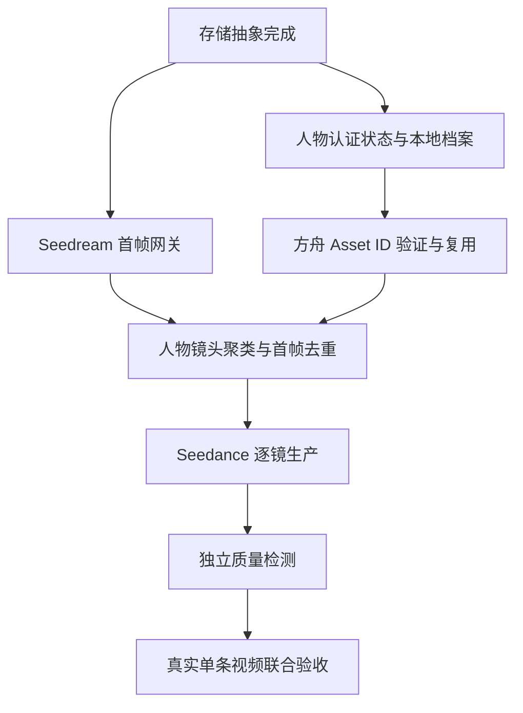

# 数字人首帧与 Seedance 生产链实施计划

日期：2026-09-25  
状态：产品决策已确认，执行中（批次 A、B 已完成；批次 C 已完成任务留痕、技术／可选语义质检与失败镜头局部重做，音素级口型检测仍待接入）  
目标：实现“真人首次认证一次，后续每条视频自动生成最多 3 张首帧并完成 Seedance 生产、质检和成本留痕”的闭环。

## 1. 不变约束

- 开发环境使用本地系统存储；生产环境只使用腾讯云 COS。
- 最终人物首帧默认使用 Seedream；千问只作为操作者明确选择的草稿或备用模型，不做跨供应商自动重试。
- 单条视频最多 3 张不同构图的换人首帧，总预算不超过 2 元。
- 真人外发前必须具备授权证据与方舟 Active 图片资产。
- 当前不采购 Assets API 高级权益；真人首次认证保留一次控制台操作。
- 任何供应商任务必须幂等、预算预留、回执持久化；不确定状态禁止自动重提。
- 生产模型不得自我放行；缺独立检测证据时阻断成片发布。

## 2. 依赖关系



存储、Seedream 网关和人物认证页面可以并行开发；Seedance 真实生产必须等待三者完成。

## 3. 阶段一：完成 Local／COS 存储迁移

### 改动

- 统一 `ObjectStorage` 接口：`upload`、`uploadFile`、`download`、`stream`、`head`、`delete`、`signedGetUrl`。
- 保留 `LocalObjectStorage` 与 `TencentCosObjectStorage` 两个实现。
- 将全部运行时代码从 `r2*` 命名迁移到通用接口；`r2.ts` 最终只允许迁移工具使用，应用运行时不得引用。
- 开发环境默认 `OBJECT_STORAGE_DRIVER=local`；生产环境缺 COS 配置时启动失败。
- 本地存储可供应用读取，但没有 HTTPS 公网基址时不得作为供应商输入。

### 验收

- `rg` 检查应用运行时不存在 `../storage/r2` 引用。
- Local 驱动覆盖写入、读取、Range、HEAD、删除、路径越界和租户隔离。
- COS 驱动使用 Mock S3/COS 契约测试验证签名和对象版本。
- 生产 readiness 缺任一 COS 配置时失败关闭。

## 4. 阶段二：Seedream 首帧网关与费用控制

### 改动

- 实现供应商无关的 `FirstFrameGenerator` 协议及 Seedream 适配器；千问后续作为人工选择的草稿／备用适配器接入。
- 输入为原镜头首帧、已授权人物图、构图要求和稳定幂等键。
- 默认单张生成，不自动请求组图。
- 记录模型、供应商任务／请求 ID、输入哈希、输出哈希、估算费用和实际费用依据。
- 新增独立首帧预算账本：单视频 2 元、最多 3 张；同一输入幂等重放不重复预留。
- 千问适配器只在操作者明确选择时调用，不做跨供应商自动重试。

### 验收

- Mock 验证 Seedream 请求只包含允许的参考图和提示字段。
- 第四张首帧在供应商调用前被拒绝。
- 超过 2 元预算时在供应商调用前被拒绝。
- 已受理后的超时返回 `uncertain`，不自动重提。

## 5. 阶段三：人物认证产品闭环

### 改动

- 人物状态：资料待完善、授权待确认、方舟待认证、审核中、已认证、认证失败、停用。
- 当前 Entry 流程提供“前往方舟认证”、Asset ID 回填和状态验证。
- 保存图片／视频类型、Asset ID、状态、项目、同步时间和失败原因。
- `IMG_2090.HEIC` 的清洗后 JPEG 作为首个验收人物素材。
- 未取得主体授权证据或 Active 图片 Asset ID 时，页面明确显示阻断原因。

### 验收

- 视频型 Asset ID 不能作为图片首帧。
- 跨租户、过期、撤销授权或未成年确认缺失均失败关闭。
- 已认证人物在后续项目中直接复用，不再次要求登录方舟。
- 页面不得把“已上传本地”显示成“方舟已认证”。

## 6. 阶段四：人物镜头识别、聚类与去重

### 改动

- 编导 Agent 先识别人像镜头；产品、工厂、信息图和 B-roll 不进入首帧链。
- 按人物、景别、机位、背景和动作意图聚类。
- 每个构图簇只生成一张首帧，并映射给对应语句／镜头。
- 最多保留 3 个构图簇；超过时输出排序和合并建议，禁止静默丢镜头。

### 验收

- 相同构图的多条语句只调用一次生图。
- 无人物视频的首帧调用数为 0。
- 超过 3 簇时必须等待选择或明确合并。

## 7. 阶段五：Seedance 逐镜生产

### 改动

- 仅使用已确认的 Seedream 首帧和对应人物资产。
- 每个镜头保存稳定请求 ID、供应商任务 ID、状态、输出、费用和输入版本。
- 任务被供应商受理后只轮询同一任务，不自动重新创建。
- 成片下载、哈希、Local／COS 入库及 HEAD 验证完成后才标记素材可用。

### 验收

- `pending`、`failed`、`uncertain` 均不产生已完成素材。
- 重复执行不会重复创建付费任务。
- 首帧、人物、台词或产品版本变化会生成新的输入指纹。

## 8. 阶段六：质量检测与联合验收

### 自动检测

- 身份一致性与人脸稳定性。
- 动作连续性、冻结和闪烁。
- 产品／品牌／文字保持。
- 背景稳定性。
- 音画同步。
- 连续帧与音频复用风险。

### 真实验收用例

1. 使用 `presenter-real-0e52e719967a30bb` 对应真人完成首次方舟认证。
2. 选择一个有 2–3 种人物构图的参考视频。
3. 自动形成不超过 3 个构图簇。
4. Seedream 生成最终首帧。
5. Seedance 生成逐镜视频并拼接。
6. 独立检测通过或给出逐镜返工项。
7. 人工确认候选成片。
8. 核对供应商任务、实际成本、素材哈希和授权引用。

### 完成标准

- 单条视频首帧调用数不超过 3，费用不超过 2 元。
- 真人认证只发生一次，后续视频无需再次登录方舟。
- 所有供应商调用有回执和幂等记录。
- 所有成片有独立质量证据；缺证据时无法发布。
- 本地开发链和生产 COS 链分别通过验收。

## 9. 执行批次

1. 批次 A：存储迁移、Seedream 网关、人物状态页并行。
2. 批次 B：镜头聚类、预算账本、Asset ID 验证集成。
3. 批次 C：Seedance 逐镜生产与独立质量检测。
4. 批次 D：真实单条视频验收、缺陷修复和文档回写。

每个批次先完成代码与 Mock 验证；真实付费调用集中在批次 D，并使用已冻结的输入、次数和预算。

## 10. 文件级执行清单

### A1. 存储运行时迁移

- [x] 将 `server/routes/studio.ts`、`videos.ts`、`enterprise.ts` 改为 `objectStorage` 通用接口。
- [x] 将 `server/starter198/socialContentFiles.ts`、`socialContentAutoProduction.ts`、`socialContentHeyGenBridge.ts` 改为通用接口。
- [x] 将 `server/lib/runwayReferenceInputs.ts`、`runwayReferenceOutput.ts`、`studioAvatarProduction.ts`、`fastHeadLocalProcessor.ts`、`sentenceFirstFramePipeline.ts` 改为通用接口。
- [x] 将发布、WhatsApp、数字员工相关运行时改为通用接口。
- [x] 迁移脚本改用明确的 source／target storage client，不再把目标 COS 命名为 R2。
- [x] 删除应用运行时对 `server/storage/r2.ts` 的引用；只在历史迁移工具仍需读取旧 R2 时保留专用 client。
- [x] 增加生产启动门禁：`OBJECT_STORAGE_DRIVER=cos` 且 COS 四项配置完整。

验证命令：

```bash
rg -n "storage/r2|\br2(?:Upload|Download|Head|Delete|GetObject|SignedGetUrl)\b" server
pnpm exec tsx server/storage/objectStorage.test.ts
pnpm exec tsc --noEmit --pretty false
pnpm run build
```


### A1 验证记录（2026-09-25）

- 应用运行时、发布、WhatsApp、数字员工和迁移脚本已统一改用 `objectStorage`；旧 `server/storage/r2.ts` 已删除。仅历史 `copy-materials-r2-to-cos.ts` 保留读取旧 R2 的专用源客户端。
- 开发默认使用私有 Local 驱动；生产强制选择 COS，缺 `COS_REGION`、`COS_BUCKET`、`COS_SECRET_ID` 或 `COS_SECRET_KEY` 时 readiness 失败关闭。
- Local 驱动已验证写入、下载、Range、HEAD、删除、路径越界防护，以及没有 HTTPS 公网基址时禁止供应商取件。租户私有对象路由仍将认证租户写入对象 key。
- 已通过：全库 TypeScript、生产构建、对象存储测试、媒体访问顺序测试、runtime readiness、租户绑定对象读取契约和 `git diff --check`。
- 完整 `tenantIsolation.test.ts` 仍被与本次迁移无关的首页账号管理导航旧断言提前阻断；本次涉及的租户对象读取断言已独立验证。
- 尚待阶段一补充：使用 Mock S3/COS 验证签名请求和对象版本语义；未连接真实 COS，也未部署。

### A2. Seedream 网关

- [x] 新增 `server/lib/firstFrameGenerator.ts`，定义供应商无关协议。
- [x] 新增 `server/lib/seedreamFirstFrameGenerator.ts` 和 Mock 契约测试。
- [x] `server/lib/imageGen.ts` 降级为通用图片入口，不再硬编码 Gemini 优先。
- [x] `sentenceReplicationProduction.ts` 默认调用 Seedream 最终首帧。
- [x] 下载结果后立即保存本地／COS、计算 SHA-256 并保留模型和请求 ID。
- [x] 只在操作者选择时调用千问；不自动跨供应商重试。

### A3. 人物认证页面

- [x] 扩展 `PresenterAsset`：方舟项目、Asset ID、类型、状态、同步时间和错误。
- [x] 扩展 `EnterprisePresenters.tsx`：首次认证入口、状态展示、Asset ID 回填和验证。
- [x] 新增服务端验证接口，只读查询 Asset 状态，不创建或修改方舟资产；无 API 权益时保留一次控制台人工确认。
- [x] 将本地上传、授权确认、方舟认证分别显示，禁止合并成一个“可用”状态。

### A2／A3 验证记录（2026-09-25）

- 新增供应商无关的首帧协议、Seedream 5.0 适配器、每成片预算账本和生产编排器。请求固定为一张原构图加一张授权人物图、单图输出，默认估算 0.22 元；不同构图最多 3 张，总额最多 2 元。
- 输入指纹覆盖租户、成片、构图、人物版本、提示词、参考图哈希、供应商和模型。已完成结果直接复用；网络超时或入库状态不明会保留预占并禁止自动重提。
- 逐句生产已从千问优先入口改为 Seedream 最终首帧，并按源构图缓存，同一构图跨语句只生一张。产物入 Local／COS 后校验 HEAD，记录 SHA-256、模型、供应商请求 ID 和预计费用。
- 人物设置已拆分为本地素材、主体授权证据和方舟认证三个状态，并提供方舟入口、Asset ID／项目／对应图片回填、状态展示和一次性“控制台已显示 Active”确认。Active 状态缺授权凭证、同意凭证、成年人确认或图片绑定时服务端拒绝保存。
- 当前 Entry 权益未配置 Assets API，因此只读查询接口会明确返回“需要控制台人工确认”；已预留可注入的只读验证端口，不会创建或修改方舟资产。Active 写回会把对应租户图片登记为可供 Seedance 使用的可信图片资产。
- 6 项首帧专项测试、人物认证契约测试、逐句生产、readiness、外部预检、生产路由回归和全库 TypeScript 检查通过。未发起真实 Seedream／Seedance 付费调用。
- 千问人工草稿选择入口已完成；尚未完成真实方舟 GetAsset AK/SK 查询和真实人物的页面级浏览器联合验收。

### B1. 首帧预算和幂等

- [x] 新增按视频维度的首帧预算账本。
- [x] 预算键包含租户、项目、成片、人物版本、源首帧哈希和模型。
- [x] 限制最多 3 个唯一构图、总预留不超过 2 元。
- [x] 已受理请求的超时保留预算并进入 `uncertain`。

### B2. 镜头聚类

- [x] 在参考分析阶段输出 `personShot=true|false`。
- [x] 构图指纹包含人物、景别、机位、背景、动作意图。
- [x] 相同指纹跨语句复用首帧。
- [x] 超过 3 簇时输出保留排序和合并建议，并等待人工决策。

### B2 验证记录（2026-09-25）

- 逐句契约新增人物／非人物分类、分类来源、构图信息、构图簇和非人物替换素材。参考分析会在证据明确时预分类；不明确时必须由用户确认。
- 人物镜头按人物、景别、机位、背景和动作意图生成稳定构图指纹，也支持用户直接选择“正面近景／正面中景／侧面中景”构图簇。同簇跨语句只生成一张 Seedream 首帧。
- 产品、工厂和 B-roll 镜头不提取人物首帧，也不会调用 Seedream 或 Seedance 人物生成；必须绑定本企业替换视频，再与人物生成片段按原时间轴拼接。
- 超过 3 个构图簇时，规划器返回 `needs_decision`、全部簇和明确合并建议；服务端在供应商调用前阻断，不会静默丢弃镜头。完全没有人物镜头时，人物生产入口明确转回普通素材混剪，首帧调用数为 0。
- 33 项聚类、数字人方案、首帧提取、人物／非人物混合拼接、生产路由和界面契约测试通过；全库 TypeScript 检查与 `git diff --check` 通过。未调用付费供应商。

### C1. Seedance 生产与质量闭环

- [x] 每个镜头持久化 Seedream 首帧引用和 Seedance 任务 ID。
- [x] Seedance 只接受确认后的首帧，不直接读取未经确认的草稿。
- [x] 成片完成后进入身份、动作、产品、背景、音画和复用风险检测；无法自动证明的项目保持人工验收。
- [x] 检测失败只返工对应镜头，复用其余已验收镜头，不整条视频重做。

## 11. 提交拆分建议

1. `refactor: add local and Tencent COS object storage drivers`
2. `refactor: migrate runtime media storage away from R2 naming`
3. `feat: add budgeted Seedream first-frame generation`
4. `feat: add presenter Ark certification lifecycle`
5. `feat: cluster person shots and cap first-frame generation`
6. `feat: connect Seedream frames to Seedance production`
7. `test: verify real digital-presenter replication workflow`

每个提交必须独立通过类型检查和相关专项测试；不得把真实供应商密钥、用户原图或供应商产物提交进 Git。

## 2026-09-25：可信图片资产的产品边界与灵枢承载方式

长期目标是由灵枢承担可信人物资产的业务入口：选择企业人物和图片、记录授权证据、关联方舟真人素材组、轮询图片资产状态，并在状态为 `Active` 时自动绑定 `asset://` 到人物与图片素材。

当前 Entry 版本没有 Assets API 高级权益，因此采用“一次人工认证与回填、后续自动复用”的过渡流程：真人主体首次进入方舟完成认证，操作者回填图片型 `asset://`、项目和对应人物图片，并确认控制台已显示 `Active`。服务端同时校验授权编号、本人同意、成年人确认和本地图片绑定；后续视频不再重复登录或认证。代码也已提供带签名的只读 `ListAssets` 同步能力，未来取得管理面 AK/SK 后可直接启用；当前阶段不采购高价权益，也不宣称具备自动创建或上传能力。

但方舟的真人素材规则要求授权主体在移动端登录并完成一次真人认证、同意人脸信息处理规则、上传本人素材；这一步不能由灵枢后台代替或绕过。灵枢应在同一工作流内展示二维码/移动承接页和等待状态，完成后继续自动同步，而不是把操作者带到方舟控制台。

未来取得 Assets API 权益后，第 3–5 步的目标定义为：

1. 灵枢提交“认证发起”并生成主体专属的移动认证承接；
2. 主体完成一次真人认证与图片上传；
3. 灵枢使用方舟 Assets API 查询关联的 `group-...`，只接受 `Image + Active`；
4. 灵枢将对应图片素材写入 `seedanceTrustedAsset`，并更新企业人物的 `arkCertification`；
5. 分镜生产直接读取该 `asset://`，不再要求手填或人工标记 Active。

Assets API 的运行配置使用火山引擎 Access Key（管理面 API），与视频生成使用的方舟 API Key 分开管理。缺少管理面权限时，页面必须提示“无法自动同步”，不得让用户伪造 Active 状态。

### C1 阶段进展（2026-09-25）

- Seedance 每个逐句任务在供应商返回任务 ID 的当刻写入当前生产作业；后续下载或检测失败也保留原任务 ID，重复请求被阻断，不会因超时自动创建新任务。
- Seedance 输入只来自 Seedream 最终首帧的入库对象和 HEAD 校验结果，不读取千问草稿或未确认的临时图片。首帧、人物版本、源构图、提示词和模型变化均进入稳定输入指纹。
- 每个人物镜头建立独立 `cueQuality`：媒体检查自动执行，身份、运动、产品／品牌／文字、背景、音画同步和复用风险保持待独立检测／人工验收。非人物镜头记录企业素材来源和“不复用未授权爆款原片”的证据。
- 新增逐镜质检回写接口；每项决定必须包含通过／失败和证据，结果输出 `failedCueIds`。
- 已新增失败镜头修复执行器：创建新的修复作业，只向 Seedance 重新提交 `failedCueIds`；其余镜头必须已有通过证据和可读取的成片素材，系统直接复用。任何复用证据不完整时失败关闭。
- 逐镜任务持久化、质检回写、局部重做、混合拼接、数字人质量和全库 TypeScript 检查通过。身份、产品／品牌／文字等语义项在没有独立视觉模型证据时仍不得自动通过。
- 逐句生产现会本地裁取每个镜头的参考时间段，并运行独立 FFmpeg 技术检测；可检测时长、音轨存在、运动／停帧异常以及整帧和音频复用风险。配置本地 Python 视觉环境时，再补充姿态、手部、背景和关键点异常代理。
- 自动结果只在出现明确异常时直接失败；正常代理不会自动放行身份、动作语义、产品／品牌／文字或口型。页面展示逐镜证据，要求操作者完成剩余项并填写依据。
- 新增逐句作业只读接口，页面刷新后仍可恢复持久化质检记录；页面已提供“只重做失败镜头”，并明确提示只对失败镜头产生新的供应商费用。
- 本轮 25 项定向测试及完整 `test:production`（100 项 Node 测试、2 项桌面 FFmpeg 测试）、全库 TypeScript 检查、生产构建和 `git diff --check` 通过。C1 的独立技术检测与页面局部返工闭环已完成；独立身份、产品／品牌／文字和口型语义检测仍未完成。
- 新增千问 VL 独立语义质检适配器：对已授权人物图、参考镜头三帧和候选镜头三帧做身份及产品／品牌／文字对比。只有带有效帧引用的高置信结论才自动写回；低置信或不确定结果保持人工验收。静态帧不用于宣称口型同步。
- 百炼语义质检默认关闭；启用时 readiness 和外部预检要求独立模型配置及 DashScope 凭据。真人图外发还必须在人物授权中单独包含精确的 `providerScopes: dashscope → quality_inspection`，不能沿用方舟授权，也不能用旧版供应商与用途两个平面列表交叉推导。页面已提供明确授权开关，未授权时服务端失败关闭外发并回退人工验收。
- 更新后完整 `test:production` 为 110 项 Node 测试和 2 项桌面 FFmpeg 测试，另有 runtime readiness、外部预检、TypeScript、生产构建及 `git diff --check` 全部通过。C1 只剩真正的音素级口型同步自动检测和真实链路验收。

### A2 千问人工草稿入口进展（2026-09-25）

- 已实现 `QwenFirstFrameGenerator`：只接收原构图与已授权人物图，单图输出，记录模型、请求 ID、哈希和预计费用，并复用首帧幂等／预算／对象存储链。
- 千问草稿和 Seedream 最终图共用每成片 3 个构图、2 元总预算；任何不确定状态都禁止自动重试，也禁止跨供应商自动回退。
- 页面已增加“生成千问构图草稿（可选）”明确操作；只有全部人物镜头已提取源首帧、操作者确认计费时才请求服务端。
- 百炼外发必须具备精确的 `dashscope → person_replacement` 授权；只有 `quality_inspection` 不能生图。两个用途在页面分开勾选。
- 草稿以 `usage=analysis` 入库并显示单张预估费用，不会进入 Seedance；Seedance 最终输入仍由 Seedream 生成。
- 千问与 Seedream 共用每成片 3 个构图、2 元总预算账本；请求不确定时保留预算且不自动重提。


### Runtime configuration

`VOLCENGINE_ACCESS_KEY_ID` and `VOLCENGINE_SECRET_ACCESS_KEY` enable read-only automatic sync of Asset Groups. They are server-only credentials and must never be sent to the browser. The integration intentionally does not use these credentials to bypass the provider's mobile real-person verification or upload a portrait on behalf of the subject.

### A2 完成验证（2026-09-25）

完整 `test:production` 共 113 项 Node 测试与 2 项真实 FFmpeg 测试全部通过；TypeScript 全库检查、Vite 生产构建和 `git diff --check` 通过。此次验证没有真实调用千问、Seedream 或 Seedance，没有推送或部署。

### A2 安全收口验证（2026-09-25）

通用图片入口已移除隐式 Seedream 回退，千问草稿请求已增加持久化回执、同请求复用和租户隔离。更新后的完整 `test:production` 为 117 项 Node 测试与 2 项真实 FFmpeg 测试；TypeScript、生产构建和差异检查均通过。

### D 前置条件核验（2026-09-25）

只读连通性预检已通过：开发环境本地对象存储可用，Seedance 凭据有效且目标模型可见。预检已纠正为识别 Local／COS 双驱动，仍保留生产 COS 和供应商 HTTPS／可信资产门禁。D 阶段当前只受真实人物外部状态阻断：`presenter-real-0e52e719967a30bb` 尚缺本人同意凭证和方舟 Active 图片型 `asset://`；在这些证据和明确付费测试窗口到位前，不启动真实生成。
