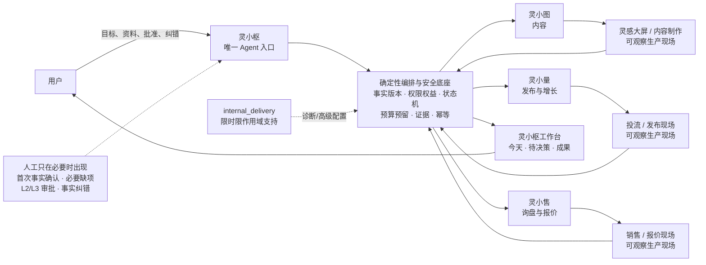
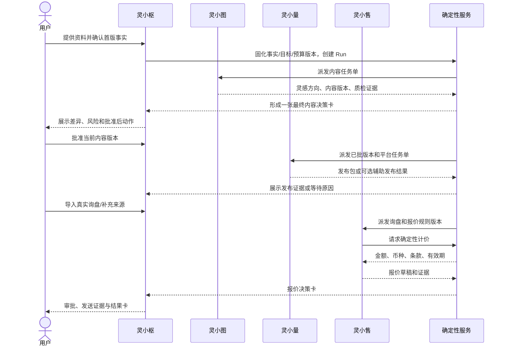

# AI 工作流：四 Agent 如何运行（业务解释版）v1

> 文档状态：目标产品运行说明 + 当前实现校准（Draft）
> 目标读者：产品负责人、业务负责人、交付负责人、售前与客户成功
> 适用产品：`starter_198` 的 7 日标准工作流，以及灵枢内部交付对同一工作流的受控支持
> 口径日期：2026-09-13
> 事实边界：本文主体说明**目标态如何运行**；第 1.1 节与第 12 节单独说明当前代码实际能运行到哪里。旧附件只作为历史原则，不作为当前事实或实施指令。
> 商业售卖、支付和退款均不在本文范围内。

关联基线：

- [198 白标数字员工标准版 PRD v2](./PRD-198白标数字员工标准版-v2.md)
- [复杂度治理与千人并发演进路线](../architecture/复杂度治理与千人并发演进路线-v1.md)

## 1. 先用一句话说清楚

用户只面对一个入口——**灵小枢**。目标态下，灵小枢把目标变成一套有事实、有预算、有截止时间、有审批边界的工作，分别交给灵小图、灵小量和灵小售；三个专业 Agent 在由现有业务界面改造而成的生产现场自动工作，用户平时只看“今天、待决策、成果”，只有遇到必须由人负责的事项才介入。

这里的“四 Agent”不是四个聊天机器人：

- 灵小枢是唯一入口和总负责人；
- 灵小图、灵小量、灵小售是三个固定岗位；
- 事实、权限、预算、价格、状态和对外动作由确定性服务约束，不能靠 Agent 自己说了算；
- 用户不需要选择模型、连接工具、编辑节点或盯着任务跑。

为避免把规划误当现状，本文使用以下标记：

| 标记 | 含义 |
| --- | --- |
| **当前可复用** | 仓库已经有相应页面、数据或领域能力，但不等于已经形成四 Agent 标准品 |
| **目标改造** | 必须开发、联调并通过验收后，才可按本文方式对外使用 |
| **可选目标** | 只有 entitlement 开启且专项安全验收通过后才出现 |
| **不在 198** | 198 标准版不可见、不可调用；客户侧高级能力归 `advanced_customer`，平台诊断与配置只能由 `internal_delivery` 在有效 support grant 内完成，两者不是同一种身份 |

### 1.1 当前代码到底能运行到哪里

这张表用于避免把后文的 7 日案例误读成当前已跑通的事实：

| 状态 | 当前实际行为 | 对用户的诚实表达 |
| --- | --- | --- |
| **已实现** | starter 用户从灵小枢进入“今天／待决策／成果”，看到四张 Agent token／成本／预算卡；所有 Agent 写操作走灵小枢命令；四类生产现场保留为差异化只读页，任务／用量和现场数据以固定 schema／字段白名单清理 PII、secret、prompt 与 provider payload，`production_site.read` 由服务端执行 | 可以说“统一入口和低对话产品壳与安全摘要读取面已具备”，但仍需真实租户验收，且现场仍是摘要级而非原 UI 全量复用 |
| **部分实现** | 灵小枢能创建／复用单活 run 和固定 10 节点任务图；现在每个节点都有明确处理或受控投影路径，内容、报价和发布证据通过精确血缘和哈希校验，最终摘要只使用已验证事实 | 内容产物和询盘未到达、人工审批未完成或发布回执未验真时仍保持 `waiting_external`；当前尚未把 starter 主动接到内容 provider、自然语言询盘和真实发布 verifier |
| **部分实现** | 灵小量可消费通过版本／哈希／审批门禁的内容任务，生成带工作流绑定的 JSON 发布 manifest；用户提交人工证据后，命令会在先落库的前提下 best-effort 投影为待验，失败可由幂等重放修复；系统能区分未提交、待验、驳回和已验，只有可验内部回执可推进结果节点 | JSON manifest 不是含素材 ZIP；真实平台／签名回执 verifier 尚未接入，人工自报绝不显示 published |
| **部分实现** | 用户可在灵小枢确认规则并提交结构化询盘；确定性服务生成报价草稿，支持审批、不可变文件和人工发送证据；询盘／草稿按 run/cycle/task 索引化并可幂等唤醒灵小售 | 当前没有模型自动读整段客户消息、智能追问和可信发送验真；价格仍只由规则引擎计算 |
| **部分实现** | usage ledger 支持 reserve/settle/release、token 分类、成本异常和四 Agent 汇总 | 真实模型／工具调用尚未全面接线；新接的读取、校验和汇总节点的 0 token／0 成本是“不调用 provider”的真实结果，不代表模型免费 |
| **已实现（可靠性纵切）** | processing 命令可从租户内持久事实恢复；运行控制与内容／报价决策有精确归因；run 变更、发布证据和产品档位切换使用数据库仲裁有界 lease，产物唤醒使用幂等 marker 修复中途失败 | 多记录写入仍不在同一事务，显式事件桥也没有持久 outbox／自动重投；这仍不是全链跨实例事务正确性 |
| **已实现（运行守卫）** | starter 开通先拒绝残留 legacy 凭据／账号／待执行发布或跟进；legacy Product API、定时发布和跟进旁路均有 authority guard。三个 starter worker 生产存储 fail closed、必须显式精确启用；发布包／报价产物扫描有公平 cursor，orchestrator 可安全换代过期 lease。平台管理员豁免只认 `/auth/me` 的服务端布尔值，browser-read token 不能绕过 starter boundary | 能说明当前局部恢复、身份来源与旁路隔离已有自动化门禁；不能据此宣称 BullMQ、PostgreSQL、独立 Worker 或多实例安全已经完成 |
| **未实现／未验证** | 当前仍以 PocketBase 和同进程扫描 worker 为主；starter 的短时 run 变更、发布证据、Product API 档位切换等窄路径虽已使用数据库仲裁 lease，但跨多条记录的业务提交仍不是一个事务 | PostgreSQL、BullMQ、通用数据库 CAS、事务 outbox/inbox、完整多实例正确性与 1,200 已登录会话容量均未完成或未压测 |

2026-09-14 本轮最终验证以实现审计文档记录为准；migration guard 当前覆盖全部 70 个 PocketBase migration 的 checksum 与历史基线不可变校验。这类门禁即使通过，也不证明生产迁移、真实 provider、完整四 Agent 闭环或 1,200 会话容量。

因此，当前可以演示“灵小枢如何收口、如何诚实展示等待、如何完成规则型报价”，不能宣称四 Agent 已经从内容到成交全自动运行。

## 2. 一页式总图



图中最重要的三点：

1. 用户和三个子 Agent 之间没有直接聊天通道，所有问题由灵小枢合并后一次问清。
2. 灵感大屏、内容制作、投流和销售界面不是另一套产品入口，而是 Agent 自动运行留下可核验过程的“生产现场”。198 用户默认不操作，只能从成果或异常卡片只读下钻。
3. 任何对外发布、客户发送或商业承诺都不由大模型直接执行。确定性服务先校验权限、版本、预算、审批和幂等，再交给受控执行器。

## 3. 四个 Agent 分别做什么

### 3.1 岗位总表

| Agent | 接收什么输入 | 自动做什么 | 主要输出 | 什么时候暂停 | 明确不能做什么 | 对应生产现场 |
| --- | --- | --- | --- | --- | --- | --- |
| **灵小枢**（总负责人） | 用户目标、已确认事实、内部生效的 capability policy、执行预算、三个子 Agent 回传 | 理解意图，提出并编排标准工作图，拆任务，控制先后关系，汇总异常，合并用户问题，验收结果；确定性服务负责校验并实例化允许的图 | 7 日计划、今日总览、待决策卡、成果卡、记忆候选 | 首次事实未确认；关键事实冲突；没有可继续任务；需要 L2/L3 审批；执行预算不足 | 不能越权替用户批准，不能直接改专业领域数据，不能把未知说成成功 | 灵小枢工作台；必要时只读查看各现场 |
| **灵小图**（内容） | 产品事实、市场、买家角色、品牌偏好、内容目标、可用素材 | 研究灵感，给出方向，生成脚本/图文/基础视频，做事实、版权、品牌和平台格式质检 | 灵感方向、首发内容、优化版、质检报告、内容版本与证据 | 关键产品事实缺失；素材版权不明；事实冲突；最终内容需要审批；模型或工具连续失败 | 不能编造产品参数，不能自行发布，不能直接向用户索取一串零散确认 | 灵感大屏、内容制作 |
| **灵小量**（发布与增长） | 已批内容版本、目标平台、账号引用、CTA、询盘入口、发布规则 | 做平台适配，生成发布包，维护发布证据，读取已接通的公开指标，给出投放建议 | 媒体文件、标题正文、标签、封面、追踪链接、发布步骤、发布回执与归因 | 内容未批；账号/平台缺失；用户未回填发布证据；辅助会话需用户在场；平台结果未知 | 198 不自主花广告费，不把发布包当成已发布，不绕过 2FA/CAPTCHA/风控 | 投流/发布现场 |
| **灵小售**（询盘与报价） | 真实询盘、`InquirySource`、产品事实、客户历史、版本化报价规则 | 识别意图，提取规格/数量/地区，合并缺项问题，调用确定性计价服务，组织多语言报价文字 | 询盘结构化结果、缺项卡、确定性计算单、报价草稿、发送证据、输赢原因 | 数量、规格、目的地等必要项缺失；规则外折扣或条款；报价过期；对外发送待审批 | 不能让模型算金额，不能擅自承诺折扣/交期/付款条款，不能无审批发送 | 销售/报价现场 |

### 3.2 灵小枢为什么是唯一入口

灵小枢不是“什么都会做”的超级账号，而是一个受状态机约束的项目经理。它每次派工都先形成一张结构化任务单，至少写清：给谁做、使用哪版事实、允许使用哪些工具、预期交付格式、风险级别、预算、截止时间和防重复编号。

例如，用户说“帮我做一条面向德国经销商的保温杯内容”，灵小枢不会把这句话原样转发给三个 Agent。它会先形成：

- 使用 `FactSet v3` 中的产品规格；
- 目标市场为德国，买家角色为经销商，语言为英语；
- 灵小图交付一条首发内容和一条优化版；
- 灵小量只生成一个主平台发布包，默认不执行付费投流；
- 灵小售等待真实询盘，不预造客户；
- 本次可用预算与高风险动作范围；
- 所有输出回到灵小枢，不由子 Agent 分别找用户聊天。

### 3.3 生产现场如何使用

目标态会复用并改造当前的灵感大屏、内容制作、投流和销售界面：

| 场景 | Agent 在现场做什么 | 198 用户看到什么 | 198 用户从灵小枢能做什么（生产现场严格只读） |
| --- | --- | --- | --- |
| 灵感大屏 | 灵小图读取已授权趋势和素材，记录选题依据 | 成果卡中的“为什么选这个方向”；可只读展开来源 | 回到灵小枢卡片要求换方向或纠正事实 |
| 内容制作 | 灵小图生成、修改、质检并保留版本 | 最终预览、版本差异、质检结果 | 只在灵小枢待决策卡批准或退回；不直接操作复杂编辑器 |
| 投流/发布 | 灵小量做平台适配、发布包、证据和指标读取 | 发布包内容、发布状态、公开回执、数据缺口 | 只在灵小枢发布卡下载发布包、回填 URL/平台 ID 或完成当次在场审批 |
| 销售/报价 | 灵小售结构化询盘，调用计价服务，生成报价草稿 | 缺项、计算依据、报价预览、有效期 | 只在灵小枢报价卡回答缺项、审批/退回、提交发送或业务结果证据 |

这些现场保留，是为了让业务结果可追溯，也方便内部交付排障；不是要求客户学会四套后台。198 用户进入的生产现场严格只读，不提供下载、回填、补项、审批、退回、授权或结果确认按钮；所有可写动作只由灵小枢的对应卡片承载。

## 4. 用户实际怎么操作

### 4.1 默认是“少对话，多卡片”

灵小枢不会每天追着用户聊天。只有用户主动提出新目标或系统确实缺少一个决定时，才出现对话。常规信息由三类卡片承载：

| 区域 | 它回答的问题 | 卡片必须显示 | 用户常用动作 |
| --- | --- | --- | --- |
| **今天** | AI 今天做了什么、正在做什么、下一步是什么 | 负责 Agent、业务状态、产物、预计完成时间、等待原因、成本/预算概览 | 看详情、暂停、纠错 |
| **待决策** | 哪些事情必须由人负责 | 最终预览、对象和版本、依据、风险级别、成本影响、批准后会发生什么 | 批准、退回、编辑、转人工 |
| **成果** | 到底产生了什么业务结果 | 内容、发布证据、询盘、报价、订单的证据链，以及未知/等待回流 | 只读下钻、修正归因、确认业务结果 |

默认人工只在四种情况出现：

1. **首次事实确认**：AI 抽取的是候选，不确认就不能成为可执行事实。
2. **必要缺项**：只问会阻止下一步的最少信息；能继续的并行任务继续跑。
3. **L2/L3 高风险审批**：对外发布/发送，或涉及报价、凭据、合同等商业风险。
4. **事实纠错**：用户可随时纠正；引用旧事实的下游版本和批准自动失效。

偏好选择、普通解释和低风险草稿不应伪装成“审批”。系统也不能为了提高自动化比例，把本来需要人负责的事项藏起来。

### 4.2 用户一天实际看到什么

以下是 Day 3 的目标体验示例，不代表当前界面已经完成：

**09:00，打开灵小枢，无需先聊天**

- 今天卡：`灵小图 · 正在质检`——已完成英文首发稿 v4，正在核对容量、材质和禁用词；预计 09:20 完成。
- 成本条：四 Agent 本周已结算 `¥6.84`，已预留 `¥1.20`，剩余可用预算 `¥22.00`。
- 下一步：若质检通过，系统会在上午生成一张“最终内容审批”卡。

**09:24，只出现一张真正需要人的卡**

- 待决策卡：`批准内容 v4`，风险 `L2 前置审批`。
- 预览：15 秒英文内容、标题、封面和 CTA。
- 依据：产品事实 `FactSet v3`、品牌偏好 `BrandStyle v2`、质检规则 `ContentPolicy v5`。
- 变化：相较 v3，删除了无法证明的“24 小时保温”表述。
- 批准后：只允许灵小量为 TikTok 生成发布包；**不会自动发布，也不会花广告费**。
- 用户点“批准”，或输入“第二句更克制一些”后退回。

**15:30，再次打开**

- 今天卡：`灵小量 · 已完成`——TikTok 发布包 v1 已就绪。
- 成果卡：可下载视频、标题、标签、首评、封面、追踪链接和发布步骤。
- 状态：`等待用户发布并回填链接`，不是“发布成功”。
- 只读下钻：点击“查看生产依据”才进入投流/发布现场；返回后仍在灵小枢。

整天没有需要决定的事项时，灵小枢只展示进度和结果，不发“在吗”“请确认收到”等无业务价值消息。

## 5. 四 Agent 泳道：一次工作如何交接



泳道中的“确定性服务”包括身份权限、内部生效的 capability policy、事实版本、工作流状态机、执行预算账本、计价、幂等、证据和回执校验。它不是第五个 Agent，也不会生成营销文案；它负责让四个 Agent 不越界。

## 6. 状态、暂停和失败恢复

### 6.1 用户看到的状态与系统真实含义

| 用户文案 | 系统含义 | 会不会继续自动跑 | 用户是否必须操作 |
| --- | --- | :---: | :---: |
| 准备中 | `queued`；任务可处于 `pending/ready/leased`，等待 Worker 领取 | 是 | 否 |
| 运行中 | `running`；至少有一个必要任务可执行或正在执行 | 是 | 否；即使另一个分支在等待，能跑的仍继续 |
| 等待你决定 | 首次开工可处于 `pending_initial_confirmation`；执行中任务可处于 `waiting_decision`，用于 Day 0 一次确认事实/目标/品牌偏好/执行边界，或处理有效版本的 L2/L3 审批 | 其他无关分支可继续 | 是 |
| 等待你在场 | 任务为 `waiting_user_presence`；可选登录态会话需要用户登录、2FA 或当次确认 | 否，只暂停该发布动作 | 是 |
| 等待外部结果 | 任务为 `waiting_external`；请求已提交，等待平台回执或人工发布证据 | 不盲目重试；先对账 | 通常否，超时后可能需要 |
| 稍后重试 | 任务为 `retry_scheduled`；可安全重试的模型/工具调用正在退避 | 是 | 否 |
| 已阻塞 | Run 为 `blocked`；尚有必要任务未完成，而且当前没有任何任务可安全继续 | 否 | 视 blocker 而定 |
| 暂停中 | 这是 UI 过渡文案；canonical Run 仍保留原 phase，同时停止领取新动作并核对在途外部效果 | 否 | 否，等待对账结束 |
| 已暂停 | Run 为 `paused`；不再领取新动作，在途外部动作已完成对账 | 否 | 用户恢复后继续 |
| 取消中 | Run 为 `cancelling`；取消未开始任务，并核对已提交动作 | 否 | 通常否 |
| 已完成 | `completed`；所有必要任务有可核验产物或按规则跳过 | 否 | 只需查看结果 |
| 失败 | `failed`；必要任务不可恢复，且没有补偿或替代路径 | 否 | 选择重试、降级或请求支持 |

“有等待事项”不等于整个 Run 被阻塞。例如灵小售在等真实询盘时，灵小图仍可继续优化内容；只有没有任何可运行的必要任务时，整体才显示阻塞。页面应同时展示全部 blocker，不能只显示一个笼统的“失败”。

工程上保留两层状态：Run 表示整轮工作的阶段，Task 表示单件工作的状态。界面把它们翻译成上表的业务文案，但不能丢掉原始状态、全部 blocker 和发生时间。

### 6.2 三条硬规则

**版本规则**

每个产物都记住所用的事实、策略、内容、报价规则和汇率版本。任何关键输入变化都会生成新版本；旧版本保留用于审计，但旧审批自动失效。例如用户把材质从 304 不锈钢纠正为 316，不仅内容要重新核对，引用 304 的发布批准也不能继续使用。

**证据规则**

AI 的结论必须带来源、新鲜度、置信区间和执行边界。发布包不是发布证据；公开 URL、平台 ID 或受控会话的可验证回执才可推进到“已发布”。用户点击“已发送”也不是报价发送证据，仍需 provider 回执、消息 ID、脱敏截图或客户回复等证据。

**幂等规则**

每次可能产生外部效果的动作都有唯一 `effectId/idempotencyKey`。系统先记录“准备做什么”，再执行，再记录回执。超时后先查询结果，不重复点击发布或再次发送。刷新页面、重复回调、Worker 重启和用户重复点击都只能产生一次业务效果。

### 6.3 暂停、取消和接管

- 暂停只阻止新的外部动作；已提交但结果未知的动作进入“对账中”，不能立即标记已暂停。
- 取消也不能抹掉可能已经发生的发布或发送；必须等回执确认或形成补偿方案。
- internal_delivery 的接管是一个限时控制权，不是 Run 状态。授权到期后从最后检查点交还自动队列；无法安全交还时形成明确的“需要人工处理”异常。

## 7. 一个完整的 7 日案例

下面是虚构但可执行的业务例子，用于说明目标工作方式，不代表任何效果承诺或当前系统已经跑通。Day 0 是开工准备，Day 1–Day 7 是完整的 7 日执行窗口。

**产品**：`TB-750` 750 ml 不锈钢保温杯
**目标市场**：德国
**买家角色**：礼品渠道经销商
**主平台**：TikTok
**语言**：英语
**默认发布方式**：发布包
**报价规则示例**：MOQ 500 件；1,000 件档基础单价 USD 4.55；单色 Logo USD 0.25/件；标准盒彩包 USD 0.15/件；FOB Shenzhen 单次处理费 USD 180；报价有效期 7 天；汇率快照为 1 USD = CNY 7.12。

### Day 0：事实从“AI 猜测”变成“用户确认”

用户向灵小枢上传产品 PDF、价目表和三张产品图。灵小枢提取容量、材质、颜色、MOQ、交期、认证和禁用表述，生成 `FactSet v1 候选`，并用候选事实预览首周目标范围。事实确认和首周范围确认合并在同一张首次开工卡，不再额外发起一轮计划对话。

- AI 判断：从文件中找出可能的字段，标出冲突和缺项。
- 确定性服务：保存原文件哈希、来源页码、字段版本和有效期。
- 人工必须做：首次确认。用户把“304/316 不锈钢”冲突修正为“内胆 316、外壳 304”，把无法证明的“24 小时保温”标为不可使用，并确认德国、礼品经销商、TikTok、英语这一首周范围。
- 输出：`FactSet v2 verified`、`initial_scope_confirmed`；随后由灵小枢产生 `Plan v1 generated` 和 `Run v1 started`，不存在 `plan approved` 事件。
- 状态：确认前为 `pending_initial_confirmation`；确认后 Run 进入 `queued`，灵小枢自动生成并启动计划，不再单独要求“批准计划”或逐节点批准。
- 恢复：解析失败只重试解析步骤，原文件和人工填写不丢失。

### Day 1：灵感不是随便搜，而是有事实边界的建议

Worker 取得 Run lease 后，灵小枢按已固化的目标、事实、品牌偏好和预算，把内容研究任务交给灵小图。灵小图在灵感大屏读取已授权趋势和素材，给出三个方向：礼品定制、通勤防漏、可持续包装。

- AI 判断：哪些方向更匹配德国礼品经销商，以及每个方向的理由。
- 确定性服务：校验来源可访问、内容不引用禁用事实、任务未超预算。
- 用户看到：一张方向卡，而不是三段 Agent 对话；默认推荐“礼品定制”。
- 用户默认不操作：灵小枢按目标自动采用推荐方向；只有方向暴露事实冲突或用户主动纠正品牌偏好时才介入。
- 输出：`ContentDirection v1`，附趋势来源、观察时间和置信度。
- 状态：灵小图完成研究；灵小量尚未收到未批准内容；灵小售处于“等待真实询盘”，不算失败。

### Day 2：生成首发内容和优化版

灵小图根据已确认方向生成英文脚本、镜头结构、字幕、封面和 CTA，产出首发内容 `Content v3`；随后生成一个只改变开头三秒表达的优化版 `Content v4`。

- AI 判断：文案、节奏、镜头组合和语言表达。
- 确定性服务：锁定输入事实版本，限制模型/工具，预留预算，记录 token 和工具用量，检查输出 schema。
- 用户默认不操作：今天卡显示“首发内容已生成，正在质检”。
- 输出：两个可预览版本、逐项来源、模型/工具成本事件和检查点。
- 状态：灵小图 `运行中 → 已完成生成 → 正在质检`。
- 恢复：模型限流时进入“稍后重试”，从脚本或渲染检查点继续，不重复已成功且已结算的步骤。

### Day 3：质检后只请人做一次有效决定

质检发现 v3 使用了未确认的“全天保温”，自动淘汰 v3；v4 删除该表述，并通过事实、品牌、版权和平台格式检查。灵小枢只生成一张针对 `Content v4 + hash` 的最终审批卡。

- AI 判断：表达是否自然、是否符合品牌语气，并解释修改建议。
- 确定性服务：核对每个产品主张是否来自 `FactSet v2`，计算内容哈希并绑定批准对象。
- 人工必须做：针对明确平台、账号和有效期批准或退回将要公开的最终内容版本，作为 L2 发布决策的一部分。它不授权系统花广告费；若后续对象、时间或内容变化，必须重新批准。
- 输出：`Approval(content_v4_hash)=approved`。
- 状态：灵小图完成；灵小量获得一张只可读取 v4 的任务单。
- 恢复：任何内容或事实变化都会生成 v5，并让 v4 的批准失效。

### Day 4：发布包是基础路径，登录态只是可选路径

灵小量为 TikTok 生成发布包：视频文件、标题、正文、标签、首评、封面、替代文本、追踪链接和逐步发布说明。状态从 `package_ready` 进入 `awaiting_user_publish`，不能显示“已发布”。

**默认发布包路径**

- 用户下载发布包，在平台发布后回填公开 URL 或平台 ID。
- 灵小量核对内容版本、账号、链接和可观察结果，证据通过后才变为 `published`。
- 如果没有回填，成果卡明确显示“等待用户发布并回填证据”。

**可选登录态辅助路径**

- 仅当该平台的 `publishing.assisted_session` entitlement 和专项安全门禁已经开放时出现。
- 创建/续期凭据会话属于 L3，用户必须在场完成登录或 2FA；密码、Cookie 和 session token 不进入业务库、日志、事件或模型。
- 用户先看最终动作预览，再针对当前内容、账号和时间做一次 L2 发布审批。
- 遇到 CAPTCHA、风控、页面变化或结果未知立即停止；不反检测，不自动重放点击，可一键降级为发布包。

- 输出：`PublicationPackage v1`；可选路径另有 `effect intent/receipt`。
- 恢复：结果未知先对账；同一 `effectId` 不得再次发布。

### Day 5：真实询盘进入系统，但来源未知也能继续

客户收到一条真实询盘：“Can you quote 1,000 pcs in black with our logo, FOB Shenzhen?” 用户在灵小枢粘贴原文并选择来源为 TikTok 私信；没有官方私信 API 也不影响导入。

- AI 判断：识别产品、数量、颜色、Logo 和贸易条款候选。
- 确定性服务：创建 `Inquiry` 和 `InquirySource`，保存导入人、接收时间、同意依据、证据引用和租户内去重键；PII 不进入日志。
- 人工只在必要时做：确认来源；来源拿不准可选“未知”，不会阻塞报价。
- 输出：`Inquiry v1`、`InquirySource(user_paste)`、`inquiry_received`。
- 状态：灵小售由“等待真实询盘”转为“提取字段”。
- 恢复：重复粘贴命中同一去重键，只合并来源引用，不创建第二个客户或第二份报价任务。

### Day 6：AI 理解问题，确定性服务计算金额

灵小售发现询盘没有说明包装，灵小枢只问一个阻塞问题：“使用标准盒彩包，还是需要定制包装？”用户回答“标准盒彩包”。必要字段齐全后，计价服务按 `QuoteRuleSet v5` 计算：

```text
基础单价              USD 4.55 × 1,000 = USD 4,550
单色 Logo            USD 0.25 × 1,000 = USD   250
标准盒彩包            USD 0.15 × 1,000 = USD   150
FOB Shenzhen 处理费                         USD   180
总计                                        USD 5,130
展示用人民币折算       USD 5,130 × 7.12      = CNY 36,525.60
```

- AI 判断：从询盘提取字段、提出最少补充问题、把计算结果组织成自然的英文报价草稿。
- 确定性服务：使用十进制金额、固定舍入规则、汇率快照和规则版本计算；相同输入必须得到相同结果。
- 人工必须做：指定报价负责人审阅。金额、MOQ、Incoterm、交期和有效期不能被 AI 改写；对外发送属于 L3。
- 输出：`QuoteCalculation v1`、`QuoteDraft v1`、输入哈希、规则版本、汇率快照和有效期。
- 状态：`draft_ready → 等待报价审批`；审批后仍需 provider receipt 或人工发送证据才可标记已发送。
- 恢复：数量或规则变化生成新计算，旧草稿和旧批准自动失效；超时不重复发送。

### Day 7：结果卡只报真实结果，记忆先成为候选

灵小枢汇总三位专业 Agent 的结果：完成 2 个内容版本、1 份发布包、1 条有证据的发布、1 条真实询盘、1 份确定性报价草稿。若没有订单证据，成交显示“待确认/尚未发生”，不能填 0 元成交后假装闭环。

- AI 判断：总结本周哪些表达、平台和询盘特征值得下一轮验证。
- 确定性服务：沿内容版本、发布证据、`InquirySource`、报价计算和发送证据生成可下钻链路。
- 用户看到：7 日成果卡、真实数据缺口、未来 30 天建议和下一周期状态；Day 0 已授权持续运行且 entitlement／预算充足时，系统自动滚动启动下一周期，用户无需再次申请或购买。
- 记忆候选：“德国礼品经销商可能更关注 Logo 定制与标准包装”只能进入**策略候选**，不能因为一条询盘升级为企业事实。
- 人工可选做：接受、编辑或撤销长期记忆。Run 在记忆候选已保存后即可完成，不等待用户采纳。
- 输出：`ResultCard v1`、`MemoryCandidate v1`、完整成本结算和未使用预算释放记录。

## 8. 三个异常例子

| 异常 | 用户看到什么 | 系统怎么恢复 | 绝对不能做什么 |
| --- | --- | --- | --- |
| **例 1：产品材质冲突**。PDF 写 304，价目表写 316 | 待决策卡列出两处来源，只问“内胆和外壳分别是什么材质？”；灵小售等该字段，其他不相关研究可继续 | 用户确认后形成新事实版本；只重跑引用该字段的内容/报价；旧审批自动失效 | AI 多数投票选一个；覆盖旧版本；让全部任务无差别失败 |
| **例 2：内容模型超时，工具已产生部分费用** | 今天卡显示“灵小图稍后重试”，列出已完成步骤、下次重试时间、已实际消耗与仍预留预算 | 从最近 checkpoint 恢复；指数退避、有限重试；已完成的工具结果按哈希复用；达到上限后降级模板或请求支持 | 把失败费用隐藏；无限重试；重复渲染同一版本；显示“已完成” |
| **例 3：辅助发布点击后页面无明确结果** | 状态为“发布结果待核对”，不是失败也不是成功；用户可选择等待对账或下载发布包 | 保留同一 `effectId`，先查询平台页面/回执；确认未发生后才能人工重试；确认已发生则补记证据 | 自动再点一次；绕过 CAPTCHA/风控；让内部人员读取 Cookie；把未知写成 published |

## 9. Agent 状态与成本如何展示

### 9.1 每个 Agent 的状态重点

每个 Agent 卡固定显示六类信息，不用“思考中”替代真实状态：

1. **Token**：本任务输入、输出和可复用缓存 token；token 只代表模型用量，不代表业务成功。
2. **模型成本**：198 用户卡片统一显示人民币估算／预留／结算金额；每次调用的原始计费币种保留在内部成本账本。
3. **工具成本**：198 用户卡片统一显示抓取、转写、渲染、存储、浏览器或渠道调用的人民币合计；原始单位和币种供内部核算与对账。
4. **预算**：预算上限、已预留、已结算、已释放和剩余可用；高成本未知时停止自动执行。
5. **产出**：有版本和证据的业务对象，而不是“调用成功”次数。
6. **等待与异常**：在等谁、等什么、截止时间、重试次数、下一安全恢复点和是否需要用户。

示例数据仅用于说明展示格式：

| Agent | 业务状态 | Input token | Output token | Cache token | 模型／工具成本 | 预算（上限／已结算／预留／剩余） | 产出 | 等待/异常 |
| --- | --- | ---: | ---: | ---: | --- | --- | --- | --- |
| 灵小枢 | 运行中 | 12,400 | 4,840 | 1,000 | ¥2.21／¥0.00 | ¥25.00／¥2.21／¥0.30／¥22.49 | 计划 v2、3 张决策卡 | 等内容审批；无异常 |
| 灵小图 | 已完成 | 28,500 | 10,310 | 4,000 | ¥5.27／¥1.28 | ¥20.00／¥6.55／¥0.00／¥13.45 | 内容 v4、质检报告 | 重试 1 次，已恢复 |
| 灵小量 | 等待外部结果 | 4,100 | 1,600 | 500 | ¥0.64／¥0.20 | ¥5.00／¥0.84／¥0.25／¥3.91 | 发布包 v1 | 等用户回填 URL |
| 灵小售 | 等待必要缺项 | 3,260 | 1,200 | 500 | ¥0.57／¥0.01 | ¥5.00／¥0.58／¥0.40／¥4.02 | 询盘 v1、字段提取 v1 | 缺包装方式 |

折算规则：

- 内部 usage event 永远保留 `rawAmount + rawCurrency + unit + providerTimestamp`；这些原始计费字段不向 198 用户展示。人民币只是客户展示与统一核算币种，不能覆盖原始金额。
- 每笔折算绑定 `fxSnapshotId + rate + observedAt`，使用十进制金额和明确舍入规则；历史账不随后来的汇率变化而重写。
- 任务提交先预留，成功按实际结算，安全失败释放未使用部分；provider 已实际计费的失败调用仍如实结算。
- 成本暂时拿不到时显示“未知”，不能显示 0；未知的不可控高成本动作不自动继续。
- Token 与工具单位分开：例如模型用 token，渲染用秒，存储用 GB·天，浏览器用会话分钟，最后再统一折人民币。

### 9.2 198 用户与内部人员看到的深度不同

| 信息 | 198 用户 | internal_delivery（有有效授权） |
| --- | --- | --- |
| 每 Agent token、模型／工具人民币成本合计 | 可见 | 可见 |
| 执行预算、预留、结算、释放、剩余额度 | 可见 | 可见 |
| 原始金额、币种、计费单位和汇率快照 | 不显示 | 按平台权限和工作需要可见 |
| 具体 provider、模型路由、单价、重试 trace、租户毛利 | 不显示 | 按平台权限和工作需要可见 |
| Prompt、隐藏推理、密钥、Cookie、session token | 不显示 | 也不可见；密钥与登录态不进入业务视图 |
| 产物、等待、异常和用户需要做什么 | 可见，使用业务语言 | 可见，并附错误码、checkpoint 和诊断信息 |

## 10. 哪些由 AI 判断，哪些必须确定，哪些必须由人负责

| 事项 | AI 可以做 | 确定性服务必须做 | 人必须做 |
| --- | --- | --- | --- |
| 企业/产品事实 | 从文件提取候选、识别冲突、解释来源 | 保存版本、来源、有效期和字段状态 | 首次确认；后续纠错 |
| 7 日计划 | 灵小枢提出节奏并编排标准图，解释为什么这样安排 | 校验所提图是否在 product profile／entitlement 允许范围内，校验依赖、预算和截止时间，再实例化工作图 | 在首次事实/目标确认中确认范围；之后不逐节点批准，可随时纠错 |
| 灵感与内容 | 选题、脚本、视觉/语言建议、质检判断 | 固定输入版本、版权/规则检查、产物 schema 和哈希 | 最终对外内容审批；事实冲突确认 |
| 发布 | 推荐平台表达和步骤 | 生成发布包、校验审批、执行 effect、去重、验证回执 | 实际手动发布并回填证据，或对可选辅助发布逐次审批 |
| 付费投流 | 只给建议 | 198 关闭实际花费能力 | 198 内不可执行；高级能力仍需预算与审批 |
| 询盘 | 理解意图、提取字段、给出来源候选 | 建 `InquirySource`、同意/PII 检查、去重和 TEST 隔离 | 必要时确认来源和缺项 |
| 报价 | 组织问题、解释计算结果、生成多语言草稿 | 用版本化规则、十进制金额、汇率快照确定金额和条款 | 审批对外报价；决定规则外折扣/账期/交期 |
| 成交/输单 | 总结已知原因、提出复盘候选 | 验证对象、证据和版本，保存审计 | 确认真实业务结果，或由可信业务系统回写 |
| 记忆 | 提炼事实/偏好/策略候选 | 去敏、去重、分类、版本和有效期 | 接受、编辑或撤销长期记忆 |

判断原则很简单：**AI 负责理解和生成，确定性服务负责计算和守门，人负责事实与不可逆责任。**

## 11. 198 标准版、高级客户能力与内部交付的界限

`advanced_customer` 是未来可能授予客户的产品能力集；`internal_delivery` 是灵枢平台人员的工作身份。前者不获得内部控制台，后者也不自动获得任何租户能力或数据访问权。

| 能力 | `starter_198` 自助用户 | `advanced_customer`（未来客户能力） | `internal_delivery`（有效 support grant） |
| --- | --- | --- | --- |
| Agent 入口 | 只使用灵小枢 | 客户仍只从灵小枢下达 Agent 指令，可获得高级治理入口 | 使用内部交付控制台诊断／配置，不新增客户侧聊天入口 |
| Agent 团队 | 固定 1 主 + 3 专业 Agent；不能新建、删除、换角色 | 可按 entitlement 使用经发布的高级团队模板 | 维护版本化标准／高级模板；不能替客户扩大 entitlement |
| 工作流 | 固定 7 日标准图，按事实和权益自动裁剪 | 可按 entitlement 使用经审核的高级工作图和集成 | 仅在授权作用域内配置、恢复和诊断，不代客户做业务决定 |
| 产品范围 | 1 个产品、市场、买家角色、语言和主平台；额度由 capability policy 决定 | 多产品／市场／语言等以独立 entitlement 和资源上限为准 | 协助排障和验收，不能越权修改 capability policy |
| 内容 | 1 条首发 + 1 条优化版；低成本默认工具链 | 数字人／高成本视频等逐项 entitlement 化 | 配置允许的工具链和诊断故障；未授权能力由服务端拒绝 |
| 发布 | 基础能力是可验证发布包 | 可按平台验收结果启用官方 API 等高级通道 | 配置连接或诊断发布；仍不能绕过客户审批 |
| 登录态辅助 | **可选目标**；只有独立 entitlement、用户在场和逐平台验收通过才开放 | 可按平台、账号和安全策略扩大受控使用范围 | 只能看脱敏状态和错误，不能读取／导出／接管 Cookie 或 token |
| 投流 | 可看建议，不自主消耗广告预算 | 有 entitlement、预算和审批时可配置预算、竞价和对账 | 诊断策略执行和对账异常；不能批准或擅自消耗客户预算 |
| 询盘／报价 | 标准入口、建议最多 10 条真实询盘／报价草稿；确定性计价；对外发送需审批 | 可接 CRM／ERP、复杂规则和更高资源限额 | 配置规则／集成并排障；不能代客户批准商业承诺 |
| 批量客户发送 | 不提供 | 只有 capability、合规门禁和客户审批均满足时才可启用 | 配置与诊断；平台人员不能代批或直接扩大触达范围 |
| 模型／工具 | 不选 provider、模型或 prompt | 使用已发布且 entitlement 允许的高级策略，不接触平台密钥 | 按平台权限配置 allowlist、路由、预算和熔断，不可查看客户密钥 |
| 支持访问 | Owner 主动授予、限时、限作用域、可撤销 | 同样由租户 Owner 授权，不因高级产品能力自动开放 | 必须同时满足 platform role 与 support grant；全程审计，过期自动失效 |

198 的“简单”来自固定团队、固定工作图、少量输入和强约束，不是把高级按钮用 CSS 隐藏。用户即使直接调用 API，也必须被角色、权益、预算和资源上限拒绝。

## 12. 当前已有与目标改造边界

### 12.1 当前可复用

- 已有企业资料、产品、目标、计划、Run/Task/Event、审批、交接、复盘等数字员工领域基础。
- 已有灵感、爆款分析、内容制作、素材、渲染和质量检查相关页面与能力，可成为灵小图工具链。
- 已有账号、发布日历、发布记录和部分平台回执能力，可成为灵小量工具链。
- 已有客户会话、客户分层、跟进、BANT、订单和部分报价规则，可成为灵小售工具链。
- 已有暂停、恢复、重试、纠偏、SSE 进度等机制的基础实现。

以上是 legacy 领域能力。除此之外，starter 专用层已实现灵小枢低交互工作台、四 Agent 卡、差异化只读生产现场、固定 10 节点图、持久 run/task、用量账本、发布 manifest worker，以及从规则／结构化询盘到确定性报价草稿和不可变报价产物的纵向链路。

本轮工程加固还完成了：processing command 的持久事实恢复与精确命令归因；短时 run mutation、发布证据变更和产品档位切换使用数据库仲裁的有界 lease，进程内队列／run lock 只作为降争用手段而不是跨实例权威；开通前 legacy 状态兼容性扫描，以及 Product API、定时发布、跟进发送的旁路 guard；Product API Key 改为 tenant-bound HMAC 校验，存储只保留 key id、前缀、末四位和摘要，迁移前密钥清空后必须旋转；三个 starter worker 的显式 opt-in、生产 strict PocketBase store；发布包与报价 artifact 的有界公平 cursor；orchestrator 过期 lease 的 grace 回收与 fencing token 换代；workspace／生产现场字段白名单和 `production_site.read` 服务端门禁；只信任 `/auth/me` 服务端 `platformAdmin`、禁止 browser-read 绕过 starter boundary；全部 70 个 PocketBase migration 的 checksum／历史不可变门禁。

固定 10 节点当前均有明确的处理或受控投影路径：上下文与调研可确定性执行；内容生产／质检只观察具有精确 `tenant + run + task` 血缘、文件与质检哈希的既有真实产物；内容审批与发布包由专用桥接／worker 推进；询盘与报价按 run／cycle／task 血缘读取并可幂等唤醒；人工证据提交先落库，再 best-effort 投影待验状态，只有已持久化的可信验证回执满足精确工作流绑定时才可投影成功；结果摘要会重新核验 canonical 报价／批准证据与发布证据，只汇总已验证事实，并把流量、发送、成交等未观察结果列为缺口，全部通过时结束当前 run。这里的“有路径”不等于全自动：starter 仍未主动调用内容生成／渲染 provider，真实平台 verifier 的运行调用方与隔离登录态 session broker 未接入，所以生产链不会自然抵达结果成功终点；询盘仍只支持结构化输入，发布包仍是 JSON manifest 而非素材 ZIP；真实模型调用计量、事务 outbox/inbox、BullMQ／PostgreSQL、API 与 Worker 独立部署以及 1,200 会话压测也均未成立。当前不能宣称完整 GA 或已支持千人并发。

### 12.2 必须完成的目标改造

- 完成灵小枢产品壳的真实租户验收，并补齐批量决策、差异预览与低交互指标；不能只以组件和路由存在判定体验达标。
- 在既有固定职责、任务图和派工合同上接入灵小图真实内容生成／渲染 provider、灵小量素材 ZIP 与真实平台 verifier、灵小售自然语言理解／补项；继续以当前确定性结果摘要作为灵小枢汇总边界。
- 事实候选—确认—版本—纠错链，以及引用旧事实的审批失效机制。
- 用真正的持久消息队列、通用数据库 CAS、checkpoint、事务 outbox/inbox 和外部 effect 幂等替换同进程扫描；把现有局部数据库 lease 扩展为可证明的跨记录提交协议，而不是把 lease 本身等同于事务。
- 将所有真实模型／工具调用接入已有 usage reserve/settle/release，补全 provider、模型、价格／汇率快照和数据库原子预算。
- 在已有 tenant-bound inquiry provenance 上补齐自然语言／CSV／表单入口、同意、PII 和 TEST 隔离。
- 保持确定性计价，补 AI 字段提取与成文、复杂例外、可信发送验真和销售结果反馈；AI 仍不得参与金额运算。
- API 级角色、内部生效的 capability policy、服务端 entitlement 开关、资源额度和支持授权；隐藏 UI 不算安全隔离。
- 至少 1,200 个并发已登录会话下的正确性、容量与故障恢复验收。

### 12.3 独立可选目标

登录态辅助发布不能用当前普通浏览器监控能力直接对外宣称完成。它必须有独立 session broker、每次独占隔离执行器、用户在场控制通道、L3 会话授权与 L2 动作审批、硬 TTL 和结果对账。任一门禁未完成时 entitlement 保持关闭，198 基础流程使用发布包，不因此阻塞。

## 13. 术语白话表

| 术语 | 白话解释 |
| --- | --- |
| Agent | 有固定职责、输入输出和权限边界的 AI 岗位，不是一个随便聊天的头像 |
| 灵小枢 | 用户唯一面对的总负责人，负责拆解、派工、汇总和请求必要决定 |
| Run | 围绕一个目标执行的一整轮工作，本产品通常是一轮 7 日计划 |
| Task | Run 中的一件明确工作，例如“生成 TikTok 发布包” |
| 工作图 | 任务之间的先后与依赖关系；198 用户不需要查看或编辑 |
| 派工包 | 灵小枢交给子 Agent 的结构化任务单，写明事实版本、权限、预算、截止时间和预期输出 |
| 生产现场 | 灵感、内容、投流、销售等原业务界面；Agent 在其中留下过程，用户默认只读下钻 |
| 事实版本 | 某一时刻经过确认的企业/产品资料快照；后续纠错会生成新版本 |
| 证据 | 支撑事实、结论或外部结果的来源、时间、版本和回执 |
| 待决策卡 | 系统确实需要人承担责任时出现的一张卡，包含预览、依据、风险和批准后动作 |
| L2 | 会对外产生动作，例如发布或给客户发消息；每个有效版本都需有权用户批准 |
| L3 | 涉及商业、法律或凭据的高风险动作，例如报价发送或创建登录态会话 |
| Checkpoint | 长任务已经安全完成到哪一步的存档，Worker 重启后从这里继续 |
| Lease | Worker 在有限时间内领取任务的“临时工牌”；过期可安全交给其他 Worker |
| 幂等 | 同一请求不管重试多少次，都只产生一次业务效果 |
| Effect ID | 一次发布、发送等外部动作的唯一编号，用来防止重复执行 |
| Outbox/Inbox | 保证内部状态和外部消息即使在断网、重启、重复回调时也不丢不重的可靠收发记录 |
| Entitlement | 服务端对单项能力的开关，由内部生效的 capability policy 决定；它只表达“当前是否允许执行”，与客户购买、价格或计费流程无关。没有它，前端隐藏与否都不能执行 |
| Token | 大模型处理文字使用的计量单位；只代表消耗，不等于产出质量 |
| 预算预留 | 动作开始前先占住预计额度，防止并发任务一起超支；结束后再结算或释放 |
| 原始币种 | provider 实际计费的 USD、CNY 等原值；人民币折算不能覆盖它 |
| `InquirySource` | 一条询盘从哪里来、由谁导入、何时收到、依据是什么的来源凭证 |
| 确定性计价 | 相同输入和同一规则版本必然得到相同金额；由规则服务计算，不由大模型猜 |
| 记忆候选 | AI 认为可能值得长期保留的事实、偏好或策略，需分类治理；候选不等于事实 |
| `assisted_session` | 用户在场、短时、隔离的登录态辅助发布能力；不是后台托管账号，也不是 198 默认能力 |
| internal_delivery | 灵枢内部交付工作模式，需要平台角色和客户限时授权；不是 198 产品能力、客户身份或租户角色 |

## 14. 这套体验的验收句

当非技术用户能只在灵小枢完成首次事实确认、必要补项、L2/L3 决策和纠错；其余工作离页运行，三个专业 Agent 的成本、产出、等待和异常可见；任何成果都能下钻到版本与证据；任何重复请求都不会重复发布或发送；198 用户无法看到或调用内部高级能力时，本文描述的目标体验才算成立。
