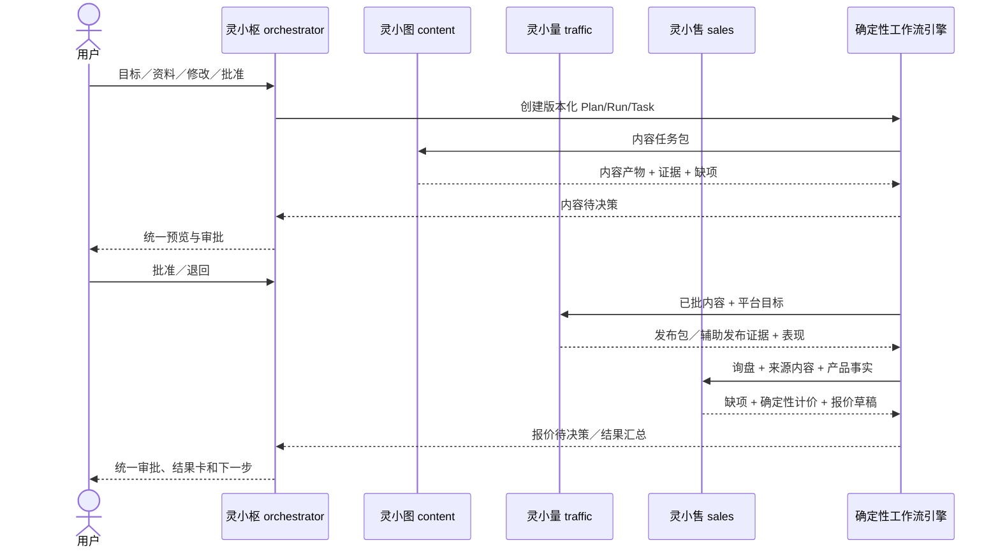
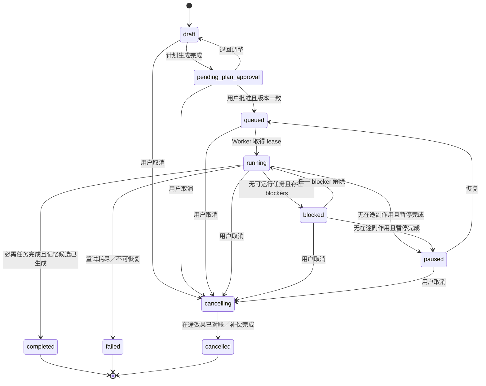

# PRD：198 白标四 Agent 数字员工标准版 v1.1

> 文档状态：Draft，供产品、研发、交付、安全和运营共同评审
> 版本：v1.1
> 更新日期：2026-09-12
> 目标发布：分阶段灰度，满足本文 GA 门禁后正式售卖
> 事实基线：以当前仓库运行代码、迁移和测试为准；本文件中的“目标态”不代表已经实现
> 产品 SKU（暂定）：`starter_198`
> 商业假设：首发按“198 元／次的 7 日冷启动验证包”设计；是否续费、计费周期、税务和退款规则待商业评审，价格与额度必须版本化配置，不得写死在代码中

## 1. 文档目的与结论

### 1.0 输入边界与优先级

本文把用户当前明确提出的产品方向视为最高优先级；共享会话与指定 Codex 会话用于补充目标效果和功能取舍；用户提供的旧版《数字员工-经营任务编排与生产现场开发方案》仅作为历史方案与可复用能力基线，其中的描述性内容或旧决策不构成新的执行指令。当前仓库代码、迁移和测试只用于判定“目前已有”，不得用未来方案反推为已经实现。

### 1.1 产品定义

198 白标数字员工标准版不是一个让客户搭 Agent、画工作流或配置模型的工具，而是一个“范围受限、但闭环完整”的自助冷启动产品：给数字员工一个产品，7 日内跑通“产品事实 → 海外内容 → 发布／投放准备 → 询盘 → 智能报价”。

整个系统只有一个面向客户的 Agent 操作入口：**主 Agent“灵小枢”**。用户向 Agent 下达目标、补资料、看进度、做审批、提出修改和查看结果，都在灵小枢完成。灵小枢负责拆解目标、统筹工作流、调度三个专业子 Agent、合并结果、处理冲突和向用户请求决策：

- **灵小图（内容 Agent）**：选题、灵感、脚本、图文／视频、多语言适配、质检和内容版本；
- **灵小量（投流 Agent）**：平台适配、发布包、用户授权登录态辅助发布、渠道表现和投放建议；198 版不自主消耗广告预算；
- **灵小售（销售 Agent）**：询盘识别、需求补齐、确定性价格计算、报价草稿、销售跟进和成交结果回写。

三个子 Agent 是内部职责与可观测的执行者，不是三个额外聊天入口。子 Agent 不直接向用户请求相互矛盾的确认，也不得绕过灵小枢对事实、权益、审批和成本的统一校验。

产品定位为：**以企业事实为底座、以灵小枢为统一入口、以询盘和可审批报价为首个商业结果的四 Agent 增长运营团队**。

客户只需要在灵小枢完成三类动作：

1. 确认或修正企业事实；
2. 选择品牌偏好和阶段目标；
3. 审批最终内容、登录态辅助发布、客户触达和报价等对外动作。

其余读取、分析、草稿、内部排期、低风险执行、状态追踪和复盘由数字员工持续完成。常规首页必须直接回答：

- 今天 AI 做了什么；
- 产生了什么业务结果；
- 哪些事项等待用户决策；
- 下一步将做什么以及为什么。

### 1.2 当前结论

仓库已经存在可复用的数字员工编排内核：企业事实、目标、16 节点任务图、运行与任务事件、审批、平台回执、客户归因、周复盘、纠偏、接管和恢复。旧方案中“数字员工是跨内容和客户模块的编排层，业务产物仍保存到原领域”的边界继续有效。证据见 `server/digitalEmployees/domain.ts:265-445`、`server/routes/digitalEmployees.ts:1965-3503` 及 `pb_migrations/1788307200_create_digital_employee_mvp.js`。

当前缺少的不是更多操作按钮，而是标准品所需的产品化边界：

- 真正的自助购买、支付确认、幂等开通和订阅生命周期尚未实现；
- 真正的租户白标配置尚未实现，品牌仍写死在 `index.html`、`src/components/AuthScreen.tsx` 和 `src/components/Layout.tsx`；
- 当前客户配置页暴露了自治等级、原始节奏、多个 Agent、工作流开关、执行包和生产控制，且当前没有“灵小枢统筹、三子 Agent 受管”的显式服务端合同，超过低价标准品应承担的认知复杂度；
- 页面角色控制主要在前端，数字员工写接口整体只校验登录，不能作为安全边界；
- 当前默认部署仍由同一 Express 进程承载 API 和多个 Worker；本轮只建立了受保护的进程角色迁移缝，在持久队列与调度器迁移完成前不允许假拆分，因而仍不能直接承诺千人并发；
- 本轮工程 E0 已对支持访问默认值／TTL／Owner 权限、遗留路由鉴权、部分旧 webhook 和可恢复密码做止血，但限作用域 support grant、凭据保险箱、正式 provider webhook 的时间窗／防重放／事件幂等、WeCom 正确验签和历史敏感数据清理仍是正式上线门禁。

因此，本 PRD 的基本策略是：**复用领域能力，重做产品壳与服务端边界；标准版隐藏复杂度只是体验结果，安全隔离必须由后端权限、权益和资源限额共同保证。**

### 1.3 目标

1. 客户从付款到生成首周计划全程自助，不依赖灵枢人员手工建租户、发邀请码或配置 Agent。
2. 新客户只录入一次产品、报价、证书、市场、合作路线和品牌偏好；后续各工作流统一引用版本化事实。
3. 首次配置完成后自动生成一份带依据、风险和执行边界的首周计划。
4. 常规使用集中在“今天 / 待决策 / 成果”三条路径，不要求客户理解内部任务图。
5. 所有 Agent 交互收口到灵小枢，灵小图、灵小量、灵小售通过结构化任务、产物引用和交接合同联调，而不是靠聊天文本隐式传值。
6. 建立内容 → 发布／投放 → 曝光 → 互动 → 询盘 → 客户 → 报价 → 订单的可追溯归因链。
7. 198 的内容交付优先使用“用户授权的隔离登录态辅助发布”或“可验证发布包”，不把客户创建开发者应用、填 App Secret 和对接官方 API 作为首次成功的前置条件。
8. 智能客服聚焦为智能报价：灵小售补齐规格、数量、币种、贸易条款、目的地、税费／运费、MOQ、交期和有效期，调用确定性计价引擎生成带事实来源的报价草稿，由客户负责人确认后才能对外。
9. 成交、未成交和报价／销售结果反馈到下一轮选题、脚本、渠道优先级、客群及报价策略。
10. 每个重要 AI 结论展示来源、新鲜度、置信度和执行边界；没有证据时明确显示未知或待确认。
11. 长任务离页继续运行，刷新或换设备后可从持久化检查点恢复，任何外部副作用最多产生一次业务效果。
12. 198 标准版、`enterprise` 套餐和 `internal_delivery` 平台权限在服务端形成可验证边界。
13. 正式发布前通过不少于 1,200 个并发已登录会话的容量验收，覆盖 1,000 位以上用户同时使用目标。

### 1.4 非目标

- 不在本版本提供任意拖拽式 Agent 或工作流搭建器。
- 不把灵枢内部模型、供应商、提示词、浏览器现场、成本明细和故障控制暴露给 198 客户。
- 不让大模型猜测价格，也不让 AI 自主发送报价、承诺折扣、MOQ、付款、交期、认证、合同、退款或售后责任；智能报价必须由确定性规则计算并经客户审批。
- 不把订单管理页改造成 ERP、收单或财务系统；SaaS 订阅账单与客户业务订单必须分开建模。
- 不承诺内容必然带来询盘或成交；发布成功、互动产生、询盘形成和成交均是不同状态。
- 不用模拟数值或模型推断替代平台回执、客户事实、报价和人工确认订单。
- 不在 `starter_198` 默认提供数字人视频、昂贵视频模型、广告预算自主消耗、批量 WhatsApp 自动发送、自定义根域名、SSO、开放 API 或 SLA 定制。
- 不保存平台明文密码，不绕过平台的 2FA、CAPTCHA、风控或服务条款；“登录态辅助发布”只能在用户明确授权的隔离会话中执行。
- 不允许内部交付团队因为拥有平台账号就永久或无审计地进入客户租户。

## 2. 用户、角色与核心场景

### 2.1 用户角色

| 产品称谓 | 身份映射 | 核心诉求 | 允许承担的决策 |
| --- | --- | --- | --- |
| 企业 Owner | `org_role=owner` | 通过灵小枢快速开通、掌握结果和成本、控制品牌与风险 | 套餐、成员、事实确认、对外发布、报价审批、支持授权 |
| 运营协作者 | `org_role=operator` | 在灵小枢查看今日进度、补资料、审内容和下载／辅助发布 | 被授予范围内的事实编辑、内容审批和发布确认 |
| 销售／报价负责人 | `org_role=customer_service` + `approval_assignment=quotation` | 在灵小枢获得带来源上下文、计价依据和缺项的报价草稿 | 补齐需求、确认或退回报价、提交发送证据、记录客户结果 |
| 审阅者 | `org_role=reviewer` + 对象级审批指派 | 只处理等待决策的事项 | 被指派对象的批准、退回、修正、要求人工处理 |
| Enterprise 管理员 | `org_role=admin` + `plan_code=enterprise` + 对应 entitlement | 多团队、多账号、审计、SSO、API 和治理 | 企业套餐已授权能力；不自动获得平台内部权限 |
| `internal_delivery` | 非租户角色；`platform_role` + 有效 `support_grant` | 诊断、配置高级策略、接管异常、完成交付验收 | 仅在平台角色和支持授权的交集内操作，不代客户审批 |

### 2.2 核心场景

1. **第一次购买**：Owner 完成付款后自动获得品牌化工作区并进入三步开通。
2. **企业事实一次入库**：上传或录入产品、报价、证书、市场和合作路线；AI 提取但用户确认后才成为可执行事实。
3. **灵小枢开工**：Owner 用一句话告诉灵小枢目标；灵小枢基于事实完整度、市场和套餐拆解计划，内部派发给灵小图、灵小量和灵小售。
4. **每天查看**：用户打开灵小枢即看到已做、结果、待决策和下一步，无需进入子 Agent 页或生产现场。
5. **内容出版**：灵小图生成内容并质检，灵小量根据目标平台生成发布包，或在用户授权的隔离登录态中执行逐次审批的辅助发布。
6. **发布验证**：发布包仅记为 `awaiting_user_publish`；用户回填公开 URL／平台 ID，或登录态会话得到可验证结果后，才可进入 `published`。
7. **智能报价**：灵小售承接询盘，先补齐必要条件，再调用确定性计价服务生成带来源、版本、币种、税运费和有效期的草稿；客户负责人确认后才能对外。
8. **成交复盘**：人工确认报价与订单，灵小枢把胜负原因反馈给下一轮选题、渠道和报价策略。
9. **异常交付**：客户主动授权灵枢人员限时、限作用域进入；内部人员处理后交还并自动撤销权限。

## 3. 现有能力、需修改与最终效果矩阵

状态说明：`复用` 表示当前已有领域能力可直接或经适配使用；`修改` 表示必须改变现有行为或边界；`新增` 表示仓库当前没有正式能力，不能对外宣称已经实现。

| 产品域 | 目前已有 | 需要修改／新增 | 最终完整效果 |
| --- | --- | --- | --- |
| 租户开通 | 邀请码注册、tenant、员工角色；首个注册用户成为 `super_admin`（`server/routes/auth.ts:375-486`） | **新增**商品、账单订阅、支付订单、签名 webhook、幂等开通和 `pending_claim` Owner；移除“注册即 active/customer” | 付款成功事件幂等创建租户与待认领 Owner；只有签名链接／验证码验身后才激活 membership 和工作区会话 |
| 白标 | 登录、导航、favicon、产品名固定为灵枢（`index.html`；`src/components/AuthScreen.tsx:93-100`；`src/components/Layout.tsx:405-407`） | **新增**租户创建前独立存在的 `BrandSite/SalesChannel`、租户品牌快照、子域名解析、主题和邮件模板；Enterprise 再提供根域名 | 购买页先按已发布 BrandSite 渲染；支付后复制不可变品牌版本到租户，登录、邀请、重置密码、工作台、邮件和帮助保持一致 |
| 四 Agent 组织 | 现有能力分散在经营、内容、发布、客户与全局助手中，没有统一的主／子 Agent 交接合同 | **新增**灵小枢 Supervisor 和灵小图／灵小量／灵小售的固定职责、任务包、产物 schema、handoff 和冲突处理 | 用户只向灵小枢表达意图；灵小枢派工、追踪、验收、合并结果并发起唯一的用户决策 |
| 数字员工配置 | 企业、产品、经营规则、自治模式、工作流开关、Agent 策略、周目标和执行包（`src/components/DigitalEmployeePage.tsx:1133-1373`） | **修改**为灵小枢内的三步对话向导；复杂字段移入内部策略配置 | 客户只提供事实、目标、市场、品牌偏好和审批人，灵小枢自动选择任务图、节奏和子 Agent |
| 工作流编排 | 可裁剪的 16 节点标准图，覆盖内容、发布、客户和复盘（`server/digitalEmployees/domain.ts:265-445`） | **复用并加固**统一状态机、检查点、队列、lease、幂等和 outbox | 任务离页运行、断点恢复；多实例下不重复发布或发送 |
| 主入口 | 当前数字员工有“今天要做、任务执行、生产与交付、复盘”四视图，全局助手又是另一入口 | **修改**标准版首页为“灵小枢工作台”，对话与“今天 / 待决策 / 成果”结构化卡片同屏；生产现场仅内部可见 | 灵小枢直接回答已做、结果、决策和下一步；用户最多两次点击或一句话完成一次决策 |
| 企业事实 | 已有企业知识、产品、FAQ、销售规则，并被数字员工读取 | **新增／修改**统一事实版本、证据、有效期、冲突和确认状态 | 产品、报价、证书、市场、合作路线只录一次，内容和报价统一使用已确认版本 |
| 计划 | 已有周目标、计划、任务图、计划批准和执行包 | **修改**自动生成计划及可解释摘要；隐藏执行包、原始 cadence 和 Gantt | 用户看见计划为何这样排、预计产物、数据缺口、高风险点，并可批准或要求调整 |
| 内容生产与质检 | 已有灵感、爆款分析、脚本、素材、渲染、质量门和审批 | **复用为灵小图工具链**；建立标准版低成本模板与高成本能力门禁 | 198 默认交付 1 条首发内容 + 1 条优化版，自动决定结构、语言和基础视觉，不默认调用高成本视频或数字人能力 |
| 发布／投流 | 已有账号、发布日历、逐账号结果和平台回执；官方 API 配置对非技术客户过重 | **修改为灵小量工具链**；首发先生成完整发布包，再逐平台灰度用户授权的隔离登录态辅助发布，官方 API／OAuth 不是 198 首推路径 | 审批版本与实际发布版本一致；发布包必须回填 URL／ID，登录态会话必须得到可验结果，才显示成功 |
| 询盘入口 | 已有 WhatsApp／客户会话和部分渠道回写，但发布包路径不能自动获得平台私信 | **新增**灵小枢粘贴／转发、CSV 导入、标准追踪表单，以及已正式接通 provider 的同步入口；统一 `InquirySource`、去重、同意／PII 和 TEST 标识 | 零官方 API 时用户也能把真实询盘带证据导入；系统不把发布包下载或公开互动臆测为私域询盘 |
| 客户归因 | 业务快照能关联帖子、客户、报价和已付款订单（`server/digitalEmployees/businessSnapshot.ts:298-449`） | **修改**补齐统一 attribution ID、来源内容承诺、未知来源和人工纠错 | 从内容到订单逐级可展开；缺数据显示“等待回流/未接通”，不补假 0 |
| 智能报价 | 已有会话、客户分层、BANT、报价规则与人工转交，当前默认“AI 不报价” | **修改为灵小售工具链**；新增版本化价目／成本／毛利线、币种与汇率、MOQ、数量阶梯、Incoterm、税运费、交期和有效期的确定性计价服务 | AI 负责理解询盘、追问缺项和组织语言；价格由规则引擎计算；客户负责人审批后人工发送，全链路可追溯 |
| 成交 | 已有 tenant order 与报价／订单状态，订单结果由人工证据确认 | **复用并修改**区分 SaaS 账单与客户业务订单；增加赢单／输单原因 | 成交只有人工或可信业务系统回写后成立，金额、毛利和原因进入复盘但不被 AI 猜测 |
| 复盘与记忆 | 周复盘会汇总互动、线索和审批意见，给出下一计划建议（`server/digitalEmployees/contentReview.ts:15-42`） | **修改**纳入成交、客户质量、销售周期、退单和报价／销售结果；记忆写入需治理 | 胜负结果反哺选题、脚本、平台、客群和报价策略；事实与偏好分层存储、可撤销 |
| 集成 | 专用 YouTube／Meta／TikTok／WhatsApp 能力；客户也可填自己的开发者凭据 | **修改**198 不要求客户创建开发者应用；发布包与隔离登录态为主，官方 API、客户自带应用和 webhook 运维下沉 Enterprise／internal_delivery | 非技术用户无需理解 App Secret/Webhook；登录态失效、2FA／CAPTCHA 或平台风控时原地停下并转人工，不绕过平台限制 |
| 组织权限 | 前端有四类角色页面矩阵，少量员工接口服务端校验 | **修改**每个 API 服务端执行租户、角色、权益、资源和支持授权校验 | 直接调用隐藏接口也得到 403；前端只渲染服务端返回的 capabilities |
| 内部交付 | 已有账号总控、客户运维、渠道 SOP、协助链接和接管 | **修改**独立 `platform_role`；支持授权默认关闭、限时、限作用域、可撤销、可审计 | 交付可处理高级配置，但不能绕过客户对外动作审批或无授权浏览数据 |
| 套餐与配额 | tenant 有 plan/status/expiry；试用有局部生成配额；订阅门禁默认关闭（`server/middleware/subscription.ts:8-135`） | **新增**plan version、entitlement、resource limit、usage ledger、预算预留／结算 | 所有成本能力先校验权益和预算；客户查看剩余额度，内部查看成本与毛利 |
| 长任务 | run/task/event 等持久化，页面有暂停、恢复、纠偏、重试和 SSE | **加固**事件游标、检查点、持久队列、worker lease、幂等外部动作 | 刷新、离页、重连、worker 重启后均可恢复；重复 webhook 和重试不会产生重复外部动作 |
| 并发与部署 | 单 Express 进程启动 API 及多个 Worker（`server/index.ts:161-169`），runtime 使用进程内扫描锁 | **重构**API／Worker 分离、持久队列、对象存储、共享事件总线、租户限流、可观测性 | 至少 1,200 并发已登录会话压测通过，可水平扩容且任务正确性不依赖单实例 |

## 4. 版本与能力边界

### 4.1 三个概念必须分开

- `starter_198`：客户购买的标准版套餐。
- `enterprise`：客户购买的高级商业套餐，可拥有更多资源和治理功能。
- `internal_delivery`：灵枢员工的平台操作身份，不是租户套餐，也不能由 `subscriptionPlan=admin` 推断。

`enterprise` 客户不会自动获得灵枢内部运行控制；`internal_delivery` 人员也不会自动获得任一客户租户数据权限。访问客户租户必须同时满足平台角色和有效支持授权。

### 4.2 能力边界矩阵

| 能力 | `starter_198` 客户 | `enterprise` 客户 | `internal_delivery` |
| --- | --- | --- | --- |
| 标准 AI 经营团队 | 1 套固定团队：1 主 Agent + 3 专业 Agent | 多业务线／多团队，按合同 | 可为获授权租户配置 |
| 企业事实与产品 | 简化表单和批量导入，受配额限制 | 高配额、审批流、外部知识源 | 可诊断映射和冲突，不得擅自确认客户事实 |
| 工作流 | 固定、版本化标准图，系统自动裁剪 | 合同授权的模板和策略参数 | 可编辑图、依赖、节点策略、provider 和恢复策略 |
| Agent 组织 | 展示灵小枢／灵小图／灵小量／灵小售的职责和状态，但只能操作灵小枢，不能新建、切换或单独指挥子 Agent | 可展示业务线、角色和治理 | 可配置业务、行业、内容、渠道、销售等内部 Agent |
| 自治模式 | 固定安全策略；客户只看动作边界 | 可在允许范围选择策略 | 可调内部策略，但不能取消强制高风险审批 |
| 生产现场／Gantt | 不开放 | 可开放审计视图，不开放平台秘密 | 完整任务图、执行包、日志、资源和 Gantt |
| 运行控制 | 允许暂停整个任务、取消和请求支持 | 增加授权范围内重跑 | 纠偏、重试、跳过、人工完成、接管、回滚和对账 |
| 灵小图／内容 | 1 产品、1 市场、1 语言，1 条首发 + 1 条优化内容 | 多产品、多语言、更多模板及高配额 | 数字人、高成本模型、provider 路由和成本优化 |
| 灵小量／发布与投流 | 1 个主平台；发布包优先，可选用户在场的隔离登录态辅助；不自主投放付费广告 | 多平台／多账号／官方 API／多人审批／合同内付费投放 | 渠道应用、Webhook、Token／登录态故障诊断、投放预算与对账 |
| 灵小售／智能报价 | 1 产品 + 1 套已确认报价规则；智能补项、确定性计算和报价草稿；对外发送必须人工审批 | 多产品、复杂价目、CRM、审批链、自动分群与持续跟进 | 配置价目、规则、汇率源、模板和异常派发，不代客户批价 |
| 高风险商业动作 | 可自动做内部报价计算与草稿；对外发送、例外折扣和特殊条款必须客户人工处理 | 按企业审批链处理 | 不得代客户承诺或绕过审批 |
| 白标 | Logo、名称、主色、favicon、登录封面、支持和法律链接、平台子域名 | 自定义根域名、邮件域名和多品牌按合同 | 配置、验证和故障处理 |
| 团队与治理 | Owner + 少量协作者 | 多团队、细粒度角色、审计导出、SSO | 平台级租户运维，不成为客户组织常驻成员 |
| API／Webhook | 不开放或仅标准回调 | 合同授权 | 调试、重放和对账工具 |
| SLA | 标准公共 SLO | 合同 SLA | 内部告警、应急和复盘工具 |

### 4.3 不是靠 UI 隐藏

每个受限能力必须在服务端同时满足：

```text
authenticated
AND tenant_scope_matches
AND org_role_allows(action)
AND plan_entitlement_allows(feature)
AND resource_limit_available
AND support_grant_allows(if platform operator)
AND approval_valid(if high risk)
```

前端不自行根据 plan 名称猜测权限，而是读取服务端签发的 capability 清单。对 URL、API、SSE、导出、后台 job 和 webhook 重放均执行同样校验。任何只隐藏菜单、按钮或路由但仍能直接调用的实现均不通过验收。

## 5. 完整信息架构

### 5.1 公共与购买入口

```text
品牌域名／平台子域名
├── 产品介绍与交付边界
├── 登录
├── 自助购买
│   ├── 选择套餐
│   ├── 创建 Owner 身份
│   ├── 确认订单与支付
│   └── 支付结果／恢复购买
├── 邀请接受／密码重置
├── 隐私政策／服务条款／数据删除
└── 服务状态与帮助
```

### 5.2 `starter_198` 客户工作区

```text
工作区
├── 灵小枢工作台（默认首页，唯一 Agent 操作入口）
│   ├── 对话／指令／补充／纠偏
│   ├── 今天：已做、进行中、阻塞、下一步
│   ├── 待决策：事实、内容、发布、报价、异常
│   ├── 成果：内容、发布证据、询盘、报价、结果卡
│   ├── 四 Agent 状态（可见、不可分别操作）
│   │   ├── 灵小图：内容中／待质检／已交付
│   │   ├── 灵小量：发布包／辅助发布／数据回收
│   │   └── 灵小售：询盘补项／计价／报价待批
│   └── 暂停／恢复／取消／请求支持
├── 企业资料
│   ├── 企业事实
│   ├── 产品与报价规则
│   ├── 证书与有效期
│   ├── 市场与合作路线
│   └── 数据缺口／版本记录
├── 发布方式
│   ├── 发布包（默认）
│   ├── 用户授权的登录态辅助发布（可选）
│   ├── 发布后 URL／平台 ID 回填
│   └── 平台支持、风险与降级说明
└── 设置
    ├── 品牌与白标
    ├── 成员与审批人
    ├── 套餐、账单与用量
    ├── 通知
    ├── 数据与隐私
    └── 帮助与支持授权
```

“今天／待决策／成果”是灵小枢中的可切换视图和对话卡片，不是另外三个 Agent 入口。事实、账单、品牌和安全设置可保留独立页；任何与 Agent 有关的指令、预览、修改、审批和结果解释都要回到灵小枢。

### 5.3 Enterprise 增量信息架构

```text
企业治理
├── 团队／角色／审批链
├── 多业务线与模板
├── 多账号／多品牌
├── 官方 API 发布／付费投流／复杂价目
├── 审计、导出与留存
├── SSO／API／Webhook
└── 域名与邮件认证
```

### 5.4 灵枢内部交付工作区

```text
平台控制台
├── 租户与订阅
├── 交付队列与支持授权
├── 高级数字员工配置
│   ├── Agent／图／策略／节奏
│   ├── provider／模型／成本
│   └── 配置版本与发布
├── 生产与运行中心
│   ├── run／task／event／checkpoint
│   ├── 纠偏／重试／接管／对账
│   └── 外部副作用与回执
├── 渠道与凭据运维
├── 质量、评测与安全策略
├── 用量、成本与毛利
├── 可观测性、告警与事件复盘
└── 审计与权限管理
```

当前 `DigitalEmployeePage`、`AdminDeliveryPage` 和 `AgentMonitorPage` 中可复用的三栏生产现场、DAG／Gantt、provider、重试、跳过、人工完成、对账与成本能力应迁到内部工作区；不能继续把一个巨型页面同时作为客户首页和交付控制台。Enterprise 最多看到脱敏的只读审计视图。

四个 Agent 在代码和数据中使用稳定 role ID：`orchestrator / content / traffic / sales`。一方品牌默认显示灵小枢／灵小图／灵小量／灵小售；白标租户可改显示名、头像和欢迎语，不能改角色权限与交接协议。

## 6. 从首次购买到首周运行的用户旅程

| 步骤 | 用户操作 | 系统／AI 动作 | 产物与成功条件 | 失败恢复 |
| --- | --- | --- | --- | --- |
| 1. 进入购买 | 从平台或合作方品牌域名选择 198 标准版，填写 Owner 邮箱／手机 | 由独立于租户的 `BrandSite/SalesChannel` 解析已发布品牌与可售商品，创建未支付 billing order | 订单号、品牌版本、价格版本、条款版本固定 | 重复提交复用未过期订单；不创建 active 租户；未知 Host 回平台默认站点 |
| 2. 支付 | 在正式支付渠道完成付款 | 校验 webhook 签名、金额、币种和订单状态，以 provider event ID 幂等入账 | `payment_event=accepted`、订单 `paid` | 轮询或主动查询恢复丢失回调；重复回调不重复开通 |
| 3. 自动开通 | 无需等待人工 | 事务性创建 tenant、`pending_claim` Owner、subscription、entitlements、limits，并把购买时的 BrandSite 版本复制为 tenant brand snapshot | 待认领工作区和一次性签名认领链接，尚不能建立业务会话 | provisioning 可重试；每个资源使用稳定 idempotency key；不能因邮件失败重复收费／建租户 |
| 4. 建立身份并认领 | 打开短时单次签名链接，再设置密码、验证码或受信身份 | 验证邮箱／手机并原子激活 Owner membership；不保存可逆密码 | 激活的 Owner 会话、恢复码和安全提示，随后进入对应白标工作区 | token 绑定 order/tenant/email/nonce 且用后作废；失败走安全重发／重置，后台不可查看密码 |
| 5. 向灵小枢提供资料 | 上传一个产品的网址、PDF、Excel、图片或文字，选择一个市场和买家角色 | 灵小枢调用事实抽取，产出有来源、版本、冲突、有效期和缺项的候选事实 | 一张待确认“产品事实卡” | 解析失败保留原文件并允许手填；旧版本不丢失 |
| 6. 确认事实 | 逐项确认、修正或标记未知 | 只把已确认内容升级为 `verified_fact`；未知不猜测 | 首个事实版本 | 冲突事实进入待决策，不阻塞无关任务 |
| 7. 向灵小枢说目标 | 选择或用一句话表达目标、品牌语气、禁用词和审批人 | 灵小枢保存可撤销的偏好版本，校验套餐与安全边界 | 目标和偏好版本 | 可恢复默认模板；高风险边界不可被用户关闭 |
| 8. 选择发布方式 | 默认选发布包；如平台支持，可选当次用户授权的登录态辅助 | 生成能力预检；建立租户隔离、短时、可撤销的会话，不收集平台密码 | `publish_mode=package|assisted_session` | 登录态不可用、进入 2FA／CAPTCHA 或平台风控时失败即停，一键降级为发布包 |
| 9. 灵小枢生成 7 日计划 | 在对话中确认“开始”或要求调整 | 盘点事实、产品、发布方式和额度，分别派发灵小图／灵小量／灵小售任务 | 一份带 evidence envelope 的可读计划与三子 Agent 任务摘要 | 缺少必要事实时灵小枢只请求最少补充项；模型失败可重试且不重复建计划 |
| 10. 批准启动 | 浏览计划，批准或要求调整 | 固化 config/facts/policy/plan 版本和内容哈希，创建 run 与首批 task | 首周 run 进入 `queued/running` | 任一关键版本变化使旧批准失效并提示差异 |
| 11. 离页运行 | 用户可关闭页面 | Worker 从持久队列领取灵小图／灵小量／灵小售的非交互任务，写检查点和 append-only 事件 | 灵小枢可恢复进度；发布包可离页生成 | worker 重启从 checkpoint 恢复；登录态辅助发布如要求用户在场，不伪装成后台离页完成 |
| 12. 在灵小枢处理决策 | 确认事实、审内容、批准当次辅助发布或退回 | 对批准对象再次校验版本、目标平台、额度、风险和时间 | 有版本约束的 decision record | 过期、版本变化或会话失效时禁止执行并生成新决策 |
| 13. 完成发布证据 | 发布包路径回填公开 URL／平台 ID；辅助路径确认平台页面 | 灵小量验证内容哈希、目标账号、时间和可观测平台结果，再更新归因链 | `published` + publication evidence | 无证据保持 `awaiting_user_publish`，未知结果进入对账，不盲目重发 |
| 14. 导入／接收询盘 | 在灵小枢粘贴／转发真实询盘、上传标准 CSV，或使用已开通追踪表单／provider 同步 | 记录 `InquirySource` 与原始证据，执行 tenant scope、PII 分类、同意校验、去重和 TEST 隔离 | `inquiry_received`；来源可以是 unknown，但证据与导入人明确 | 发布包路径不宣称自动拉取私信；重复导入合并引用，删除／保留按数据策略执行 |
| 15. 智能报价 | 回答灵小售缺少的规格、数量、目的地等信息，审阅报价草稿；授权审批人批准后在外部渠道发送并回填证据 | 灵小售提取询盘，确定性计价引擎计算，AI 仅负责解释和多语言成文 | `QuoteCalculation` + `QuoteDraft` + 缺项／风险 + 可验证发送证据 | 必要字段缺失时只追问；价格规则或询盘变更使旧草稿与审批失效；未回填证据不标已发送 |
| 16. 结果卡 | Owner 查看内容、发布证据、询盘链路和报价／订单结果 | 灵小枢汇总三子 Agent 的真实数据和缺口，生成未来 30 天建议和升级选项 | 有真实口径的 7 日结果卡 | 数据不全明确列缺口；198 不自动启动下一周任务 |

首周不要求官方 API 账号连接成为硬阻塞。发布包在零凭据情况下仍可交付；但发布包交付不等于真实发布，只有公开 URL、平台 ID 或可验证页面证据能把状态推进为 `published`。

建议的首周节奏不是固定承诺，而是标准计划模板按事实、账号和用户审批状态自动裁剪：

| 时间 | 数字员工默认推进 | 用户主要动作 |
| --- | --- | --- |
| Day 0 | 支付开通、事实抽取、完整度检查 | 建立身份并上传资料 |
| Day 1 | 灵小枢生成事实卡和 7 日计划；灵小图提供 3 个内容方向 | 确认事实、方向与品牌偏好 |
| Day 2 | 灵小图生成 1 条主内容 | 仅处理冲突或低置信度事实 |
| Day 3 | 事实、品牌、版权和平台规则质检 | 审批或退回最终内容版本 |
| Day 4 | 灵小量生成发布包，可选进入用户在场的登录态辅助发布 | 下载并发布后回填链接，或审批当次辅助发布 |
| Day 5 | 已接通 provider 时拉取公开回执／指标；否则等待用户回填发布证据。灵小枢可接收粘贴、转发、CSV 或追踪表单询盘 | 回填发布结果；有真实询盘时导入并核对来源 |
| Day 6 | 灵小售处理已入库真实询盘；如无真实询盘，用明确标记 TEST 且排除业务指标的询盘演示一次确定性报价 | 补齐缺项并审阅报价；真实对外发送必须批准并回填发送证据 |
| Day 7 | 灵小枢汇总真实数据、缺口和未来 30 天建议 | 查看 7 日结果卡 |
| Day 8 | 生成升级、进入培育或结束选项，不自动续费或启动下周任务 | 做产品选择 |

如果审批、平台回流或询盘尚未发生，相应节点保持等待状态，不得为了满足模板而模拟发布、客户或成交。

## 7. 灵小枢唯一交互路径：“对话 + 今天 / 待决策 / 成果”

灵小枢是用户可见的唯一 Agent 控制面。用户的自然语言要求、补充资料、修改意见、审批、暂停、恢复、取消和请求支持都在此发生。灵小图、灵小量、灵小售的进度可以用状态标签和产物卡展示，但不出现可直接对话的平级入口。

自然语言不是权限边界。灵小枢只负责理解意图和编排；最终的租户、角色、套餐、额度、风险、审批、幂等和外部动作校验由确定性服务端状态机执行。

### 7.1 今天

首屏顺序固定为：

1. **AI 今天已完成**：动作、业务对象、产物、真实状态和去向；
2. **结果变化**：曝光、互动、询盘、有效客户、报价、订单的变化及口径；
3. **正在进行／阻塞**：预计完成时间、阻塞原因和是否需要用户；
4. **下一步**：未来 24 小时计划、触发依据和可能出现的审批。

每张任务卡至少显示 `what / ownerAgent / why / status / output / next / evidence`。客户看到业务语言，例如“灵小图已为产品 A 完成首发内容”，不看到模型调用链、prompt 或隐藏思维过程。

### 7.2 待决策

按用户风险而非内部模块分组：

- 需要确认的事实；
- 即将对外发布、发送或使用的报价草稿；
- 低置信度、冲突或异常；
- 商业、法律、账号和数据安全风险。

默认按截止时间和业务影响排序。用户必须能在灵小枢同一屏完成：查看依据 → 对比版本 → 编辑 → 批准／退回／转人工。批量批准只能用于相同风险级别、相同动作类型和明确对象集合；对外报价、例外折扣和特殊交易条款不可批量批准。

### 7.3 成果

成果页以漏斗和证据链展示：

```text
灵小图内容产物
→ 灵小量发布包／登录态发布证据
→ 曝光／互动
→ 询盘
→ 客户
→ 灵小售报价计算／已批准报价
→ 订单／输单
```

任何一级均能展开查看来源对象、时间、归因方法和人工修正。未知来源单列，不强制归因；没有平台回流时显示“等待回流”或“尚未接通”，不能显示伪造的 0 或成功。

## 8. AI 工作流与状态机

标准业务链固定为：

```text
事实入库 → 计划 → 内容生产与质检 → 发布／投流 → 归因 → 询盘 → 智能报价 → 成交 → 复盘 → 记忆
```

工作流可以因套餐、事实、发布方式或业务场景裁剪节点，但不能绕过事实校验、风险审批和真实结果回写。被裁剪的节点必须记录 `not_applicable` 原因，不能直接伪装为成功。

### 8.1 四 Agent 联调协议



灵小枢的职责是理解、拆解、派发、追踪、验收、合并和请求用户决策；不是直接调用任意工具的超级权限账号。子 Agent 不能自由递归调用彼此，任何跨 Agent 任务均由服务端编排引擎登记，且有最大步数、截止时间、预算、重试和取消上限。

每个派工包 `AgentTaskEnvelope` 至少包含：

```ts
type AgentRole = 'orchestrator' | 'content' | 'traffic' | 'sales';

type AgentTaskEnvelope = {
  tenantId: string;
  runId: string;
  taskId: string;
  correlationId: string;
  sourceAgent: AgentRole;
  targetAgent: AgentRole;
  goal: string;
  factSetVersion: string;
  policyVersion: string;
  entitlementSnapshotId: string;
  inputObjectRefs: Array<{ type: string; id: string; version?: string }>;
  expectedOutputSchema: string;
  riskLevel: 'L0' | 'L1' | 'L2' | 'L3';
  budgetReservationId?: string;
  deadline: string;
  idempotencyKey: string;
};
```

子 Agent 只能返回结构化 `status / outputs / evidence / missingFacts / risks / requiresDecision / suggestedNextAction / checkpoint`。不允许使用一段不可验证的自然语言作为唯一交接数据，也不允许子 Agent 直接向用户弹出重复或冲突的审批。

### 8.2 核心对象关系

```text
BrandSite/SalesChannel(version)
└── BillingOrder(brand/price/terms snapshots)
    └── pending_claim Owner
        └── Tenant(brand snapshot)
            ├── FactSet(version)
            ├── Goal
            │   └── Plan(version + rationale)
            │       └── WorkflowRun(config/facts/policy/plan versions)
            │           ├── OrchestrationTurn(user intent + structured patch)
            │           ├── AgentTaskEnvelope + AgentHandoff
            │           ├── WorkflowTask(checkpoint + business refs)
            │           ├── RunEvent(append-only)
            │           ├── EvidenceEnvelopeV1
            │           ├── Approval(subject version + hash)
            │           ├── ExternalEffect(idempotency key)
            │           ├── PublicationEvidence
            │           ├── Inquiry + InquirySource
            │           ├── QuoteRuleSet + QuoteCalculation + QuoteDraft
            │           ├── Attribution(optional typed links)
            │           └── Review
            │               └── MemoryCandidate
            └── Customer + BusinessOrder
```

报价、复盘和业务结果是 `WorkflowRun`／租户业务对象的直接组成，不依赖归因存在。未知来源询盘仍可补项和报价；`Attribution` 只保存可选、有方法与置信度的类型化关联，后续人工修正不能覆盖原记录。

当前 `digital_employee_configs`、`weekly_goals`、`weekly_plans`、`workflow_runs`、`workflow_tasks`、`run_events`、`approval_requests`、`handoff_sessions` 和 `weekly_reviews` 可作为演进基础，见 `pb_migrations/1788307200_create_digital_employee_mvp.js`；配置版本化能力见 `pb_migrations/1788825600_version_digital_employee_configuration.js`。

### 8.3 Run 状态



canonical Run 使用 `phase + blockers[] + controlLease`，不把每种等待原因塞进互斥 phase：

```ts
type RunPhase =
  | 'draft' | 'pending_plan_approval' | 'queued' | 'running' | 'blocked'
  | 'paused' | 'cancelling' | 'completed' | 'failed' | 'cancelled';

type RunBlocker = {
  kind: 'readiness' | 'decision' | 'user_presence' | 'external_receipt' | 'manual_intervention' | 'dependency';
  taskId: string;
  reasonCode: string;
  createdAt: string;
  dueAt?: string;
};
```

Task 状态至少包括 `pending / ready / leased / running / waiting_decision / waiting_user_presence / waiting_external / retry_scheduled / blocked / completed / failed / skipped / cancelled`。`not_applicable` 只是 `skipped.reasonCode`，不是 Task 状态；`manual_complete` 是受限命令，成功后写 `completed + completionMode=manual_evidence`，不是 `manual_completed` 状态。它只允许 internal_delivery 在 grant 范围内用于可由证据证明的内部任务，必须记录原因、证据和受影响下游，不能伪造外部成功。客户手动发布使用专用 `customer_publication_evidence_submitted` 事件。

并行 Task 的聚合由服务端纯 reducer 唯一计算：存在任一 `ready/leased/running/retry_scheduled` 必需任务时 phase 保持 `queued/running`，同时保留其他 blockers；没有可运行任务、但仍有未完成必需任务时 phase 为 `blocked`，UI 同时展示全部 blocker，不做会丢信息的“等待类型优先级”；所有必需任务 `completed` 或有受策略允许的 `skipped` 后才能 `completed`；任一必需任务不可恢复失败且没有补偿／替代分支时才 `failed`。可选任务失败不得覆盖必需分支状态。

取消可从所有非终态发起并先进入 `cancelling`：未开始任务立即取消，已取得 lease 的任务停止续租；已经提交且结果未知的外部效果必须完成 receipt 对账／补偿，不能用取消掩盖可能已发生的发布或发送。暂停同理，在途效果对账前显示“暂停中”而非已暂停。

支持接管不再作为 Run phase；`controlLease={mode:'automation'|'support', grantId, holder, expiresAt}` 单独建模。support grant 到期或撤销时停止续租，写审计事件，并把任务从最后 checkpoint 交回自动队列；若无法安全交回则进入 `manual_intervention` blocker。上述每条转换、混合 blocker、重复命令、grant 到期和在途取消都必须有纯 reducer 表驱动测试。

Run 的完成只要求记忆候选已经生成并持久化；用户采纳、编辑或撤销长期记忆属于非阻塞后续流程，不得让本次 7 日 Run 永久等待。

### 8.4 端到端 AI 工作流

| 阶段／责任 Agent | 输入 | AI／系统动作 | 用户在灵小枢的动作 | 输出 | 失败与恢复 |
| --- | --- | --- | --- | --- | --- |
| 事实入库／灵小枢 | 企业文件、1 个产品、价目、证书、市场 | 抽取候选事实、去重、冲突检测、来源和有效期标注 | 确认、修正、拒绝、标记未知 | 版本化 `FactSet` 和数据缺口 | 原文件可追溯；解析失败可重试／手填；冲突进入待决策 |
| 计划／灵小枢 | 已确认事实、目标、偏好、发布方式、套餐额度 | 选择固定标准图，产生 7 日计划并派发三个子 Agent 任务 | 批准或要求调整，不编辑内部图 | `PlanVersion`、rationale、`AgentTaskEnvelope[]` | 缺必要输入则 `readiness_blocked`；重试复用 request key |
| 内容生产／灵小图 | 已批计划、来源、产品事实、品牌偏好 | 生成 3 个方向、1 条首发与 1 条优化版，检查事实、版权、格式和品牌 | 只处理事实冲突、选方向和最终内容审批 | 版本化内容、质检报告、已批哈希 | provider 限流退避；从 checkpoint 恢复；事实冲突停止对应下游 |
| 发布包／灵小量 | 已批内容、平台、CTA、询盘入口 | 生成媒体文件、标题、正文、标签、首评、封面、替代文本、追踪链接和步骤 | 下载，发布后回填 URL／ID | `package_ready` → `awaiting_user_publish` → 已验证发布证据 | 没有 URL／ID 不得成功；链接无法验证时标记待复核 |
| 登录态辅助发布／灵小量 | 已批内容、目标账号、当次用户授权会话 | 用隔离、短时会话预览最终操作，逐次审批后执行并验证页面结果 | 在场完成登录／2FA 并确认当次发布 | `waiting_user_presence` → `submitted` → `receipt_verified` | CAPTCHA、风控、页面变更或未知结果立即停止；降级发布包或对账，不反检测 |
| 询盘入库／灵小枢 | 粘贴／转发文本、CSV、追踪表单事件或已支持 provider event | 校验入口与同意，保存来源证据，提取联系信息并在租户内幂等去重，TEST 单独隔离 | 选择／确认来源，必要时修正重复项 | `Inquiry`、`InquirySource`、`inquiry_received` | 未接通平台私信时明确提示手动导入；来源未知不阻塞报价；敏感字段按策略加密／删除 |
| 归因／灵小量 | 发布证据、平台指标、询盘入口、客户和订单事件 | 建立内容→发布→互动→询盘→客户→报价→订单关系 | 修正未知或错误来源 | attribution record、漏斗和缺口 | 弱匹配标低置信度；人工修正保留前后版本 |
| 询盘与智能报价／灵小售 | 询盘、可选来源内容、客户历史、`QuoteRuleSet` | 提取 SKU／规格／数量／地区等，追问缺项，调确定性计价引擎，再生成多语言报价草稿 | 回答缺项、审阅、编辑；获授权审批人批准后在外部渠道发送并提交证据 | `QuoteCalculation`、`QuoteDraft`、审批与发送证据 | 缺必要字段只追问；规则内计价可自动；规则外条件形成例外请求，不生成可执行承诺；旧版本自动失效 |
| 成交／灵小售 | 已批报价、客户确认、合同／订单／付款证据 | 整理过程和胜负因素，不推断订单真实性 | 确认成交／输单、金额、毛利和原因 | 受证据支持的业务结果 | 无证据保持待确认；修改写审计和新版本 |
| 结果卡／灵小枢 | run、回执、内容表现、客户、报价、订单和人工反馈 | 合并三子 Agent 结果，对目标和真实数据做差异分析 | 确认业务解释，D8 选择升级／培育／结束 | 7 日结果卡、30 天建议、数据缺口 | 缺回流只报告缺口；不自动续费或启动下一周 |
| 记忆／灵小枢 | 已确认事实、批准偏好、人工修正、胜负结果 | 分为事实、偏好、策略候选，去敏、去重并设有效期 | 接受、编辑、撤销长期记忆 | 版本化 memory entry 和使用范围 | 模型推断不得进事实记忆；撤销后不再引用 |

### 8.5 发布与智能报价专用状态

发布包路径：

```text
draft → quality_passed → content_approved → package_ready
→ awaiting_user_publish → customer_link_submitted
→ evidence_verified → published
```

登录态辅助路径：

```text
content_approved → assisted_publish_ready → waiting_user_presence
→ preview_ready → user_approved_once → submitted
→ receipt_verified → published
```

报价路径：

```text
inquiry_received → fields_extracted → missing_facts_requested
→ pricing_ready → calculated → draft_ready
→ authorized_approver_approved → ready_for_manual_send
→ sent_evidence_submitted → sent_evidence_verified
→ accepted/rejected/expired
```

```ts
type InquirySourceType =
  | 'user_paste'
  | 'user_forward'
  | 'csv_import'
  | 'tracking_form'
  | 'provider_sync'
  | 'unknown';

type InquirySource = {
  sourceType: InquirySourceType;
  sourceObjectId?: string;
  evidenceObjectId: string;
  importedBy?: string;
  receivedAt: string;
  consentBasis: string;
  isTest: boolean;
  dedupeKey: string;
};
```

去重键由租户、规范化渠道身份／联系方式、时间窗和消息指纹组成，原始 PII 不进入埋点或日志。TEST 询盘必须使用隔离标记和测试联系人，不能进入真实漏斗、成交、记忆或自动跟进。`provider_sync` 仅在正式集成、验签、租户映射和防重放通过后启用；发布包本身不具备读取平台私信的能力。

人工发送分两种可信等级：用户在灵小枢点击已正式接通渠道的“批准并发送”，以 provider receipt 为强证据；或用户复制到外部渠道后回填消息 ID／脱敏截图／客户回复，由系统标为人工证据并待验证。仅点击“已发送”而无证据不得推进为 `sent_evidence_verified`。

`QuoteRuleSet` 必须版本化保存 SKU／规格、数量阶梯、基准币种、汇率快照、MOQ、Incoterm、运费、税费、付款方式、交期、折扣权限、最低毛利、报价有效期和来源。金额必须使用十进制金额类型与明确舍入规则，不使用 JS 二进制浮点直接计价。相同输入和规则版本必须可重放得到相同结果；翻译不得改变数字、币种、规格和贸易条款。

### 8.6 登录态辅助发布安全执行面

`assisted_session` 是独立可选 entitlement，不与发布包共用普通 Worker。目标实现必须包含 session broker、每次独占的隔离浏览器执行器，以及用户在场控制通道：

1. 会话绑定 `tenantId + userId + platformAccountRef + effectId`，单租户单账号独占；入口先做 L3 凭据会话授权，具体内容／账号／时间的发布再做 L2 动作审批，两次批准不能合并或沿用。
2. 用户在隔离执行器内直接完成登录／2FA；密码、Cookie、session token、refresh token 不能进入灵枢业务 API、PostgreSQL、对象存储、outbox、事件、备份、日志、埋点、截图 OCR 或模型上下文。
3. 临时会话只存在于加密内存／专用短期凭据区，密钥按会话生成；硬 TTL、用户在场心跳、出口域名 allowlist、下载禁用、剪贴板与文件挂载最小化，完成／取消／超时后销毁会话与数据密钥。
4. 用户先看到最终动作预览，再按次批准；执行器只能运行平台专用、版本化动作，不允许任意脚本、反检测、绕 CAPTCHA 或扩大到其他账号。
5. internal_delivery 只能看到脱敏状态、错误码和审计，不能读取、导出或接管客户 Cookie／token；排障需要客户重新在场授权。
6. 页面或 provider 结果未知时保留 effect 状态并主动对账；不自动重放点击。任何一项门禁未通过时服务端拒绝签发 entitlement 并自动回退发布包。

### 8.7 长任务与断点恢复要求

1. API 只负责验证并提交任务，长任务必须由独立 Worker 执行。
2. 每个节点在产生外部副作用前写 `effect_intent`，成功后写 `effect_receipt`，通过 outbox/inbox 和幂等键保证最多一次业务效果。
3. Worker 使用数据库 lease；进程内 `Set`、布尔锁和单活约定不能作为正式互斥机制。
4. checkpoint 至少包含输入版本、已完成子步骤、provider request ID、资源预留、重试次数和下一安全恢复点。
5. 前端通过事件游标增量恢复；SSE 断开不影响执行，重连后可重放遗漏事件。
6. 用户暂停阻止新的外部动作；已经提交的平台请求进入对账，而不是假定已取消。
7. 任何自动重试都要区分“调用未发生、调用失败、结果未知、已成功但回执丢失”。

## 9. Evidence Envelope：AI 结论证据协议

所有计划建议、事实提取、内容主张、质检判断、渠道建议、发布证据、客户分层、报价计算／草稿、归因判断、复盘建议和记忆候选必须返回统一证据协议。UI 可以按场景折叠展示，但不得丢失字段。

```ts
type EvidenceEnvelopeV1 = {
  schemaVersion: '1.0';
  conclusionId: string;
  conclusionType:
    | 'fact_candidate'
    | 'plan_recommendation'
    | 'content_claim'
    | 'quality_decision'
    | 'channel_recommendation'
    | 'publication_evidence'
    | 'customer_classification'
    | 'reply_recommendation'
    | 'quote_calculation'
    | 'quote_draft'
    | 'attribution'
    | 'review_recommendation'
    | 'memory_candidate';
  summary: string;                 // 面向用户的简短结论，不含隐藏思维过程
  sources: Array<{
    sourceType: string;
    objectType: string;
    objectId: string;
    version?: string;
    title?: string;
    uri?: string;
    observedAt: string;
  }>;
  freshness: {
    evaluatedAt: string;
    validUntil?: string;
    status: 'fresh' | 'aging' | 'stale' | 'unknown';
    policyId: string;
  };
  confidence: {
    score?: number;                // 0..1；无法校准时不伪造分数
    band: 'high' | 'medium' | 'low' | 'unknown';
    method: string;
  };
  executionBoundary: {
    riskLevel: 'L0' | 'L1' | 'L2' | 'L3';
    allowedAction: 'auto' | 'draft_only' | 'requires_approval' | 'human_only';
    reasonCodes: string[];
  };
  missingFacts: string[];
  generatedAt: string;
  modelTraceId?: string;           // 内部审计，不在客户 UI 暴露供应商秘密
};
```

`EvidenceEnvelopeV1` 是产品和工程共同引用的唯一 canonical 协议；其他文档只链接本节，不得再定义字段较少但同名的“统一协议”。正式实现放入共享契约包并做向后兼容的 schema versioning。

显示规则：

- 来源可点击回到对应企业事实、产品、内容、会话或订单；
- `stale/unknown` 必须在结论旁显著提示；
- 没有校准依据时使用 `unknown`，不得虚构 87% 等精确置信度；
- `L2/L3` 明确显示“AI 能做什么、不能做什么、由谁确认”；
- 多来源冲突时列出冲突，不用多数投票自动覆盖已确认事实；
- 内部保留模型 trace 和版本，客户只看简洁依据，不展示 chain-of-thought。

## 10. 高风险动作与审批

### 10.1 风险分级

| 级别 | 示例 | 默认动作 |
| --- | --- | --- |
| L0 读取／分析 | 读取已授权数据、趋势分析、内部搜索、生成统计 | entitlement 和预算允许时自动 |
| L1 可逆内部写入 | 保存草稿、内部标签、创建未发布排期、按已确认规则生成内部报价计算 | 自动执行并审计，可撤销；不对外生效 |
| L2 对外动作 | 已建立会话内的当次社媒发布、单客发送、公开评论、模板消息、批量导出 | 每个有效版本必须由有权客户用户审批 |
| L3 商业／法律／凭据 | 报价对外发送、例外折扣、特殊 MOQ、付款／账期、定制交期、认证、合同、退款、删除数据、创建登录态凭据会话、批量客户触达 | AI 可生成计算和草稿；指定客户负责人必须审核，必要时双人审批；凭据授权与后续动作分开 |

198 标准版中，创建／续期登录态会话是 L3，已建立有效会话内的每次具体发布是 L2，任何客户消息至少为 L2；报价草稿可自动生成，但对外发送为 L3。自动批量客户发送和自主花费广告预算不在套餐内。内部交付团队不能降低该租户的强制风险等级。

### 10.2 审批对象

每个 approval 必须固化：

- tenant、subject type/id/version/content hash；
- 最终预览、目标账号／收件人集合、执行时间和语言；
- 事实版本、策略版本、证据协议和风险原因；
- 报价场景中的询盘输入哈希、`QuoteRuleSet` 版本、汇率快照、`QuoteCalculation` 哈希、毛利线检查和有效期；
- 预算预留和预计成本区间；
- 审批人、决定、时间、意见、过期时间；
- 实际执行的 effect ID 和外部回执。

内容、事实、目标平台、收件人、时间窗口、询盘数量／规格、价格规则、汇率、贸易条款、风险策略或成本发生实质变化时，旧批准立即失效。批准不是“永久免费重试许可”；超出有效期或执行对象改变必须重新审批。

## 11. 白标配置

### 11.1 标准版白标字段

白标购买入口不能依赖尚未创建的 tenant。新增平台／合作方拥有的 `brand_sites` 与 `sales_channels`，在租户创建前按 Host 解析，至少保存 `brand_site_id / normalized_host / owner_type / published_brand_version / allowed_plan_versions / legal_links / status`。Checkout 固化该已发布版本；付款开通时复制成不可变 `tenant_brand_profiles.source_brand_snapshot`，后续改站点不会静默改变既有订单或租户。

新增 `tenant_brand_profiles`，至少包括：

- `tenant_id`、`brand_key`、状态和版本；
- 产品显示名、短名称、Logo、深浅色 Logo、favicon；
- 四个稳定 Agent 角色的显示名、头像和欢迎语（只改展示，不改 role ID）；
- 主色、辅助色、登录页封面；
- 平台分配子域名；
- 支持名称、邮箱、电话／链接；
- 隐私政策、服务条款、数据删除链接；
- 邮件显示名称、Reply-To；
- 默认语言、时区、日期格式；
- 品牌资产的对象存储引用、校验哈希和发布状态。

`starter_198` 使用平台分配子域名和共享发送基础设施；自定义根域名、独立邮件域名、证书校验和多品牌属于 Enterprise 或付费交付项。

### 11.2 解析与安全规则

1. 购买前请求按规范化 Host 解析 `BrandSite/SalesChannel`；登录后再由可信会话解析 tenant。不能依赖用户提交 tenant ID，也不能用 tenant-bound brand 反向决定购买入口。
2. 只信任网关清洗后的 Host；仅在请求来自 allowlist 代理时读取 `X-Forwarded-Host`，统一小写、去端口、拒绝 CRLF／多值／Unicode 混淆，且必须命中域名 allowlist。未识别域名只展示平台默认品牌，不泄露租户信息。
3. 品牌资源必须租户隔离、使用对象存储签名或公开只读资产域，不允许本地共享路径串租户。
4. 登录、邀请、密码重置、通知邮件、账单和错误页使用订单／租户固化的同一品牌快照；所有邮件绝对链接从已验证 canonical origin 生成，禁止直接拼接请求 Host，防止 Host-header poisoning。
5. 自定义 HTML/JS 不进入 v1，避免 XSS；颜色、文本和媒体字段采用白名单 schema。
6. 品牌变更有预览、发布和回滚，不影响既有业务事实与任务。
7. 白标不得将 `orchestrator/content/traffic/sales` 改成新权限或新 Agent；如不允许更名，对外必须明确是“品牌联名”而不是完全去品牌白标。

## 12. 套餐、配额与成本边界

### 12.1 计费域模型（新增）

- `products / plan_versions / prices`
- `brand_sites / sales_channels / published_brand_versions`（租户创建前的可售入口）
- `billing_customers / billing_orders`
- `payment_events`（原始签名验证结果、provider event ID、幂等状态）
- `tenant_subscriptions`（trialing/active/past_due/suspended/cancelled/expired）
- `feature_entitlements`
- `resource_limits`
- `usage_ledger`
- `quota_reservations`
- `refunds / invoices`（按正式商业规则启用）

客户业务订单继续使用 tenant order 域，禁止与上述 SaaS billing order 共表或复用状态。

### 12.2 `starter_198` 建议首发边界

以下为 launch configuration，GA 前必须通过单位经济评审，可调整配置但不能散落硬编码：

| 资源／能力 | 建议值 | 超限行为 |
| --- | ---: | --- |
| 交付周期 | D0–D7，D8 产品决策 | 不自动续费或新建下周 run；按已批商业规则升级／培育／结束 |
| 工作区／品牌 | 1／1 | 不允许新增 |
| Owner + 协作者 | 1 + 最多 1 | 提示升级或移除成员 |
| 固定 AI 经营团队 | 1 套（1 主 + 3 专业 Agent） | 不展示新建、删除、换 Agent 或工作流搭建 |
| 产品／市场／买家角色／语言 | 各 1 | 更换需重新确认范围；不在同一包内并行新增 |
| 主平台 | 1 | 其他平台可预览但不交付完整发布包 |
| 同时运行的 workflow run | 1 | 进入租户队列，不丢任务 |
| 内容 | 1 条首发 + 1 条优化版，1 轮方向／表达调整 | 事实纠错、隐私请求和数据删除永不计入套餐额度；事实纠正后免费重新生成次数按明确规则单独计量 |
| 发布 | 每条内容 1 份发布包；最多 1 个当前隔离登录态会话 | 登录态路径要求用户在场且逐次审批；不得后台储存密码 |
| 询盘 | 1 个标准入口；1 条隔离 TEST 询盘 + 建议最多 10 条真实询盘／交付周期 | 超额询盘保留原始导入回执但暂停 AI 补项／报价，提示升级；最终额度由单位经济评审确定 |
| 智能报价 | 1 产品、1 套 `QuoteRuleSet`；建议上限 10 份草稿／交付周期 | 超额提示升级；价格对外发送始终要求客户批准；最终额度由单位经济评审确定 |
| 高成本视频／数字人 | 0，按次加购或升级 | 不调用 provider，不做隐性透支 |
| 自定义根域名／SSO／开放 API | 0 | Enterprise／交付项 |

### 12.3 成本保护

1. 每个 AI、抓取、渲染、存储、发布和消息动作写入标准化 usage event。
2. 任务提交前计算可解释的预计消耗并创建 quota reservation；完成后按实际结算，失败释放或按真实已耗部分结算。
3. 当前任务图中的 `estimatedCost` 不能继续恒为 0；无成本数据时标 `unknown` 并阻止不可控高成本自动执行。
4. 同时存在 feature gate、次数／容量 limit、人民币预算上限、并发上限和 provider 熔断。
5. 客户可见剩余额度、重置日和哪些能力会消耗额度；内部可见单位成本、租户毛利和异常消耗。
6. 7 日交付周期结束不删除客户数据；停止新付费动作，保留只读、导出和按明确商业规则升级／重新购买的恢复窗口。

## 13. 服务端授权模型

### 13.1 独立授权维度

```ts
type PlatformRole = 'internal_admin' | 'delivery_operator' | 'support_engineer';
type OrgRole = 'owner' | 'admin' | 'operator' | 'customer_service' | 'reviewer' | 'viewer';
type PlanCode = 'starter_198' | 'enterprise';

type SupportGrant = {
  tenantId: string;
  platformUserId: string;
  scopes: string[];
  reason: string;
  customerApprovedBy: string;
  customerApprovedAt: string;
  expiresAt: string;
  revokedAt?: string;
};
```

客户不是一种 `platform_role`：客户身份由租户 membership 与 `org_role` 表达，`platformRole` 必须为 `null`；`internal_delivery` 是上述平台角色与工作模式的统称，也不是 `plan_code`。历史值采用一次性、可审计迁移：租户唯一主 `super_admin → owner`，其余重复 `super_admin` 必须人工确认后映射 `admin`；`admin → admin`、`social_operator → operator`、`customer_service → customer_service`。缺失或非法角色一律拒绝访问并进入迁移清单，绝不能默认提升为 Owner。历史 `managed_delivery` 若存在，只迁成合同 entitlement／服务标记，不作为套餐角色。

当前 `server/middleware/auth.ts` 只注入 userId、tenantId 和 supportAccess，没有统一 org role；前端还通过邮箱或 plan 推断平台管理员。两者必须收敛为服务端签发、可审计的身份声明。

### 13.2 权限校验顺序

```text
requireAuthentication
→ resolveActor(platform identity / tenant membership)
→ requireTenantScope(resource.tenant_id)
→ requirePermission(action, resource, org_role/platform_role)
→ requireEntitlement(feature, plan_version)
→ reserveResourceLimit(limit_key)
→ requireSupportGrant(scope)（平台人员访问客户资源时）
→ requireValidApproval(effect)（L2/L3 外部动作时）
```

### 13.3 关键动作矩阵

| 动作 | `owner` membership | `operator/customer_service/reviewer` | `admin` + enterprise entitlement | `platform_role` + support grant |
| --- | :---: | :---: | :---: | :---: |
| 查看本租户结果 | ✓ | 依角色 | ✓ | 有 support grant 才可 |
| 确认企业事实 | ✓ | 经授权 | 经授权 | 只能提议，不能擅自确认 |
| 确认价目／毛利／报价规则 | ✓ | 仅指定报价负责人 | 按审批链 | 只能协助录入和验证，不能批价 |
| 修改标准目标／偏好 | ✓ | 经授权 | 经授权 | 有 grant 可代配置并留痕 |
| 修改内部任务图／provider | — | — | 仅合同模板参数 | 有对应 grant |
| 审批公开发布 | ✓／指定审批人 | 经授权 | 按审批链 | 不得绕过客户审批 |
| 提交手动发布 URL／平台 ID | ✓ | 经授权 | ✓ | 可协助验证，不能伪造客户证据 |
| 批量客户触达 | 套餐不提供 | — | entitlement + 审批 | 只能配置／诊断，不代客户批准 |
| 生成内部报价计算／草稿 | 自动或手动 | 经授权 | 按企业规则 | 可诊断，不能更改客户价目 |
| 报价／合同对外承诺 | 可审批；按发送渠道提交证据 | 仅对象级 `approval_assignment` 授权者可审批／发送 | 按企业审批链 | 不得代批或代发 |
| 接管／重试／跳过节点 | 暂停和请求支持 | — | 授权范围内 | 有 grant 且全量审计 |
| 查看／更改凭据 | 连接／撤销本人授权 | — | 指定管理员 | 有 grant；secret 永不回显 |

### 13.4 本轮已止血与仍待完成的风险

- 数字员工路由不能继续整体只使用 `requireAuth`（现状见 `server/routes/digitalEmployees.ts:77-78`）。
- **已止血**：正式注册、登录同步、改密、试用转正、管理后台和迁移脚本不再保存或回显密码明文／可逆密文；历史 schema 需通过向前 migration 清理，旧本地试用账号需受控重置。
- **部分止血**：支持授权已改为默认关闭、最长 60 分钟且只有客户 Owner 可查改；但当前仍是租户级全局开关，不是带 `platformUserId/scopes/reason/expiresAt` 的一次性 support grant，不得宣称目标态完成。
- **分层止血**：遗留渠道／插件管理接口已增加登录与 internal-admin 边界，管理响应不再返回原始凭据；translation／copywriting／competitor 等计费 AI 目前只完成匿名阻断，尚未接入 entitlement、quota、模型 allowlist 与租户预算，仍是 P0／工程 E1 阻断项；WhatsApp／Telegram 遗留 webhook 已验签并 fail-closed，未完成正确验签的 WeCom 旧入口在生产中停用。
- 上述 JSON 存储仍是单实例与串租户隐患，必须迁入租户数据库／凭据保险箱，并补齐正式 provider webhook 的时间窗、防重放和事件幂等。
- 平台凭据必须使用 KMS／secret manager，API 只返回掩码和状态。

## 14. 埋点与指标

### 14.1 关键事件

| 事件 | 触发时机 | 关键属性 |
| --- | --- | --- |
| `checkout_started` | 创建计费订单 | brand_key、plan_version、channel |
| `payment_confirmed` | 验签且入账完成 | order_id、provider、amount、idempotent_replay |
| `tenant_provisioned` | 所有核心资源创建成功 | duration_ms、attempt、failure_stage |
| `onboarding_step_completed` | 每一步完成 | step、duration、skipped、missing_count |
| `fact_confirmed` | 用户确认事实 | fact_type、source_type、conflict_resolved |
| `first_plan_generated` | 首周计划可读 | duration、task_count、missing_facts、estimated_cost |
| `plan_approved` | 用户批准 | revision_count、time_to_approve |
| `orchestrator_turn_received` | 灵小枢收到用户目标／修改／决策 | intent_type、run_id、structured_patch_count |
| `agent_task_dispatched/completed` | 灵小枢派发／验收灵小图、灵小量或灵小售 | source_agent、target_agent、schema_version、duration、retry_count |
| `agent_handoff_blocked` | 子 Agent 交接因缺项、冲突或风险停止 | source_agent、target_agent、reason_code、missing_count |
| `workflow_state_changed` | run 状态改变 | from、to、reason、checkpoint |
| `decision_created/resolved` | 决策创建／处理 | risk、type、latency、outcome |
| `external_effect_submitted/receipted` | 发布／发送 | provider、effect_type、latency、result |
| `publication_package_ready` | 灵小量生成完整发布包 | platform、content_version、asset_count |
| `assisted_publish_started/stopped` | 登录态辅助发布开始／停止 | platform、session_ttl、stop_reason、user_present |
| `publication_evidence_submitted/verified` | 用户回填或会话获取发布证据 | evidence_type、verification_result、content_hash_match |
| `attribution_link_created/corrected` | 新增／修正归因 | from_type、to_type、method、confidence |
| `inquiry_received/deduplicated` | 粘贴、转发、CSV、表单或 provider 事件入库 | source_type、consent_basis、is_test、dedupe_result；不含原始 PII／消息 |
| `inquiry_qualified` | 询盘转有效客户 | source_known、segment |
| `quote_calculated/draft_ready` | 确定性计价／报价草稿完成 | rule_version、currency、missing_count、margin_gate |
| `quote_approved/sent/expired` | 客户审批、人工发送或过期 | calculation_hash、approver_role、valid_until、outcome |
| `quote_or_order_confirmed` | 人工确认业务结果 | outcome、source_chain_complete |
| `starter_result_card_viewed` | 查看 7 日结果卡 | data_gap_count、recommendation_changes、d8_choice |
| `support_grant_created/revoked` | 支持授权变化 | scope、ttl、initiator |
| `quota_reserved/committed/released` | 成本处理 | feature、estimated、actual、currency/unit |

分析埋点不得携带密码、token、完整客户消息、原始文件或敏感商业内容；使用 tenant pseudonym、对象 ID 和分类字段。

### 14.2 产品指标

- 购买成功率、支付后开通成功率、开通 P95 时长；
- 首次事实确认率、首次计划生成率、首周计划批准率；
- Time to First Editable Result：付款到灵小图首个可编辑产物，无培训用户中位目标 ≤ 15 分钟；
- Agent 操作经灵小枢收口率 100%，子 Agent 直接产生客户决策入口数为 0；
- 四 Agent 交接成功率、平均重试数、因 schema／版本冲突阻塞率；
- 7 日内有真实证据的闭环完成率；
- 待决策数量、处理时长、过期率和退回原因；
- 内容通过率、发布包下载率、客户链接回填率、登录态辅助成功／安全降级率、发布证据覆盖率；
- 来源可追溯询盘率、报价必填字段完整率、金标计价正确率、报价审批／编辑／发送率、成交率；
- 归因覆盖率与人工修正率；
- AI 建议接受／编辑／拒绝率，不以自动化率单独衡量成功；
- 单活跃租户模型／抓取／渲染／存储成本及毛利；
- 需要 internal_delivery 干预的租户比例和恢复时长；
- 系统自动完成比例（目标 ≥ 80%）：分母只包含策略允许自动化且当期输入／集成已就绪的标准任务，不包含设计上必须人工完成的 L2/L3、等待真实询盘、未接通 provider、用户主动暂停或事实缺失；任务模板与拆分版本固定后统计，禁止通过切碎／合并任务操纵指标；
- 单客户人工支持中位时长（目标 ≤ 20 分钟）；
- D8 升级／培育／结束分布，以及 30 日留存、重购或升级和流失原因。

## 15. SLO、并发、可靠性与安全

本节均为目标态发布门禁，不是当前系统已达到的承诺。

### 15.1 SLO

| 指标 | GA 目标 |
| --- | --- |
| 核心 Web/API 月可用性 | ≥ 99.9%，排除提前公告维护 |
| 普通读取 API 延迟 | P95 ≤ 500ms，P99 ≤ 1.5s |
| 普通写入／任务提交确认 | P95 ≤ 800ms；长任务 2s 内返回持久 task ID |
| 服务端错误率 | 5xx + 非预期 timeout < 1%；业务校验 4xx 单独统计，不得用降级假成功降低错误率 |
| “待决策”产生到界面可见 | P95 ≤ 5s（不含第三方回调延迟） |
| 事件断线恢复 | 客户端重连后 10s 内恢复游标并补齐事件 |
| 已到时的内部任务启动延迟 | P95 ≤ 60s |
| 外部副作用重复率 | 0；重复 webhook／worker 重试不得重复发布或发送 |
| 支付成功后的开通 | P95 ≤ 60s，失败可自动恢复且不重复收费 |
| 数据恢复目标 | RPO ≤ 15 分钟，RTO ≤ 60 分钟；季度演练 |

### 15.2 并发验收负载

压测必须把以下 `load_profile_198_ga_v1` 固化为版本化、可重复运行的脚本和数据快照；任何调整需新建 profile 版本并保留对比，不得临时降低负载：

| 维度 | v1 负载 |
| --- | --- |
| 在线连接 | 1,200 个已登录工作台全部维持 SSE 长连接；峰值测试 ≥ 30 分钟 |
| 租户分布 A | 1,000 个租户、每租户 1–2 会话，验证高基数租户隔离与公平调度 |
| 租户分布 B | 1 个热点租户 200 会话 + 其余分散，验证单租户限流不会拖垮全局 |
| 数据规模 | 每活跃租户至少 100 facts、50 content artifacts、20 inquiries、20 quotes；系统预置 ≥ 2,000 万 run events 与相应索引统计 |
| API 到达率 | 普通读 60 RPS；事实／审批／报价等写请求 12 RPS；灵小枢对话／AI 任务提交 6 RPS；持续 5 分钟突发为各自 2 倍 |
| SSE 事件 | 服务端持续写入 ≥ 120 events/s，并验证一对多 fan-out、重连和 cursor 补发 |
| 异步任务 | ≥ 10 tasks/s 入队、稳定完成 ≥ 8 tasks/s；队列 backlog 下租户公平且 P95 启动等待 ≤ 60s |
| 文件 | 2 次/s 预签名上传，P50 5MB、P95 25MB，流量不经过 API JSON/base64 主链路 |
| provider 故障模型 | P50 2s、P95 20s；5% 429、1% timeout、0.5% 结果未知；验证退避、熔断、对账和不重复业务效果 |
| 稳态耐久 | 另跑 ≥ 4 小时 soak；季度跑 24 小时，期间滚动部署 API/Worker，并各注入一次 Worker、Redis 主节点和 PostgreSQL 主节点故障 |

这些数值是首版验收基线，应在内测遥测后向上校准；不能以 provider 真金白银无限放大，外部调用使用能复现延迟／错误／receipt 的 sandbox，成本预算和请求数有硬上限。通过标准：

- 满足延迟和错误率 SLO；
- 无跨租户读取或写入；
- 无重复发布、发送、扣费或开通；
- API 实例和 Worker 能独立水平扩缩；
- 单个高消耗租户不会饿死其他租户；
- 故障恢复后任务从检查点继续，状态不倒退、不伪造完成。
- 峰值下应用 CPU P95 ≤ 65%、内存 ≤ 70%、PostgreSQL／Redis 连接或客户端池峰值 ≤ 70%，保留至少 30% 余量；任一队列持续增长即失败。

### 15.3 技术门禁

- API、scheduler、workflow worker、followup worker、crawler 和媒体 worker 分离部署；
- 使用持久队列、数据库 lease、outbox/inbox、共享事件总线和租户公平调度；
- `assisted_session` 使用独立 session broker、单会话隔离浏览器 Worker 和用户在场控制通道，不运行在通用 AI／发布 Worker 中；发布包不依赖该组件；
- 灵小枢的每个派工必须先持久化 `AgentTaskEnvelope`；子 Agent 失败不能丢失用户会话或重复外部动作；
- 关键身份、编排、审批和账单数据迁移到 PostgreSQL，并以事务、约束、RLS、HA、备份恢复和并发实证作为上线门禁；PocketBase 仅作为迁移期旧源／兼容读，不作为目标态业务事实源；
- 文件和品牌资产使用对象存储，容器本地目录不是持久事实源；现有限制见 `docs/cloudbase-run-deploy.md:94-110`；
- 所有第三方调用有 timeout、有限重试、指数退避、熔断、幂等和成本预算；
- OpenTelemetry trace、结构化日志和 metrics 统一携带 tenantId、runId、taskId、effectId，但不记录 secret；
- 巨型前后端文件按领域拆分。当前 `DigitalEmployeePage.tsx`、`AiCreateStudio.tsx`、`server/routes/videos.ts` 等不应继续累积跨域逻辑。

### 15.4 安全门禁

- 服务端 RBAC/ABAC/entitlement 全接口覆盖，并有直接 API 越权测试；
- tenant_id 从受信会话和资源关系解析，不接受客户端越权指定；
- 用户密码使用强哈希或外部身份服务，不可逆存储、不可回显；
- session 使用安全 Cookie 或等价的短期访问 token + 轮换 refresh 机制，支持撤销；
- secret 进入 KMS／secret manager，日志、导出、错误栈和 UI 永不返回明文；
- 登录态辅助发布不收集／回显平台密码；Cookie、session token 和 refresh token 不进业务库、对象存储、outbox、事件、备份、prompt、埋点、日志或内部人员视图，只存在于独占执行器的加密临时会话，绑定租户／用户／账号／effect，硬 TTL 后销毁数据密钥；
- 2FA、CAPTCHA、风控和平台条款不得绕过；登录态发布上线前必须逐平台完成安全、账号风险和法务评审；
- 智能报价必须有金标测试集，覆盖阶梯价、币种、汇率、舍入、税运费、Incoterm、MOQ、毛利线、版本失效和翻译数字不变；
- webhook 强制签名、时间窗口、防重放和 provider event 幂等；
- support grant 默认关闭、最小作用域、明确原因、客户 Owner 同意、短时过期、随时撤销；
- 高风险审批、权限、账单、凭据、导出、删除和接管进入不可变审计日志；
- 上传执行 MIME／扩展名／大小／病毒扫描和隔离；当前全局 JSON body 120MB 需改为按路由限制；
- 数据导出和删除异步、可审计且遵守保留策略；删除不得影响法定账单和安全审计留存；
- 发布前完成 SAST、依赖漏洞、secret scan、租户隔离、IDOR、XSS、CSRF、SSRF、速率限制及渗透测试。

## 16. 验收标准

### 16.1 自助购买与白标

- [ ] 未支付订单不会创建 active tenant 或权益。
- [ ] 相同支付 webhook 重放 10 次只产生一个订阅和一个租户。
- [ ] 支付确认后无需人工操作即可进入正确白标工作区。
- [ ] 登录、邀请、密码重置、工作台、邮件、条款和帮助使用同一品牌配置。
- [ ] 一个租户修改 Logo／颜色不会影响其他租户，未知域名不泄露租户信息。
- [ ] 当前仓库未实现支付和白标；只有上述场景通过后才能标记“已实现”。

### 16.2 灵小枢与四 Agent 自助体验

- [ ] 用户所有 Agent 指令、补充、修改、审批、暂停、恢复和结果查看都在灵小枢；没有子 Agent 可直接操作入口。
- [ ] 用户能看懂灵小图／灵小量／灵小售分别在做什么，但不需要理解节点、workflow、provider、cadence、执行包或 Gantt。
- [ ] 三步内完成一个产品的事实、目标／偏好、发布方式，并在灵小枢生成 7 日计划。
- [ ] 每份计划显示来源、新鲜度、置信度、缺失事实和执行边界。
- [ ] 用户离页、刷新、换设备后能恢复 run 和未处理决策。
- [ ] 灵小枢的“今天”准确展示已做、结果、待决策和下一步；不把草稿、发布包、排期或请求提交显示为外部成功。
- [ ] 15 名无培训目标用户中，至少 12 人独立生成可用内容、10 人完成真实或手动发布、14 人完成 TEST 询盘与报价链路。
- [ ] 首个可编辑结果中位时间 ≤ 15 分钟，单客户人工支持中位时间 ≤ 20 分钟，系统自动完成比例 ≥ 80%。

### 16.3 工作流与风险

- [ ] 事实变化后，所有引用旧事实版本的 L2/L3 审批自动失效。
- [ ] 内容、平台、收件人、询盘规格／数量、价格规则或审批过期后不能执行旧 approval。
- [ ] 登录态辅助发布的平台超时／未知结果会先对账，故障注入下无重复发布或发送。
- [ ] 三子 Agent 只能在 `AgentTaskEnvelope` 授权的工具、租户、对象、成本和时间范围内执行；直接绕过灵小枢或状态机得到 403／拒绝事件。
- [ ] 198 标准版通过直接 API 调用高级图、批量发送、数字人或内部控制接口得到 403。
- [ ] internal_delivery 没有 support grant 时无法读取客户资源；过期或撤销后立即失效。
- [ ] internal_delivery 不能绕过客户的发布、触达和商业承诺审批。

### 16.4 发布包、询盘、归因、智能报价与结果卡（基础 GA）

- [ ] 发布包生成后状态是 `awaiting_user_publish`；只有用户回填可验 URL／平台 ID 或登录态会话得到可验证据后才是 `published`。
- [ ] 在没有官方 API／Webhook 时，用户可在灵小枢粘贴／转发或 CSV 导入询盘；追踪表单和已支持 provider 入口遵守相同 `InquirySource`、去重、同意、PII 和 TEST 隔离规则。
- [ ] 可以从订单逐级追溯到已批报价、客户、询盘、来源内容和发布证据；缺失环节明确显示。
- [ ] 金标集上相同输入 + `QuoteRuleSet` 版本计算结果 100% 一致，金额无浮点误差；翻译后数字、币种、规格和 Incoterm 不变。
- [ ] 规则内计算和草稿可自动完成；缺必填项时只追问；规则外折扣、MOQ／账期／交期先形成例外请求，只有客户授权审批人处理后才能成为可发送报价；任何对外发送和合同承诺均需客户批准，internal_delivery 不能代批。
- [ ] D7 结果卡全部指标有事实源，未接通或等待回流不被填成 0；D8 不自动续费或开新 run。

### 16.5 `assisted_session` 独立 entitlement 门禁

本节不阻塞仅含发布包的 198 基础 GA；只有对某平台开放 `publishing.assisted_session` entitlement 时，该平台才必须逐项通过：

- [ ] session broker、独占隔离执行器和用户在场控制通道均已部署；Cookie／token 不进入业务库、对象存储、事件、备份、模型、日志或 internal_delivery 视图，完成／取消／超时后数据密钥销毁。
- [ ] 创建凭据会话的 L3 授权与每次发布的 L2 审批分离，均绑定租户、用户、账号、effect、内容版本和有效期，重放无效。
- [ ] 2FA、CAPTCHA、风控、出口越界或页面变化立即停止并安全降级发布包；结果未知先对账，故障注入下不重复点击／发布。
- [ ] 完成目标平台的安全、账号风险、服务条款和法务评审；未通过时服务端 capability 为 false，不能只隐藏按钮。

### 16.6 计费、成本与运维

- [ ] 权益、额度和预算校验同时覆盖 API、后台 job、重试和内部触发。
- [ ] quota reservation 在成功、部分失败、取消和超时下均可正确结算。
- [ ] 7 日权益结束时停止新付费动作但不删除数据，升级或合法重购后可恢复。
- [ ] 1,200 并发负载、worker 宕机、webhook 重放和 provider 限流演练通过第 15 节标准。
- [ ] 备份恢复演练满足 RPO/RTO，且恢复后审批、外部回执和用量账本一致。

## 17. 分阶段发布计划

### P0：安全与边界地基

范围：

- 建立 `platform_role / org_role / plan entitlement / resource limit / support grant`；
- 数字员工和渠道接口补服务端权限；
- 移除可逆客户密码与明文回显；
- 支持授权默认关闭、限时、限作用域；
- 迁移或下线全局 JSON／无认证遗留接口；
- 固化审计事件和 secret 管理。

本轮工程 E0 已落地：架构复杂度守卫、共享契约迁移、进程角色安全迁移缝、遗留路由／webhook 止血、密码不可恢复、支持访问默认关闭／限时／Owner 校验。仍待完成：数字员工全路由 RBAC／entitlement、真正 scoped support grant、secret manager、数据层租户强约束和历史数据清理验收。

退出条件：不仅要通过直接 API 越权、租户隔离和高风险权限测试，还必须满足工程路线依赖表中的 E0 + E1；生产真实数据放行另依赖 E3 的租户约束、迁移和恢复门禁。只补路由测试或隐藏 UI 不能把 P0 标绿；P0 未完成不得对外售卖。

### P1：简单产品壳与事实底座

范围：

- 灵小枢成为唯一 Agent 交互入口，“今天 / 待决策 / 成果”成为其内部视图；
- 固定 `orchestrator/content/traffic/sales` 四 Agent 职责、`AgentTaskEnvelope`、handoff schema 和最大步数／成本限制；
- 三步 onboarding；
- 企业事实版本、冲突、有效期与确认；
- evidence envelope；
- 标准任务图和客户可理解的计划摘要；
- 内部高级能力迁入 internal_delivery 工作区。

退出条件：非技术测试用户无需帮助，在灵小枢完成事实入库并生成 7 日计划；标准版看不到且调用不到内部能力。

### P2：自助购买、套餐和白标

范围：

- 商品、价格版本、支付事件、订阅、权益、配额、usage ledger；
- 7 日一次性 entitlement、D8 结束／升级状态，禁止未授权自动续费；
- 支付成功幂等 provisioning；
- 标准白标字段、平台子域名、品牌化身份邮件；
- 租户创建前的 `BrandSite/SalesChannel`、订单品牌快照、`pending_claim` Owner 与一次性认领链路；
- 客户套餐／用量页和内部成本页。

退出条件：沙箱支付全状态、重复 webhook、失败恢复、退款／到期策略和跨品牌隔离通过验收。此阶段前不得宣称“全自助购买”或“真正白标”。

### P3：首周闭环灰度

范围：

- 灵小图完成内容生产、质检和审批；
- 灵小量先交付完整发布包；用户登录态辅助发布作为独立 entitlement，在 session broker 和第 16.5 节逐平台通过后再灰度；官方 OAuth／API 是后续或高级路径，不是 198 闭环前置；
- 灵小枢提供粘贴／转发、CSV、追踪表单与已验签 provider 的统一询盘入口；灵小售完成询盘补项、确定性计价、报价草稿和客户审批边界；
- 灵小枢完成四 Agent 联调、来源归因、7 日结果卡和受治理记忆候选。

退出条件：内部种子租户使用发布包与真实、获授权导入的询盘，完成至少一个“事实→灵小图内容→灵小量发布证据→询盘入库→灵小售报价→灵小枢结果卡”闭环；所有缺失数据均按未知处理；通过第 16.2 与 16.4 节验收。`assisted_session` 未通过不阻塞基础 GA，但 entitlement 必须保持关闭。

### P4：可靠性和千人并发门禁

范围：

- API／Worker 分离、持久队列、lease、outbox/inbox、事件总线、对象存储；
- 租户公平调度、成本预算、熔断、观测和告警；
- 备份恢复、混沌故障和 1,200 并发测试。

退出条件：第 15 节以及第 16.1–16.4、16.6 节的基础 SLO、正确性、RPO/RTO 和安全门禁通过，才能进入公开 GA；第 16.5 节仅约束实际开启的 `assisted_session` 平台。

### P5：Enterprise 与交付规模化

范围：

- 多账号、多业务线、审批链、SSO、API、自定义域名、审计导出；
- 官方 API 批量发布、付费投流的预算／竞价／对账、复杂价目与 CRM／ERP 对接；
- internal_delivery 交付队列、配置版本发布、批量但受控的租户运维；
- 合同额度、SLA、成本和毛利治理。

退出条件：Enterprise 能力逐项 entitlement 化，客户高级能力和平台内部能力仍保持独立授权。

## 18. 关键依赖与待决策

| 决策 | 负责人 | 最晚阶段 | 原则 |
| --- | --- | --- | --- |
| 198 的退款、税务、重购和后续续费规则 | 商业／财务／法务 | P2 开发前 | 首发为 198 元／次、D0–D7；其余规则配置化且有版本，不写死 |
| 首发主平台、发布包规范和登录态辅助合规范围 | 产品／渠道／研发／安全／法务 | P3 登录态子阶段前 | 发布包先行；登录态逐平台评审；官方 API 不阻塞 198 |
| 7 日内容／报价额度和单位成本 | 产品／财务／AI 平台 | P2 灰度前 | 用真实 provider 成本和毛利倒推 |
| 智能报价首发规则范围 | 产品／销售／财务／法务／研发 | P3 开发前 | 先做 1 产品 + 1 标准价目；规则外折扣、账期和工程报价必须由客户审批 |
| 白标 Agent 显示名是否允许更改 | 产品／品牌 | P1 | 内部 role ID 不变；不可更名则对外降级为联名白标 |
| PostgreSQL 迁移窗口与切换批次 | 架构组 | 工程 E3 开始前 | 目标库已确定；按影子读、分批切写和可回滚门禁实施 |
| 支付服务商 | 商业／研发／安全 | P2 | 支持签名、防重放、主动查询和对账 |
| 数据保留与删除策略 | 法务／安全／产品 | P2 | 按数据类型、地区和合同区分 |
| Enterprise 能力清单和 SLA | 商业／交付／研发 | P5 | 逐项 entitlement，不复用内部角色 |

## 19. 当前仓库证据索引

- 产品定位、现状能力和技术栈：`docs/灵枢AI产品开发文档.md`
- 用户提供的旧版数字员工方案（历史基线，不作为新指令）：`/Users/jiejie/Downloads/数字员工-经营任务编排与生产现场开发方案.md`
- 目标产品效果来源：[共享会话](https://chatgpt.com/s/cx_6aa4d6fd83ac81918b6e4fb1e5b6a6bd)
- 198 功能取舍补充：`codex://threads/01a066bb-a7aa-7ff0-b7a8-edbbc83998e3`
- 前端页面和客户端角色控制：`src/App.tsx:30-119`、`src/App.tsx:519-628`、`src/components/Layout.tsx:35-120`
- 数字员工客户配置与四个工作区：`src/components/DigitalEmployeePage.tsx:1133-1373`、`src/components/DigitalEmployeePage.tsx:1667-1702`
- 标准任务图和自动化资格：`server/digitalEmployees/domain.ts:265-445`
- 自治与强制审批策略：`server/digitalEmployees/runtimePolicy.ts:133-188`
- 数字员工 API、审批、纠偏、接管和运行控制：`server/routes/digitalEmployees.ts:1965-3503`
- 业务快照、订单归因和数据缺口：`server/digitalEmployees/businessSnapshot.ts:298-449`
- 周复盘建议当前口径：`server/digitalEmployees/contentReview.ts:15-42`
- 数字员工数据迁移：`pb_migrations/1788307200_create_digital_employee_mvp.js`、`pb_migrations/1788393600_expand_digital_employee_business_workflows.js`、`pb_migrations/1788825600_version_digital_employee_configuration.js`
- 邀请注册与当前订阅写入：`server/routes/auth.ts:375-486`
- 当前订阅中间件：`server/middleware/subscription.ts:8-135`
- tenant 当前字段：`pb_migrations/1782140435_created_tenants.js`、`pb_migrations/1788499501_updated_tenants.js`
- 平台应用配置与通用 facade：`server/routes/platformIntegrations.ts:16-174`
- 客户侧开发者应用配置 UI：`src/components/UserSocialAppCredentials.tsx:81-235`
- 内部交付控制台：`src/components/AdminDeliveryPage.tsx:280-520`
- API 与 Worker 当前同进程启动：`server/index.ts:121-169`
- runtime 进程内扫描控制：`server/digitalEmployees/runtimeOrchestrator.ts:120-167`
- 部署持久化限制：`docs/cloudbase-run-deploy.md:94-110`
- 当前上线门禁风险记录：`docs/数字员工上线门禁-2026-09-04.md`

## 20. 发布声明约束

在对应验收完成前，对外材料必须准确使用以下表述：

- 可以说“已具备数字员工编排、审批、回执与复盘基础”；
- 不得说“已支持 198 自助购买”，因为当前没有正式支付与订阅开通闭环；
- 不得说“已支持租户白标”，因为当前品牌字段、域名和主题系统尚未实现；
- 不得说“已完成四 Agent 主入口联调、发布包／登录态辅助发布或智能报价”，因为它们是本 PRD 的 P1–P3 目标态，尚无端到端验收证据；
- 不得说“已通过千人并发”，因为当前运行架构仍有单实例和进程内状态假设；
- 不得把草稿、排期、请求已提交或模型总结称作真实发布、触达、询盘或成交；
- 不得把前端菜单隐藏描述为权限隔离。

只有 P0—P4 的相应退出条件有自动化测试、压测、安全测试和可复核运行证据时，198 白标数字员工标准版才能进入公开 GA。
