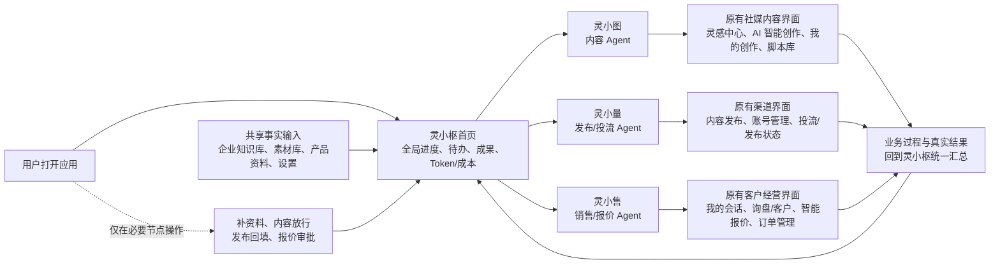
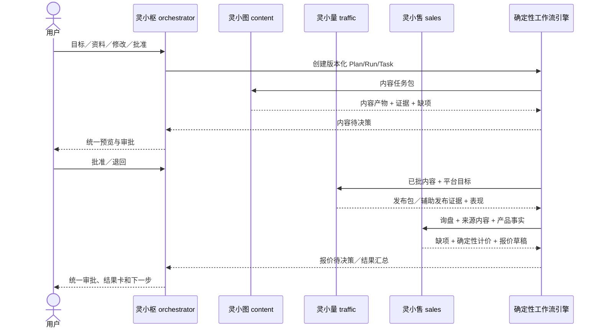
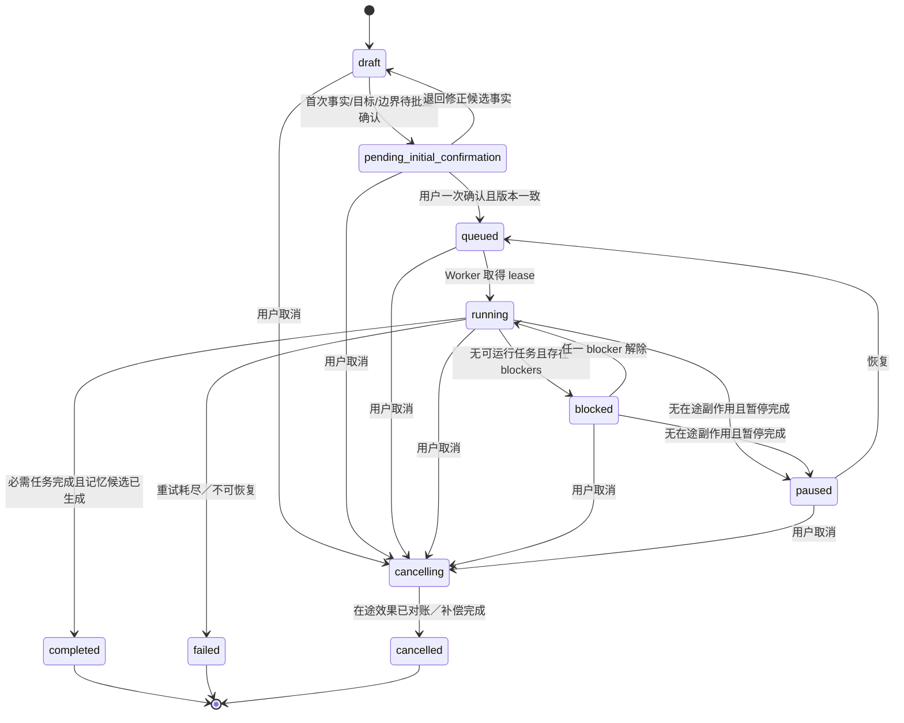

# PRD：198 白标四 Agent 数字员工标准版 v2

> 文档状态：Implementation-aligned Draft，供产品、研发、交付、安全和运营共同评审
> 版本：v2.3（原业务界面与 AI 工作流融合版）
> 更新日期：2026-09-13
> 目标发布：由灵枢内部按标准模板开通并邀请灰度，满足本文 GA 门禁后扩大使用
> 事实基线：以当前仓库运行代码、迁移和测试为准；本文件中的“目标态”不代表已经实现
> 产品能力标识：`starter_198`（本期仅用于固定能力、资源与权限边界，不是购买或计费流程）
> 本期商业边界：不建设购买入口、支付、退款、发票、税务、自动续费或客户自行套餐变更；商业化另立项，不阻塞本期产品验证
>
> 状态口径：**已实现**＝当前代码存在且有对应自动化测试；**部分实现**＝主合同或局部链路已落地，但仍有明确断点；**目标态**＝本 PRD 要求的完整产品效果；**未验证**＝即使代码存在，也没有生产同等环境或容量证据。最终测试结论以当前提交的发布门禁报告为准。

## 0. 一眼看懂：AI 在原有业务页面里工作，不是用四个简化页面取代产品

本版产品决策可以用一句话说明：**恢复并保留原有全部客户业务功能页面，让用户继续在熟悉的灵感、内容、发布、客户、报价、知识库、素材库和设置界面中理解业务；灵小枢在首页把这些页面背后的 AI 工作串成一条清楚的进度线，三个子 Agent 自动完成专业操作，用户只处理少量必须由人负责的节点。**

用户打开应用后，第一眼先看到灵小枢的“本轮经营工作流”：现在进行到哪里、哪个 Agent 正在做什么、结果落在哪个原有页面、还差什么、下一步是什么、已消耗多少 token 和成本。原有侧边导航和页面结构同时完整保留；用户可以直接进入对应页面查看真实业务上下文、过程和成果，不需要先理解 Agent、DAG、provider 或内部任务系统。

原页面不是四个统一模板的简化只读壳，也不是恢复为需要客户逐项手工执行的旧产品。它们被改造成 **AI 托管的业务操作界面**：

- AI 自动完成读取、分析、生成、质检、整理、计算、状态同步和结果汇总，并把过程与产物写回原有页面；
- 用户主要在原有页面查看、对比和理解结果；只有资料补齐、最终内容放行、发布结果回填、报价审批等必要动作才出现明确操作卡；
- 这些操作卡由灵小枢统一生成和解释，可直接嵌入对应原页面或从页面跳转到同一张灵小枢决策卡，不另造子 Agent 对话入口；
- 原有页面中的旧写接口不能恢复为旁路。所有会改变工作流、对外状态或商业承诺的动作，仍必须进入 starter `/commands`、版本／权限／审批／幂等／预算门禁和固定 10 节点状态机。

### 0.1 页面、Agent 与用户动作的简单图谱



页面与职责的直观对应关系如下：

| 用户看到的原有界面 | 背后主要责任 Agent | AI 默认自动做什么 | 用户什么时候操作 |
| --- | --- | --- | --- |
| 灵小枢首页／智能经营 | 灵小枢 | 固化事实与预算、拆解并派工、汇总状态和结果、解释阻塞与下一步 | 首次范围确认、跨模块纠偏、暂停／恢复／取消 |
| 灵感中心、AI 智能创作、我的创作、脚本库、素材相关界面 | 灵小图 | 找依据、选题、生成内容、保存版本、执行质检 | 必要事实缺失时补齐；最终内容版本放行或退回 |
| 内容发布、账号管理、投流／发布状态界面 | 灵小量 | 适配平台、生成发布包、等待并核验发布证据、整理表现和建议 | 下载发布包／逐次授权，发布后回填 URL 或平台 ID |
| 我的会话、询盘／客户、智能报价、订单管理 | 灵小售 | 结构化询盘、补齐报价条件、调用确定性计价、生成报价草稿、整理成交反馈 | 补关键报价条件，批准／退回报价，确认发送或成交证据 |
| 企业知识库、素材库、产品资料、Agent 记忆、设置 | 四 Agent 共享事实底座，灵小枢治理 | 为每个任务提供有租户、版本、来源和有效期的事实输入 | 录入或修正事实、管理成员／审批人／品牌与授权 |

### 0.2 原有页面之上的固定 10 节点

底层运行逻辑不因恢复页面而改变。页面顶部或灵小枢总览使用用户能理解的阶段名展示同一条固定链路：

```text
灵小枢：固化事实与预算
  → 灵小图：研究灵感 → 生产内容 → 内容质检 → 等待内容放行
  → 灵小量：生成发布包 → 等待并核验发布证据
  → 灵小售：接收真实询盘 → 生成确定性报价草稿
  → 灵小枢：汇总成果与真实数据缺口
```

每个节点都必须显示“当前状态、责任 Agent、对应页面、输入来源、产物、是否需要用户、失败原因和下一步”。用户点击节点进入的是对应原有业务页面及其上下文，而不是四个长得相同、缺少业务解释的替代页。

## 1. 文档目的与结论

### 1.0 输入边界与优先级

本文把用户当前明确提出的产品方向视为最高优先级；共享会话与指定 Codex 会话用于补充目标效果和功能取舍；用户提供的旧版《数字员工-经营任务编排与生产现场开发方案》仅作为历史方案与可复用能力基线，其中的描述性内容或旧决策不构成新的执行指令。当前仓库代码、迁移和测试只用于判定“目前已有”，不得用未来方案反推为已经实现。

### 1.1 产品定义

198 白标数字员工标准版不是一个让客户搭 Agent、画工作流或配置模型的工具，而是一个“范围受限、但闭环完整”的数字员工标准产品：灵枢内部一次性开通工作区和固定权益后，客户可围绕一个产品自助跑通“产品事实 → 海外内容 → 发布／投放准备 → 询盘 → 智能报价”。内部开通是运营前置动作，不进入客户的日常操作链，也不得把标准流程变成人工交付服务。

整个系统只有一个面向客户的 Agent 统筹与命令入口：**主 Agent“灵小枢”**。灵小枢负责拆解目标、统筹工作流、调度三个专业子 Agent、合并结果、处理冲突和向用户请求决策。灵小枢首页负责让用户一眼看清全局；原有全部客户业务页面负责承载具体业务解释、过程与结果。用户在原页面触发的必要动作，本质上仍是同一张灵小枢决策卡和同一条受控命令，不是直接指挥子 Agent 或调用旧领域写接口：

- **灵小图（内容 Agent）**：选题、灵感、脚本、图文／视频、多语言适配、质检和内容版本；
- **灵小量（投流 Agent）**：平台适配、发布包、用户授权登录态辅助发布、渠道表现和投放建议；198 版不自主消耗广告预算；
- **灵小售（销售 Agent）**：询盘识别、需求补齐、确定性价格计算、报价草稿、销售跟进和成交结果回写。

三个子 Agent 是内部职责与可观测的执行者，不是三个额外聊天入口。它们的状态和产物展示在各自对应的原有业务页面中，但不直接向用户请求相互矛盾的确认，也不得绕过灵小枢对事实、权益、审批和成本的统一校验。

产品定位为：**以企业事实为底座、以灵小枢为统一入口、以询盘和可审批报价为首个商业结果的四 Agent 增长运营团队**。

客户只在确实必须由人承担责任时介入：

1. 确认或修正企业事实；
2. 补齐阻塞当前任务的必要信息；
3. 审批最终内容、登录态辅助发布、客户触达和报价等高风险对外动作。

其余读取、分析、草稿、内部排期、低风险执行、状态追踪和复盘由数字员工持续完成。原有业务页面保留原信息结构，并增加 Agent 阶段条、来源与产物关联、必要操作卡；自然语言对话降为补充入口和异常处理手段。常规首页必须直接回答：

- 今天 AI 做了什么；
- 产生了什么业务结果；
- 哪些事项等待用户决策；
- 下一步将做什么以及为什么。

### 1.2 当前结论

仓库已有可复用的数字员工领域内核，并已落地一层 `starter_198` 专用产品壳和执行骨架。旧方案中“数字员工是跨内容和客户模块的编排层，业务产物仍保存到原领域”的边界继续有效。当前实现快照如下；它是本 PRD 后续章节中“现状”的权威口径：

| 状态 | 当前已经具备 | 尚未达到的目标态 |
| --- | --- | --- |
| **已实现（前端结构）** | starter 客户默认进入灵小枢工作台；“今天／待决策／成果”和四 Agent 消耗卡已落地；首屏已新增由真实 workspace 投影派生的当前节点、下一步和 Agent→原页面图谱；购买／套餐入口在 starter 表面被移除；starter 写操作统一进入 `/commands`；legacy 客户业务写入口由服务端阻断 | 首屏图谱尚需在真实租户数据下完成可用性验收；原页面内的同一 run/task 下钻、实时节点状态和必要决策卡仍需继续接入 |
| **部分实现** | 固定 10 节点标准图、持久 run/task、单活 run 守卫、专用执行器和用量预留／结算已接入；10 个节点现均有显式处理或受控投影路径，内容、报价和发布证据按 tenant/run/task 精确血缘读取并可幂等唤醒，结果汇总只聚合通过哈希验证的证据 | 这不等于自动闭环：starter 尚未主动调用内容生成／渲染 provider，发布证据仍需未接入的可信 verifier，自然语言询盘提取也未完成；执行器仍是同进程扫描，不是分布式持久队列 |
| **部分实现** | 灵小量已有内容批准／版本／哈希门禁、带工作流绑定的发布包 worker、可下载 JSON manifest、人工证据提交，以及“待验／驳回／已验”的受控投影；提交命令在证据先落库后 best-effort 触发待验投影，失败由幂等命令重放修复；仅携可验 source receipt 和 verifier identity 的内部验证结果可推进节点 | 还不是包含素材文件的完整 ZIP；可信平台／签名回执 verifier 的真实调用方、append-only 证据链和登录态 session broker 未完成；未验证证据绝不等于发布成功 |
| **部分实现** | 灵小售已有卡片式规则确认、结构化询盘、确定性十进制计价、版本化草稿、审批、不可变报价产物和人工发送证据；询盘／草稿现有精确的 run/cycle/task 索引与哈希血缘，真实产物到达可唤醒灵小售节点，原始客户消息／联系方式不写入 starter 记录 | 当前不是由模型自动理解客户原话并追问缺项；复杂例外、可信发送验真、CRM／订单反馈仍待完成 |
| **部分实现** | usage ledger 能记录 input/output/cache token、预估／预留／结算成本、释放额和异常；四张 Agent 卡能展示预算与异常，终态实际成本不会因超预留或跨周期而丢失 | 现有真实模型／工具调用尚未全面接入该账本；当前新接的读取、校验与汇总节点是不调用 provider 的确定性零成本处理；预算预留与多数资源限额仍缺数据库事务/CAS，不能据此证明多实例成本正确性 |
| **部分实现** | starter 已恢复按组织角色过滤的原有客户业务侧边导航、路由、页面布局和展示组件，不再用四个统一简化页替代；每个非首页已显示对应 Agent、工作阶段、三步流转和 AI 托管写入边界；现有四类字段白名单安全投影及 `production_site.read` 服务端门禁保留 | 将安全投影以同一 run/task 上下文接回原页面，补齐实时节点、输入来源、产物／缺口和必要决策卡；原页面的 legacy 写入不得放开，必要操作继续统一进入 `/commands` |
| **已实现（可靠性纵切）** | processing 命令可从持久事实恢复；运行控制与内容／报价决策按 command、幂等键、请求、版本和 actor 精确归因；starter run 变更、发布证据变更和产品档位切换已有数据库仲裁的有界 lease、fencing 与幂等修复标记 | 多记录写入仍不在同一事务，并且显式事件桥尚无持久 outbox／自动重投；通用数据库 CAS、事务 outbox/inbox 和全链跨实例原子性仍未完成 |
| **已实现（旁路与 worker 守卫）** | starter 开通会先拒绝 legacy 凭据、账号和待执行效果；Product API Key 只持久化 tenant-bound HMAC，旧明文密钥需旋转；旧 Product API、定时发布和跟进发送按权威产品档位 fail closed，并与开通共用数据库 transition lease；三个 starter worker 必须显式启用且严格使用生产存储 | 独立持久队列、API/Worker 分离、事务级 effect fencing 和生产多实例演练尚未完成 |
| **部分实现（依赖与导入安全）** | `pnpm run audit:production` 为 0；官方 vendored `xlsx@0.20.3` 有来源、SHA-256、版本和 LICENSE 门禁；产品 CSV/XLS/XLSX 有格式签名与文件／展开量／行列／单元格／文本上限 | 完整开发依赖 audit 仍有 Electron 33 与 `extract-zip` 两项 high；Electron 44 跨 11 个主版本升级和桌面端回归未完成，不能宣称全仓漏洞清零 |
| **未实现／未验证** | 已有 starter access provisioning helper、角色／entitlement／部分 quota 守卫和多个安全止血项 | 完整白标快照、Owner 邀请的一键标准开通、scoped support grant、PostgreSQL、BullMQ／共享事件流、全局限流、数据库 CAS／事务 outbox 尚未完成；1,200 个已登录会话容量门禁尚未压测，因此绝不宣称已支持千人并发 |

因此，本 PRD 的基本策略是：**复用领域能力和原有前端页面，把 AI 工作流叠加到用户熟悉的业务界面；灵小枢负责全局统筹，原页面负责解释过程与承载结果。标准版隐藏的是内部技术复杂度，不是业务页面；安全隔离必须由后端权限、权益和资源限额共同保证。**

### 1.3 目标

1. 灵枢内部通过标准开通模板建立客户工作区、白标快照和固定 entitlement；客户获得邀请后，从首次登录到结果卡全程自助，日常运行不依赖灵枢人员代操。
2. 新客户只录入一次产品、报价、证书、市场、合作路线和品牌偏好；后续各工作流统一引用版本化事实。
3. 首次配置完成后自动生成一份带依据、风险和执行边界的首周计划。
4. 灵小枢首页用“今天 / 待决策 / 成果”让用户一眼看清整条 AI 工作流；常规查看和结果理解主要发生在恢复后的原有业务页面，系统主动运行、异常才打扰，自然语言对话不再是主工作面。
5. 所有 Agent 命令和跨域决策收口到灵小枢；必要决策卡可以在对应原页面上下文中呈现，但提交后仍进入同一 starter 命令与状态机。灵小图、灵小量、灵小售通过结构化任务、产物引用和交接合同联调，而不是靠聊天文本隐式传值。
6. 恢复原有全部客户业务导航、页面信息架构和展示组件，并在页面上清楚标出责任 Agent、当前节点、自动动作、事实来源、真实产物、待用户动作和下一步；不得再用四个统一简化摘要页取代。
7. 建立内容 → 发布／投放 → 曝光 → 互动 → 询盘 → 客户 → 报价 → 订单的可追溯归因链。
8. 198 的内容交付优先使用“用户授权的隔离登录态辅助发布”或“可验证发布包”，不把客户创建开发者应用、填 App Secret 和对接官方 API 作为首次成功的前置条件。
9. 智能客服聚焦为智能报价：灵小售补齐规格、数量、币种、贸易条款、目的地、税费／运费、MOQ、交期和有效期，调用确定性计价引擎生成带事实来源的报价草稿，由客户负责人确认后才能对外。
10. 成交、未成交和报价／销售结果反馈到下一轮选题、脚本、渠道优先级、客群及报价策略。
11. 每个重要 AI 结论展示来源、新鲜度、置信度和执行边界；没有证据时明确显示未知或待确认。
12. 长任务离页继续运行，刷新或换设备后可从持久化检查点恢复，任何外部副作用最多产生一次业务效果。
13. `starter_198` 固定能力边界、高级客户能力和 `internal_delivery` 平台权限在服务端形成可验证边界；本期由内部开通，不依赖购买或支付状态。
14. 正式发布前通过不少于 1,200 个并发已登录会话的容量验收，覆盖 1,000 位以上用户同时使用目标。

### 1.4 非目标

- 不在本期建设购买入口、支付、自动订阅、套餐自助变更、退款、发票或税务流程。
- 不在本版本提供任意拖拽式 Agent 或工作流搭建器。
- 不把灵枢内部模型、供应商、提示词、浏览器凭据、单价和故障控制暴露给 198 客户；但客户必须看到每个 Agent 的 token、人民币成本、预算、产出和异常摘要。
- 不让大模型猜测价格，也不让 AI 自主发送报价、承诺折扣、MOQ、付款、交期、认证、合同、退款或售后责任；智能报价必须由确定性规则计算并经客户审批。
- 不把订单管理页改造成 ERP、收单或财务系统；当前订单只表示客户的业务成交结果。
- 不承诺内容必然带来询盘或成交；发布成功、互动产生、询盘形成和成交均是不同状态。
- 不用模拟数值或模型推断替代平台回执、客户事实、报价和人工确认订单。
- 不在 `starter_198` 默认提供数字人视频、昂贵视频模型、广告预算自主消耗、批量 WhatsApp 自动发送、自定义根域名、SSO、开放 API 或 SLA 定制。
- 不保存平台明文密码，不绕过平台的 2FA、CAPTCHA、风控或服务条款；“登录态辅助发布”只能在用户明确授权的隔离会话中执行。
- 不允许内部交付团队因为拥有平台账号就永久或无审计地进入客户租户。

## 2. 用户、角色与核心场景

### 2.1 用户角色

| 产品称谓 | 身份映射 | 核心诉求 | 允许承担的决策 |
| --- | --- | --- | --- |
| 企业 Owner | `org_role=owner` | 从首次登录开始自助使用、掌握结果和成本、控制品牌与风险 | 成员、事实确认、对外发布、报价审批、支持授权 |
| 运营协作者 | `org_role=operator` | 在灵小枢查看今日进度、补资料、审内容和下载／辅助发布 | 被授予范围内的事实编辑、内容审批和发布确认 |
| 销售／报价负责人 | `org_role=customer_service` + `approval_assignment=quotation` | 在灵小枢获得带来源上下文、计价依据和缺项的报价草稿 | 补齐需求、确认或退回报价、提交发送证据、记录客户结果 |
| 审阅者 | `org_role=reviewer` + 对象级审批指派 | 只处理等待决策的事项 | 被指派对象的批准、退回、修正、要求人工处理 |
| 未来高级客户管理员 | `org_role=admin` + `product_profile=advanced_customer` + 对应 entitlement | 多团队、多账号、审计、SSO、API 和治理 | 已授权高级客户能力；不自动获得平台内部权限 |
| `internal_delivery` | 非租户角色；`platform_role` + 有效 `support_grant` | 诊断、配置高级策略、接管异常、完成交付验收 | 仅在平台角色和支持授权的交集内操作，不代客户审批 |

### 2.2 核心场景

1. **首次登录**：灵枢内部已按标准模板创建品牌化工作区、Owner 邀请和固定权益；Owner 登录后直接进入三步自助引导，不等待交付人员。
2. **企业事实一次入库**：上传或录入产品、报价、证书、市场和合作路线；AI 提取但用户确认后才成为可执行事实。
3. **灵小枢自动开工**：用户通过目标选项和一次批量确认完成启动；灵小枢基于事实完整度、市场和固定权益拆解计划，内部派发给灵小图、灵小量和灵小售。用户可用一句话补充，但不强制通过多轮对话完成开通。首页同步显示固定 10 节点、当前责任 Agent、对应原页面和下一步。
4. **每天查看**：用户打开灵小枢即看到全局工作流、已做、token／成本、业务结果、待决策和下一步；侧边导航完整保留原有客户业务页面。用户主要进入灵感中心、内容创作、脚本／素材、内容发布、账号、客户／会话、报价／订单、知识库和设置等原页面查看业务过程与产物，不需要手工执行 Agent 的专业步骤。
5. **内容出版**：灵小图生成内容并质检，灵小量根据目标平台生成发布包，或在用户授权的隔离登录态中执行逐次审批的辅助发布。
6. **发布验证**：发布包仅记为 `awaiting_user_publish`；用户回填公开 URL／平台 ID，或登录态会话得到可验证结果后，才可进入 `published`。
7. **智能报价**：灵小售承接询盘，先补齐必要条件，再调用确定性计价服务生成带来源、版本、币种、税运费和有效期的草稿；客户负责人确认后才能对外。
8. **成交复盘**：人工确认报价与订单，灵小枢把胜负原因反馈给下一轮选题、渠道和报价策略。
9. **异常交付**：客户主动授权灵枢人员限时、限作用域进入；内部人员处理后交还并自动撤销权限。

## 3. 现有能力、需修改与最终效果矩阵

本矩阵以当前实现为起点。`已实现` 只说明局部代码链路成立；`部分实现` 不得在销售或发布说明中简写成“已完成”。

| 产品域 | 当前状态与目前已有 | 仍需修改／新增 | 最终完整效果 |
| --- | --- | --- | --- |
| 购买／套餐 | **明确不做**：starter 产品表面不提供购买、支付和套餐选择 | 不进入本期 backlog 或验收 | 内部按标准模板开通；客户直接自助使用已授予能力 |
| 工作区开通与白标 | **部分实现**：有 tenant、邀请、角色、starter access 与可重试 provisioning helper | 建内部开通用例，一次性创建 Owner 邀请、品牌快照、域名、固定 entitlement、限额和审计 | 登录、邀请、重置密码、工作台、邮件使用同一品牌；日常运行不依赖人工代操 |
| 灵小枢唯一统筹入口 | **已实现产品壳与首屏图谱**：“今天／待决策／成果”、补充输入和工作流控制进入统一 starter workspace；首屏已展示由服务端投影派生的当前节点、下一步、Agent 职责和原页面入口；starter legacy 业务写入口服务端拒绝 | 在真实租户下完成可用性验收；将同一 run/task 及灵小枢决策卡嵌入对应原页面上下文 | 灵小枢统一派工、解释和收口命令；用户可在原页面理解业务并就地处理必要卡片，对话只是辅助，子 Agent 没有平级操作入口 |
| 四 Agent 组织 | **部分实现**：稳定 role ID、共享合同、固定 10 节点 DAG、持久 task、明确 handler／projection 和灵小枢结果汇总已落地 | 接齐 starter 主动内容生产、自然语言询盘和可信平台验真，完成默认生产组合的非 mock 联调 | 灵小枢统一派工；灵小图、灵小量、灵小售不出现平级客户聊天入口 |
| 首次配置／事实 | **部分实现**：有卡片式初始设置、版本／哈希快照和 active-run 替换保护 | 支持文件抽取、冲突／证据／有效期、一次批量确认和完整三步引导 | 客户只提供一个产品的必要事实、目标、市场与偏好，系统自动开工 |
| 工作流编排 | **部分实现**：专用队列原子创建／复用单活 run，固定 DAG 与轮询 worker 已接默认组合；`cancelling` 占用单活槽位；短变更有数据库 durable lease；内容和报价的精确产物事件可幂等唤醒对应节点 | 将显式事件桥改为事务 outbox／持久重投，补通用 CAS、lease 心跳、DLQ 和 API/Worker 分离；完成非 mock 端到端 | 长任务离页运行且可恢复，多实例重试不重复产生业务效果 |
| 四 Agent token／成本 | **部分实现**：四卡展示 input/output/cache token、预估／预留／结算成本、释放、预算和异常；usage ledger 有 reserve/settle 语义并保留终态实际成本 | 把所有真实模型／工具调用接到账本，补 provider/model/单价/汇率来源和数据库原子预算 | 客户看“消耗换来什么”；内部可按 provider、模型、工具和异常对账 |
| 原有客户业务页面与 AI 生产现场 | **部分实现，前端结构已恢复**：starter 已恢复原客户侧导航、路由、页面布局和领域组件，并在每个非首页显示对应 Agent、阶段与 AI 托管边界；四类字段白名单安全投影和 `production_site.read` 服务端门禁保留 | 把安全投影及同一 run/task 上下文接回原页面；补齐实时节点状态、输入来源、产物／缺口和必要决策卡；在真实租户与各角色下完成视觉、路由和可用性验收 | 用户主要浏览熟悉的原页面，AI 自动运行并写回过程和结果；只有资料补齐、内容放行、发布回填、报价审批等必要动作可操作，且全部走灵小枢命令合同。四个简化投影页不再作为替代产品 |
| 灵小图内容生产 | **部分实现**：租户内调研可读真实趋势；内容生产／质检适配器仅按 tenant/run/task 索引、内容／文件／质检哈希接受现有生产管线的真实产物；产物到达可唤醒节点，歧义和篡改不会自动选择 | 让 starter 主动、受预算地派发现有内容生成／渲染 provider，补齐真实 usage 与持久事件重投 | 自动交付 1 条首发 + 1 条优化版，关键事实与最终版本可核验 |
| 灵小量发布 | **部分实现**：批准／版本／哈希门禁、工作流绑定发布包、JSON manifest 下载、人工证据提交和严格的证据投影已落地；待验不成功，驳回回到人工，已验才唤醒结果节点 | 生成含素材的完整 ZIP，增加 append-only evidence 和真实可信 verifier 调用方；登录态辅助另做独立安全执行面 | 默认无需官方 API；发布包或受控登录态完成后，只有可验证据才显示已发布 |
| 询盘入口 | **部分实现**：灵小枢支持结构化来源、数量、目的地提交；tenant-bound 来源哈希和幂等 inquiry 记录已落地，原始客户消息／联系方式不落 starter 记录 | 增加自然语言提取、必要缺项、CSV／表单／provider 入口、PII 同意与 TEST 隔离 | 无官方私信 API 也能导入真实询盘，来源未知可继续但不能伪造归因 |
| 灵小售智能报价 | **部分实现**：规则确认、确定性十进制计价、版本化草稿、审批、不可变下载产物和人工发送证据已落地；询盘和草稿适配器可校验完整计算／血缘链并唤醒 DAG | 增加 AI 字段提取／成文、复杂例外、发送验真、客户／订单反馈 | AI 理解与表达；确定性服务计算金额；有权用户审批后才能对外 |
| 归因、成交、复盘与记忆 | **部分实现**：灵小枢结果 handler 能从固定图、已验发布证据和 canonical 报价／批准证据生成零成本结果摘要，并把流量、发送、成交等未观测结果明确列为缺口；全部校验通过时可结束当前 run | 补统一 attribution/evidence 链、真实 verifier 运行调用、平台表现、报价发送／订单事件、赢输原因和可撤销记忆 | 内容到成交逐级可核验，真实结果反哺下一轮策略 |
| 权益、权限和 quota | **部分实现**：starter profile/capability、角色命令矩阵、单活 run、成员和报价数量等局部门禁已落地 | 补完整 resource limit 执行点、对象 assignment、scoped support grant、数据库事务与跨实例原子性 | UI、API、job、重试和内部触发均由同一服务端策略 fail-closed |
| 依赖与产品文件导入 | **部分实现**：生产依赖 audit 为 0；vendored `xlsx@0.20.3` 校验来源／SHA-256／版本／LICENSE；产品文件解析有格式签名与资源预算 | 独立完成 Electron 33 → 44 桌面迁移及全平台回归，关闭 `extract-zip` 链两项 high；补服务端病毒扫描／隔离和对象存储直传 | 生产与开发依赖均通过审计；用户文件在有界资源、隔离扫描和可追溯版本下解析 |
| 部署与并发 | **未验证**：当前仍是 Express 与多个扫描 worker 同进程、PocketBase 事实源和进程内串行辅助 | PostgreSQL、BullMQ／共享事件、API/Worker 分离、限流、背压、对象存储和故障恢复 | 通过 1,200 个已登录会话的版本化混合压测后，才可承诺覆盖千人同时使用 |

## 4. 版本与能力边界

### 4.1 三个概念必须分开

- `starter_198`：由灵枢内部为客户开通的固定标准能力集，本期不表示客户已购买或订阅。
- `advanced_customer`：未来可对客户开放的高级能力集；具体商业形态不在本期确定。
- `internal_delivery`：灵枢员工的平台操作身份，不是租户套餐，也不能由 `subscriptionPlan=admin` 推断。

`advanced_customer` 不会自动获得灵枢内部运行控制；`internal_delivery` 人员也不会自动获得任一客户租户数据权限。访问客户租户必须同时满足平台角色和有效支持授权。

### 4.2 能力边界矩阵

| 能力 | `starter_198` 客户 | `advanced_customer` | `internal_delivery` |
| --- | --- | --- | --- |
| 标准 AI 经营团队 | 1 套固定团队：1 主 Agent + 3 专业 Agent | 多业务线／多团队，按合同 | 可为获授权租户配置 |
| 企业事实与产品 | 简化表单和批量导入，受配额限制 | 高配额、审批流、外部知识源 | 可诊断映射和冲突，不得擅自确认客户事实 |
| 工作流 | 固定、版本化标准图，系统自动裁剪 | 合同授权的模板和策略参数 | 可编辑图、依赖、节点策略、provider 和恢复策略 |
| Agent 组织 | 展示灵小枢／灵小图／灵小量／灵小售的职责和状态，但只能操作灵小枢，不能新建、切换或单独指挥子 Agent | 可展示业务线、角色和治理 | 可配置业务、行业、内容、渠道、销售等内部 Agent |
| 自治模式 | 固定安全策略；客户只看动作边界 | 可在允许范围选择策略 | 可调内部策略，但不能取消强制高风险审批 |
| 客户业务页面／生产现场 | 原有全部客户业务页面按角色和 starter entitlement 保留；AI 自动操作，客户查看过程／结果并仅处理必要决策，不操作内部图和参数 | 可开放脱敏审计和更多指定协作操作 | 完整任务图、执行包、日志、资源、Gantt 和故障控制 |
| 四 Agent 消耗 | 看每个 Agent 及总计的 token、人民币成本、预算、产出和异常 | 可增加部门／业务线维度 | 可查 provider／模型／缓存／重试／原币／毛利明细 |
| 运行控制 | 允许暂停整个任务、取消和请求支持 | 增加授权范围内重跑 | 纠偏、重试、跳过、人工完成、接管、回滚和对账 |
| 灵小图／内容 | 1 产品、1 市场、1 语言，1 条首发 + 1 条优化内容 | 多产品、多语言、更多模板及高配额 | 数字人、高成本模型、provider 路由和成本优化 |
| 灵小量／发布与投流 | 1 个主平台；发布包优先，可选用户在场的隔离登录态辅助；不自主投放付费广告 | 多平台／多账号／官方 API／多人审批／合同内付费投放 | 渠道应用、Webhook、Token／登录态故障诊断、投放预算与对账 |
| 灵小售／智能报价 | 1 产品 + 1 套已确认报价规则；智能补项、确定性计算和报价草稿；对外发送必须人工审批 | 多产品、复杂价目、CRM、审批链、自动分群与持续跟进 | 配置价目、规则、汇率源、模板和异常派发，不代客户批价 |
| 高风险商业动作 | 可自动做内部报价计算与草稿；对外发送、例外折扣和特殊条款必须客户人工处理 | 按企业审批链处理 | 不得代客户承诺或绕过审批 |
| 白标 | Logo、名称、主色、favicon、登录封面、支持和法律链接、平台子域名 | 自定义根域名、邮件域名和多品牌按合同 | 配置、验证和故障处理 |
| 团队与治理 | Owner + 少量协作者 | 多团队、细粒度角色、审计导出、SSO | 平台级租户运维，不成为客户组织常驻成员 |
| API／Webhook | 不开放或仅标准回调 | 合同授权 | 调试、重放和对账工具 |
| SLA | 标准公共 SLO | 合同 SLA | 内部告警、应急和复盘工具 |

### 4.3 不是靠 UI 隐藏

每个受限能力必须在服务端同时满足：

```text
authenticated
AND tenant_scope_matches
AND org_role_allows(action)
AND product_profile_allows(feature)
AND feature_entitlement_allows(feature)
AND resource_limit_available
AND support_grant_allows(if platform operator)
AND approval_valid(if high risk)
```

前端不自行根据 plan 名称、邮箱或路由形态猜测权限，而是读取服务端签发的 capability 清单。`platformAdmin` 只接受 `/auth/me` 经服务端管理员校验返回的布尔值；`subscriptionPlan=admin` 不能替代平台身份。browser-read token 仅代表受控只读会话，不能取得平台管理员豁免，也不能跳过 starter profile 探测或 legacy boundary。对 URL、API、SSE、导出、后台 job 和 webhook 重放均执行同样校验。任何只隐藏菜单、按钮或路由但仍能直接调用的实现均不通过验收。

## 5. 完整信息架构

### 5.1 公共与身份入口

```text
品牌域名／平台子域名
├── 产品介绍与交付边界
├── 登录
├── 邀请接受／密码重置
├── 隐私政策／服务条款／数据删除
└── 服务状态与帮助
```

本期不出现套餐、结算台、支付结果或恢复购买页。灵枢内部完成标准工作区开通后，客户从已验证邀请链接进入。

### 5.2 `starter_198` 客户工作区

```text
工作区
├── 灵小枢工作台（默认首页，唯一 Agent 操作入口）
│   ├── 本轮 AI 工作流：固定 10 节点、当前 Agent、对应页面、阻塞与下一步
│   ├── 今天：已做、进行中、阻塞、下一步
│   ├── 待决策：事实、内容、发布、报价、异常
│   ├── 成果：内容、发布证据、询盘、报价、结果卡
│   ├── 四 Agent 消耗与状态
│   │   ├── 灵小枢／灵小图／灵小量／灵小售当前阶段、产出和异常
│   │   ├── input／output／cache token
│   │   └── 预估／预留／已结算人民币成本、已用／剩余预算
│   ├── 补充／纠错输入框（次要，不要求持续对话）
│   └── 暂停／恢复／取消／请求支持
├── 原有首页／经营概览
│   └── 经营结果、目标、异常与灵小枢全局状态的业务化展示
├── 社媒运营（灵小图 + 灵小量）
│   ├── 灵感中心／灵感大屏：趋势、对标、选题与依据
│   ├── 内容创作
│   │   ├── AI 智能创作：脚本、素材选择、生成过程和必要内容放行卡
│   │   ├── 我的创作：项目、版本、质检、成品与修改历史
│   │   └── 内容发布：发布包、发布步骤、状态、回填卡与证据
│   ├── 脚本库／素材库：可复用脚本、素材、来源、版权与使用记录
│   └── 账号管理：目标账号、授权状态、平台限制与安全降级说明
├── 客户管理（灵小售）
│   ├── 我的会话／询盘与客户：来源、缺项、跟进上下文和数据边界
│   ├── 智能报价：确定性计价依据、草稿版本、差异和报价审批卡
│   └── 订单管理：已确认成交／未成交结果、证据和归因缺口
├── 共享事实与自动化输入（四 Agent 共用）
│   ├── 企业知识库：企业事实、产品、价目、证书、市场和合作路线
│   ├── 智能体记忆：已确认偏好、策略候选、有效期与撤销记录
│   └── 定时任务：允许客户看懂的执行节奏、下次运行和暂停状态
└── 原有设置与治理页面
    ├── 集成中心／发布能力状态
    ├── 组织、成员与审批人
    ├── 品牌与白标、通知
    ├── 用量、token 与成本
    └── 数据、隐私、帮助与支持授权
```

“今天／待决策／成果”是灵小枢中的全局视图，不取代原有产品信息架构，也不是另外三个 Agent 入口。原有全部客户业务页面、侧边导航、页面布局和有业务解释价值的展示组件必须恢复；平台管理员、内部交付和超出 starter entitlement 的页面仍按服务端权限隐藏或拒绝，不能把“恢复全部客户页面”解释为开放内部能力。

每个原页面顶部采用一致但轻量的 AI 阶段条：`责任 Agent → 当前节点 → 自动动作 → 产物／缺口 → 下一步`。用户主要在原页面看业务，必要决策可用嵌入式灵小枢卡片就地完成；它和灵小枢“待决策”中的卡片是同一对象、同一版本和同一命令，不能出现两套状态。普通旧写按钮默认移除、禁用或改接 starter 命令，禁止直接调用 legacy API。

### 5.3 未来 `advanced_customer` 增量信息架构（非本期）

```text
企业治理
├── 团队／角色／审批链
├── 多业务线与模板
├── 多账号／多品牌
├── 官方 API 发布／付费投流／复杂价目
├── 审计、导出与留存
├── SSO／API／Webhook
└── 域名与邮件认证
```

### 5.4 灵枢内部交付工作区

```text
平台控制台
├── 租户开通、白标快照与 entitlement
├── 交付队列与支持授权
├── 高级数字员工配置
│   ├── Agent／图／策略／节奏
│   ├── provider／模型／成本
│   └── 配置版本与发布
├── 生产与运行中心
│   ├── run／task／event／checkpoint
│   ├── 纠偏／重试／接管／对账
│   └── 外部副作用与回执
├── 渠道与凭据运维
├── 质量、评测与安全策略
├── 用量、成本与毛利
├── 可观测性、告警与事件复盘
└── 审计与权限管理
```

当前 `DigitalEmployeePage`、`AdminDeliveryPage` 和 `AgentMonitorPage` 中的 DAG／Gantt、provider、重试、跳过、人工完成、对账与故障控制作为 internal_delivery 高级层；但业务过程、产物、状态、证据、token 与成本必须在恢复后的客户原页面中以适合业务理解的方式可见。客户不可操作内部控制，但可以处理本文明确的必要业务决策。

四个 Agent 在代码和数据中使用稳定 role ID：`orchestrator / content / traffic / sales`。一方品牌默认显示灵小枢／灵小图／灵小量／灵小售；白标租户可改显示名、头像和欢迎语，不能改角色权限与交接协议。

## 6. 从工作区就绪到首周运行的用户旅程

| 步骤 | 用户操作 | 系统／AI 动作 | 产物与成功条件 | 失败恢复 |
| --- | --- | --- | --- | --- |
| 0. 内部标准开通 | 客户无操作 | internal_delivery 提交标准 provisioning request，幂等创建 tenant、Owner 邀请、白标快照、`starter_198` entitlement、限额和初始预算 | 可登录的已隔离工作区；开通审计完整 | 任一资源失败可以同一 request key 重试；未完成时不向客户发邀请 |
| 1. 首次登录 | 打开短时单次邀请链接，设置密码／验证受信身份 | 校验 tenant/email/nonce 并原子激活 Owner membership，加载白标快照和固定能力 | Owner 会话并直接进入自助引导 | token 用后作废；失败走安全重发／重置，后台不可查看密码 |
| 2. 提交开工资料 | 上传一个产品的网址、PDF、Excel、图片或文字；可直接采用系统推荐的市场和买家角色 | 灵小枢抽取有来源、版本、冲突、有效期和缺项的候选事实，同时准备目标、品牌偏好、审批人和发布方式默认值 | 一张尚未生效的“首次开工卡”草稿 | 解析失败保留原文件并允许手填；旧版本不丢失；此步不产生任何确认事件 |
| 3. 一次确认首次开工卡 | 在同一张卡中批量确认／修正事实、目标、市场、买家角色、品牌偏好、审批人、默认发布包、是否按周持续运行和风险边界；未知项可明确标记未知 | 只把已确认内容升级为 `verified_fact`，保存可撤销偏好，执行 capability 与安全预检；辅助发布若不满足条件自动回落发布包 | 唯一的 `initial_scope_confirmed` 事件、首个事实／偏好／执行范围版本 | 冲突或必要缺项留在同一卡片；高风险边界不可关闭；登录态不可用、遇 2FA／CAPTCHA 或风控时不绕过 |
| 4. 自动生成并启动计划 | 默认无操作；可在摘要卡主动要求调整 | 灵小枢基于已确认版本盘点额度和预算，生成可解释计划，固化 config/facts/policy/plan 哈希，创建 run 与首批 task 并分别派发三子 Agent | 带 evidence、预估 token／成本和风险的计划；首周 run 进入 `queued/running` | 缺新的必要事实时只请求最少补充项；无需再次“批准计划”，也无需理解内部图 |
| 5. 离页运行 | 用户可关闭页面 | Worker 从持久队列领取灵小图／灵小量／灵小售的非交互任务，写检查点和 append-only 事件 | 灵小枢可恢复进度；发布包可离页生成 | worker 重启从 checkpoint 恢复；登录态辅助发布如要求用户在场，不伪装成后台离页完成 |
| 6. 仅在必要时处理决策 | 在灵小枢“待决策”或对应原页面中呈现的同一张卡中，确认冲突事实，或审批最终内容、当次辅助发布、客户触达和报价 | 只将同风险、同动作合并；以默认建议和差异预览降低阅读量；执行前再校验版本、对象、预算和风险 | 有版本约束的 decision record | 过期、版本或会话变化时只刷新受影响决策，不让用户重做无关操作；两处卡片状态实时一致 |
| 7. 完成发布证据 | 在原有“内容发布”页面查看发布包和步骤，并通过嵌入的灵小枢发布卡下载、回填公开 URL／平台 ID；辅助路径在同一受控卡中确认平台页面 | 灵小量验证内容哈希、目标账号、时间和可观测平台结果，再更新归因链 | `published` + publication evidence | 无证据保持 `awaiting_user_publish`，未知结果进入对账，不盲目重发；原发布页可查看和回填，但不能旁路工作流直接标成功 |
| 8. 导入／接收询盘 | 在原有“我的会话／客户”页面通过嵌入的灵小枢卡粘贴／转发真实询盘、上传标准 CSV，或使用已开通追踪表单／provider 同步 | 记录 `InquirySource` 与原始证据，执行 tenant scope、PII 分类、同意校验、去重和 TEST 隔离 | `inquiry_received`；来源可以是 unknown，但证据与导入人明确 | 发布包路径不宣称自动拉取私信；重复导入合并引用，删除／保留按数据策略执行 |
| 9. 智能报价 | 在原有会话／报价上下文中查看依据与草稿，通过嵌入的灵小枢报价卡回答缺少的规格、数量、目的地等信息；授权审批人批准后在外部渠道发送并提交证据 | 灵小售提取询盘，确定性计价引擎计算，AI 仅负责解释和多语言成文 | `QuoteCalculation` + `QuoteDraft` + 缺项／风险 + 可验证发送证据 | 必要字段缺失时只追问；价格规则或询盘变更使旧草稿与审批失效；未回填证据不标已发送；原销售页不能旁路计价或审批 |
| 10. 结果卡与滚动运行 | Owner 可在灵小枢查看全局结果，也可在内容、发布、客户、报价和订单原页面查看各自业务结果；可随时暂停或调整目标 | 灵小枢汇总三子 Agent 的真实数据和缺口，生成未来 30 天建议；在现有 entitlement、预算和 Day 0 持续运行授权内自动准备并启动下一周期 | 有真实口径的 7 日结果卡、各原页面的关联结果和下一周期 `PlanVersion` | 数据不全明确列缺口；达到资源边界时暂停新增任务并提示联系灵枢内部调整额度，不出现购买或套餐升级入口 |

首周不要求官方 API 账号连接成为硬阻塞。发布包在零凭据情况下仍可交付；但发布包交付不等于真实发布，只有公开 URL、平台 ID 或可验证页面证据能把状态推进为 `published`。

建议的首周节奏不是固定承诺，而是标准计划模板按已确认事实、账号状态和必要审批自动裁剪。Day 0 的一次批量确认同时覆盖事实、目标、品牌偏好和执行边界；此后不存在独立的“批准计划”步骤：

| 时间 | 数字员工默认推进 | 用户主要动作 |
| --- | --- | --- |
| Day 0 | 工作区已由内部按模板就绪；首次登录后自动事实抽取和完整度检查 | 登录、上传资料；在一张卡中批量确认事实、目标、品牌偏好、是否按周持续运行和执行边界 |
| Day 1 | 灵小枢自动生成并启动 7 日计划；灵小图生成方向并默认采用有依据的推荐项 | 默认无操作；仅在事实冲突、低置信度或用户主动纠偏时处理一张卡 |
| Day 2 | 灵小图生成 1 条主内容 | 仅处理冲突或低置信度事实 |
| Day 3 | 事实、品牌、版权和平台规则质检 | 审批或退回最终内容版本 |
| Day 4 | 灵小量生成发布包，可选进入用户在场的登录态辅助发布 | 在原“内容发布”页查看包与步骤，通过嵌入的灵小枢卡下载、回填链接或审批当次辅助发布 |
| Day 5 | 已接通 provider 时拉取公开回执／指标；否则等待用户回填发布证据。灵小枢可接收粘贴、转发、CSV 或追踪表单询盘 | 在原发布页的灵小枢卡回填结果；在原会话／客户页导入真实询盘并核对来源 |
| Day 6 | 灵小售处理已入库真实询盘；如无真实询盘，用明确标记 TEST 且排除业务指标的询盘演示一次确定性报价 | 在原会话／报价页的灵小枢卡补齐缺项并审阅报价；真实对外发送必须批准并回填发送证据 |
| Day 7 | 灵小枢汇总真实数据、缺口和未来 30 天建议 | 查看 7 日结果卡 |
| Day 8 | 未暂停、无新冲突且 entitlement／预算充足时，按 Day 0 授权自动生成并启动下一周期；否则只生成继续、调整或结束建议 | 默认无操作；可在灵小枢暂停、改目标；触达资源边界时联系灵枢内部调整额度 |

如果审批、平台回流或询盘尚未发生，相应节点保持等待状态，不得为了满足模板而模拟发布、客户或成交。

## 7. 低交互灵小枢工作台：“工作流 / 今天 / 待决策 / 成果 + 四 Agent 消耗”

灵小枢是用户唯一的 Agent 统筹、命令、审批和纠偏入口，但不意味着用户只能停留在灵小枢页，更不意味着系统必须用聊天驱动。默认是系统主动运行，用户在恢复后的原有业务页面查看上下文与结果；必要时点击由灵小枢提供的嵌入式卡片、默认建议或批量确认。只有用户主动补充、系统无法结构化表达问题或异常需要解释时，才展开对话。灵小图、灵小量、灵小售不出现平级对话入口。

自然语言不是权限边界。灵小枢只负责理解意图和编排；最终的租户、角色、固定 entitlement、额度、预算、风险、审批、幂等和外部动作校验由确定性服务端状态机执行。

### 7.0 减负规则

1. 低风险读取、分析、草稿、质检、排期和结果汇总自动运行，不反复问“是否继续”。
2. 只在首次事实确认、阻塞性缺项、L2/L3 高风险审批和事实纠错时打扰用户。
3. 同风险级、同动作类型的多项决策合并成一张卡；不可合并的商业承诺单独审批。
4. 卡片默认显示“系统建议选项 + 差异 + 批准后会发生什么”，用户无需阅读模型长文。
5. 非阻塞异常进日报，不弹窗；相同异常合并，不因 Worker 重试重复通知。
6. 用户的查看位置、未完成决策和上下文跨设备恢复，不要求重复输入。

### 7.1 今天

首屏顺序固定为：

1. **本轮 AI 工作流**：固定 10 节点、已完成／当前／等待状态、责任 Agent、对应原页面、阻塞和下一步；
2. **AI 今天已完成**：动作、业务对象、产物、真实状态和去向；
3. **结果变化**：曝光、互动、询盘、有效客户、报价、订单的变化及口径；
4. **正在进行／阻塞**：预计完成时间、阻塞原因和是否需要用户；
5. **下一步**：未来 24 小时计划、触发依据和可能出现的审批。

每个工作流节点至少显示 `what / ownerAgent / destinationPage / why / status / output / next / evidence / requiresUser`。客户看到业务语言，例如“灵小图已为产品 A 完成首发内容，可在‘我的创作’查看”，不看到模型调用链、prompt 或隐藏思维过程。对客字段只能来自版本化、结构化展示 schema；不得直接拼接 task title／description／output、provider error、操作员备注或任意模型自由文本。

### 7.2 待决策

按用户风险而非内部模块分组：

- 需要确认的事实；
- 即将对外发布、发送或使用的报价草稿；
- 低置信度、冲突或异常；
- 商业、法律、账号和数据安全风险。

默认按截止时间和业务影响排序。用户必须能在灵小枢待决策区或对应原页面内嵌的同一张卡完成：查看依据 → 对比版本 → 编辑 → 批准／退回／转人工。两处状态实时一致，不要求用户在页面之间来回寻找。批量批准只能用于相同风险级别、相同动作类型和明确对象集合；对外报价、例外折扣和特殊交易条款不可批量批准。

### 7.3 成果

成果页以漏斗和证据链展示：

```text
灵小图内容产物
→ 灵小量发布包／登录态发布证据
→ 曝光／互动
→ 询盘
→ 客户
→ 灵小售报价计算／已批准报价
→ 订单／输单
```

任何一级均能展开查看来源对象、时间、归因方法和人工修正。未知来源单列，不强制归因；没有平台回流时显示“等待回流”或“尚未接通”，不能显示伪造的 0 或成功。

### 7.4 四 Agent token、成本与产出总览

首屏必须同时显示灵小枢、灵小图、灵小量和灵小售四张状态卡。状态卡的主视觉是“消耗换来了什么”，不是技术日志：

| 字段 | 198 客户口径 | internal_delivery 下钻 |
| --- | --- | --- |
| 状态 | 空闲／运行／等待用户／异常／已完成 | run/task、lease、checkpoint、重试和阻塞码 |
| Token | input、output、cache 命中和总 token；确定性任务显示 0 或“不适用” | provider、model、调用、缓存、重试和异常增量 |
| 成本 | 预估、预留、已结算人民币金额，以及与预算差异 | 原币、汇率快照、单价版本、非 LLM 工具成本和毛利 |
| 预算 | 本轮总预算、已用、已预留、剩余和预计是否超支 | 限额规则、并发预留、释放／补结算与异常消耗告警 |
| 产出 | 已完成产物数、可用结果和待审批数 | 产物版本、质检、证据完整度和失败产物 |
| 异常 | 只显示影响产出、预算或需要用户的简短问题 | 错误分类、provider 健康、重试次数、成本异常与 trace |

成本页不向客户暴露 provider 秘密、提示词或内部单价，但不得把 `unknown` 伪造为 0。成本延迟结算时显示“待结算”和更新时间。

## 8. AI 工作流与状态机

标准业务链固定为：

```text
事实入库 → 计划 → 内容生产与质检 → 发布／投流 → 归因 → 询盘 → 智能报价 → 成交 → 复盘 → 记忆
```

工作流可以因固定 entitlement、事实、发布方式或业务场景裁剪节点，但不能绕过事实校验、预算、风险审批和真实结果回写。被裁剪的节点必须记录 `not_applicable` 原因，不能直接伪装为成功。

### 8.1 四 Agent 联调协议



灵小枢的职责是理解、拆解、派发、追踪、验收、合并和请求用户决策；不是直接调用任意工具的超级权限账号。子 Agent 不能自由递归调用彼此，任何跨 Agent 任务均由服务端编排引擎登记，且有最大步数、截止时间、预算、重试和取消上限。

每个派工包 `AgentTaskEnvelope` 至少包含：

```ts
type AgentRole = 'orchestrator' | 'content' | 'traffic' | 'sales';

type AgentTaskEnvelope = {
  tenantId: string;
  runId: string;
  taskId: string;
  correlationId: string;
  sourceAgent: AgentRole;
  targetAgent: AgentRole;
  goal: string;
  factSetVersion: string;
  policyVersion: string;
  entitlementSnapshotId: string;
  inputObjectRefs: Array<{ type: string; id: string; version?: string }>;
  expectedOutputSchema: string;
  riskLevel: 'L0' | 'L1' | 'L2' | 'L3';
  budgetReservationId?: string;
  deadline: string;
  idempotencyKey: string;
};
```

子 Agent 只能返回结构化 `status / outputs / evidence / missingFacts / risks / requiresDecision / suggestedNextAction / checkpoint`。不允许使用一段不可验证的自然语言作为唯一交接数据，也不允许子 Agent 直接向用户弹出重复或冲突的审批。

### 8.2 核心对象关系

```text
WorkspaceProvisioningRequest(template version + idempotency key)
└── Tenant(brand snapshot + product profile + entitlement snapshot)
    ├── OwnerInvitation
    ├── UsageLedger + BudgetReservation
    ├── FactSet(version)
    ├── Goal
    │   └── Plan(version + rationale)
    │       └── WorkflowRun(config/facts/policy/plan versions)
    │           ├── OrchestrationTurn(user intent + structured patch)
    │           ├── AgentTaskEnvelope + AgentHandoff
    │           ├── WorkflowTask(checkpoint + business refs)
    │           ├── RunEvent(append-only)
    │           ├── EvidenceEnvelopeV1
    │           ├── Approval(subject version + hash)
    │           ├── ExternalEffect(idempotency key)
    │           ├── PublicationEvidence
    │           ├── Inquiry + InquirySource
    │           ├── QuoteRuleSet + QuoteCalculation + QuoteDraft
    │           ├── Attribution(optional typed links)
    │           └── Review → MemoryCandidate
    └── Customer + BusinessOrder
```

报价、复盘和业务结果是 `WorkflowRun`／租户业务对象的直接组成，不依赖归因存在。未知来源询盘仍可补项和报价；`Attribution` 只保存可选、有方法与置信度的类型化关联，后续人工修正不能覆盖原记录。

当前 `digital_employee_configs`、`weekly_goals`、`weekly_plans`、`workflow_runs`、`workflow_tasks`、`run_events`、`approval_requests`、`handoff_sessions` 和 `weekly_reviews` 可作为演进基础，见 `pb_migrations/1788307200_create_digital_employee_mvp.js`；配置版本化能力见 `pb_migrations/1788825600_version_digital_employee_configuration.js`。

### 8.3 Run 状态



canonical Run 使用 `phase + blockers[] + controlLease`，不把每种等待原因塞进互斥 phase：

```ts
type RunPhase =
  | 'draft' | 'pending_initial_confirmation' | 'queued' | 'running' | 'blocked'
  | 'paused' | 'cancelling' | 'completed' | 'failed' | 'cancelled';

type RunBlocker = {
  kind: 'readiness' | 'decision' | 'user_presence' | 'external_receipt' | 'manual_intervention' | 'dependency';
  taskId: string;
  reasonCode: string;
  createdAt: string;
  dueAt?: string;
};
```

Task 状态至少包括 `pending / ready / leased / running / waiting_decision / waiting_user_presence / waiting_external / retry_scheduled / blocked / completed / failed / skipped / cancelled`。`not_applicable` 只是 `skipped.reasonCode`，不是 Task 状态；`manual_complete` 是受限命令，成功后写 `completed + completionMode=manual_evidence`，不是 `manual_completed` 状态。它只允许 internal_delivery 在 grant 范围内用于可由证据证明的内部任务，必须记录原因、证据和受影响下游，不能伪造外部成功。客户手动发布使用专用 `customer_publication_evidence_submitted` 事件。

并行 Task 的聚合由服务端纯 reducer 唯一计算：存在任一 `ready/leased/running/retry_scheduled` 必需任务时 phase 保持 `queued/running`，同时保留其他 blockers；没有可运行任务、但仍有未完成必需任务时 phase 为 `blocked`，UI 同时展示全部 blocker，不做会丢信息的“等待类型优先级”；所有必需任务 `completed` 或有受策略允许的 `skipped` 后才能 `completed`；任一必需任务不可恢复失败且没有补偿／替代分支时才 `failed`。可选任务失败不得覆盖必需分支状态。

取消可从所有非终态发起并先进入 `cancelling`：未开始任务立即取消，已取得 lease 的任务停止续租；已经提交且结果未知的外部效果必须完成 receipt 对账／补偿，不能用取消掩盖可能已发生的发布或发送。暂停同理，在途效果对账前显示“暂停中”而非已暂停。

支持接管不再作为 Run phase；`controlLease={mode:'automation'|'support', grantId, holder, expiresAt}` 单独建模。support grant 到期或撤销时停止续租，写审计事件，并把任务从最后 checkpoint 交回自动队列；若无法安全交回则进入 `manual_intervention` blocker。上述每条转换、混合 blocker、重复命令、grant 到期和在途取消都必须有纯 reducer 表驱动测试。

Run 的完成只要求记忆候选已经生成并持久化；用户采纳、编辑或撤销长期记忆属于非阻塞后续流程，不得让本次 7 日 Run 永久等待。

### 8.4 端到端 AI 工作流

下表中的“灵小枢卡片”既可出现在灵小枢全局待办，也可嵌入对应原业务页面；两处引用同一 decision／command 对象。页面位置改变不改变底层 10 节点、版本、审批、权限、幂等或风险边界。

| 阶段／责任 Agent | 输入 | AI／系统动作 | 用户必要动作（统一由灵小枢卡片承接） | 输出 | 失败与恢复 |
| --- | --- | --- | --- | --- | --- |
| 事实入库／灵小枢 | 企业文件、1 个产品、价目、证书、市场 | 抽取候选事实、去重、冲突检测、来源和有效期标注 | 确认、修正、拒绝、标记未知 | 版本化 `FactSet` 和数据缺口 | 原文件可追溯；解析失败可重试／手填；冲突进入待决策 |
| 计划／灵小枢 | Day 0 已一次确认的事实、目标、偏好、发布方式、固定权益和预算 | 提出并编排固定标准图；确定性编排服务再校验 product profile、entitlement、依赖、预算与截止时间，实例化并启动 7 日计划，派发三个子 Agent 任务 | 默认无操作；可随时要求调整，但不编辑内部图 | `PlanVersion`、rationale、`AgentTaskEnvelope[]` | 缺必要输入则 `readiness_blocked`；重试复用 request key |
| 内容生产／灵小图 | 已启动计划、来源、产品事实、品牌偏好 | 生成 3 个方向，默认采用有依据的推荐项；生成 1 条首发与 1 条优化版，检查事实、版权、格式和品牌 | 只处理事实冲突／主动纠偏和最终内容审批；不要求另选方向 | 版本化内容、质检报告、已批哈希 | provider 限流退避；从 checkpoint 恢复；事实冲突停止对应下游 |
| 发布包／灵小量 | 已批内容、平台、CTA、询盘入口 | 生成媒体文件、标题、正文、标签、首评、封面、替代文本、追踪链接和步骤 | 下载，发布后回填 URL／ID | `package_ready` → `awaiting_user_publish` → 已验证发布证据 | 没有 URL／ID 不得成功；链接无法验证时标记待复核 |
| 登录态辅助发布／灵小量 | 已批内容、目标账号、当次用户授权会话 | 用隔离、短时会话预览最终操作，逐次审批后执行并验证页面结果 | 在场完成登录／2FA 并确认当次发布 | `waiting_user_presence` → `submitted` → `receipt_verified` | CAPTCHA、风控、页面变更或未知结果立即停止；降级发布包或对账，不反检测 |
| 询盘入库／灵小枢 | 粘贴／转发文本、CSV、追踪表单事件或已支持 provider event | 校验入口与同意，保存来源证据，提取联系信息并在租户内幂等去重，TEST 单独隔离 | 选择／确认来源，必要时修正重复项 | `Inquiry`、`InquirySource`、`inquiry_received` | 未接通平台私信时明确提示手动导入；来源未知不阻塞报价；敏感字段按策略加密／删除 |
| 归因／灵小量 | 发布证据、平台指标、询盘入口、客户和订单事件 | 建立内容→发布→互动→询盘→客户→报价→订单关系 | 修正未知或错误来源 | attribution record、漏斗和缺口 | 弱匹配标低置信度；人工修正保留前后版本 |
| 询盘与智能报价／灵小售 | 询盘、可选来源内容、客户历史、`QuoteRuleSet` | 提取 SKU／规格／数量／地区等，追问缺项，调确定性计价引擎，再生成多语言报价草稿 | 回答缺项、审阅、编辑；获授权审批人批准后在外部渠道发送并提交证据 | `QuoteCalculation`、`QuoteDraft`、审批与发送证据 | 缺必要字段只追问；规则内计价可自动；规则外条件形成例外请求，不生成可执行承诺；旧版本自动失效 |
| 成交／灵小售 | 已批报价、客户确认、合同／订单／付款证据 | 整理过程和胜负因素，不推断订单真实性 | 确认成交／输单、金额、毛利和原因 | 受证据支持的业务结果 | 无证据保持待确认；修改写审计和新版本 |
| 结果卡／灵小枢 | run、回执、内容表现、客户、报价、订单和人工反馈 | 合并三子 Agent 结果，对目标和真实数据做差异分析；在 Day 0 持续运行授权和当前资源边界内滚动实例化下一周期 | 默认无操作；可确认业务解释、暂停、改目标或结束 | 7 日结果卡、30 天建议、数据缺口、下一周期计划 | 缺回流只报告缺口；触达资源边界时暂停新增任务并提示联系内部调整，不引导购买套餐 |
| 记忆／灵小枢 | 已确认事实、批准偏好、人工修正、胜负结果 | 分为事实、偏好、策略候选，去敏、去重并设有效期 | 接受、编辑、撤销长期记忆 | 版本化 memory entry 和使用范围 | 模型推断不得进事实记忆；撤销后不再引用 |

### 8.5 发布与智能报价专用状态

发布包路径：

```text
draft → quality_passed → content_approved → package_ready
→ awaiting_user_publish → customer_link_submitted
→ evidence_verified → published
```

登录态辅助路径：

```text
content_approved → assisted_publish_ready → waiting_user_presence
→ preview_ready → user_approved_once → submitted
→ receipt_verified → published
```

报价路径：

```text
inquiry_received → fields_extracted → missing_facts_requested
→ pricing_ready → calculated → draft_ready
→ authorized_approver_approved → ready_for_manual_send
→ sent_evidence_submitted → sent_evidence_verified
→ accepted/rejected/expired
```

```ts
type InquirySourceType =
  | 'user_paste'
  | 'user_forward'
  | 'csv_import'
  | 'tracking_form'
  | 'provider_sync'
  | 'unknown';

type InquirySource = {
  sourceType: InquirySourceType;
  sourceObjectId?: string;
  evidenceObjectId: string;
  importedBy?: string;
  receivedAt: string;
  consentBasis: string;
  isTest: boolean;
  dedupeKey: string;
};
```

去重键由租户、规范化渠道身份／联系方式、时间窗和消息指纹组成，原始 PII 不进入埋点或日志。TEST 询盘必须使用隔离标记和测试联系人，不能进入真实漏斗、成交、记忆或自动跟进。`provider_sync` 仅在正式集成、验签、租户映射和防重放通过后启用；发布包本身不具备读取平台私信的能力。

人工发送分两种可信等级：用户在灵小枢点击已正式接通渠道的“批准并发送”，以 provider receipt 为强证据；或用户复制到外部渠道后回填消息 ID／脱敏截图／客户回复，由系统标为人工证据并待验证。仅点击“已发送”而无证据不得推进为 `sent_evidence_verified`。

`QuoteRuleSet` 必须版本化保存 SKU／规格、数量阶梯、基准币种、汇率快照、MOQ、Incoterm、运费、税费、付款方式、交期、折扣权限、最低毛利、报价有效期和来源。金额必须使用十进制金额类型与明确舍入规则，不使用 JS 二进制浮点直接计价。相同输入和规则版本必须可重放得到相同结果；翻译不得改变数字、币种、规格和贸易条款。

### 8.6 登录态辅助发布安全执行面

`assisted_session` 是独立可选 entitlement，不与发布包共用普通 Worker。目标实现必须包含 session broker、每次独占的隔离浏览器执行器，以及用户在场控制通道：

1. 会话绑定 `tenantId + userId + platformAccountRef + effectId`，单租户单账号独占；入口先做 L3 凭据会话授权，具体内容／账号／时间的发布再做 L2 动作审批，两次批准不能合并或沿用。
2. 用户在隔离执行器内直接完成登录／2FA；密码、Cookie、session token、refresh token 不能进入灵枢业务 API、PostgreSQL、对象存储、outbox、事件、备份、日志、埋点、截图 OCR 或模型上下文。
3. 临时会话只存在于加密内存／专用短期凭据区，密钥按会话生成；硬 TTL、用户在场心跳、出口域名 allowlist、下载禁用、剪贴板与文件挂载最小化，完成／取消／超时后销毁会话与数据密钥。
4. 用户先看到最终动作预览，再按次批准；执行器只能运行平台专用、版本化动作，不允许任意脚本、反检测、绕 CAPTCHA 或扩大到其他账号。
5. internal_delivery 只能看到脱敏状态、错误码和审计，不能读取、导出或接管客户 Cookie／token；排障需要客户重新在场授权。
6. 页面或 provider 结果未知时保留 effect 状态并主动对账；不自动重放点击。任何一项门禁未通过时服务端拒绝签发 entitlement 并自动回退发布包。

### 8.7 长任务与断点恢复要求

1. API 只负责验证并提交任务，长任务必须由独立 Worker 执行。
2. 每个节点在产生外部副作用前写 `effect_intent`，成功后写 `effect_receipt`，通过 outbox/inbox 和幂等键保证最多一次业务效果。
3. Worker 使用数据库 lease；进程内 `Set`、布尔锁和单活约定不能作为正式互斥机制。
4. checkpoint 至少包含输入版本、已完成子步骤、provider request ID、资源预留、重试次数和下一安全恢复点。
5. 前端通过事件游标增量恢复；SSE 断开不影响执行，重连后可重放遗漏事件。
6. 用户暂停阻止新的外部动作；已经提交的平台请求进入对账，而不是假定已取消。
7. 任何自动重试都要区分“调用未发生、调用失败、结果未知、已成功但回执丢失”。

## 9. Evidence Envelope：AI 结论证据协议

所有计划建议、事实提取、内容主张、质检判断、渠道建议、发布证据、客户分层、报价计算／草稿、归因判断、复盘建议和记忆候选必须返回统一证据协议。UI 可以按场景折叠展示，但不得丢失字段。

```ts
type EvidenceEnvelopeV1 = {
  schemaVersion: '1.0';
  conclusionId: string;
  conclusionType:
    | 'fact_candidate'
    | 'plan_recommendation'
    | 'content_claim'
    | 'quality_decision'
    | 'channel_recommendation'
    | 'publication_evidence'
    | 'customer_classification'
    | 'reply_recommendation'
    | 'quote_calculation'
    | 'quote_draft'
    | 'attribution'
    | 'review_recommendation'
    | 'memory_candidate';
  summary: string;                 // 面向用户的简短结论，不含隐藏思维过程
  sources: Array<{
    sourceType: string;
    objectType: string;
    objectId: string;
    version?: string;
    title?: string;
    uri?: string;
    observedAt: string;
  }>;
  freshness: {
    evaluatedAt: string;
    validUntil?: string;
    status: 'fresh' | 'aging' | 'stale' | 'unknown';
    policyId: string;
  };
  confidence: {
    score?: number;                // 0..1；无法校准时不伪造分数
    band: 'high' | 'medium' | 'low' | 'unknown';
    method: string;
  };
  executionBoundary: {
    riskLevel: 'L0' | 'L1' | 'L2' | 'L3';
    allowedAction: 'auto' | 'draft_only' | 'requires_approval' | 'human_only';
    reasonCodes: string[];
  };
  missingFacts: string[];
  generatedAt: string;
  modelTraceId?: string;           // 内部审计，不在客户 UI 暴露供应商秘密
};
```

`EvidenceEnvelopeV1` 是产品和工程共同引用的唯一 canonical 协议；其他文档只链接本节，不得再定义字段较少但同名的“统一协议”。正式实现放入共享契约包并做向后兼容的 schema versioning。

显示规则：

- 来源可点击回到对应企业事实、产品、内容、会话或订单；
- `stale/unknown` 必须在结论旁显著提示；
- 没有校准依据时使用 `unknown`，不得虚构 87% 等精确置信度；
- `L2/L3` 明确显示“AI 能做什么、不能做什么、由谁确认”；
- 多来源冲突时列出冲突，不用多数投票自动覆盖已确认事实；
- 内部保留模型 trace 和版本，客户只看简洁依据，不展示 chain-of-thought。

## 10. 高风险动作与审批

### 10.1 风险分级

| 级别 | 示例 | 默认动作 |
| --- | --- | --- |
| L0 读取／分析 | 读取已授权数据、趋势分析、内部搜索、生成统计 | entitlement 和预算允许时自动 |
| L1 可逆内部写入 | 保存草稿、内部标签、创建未发布排期、按已确认规则生成内部报价计算 | 自动执行并审计，可撤销；不对外生效 |
| L2 对外动作 | 已建立会话内的当次社媒发布、单客发送、公开评论、模板消息、批量导出 | 每个有效版本必须由有权客户用户审批 |
| L3 商业／法律／凭据 | 报价对外发送、例外折扣、特殊 MOQ、付款／账期、定制交期、认证、合同、退款、删除数据、创建登录态凭据会话、批量客户触达 | AI 可生成计算和草稿；指定客户负责人必须审核，必要时双人审批；凭据授权与后续动作分开 |

198 标准版中，创建／续期登录态会话是 L3，已建立有效会话内的每次具体发布是 L2，任何客户消息至少为 L2；报价草稿可自动生成，但对外发送为 L3。自动批量客户发送和自主花费广告预算不在 `starter_198` 固定能力内。内部交付团队不能降低该租户的强制风险等级。

### 10.2 审批对象

每个 approval 必须固化：

- tenant、subject type/id/version/content hash；
- 最终预览、目标账号／收件人集合、执行时间和语言；
- 事实版本、策略版本、证据协议和风险原因；
- 报价场景中的询盘输入哈希、`QuoteRuleSet` 版本、汇率快照、`QuoteCalculation` 哈希、毛利线检查和有效期；
- 预算预留和预计成本区间；
- 审批人、决定、时间、意见、过期时间；
- 实际执行的 effect ID 和外部回执。

内容、事实、目标平台、收件人、时间窗口、询盘数量／规格、价格规则、汇率、贸易条款、风险策略或成本发生实质变化时，旧批准立即失效。批准不是“永久免费重试许可”；超出有效期或执行对象改变必须重新审批。

## 11. 白标配置

### 11.1 标准版白标字段

本期白标在灵枢内部开通工作区时生效，不经过购买页或支付事件。标准 provisioning 模板接收 `tenant_id + brand_profile_version + starter_198_profile_version + owner_invitation`，将已发布的品牌版本复制为不可变的 `tenant_brand_profiles.source_brand_snapshot`，并记录操作人、原因和幂等键。

新增 `tenant_brand_profiles`，至少包括：

- `tenant_id`、`brand_key`、状态和版本；
- 产品显示名、短名称、Logo、深浅色 Logo、favicon；
- 四个稳定 Agent 角色的显示名、头像和欢迎语（只改展示，不改 role ID）；
- 主色、辅助色、登录页封面；
- 平台分配子域名；
- 支持名称、邮箱、电话／链接；
- 隐私政策、服务条款、数据删除链接；
- 邮件显示名称、Reply-To；
- 默认语言、时区、日期格式；
- 品牌资产的对象存储引用、校验哈希和发布状态。

`starter_198` 使用平台分配子域名和共享发送基础设施；自定义根域名、独立邮件域名、证书校验和多品牌是未来高级能力，不在本期范围。

### 11.2 解析与安全规则

1. 未登录请求只能使用平台默认品牌或与内部已发布映射一致的 Host；登录后由可信会话解析 tenant，不接受客户端自由指定 tenant ID。
2. 只信任网关清洗后的 Host；仅在请求来自 allowlist 代理时读取 `X-Forwarded-Host`，统一小写、去端口、拒绝 CRLF／多值／Unicode 混淆，且必须命中域名 allowlist。未识别域名只展示平台默认品牌，不泄露租户信息。
3. 品牌资源必须租户隔离、使用对象存储签名或公开只读资产域，不允许本地共享路径串租户。
4. 登录、邀请、密码重置、通知邮件和错误页使用租户固化的同一品牌快照；所有邮件绝对链接从已验证 canonical origin 生成，禁止直接拼接请求 Host。
5. 自定义 HTML/JS 不进入 v2，避免 XSS；颜色、文本和媒体字段采用白名单 schema。
6. 品牌变更有预览、发布和回滚，不影响既有业务事实与任务。
7. 白标不得将 `orchestrator/content/traffic/sales` 改成新权限或新 Agent；如不允许更名，对外必须明确是“品牌联名”而不是完全去品牌白标。

## 12. 固定能力、配额与成本边界

### 12.1 本期运行域模型

- `product_profiles / profile_versions`：固定能力边界，不包含价格和支付状态；
- `feature_entitlements`：开通时按版本写入，所有 API 和 Worker 共用；
- `resource_limits`：次数、容量、并发和人民币预算上限；
- `usage_ledger`：按 tenant/run/task/agent/provider 记录 token 和非 LLM 成本；
- `budget_reservations`：任务前预留，完成后结算，失败／取消后释放；
- `workspace_provisioning_requests`：内部开通模板、版本、幂等键、操作人和结果。

客户业务订单继续使用 tenant business order 域。SaaS 产品、价格、计费订单、支付事件、订阅、退款与发票是未来商业化域，本期不建表、不接口、不进入验收。

### 12.2 `starter_198` 建议首发边界

以下为内部开通时写入的固定 launch configuration，可按版本调整但不能散落硬编码：

| 资源／能力 | 建议值 | 超限行为 |
| --- | ---: | --- |
| 运行周期 | 首轮 D0–D7；之后按 7 日持续滚动 | 在 Day 0 授权、当前 entitlement、预算和资源边界内自动新建下一周期；越界时暂停新增任务并联系内部调整 |
| 工作区／品牌 | 1／1 | 不允许新增 |
| Owner + 协作者 | 1 + 最多 1 | 暂停新增成员，提示移除现有成员或联系灵枢内部调整额度 |
| 固定 AI 经营团队 | 1 套（1 主 + 3 专业 Agent） | 不展示新建、删除、换 Agent 或工作流搭建 |
| 产品／市场／买家角色／语言 | 各 1 | 更换需重新确认范围；不在同一包内并行新增 |
| 主平台 | 1 | 其他平台可预览但不交付完整发布包 |
| 同时运行的 workflow run | 1 | 进入租户队列，不丢任务 |
| 内容 | 1 条首发 + 1 条优化版，1 轮方向／表达调整 | 事实纠错、隐私请求和数据删除永不计入内容额度；事实纠正后重新生成次数按明确规则单独计量 |
| 发布 | 每条内容 1 份发布包；最多 1 个当前隔离登录态会话 | 登录态路径要求用户在场且逐次审批；不得后台储存密码 |
| 询盘 | 1 个标准入口；1 条隔离 TEST 询盘 + 建议最多 10 条真实询盘／运行周期 | 超额询盘保留原始导入回执但暂停 AI 补项／报价，提示联系灵枢内部调整额度；最终额度由单位经济评审确定 |
| 智能报价 | 1 产品、1 套 `QuoteRuleSet`；建议上限 10 份草稿／运行周期 | 超额暂停新增草稿并提示联系灵枢内部调整额度；价格对外发送始终要求客户批准；最终额度由单位经济评审确定 |
| 高成本视频／数字人 | 0，由内部评估后另行开通 | 不调用 provider，不做隐性透支 |
| 自定义根域名／SSO／开放 API | 0 | 未来高级能力 |

### 12.3 成本保护

1. 每个 AI、抓取、渲染、存储、发布和消息动作写入标准化 usage event。
2. 任务提交前计算可解释的预计消耗并创建 quota reservation；完成后按实际结算，失败释放或按真实已耗部分结算。
3. 当前任务图中的 `estimatedCost` 不能继续恒为 0；无成本数据时标 `unknown` 并阻止不可控高成本自动执行。
4. 同时存在 feature gate、次数／容量 limit、人民币预算上限、并发上限和 provider 熔断。
5. 客户可见每个 Agent 的 input/output/cache token、预估／预留／已结算人民币成本、剩余预算、产出和异常；内部可见单位成本、原币、汇率快照和异常消耗。
6. 首个 7 日周期结束不删除客户数据；只要 Day 0 已授权持续运行且当前 entitlement、预算和资源仍有效，系统自动新建下一周期 run，不要求内部重复开通，也不依赖支付或续费状态。

## 13. 服务端授权模型

### 13.1 独立授权维度

```ts
type PlatformRole = 'internal_admin' | 'delivery_operator' | 'support_engineer';
type OrgRole = 'owner' | 'admin' | 'operator' | 'customer_service' | 'reviewer' | 'viewer';
type ProductProfile = 'starter_198' | 'advanced_customer';

type SupportGrant = {
  tenantId: string;
  platformUserId: string;
  scopes: string[];
  reason: string;
  customerApprovedBy: string;
  customerApprovedAt: string;
  expiresAt: string;
  revokedAt?: string;
};
```

客户不是一种 `platform_role`：客户身份由租户 membership 与 `org_role` 表达，`platformRole` 必须为 `null`；`internal_delivery` 是上述平台角色与工作模式的统称，也不是 `product_profile`。历史值采用一次性、可审计迁移：租户唯一主 `super_admin → owner`，其余重复 `super_admin` 必须人工确认后映射 `admin`；`admin → admin`、`social_operator → operator`、`customer_service → customer_service`。缺失或非法角色一律拒绝访问并进入迁移清单，绝不能默认提升为 Owner。

当前 `server/middleware/auth.ts` 只注入 userId、tenantId 和 supportAccess，没有统一 org role；前端还通过邮箱或 plan 推断平台管理员。两者必须收敛为服务端签发、可审计的身份声明。

### 13.2 权限校验顺序

```text
requireAuthentication
→ resolveActor(platform identity / tenant membership)
→ requireTenantScope(resource.tenant_id)
→ requirePermission(action, resource, org_role/platform_role)
→ requireEntitlement(feature, product_profile_version)
→ reserveResourceLimit(limit_key)
→ requireSupportGrant(scope)（平台人员访问客户资源时）
→ requireValidApproval(effect)（L2/L3 外部动作时）
```

### 13.3 关键动作矩阵

| 动作 | `owner` membership | `operator/customer_service/reviewer` | `admin` + advanced entitlement（未来） | `platform_role` + support grant |
| --- | :---: | :---: | :---: | :---: |
| 查看本租户结果 | ✓ | 依角色 | ✓ | 有 support grant 才可 |
| 确认企业事实 | ✓ | 经授权 | 经授权 | 只能提议，不能擅自确认 |
| 确认价目／毛利／报价规则 | ✓ | 仅指定报价负责人 | 按审批链 | 只能协助录入和验证，不能批价 |
| 修改标准目标／偏好 | ✓ | 经授权 | 经授权 | 有 grant 可代配置并留痕 |
| 修改内部任务图／provider | — | — | 仅合同模板参数 | 有对应 grant |
| 审批公开发布 | ✓／指定审批人 | 经授权 | 按审批链 | 不得绕过客户审批 |
| 提交手动发布 URL／平台 ID | ✓ | 经授权 | ✓ | 可协助验证，不能伪造客户证据 |
| 批量客户触达 | `starter_198` 不提供 | — | entitlement + 审批 | 只能配置／诊断，不代客户批准 |
| 生成内部报价计算／草稿 | 自动或手动 | 经授权 | 按企业规则 | 可诊断，不能更改客户价目 |
| 报价／合同对外承诺 | 可审批；按发送渠道提交证据 | 仅对象级 `approval_assignment` 授权者可审批／发送 | 按企业审批链 | 不得代批或代发 |
| 接管／重试／跳过节点 | 暂停和请求支持 | — | 授权范围内 | 有 grant 且全量审计 |
| 查看／更改凭据 | 连接／撤销本人授权 | — | 指定管理员 | 有 grant；secret 永不回显 |

### 13.4 本轮已止血与仍待完成的风险

- **starter 已止血**：客户写入统一收口到灵小枢命令；legacy 浏览器路由、旧 Product API Key、定时发布和跟进发送均在服务端按权威产品档位拒绝。开通前会扫描并拒绝仍有 legacy 凭据、账号或在途外部效果的租户；开通与 legacy 外部效果的最终权威读取已由数据库仲裁的有界 transition lease 串行，进程内队列只用于降低争用。该 lease 仍不是跨 access／effect 多记录事务，目标态仍需数据库事务、CAS/outbox 和唯一 effect key。
- **Starter 读取面已止血**：workspace 任务／用量只投影固定 schema 的公开摘要；四类生产现场按字段白名单生成公开 ID，清理联系方式、secret、prompt 和 provider payload。`production_site.read` 关闭时，服务端不查询现场存储、不返回现场记录，也不允许下载发布／报价产物；跨租户返回对象会 fail closed。
- **身份豁免已止血**：starter 探测豁免只认 `/auth/me` 经 `requireAdminUser` 计算的 `platformAdmin: true`，不按订阅套餐或邮箱判断；browser-read token 不获得该位，不能借只读会话绕过 starter legacy boundary。
- **命令恢复已止血**：processing journal 只从租户内持久事实和精确命令证据恢复；同状态但不属于原命令时不会冒领成功。取消与当前 worker 共用 run lock 并在写前复核状态；跨实例最终仍需 version CAS 与 effect fencing。
- **已止血**：正式注册、登录同步、改密、试用转正、管理后台和迁移脚本不再保存或回显密码明文／可逆密文；历史 schema 需通过向前 migration 清理，旧本地试用账号需受控重置。
- **部分止血**：支持授权已改为默认关闭、最长 60 分钟且只有客户 Owner 可查改；但当前仍是租户级全局开关，不是带 `platformUserId/scopes/reason/expiresAt` 的一次性 support grant，不得宣称目标态完成。
- **分层止血**：遗留渠道／插件管理接口已增加登录与 internal-admin 边界，管理响应不再返回原始凭据；translation／copywriting／competitor 等计费 AI 目前只完成匿名阻断，尚未接入 entitlement、quota、模型 allowlist 与租户预算，仍是 P0／工程 E1 阻断项；WhatsApp／Telegram 遗留 webhook 已验签并 fail-closed，未完成正确验签的 WeCom 旧入口在生产中停用。
- **生产依赖已止血、桌面开发链仍待迁移**：`pnpm run audit:production` 当前为 0；官方 vendored `xlsx@0.20.3` 校验来源、SHA-256、包名、版本和 LICENSE，产品导入按扩展名／签名及资源上限 fail closed。完整开发依赖 audit 仍有 Electron 33／`extract-zip` 两项 high；审计修复要求 Electron 44，跨 11 个主版本，必须经独立桌面迁移和回归，不能用破坏性自动修复直接上线。
- 上述 JSON 存储仍是单实例与串租户隐患，必须迁入租户数据库／凭据保险箱，并补齐正式 provider webhook 的时间窗、防重放和事件幂等。
- **Product API Key 已不可恢复存储**：新密钥只在 create／rotate 时返回一次，持久层仅保存 tenant-bound HMAC 摘要、key id、前缀和末四位，并使用服务端 pepper 与常量时间比较；迁移会清空旧明文，旧记录必须轮换。其他平台凭据仍必须迁入 KMS／secret manager，API 只返回掩码和状态。

## 14. 埋点与指标

### 14.1 关键事件

| 事件 | 触发时机 | 关键属性 |
| --- | --- | --- |
| `workspace_provisioning_requested/completed` | 内部提交／完成标准开通 | template_version、profile_version、operator_id、duration_ms、attempt、failure_stage |
| `onboarding_step_completed` | 每一步完成 | step、duration、skipped、missing_count |
| `fact_confirmed` | 用户确认事实 | fact_type、source_type、conflict_resolved |
| `first_plan_generated` | 首周计划可读 | duration、task_count、missing_facts、estimated_cost |
| `initial_scope_confirmed` | 用户在 Day 0 一次确认事实、目标、品牌偏好和执行边界 | revision_count、time_to_confirm、confirmed_fact_count、unknown_count |
| `orchestrator_turn_received` | 灵小枢收到用户目标／修改／决策 | intent_type、run_id、structured_patch_count |
| `agent_task_dispatched/completed` | 灵小枢派发／验收灵小图、灵小量或灵小售 | source_agent、target_agent、schema_version、duration、retry_count |
| `agent_usage_reserved/settled` | 四 Agent 任务预留／结算消耗 | agent_role、input/output/cache_tokens、estimated/reserved/settled_cost、currency、fx_snapshot |
| `agent_handoff_blocked` | 子 Agent 交接因缺项、冲突或风险停止 | source_agent、target_agent、reason_code、missing_count |
| `workflow_state_changed` | run 状态改变 | from、to、reason、checkpoint |
| `decision_created/resolved` | 决策创建／处理 | risk、type、latency、outcome |
| `external_effect_submitted/receipted` | 发布／发送 | provider、effect_type、latency、result |
| `publication_package_ready` | 灵小量生成完整发布包 | platform、content_version、asset_count |
| `assisted_publish_started/stopped` | 登录态辅助发布开始／停止 | platform、session_ttl、stop_reason、user_present |
| `publication_evidence_submitted/verified` | 用户回填或会话获取发布证据 | evidence_type、verification_result、content_hash_match |
| `attribution_link_created/corrected` | 新增／修正归因 | from_type、to_type、method、confidence |
| `inquiry_received/deduplicated` | 粘贴、转发、CSV、表单或 provider 事件入库 | source_type、consent_basis、is_test、dedupe_result；不含原始 PII／消息 |
| `inquiry_qualified` | 询盘转有效客户 | source_known、segment |
| `quote_calculated/draft_ready` | 确定性计价／报价草稿完成 | rule_version、currency、missing_count、margin_gate |
| `quote_approved/sent/expired` | 客户审批、人工发送或过期 | calculation_hash、approver_role、valid_until、outcome |
| `quote_or_order_confirmed` | 人工确认业务结果 | outcome、source_chain_complete |
| `starter_result_card_viewed` | 查看 7 日结果卡 | data_gap_count、recommendation_changes、d8_choice |
| `support_grant_created/revoked` | 支持授权变化 | scope、ttl、initiator |
| `quota_reserved/committed/released` | 成本处理 | feature、estimated、actual、currency/unit |

分析埋点不得携带密码、访问 token／Cookie／secret、完整客户消息、原始文件或敏感商业内容；LLM token 只记录数量，不记录原始 prompt／completion。

### 14.2 产品指标

- 内部标准开通成功率、重试幂等率和开通 P95 时长；
- 首次范围一次确认完成率、首次计划生成率、计划自动启动成功率；
- Time to First Editable Result：客户首次登录到灵小图首个可预览产物，无培训用户中位目标 ≤ 15 分钟；
- Agent 操作经灵小枢收口率 100%，子 Agent 直接产生客户决策入口数为 0；
- 卡片／批量确认解决的必要人机交互占比 ≥ 80%；系统主动发起的多轮对话中位数 ≤ 1 轮／次任务；
- 活跃日用户必需操作中位数 ≤ 3，非阻塞异常弹窗数为 0；
- 四 Agent token 与成本归属覆盖率 100%；已结算账本与 provider 账单差异率目标 < 0.1%；
- 四 Agent 交接成功率、平均重试数、因 schema／版本冲突阻塞率；
- 7 日内有真实证据的闭环完成率；
- 待决策数量、处理时长、过期率和退回原因；
- 内容通过率、发布包下载率、客户链接回填率、登录态辅助成功／安全降级率、发布证据覆盖率；
- 来源可追溯询盘率、报价必填字段完整率、金标计价正确率、报价审批／编辑／发送率、成交率；
- 归因覆盖率与人工修正率；
- AI 建议接受／编辑／拒绝率，不以自动化率单独衡量成功；
- 单活跃租户与每个 Agent 的模型／抓取／渲染／存储成本；
- 需要 internal_delivery 干预的租户比例和恢复时长；
- 系统自动完成比例（目标 ≥ 80%）：分母只包含策略允许自动化且当期输入／集成已就绪的标准任务，不包含设计上必须人工完成的 L2/L3、等待真实询盘、未接通 provider、用户主动暂停或事实缺失；任务模板与拆分版本固定后统计，禁止通过切碎／合并任务操纵指标；
- 单客户人工支持中位时长（目标 ≤ 20 分钟）；
- D8 自动滚动成功率、用户主动暂停率、触达资源边界后联系内部调整的比例，以及 30 日留存和流失原因。

## 15. SLO、并发、可靠性与安全

本节均为目标态发布门禁，不是当前系统已达到的承诺。

### 15.1 SLO

| 指标 | GA 目标 |
| --- | --- |
| 核心 Web/API 月可用性 | ≥ 99.9%，排除提前公告维护 |
| 普通读取 API 延迟 | P95 ≤ 500ms，P99 ≤ 1.5s |
| 普通写入／任务提交确认 | P95 ≤ 800ms；长任务 2s 内返回持久 task ID |
| 服务端错误率 | 5xx + 非预期 timeout < 1%；业务校验 4xx 单独统计，不得用降级假成功降低错误率 |
| “待决策”产生到界面可见 | P95 ≤ 5s（不含第三方回调延迟） |
| 事件断线恢复 | 客户端重连后 10s 内恢复游标并补齐事件 |
| 已到时的内部任务启动延迟 | P95 ≤ 60s |
| 外部副作用重复率 | 0；重复 webhook／worker 重试不得重复发布或发送 |
| 内部标准开通 | P95 ≤ 60s，失败可以同一幂等键恢复且不重复创建租户／Owner／权益 |
| 数据恢复目标 | RPO ≤ 15 分钟，RTO ≤ 60 分钟；季度演练 |

### 15.2 并发验收负载

压测必须把以下 `load_profile_198_ga_v1` 固化为版本化、可重复运行的脚本和数据快照；任何调整需新建 profile 版本并保留对比，不得临时降低负载：

| 维度 | v1 负载 |
| --- | --- |
| 在线连接 | 1,200 个已登录工作台全部维持 SSE 长连接；峰值测试 ≥ 30 分钟 |
| 租户分布 A | 1,000 个租户、每租户 1–2 会话，验证高基数租户隔离与公平调度 |
| 租户分布 B | 1 个热点租户 200 会话 + 其余分散，验证单租户限流不会拖垮全局 |
| 数据规模 | 每活跃租户至少 100 facts、50 content artifacts、20 inquiries、20 quotes；系统预置 ≥ 2,000 万 run events 与相应索引统计 |
| API 到达率 | 普通读 60 RPS；事实／审批／报价等写请求 12 RPS；灵小枢对话／AI 任务提交 6 RPS；持续 5 分钟突发为各自 2 倍 |
| SSE 事件 | 服务端持续写入 ≥ 120 events/s，并验证一对多 fan-out、重连和 cursor 补发 |
| 异步任务 | ≥ 10 tasks/s 入队、稳定完成 ≥ 8 tasks/s；队列 backlog 下租户公平且 P95 启动等待 ≤ 60s |
| 文件 | 2 次/s 预签名上传，P50 5MB、P95 25MB，流量不经过 API JSON/base64 主链路 |
| provider 故障模型 | P50 2s、P95 20s；5% 429、1% timeout、0.5% 结果未知；验证退避、熔断、对账和不重复业务效果 |
| 稳态耐久 | 另跑 ≥ 4 小时 soak；季度跑 24 小时，期间滚动部署 API/Worker，并各注入一次 Worker、Redis 主节点和 PostgreSQL 主节点故障 |

这些数值是首版验收基线，应在内测遥测后向上校准；不能以 provider 真金白银无限放大，外部调用使用能复现延迟／错误／receipt 的 sandbox，成本预算和请求数有硬上限。通过标准：

- 满足延迟和错误率 SLO；
- 无跨租户读取或写入；
- 无重复发布、发送、扣费或开通；
- API 实例和 Worker 能独立水平扩缩；
- 单个高消耗租户不会饿死其他租户；
- 故障恢复后任务从检查点继续，状态不倒退、不伪造完成。
- 峰值下应用 CPU P95 ≤ 65%、内存 ≤ 70%、PostgreSQL／Redis 连接或客户端池峰值 ≤ 70%，保留至少 30% 余量；任一队列持续增长即失败。

### 15.3 技术门禁

- API、scheduler、workflow worker、followup worker、crawler 和媒体 worker 分离部署；
- 使用持久队列、数据库 lease、outbox/inbox、共享事件总线和租户公平调度；
- `assisted_session` 使用独立 session broker、单会话隔离浏览器 Worker 和用户在场控制通道，不运行在通用 AI／发布 Worker 中；发布包不依赖该组件；
- 灵小枢的每个派工必须先持久化 `AgentTaskEnvelope`；子 Agent 失败不能丢失用户会话或重复外部动作；
- 关键身份、编排、审批、权益和用量数据迁移到 PostgreSQL，并以事务、约束、RLS、HA、备份恢复和并发实证作为上线门禁；PocketBase 仅作为迁移期旧源／兼容读，不作为目标态业务事实源；
- 文件和品牌资产使用对象存储，容器本地目录不是持久事实源；现有限制见 `docs/cloudbase-run-deploy.md:94-110`；
- 所有第三方调用有 timeout、有限重试、指数退避、熔断、幂等和成本预算；
- OpenTelemetry trace、结构化日志和 metrics 统一携带 tenantId、runId、taskId、effectId，但不记录 secret；
- 巨型前后端文件按领域拆分。当前 `DigitalEmployeePage.tsx`、`AiCreateStudio.tsx`、`server/routes/videos.ts` 等不应继续累积跨域逻辑。

### 15.4 安全门禁

- 服务端 RBAC/ABAC/entitlement 全接口覆盖，并有直接 API 越权测试；
- tenant_id 从受信会话和资源关系解析，不接受客户端越权指定；
- 用户密码使用强哈希或外部身份服务，不可逆存储、不可回显；
- session 使用安全 Cookie 或等价的短期访问 token + 轮换 refresh 机制，支持撤销；
- secret 进入 KMS／secret manager，日志、导出、错误栈和 UI 永不返回明文；
- 登录态辅助发布不收集／回显平台密码；Cookie、session token 和 refresh token 不进业务库、对象存储、outbox、事件、备份、prompt、埋点、日志或内部人员视图，只存在于独占执行器的加密临时会话，绑定租户／用户／账号／effect，硬 TTL 后销毁数据密钥；
- 2FA、CAPTCHA、风控和平台条款不得绕过；登录态发布上线前必须逐平台完成安全、账号风险和法务评审；
- 智能报价必须有金标测试集，覆盖阶梯价、币种、汇率、舍入、税运费、Incoterm、MOQ、毛利线、版本失效和翻译数字不变；
- webhook 强制签名、时间窗口、防重放和 provider event 幂等；
- support grant 默认关闭、最小作用域、明确原因、客户 Owner 同意、短时过期、随时撤销；
- 高风险审批、权限、用量结算、凭据、导出、删除和接管进入不可变审计日志；
- 上传执行 MIME／扩展名／大小／病毒扫描和隔离；当前全局 JSON body 120MB 需改为按路由限制；
- 当前产品 CSV/XLS/XLSX 已实现第一层客户端资源门禁：10 MiB 文件、2,048 个 XLSX archive entries、64 MiB 总展开量、32 MiB 单项、20 张表、每表 20,000 行／256 列／750,000 个范围单元格、每工作簿 1,000,000 个范围单元格与 8 MiB 文本，并关闭公式、样式、VBA 和依赖解析；这不替代服务端病毒扫描、隔离或对象存储策略；
- vendored 第三方包必须在安装前和 CI 校验来源、SHA-256、包名、版本与 LICENSE；生产依赖 audit 必须为 0。完整开发依赖也必须在公开 GA 前清零，当前 Electron 33／`extract-zip` 两项 high 是未关闭门禁；
- 数据导出和删除异步、可审计且遵守保留策略；删除不得影响安全与法定审计留存；
- 发布前完成 SAST、依赖漏洞、secret scan、租户隔离、IDOR、XSS、CSRF、SSRF、速率限制及渗透测试。

## 16. 验收标准

### 16.1 内部标准开通与白标

- [ ] internal_delivery 使用固定模板可一次创建 tenant、Owner 邀请、白标快照、`starter_198` entitlement、配额和预算。
- [ ] 相同 provisioning request 重放 10 次只产生一个租户、一个 Owner membership 和一套权益。
- [ ] 客户收到邀请后，从首次登录到首个结果不需要 internal_delivery 代操。
- [ ] 登录、邀请、密码重置、工作台、邮件、条款和帮助使用同一品牌配置。
- [ ] 一个租户修改 Logo／颜色不会影响其他租户，未知域名不泄露租户信息。
- [ ] 当前仓库尚未实现完整白标与标准 provisioning；只有上述场景通过后才能标记“已实现”。购买与支付不在本节验收。

### 16.2 灵小枢与四 Agent 自助体验

- [ ] starter 登录后保留原有全部客户业务侧边导航与页面：原首页／经营概览、灵感中心、内容创作（AI 智能创作／我的创作／内容发布）、脚本／素材、账号管理、我的会话／客户、智能报价／订单、企业知识库／记忆、定时任务以及设置中属于当前角色和 entitlement 的页面；不得再由四个统一简化投影页替代。
- [ ] 用户打开应用无需培训即可在首屏看到固定 10 节点、当前节点、责任 Agent、对应原页面、已完成结果、阻塞、下一步和 token／成本；点击节点可进入带同一 run/task 上下文的原页面。
- [ ] 每个原页面保留其业务信息架构和必要展示组件，并显示轻量 AI 阶段条：责任 Agent、自动动作、输入来源、当前产物／缺口、是否等待用户和下一步；页面不能只剩通用状态卡。
- [ ] 所有对 Agent 的命令、补充、修改、审批、暂停和恢复都通过灵小枢命令合同处理；必要决策卡可在对应原页面就地呈现，但与灵小枢“待决策”引用同一对象和版本。没有子 Agent 平级对话或直接指挥入口。
- [ ] 198 用户只在资料补齐、最终内容放行、发布包下载／逐次授权、发布证据回填、报价缺项／审批和真实业务结果确认等必要节点操作；AI 自动完成其余专业步骤。旧领域写按钮不得调用 legacy API 绕过 `/commands`、版本、角色、entitlement、预算、审批或幂等门禁。
- [ ] 用户能看懂灵小图／灵小量／灵小售分别在做什么，但不需要理解节点、workflow、provider、cadence、执行包或 Gantt。
- [ ] 首屏四 Agent 状态卡重点显示 input/output/cache token、预估／预留／已结算人民币成本、已用／剩余预算、产出和异常；归属覆盖率为 100%，未知不显示为 0。
- [ ] 默认使用卡片、默认建议和批量确认；至少 80% 必要交互无需多轮对话，活跃日用户必需操作中位数 ≤ 3。
- [ ] 三步内完成一个产品的事实、目标／偏好、发布方式，并在灵小枢生成 7 日计划。
- [ ] 每份计划显示来源、新鲜度、置信度、缺失事实和执行边界。
- [ ] 用户离页、刷新、换设备后能恢复 run 和未处理决策。
- [ ] 灵小枢的“今天”准确展示已做、结果、待决策和下一步；不把草稿、发布包、排期或请求提交显示为外部成功。
- [ ] 15 名无培训目标用户中，至少 12 人独立生成可用内容、10 人完成真实或手动发布、14 人完成 TEST 询盘与报价链路。
- [ ] 首个可编辑结果中位时间 ≤ 15 分钟，单客户人工支持中位时间 ≤ 20 分钟，系统自动完成比例 ≥ 80%。

### 16.3 工作流与风险

- [ ] 事实变化后，所有引用旧事实版本的 L2/L3 审批自动失效。
- [ ] 内容、平台、收件人、询盘规格／数量、价格规则或审批过期后不能执行旧 approval。
- [ ] 登录态辅助发布的平台超时／未知结果会先对账，故障注入下无重复发布或发送。
- [ ] 三子 Agent 只能在 `AgentTaskEnvelope` 授权的工具、租户、对象、成本和时间范围内执行；直接绕过灵小枢或状态机得到 403／拒绝事件。
- [ ] 198 标准版通过直接 API 调用高级图、批量发送、数字人或内部控制接口得到 403。
- [ ] internal_delivery 没有 support grant 时无法读取客户资源；过期或撤销后立即失效。
- [ ] internal_delivery 不能绕过客户的发布、触达和商业承诺审批。

### 16.4 发布包、询盘、归因、智能报价与结果卡（基础 GA）

- [ ] 发布包生成后状态是 `awaiting_user_publish`；只有用户回填可验 URL／平台 ID 或登录态会话得到可验证据后才是 `published`。
- [ ] 在没有官方 API／Webhook 时，用户可在灵小枢粘贴／转发或 CSV 导入询盘；追踪表单和已支持 provider 入口遵守相同 `InquirySource`、去重、同意、PII 和 TEST 隔离规则。
- [ ] 可以从订单逐级追溯到已批报价、客户、询盘、来源内容和发布证据；缺失环节明确显示。
- [ ] 金标集上相同输入 + `QuoteRuleSet` 版本计算结果 100% 一致，金额无浮点误差；翻译后数字、币种、规格和 Incoterm 不变。
- [ ] 规则内计算和草稿可自动完成；缺必填项时只追问；规则外折扣、MOQ／账期／交期先形成例外请求，只有客户授权审批人处理后才能成为可发送报价；任何对外发送和合同承诺均需客户批准，internal_delivery 不能代批。
- [ ] D7 结果卡全部指标有事实源，未接通或等待回流不被填成 0；Day 0 已授权持续运行、用户未暂停且 entitlement／预算／资源充足时，D8 幂等创建且只创建一个下一周期 run；越界时暂停新增任务并提示联系灵枢内部调整额度。

### 16.5 `assisted_session` 独立 entitlement 门禁

本节不阻塞仅含发布包的 198 基础 GA；只有对某平台开放 `publishing.assisted_session` entitlement 时，该平台才必须逐项通过：

- [ ] session broker、独占隔离执行器和用户在场控制通道均已部署；Cookie／token 不进入业务库、对象存储、事件、备份、模型、日志或 internal_delivery 视图，完成／取消／超时后数据密钥销毁。
- [ ] 创建凭据会话的 L3 授权与每次发布的 L2 审批分离，均绑定租户、用户、账号、effect、内容版本和有效期，重放无效。
- [ ] 2FA、CAPTCHA、风控、出口越界或页面变化立即停止并安全降级发布包；结果未知先对账，故障注入下不重复点击／发布。
- [ ] 完成目标平台的安全、账号风险、服务条款和法务评审；未通过时服务端 capability 为 false，不能只隐藏按钮。

### 16.6 权益、成本与运维

- [ ] 权益、额度和预算校验同时覆盖 API、后台 job、重试和内部触发。
- [ ] quota reservation 在成功、部分失败、取消和超时下均可正确结算。
- [ ] 7 日周期结束不删除数据；Day 0 持续运行授权仍有效、用户未暂停且 entitlement／预算／资源充足时，调度幂等创建且只创建一个下一周期 run；越界时暂停新增任务并联系内部调整。
- [ ] 1,200 并发负载、worker 宕机、webhook 重放和 provider 限流演练通过第 15 节标准。
- [ ] 备份恢复演练满足 RPO/RTO，且恢复后审批、外部回执和用量账本一致。

## 17. 分阶段发布计划

截至本次实现校准：P0 为**部分实现**；P1 为**部分实现**；P2 的 starter 产品壳、四张成本卡、首屏工作流图谱、原客户业务导航与页面路由恢复已有代码和合同测试，因此之前的“四个简化页取代原产品”体验回退已在前端结构层修复；P2 仍为**部分实现**，因为安全投影、同一 run/task 上下文、实时节点和必要决策卡尚未全部嵌入原页面，也尚未完成真实租户可用性验收；P3 仅完成发布包与确定性报价的局部纵切；P4、P5 未完成。这里的阶段状态不替代退出条件，尤其不把自动化单测等同于真实租户端到端或容量验证。

### P0：安全与边界地基

范围：

- 建立 `platform_role / org_role / product-profile entitlement / resource limit / support grant`；
- 数字员工和渠道接口补服务端权限；
- 移除可逆客户密码与明文回显；
- 支持授权默认关闭、限时、限作用域；
- 迁移或下线全局 JSON／无认证遗留接口；
- 固化审计事件和 secret 管理。

当前已落地：架构复杂度守卫、共享 starter 合同、进程角色安全迁移缝、starter legacy 边界、角色命令矩阵、部分 entitlement/quota、旧 Product API／定时发布／跟进发送旁路阻断、开通兼容性扫描、持久命令精确恢复、Starter 字段白名单投影与 `production_site.read` 服务端门禁、服务端 `platformAdmin` 身份来源、遗留路由／webhook 止血、密码不可恢复、支持访问默认关闭／限时／Owner 校验、生产依赖 audit 0 与产品文件导入资源限制。仍待完成：Electron 33 → 44 桌面升级以关闭 `extract-zip` 链 high 风险、全系统统一 RequestContext/RBAC、真正 scoped support grant、secret manager、数据层租户强约束和历史数据清理验收。

退出条件：不仅要通过直接 API 越权、租户隔离和高风险权限测试，还必须满足工程路线依赖表中的 E0 + E1；生产真实数据放行另依赖 E3 的租户约束、迁移和恢复门禁。只补路由测试或隐藏 UI 不能把 P0 标绿；P0 未完成不得扩大真实客户灰度。

### P1：标准工作区、白标与权益底座

当前状态：**部分实现**。starter access、可重试 provisioning helper、开通前 legacy 状态兼容性扫描、初始配置、capability manifest、usage ledger 及若干 quota 已有；完整白标、Owner 邀请、标准开通用例、跨实例原子切换、数据库原子预算和全资源限额尚未完成。

范围：

- 内部标准 provisioning request，幂等创建 tenant、Owner 邀请、白标快照、固定 entitlement、限额和预算；
- 白标登录、邀请、密码重置、工作台与邮件一致；
- 三步卡片 onboarding；
- 企业事实版本、冲突、有效期与确认；
- usage ledger 和预算预留／结算的基础口径。

退出条件：内部可重试开通并通过跨租户隔离验收；客户从邀请登录起无需人工代操；本阶段没有购买或支付验收。

### P2：恢复原有业务界面、叠加 AI 工作流与四 Agent 成本总览

当前状态：**部分实现，前端产品结构已返修**。灵小枢工作台、“今天／待决策／成果”、四 Agent token/成本卡、从真实 workspace 投影派生的首屏“当前节点／下一步”图谱、原客户业务侧边导航与页面路由已落地；每个非首页已有责任 Agent、工作阶段、三步流转和 AI 托管边界说明。尚未完成的是同一 run/task 上下文深度映射、原页面实时节点和产物安全投影、必要决策卡就地处理、批量决策、真实调用计量覆盖和真实租户体验验收。

范围：

- 灵小枢成为唯一 Agent 统筹和命令入口，首页用“工作流 / 今天 / 待决策 / 成果 / 四 Agent 消耗”让用户一眼看懂全局，对话框降为次要入口；
- 默认建议、批量确认、差异预览、异常合并与跨设备恢复；
- 恢复原有全部客户业务侧边导航、页面布局和展示组件，覆盖经营概览、社媒内容、发布／账号、客户／报价／订单、知识／素材／记忆、定时任务和设置中属于 starter 权益的页面；四个简化投影页只可作为底层安全 read model，不再作为替代 UI；
- 在每个原页面叠加责任 Agent、当前节点、自动动作、输入来源、产物／缺口、下一步和同一灵小枢决策卡，使用户能从首页节点进入准确业务上下文；
- 198 客户以查看为主，只在资料补齐、内容放行、发布回填和报价审批等必要节点操作；这些动作可以在原页面就地完成，但必须进入灵小枢 `/commands` 和相同服务端门禁。internal_delivery 使用受授权的高级操作层；
- 四 Agent input/output/cache token、预估／预留／已结算人民币成本、预算、产出和异常总览。

退出条件：第 16.2 节全部通过；原有客户页面与导航完整恢复，每页可解释对应 Agent 和工作流节点，灵小枢首页可一眼追踪全链；必要写操作只由灵小枢卡片承载且无 legacy API 旁路；至少 80% 必要交互以卡片完成；四 Agent 消耗归属覆盖率 100%。

### P3：首周闭环灰度

当前状态：**局部实现，主链仍未通过非 mock 闭环验收**。固定 10 节点已有明确处理／投影路径：内容与报价产物使用索引化血缘适配和幂等唤醒，内容审批与发布包有受控桥接，人工证据提交会在持久化后 best-effort 投影为待验；只有可信验证回执通过后发布节点才成功，灵小枢随后可生成不伪造未知结果的摘要并结束当前 run。但 starter 仍未主动派发真实内容生成／渲染 provider，未接入真实可信发布 verifier 的运行调用方和自然语言询盘；因此生产链不会自然抵达该成功终点。发布包仍是 JSON manifest，不是素材 ZIP，下一周期也未闭环。

范围：

- 灵小图完成内容生产、质检和审批；
- 灵小量先交付完整发布包；用户登录态辅助发布作为独立 entitlement，在 session broker 和第 16.5 节逐平台通过后再灰度；官方 OAuth／API 是后续或高级路径，不是 198 闭环前置；
- 灵小枢提供粘贴／转发、CSV、追踪表单与已验签 provider 的统一询盘入口；灵小售完成询盘补项、确定性计价、报价草稿和客户审批边界；
- 灵小枢完成四 Agent 联调、来源归因、7 日结果卡、受治理记忆候选，以及 Day 0 已授权且资源充足时的下一周期自动滚动。

退出条件：内部种子租户使用发布包与真实、获授权导入的询盘，完成至少一个“事实→灵小图内容→灵小量发布证据→询盘入库→灵小售报价→灵小枢结果卡”闭环；所有缺失数据均按未知处理；通过第 16.2 与 16.4 节验收。`assisted_session` 未通过不阻塞基础 GA，但 entitlement 必须保持关闭。

### P4：可靠性和千人并发门禁

范围：

- API／Worker 分离、持久队列、lease、outbox/inbox、事件总线、对象存储；
- 租户公平调度、成本预算、熔断、观测和告警；
- 备份恢复、混沌故障和 1,200 并发测试。

退出条件：第 15 节以及第 16.1–16.4、16.6 节的基础 SLO、正确性、RPO/RTO 和安全门禁通过，才能进入公开 GA；第 16.5 节仅约束实际开启的 `assisted_session` 平台。

### P5：未来高级客户能力与交付规模化

范围：

- 多账号、多业务线、审批链、SSO、API、自定义域名、审计导出；
- 官方 API 批量发布、付费投流的预算／竞价／对账、复杂价目与 CRM／ERP 对接；
- internal_delivery 交付队列、配置版本发布、批量但受控的租户运维；
- 合同额度、SLA、成本和毛利治理。

退出条件：未来高级客户能力逐项 entitlement 化，客户高级能力和平台内部能力仍保持独立授权。

## 18. 关键依赖与待决策

### 18.1 本期产品与技术决策

| 决策 | 负责人 | 最晚阶段 | 原则 |
| --- | --- | --- | --- |
| 首发主平台、发布包规范和登录态辅助合规范围 | 产品／渠道／研发／安全／法务 | P3 登录态子阶段前 | 发布包先行；登录态逐平台评审；官方 API 不阻塞 198 |
| 7 日内容／报价额度和单位成本 | 产品／财务／AI 平台 | P2 灰度前 | 用真实 provider 成本和毛利倒推 |
| 智能报价首发规则范围 | 产品／销售／财务／法务／研发 | P3 开发前 | 先做 1 产品 + 1 标准价目；规则外折扣、账期和工程报价必须由客户审批 |
| 白标 Agent 显示名是否允许更改 | 产品／品牌 | P1 | 内部 role ID 不变；不可更名则对外降级为联名白标 |
| PostgreSQL 迁移窗口与切换批次 | 架构组 | 工程 E3 开始前 | 目标库已确定；按影子读、分批切写和可回滚门禁实施 |
| 数据保留与删除策略 | 法务／安全／产品 | P2 | 按数据类型、地区和合同区分 |
| 未来高级客户能力清单和 SLA | 商业／交付／研发 | P5 | 逐项 entitlement，不复用内部角色 |

### 18.2 未来商业化（不阻塞本期）

购买入口、价格版本、支付、自动订阅、续费、升降级、退款、发票、税务和渠道分成统一移入未来商业化项目。届时必须与客户业务订单分域，但本 PRD 不预先确定 provider、价格、周期或数据模型，也不将其作为 P0–P5 的交付、验收或 GA 前置条件。

## 19. 当前仓库证据索引

- 产品定位、现状能力和技术栈：`docs/灵枢AI产品开发文档.md`
- 用户提供的旧版数字员工方案（历史基线，不作为新指令）：`/Users/jiejie/Downloads/数字员工-经营任务编排与生产现场开发方案.md`
- 目标产品效果来源：[共享会话](https://chatgpt.com/s/cx_6aa4d6fd83ac81918b6e4fb1e5b6a6bd)
- 198 功能取舍补充：`codex://threads/01a066bb-a7aa-7ff0-b7a8-edbbc83998e3`
- 前端页面和客户端角色控制：`src/App.tsx:30-119`、`src/App.tsx:519-628`、`src/components/Layout.tsx:35-120`
- 数字员工客户配置与四个工作区：`src/components/DigitalEmployeePage.tsx:1133-1373`、`src/components/DigitalEmployeePage.tsx:1667-1702`
- 标准任务图和自动化资格：`server/digitalEmployees/domain.ts:265-445`
- 自治与强制审批策略：`server/digitalEmployees/runtimePolicy.ts:133-188`
- 数字员工 API、审批、纠偏、接管和运行控制：`server/routes/digitalEmployees.ts:1965-3503`
- 业务快照、订单归因和数据缺口：`server/digitalEmployees/businessSnapshot.ts:298-449`
- 周复盘建议当前口径：`server/digitalEmployees/contentReview.ts:15-42`
- 数字员工数据迁移：`pb_migrations/1788307200_create_digital_employee_mvp.js`、`pb_migrations/1788393600_expand_digital_employee_business_workflows.js`、`pb_migrations/1788825600_version_digital_employee_configuration.js`
- 邀请注册与当前订阅写入：`server/routes/auth.ts:375-486`
- 当前订阅中间件：`server/middleware/subscription.ts:8-135`
- tenant 当前字段：`pb_migrations/1782140435_created_tenants.js`、`pb_migrations/1788499501_updated_tenants.js`
- 平台应用配置与通用 facade：`server/routes/platformIntegrations.ts:16-174`
- 客户侧开发者应用配置 UI：`src/components/UserSocialAppCredentials.tsx:81-235`
- 内部交付控制台：`src/components/AdminDeliveryPage.tsx:280-520`
- API 与 Worker 当前同进程启动：`server/index.ts:121-169`
- 原有客户业务导航与页面组件：`src/components/Layout.tsx`、`src/App.tsx`、`src/components/StrategyPage.tsx`、`src/components/TrafficPage.tsx`、`src/components/ContentLibrary.tsx`、`src/components/InspirationDashboard.tsx`、`src/components/ConversionPage.tsx`、`src/components/OrderManagementPage.tsx`、`src/components/EnterprisePage.tsx`、`src/components/ScheduledPage.tsx`
- starter 当前低交互工作台与临时简化生产投影（不是 v2.3 目标 UI）：`src/components/starter/StarterWorkspacePage.tsx`、`src/components/starter/StarterProductionSitePage.tsx`、`src/components/starter/StarterProductionSiteViews.tsx`
- starter 固定队列与专用执行器：`server/starter198/orchestratorQueue.ts`、`server/starter198/orchestratorWorker.ts`
- starter 命令恢复、归因与旁路隔离：`server/starter198/durableCommandRecovery.ts`、`server/starter198/commandAttribution.ts`、`server/starter198/legacyEffectGuard.ts`、`server/starter198/provisioningCompatibility.ts`
- Product API Key 不可恢复存储：`server/lib/productApiCredentials.ts`、`server/routes/enterpriseProductApi.ts`、`pb_migrations/1789776000_harden_tenant_api_keys.js`
- starter worker 严格存储、持久租约与运行门禁：`server/starter198/workerStorage.ts`、`server/starter198/workerRuntime.ts`、`server/starter198/orchestratorLease.ts`、`server/runtime/durableLease.ts`、`server/starter198/runMutationLease.ts`
- starter 用量、内容／报价产物桥、发布证据和结果汇总：`server/starter198/usageLedger.ts`、`server/starter198/contentArtifactAdapter.ts`、`server/starter198/contentArtifactWakeup.ts`、`server/starter198/salesArtifactAdapter.ts`、`server/starter198/quoteArtifactWakeup.ts`、`server/starter198/publicationPackageWorker.ts`、`server/starter198/publicationEvidenceProjection.ts`、`server/starter198/resultSummary.ts`
- Starter 对客安全投影与能力门禁：`server/starter198/workspaceProjection.ts`、`server/starter198/productionReadModel.ts`、`server/starter198/usage.ts`、`server/starter198/router.ts`、`src/lib/starterWorkspace.ts`
- 产品文件依赖与解析门禁：`scripts/check-vendored-dependencies.mjs`、`vendor/xlsx-0.20.3.tgz`、`src/lib/productImportSecurity.ts`、`src/lib/productImport.security.test.ts`
- migration 不可变门禁：`scripts/check-digital-employee-migrations.ts`、`scripts/pb-migration-checksums.json`
- starter 新增 schema：`pb_migrations/1789344000_create_starter198_foundation.js`、`pb_migrations/1789603200_create_starter_quote_artifacts.js`、`pb_migrations/1789603201_create_starter_quote_inquiries.js`、`pb_migrations/1789776001_create_durable_operation_leases.js`、`pb_migrations/1789862400_bind_starter_quote_workflow_lineage.js`、`pb_migrations/1789862401_bind_starter_content_workflow_lineage.js`
- runtime 进程内扫描控制：`server/digitalEmployees/runtimeOrchestrator.ts:120-167`
- 部署持久化限制：`docs/cloudbase-run-deploy.md:94-110`
- 当前上线门禁风险记录：`docs/数字员工上线门禁-2026-09-04.md`

## 20. 发布声明约束

在对应验收完成前，对外材料必须准确使用以下表述：

- 可以说“已具备数字员工编排、审批、回执与复盘基础”；
- 不得将本版本宣传为“客户可自助购买／支付／订阅”；该能力明确不在本期范围。
- 不得说“已支持租户白标”，因为当前品牌字段、域名和主题系统尚未实现；
- 可以说“starter 已恢复原有客户业务导航、路由、页面布局和展示组件，并已在首屏及原页面标明 Agent 与工作阶段”；不得说“AI 工作流已与原页面完成端到端融合”，因为同一 run/task 上下文、实时节点安全投影、必要决策卡就地处理和真实租户可用性尚未完成验收；
- 可以说“灵小枢 starter 产品壳、固定 10 节点处理骨架、内容／报价索引化产物桥、发布证据安全投影、真实结果汇总和确定性报价纵切已实现”；不得说“完整四 Agent 自动联调、素材 ZIP 发布包、真实平台验真、登录态辅助发布或首周闭环已完成”，因为仍无端到端验收证据；
- 可以说“已具备用量预留／结算合同和四 Agent token／成本展示”；不得说“全部真实模型和工具成本已准确计量”，因为生产调用覆盖、单价／汇率来源和跨实例原子预算尚未完成；
- 可以说“Web／API 生产依赖审计当前为 0，产品文件导入已建立依赖与资源门禁”；不得说“全部依赖漏洞已经清零”或“桌面端依赖风险已关闭”，因为完整开发依赖 audit 仍有 Electron 33／`extract-zip` 两项 high；
- 不得说“已通过千人并发”，因为当前运行架构仍有单实例和进程内状态假设；
- 不得把草稿、排期、请求已提交或模型总结称作真实发布、触达、询盘或成交；
- 不得把前端菜单隐藏描述为权限隔离。

只有 P0—P4 的相应退出条件有自动化测试、压测、安全测试和可复核运行证据时，198 白标数字员工标准版才能扩大生产灰度；未来商业化不是该门禁的一部分。
