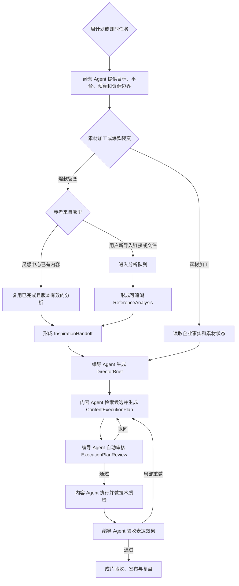

# PRD：灵枢 AI 经营工作台 v3.3

> 文档主题：社媒视频生成逻辑重构
>
> 更新日期：2026-09-23
>
> 代码参考基线：分支 `吴小姐命令AI做爆款复刻`。本版在《编导 Agent 实现共识》基础上，继续吸收《灵感大屏行业采集与编导交接策略 v1》，并要求兼容旧任务读取。
>
> 文档性质：目标产品需求。文中既包含可复用的现有能力，也包含本次需要改造的新逻辑。
>
> 核心原则：参考爆款视频时，要做到“结构高还原、内容真实替换、表达有原创差异”，而不是逐像素复制，也不是规避平台规则。

本文只分三个板块：第一部分重点说明社媒内容如何生成；第二部分说明其他业务模块；第三部分简要说明技术和通用要求。

## 第一部分：社媒内容生成

### 1. 产品目标

社媒内容生成不再从“套用爆款公式”出发，也不能假设用户已经有专业素材。系统从两类真实任务出发：

1. 用户想围绕自己的产品生成视频；有素材就加工，没有素材就由系统从零建立可用素材。
2. 用户想复刻一条爆款视频；有参考视频可以直接添加，没有参考视频也可以让系统从灵感库推荐。

产品面向完全不懂拍摄、剪辑和 AI 的老板。用户不需要会写脚本、选模型或寻找素材，只需要确认“卖什么、卖给谁、哪些事实是真的”。系统默认托管制作；只有事实、权利、预算或目标实质降级时才要求用户介入。

本次改造重点解决七件事：

- 让编导 Agent 对参考视频的分析结果和最终脚本负责。
- 把视频拆到镜头级，准确识别工厂实拍、人物口播、产品展示、使用效果和复合场景。
- 把前三秒黄金钩子作为独立结构；一键托管模式由系统自动选择，高风险或高级模式才要求用户单独确认。
- 让内容 Agent 根据每个镜头的需要选择合适的 AI、数字人和素材库。
- 让没有摄影人员、没有拍摄能力、甚至没有现成图片和视频的用户也能完成一条高质量视频。
- 高度还原爆款视频的有效结构，同时保护客户真实素材，并保持足够的原创差异和平台合规性。
- 让灵感中心用真实企业事实、场景簇、对标账号和平台内表现持续供给可追溯参考，并稳定交给编导 Agent。

### 2. 内容制作只保留两个入口

| 入口 | 是否要求用户已有素材 | 系统主要工作 | 最终结果 |
| --- | --- | --- | --- |
| 素材加工 | 不要求。可以有素材、少量素材或完全没有素材 | 有素材时深加工；没有素材时，从产品资料出发，使用商品页图片、数字人、合规素材库、生成画面和图文动画完成视频 | 一条或一组可发布成片 |
| 爆款裂变 | 不要求客户有拍摄素材；参考视频也可以由系统推荐 | 逐镜分析参考视频，先判断每个镜头能否在零素材条件下完成，再用客户可提供的最低限度产品信息和系统素材能力完成新视频 | 与参考视频结构高度相似、但内容和表达有合理差异的成片 |

“没有素材”不能直接变成“请用户补拍”。系统必须先逐镜判断能否完整实现或功能等价实现；如果缺少不可替代的真实证据或权利，则明确阻断对应分镜并给出降级方案，不能承诺所有零素材任务都能无损生产。

“每周生成”和“立即生成”继续存在，但它们只代表执行频率，不再作为内容制作类型：

- 立即生成：现在创建并执行一次任务。
- 每周生成：保存已确认的制作方案，按计划重复执行。

### 3. 删除“爆款公式”

“爆款公式”不再是产品能力，也不再是视频生成的中间步骤。

需要删除的内容包括：

- 爆款公式页面、导航入口和相关操作按钮。
- 公式提取、公式选择、公式套用和公式版本管理。
- 新任务中对公式 ID、公式名称或公式模板的读写。
- 前端向用户展示的“先总结公式，再按公式生成”流程。
- Agent 提示词中要求输出固定爆款公式的内容。

替代方案是：每一条参考视频先产生独立、可追溯的 `ReferenceAnalysis`，再结合经营目标和企业事实生成导演方案。系统可以从多个样本和真实发布结果中沉淀内部 `CreativePatternMemory`，但它只用于召回和辅助判断，不能成为人工维护的公式库，也不能覆盖单条视频分析或企业事实。

### 4. 社媒视频生成的总体工作逻辑



不论用户从哪个入口开始，系统都必须遵守下面的顺序：

1. 经营 Agent 只决定为什么做、做多少、发到哪里、预算和成功标准，不指定镜头或模型。
2. 编导 Agent 只决定如何表达：选题、钩子、叙事结构、逐镜目标、事实边界、允许变化和验收条件。
3. 爆款裂变先取得可追溯的 `InspirationHandoff`。编导的正式生产交接物是结构化 `DirectorBrief`；脚本只是其中一部分。编导不能提前写死 `assetId`、片段时间、模型、供应商或提示词。
4. 内容 Agent 根据 `DirectorBrief` 检索候选素材和能力，比较来源、证据强度、成本、耗时、成功率与权利风险，输出 `ContentExecutionPlan`。
5. 编导 Agent 对执行方案逐镜自动审核。审核意见必须指出失败的验收条件、原因码、修改要求和经营目标影响，不能只说“效果不好”。
6. 内容 Agent 通过审核后才锁定并执行；技术质检由内容 Agent 完成，表达效果由编导 Agent 验收。
7. 单镜头失败只重做受影响镜头。自动往返受次数、预算和截止时间限制；达到上限后进入待处理状态。
8. 用户确认计划不等于授权发布。发布仍按账号权限、审批和真实平台回执执行。

#### 4.1 两类入口共用同一条任务链

- 周计划入口由 `WeeklyContentPackage` 驱动，明确经营目标、原创数量、发布数量、账号矩阵、预算、优先级和成功标准。
- 即时入口建立轻量 `AdHocBusinessContext`，记录本次目标、平台、账号、预算和事实来源。
- 两类入口从编导阶段开始统一进入 `InspirationHandoff / ReferenceAnalysis → DirectorBrief → ContentExecutionPlan → ExecutionPlanReview → ProductionResult`，不形成两套孤立流程。素材加工没有外部参考时可跳过 `InspirationHandoff`，但仍要读取 `AssetAnalysis`。

#### 4.2 三个 Agent 的写权限

| Agent | 可以决定 | 不可以决定 |
| --- | --- | --- |
| 经营 Agent | 经营目标、产品重点、受众、平台账号、原创数量、发布数量、节奏、预算和成功标准 | 具体镜头、素材片段、模型或供应商 |
| 编导 Agent | 选题、钩子、叙事结构、口播、逐镜视觉目标、事实边界、连续性和验收标准 | 擅自改变经营目标；锁死素材和技术路线 |
| 内容 Agent | 候选素材、素材组合、数字人、模型、第三方能力、配音、字幕、剪辑、渲染和技术质检 | 改写事实、卖点、叙事逻辑、必需证据和验收标准 |

### 5. 零素材启动：用户没有素材时怎么办

#### 5.1 零素材的定义

以下情况都按零素材或弱素材处理：

- 用户没有自己拍摄的视频。
- 用户只有一张产品图片、一个商品链接或一份产品介绍。
- 用户没有可以出镜的人。
- 用户没有工厂、使用场景和客户案例画面。
- 用户不会写口播、不会拍摄，也不知道需要准备什么。

零素材不是新增的第三个内容入口，而是两个内容入口都支持的一种启动状态。

#### 5.2 用户最低输入

系统尽量从企业知识库、商品页或历史资料中自动读取信息。确实没有资料时，用户只需要完成一次简短确认：

1. 卖什么：产品名称或商品链接。
2. 卖给谁：目标客户或目标国家。
3. 最想表达什么：卖点、用途或促销目标。
4. 哪些事实可以公开：参数、价格、效果、认证和服务范围。
5. 希望什么语言和平台；不确定时由系统推荐。

用户可以直接粘贴电商商品页、官网页面或产品目录链接。系统负责提取产品图片、标题、卖点和参数，但使用前必须让用户一次性确认。

如果用户连一张产品图或商品链接都没有，系统可以生成行业知识、痛点教育或采购指南类内容；在品牌介绍和产品证明任务中，如果缺少不可替代的真实事实或权利，必须阻断相关分镜或明确降低目标，不能把 AI 虚构的外观、工厂或效果描述成客户事实。

#### 5.3 系统补齐素材的优先顺序

内容 Agent 按下面的顺序补齐，不把复杂选择交给用户：

1. 企业知识库和历史任务中已经确认的品牌、产品与素材。
2. 用户提供或授权读取的官网、电商商品页、产品目录和云端文件。
3. 由真实产品图片生成的产品动效、背景替换、镜头运动和图文包装。
4. 已授权数字人、AI 配音和口型驱动，用于承担人物口播。
5. 有明确商用权限的素材库，用于场景、环境、转场和气氛画面。
6. 视频或图片生成模型，用于不承担真实性证明的辅助画面。
7. 动态字幕、数据卡片、示意动画、图标和品牌视觉，用于替代无法获得的实拍镜头。

使用外部页面、素材库或生成内容时，系统必须记录来源、授权范围和生成标识。

#### 5.4 三种自动生产路线

系统根据可用资料自动选择路线，用户不需要理解路线差异：

| 路线 | 适用情况 | 主要组成 |
| --- | --- | --- |
| 真实素材增强 | 用户有可用图片或视频 | 真实素材为主，配合剪辑、字幕、配音和局部特效 |
| 产品锚定生成 | 用户只有商品图、商品页或产品目录 | 真实产品图保持一致，配合产品动效、数字人、素材库和生成场景 |
| 完全零素材生成 | 用户只有产品事实，没有任何可用画面 | 数字人或配音、合规素材库、示意动画、动态图文和非证明性生成画面 |

系统先保证真实性和经营目标，再追求可生产。每个镜头必须给出以下四级可行性之一：

| 等级 | 含义 | 默认处理 |
| --- | --- | --- |
| `full_fidelity` | 目标和必需证据都能完整实现 | 自动继续 |
| `functional_equivalent` | 表达方式变化，但镜头功能和事实强度不变 | 编导自动审核后继续 |
| `goal_degraded` | 核心证明或表达强度下降 | 编导确认；影响周目标时返回经营 Agent，并通常提示用户 |
| `blocked_for_facts_or_rights` | 缺少不可替代的事实、素材权利或真实证据 | 停止对应分镜并请求最少必要信息 |

因此系统不提供全局“无需拍摄即可无损完成”的承诺。参考视频中的某个镜头如果依赖真实工厂、真人试用或客户案例，内容 Agent 应优先提出功能等价方案；不能保持事实强度时必须显式降级或阻断。

例如：

- 参考视频用工厂流水线建立信任，但用户没有工厂视频：可改为产品细节、参数卡片、交付流程动画和数字人口播组合；不能生成一个虚构工厂并说是客户工厂。
- 参考视频由真人拿产品口播，但用户没人出镜：可使用授权数字人、产品图和配音完成同样的节奏。
- 参考视频展示产品使用效果，但用户没有效果素材：改为“使用步骤、适用场景或功能说明”，不能生成虚假使用结果。

#### 5.5 拍摄是可选增强，不是默认要求

系统可以给愿意补充素材的用户提供极简拍摄助手：只要求用手机完成少量镜头，并提供构图框、动作示范、倒计时、提词和自动质量检查。

但用户选择“无法拍摄”后，系统必须立即评估每个镜头的四级可行性，不再反复要求补拍。可以功能等价时自动继续；只有用户坚持表达真实工厂、真实案例或真实效果，而系统又没有证据时，才阻断该镜头并提供目标降级方案。

#### 5.6 零素材质量要求

零素材不等于低质量模板。成片仍要满足：

- 前三秒有清楚的视觉主体和钩子。
- 同一条视频中的产品、数字人、色彩和画面风格保持一致。
- 口播、字幕、镜头切换和音乐节拍对齐。
- 不连续堆放无关素材库画面。
- 生成画面不承担未经证实的产品效果证明。
- 用户能够一键换风格、换数字人、换声音或重做单个镜头。

#### 5.7 小白用户的操作上限

默认流程中，用户最多只处理三次确认：

1. 确认系统读到的产品、客户和卖点是否正确。
2. 仅在高级模式、高风险事实或目标降级时确认钩子；普通托管任务自动采用系统推荐。
3. 预览成片并选择“满意”或指出需要修改的镜头。

一键托管模式不强制用户在主钩子和两个备选钩子之间选择；超时或跳过时采用系统推荐。只有高级模式、高风险事实或目标降级时才要求单独确认。

系统不能要求普通用户选择模型、写提示词、理解镜头参数、寻找素材库或决定数字人技术方案。所有技术选择都由内容 Agent 完成，高级设置只对主动打开的用户显示。

### 6. “素材加工”的系统逻辑

#### 6.1 用户输入

用户可以提供以下任意内容，但不设“必须上传素材”的门槛：

- 原始视频片段。
- 产品图片或产品视频。
- 人物口播素材。
- 工厂、生产线、仓库或门店素材。
- 已经制作好的半成品视频。
- 商品链接、官网页面或产品目录。
- 只有产品名称和经过确认的基础信息。

用户可以补充：发布平台、语言、视频时长、目标人群、口播文案、品牌要求和禁用内容。

没有图片或视频时，系统按“零素材启动”建立可生产方案。

#### 6.2 系统分析

系统先识别产品资料和所有可用素材；完全没有素材时，直接分析可以从哪些来源自动建立画面：

- 素材里是谁、是什么产品、在什么场景。
- 画面是否清晰，声音是否可用，横竖屏比例是否合适。
- 哪些画面适合当开头、主体、证明、转场和结尾。
- 哪些内容属于客户真实事实，不能被 AI 改写。
- 哪些镜头可以直接制作，哪些需要系统自动生成替代素材。

#### 6.3 编导 Agent 的加工脚本

素材加工场景中，编导 Agent 不需要分析爆款视频，但仍要给出可执行脚本：

- 前三秒展示什么，第一句话说什么。
- 素材按什么顺序出现。
- 哪些位置增加口播、字幕、贴纸、音效或局部特效。
- 哪些原始画面必须保留，哪些可以裁切或调色。
- 成片多长、节奏多快、结尾如何引导行动。

#### 6.4 内容 Agent 的执行

内容 Agent 根据脚本完成：

- 剪辑和镜头拼接。
- 口播配音、数字人口播或原声清理。
- 商品图动效、合规素材库匹配、辅助画面生成和动态图文制作。
- 字幕生成、翻译和样式包装。
- 背景音乐、音效和节奏对齐。
- 局部画面增强、特效和封面制作。
- 平台尺寸适配和多版本输出。

### 7. “爆款裂变”的系统逻辑

#### 7.1 输入要求

用户至少需要确认产品和目标。参考视频、拍摄素材都可以由系统协助补齐：

- 参考视频：用户可以粘贴链接、上传文件，也可以按行业和目标让系统从灵感库推荐。
- 产品信息：优先读取知识库、商品页或产品目录，没有时用简短问答完成。
- 客户素材：有则优先使用，没有则进入零素材生产路线。
- 来源说明：系统保存参考视频来源，并提示相关权利边界。

系统必须提示：分析参考视频不代表自动获得参考视频中的音乐、人物、商标、画面或其他内容的使用权。

参考视频按来源走两条不同路径：

- 用户新粘贴的外部链接或新上传的文件，先创建分析任务，在任务队列中完成元数据校验、去重、下载边界判断和分层分析；分析完成前不能伪装成可直接生产。
- 灵感中心已经存在的视频，如果同一内容、同一分析版本已经完成合格分析，直接复用分析结果；只有来源变化、分析版本过期、任务需要更高精度或原分析缺少关键证据时才升级分析。

同一视频被关键词、账号、关系扩展或用户链接多次命中时，只保留一条 `InspirationItem`，叠加发现依据，不重复下载和分析。

#### 7.2 不再总结公式，而是做逐镜分析

系统要把参考视频拆成镜头，并同时分析画面、声音、字幕和节奏。每个镜头允许有多个标签，不能强行归为一种场景。

建议的标签维度如下：

| 标签维度 | 示例 |
| --- | --- |
| 场景类型 | 工厂实拍、人物口播、产品展示、使用演示、客户案例、包装发货、复合场景 |
| 画面主体 | 人物、产品、机器、原料、成品、环境、屏幕信息 |
| 人与产品关系 | 手持、试用、安装、讲解、对比、引导观看、现场操作 |
| 镜头语言 | 特写、中景、全景、跟拍、俯拍、推拉、快速切换、定机位 |
| 内容作用 | 钩子、提出问题、展示卖点、证明效果、建立信任、处理疑虑、行动引导 |
| 声音类型 | 真人原声、后期配音、数字人口播、背景音乐、环境声、音效 |
| 屏幕信息 | 主字幕、重点词、数据、标签、品牌信息、行动按钮 |
| 真实性要求 | 必须用客户真实素材、可以使用合成内容、必须人工确认 |
| 建议制作方式 | 原片剪辑、商品图动效、数字人、文生视频、图生视频、素材库、图文动画、可选补拍 |

例如，“人物在工厂里拿着产品讲解生产过程”不能只标成“工厂实拍”。它至少包含：人物口播、工厂场景、产品展示、现场引导、真实素材锁定等多个标签。

参考分析按成本分层执行：L0 元数据用于去重，L1 快速理解用于筛选，L2 全片策略用于判断结构，L3 精确分镜用于生产，L4 用误识别和真实制作结果校正后续分析。灵感中心默认先做到 L0/L1，只有用户打开、收藏、用于创作、编导任务召回，或候选满足已批准的升级规则且仍在预算内时，才进入 L2/L3。前 15 秒可以提高精度，但不能把 15 秒当成整片时长；长视频必须同时保留全片粗结构、精确覆盖区间、时间线空档和置信度。

分析必须通过连续性校验：

- 时间线连续覆盖声明的分析区间；低置信度镜头保留为待确认空档，不能直接删除后伪造连续时间线。
- 动作记录开始状态、动作路径、结束状态和必要空间关系。
- 景别、机位、运镜和构图分别记录。
- 人声、字幕、环境声、音乐和音效分别记录。
- 明确区分可观察事实、推断意图和剪辑造成的因果缺口。
- 不凭空补充对白、品牌、价格、型号、认证、左右手方向或未出现的动作；平台 UI、贴纸和字幕按后期叠加层处理。

#### 7.3 先分析视频结构，再重写客户版本

编导 Agent 要先回答五个问题：

1. 原视频每个镜头为什么放在这里？
2. 这个镜头怎样推动用户继续看？
3. 客户素材或系统可生成的哪种画面可以承担同样作用？
4. 如果没有真实素材，怎样保留镜头功能，同时改成可生成且不造假的表达？
5. 哪些内容需要保留结构，哪些表达必须改变？

分析完成后，再生成客户版本的脚本。新脚本应尽量还原以下内容：

- 前三秒的吸引机制。
- 内容展开顺序。
- 每个镜头在整条视频中的作用。
- 镜头时长、整体节奏和关键转场位置。
- 口播、字幕、画面和音效之间的配合。
- 从开头到结尾的情绪和行动引导。

但不能直接照搬：

- 原视频的完整台词和字幕。
- 原视频文件、人物形象、品牌、商标、水印和未授权音乐。
- 可以识别为同一素材的画面、构图、动作和装饰组合。
- 与客户真实产品、场景或效果不符的内容。

### 8. 前三秒黄金钩子

前三秒不是脚本中的普通一行，而是爆款裂变任务的独立交付项和审核项。

编导 Agent 必须输出：

- 第一帧出现什么主体。
- 第一秒发生什么变化或动作。
- 第一条口播或字幕是什么。
- 钩子类型，例如结果先行、强烈反差、问题刺激、身份命中、使用效果或现场证明。
- 画面、口播、字幕、音乐和音效如何同时配合。
- 客户现有素材怎样实现这个钩子。
- 客户没有素材时允许怎样功能等价，以及哪些真实证据不能被替代。
- 哪些地方参考原视频，哪些地方必须换成新的表达。
- 是否涉及只有真实素材才能证明的内容；如果涉及，如何自动改成不依赖实拍的钩子。

每个爆款裂变任务默认提供：

- 1 个主钩子：最接近参考视频有效机制的版本。
- 2 个备选钩子：保持同一卖点，但采用不同开场表达，方便后续测试。

在高级模式、高风险事实或目标降级任务中，前三秒没有确认不能进入制作；一键托管模式由系统记录自动选择理由并采用主钩子，不额外阻塞小白用户。

### 9. 编导 Agent 的职责

#### 9.1 核心职责

编导 Agent 对“应该发现什么、为什么采用这条参考、参考分析是否可靠、这条视频为什么这样表达、每个分镜应达到什么效果”负责。它不总结呆板公式，也不能代替内容 Agent 选择具体素材、模型或供应商。

在参考进入生产前，编导 Agent 还要：

1. 根据经营目标、产品事实、目标市场、沟通对象和预算形成 `DiscoveryBrief`。
2. 优先检索已有灵感库存；库存不足时发起任务级补充采集，不能静默改写长期发现范围。
3. 读取候选的相关性、平台内表现、创作可迁移性、权利状态、分析等级和近期重复情况。
4. 选择少量主参考，并说明每条参考承担整体结构、证明方式、视觉节奏或 CTA 中的哪一种作用。
5. 对不适合生产的候选明确降级为选题参考，或给出不采用原因。

编导 Agent 在发现与生产阶段产出四个正式对象：

1. `DiscoveryBrief`：本轮要发现什么、从哪里发现、采多少、预算和停止条件是什么。
2. `InspirationHandoff`：灵感中心交给编导的最小契约，说明为什么选、可以借鉴什么、必须替换什么、证据和权利边界是什么。
3. `ReferenceAnalysis`：单条参考视频的可追溯分析，包含全片时长、分析覆盖范围、空档和置信度。
4. `DirectorBrief`：编导与内容 Agent 的正式交接物。脚本、口播和字幕只是其中一部分。

`ShotMaterialMap`、`AssetSupplyPlan`、具体 `assetId`、`clipId`、时间片段、模型、供应商、提示词和重试策略全部归内容 Agent 的 `ContentExecutionPlan` 管理。

#### 9.2 每个镜头必须写清楚的内容

| 字段 | 说明 |
| --- | --- |
| `purpose` | 分镜在叙事中的作用 |
| `targetVisual` | 理想视觉，以及观众应该感知到的效果 |
| `requiredEvidence` | 必须出现的主体、事实、动作或证明 |
| `action` | 开始状态、动作路径、结束状态 |
| `shotLanguage` | 景别、机位、运镜和构图 |
| `spaceAndContinuity` | 空间关系、人物/产品状态及前后镜衔接 |
| `audioLayers` | 口播、对白、字幕意图、环境声、音乐和音效 |
| `duration` | 开始时间、结束时间和目标时长 |
| `truthBoundary` | 真实性、合规、品牌和权利边界 |
| `allowedVariation` | 内容 Agent 可以改变的执行方式 |
| `acceptanceCriteria` | 可观察、可自动或人工检查的验收条件 |

#### 9.3 编导脚本的验收标准

一份 `DirectorBrief` 只有同时满足以下条件才算完成：

- 每个镜头都说明“为什么这样表达”和“怎样算达到效果”，不要求内容 Agent 猜测意图。
- 只描述素材需要满足的证据和效果，不提前锁定具体素材或技术路线。
- 无素材时明确允许的功能等价范围；缺少真实证明时明确降级或阻断条件。
- 前三秒有具体画面、台词、字幕和节奏说明。
- 复杂场景使用多标签描述，没有被错误简化。
- 高度还原点和必须变化点都写清楚。
- 所有产品事实都有客户资料依据。
- “高级感”“爆款感”“突出实力”等抽象词不能单独作为验收条件。

### 10. 内容 Agent 的职责

#### 10.1 核心职责

内容 Agent 对“怎么做出来”负责，不负责重新解释参考视频，也不能擅自重写已经确认的脚本。

它要针对每个镜头选择最合适的制作方式，而不是整条视频只调用一个模型。

#### 10.2 镜头制作方式选择

| 镜头情况 | 优先处理方式 |
| --- | --- |
| 客户已有真实且可用的产品或工厂画面 | 直接剪辑、裁切、调色和声音处理，不重新生成主体 |
| 客户只有一张产品图或商品页图片 | 锁定产品外观，生成景深、运镜、背景和局部动效，不重绘关键产品信息 |
| 客户没有任何产品画面 | 使用数字人、动态图文、行业场景和功能说明；不虚构具体产品外观 |
| 客户已有真实人物口播 | 保留人物身份、表情和动作，只做必要的降噪、字幕或局部修复 |
| 客户没有出镜人，但脚本需要稳定口播 | 在客户授权后使用数字人或配音方案 |
| 人物在真实工厂中引导拍摄 | 优先使用真实人物和真实工厂素材，AI 只做局部辅助 |
| 脚本需要工厂画面，但客户没有工厂素材 | 改用生产流程示意、产品细节、交付流程或通用行业画面，不能把生成工厂说成客户工厂 |
| 产品使用效果或性能证明 | 必须使用真实、可验证的客户素材，不能用生成画面伪造效果 |
| 脚本需要效果证明，但客户没有证明素材 | 自动改写成使用步骤、适用场景、原理或参数说明 |
| 转场、气氛镜头或非事实性补充画面 | 可使用已授权素材库或合适的生成模型 |
| 局部视觉特效 | 只修改指定区域，不重绘被锁定的产品、人物或文字 |
| 多语言版本 | 尽量保留原画面，重新生成配音、口型和字幕，并单独质检 |

#### 10.3 模型和工具选择依据

内容 Agent 选择工具时需要同时考虑：

- 镜头需要保持的真实信息。
- 人物、产品和场景的一致性。
- 输入素材的清晰度和长度。
- 目标语言、口型和声音要求。
- 镜头时长、比例和平台规格。
- 生成成本、速度、稳定性和失败后的备用方案。
- 客户授权范围和素材库版权范围。
- 在没有客户素材时，是否仍能保持产品、人物和视觉风格的一致性。

首选模型失败时，内容 Agent 应自动尝试备用模型或等价制作方式。只有所有安全方案都无法完成时，才把问题交给用户处理。

模型名称、内部评分、提示词和路由规则属于系统内部信息。前端只向用户解释“这一镜头将使用真实素材剪辑、数字人或生成画面”，不要求用户理解模型细节。

#### 10.4 `ContentExecutionPlan`

内容 Agent 接到 `DirectorBrief` 后先规划、再执行。它为每个分镜：

1. 检索约 10–20 个素材片段或可用能力作为候选；这是召回目标，不是硬门槛。
2. 按企业归属、语义相关性、证据强度、动作与景别、画质、时长、权利状态和重复度排序。
3. 给出一个推荐组合和少量备选组合。
4. 在本地素材、授权共享素材、安全图形、数字人、图片/视频生成、补拍或混合方案中选择路线。
5. 逐镜给出四级可行性、成本、耗时、成功率、数据出境和权利风险。
6. 保存候选和产物的来源、供应商、输入版本、授权、执行 attempt 和 provenance。
7. 提交编导 Agent 自动审核；审核通过后才锁定和执行。

#### 10.5 编导自动审核执行方案

编导 Agent 输出 `ExecutionPlanReview`，至少包含：是否通过、逐镜结论、未满足的验收条件、要求修改的素材或技术路线、对视频/周目标的影响以及结构化原因码。原因码包括素材不足、事实缺失、授权不足、预算超限、能力不匹配、时长不适配、生成失败和表达失败。

内容 Agent 与编导 Agent 的自动往返必须设置最大次数、预算和截止时间。达到阈值后进入待处理状态，不得无限重试或继续产生付费调用。

#### 10.6 能力注册表

每项本地或第三方能力统一登记：能做什么、明确不能做什么、输入要求、输出规格、质量区间、成本、典型耗时、并发限制、可用状态、授权范围、数据传输限制、失败备选路线和历史成功率。供应商自述不能替代真实执行验收数据。

### 11. 客户真实素材和生成素材管理

#### 11.1 原始素材不可被覆盖

- 客户上传的原文件只读保存。
- 所有剪辑、增强和生成结果都创建新版本。
- 每个成片镜头都能追溯到原素材、生成任务或素材库来源。
- 用户可以随时查看“这个镜头用了什么”。
- 系统生成素材必须保存生成来源、关联产品事实和适用范围，不能混入客户原始素材目录。

#### 11.2 默认锁定内容

以下内容默认不能被生成模型随意改变：

- 产品外形、颜色、包装、商标和可读文字。
- 真实工厂、生产流程、设备和环境关系。
- 已确认人物的身份、脸部、服装和关键动作。
- 已确认的产品效果、参数、认证和对比结果。
- 客户明确要求保留的原声、镜头和品牌元素。

如果确实需要改变，必须让用户先确认修改范围。

#### 11.3 生成内容边界

AI 可以用于：

- 清理噪声、补字幕、做翻译、调色和合理裁切。
- 增加不改变产品事实的背景、气氛和转场。
- 在授权范围内制作数字人口播。
- 生成不承担产品证明作用的辅助画面。

AI 不可以用于：

- 伪造客户没有的工厂、认证、案例或产品能力。
- 改变产品关键外观和真实使用效果。
- 把合成内容包装成真实拍摄证据。
- 未经授权复制参考视频中的人物、声音、商标和素材。

### 12. 高度复刻和原创差异如何同时做到

系统对两个维度分别检查，不能混成一个总分。

#### 12.1 需要高度还原的内容

- 钩子的吸引机制。
- 内容结构和信息出现顺序。
- 每个镜头承担的功能。
- 镜头时长、切换频率和节奏。
- 口播、字幕、画面和音效之间的关系。
- 从开头吸引到结尾行动引导的推进方式。

#### 12.2 必须形成差异的内容

- 台词和字幕要结合客户产品重新表达。
- 人物、产品、工厂和使用场景要换成客户真实内容。
- 镜头素材、具体构图、动作、音乐、音效和装饰不能整体照搬。
- 字幕样式、配色、转场和品牌露出要符合客户自己的品牌。
- 行动引导要根据客户真实业务重新设计。

最终目标是：

> 结构高还原、内容真实替换、表达有原创差异。

这套机制用于降低机械重复和平台同质化风险，同时满足版权、事实和平台内容规则。系统不承诺规避检测，也不提供绕过平台规则的能力。

### 13. 自动质检和人工验收

| 检查项 | 系统要确认什么 | 未通过时怎么处理 |
| --- | --- | --- |
| 分析完整性 | 参考视频是否完成逐镜、声音、字幕和节奏分析 | 返回编导 Agent 补充分析 |
| 脚本可执行性 | 每个镜头是否有明确画面、文案、素材和制作方式 | 不允许进入制作 |
| 结构还原度 | 钩子、顺序、镜头作用和节奏是否符合已确认方案 | 重新剪辑或生成对应镜头 |
| 原创差异度 | 文案、素材、人物、声音和视觉表达是否有足够差异 | 调整差异不足的镜头 |
| 事实准确性 | 产品参数、效果、案例和认证是否有依据 | 阻止交付并要求确认 |
| 素材完整性 | 产品、人物、工厂和文字是否被错误改变 | 使用原素材重做对应区域 |
| 零素材可生产性 | 每个镜头是否都有系统可直接执行的素材方案 | 自动切换素材来源或改写镜头表达，不能默认要求用户拍摄 |
| 生成一致性 | 产品外观、数字人、画风和品牌视觉是否前后一致 | 锁定参考资产并重做不一致镜头 |
| 权利与来源 | 参考视频、音乐、素材库和人物授权是否清楚 | 标记风险，缺少必要授权时阻止发布 |
| 技术质量 | 清晰度、字幕、安全区、音量、口型和画面比例是否合格 | 自动修复或返回制作 |
| 平台适配 | 时长、比例、封面和敏感内容是否符合目标平台要求 | 生成对应平台版本 |

前端要分别显示“结构还原度”和“原创差异度”，避免用户误以为越像越好，或越不同越好。

### 14. 任务状态和版本管理

社媒内容任务统一使用以下状态：

1. `planned`：经营上下文和交付目标已建立。
2. `reference_ready`：参考分析或素材理解完成。
3. `director_ready`：`DirectorBrief` 已生成并通过自身校验。
4. `execution_planning`：内容 Agent 正在检索候选并制定执行方案。
5. `director_review`：编导 Agent 正在自动审核执行方案。
6. `producing`：审核通过，内容 Agent 正在逐镜制作。
7. `technical_review`：内容 Agent 检查媒体技术质量。
8. `creative_review`：编导 Agent 检查表达和逐镜验收条件。
9. `asset_review`：用户只在需要时预览最终成片或处理异常。
10. `ready_to_publish`：成片和平台包已准备好，等待发布授权。

任一步都可以进入 `needs_facts`、`needs_rights`、`needs_budget`、`goal_degraded` 或 `failed_recoverable`。旧任务状态继续可读，由兼容层映射到新阶段。

版本规则：

- `weeklyPackageId / adHocBusinessContextId → contentPlanId → videoTaskId → referenceAnalysisId + version → directorBriefId + version → sceneId → contentExecutionPlanId + version → executionPlanReviewId → artifactId → creativeReviewId → publishAssignmentId` 形成稳定链路。
- 版本不能使用固定字面值。任何上游变化都要计算影响范围：发布时间变化通常只影响发布任务，素材失效只重规划引用它的分镜，产品事实变化才使相关导演方案和成片失效。
- 第三方付费调用使用幂等键并记录执行；单分镜失败只重做受影响部分。
- 旧 `StoredSocialDirectorPlan` 通过读取适配器继续展示，不批量重写历史任务。

### 15. 前端交互设计

前端信息架构、页面流程、状态反馈、Agent 设置、实时工作台、响应式和无障碍规范已经独立维护在 [`PRD-灵枢AI前端交互-v1.md`](./PRD-灵枢AI前端交互-v1.md)。本系统 PRD 只保留业务目标、系统工作逻辑、数据边界和验收口径；发生冲突时，业务逻辑以本文为准，前端表达以独立前端 PRD 为准。

### 16. 灵感中心、行业采集与编导交接

#### 16.1 产品边界

“灵感大屏”和“灵感中心”指同一个模块，前端统一叫“灵感中心”。它是人工和 AI 共同浏览、筛选、理解和引用的轻量灵感池，负责回答“最近发现了什么、为什么值得看、能怎样借鉴”。

灵感中心不负责写脚本、做分镜、匹配最终素材或生产成片。用户点击“用于创作”后，灵感中心只把必要信息交给编导 Agent；`DirectorBrief` 和后续内容生产仍在内容制作流程完成。

灵感中心只维护一个核心对象 `InspirationItem`。一条内容可以同时属于“行业起量”“对标账号”和“创新参考”，不能因为发现路径不同重复入库。

#### 16.2 每条灵感保存什么

每条 `InspirationItem` 分三层保存：

1. **来源事实**：平台、内容 ID、来源链接、作者、发布时间、封面和公开指标。字段没有返回就显示“暂未获取”，不能由模型补写。
2. **AI 解读**：场景、问题、钩子、结构、证明方式、可迁移内容和制作难度。每项必须区分可观察事实与模型推断，并保存分析版本、置信度和复核状态。
3. **使用关系**：收藏、关联任务、采用记录、用户备注和放弃原因。

来源字段采用 `value + source + verificationStatus`。作者、发布时间、互动量、许可和权利状态中禁止写入模型推断。外部平台内容默认权利状态是 `reference_only`；公开可见、采集成功或平台标记可复用，都不能自动等同于可下载、可商用或可二创。

#### 16.3 发现范围：不再使用写死的行业模板

系统不再按“美妆、机械、服装”等行业直接写死一套关键词。每个发现范围由以下信息共同决定：

```text
企业与产品事实
  × 企业角色和沟通对象
  × 目标国家、语言和本地叫法
  × 搜索意图
  × 内容表达形式
```

普通用户只需要确认三件事：卖什么、在哪个市场、说给谁听。产品、材料、工艺、认证和服务能力必须来自企业中心、商品资料或用户确认；竞品必须由用户确认；模型可以做翻译、聚类和查询扩展，但不能发明产品事实或竞品身份。

后台使用版本化 `MarketKeywordSet`，前端统一叫“发现范围”。一个发现范围内部保存三层结构：

| 层级 | 作用 | 运行方式 |
| --- | --- | --- |
| 大词／发现入口 | 打开足够大的行业内容空间，例如品类、核心需求或人群入口 | 小额度持续运行，用于发现新关系 |
| 中词／场景簇 | 产品与人群、场景、问题、决策顾虑或证明方式的组合 | 日常采集主体，用户主要管理这一层 |
| 小词／证据查询 | 具体对象 + 具体问题 + 具体动作／证据 | 只在编导任务缺少证据时按需运行 |

中词不能只是产品手册栏目或抽象卖点。系统要把产品事实、客户原话和公开内容证据连起来，再形成“产品任务 + 场景／问题／顾虑”的候选。模型从功能推测出的场景必须标成“待验证”，经过用户确认或真实小样本验证后才能启用。

#### 16.4 五路召回与三类灵感供给

关键词只解决“找得到”，不能单独判断“正在起量”或“值得复刻”。候选池由五路组成：

1. **关键词召回**：使用大词、中词和任务级小词覆盖行业语义。
2. **对标账号召回**：增量采集用户确认或系统验证后的账号。
3. **内容关系扩展**：只使用采集源真实返回的 Hashtag、作者、声音、共现词或相关推荐关系。
4. **表现反向扩展**：从相对正在起量的内容反推新场景和新查询。
5. **创新探索召回**：从相邻行业／场景，或内容与评论暴露的新问题中寻找可迁移表达。

前端将内容归为三类供给，但仍在同一个列表中展示：

| 类型 | 准入重点 | 主要用途 |
| --- | --- | --- |
| 行业起量 | 行业相关、平台内表现证据、创作机制可解释 | 找正在增长或高表现的同行表达 |
| 对标账号增量 | 账号长期相关、内容可解释、采集稳定 | 连续观察选题、证明方式和基线变化 |
| 创新参考 | 有真实来源和业务锚点，能补充新场景或新表达 | 跨行业迁移结构、镜头作用和证明顺序 |

创新参考不强制达到行业头部播放量，但必须说清楚“新在哪里、可借鉴什么、迁移时必须替换什么”。

#### 16.5 采集计划和成本边界

编导 Agent 先形成 `DiscoveryBrief`，定时任务再按计划调用采集工具。定时任务不是数字员工，不决定行业方向，也不能自行扩大关键词、账号、平台或预算。

一次 `InspirationCollectionRun` 至少保存：发现范围和版本、触发来源、召回通道、平台／账号／链接范围、实际查询、查询依据、回看天数、结果上限、单次预算、停止原因、运行费用、去重结果和有效候选数。

所有平台都必须按当前采集工具真实支持的输入和字段降级。关键词、Hashtag、账号和链接不能混成一个字符串硬塞给所有平台。每次运行同时设置 `maxResults`、`maxRunCost`、超时、租户日／月预算和失败熔断。

#### 16.6 分层分析和缓存复用

候选进入灵感中心不需要等待完整视频深度分析：

| 层级 | 处理内容 | 何时执行 |
| --- | --- | --- |
| L0 | 来源校验、元数据、去重、可访问性和权利边界 | 所有候选 |
| L1 | 封面／预览、文本、粗场景、相关性和质量筛选 | 有效入库候选 |
| L2 | 钩子、结构、证明顺序、节奏、CTA 和可迁移边界 | 打开、收藏、任务召回或高价值候选 |
| L3 | 连续时间线、逐镜动作、声音、空间连续性和生产约束 | 准备进入具体生产的参考 |
| L4 | 用误识别、制作失败和真实发布结果校正分析 | 作为后续学习，不阻塞当前浏览 |

分析结果按 `inspirationId + analysisVersion + modelVersion` 缓存。同一版本只分析一次；重复命中直接复用。用户新导入的外部链接先进入任务队列，灵感中心已有内容直接读取有效缓存，只有精度不足或版本过期时升级。

页面必须明确显示“待解读、快速解读完成、策略分析完成、精确分析完成或分析失败”，不能用一个笼统的“已分析”掩盖实际深度。

#### 16.7 相关、起量和可迁移必须分开判断

系统至少保存三类独立判断，不能合成一个看不懂的总分：

- **相关性**：内容与产品、市场、沟通对象和任务是否匹配。
- **表现信号**：在同一平台、相近发布时间和相似账号量级内是否相对突出；只有连续快照或可靠账号基线时才叫“正在起量”，单个时间点只能叫“高表现候选”。
- **可迁移性**：钩子、结构、证明方式和节奏能否解释，企业是否具备真实执行条件。

绝对播放量不能跨平台、跨账号直接比较。外部内容高表现只提高研究优先级，不能证明该表达一定适合本企业；企业自己的成片结果才用于长期验证。

#### 16.8 交给编导的三个就绪等级

| 等级 | 条件 | 编导可怎样使用 |
| --- | --- | --- |
| `discovery_reference` | L0/L1 完成，相关性基本可信 | 只用于选题发散和继续找参考 |
| `strategy_reference` | L2 完成，可迁移边界清楚 | 可借鉴钩子、结构、证明顺序、节奏和 CTA |
| `production_reference` | L3 连续逐镜分析通过校验，权利边界清楚 | 可辅助形成分镜目标，但仍要替换产品事实和独特表达 |

灵感中心生成轻量 `InspirationHandoff`，至少包含：内容和分析版本、就绪等级、来源、任务上下文、选择理由、可复用逻辑、必须替换／禁止使用的内容、生产影响、证据引用和权利边界。

多条灵感进入同一任务时，每条必须指定唯一主用途：`primary_structure`、`proof_reference`、`visual_rhythm` 或 `cta_reference`。发生冲突时，以经营目标、企业事实和实际素材能力为准，不能机械拼接多个视频。

#### 16.9 对标账号的积累逻辑

账号来自三条路径：用户提供、有效内容反推、采集源真实返回的关系。系统可以小批量试采候选账号，但不能因为一条高播放视频就自动认定为长期对标账号。

账号按以下状态流转：

```text
candidate 候选
  → trial 试采
  → tracked 长期跟踪
  → watching 降频观察
  → stopped 停止跟踪
```

编导 Agent 根据持续相关性、账号内相对表现、新场景贡献、创作迁移价值、市场／对象匹配、原创可信度、更新稳定性、采集成本和失败率给出晋级或降级理由。平台账号 ID 和规范化主页 URL 用于稳定去重；展示名称不能作为唯一键。

评论正文只对候选账号的代表内容按需采集。评论总数不等于已获得评论正文，评论正文不等于有效询盘，疑似询盘不等于成交。

#### 16.10 灵感中心前端交互

灵感中心的界面结构、加载状态、分页、筛选、卡片信息和“用于创作”交互统一按独立前端 PRD 第 8 节执行。本文只保留发现范围、分层分析、缓存复用和编导交接的业务规则。

#### 16.11 定时任务和编导设置

定时任务回答“何时采、去哪采、采多少”，不再让用户重复维护一份长期关键词。任务卡片显示：发现范围和版本、已启用场景、对标账号、创新探索命题、平台、频率、回看天数、结果上限、预算、上次结果和下次执行时间。

自由关键词保留在高级设置，只作为一次性热点、临时活动或故障补采，并标记“仅此任务”。每次运行保存当时展开的最终查询和策略快照，保证历史结果可解释。

编导 Agent 设置只引用默认发现范围，继续保留平台、时间、回看天数、数量、预算和自动化边界；不再出现第二套“AI 推荐关键词”自由文本配置。

#### 16.12 素材也要做可复用分析

客户上传的图片和视频进入素材库后，需要生成轻量 `AssetAnalysis`，用于后续检索、匹配和加工。至少包含：产品／人物／场景、多标签镜头作用、画幅与时长、可见文字、声音、动作、清晰度、真实性要求、授权范围、可编辑区域和不可修改区域。

素材分析只描述真实观察和使用边界，不替客户补写产品效果。原始素材只读；字幕、特效、抠图、调色、裁切、数字人或生成扩展都形成派生版本，并保留来源关系。

#### 16.13 反馈闭环

采集策略使用完整漏斗，而不是只按播放量自我强化：

```text
被采集 → 有效入库 → 被打开／收藏 → 用于创作
  → 被编导采用 → 形成成片 → 企业自有成片结果回流
```

相关／不相关用于调整召回；收藏／采用／放弃原因用于调整可迁移判断；企业自有成片表现和经营结果用于调整长期优先级。长期发现范围的变更必须让用户可见，任务级临时查询不得自动写回。

## 第二部分：社媒内容生成之外的其他板块

### 1. 智能经营

智能经营继续保留数字员工工作流。用户看到的重点是“谁正在处理、处理到哪一步、下一步需要什么”，而不是底层模型调用。

现有固定流程继续保留：

1. 收集企业资料。
2. 建立品牌和产品知识。
3. 研究市场与竞品。
4. 生成内容计划。
5. 制作内容。
6. 审核并准备发布。
7. 承接客户咨询。
8. 生成报价和跟进动作。
9. 记录订单和经营结果。
10. 根据结果复盘下一轮任务。

其中“生成内容计划”和“制作内容”需要直接进入新的两个内容制作入口，不再进入爆款公式流程。

### 2. 灵感中心和素材库

灵感中心和素材库仍是全系统共享能力，但社媒场景下的发现、分析、交接和素材标注以第一部分第 16 节为准。

- 灵感中心保存外部参考及其发现、分析和使用关系，不承担成片生产。
- 素材库保存客户自有或已授权素材及其派生版本，不能与外部参考混为一类。
- 只有可访问完整视频且达到相应分析等级的内容，才能进入高保真爆款裂变；截图和片段只能作选题灵感。
- 内部 `CreativePatternMemory` 只能由多个样本和真实发布结果支持，用于召回和辅助规划，不对编导形成硬规则。

### 3. 发布与数据回收

系统可以准备发布包、发布说明和平台版本，但“生成完成”不等于“发布成功”。

只有拿到平台返回的内容 ID、链接、发布时间或失败原因后，才能更新发布状态。没有真实回执时，只能标记为“待发布”或“状态未知”。

发布后的播放、互动、线索和转化数据要回到对应内容任务，供用户判断哪种钩子和脚本真正有效。

### 4. 客户、企微、报价和订单

- 客户模块保存客户资料、沟通记录、标签、负责人和下一步动作。
- 企微或其他消息渠道只有拿到真实发送回执后，才能标记发送成功。
- 报价必须基于已确认的产品、价格、币种、税费、交付和有效期。
- 订单状态必须来自正式业务记录，不能根据聊天内容自动猜测成交。

### 5. 广告与增长

内容可以被选为广告素材，但投放预算、受众、时间和目标必须由有权限的用户确认。系统可以提供建议，不能未经确认自动花费预算。

### 6. 知识、记忆、排期和权限

- 企业事实、产品资料和品牌规则统一保存，供各 Agent 读取。
- 用户意见和已确认方案形成版本记录，不直接覆盖历史内容。
- 排期负责定时启动任务，不代表任务一定成功完成。
- 所有对外发布、消息发送、报价和广告动作都按角色与能力授权。

## 第三部分：技术栈与通用要求

### 1. 技术栈简述

- 前端：React、TypeScript、Vite、Tailwind CSS。
- 服务端：Node.js、Express、TypeScript 和异步 Worker。
- 数据与文件：PocketBase 或同类业务数据服务，配合对象存储保存视频和图片。
- 媒体处理：FFmpeg、Sharp，以及视觉识别、语音、数字人和视频生成服务。
- 外部连接：通过正式 API 接入社媒平台、企微、广告和其他业务系统。

具体选择哪一家模型服务由系统路由决定，PRD 不绑定单一供应商。

### 2. 核心数据对象

| 对象 | 作用 |
| --- | --- |
| `ContentTask` | 一次素材加工或爆款裂变任务 |
| `SourceAsset` | 客户原始素材、商品页素材或已授权素材；不与外部参考混存 |
| `AssetAnalysis` | 客户素材的场景、主体、动作、镜头作用、真实性、授权和可编辑边界 |
| `WeeklyContentPackage` | 经营 Agent 提供的周目标、原创/发布数量、账号矩阵、预算、优先级和成功标准 |
| `AdHocBusinessContext` | 即时任务的轻量经营上下文 |
| `MarketKeywordSet` | 版本化发现范围，绑定产品、市场、沟通对象、竞品和关键词关系图 |
| `SocialKeywordGraph` | 大词发现入口、中词场景簇、小词证据查询及其真实依据 |
| `DiscoveryBrief` | 编导 Agent 确认的采集目标、通道、平台、范围、预算和停止条件 |
| `InspirationCollectionRun` | 一次真实采集的输入快照、结果、费用、失败和停止原因 |
| `InspirationItem` | 灵感中心唯一内容对象，保存来源事实、AI 解读和使用关系 |
| `CandidateEvidence` | 候选的发现路径、相关性、表现信号、可迁移性、限制和证据 |
| `InspirationHandoff` | 灵感中心交给编导的最小契约，包含就绪等级、复用逻辑、替换边界和权利 |
| `TrackedAccount` | 候选、试采、长期跟踪、降频观察或停止的账号记录与决策证据 |
| `ReferenceAnalysis` | 单条参考视频的分层分析、覆盖范围、时间线空档、置信度和权利说明 |
| `CreativePatternMemory` | 多样本与真实结果支持的内部创作模式记忆，只用于召回和辅助规划 |
| `DirectorBrief` | 编导 Agent 的正式交接物，定义表达目标、逐镜证据、真值边界、允许变化和验收条件 |
| `ContentExecutionPlan` | 内容 Agent 的候选素材、推荐/备选组合、四级可行性、能力路线、成本、耗时、成功率、来源和重试策略 |
| `ExecutionPlanReview` | 编导 Agent 对内容执行方案的逐镜审核和结构化修订意见 |
| `ProductionResult` | 逐镜执行、技术质检、编导验收和最终产物记录 |
| `ArtifactVersion` | 脚本、配音、字幕、镜头、封面和成片的版本 |
| `PublicationPackage` | 面向具体平台的成片、封面、文案和发布说明 |
| `PublicationEvidence` | 平台返回的发布结果和凭证 |

`ShotMaterialMap`、`AssetSupplyPlan`、provider attempt 和 provenance 归入 `ContentExecutionPlan`。新数据模型中不再设置 `ContentFormula` 或其他爆款公式对象；历史公式只读兼容，不进入新任务。

### 3. 安全与真实性要求

- 所有业务数据按租户隔离。
- 所有敏感操作按角色和能力授权。
- 长任务支持幂等、重试、断点恢复和失败记录。
- 原始素材只读，所有生成结果使用新版本。
- 对外发布、发送消息和商业承诺必须保存真实回执。
- 产品参数、认证、案例和效果只能来自已确认资料。
- 分析参考视频不代表获得复制、改编或发布其中受保护内容的权利。

### 4. 非功能要求

- 单个镜头失败时可以只重做该镜头，不必整条视频重做。
- 主模型不可用时可以切换备用模型，但不能擅自改变已确认脚本。
- 生成任务要显示进度、预计阶段、失败原因和可执行的恢复动作。
- 每次模型调用记录输入版本、输出版本、成本、耗时和错误信息。
- 支持多任务排队和租户级并发限制。
- 前端清楚区分真实素材、生成素材和素材库内容。
- 主要审核和确认操作支持桌面端与移动端。
- 零素材任务和有素材任务使用相同的质量门槛，不能降级成简单模板拼接。

### 5. 当前能力与本次改造范围

现有代码中可以继续复用的能力：

- 统一内容任务，以及立即执行和每周执行两种频率。
- 编导方案、版本确认、锁定交接和退回修改。
- 客户素材真实性约束。
- 口播、字幕、背景音乐、剪辑、封面和自动质检能力。
- 成片确认、返工、发布包和平台回执。
- 长任务、幂等、租户隔离和权限基础能力。

本次需要重点改造：

1. 内容制作首页收束成“素材加工”和“爆款裂变”。
2. 删除爆款公式的页面、对象和生成链路。
3. 爆款裂变必须先完成参考视频逐镜分析。
4. 前三秒钩子成为独立结构，提供一个主方案和两个备选方案；托管模式可自动采用。
5. 以 `DirectorBrief` 替代“脚本 + 预定素材计划”作为编导正式输出，补齐多标签、动作、空间连续性、音频层、真值边界和验收条件。
6. 由内容 Agent 独立生成 `ContentExecutionPlan`，管理候选素材、推荐/备选组合、镜头映射、四级可行性、成本、耗时、成功率、权利、provenance 和 fallback。
7. 增加 `ExecutionPlanReview`，编导逐镜审核后内容 Agent 才执行。
8. 原始素材和加工结果分开保存，增加不可修改区域。
9. 自动质检分别检查结构还原度和原创差异度。
10. 前端增加参考视频与新视频的逐镜对照视图。
11. 增加零素材启动、商品页资料提取和 `AssetSupplyPlan`。
12. 增加一键托管模式，以及数字人、配音、素材库、生成画面和图文动画的自动路由。
13. 周计划入口使用 `WeeklyContentPackage`，即时入口使用 `AdHocBusinessContext`，两者进入同一生产链。
14. 旧导演方案保留只读兼容，新任务使用真实递增版本、影响范围失效和付费调用幂等键。
15. 将写死的行业关键词模板升级为版本化 `MarketKeywordSet + SocialKeywordGraph`，保留旧关键词作为迁移输入，不再作为新任务主配置。
16. 灵感中心增加发现范围、场景簇、起量候选、对标账号和创新参考，并把“加载更多”改成每页 30 条的稳定分页。
17. 灵感库存量在加载中保留最近真实值，列表显示加载状态；失败时不清空页面或闪退。
18. 外部新链接进入分析队列；灵感中心已有视频按内容和分析版本复用结果，避免重复下载、分析和付费。
19. 定时任务引用发现范围快照，保存实际查询、平台参数、结果上限、预算和停止原因；自由词降级为一次性高级设置。
20. 建立账号 `candidate → trial → tracked → watching → stopped` 状态机，并保存编导 Agent 的晋级／降级证据。
21. 客户图片和视频生成 `AssetAnalysis`，供素材匹配、加工和不可修改区域保护使用。

### 6. 验收标准

#### 6.1 素材加工

- 用户只通过“素材加工”入口即可完成资料输入、脚本确认、制作、预览和交付。
- 用户没有图片、视频和出镜人员时，系统仍能生成安全可执行方案；若任务依赖不可替代的真实证据，则只阻断相关镜头并明确原因。
- 小白用户只提供产品事实和目标，不选择模型、不写提示词，也能完成任务。
- 系统能识别并保护客户真实产品、人物和工厂素材。
- 用户能只修改一个镜头或一个局部区域。

#### 6.2 爆款裂变

- 用户添加参考视频后，可以看到逐镜分析，而不是爆款公式。
- 复杂镜头可以同时拥有多个标签。
- 编导 Agent 输出结构化 `DirectorBrief`，不提前写死具体素材和技术供应商。
- 前三秒有主钩子和两个备选钩子；托管模式自动采用，高风险或高级模式单独确认。
- 新成片能分别查看结构还原度和原创差异度。
- 用户能逐镜对比参考视频和新视频。
- 用户没有参考视频时，系统可以从灵感库推荐；用户没有客户素材时，系统逐镜给出完整实现、功能等价、目标降级或事实/权利阻断结论。
- 参考视频包含无法真实复刻的工厂、人物或效果镜头时，系统能自动生成同功能替代镜头，并保持整体结构和节奏。

#### 6.3 Agent 分工

- 编导 Agent 对发现范围、采集计划、候选采用判断、参考分析和脚本负责。
- 内容 Agent 按 `DirectorBrief` 选择素材和制作方式，提交 `ContentExecutionPlan`，经编导自动审核后执行。
- 内容 Agent 不能擅自改变产品事实、锁定素材或脚本意图。
- 素材不足时，系统优先自动补齐或改写为功能等价镜头；目标降级和事实/权利阻断必须显式返回上游。
- 用户明确选择“无法拍摄”后，可安全替代的镜头继续制作；不可替代的证明镜头不得被伪造。
- 默认一键托管流程中，普通用户只需确认产品事实、必要的降级/权利问题和最终成片。
- 任一分镜可追溯到经营目标、参考依据、导演目标、候选来源、执行方案、审核结果和最终产物。
- 自动重试受次数、预算和截止时间限制；付费调用具备幂等性，旧任务继续可读。

#### 6.4 爆款公式清理

- 新页面中没有爆款公式入口。
- 新任务不再创建、读取或套用爆款公式。
- Agent 不再输出抽象的公式总结。
- 历史公式数据如需保留，只能作为只读历史记录，不能继续进入新生成链路。

#### 6.5 灵感中心和行业采集

- 首次进入灵感中心时显示加载动画，并优先显示最近真实库存；接口未返回前不显示“0 条”。
- 灵感列表使用稳定分页，每页最多 30 条，不再要求用户点击“加载更多”。
- 用户只确认产品、目标市场和沟通对象，就能建立发现范围；系统不会使用未经确认的行业事实、竞品或产品能力。
- 同一视频由多个通道命中时只入库和分析一次，同时保留全部发现依据。
- 单时间点高播放只标记“高表现候选”；只有账号基线或时间快照支持时才标记“正在起量”。
- 新外部链接进入分析队列；已有灵感复用有效分析，并能显示待解读、快速、策略、精确或失败状态。
- 只有 `production_reference` 可以辅助逐镜生产；等级不足时自动升级或准确说明失败原因。
- 定时任务引用发现范围和版本，能够解释“采什么、何时采、采多少、花多少、为什么停”。
- 编导生产页能看到每条参考的采用理由、主用途、可迁移内容、必须替换内容、证据和权利边界。
- 客户素材拥有独立 `AssetAnalysis`，外部参考和客户素材不混存，原始素材不被覆盖。
