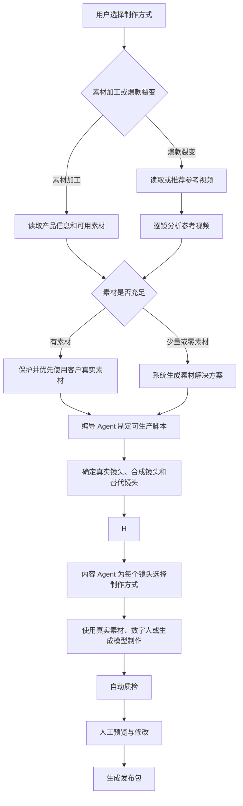

# PRD：灵枢 AI 经营工作台 v3.1

> 文档主题：社媒视频生成逻辑重构
>
> 更新日期：2026-09-22
>
> 代码参考基线：`6c8f97b7ce92b650d0bebf0e98bb33b8f1e317b2`，同时参考当前工作区尚未提交的改动
>
> 文档性质：目标产品需求。文中既包含可复用的现有能力，也包含本次需要改造的新逻辑。
>
> 核心原则：参考爆款视频时，要做到“结构高还原、内容真实替换、表达有原创差异”，而不是逐像素复制，也不是规避平台规则。

本文只分三个板块：第一部分重点说明社媒内容如何生成；第二部分说明其他业务模块；第三部分简要说明技术和通用要求。

## 第一部分：社媒内容生成

### 1. 产品目标

社媒内容生成不再从“套用爆款公式”出发，也不能假设用户已经有专业素材。系统从两类真实任务出发：

1. 用户想围绕自己的产品生成视频；有素材就加工，没有素材就由系统从零建立可用素材。
2. 用户想复刻一条爆款视频；有参考视频可以直接添加，没有参考视频也可以让系统从灵感库推荐。

产品面向完全不懂拍摄、剪辑和 AI 的老板。用户不需要会写脚本、选模型、找演员或拍素材，只需要确认“卖什么、卖给谁、哪些事实是真的”。其余制作工作默认由系统完成。

本次改造重点解决五件事：

- 让编导 Agent 对参考视频的分析结果和最终脚本负责。
- 把视频拆到镜头级，准确识别工厂实拍、人物口播、产品展示、使用效果和复合场景。
- 把前三秒黄金钩子作为独立的必审内容，不再只写一句笼统总结。
- 让内容 Agent 根据每个镜头的需要选择合适的 AI、数字人和素材库。
- 让没有摄影人员、没有拍摄能力、甚至没有现成图片和视频的用户也能完成一条高质量视频。
- 高度还原爆款视频的有效结构，同时保护客户真实素材，并保持足够的原创差异和平台合规性。

### 2. 内容制作只保留两个入口

| 入口 | 是否要求用户已有素材 | 系统主要工作 | 最终结果 |
| --- | --- | --- | --- |
| 素材加工 | 不要求。可以有素材、少量素材或完全没有素材 | 有素材时深加工；没有素材时，从产品资料出发，使用商品页图片、数字人、合规素材库、生成画面和图文动画完成视频 | 一条或一组可发布成片 |
| 爆款裂变 | 不要求客户有拍摄素材；参考视频也可以由系统推荐 | 逐镜分析参考视频，先判断每个镜头能否在零素材条件下完成，再用客户可提供的最低限度产品信息和系统素材能力完成新视频 | 与参考视频结构高度相似、但内容和表达有合理差异的成片 |

“没有素材”不能成为任务中断理由。系统必须先给出可以直接生成的方案，再把补充真实素材作为提高真实性和效果的可选项。

“每周生成”和“立即生成”继续存在，但它们只代表执行频率，不再作为内容制作类型：

- 立即生成：现在创建并执行一次任务。
- 每周生成：保存已确认的制作方案，按计划重复执行。

### 3. 删除“爆款公式”

“爆款公式”不再是产品能力，也不再是视频生成的中间步骤。

需要删除的内容包括：

- 爆款公式页面、导航入口和相关操作按钮。
- 公式提取、公式选择、公式套用和公式版本管理。
- 新任务中对公式 ID、公式名称或公式模板的读写。
- 前端向用户展示的“先总结公式，再按公式生成”流程。
- Agent 提示词中要求输出固定爆款公式的内容。

替代方案是：每一条参考视频都单独分析，产出这条视频自己的结构、镜头、节奏、钩子和复刻脚本。分析结果只服务于这次任务，不沉淀成一套生硬的通用公式。

### 4. 社媒视频生成的总体工作逻辑



不论用户从哪个入口开始，系统都必须遵守下面的顺序：

1. 先看清用户提供了什么；没有素材时，系统主动建立素材方案，不能把问题退回给用户。
2. 先完成脚本和镜头计划，再选择模型和制作工具。
3. 每个镜头都要知道“参考什么、用什么素材、怎么制作”。
4. 素材不足时，优先自动改写成可以通过数字人、商品图、合规素材库、生成画面或图文动画完成的镜头。
5. 只有真实效果、真实工厂、真实案例等不可替代的证明型内容，才需要用户补充事实依据；用户无法提供时，系统必须换一种脚本表达，不能伪造。
6. 自动质检通过后，再交给用户预览和确认。
7. 用户确认后才生成发布包，后续发布仍按账号权限和审批规则执行。

### 5. 零素材启动：用户没有素材时怎么办

#### 5.1 零素材的定义

以下情况都按零素材或弱素材处理：

- 用户没有自己拍摄的视频。
- 用户只有一张产品图片、一个商品链接或一份产品介绍。
- 用户没有可以出镜的人。
- 用户没有工厂、使用场景和客户案例画面。
- 用户不会写口播、不会拍摄，也不知道需要准备什么。

零素材不是新增的第三个内容入口，而是两个内容入口都支持的一种启动状态。

#### 5.2 用户最低输入

系统尽量从企业知识库、商品页或历史资料中自动读取信息。确实没有资料时，用户只需要完成一次简短确认：

1. 卖什么：产品名称或商品链接。
2. 卖给谁：目标客户或目标国家。
3. 最想表达什么：卖点、用途或促销目标。
4. 哪些事实可以公开：参数、价格、效果、认证和服务范围。
5. 希望什么语言和平台；不确定时由系统推荐。

用户可以直接粘贴电商商品页、官网页面或产品目录链接。系统负责提取产品图片、标题、卖点和参数，但使用前必须让用户一次性确认。

如果用户连一张产品图或商品链接都没有，系统仍可生成行业知识、痛点教育、采购指南或品牌介绍类视频；但不能把 AI 虚构的外观、工厂或效果描述成该客户的真实产品。

#### 5.3 系统补齐素材的优先顺序

内容 Agent 按下面的顺序补齐，不把复杂选择交给用户：

1. 企业知识库和历史任务中已经确认的品牌、产品与素材。
2. 用户提供或授权读取的官网、电商商品页、产品目录和云端文件。
3. 由真实产品图片生成的产品动效、背景替换、镜头运动和图文包装。
4. 已授权数字人、AI 配音和口型驱动，用于承担人物口播。
5. 有明确商用权限的素材库，用于场景、环境、转场和气氛画面。
6. 视频或图片生成模型，用于不承担真实性证明的辅助画面。
7. 动态字幕、数据卡片、示意动画、图标和品牌视觉，用于替代无法获得的实拍镜头。

使用外部页面、素材库或生成内容时，系统必须记录来源、授权范围和生成标识。

#### 5.4 三种自动生产路线

系统根据可用资料自动选择路线，用户不需要理解路线差异：

| 路线 | 适用情况 | 主要组成 |
| --- | --- | --- |
| 真实素材增强 | 用户有可用图片或视频 | 真实素材为主，配合剪辑、字幕、配音和局部特效 |
| 产品锚定生成 | 用户只有商品图、商品页或产品目录 | 真实产品图保持一致，配合产品动效、数字人、素材库和生成场景 |
| 完全零素材生成 | 用户只有产品事实，没有任何可用画面 | 数字人或配音、合规素材库、示意动画、动态图文和非证明性生成画面 |

系统优先保证“这条视频能被生产”，再追求对参考视频画面的逐项复刻。参考视频中的某个镜头如果依赖真实工厂、真人试用或客户案例，而用户没有对应素材，编导 Agent 要保留这个镜头的功能和节奏，自动换成可以真实表达的镜头，不能让任务卡住。

例如：

- 参考视频用工厂流水线建立信任，但用户没有工厂视频：可改为产品细节、参数卡片、交付流程动画和数字人口播组合；不能生成一个虚构工厂并说是客户工厂。
- 参考视频由真人拿产品口播，但用户没人出镜：可使用授权数字人、产品图和配音完成同样的节奏。
- 参考视频展示产品使用效果，但用户没有效果素材：改为“使用步骤、适用场景或功能说明”，不能生成虚假使用结果。

#### 5.5 拍摄是可选增强，不是默认要求

系统可以给愿意补充素材的用户提供极简拍摄助手：只要求用手机完成少量镜头，并提供构图框、动作示范、倒计时、提词和自动质量检查。

但用户选择“无法拍摄”后，系统必须立刻切换到无拍摄方案，不再反复要求补拍。只有用户坚持表达真实工厂、真实案例或真实效果，而系统又没有证据时，才提示该内容无法真实生成，并提供可以替代的脚本。

#### 5.6 零素材质量要求

零素材不等于低质量模板。成片仍要满足：

- 前三秒有清楚的视觉主体和钩子。
- 同一条视频中的产品、数字人、色彩和画面风格保持一致。
- 口播、字幕、镜头切换和音乐节拍对齐。
- 不连续堆放无关素材库画面。
- 生成画面不承担未经证实的产品效果证明。
- 用户能够一键换风格、换数字人、换声音或重做单个镜头。

#### 5.7 小白用户的操作上限

默认流程中，用户最多只处理三次确认：

1. 确认系统读到的产品、客户和卖点是否正确。
2. 在主钩子和备选钩子中选择一个；不选择时采用系统推荐。
3. 预览成片并选择“满意”或指出需要修改的镜头。

系统不能要求普通用户选择模型、写提示词、理解镜头参数、寻找素材库或决定数字人技术方案。所有技术选择都由内容 Agent 完成，高级设置只对主动打开的用户显示。

### 6. “素材加工”的系统逻辑

#### 6.1 用户输入

用户可以提供以下任意内容，但不设“必须上传素材”的门槛：

- 原始视频片段。
- 产品图片或产品视频。
- 人物口播素材。
- 工厂、生产线、仓库或门店素材。
- 已经制作好的半成品视频。
- 商品链接、官网页面或产品目录。
- 只有产品名称和经过确认的基础信息。

用户可以补充：发布平台、语言、视频时长、目标人群、口播文案、品牌要求和禁用内容。

没有图片或视频时，系统按“零素材启动”建立可生产方案。

#### 6.2 系统分析

系统先识别产品资料和所有可用素材；完全没有素材时，直接分析可以从哪些来源自动建立画面：

- 素材里是谁、是什么产品、在什么场景。
- 画面是否清晰，声音是否可用，横竖屏比例是否合适。
- 哪些画面适合当开头、主体、证明、转场和结尾。
- 哪些内容属于客户真实事实，不能被 AI 改写。
- 哪些镜头可以直接制作，哪些需要系统自动生成替代素材。

#### 6.3 编导 Agent 的加工脚本

素材加工场景中，编导 Agent 不需要分析爆款视频，但仍要给出可执行脚本：

- 前三秒展示什么，第一句话说什么。
- 素材按什么顺序出现。
- 哪些位置增加口播、字幕、贴纸、音效或局部特效。
- 哪些原始画面必须保留，哪些可以裁切或调色。
- 成片多长、节奏多快、结尾如何引导行动。

#### 6.4 内容 Agent 的执行

内容 Agent 根据脚本完成：

- 剪辑和镜头拼接。
- 口播配音、数字人口播或原声清理。
- 商品图动效、合规素材库匹配、辅助画面生成和动态图文制作。
- 字幕生成、翻译和样式包装。
- 背景音乐、音效和节奏对齐。
- 局部画面增强、特效和封面制作。
- 平台尺寸适配和多版本输出。

### 7. “爆款裂变”的系统逻辑

#### 7.1 输入要求

用户至少需要确认产品和目标。参考视频、拍摄素材都可以由系统协助补齐：

- 参考视频：用户可以粘贴链接、上传文件，也可以按行业和目标让系统从灵感库推荐。
- 产品信息：优先读取知识库、商品页或产品目录，没有时用简短问答完成。
- 客户素材：有则优先使用，没有则进入零素材生产路线。
- 来源说明：系统保存参考视频来源，并提示相关权利边界。

系统必须提示：分析参考视频不代表自动获得参考视频中的音乐、人物、商标、画面或其他内容的使用权。

#### 7.2 不再总结公式，而是做逐镜分析

系统要把参考视频拆成镜头，并同时分析画面、声音、字幕和节奏。每个镜头允许有多个标签，不能强行归为一种场景。

建议的标签维度如下：

| 标签维度 | 示例 |
| --- | --- |
| 场景类型 | 工厂实拍、人物口播、产品展示、使用演示、客户案例、包装发货、复合场景 |
| 画面主体 | 人物、产品、机器、原料、成品、环境、屏幕信息 |
| 人与产品关系 | 手持、试用、安装、讲解、对比、引导观看、现场操作 |
| 镜头语言 | 特写、中景、全景、跟拍、俯拍、推拉、快速切换、定机位 |
| 内容作用 | 钩子、提出问题、展示卖点、证明效果、建立信任、处理疑虑、行动引导 |
| 声音类型 | 真人原声、后期配音、数字人口播、背景音乐、环境声、音效 |
| 屏幕信息 | 主字幕、重点词、数据、标签、品牌信息、行动按钮 |
| 真实性要求 | 必须用客户真实素材、可以使用合成内容、必须人工确认 |
| 建议制作方式 | 原片剪辑、商品图动效、数字人、文生视频、图生视频、素材库、图文动画、可选补拍 |

例如，“人物在工厂里拿着产品讲解生产过程”不能只标成“工厂实拍”。它至少包含：人物口播、工厂场景、产品展示、现场引导、真实素材锁定等多个标签。

#### 7.3 先分析视频结构，再重写客户版本

编导 Agent 要先回答四个问题：

1. 原视频每个镜头为什么放在这里？
2. 这个镜头怎样推动用户继续看？
3. 客户素材或系统可生成的哪种画面可以承担同样作用？
4. 如果没有真实素材，怎样保留镜头功能，同时改成可生成且不造假的表达？
5. 哪些内容需要保留结构，哪些表达必须改变？

分析完成后，再生成客户版本的脚本。新脚本应尽量还原以下内容：

- 前三秒的吸引机制。
- 内容展开顺序。
- 每个镜头在整条视频中的作用。
- 镜头时长、整体节奏和关键转场位置。
- 口播、字幕、画面和音效之间的配合。
- 从开头到结尾的情绪和行动引导。

但不能直接照搬：

- 原视频的完整台词和字幕。
- 原视频文件、人物形象、品牌、商标、水印和未授权音乐。
- 可以识别为同一素材的画面、构图、动作和装饰组合。
- 与客户真实产品、场景或效果不符的内容。

### 8. 前三秒黄金钩子

前三秒不是脚本中的普通一行，而是爆款裂变任务的独立交付项和审核项。

编导 Agent 必须输出：

- 第一帧出现什么主体。
- 第一秒发生什么变化或动作。
- 第一条口播或字幕是什么。
- 钩子类型，例如结果先行、强烈反差、问题刺激、身份命中、使用效果或现场证明。
- 画面、口播、字幕、音乐和音效如何同时配合。
- 客户现有素材怎样实现这个钩子。
- 客户没有素材时，系统用什么方案直接实现这个钩子。
- 哪些地方参考原视频，哪些地方必须换成新的表达。
- 是否涉及只有真实素材才能证明的内容；如果涉及，如何自动改成不依赖实拍的钩子。

每个爆款裂变任务默认提供：

- 1 个主钩子：最接近参考视频有效机制的版本。
- 2 个备选钩子：保持同一卖点，但采用不同开场表达，方便后续测试。

前三秒没有确认，编导脚本不能进入正式制作。

### 9. 编导 Agent 的职责

#### 9.1 核心职责

编导 Agent 对“分析是否可靠、脚本是否可生产、零基础用户能否直接得到成片”负责。它的工作不再是总结几句抽象规律，也不能把素材难题直接退回用户，而是把参考视频翻译成一份系统能够直接执行的制作说明。

编导 Agent 必须产出三个核心对象：

1. `ReferenceVideoAnalysis`：参考视频逐镜分析。
2. `ReplicationScriptVersion`：客户版本的复刻脚本。
3. `ShotMaterialMap`：每个镜头与客户素材、系统生成素材、替代方案和制作方式的对应关系。
4. `AssetSupplyPlan`：当客户素材不足时，系统怎样从知识库、商品页、数字人、素材库、生成模型和图文动画中补齐。

#### 9.2 每个镜头必须写清楚的内容

| 字段 | 说明 |
| --- | --- |
| 参考时间段 | 原视频中对应镜头的开始和结束时间 |
| 新视频时间段 | 计划在新视频中出现的时间 |
| 镜头作用 | 钩子、卖点、证明、信任、转场或行动引导 |
| 多维标签 | 场景、主体、动作、镜头语言、声音和真实性要求 |
| 画面说明 | 人物、产品、环境、构图、运镜和动作 |
| 口播与字幕 | 新版本的具体文案，不是抽象提示 |
| 声音与转场 | 音乐节拍、音效、环境声和转场方式 |
| 高度还原点 | 这个镜头需要保留的结构、节奏或作用 |
| 必须变化点 | 为保持原创差异和品牌一致性而必须调整的内容 |
| 可用素材 | 客户素材、商品页素材、授权素材库或已生成素材的 ID |
| 素材解决方案 | 直接使用、系统生成、功能等价替换或用户自愿补充 |
| 建议制作方式 | 实拍剪辑、数字人、生成模型、素材库或局部特效 |
| 风险说明 | 事实、版权、品牌、安全或效果风险 |
| 锁定区域 | AI 不允许修改的产品、人物、文字、标识或场景 |

#### 9.3 编导脚本的验收标准

一份脚本只有同时满足以下条件才算完成：

- 用户不懂拍摄和剪辑，也能直接让系统按脚本完成制作。
- 每个镜头都有系统能够执行的素材方案，不能把补拍作为默认答案。
- 零素材用户也能直接进入制作；确实需要真实证明时，脚本已经自动换成不造假的表达。
- 前三秒有具体画面、台词、字幕和节奏说明。
- 复杂场景使用多标签描述，没有被错误简化。
- 高度还原点和必须变化点都写清楚。
- 所有产品事实都有客户资料依据。
- 内容 Agent 不需要自行猜测脚本意图。

### 10. 内容 Agent 的职责

#### 10.1 核心职责

内容 Agent 对“怎么做出来”负责，不负责重新解释参考视频，也不能擅自重写已经确认的脚本。

它要针对每个镜头选择最合适的制作方式，而不是整条视频只调用一个模型。

#### 10.2 镜头制作方式选择

| 镜头情况 | 优先处理方式 |
| --- | --- |
| 客户已有真实且可用的产品或工厂画面 | 直接剪辑、裁切、调色和声音处理，不重新生成主体 |
| 客户只有一张产品图或商品页图片 | 锁定产品外观，生成景深、运镜、背景和局部动效，不重绘关键产品信息 |
| 客户没有任何产品画面 | 使用数字人、动态图文、行业场景和功能说明；不虚构具体产品外观 |
| 客户已有真实人物口播 | 保留人物身份、表情和动作，只做必要的降噪、字幕或局部修复 |
| 客户没有出镜人，但脚本需要稳定口播 | 在客户授权后使用数字人或配音方案 |
| 人物在真实工厂中引导拍摄 | 优先使用真实人物和真实工厂素材，AI 只做局部辅助 |
| 脚本需要工厂画面，但客户没有工厂素材 | 改用生产流程示意、产品细节、交付流程或通用行业画面，不能把生成工厂说成客户工厂 |
| 产品使用效果或性能证明 | 必须使用真实、可验证的客户素材，不能用生成画面伪造效果 |
| 脚本需要效果证明，但客户没有证明素材 | 自动改写成使用步骤、适用场景、原理或参数说明 |
| 转场、气氛镜头或非事实性补充画面 | 可使用已授权素材库或合适的生成模型 |
| 局部视觉特效 | 只修改指定区域，不重绘被锁定的产品、人物或文字 |
| 多语言版本 | 尽量保留原画面，重新生成配音、口型和字幕，并单独质检 |

#### 10.3 模型和工具选择依据

内容 Agent 选择工具时需要同时考虑：

- 镜头需要保持的真实信息。
- 人物、产品和场景的一致性。
- 输入素材的清晰度和长度。
- 目标语言、口型和声音要求。
- 镜头时长、比例和平台规格。
- 生成成本、速度、稳定性和失败后的备用方案。
- 客户授权范围和素材库版权范围。
- 在没有客户素材时，是否仍能保持产品、人物和视觉风格的一致性。

首选模型失败时，内容 Agent 应自动尝试备用模型或等价制作方式。只有所有安全方案都无法完成时，才把问题交给用户处理。

模型名称、内部评分、提示词和路由规则属于系统内部信息。前端只向用户解释“这一镜头将使用真实素材剪辑、数字人或生成画面”，不要求用户理解模型细节。

### 11. 客户真实素材和生成素材管理

#### 11.1 原始素材不可被覆盖

- 客户上传的原文件只读保存。
- 所有剪辑、增强和生成结果都创建新版本。
- 每个成片镜头都能追溯到原素材、生成任务或素材库来源。
- 用户可以随时查看“这个镜头用了什么”。
- 系统生成素材必须保存生成来源、关联产品事实和适用范围，不能混入客户原始素材目录。

#### 11.2 默认锁定内容

以下内容默认不能被生成模型随意改变：

- 产品外形、颜色、包装、商标和可读文字。
- 真实工厂、生产流程、设备和环境关系。
- 已确认人物的身份、脸部、服装和关键动作。
- 已确认的产品效果、参数、认证和对比结果。
- 客户明确要求保留的原声、镜头和品牌元素。

如果确实需要改变，必须让用户先确认修改范围。

#### 11.3 生成内容边界

AI 可以用于：

- 清理噪声、补字幕、做翻译、调色和合理裁切。
- 增加不改变产品事实的背景、气氛和转场。
- 在授权范围内制作数字人口播。
- 生成不承担产品证明作用的辅助画面。

AI 不可以用于：

- 伪造客户没有的工厂、认证、案例或产品能力。
- 改变产品关键外观和真实使用效果。
- 把合成内容包装成真实拍摄证据。
- 未经授权复制参考视频中的人物、声音、商标和素材。

### 12. 高度复刻和原创差异如何同时做到

系统对两个维度分别检查，不能混成一个总分。

#### 12.1 需要高度还原的内容

- 钩子的吸引机制。
- 内容结构和信息出现顺序。
- 每个镜头承担的功能。
- 镜头时长、切换频率和节奏。
- 口播、字幕、画面和音效之间的关系。
- 从开头吸引到结尾行动引导的推进方式。

#### 12.2 必须形成差异的内容

- 台词和字幕要结合客户产品重新表达。
- 人物、产品、工厂和使用场景要换成客户真实内容。
- 镜头素材、具体构图、动作、音乐、音效和装饰不能整体照搬。
- 字幕样式、配色、转场和品牌露出要符合客户自己的品牌。
- 行动引导要根据客户真实业务重新设计。

最终目标是：

> 结构高还原、内容真实替换、表达有原创差异。

这套机制用于降低机械重复和平台同质化风险，同时满足版权、事实和平台内容规则。系统不承诺规避检测，也不提供绕过平台规则的能力。

### 13. 自动质检和人工验收

| 检查项 | 系统要确认什么 | 未通过时怎么处理 |
| --- | --- | --- |
| 分析完整性 | 参考视频是否完成逐镜、声音、字幕和节奏分析 | 返回编导 Agent 补充分析 |
| 脚本可执行性 | 每个镜头是否有明确画面、文案、素材和制作方式 | 不允许进入制作 |
| 结构还原度 | 钩子、顺序、镜头作用和节奏是否符合已确认方案 | 重新剪辑或生成对应镜头 |
| 原创差异度 | 文案、素材、人物、声音和视觉表达是否有足够差异 | 调整差异不足的镜头 |
| 事实准确性 | 产品参数、效果、案例和认证是否有依据 | 阻止交付并要求确认 |
| 素材完整性 | 产品、人物、工厂和文字是否被错误改变 | 使用原素材重做对应区域 |
| 零素材可生产性 | 每个镜头是否都有系统可直接执行的素材方案 | 自动切换素材来源或改写镜头表达，不能默认要求用户拍摄 |
| 生成一致性 | 产品外观、数字人、画风和品牌视觉是否前后一致 | 锁定参考资产并重做不一致镜头 |
| 权利与来源 | 参考视频、音乐、素材库和人物授权是否清楚 | 标记风险，缺少必要授权时阻止发布 |
| 技术质量 | 清晰度、字幕、安全区、音量、口型和画面比例是否合格 | 自动修复或返回制作 |
| 平台适配 | 时长、比例、封面和敏感内容是否符合目标平台要求 | 生成对应平台版本 |

前端要分别显示“结构还原度”和“原创差异度”，避免用户误以为越像越好，或越不同越好。

### 14. 任务状态和版本管理

社媒内容任务统一使用以下状态：

1. 草稿：用户还在补充信息。
2. 分析中：系统正在分析素材或参考视频。
3. 方案待确认：编导脚本和前三秒钩子等待用户确认。
4. 待确认事实或授权：缺少不能由系统替代的产品事实、真实性证明或授权信息。
5. 制作中：内容 Agent 正在执行镜头制作。
6. 自动质检：系统检查还原度、差异度、事实和技术质量。
7. 成片待确认：用户预览、评论和提出修改。
8. 修改中：按确认意见生成新版本。
9. 打包中：生成各平台发布文件和说明。
10. 已交付：成片和发布包已完成。
11. 需处理：任务失败、授权失效或存在阻断风险。

版本规则：

- 参考视频分析、编导脚本、素材映射和成片都要独立版本化。
- 用户确认脚本后，内容 Agent 只能执行该版本。
- 修改脚本会生成新版本，不能覆盖已确认版本。
- 每次返工要记录修改原因和受影响镜头。

### 15. 前端交互设计

#### 15.1 一级模块保持不变

- 智能经营：继续使用数字员工工作流，让用户看清不同 Agent 如何接力完成经营任务。
- 内容制作：收束成“素材加工”和“爆款裂变”两个入口。
- 其他模块按第二部分说明保留。

#### 15.2 内容制作首页

内容制作首页不再展示五种制作主题，也不再让用户先选“做脚本、做数字人或套公式”。首屏只展示两个大卡片：

```text
┌──────────────────────────┐  ┌──────────────────────────┐
│ 素材加工                 │  │ 爆款裂变                 │
│ 有无素材都能生成成片     │  │ 参照爆款直接生成新版本   │
│ [开始制作]               │  │ [开始裂变]               │
└──────────────────────────┘  └──────────────────────────┘

最近任务｜待我确认｜制作中｜已交付
```

进入任一入口后，系统用一个简单问题识别起点：“你现在有什么？”选项为“有图片或视频”“只有商品链接或一张图”“什么素材都没有”。选择不会限制功能，只用于系统自动决定素材生产路线。

默认开启“一键托管模式”：系统自动选择参考视频、脚本、数字人、声音、素材来源、模型和剪辑方案。小白用户只需要确认产品事实、前三秒方案和最终成片。需要精细控制的用户可以切换到高级模式逐镜修改，但高级设置不是完成任务的前提。

#### 15.3 素材加工页面

页面按四步完成：

1. 告诉系统要推广什么：可以上传素材、粘贴商品链接，或只填写产品名称和卖点。
2. 选择目标：整条成片、口播、字幕、多语言、特效或封面；完全不懂时直接选择“一键生成成片”。
3. 确认制作方案：系统已经补齐数字人、配音、素材库、生成画面和动态图文方案，用户只确认事实、风格和前三秒。
4. 预览成片：查看版本对比，对具体镜头提出修改。

用户可以用简单语言描述要求，例如：“我没有素材，帮我做一条面向美国采购商的英文产品介绍视频。”系统负责补齐脚本、声音、人物、画面、字幕和剪辑，不让用户选择技术模型。

#### 15.4 爆款裂变页面

页面按五步完成：

1. 选择参考视频：粘贴链接、上传文件，或者让系统按产品和平台推荐。
2. 查看精准分析：按时间轴查看场景、人物、产品、声音、字幕和镜头作用。
3. 确认复刻脚本：先确认前三秒，再确认完整脚本和必须变化点。
4. 查看素材方案：系统优先匹配已有素材；没有素材时，自动分配数字人、商品图动效、素材库、生成画面或功能等价镜头。
5. 生成并对比：左侧播放参考视频，右侧播放新版本，按镜头对比结构和差异。

#### 15.5 前三秒固定在脚本顶部

脚本确认页顶部固定展示：

- 参考视频前三秒。
- 主钩子和两个备选钩子。
- 第一帧、第一句话、字幕、声音和动作说明。
- 系统将使用的真实素材或生成方案。
- 没有素材时的直接替代方案，以及可选的素材增强建议。
- “确认这个开头”按钮。

只有确认开头后，用户才继续审核完整脚本。

#### 15.6 逐镜对照视图

爆款裂变的核心界面不是公式卡片，而是逐镜对照表：

| 参考镜头 | 镜头作用 | 客户版本 | 使用素材 | 制作方式 | 高度还原点 | 必须变化点 | 状态 |
| --- | --- | --- | --- | --- | --- | --- | --- |
| 00:00-00:02 | 结果钩子 | 展示客户产品使用后的真实结果 | 素材 A12 | 原片剪辑 | 结果先行、快速特写 | 换成客户产品和新字幕 | 已匹配 |
| 00:02-00:05 | 身份说明 | 数字人说明产品适用场景 | 系统数字人 D03 | 数字人口播＋商品图 | 人物快速建立信任 | 更换人物、台词和场景 | 可直接生成 |

用户点击任意一行，可以预览对应镜头、替换素材或只重做这一镜头。

#### 15.7 成片反馈方式

用户反馈不只提供一个自由输入框，还要支持快速选择：

- 和参考视频不够像。
- 太像参考视频，需要增加差异。
- 产品或品牌被改错。
- 人物或口型不自然。
- 字幕、配音或翻译有问题。
- 节奏太快或太慢。
- 这个镜头需要换素材。
- 只修改我圈选的区域。

每条意见都绑定成片版本和具体镜头，避免整条视频重复返工。

#### 15.8 前端展示原则

前端主要告诉用户：

- 系统正在做什么。
- 为什么这样安排。
- 需要用户提供什么。
- 哪些内容会保持不变。
- 哪些地方参考了原视频，哪些地方做了差异化。
- 当前需要用户确认什么。

前端不重点展示：

- 内部模型名称和提示词。
- 任务哈希和内部队列信息。
- 抽象的爆款公式。
- “绕过检测”或类似不合规表述。

## 第二部分：社媒内容生成之外的其他板块

### 1. 智能经营

智能经营继续保留数字员工工作流。用户看到的重点是“谁正在处理、处理到哪一步、下一步需要什么”，而不是底层模型调用。

现有固定流程继续保留：

1. 收集企业资料。
2. 建立品牌和产品知识。
3. 研究市场与竞品。
4. 生成内容计划。
5. 制作内容。
6. 审核并准备发布。
7. 承接客户咨询。
8. 生成报价和跟进动作。
9. 记录订单和经营结果。
10. 根据结果复盘下一轮任务。

其中“生成内容计划”和“制作内容”需要直接进入新的两个内容制作入口，不再进入爆款公式流程。

### 2. 灵感中心和素材库

灵感中心负责收集值得参考的内容，并保存来源、平台、链接、作者、采集时间和使用备注。

- 只有能访问完整视频的内容，才能进入爆款裂变分析。
- 截图或片段可以作为灵感，但不能代替完整视频分析。
- 参考视频和客户真实素材必须分开管理。
- 客户素材增加场景、人物、产品、镜头作用、真实性和授权范围等标签，方便自动匹配。

### 3. 发布与数据回收

系统可以准备发布包、发布说明和平台版本，但“生成完成”不等于“发布成功”。

只有拿到平台返回的内容 ID、链接、发布时间或失败原因后，才能更新发布状态。没有真实回执时，只能标记为“待发布”或“状态未知”。

发布后的播放、互动、线索和转化数据要回到对应内容任务，供用户判断哪种钩子和脚本真正有效。

### 4. 客户、企微、报价和订单

- 客户模块保存客户资料、沟通记录、标签、负责人和下一步动作。
- 企微或其他消息渠道只有拿到真实发送回执后，才能标记发送成功。
- 报价必须基于已确认的产品、价格、币种、税费、交付和有效期。
- 订单状态必须来自正式业务记录，不能根据聊天内容自动猜测成交。

### 5. 广告与增长

内容可以被选为广告素材，但投放预算、受众、时间和目标必须由有权限的用户确认。系统可以提供建议，不能未经确认自动花费预算。

### 6. 知识、记忆、排期和权限

- 企业事实、产品资料和品牌规则统一保存，供各 Agent 读取。
- 用户意见和已确认方案形成版本记录，不直接覆盖历史内容。
- 排期负责定时启动任务，不代表任务一定成功完成。
- 所有对外发布、消息发送、报价和广告动作都按角色与能力授权。

## 第三部分：技术栈与通用要求

### 1. 技术栈简述

- 前端：React、TypeScript、Vite、Tailwind CSS。
- 服务端：Node.js、Express、TypeScript 和异步 Worker。
- 数据与文件：PocketBase 或同类业务数据服务，配合对象存储保存视频和图片。
- 媒体处理：FFmpeg、Sharp，以及视觉识别、语音、数字人和视频生成服务。
- 外部连接：通过正式 API 接入社媒平台、企微、广告和其他业务系统。

具体选择哪一家模型服务由系统路由决定，PRD 不绑定单一供应商。

### 2. 核心数据对象

| 对象 | 作用 |
| --- | --- |
| `ContentTask` | 一次素材加工或爆款裂变任务 |
| `SourceAsset` | 客户原始素材、参考视频、商品页素材或已授权素材 |
| `ReferenceVideoAnalysis` | 参考视频的逐镜分析结果 |
| `ReplicationScriptVersion` | 编导 Agent 生成并由用户确认的复刻脚本版本 |
| `ShotMaterialMap` | 镜头与真实素材、系统生成素材、替代镜头和制作方式的映射 |
| `AssetSupplyPlan` | 零素材或弱素材情况下的素材来源、生成方式、权利信息和备用方案 |
| `DirectorPlanVersion` | 素材加工场景下的编导方案版本 |
| `ContentExecution` | 内容 Agent 每个镜头的执行记录、模型选择和结果 |
| `ArtifactVersion` | 脚本、配音、字幕、镜头、封面和成片的版本 |
| `PublicationPackage` | 面向具体平台的成片、封面、文案和发布说明 |
| `PublicationEvidence` | 平台返回的发布结果和凭证 |

新数据模型中不再设置 `ContentFormula` 或其他爆款公式对象。

### 3. 安全与真实性要求

- 所有业务数据按租户隔离。
- 所有敏感操作按角色和能力授权。
- 长任务支持幂等、重试、断点恢复和失败记录。
- 原始素材只读，所有生成结果使用新版本。
- 对外发布、发送消息和商业承诺必须保存真实回执。
- 产品参数、认证、案例和效果只能来自已确认资料。
- 分析参考视频不代表获得复制、改编或发布其中受保护内容的权利。

### 4. 非功能要求

- 单个镜头失败时可以只重做该镜头，不必整条视频重做。
- 主模型不可用时可以切换备用模型，但不能擅自改变已确认脚本。
- 生成任务要显示进度、预计阶段、失败原因和可执行的恢复动作。
- 每次模型调用记录输入版本、输出版本、成本、耗时和错误信息。
- 支持多任务排队和租户级并发限制。
- 前端清楚区分真实素材、生成素材和素材库内容。
- 主要审核和确认操作支持桌面端与移动端。
- 零素材任务和有素材任务使用相同的质量门槛，不能降级成简单模板拼接。

### 5. 当前能力与本次改造范围

现有代码中可以继续复用的能力：

- 统一内容任务，以及立即执行和每周执行两种频率。
- 编导方案、版本确认、锁定交接和退回修改。
- 客户素材真实性约束。
- 口播、字幕、背景音乐、剪辑、封面和自动质检能力。
- 成片确认、返工、发布包和平台回执。
- 长任务、幂等、租户隔离和权限基础能力。

本次需要重点改造：

1. 内容制作首页收束成“素材加工”和“爆款裂变”。
2. 删除爆款公式的页面、对象和生成链路。
3. 爆款裂变必须先完成参考视频逐镜分析。
4. 前三秒钩子成为独立脚本对象，并提供一个主方案和两个备选方案。
5. 编导脚本增加多标签、镜头作用、高度还原点和必须变化点。
6. 增加镜头与真实素材、系统生成素材和功能等价镜头的映射。
7. 内容 Agent 改为按镜头选择模型、数字人、素材库或真实素材处理方式。
8. 原始素材和加工结果分开保存，增加不可修改区域。
9. 自动质检分别检查结构还原度和原创差异度。
10. 前端增加参考视频与新视频的逐镜对照视图。
11. 增加零素材启动、商品页资料提取和 `AssetSupplyPlan`。
12. 增加一键托管模式，以及数字人、配音、素材库、生成画面和图文动画的自动路由。

### 6. 验收标准

#### 6.1 素材加工

- 用户只通过“素材加工”入口即可完成资料输入、脚本确认、制作、预览和交付。
- 用户没有图片、视频和出镜人员时，也能直接生成一条完整视频。
- 小白用户只提供产品事实和目标，不选择模型、不写提示词，也能完成任务。
- 系统能识别并保护客户真实产品、人物和工厂素材。
- 用户能只修改一个镜头或一个局部区域。

#### 6.2 爆款裂变

- 用户添加参考视频后，可以看到逐镜分析，而不是爆款公式。
- 复杂镜头可以同时拥有多个标签。
- 编导 Agent 输出可直接执行的脚本和素材映射。
- 前三秒有主钩子和两个备选钩子，并需要单独确认。
- 新成片能分别查看结构还原度和原创差异度。
- 用户能逐镜对比参考视频和新视频。
- 用户没有参考视频时，系统可以从灵感库推荐；用户没有客户素材时，系统可以直接给出可生产方案。
- 参考视频包含无法真实复刻的工厂、人物或效果镜头时，系统能自动生成同功能替代镜头，并保持整体结构和节奏。

#### 6.3 Agent 分工

- 编导 Agent 对分析和脚本负责。
- 内容 Agent 按已确认脚本选择制作方式并执行。
- 内容 Agent 不能擅自改变产品事实、锁定素材或脚本意图。
- 素材不足时，系统优先自动补齐或改写为功能等价镜头，不能把拍摄任务默认推给用户。
- 用户明确选择“无法拍摄”后，整个任务仍能继续制作并完成交付。
- 默认一键托管流程中，用户只需确认产品事实、开头方案和最终成片。

#### 6.4 爆款公式清理

- 新页面中没有爆款公式入口。
- 新任务不再创建、读取或套用爆款公式。
- Agent 不再输出抽象的公式总结。
- 历史公式数据如需保留，只能作为只读历史记录，不能继续进入新生成链路。
