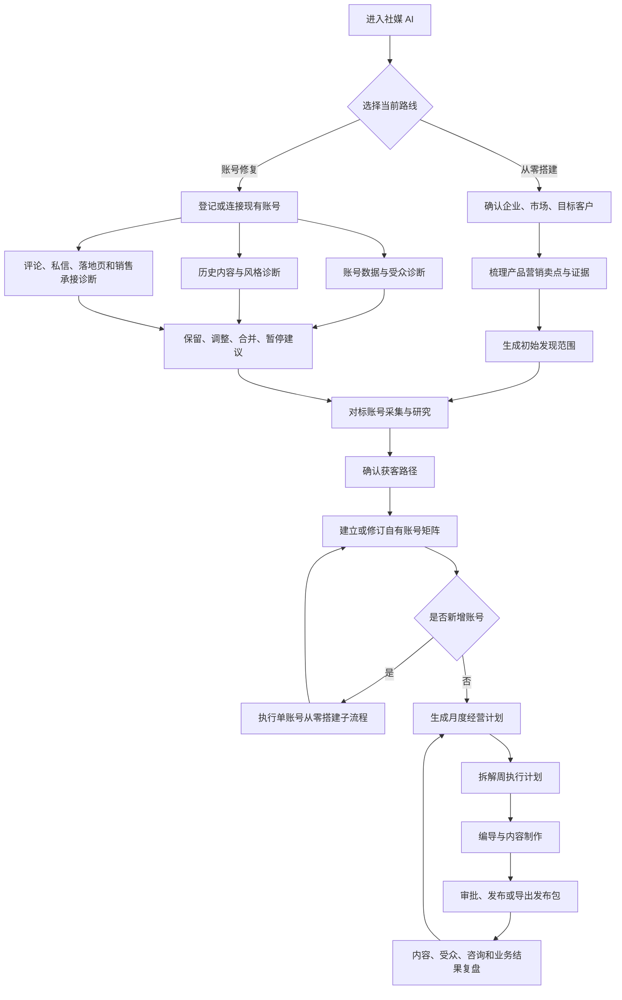

# 灵枢社媒 AI 矩阵搭建与经营工作流改造方案 V1

> 文档状态：产品与技术方案草案
> 适用范围：社媒矩阵从零搭建、已有账号修复，以及二者进入稳定执行后的月计划、周计划、内容制作、发布协同和复盘
> 产品边界：灵枢不提供代运营；灵枢负责诊断、规划、内容生产支持、执行协同和数据复盘，客户对账号经营、内容审批、发布授权和客户承接负责
> 当前实现参考：[`shared/contracts/socialContentWorkflow.ts`](../../shared/contracts/socialContentWorkflow.ts)、[`src/components/InspirationDashboard.tsx`](../../src/components/InspirationDashboard.tsx)、[`src/components/socialContent/SocialContentPlanningPage.tsx`](../../src/components/socialContent/SocialContentPlanningPage.tsx)、[`src/components/WeeklyPackagePanel.tsx`](../../src/components/WeeklyPackagePanel.tsx)、[`src/components/TrafficPage.tsx`](../../src/components/TrafficPage.tsx)、[`src/components/SocialMonitoringPage.tsx`](../../src/components/SocialMonitoringPage.tsx)

## 1. 核心结论

灵枢下一步不能继续把社媒 AI 的主入口定义为“素材加工”或“爆款裂变”。这两项只是内容制作阶段的内部执行方式，不能替代社媒获客前面的企业事实、产品营销、账号诊断、对标研究、账号定位和计划编排。

目标产品应被定义为：

> 帮助客户搭建并持续维护一套由客户团队执行的社媒获客矩阵。

所有用户都必须进入同一条经营主链：

```text
对标账号采集与研究
  → 自有账号搭建或修复
  → 月度经营计划
  → 周执行计划
  → 内容制作
  → 发布与获客承接
  → 数据复盘
  → 反哺下月、下周和账号策略
```

不同用户只在进入这条主链前的准备工作不同：

- 从零开始用户：企业信息录入 → 产品营销卖点梳理 → 对标账号采集 → 获客路径确认。
- 账号修复用户：现有账号接入 → 内容诊断、账号数据诊断、受众匹配诊断、承接链路诊断 → 历史有效主题与内容保留 → 修复方案确认。
- 修复用户若要新增账号，新账号必须进入“从零搭建账号”的子流程，但企业与产品事实可以复用，不重复录入。

## 2. 本版范围与非目标

### 2.1 本版解决的问题

1. 首次进入时识别客户是从零搭建还是修复现有账号。
2. 把企业事实和“产品应该如何宣传”分开管理。
3. 建立账号级、内容级、镜头级三层对标分析。
4. 将平台能力、B2B/B2C、账号定位和获客阶段组合成可执行获客路径。
5. 为每个自有账号建立定位、栏目、风格、证据和 CTA 规则。
6. 增加月计划，统一月计划与现有周任务包、单条内容任务的关系。
7. 让每条视频能够追溯到账号策略、周计划、对标依据和获客目标。
8. 发布后把内容数据、受众信号、咨询和后续业务动作回写到复盘。

### 2.2 明确不做

- 不代替客户持续经营账号。
- 不代替客户回复高风险评论、私信或作出价格、合同、功效、交付承诺。
- 不把“自动发布”描述成“代运营”。
- 不因为客户没有正式平台授权而伪造粉丝、内容或经营数据。
- 不用单条爆款直接决定账号定位或长期内容策略。
- 不把多个平台的同一条视频简单复制发布定义为“矩阵”。
- 不承诺固定条数、播放量、询盘量或成交结果。

## 3. 用户分路与统一状态机

### 3.1 用户分路

首次进入社媒模块时，用户只回答一个分路问题：

> 这次你是准备从零建立社媒账号，还是优化已经在运营的账号？

系统保存 `SocialProgram.route`：

- `cold_start`：从零搭建。
- `account_repair`：已有账号修复。

如果系统已经发现已连接账号或历史发布记录，应推荐 `account_repair`，但必须由用户确认，不能静默判断。

### 3.2 完整流程



### 3.3 全局阶段状态

新增根对象 `SocialProgram`，每个租户可以按品牌或业务线创建多个项目，但同一品牌同一市场默认只有一个活动项目。

建议状态：

```text
needs_route
→ needs_foundation / needs_account_import
→ diagnosing
→ needs_benchmarks
→ needs_acquisition_route
→ needs_account_playbook
→ needs_month_plan
→ ready_for_week
→ executing
→ reviewing
```

状态只表达整个社媒项目当前最重要的缺口。各 Tab 可以并行读取和编辑草稿，但必须满足以下激活门槛：

| 动作 | 必需条件 |
| --- | --- |
| 启动对标采集 | 已确认至少一个产品或业务、市场、目标受众和候选平台 |
| 激活账号矩阵 | 至少完成一轮对标账号试采；每个自有账号有定位、内容承诺和获客路径 |
| 激活月计划 | 账号矩阵有效；重点产品、目标受众和本月经营目标有效 |
| 激活周计划 | 有活动月计划；每条周内容绑定账号、内容任务、CTA 和事实来源 |
| 开始制作 | 编导方案通过事实、权利和账号风格检查 |
| 发布 | 用户审批；目标账号已连接或选择人工发布包；平台能力已在当前账号验证 |
| 完成复盘 | 标明数据来源、时间范围和缺失数据；不得把未知写成 0 |

对标采集和自有账号资料整理可以并行运行。最终获客路径在对标研究后确认；研究前只保存“候选路径”，避免先验假设锁死采集范围。

## 4. 目标信息架构

当前社媒主导航是“灵感中心—内容制作—发布与渠道—内容监控”，缺少经营准备和计划层。目标结构调整为：

| 一级 Tab | 页面 ID 建议 | 主要职责 |
| --- | --- | --- |
| 社媒工作台 | `socialWorkspace` | 显示全流程进度、唯一下一步、风险和本周期状态 |
| 搭建与诊断 | `socialSetup` | 从零基础信息、产品营销档案、已有账号诊断和获客路径 |
| 对标与灵感 | `socialInspiration` | 对标账号、代表内容、镜头分析和可迁移模式 |
| 账号矩阵 | `socialAccounts` | 管理自有账号定位、栏目、风格、获客路径和账号连接 |
| 计划任务 | `socialPlanning` | 月计划、周计划、依赖、负责人、预算和审批 |
| 内容制作 | `smartAssets` | 执行周计划内容任务、补素材、验收成片 |
| 发布与承接 | `traffic` | 发布包、排期、真实发布回执和获客入口检查 |
| 数据复盘 | `socialMonitoring` | 账号、内容、受众、获客链路和周期复盘 |

企业知识库仍是企业事实和产品事实的唯一主数据源。社媒“搭建与诊断”只显示社媒所需摘要、缺口和跳转编辑入口，不复制企业资料。

“账号矩阵”中的业务账号和“发布与渠道”中的平台授权必须分开：

- `OwnedSocialAccount`：账号在矩阵中的业务定义，即使尚未 OAuth 授权也可以存在。
- `SocialChannelConnection`：平台连接、权限、Token 和能力状态。
- 一个业务账号可以暂时没有连接；没有连接时可以规划和制作，但不能显示为已发布或已同步完整数据。

## 5. 各 Tab 改造方案

### 5.1 社媒工作台 `socialWorkspace`

#### 页面目的

用户进入社媒模块后的唯一首页。它不直接制作视频，而是告诉用户目前处于什么阶段、为什么被阻塞、下一步应该去哪一个 Tab。

#### 前端交互

页面从上到下固定为：

1. 当前项目选择器：品牌、业务线、主要市场、项目路线。
2. 全流程阶段条：搭建/诊断、对标、账号矩阵、月计划、周计划、制作、发布、复盘。
3. `NextActionPanel`：全页唯一主按钮，例如“补齐产品营销卖点”“确认三个对标账号”“审核本周计划”。
4. 本月目标与完成情况。
5. 本周任务和阻塞项。
6. 四个 Agent 当前状态。
7. 最近发布、咨询和复盘摘要。

状态卡点击后打开 `TaskDetailDrawer`，显示输入、输出、负责人、版本和失败原因，不把模型日志直接铺在首页。

#### Agent 任务

- 经营 Agent 读取整个 `SocialProgram`，计算唯一下一步和阻塞原因。
- 编导、内容、客服 Agent只上报任务状态，不直接决定全局导航。
- 经营 Agent不得绕过用户确认自动激活账号矩阵、月计划或发布授权。

#### 技术改造

- 新增聚合接口 `GET /api/overseas/social-programs/:programId/overview`。
- 服务端聚合项目、搭建状态、对标状态、活动计划、内容任务、发布和指标，前端不并发拼接十余个接口后自行推断阶段。
- 使用 `programVersion` 做乐观并发控制；关键操作携带 `expectedVersion` 和幂等键。
- 实时状态沿用现有任务刷新/SSE能力，断线时保留最后成功状态并标明更新时间。

### 5.2 搭建与诊断 `socialSetup`

该 Tab 根据 `SocialProgram.route` 展示不同步骤，但最终都输出可版本化的经营基础。

#### A. 从零搭建子页

内部分为三个步骤：

1. **企业与市场摘要**：企业类型、重点市场、语言、目标客户、主营产品。数据来自 `EnterpriseProfile`，用户在抽屉中确认或跳转企业知识库编辑。
2. **产品营销档案**：不是再抄一遍产品参数，而是把产品事实翻译成社媒可用表达。
3. **候选获客路径**：在对标前建立候选，在对标完成后回来确认正式版本。

`ProductMarketingProfile` 至少包含：

| 字段 | 说明 |
| --- | --- |
| `productRef` | 指向企业产品主数据，不复制产品对象 |
| `targetAudience` | 这次重点沟通的人群、岗位或消费场景 |
| `customerProblem` | 客户正在解决的问题 |
| `valuePropositions` | 可用于传播的价值主张 |
| `proofRefs` | 参数、测试、案例、认证、演示或客户素材证据 |
| `claimBoundaries` | 可说、需确认、禁止说的边界 |
| `contentOpportunities` | 教程、演示、对比、案例、场景等候选方向 |
| `candidateAcquisitionRoutes` | 候选 CTA 和承接入口，尚未确认前不得进入正式计划 |

前端把“事实”和“营销建议”分栏显示。AI 推断必须标为“待确认”，用户确认后才可进入对外脚本。

#### B. 已有账号修复子页

内部分为四个诊断面板：

1. **账号资产与权限**：账号归属、管理员、平台状态、连接状态、历史警告和可获取数据范围。
2. **内容诊断**：近一段有效窗口内的主题、形式、人物、证据、风格和更新稳定性。
3. **账号数据与受众诊断**：粉丝地区、语言、年龄或岗位等平台真实可得字段；无法取得时明确标记未知，不能模型补写。
4. **承接链路诊断**：主页、链接、私信、评论、表单、店铺、WhatsApp/企微、销售负责人和来源回写。

诊断结论必须落到以下动作之一：

- `keep`：保留账号和核心策略。
- `adjust`：保留账号，修订定位、栏目、风格或获客路径。
- `merge_candidate`：与其他账号高度重叠，进入合并评估。
- `pause`：暂时停止投入，保留历史数据。
- `observe`：证据不足，继续采集一个观察窗口。

历史内容逐条或批量标记：

- `retain_as_core`：作为核心栏目和风格基线。
- `retain_as_reference`：保留参考，但不直接复做。
- `rework`：保留主题，替换证据、结构或表达。
- `stop`：不再继续。

用户必须能看到每项结论的证据来源，并可修正。AI 不得直接删除账号或历史内容。

#### Agent 协作

- 经营 Agent：选择路线、检查企业基础、汇总诊断、生成修复优先级。
- 编导 Agent：产品营销表达建议、历史内容聚类、风格指纹、有效主题和内容缺口。
- 客服 Agent：检查 CTA、评论/私信/表单和销售交接；只分析承接机制，不替客户发送消息。
- 内容 Agent：只分析客户素材质量和可生产性，不参与账号去留决策。
- 平台连接 Worker：同步平台事实、账号数据和历史内容，所有字段保存来源与采集时间。

#### 技术改造

- 新增 `SocialProgram`、`ProductMarketingProfile`、`AccountAuditSnapshot`、`HistoricalContentDecision`、`ConversionRouteDraft`。
- 账号诊断采用异步 Job；不同数据源分别落地，不因某个平台字段缺失导致整个诊断失败。
- 诊断快照不可原地覆盖。新同步生成新版本，旧计划仍引用原快照。
- 接口建议：
  - `POST /api/overseas/social-programs`
  - `GET/PATCH /api/overseas/social-programs/:id/foundation`
  - `POST /api/overseas/social-programs/:id/account-audits`
  - `GET /api/overseas/social-programs/:id/account-audits/:auditId`
  - `POST /api/overseas/social-programs/:id/historical-decisions`
  - `POST /api/overseas/social-programs/:id/foundation/confirm`

### 5.3 对标与灵感 `socialInspiration`

当前 [`InspirationDashboard.tsx`](../../src/components/InspirationDashboard.tsx) 已有灵感、素材、拍摄任务和对标账号入口，但目标页面要把对标研究提升为正式流程，而不是一个弹窗。

#### 内部页签

1. **对标账号**：账号级研究和跟踪状态。
2. **代表内容**：内容级分类、相对表现和可迁移模式。
3. **镜头拆解**：时间轴语义级分析，只展示进入生产候选的内容。
4. **我的素材**：客户自己的创作素材，保持与外部参考隔离。
5. **拍摄任务**：由周计划和分镜缺口产生的客户拍摄清单。

#### 账号级前端

对标账号卡显示：

- 对标类型：业务同行、受众注意力账号、表达形式参考、渠道或专业人物。
- 定位、主要受众、内容承诺、主要栏目。
- 更新频率与稳定性，不给出“平台标准频率”。
- 代表内容和账号内相对表现。
- 人物、画面、语言、证明方式和风格指纹。
- 评论区主要问题和意向信号；不把评论数等同于询盘。
- 可观察的获客入口和 CTA。
- 当前状态：候选、试采、长期跟踪、降频观察、停止。

用户操作：试采、长期跟踪、不相关、查看依据、加入账号矩阵参考。

#### 内容级前端

每条内容不使用单一 `contentType`，而显示多维标签：

- 业务目的：拉新、教育、信任、证明、异议、咨询、购买。
- 内容主题：产品、场景、痛点、教程、案例、对比、人物、品牌。
- 叙事外壳：演示、教程、评测、前后对比、情景剧、访谈、Vlog、ASMR等。
- 钩子机制：结果前置、冲突、问题重演、反常识、身份点名、视觉异常等。
- 证明方式：效果、过程、参数、成分、专家、案例、认证、对比。
- 出镜角色和主要 CTA。
- 相对账号基线的表现，不跨平台直接比较绝对播放量。
- 复现所需人物、产品、场地、证据、成本和权利边界。

#### 镜头级前端

使用时间轴而不是普通标签列表。每个 `TimelineBeat` 显示：

- 起止时间和叙事作用；
- 主体、动作、景别、机位、运动、构图；
- 口播、字幕、环境声、音乐、音效；
- 转场和节奏；
- 承担的证据功能；
- 所需拍摄条件、制作难度和功能等价替代；
- 可借鉴点、必须替换点和禁止使用点。

外部视频默认只有分析权，没有商业素材使用权。页面必须持续显示权利边界。

#### 分层计算

继续沿用现有 L0-L4 分层，但把账号级补到最前面：

```text
A0 账号元数据与可访问性
A1 账号定位、栏目、更新和获客入口
C0 内容元数据、去重、相对账号基线
C1 内容主题与多维形式分类
C2 钩子、结构、证明和 CTA
S1 时间轴粗分段
S2 逐镜语义、动作、声音和生产约束
F  用客户真实发布结果校正模式
```

只有代表内容、用户打开的内容、计划采用的内容才升级到镜头级，避免对全部采集结果做昂贵分析。

#### Agent 与技术改造

- 编导 Agent是该 Tab 的负责人：创建发现范围、选择账号候选、分析账号/内容/镜头并生成 `InspirationHandoff`。
- 经营 Agent只提供产品、市场、受众、候选获客路径和预算边界。
- 内容 Agent只在进入生产前评估客户是否有能力实现，不决定是否长期跟踪某个账号。
- 扩展现有 `SocialAccountTrackingDecision`，新增版本化 `BenchmarkAccountSnapshot`。
- 复用 `InspirationItem` 和 `SocialReferenceVideoAnalysis`，新增内容多维分类和 `TimelineBeat`，不再创建第二套“爆款视频库”。
- 对标账号、内容和镜头保留父子链路：`benchmarkAccountId → inspirationId → analysisId → beatId`。
- 所有 AI 结论区分 `observableFacts`、`inferredIntent`、`confidence` 和 `needsReview`。

### 5.4 账号矩阵 `socialAccounts`

#### 页面目的

把“自己的账号怎么搭”变成正式产品对象。账号矩阵不是平台授权列表，也不是简单填写每周条数。

#### 前端交互

默认使用账号卡片加对比表，不使用难以编辑的关系图。每张卡显示：

- 平台、账号名称和当前状态；
- 账号角色：品牌、专家、工厂/证据、行业/场景、区域、渠道、产品/交易、创作者等；
- 唯一主要受众；
- 长期解决的问题和内容承诺；
- 固定栏目；
- 表达者；
- 证据来源；
- 风格指纹；
- 主获客路径和备用路径；
- 负责人；
- 平台连接与能力状态；
- 内容库存、回复能力和可持续性。

账号编辑器分为四步：

1. 定位：面向谁、解决什么、为什么单独存在。
2. 内容：栏目、主题组合、人物和证据。
3. 风格：固定项与实验项。
4. 获客：CTA、入口、承接人、资格字段和归因方式。

新增账号时，系统检查与现有账号在“受众、问题、表达者、证据、承接入口”五项中的差异。少于两项差异时提示把它作为现有账号栏目，不建议开新账号。

#### 从零账号子流程

无论整个客户是否属于修复路线，只要新增一个账号，该账号都执行：

```text
选择平台候选
→ 选择账号角色
→ 绑定对标账号和代表内容
→ 建立 AccountPlaybook
→ 准备至少一个周期的栏目和素材任务
→ 登记或连接真实平台账号
→ 进入月、周计划
```

平台账号的真实注册、认证、申诉仍由客户在平台完成。灵枢提供清单和状态记录，不声称代替平台流程。

#### 获客路径模型

每个账号至少有一个活动 `ConversionRoute`：

```text
平台当前可用入口
× B2B/B2C业务类型
× 账号定位
× 用户决策阶段
× 内容目的
```

字段至少包括：

- `businessModel`：`b2b`、`b2c` 或 `mixed`。
- `audienceStage`：发现、了解、比较、咨询、购买/合作、复购。
- `primaryCta` 和 `fallbackCta`。
- `entryCapability`：评论、私信、主页链接、表单、店铺、直播、预约等抽象能力。
- `verifiedAccountCapabilityRef`：当前账号实际验证的能力，不按平台名称写死。
- `destinationRef`：落地页、商品、表单、客服或联系人。
- `qualificationFields`：B2B所需公司、岗位、国家、需求、数量、时间等字段。
- `handoffOwner` 和服务时限。
- `attributionMethod`：内容 ID、UTM、表单字段、会话来源、人工登记等。

一条内容只绑定一个主要 CTA；账号可以有多条路径，但必须标明适用的决策阶段。

#### Agent 与技术改造

- 经营 Agent生成账号角色建议和矩阵冲突检查。
- 编导 Agent生成 `AccountPlaybook`：栏目、风格、表达边界和参考依据。
- 客服 Agent检查承接入口、资格字段和人工接管规则。
- 新增 `OwnedSocialAccount`、`AccountPlaybook`、`ConversionRoute`。
- 将现有 `social_accounts` 视为 `SocialChannelConnection`，通过 `connectionId` 与 `OwnedSocialAccount` 关联，不直接承载账号定位。
- `AccountPlaybook` 必须版本化。已创建内容任务继续引用创建时版本，不能被后续风格修改静默改变。

### 5.5 计划任务 `socialPlanning`

该 Tab 替代目前分散在“智能经营周任务包”和“内容制作周计划”中的双重计划入口。服务端只保留一个权威计划模型，旧 `WeeklyPackage` 和 `SocialWeeklyPlan` 通过适配器读取。

#### 月计划

月计划是经营策略，不直接生成视频。字段包括：

- 本月唯一主要经营目标；
- 重点产品、市场和受众；
- 活动账号和各账号职责；
- 每个账号的栏目组合与内容比例；
- 本月需要验证的假设；
- 对标账号持续观察任务；
- 素材采集和拍摄主题；
- 预计内容产能和发布量；
- 获客路径及其待修复项；
- 成功标准、预算和风险。

前端提供“策略视图”和“月历视图”。策略视图是权威编辑入口；月历只展示计划分布，不允许通过拖拽绕过账号、CTA和内容约束。

#### 周计划

周计划是可执行计划，由活动月计划拆解。每条 `WeeklyContentItem` 必须包含：

- 账号和 `AccountPlaybook` 版本；
- 产品、受众和本条内容任务；
- 内容主题、叙事外壳、证明方式和主要 CTA；
- 参考账号/内容/镜头的用途；
- 所需事实、证据和素材；
- 原创版本与平台适配版本数量；
- 负责人、截止时间、预算和审批点；
- 计划发布时间或发布窗口；
- 本条要验证的唯一主要变量。

周任务依赖关系：

```text
本周经营目标
→ 对标增量采集与选题
→ 编导方案
→ 素材准备
→ 内容制作
→ 成片审批
→ 发布或导出发布包
→ 数据回收
→ 周复盘
```

#### 前端交互

- 顶部切换“月计划 / 周计划 / 历史版本”。
- 默认显示 Agent 推荐草案和推荐依据，用户可逐项调整。
- 编辑时持续显示产能、预算、账号内容库存和承接能力影响。
- 激活前显示差异摘要：新增、删除、延后、账号变化、CTA变化、预算变化。
- 激活后的版本不可直接改写；修改生成新版本，并计算对已创建任务的影响。
- “即时制作”仍可存在，但必须选择一个账号和经营目的，形成轻量 `AdHocBusinessContext`；不能产生无账号归属的成片。

#### Agent 与技术改造

- 经营 Agent负责月目标、账号分配、数量、预算、优先级和成功标准。
- 编导 Agent负责内容组合、选题、参考用途和表达实验，不修改月经营目标。
- 内容 Agent只评估产能、素材和成本，不在计划层自行增加内容。
- 客服 Agent检查本周 CTA 是否有真实承接入口和负责人。
- 新增 `SocialMonthlyPlan`；升级 `SocialWeeklyPlan`，使其必须引用 `monthlyPlanId`、`programId`、`accountPlaybookVersion` 和 `conversionRouteVersion`。
- 原 `WeeklyContentPackage` 保留为执行投影，不再是第二个独立编辑源。

### 5.6 内容制作 `smartAssets`

#### 核心改动

当前 [`SocialContentLanding.tsx`](../../src/components/socialContent/SocialContentLanding.tsx) 把“素材加工”和“爆款裂变”作为第一入口。目标版本改为任务驱动：

- 从周计划进入时，直接打开对应内容任务。
- 用户不再先选择技术路线；系统根据任务、素材和参考自动选择素材加工、参考结构迁移、生成画面或功能等价替代。
- 快速制作时必须先选择账号、产品、内容目的和 CTA，然后才能进入制作。

#### 前端交互

页面内部建议分为：

1. 待制作任务。
2. 制作中。
3. 待用户验收。
4. 已完成与历史版本。

单条任务顶部持续显示“经营上下文条”：

- 所属月计划和周计划；
- 目标账号及定位；
- 本条受众和内容任务；
- 参考内容分别用于结构、证明、节奏还是 CTA；
- 账号风格固定项；
- 主要 CTA 和获客路径；
- 当前计划改变的唯一变量。

逐镜区域继续使用现有 `DirectorBrief → ContentExecutionPlan → ExecutionPlanReview`，但增加两道检查：

1. `AccountPlaybookCheck`：栏目、人物、语气、画面和 CTA 是否符合账号规则。
2. `PlanAlignmentCheck`：是否仍符合周计划的内容任务和实验变量。

用户验收时反馈分为：事实错误、风格不符、镜头问题、文案问题、CTA问题、其他。结构化反馈回写相应 Agent，不能全部作为自由文本重做整条视频。

#### Agent 与技术改造

- 编导 Agent接收 `WeeklyContentItem + AccountPlaybook + InspirationHandoff + ProductMarketingProfile`，产出 `DirectorBrief`。
- 内容 Agent按 `DirectorBrief` 检索客户素材和可用能力，产出执行计划并制作。
- 编导 Agent验收表达和账号一致性；内容 Agent负责技术质检。
- 经营 Agent只检查经营目标和预算，不修改镜头。
- 内容任务新增不可变引用：`programId`、`monthlyPlanVersion`、`weeklyPlanVersion`、`accountPlaybookVersion`、`conversionRouteVersion`、`productMarketingProfileVersion`。
- 单镜头失败只重做受影响镜头；策略变化导致的重做必须生成新 `DirectorBrief` 版本。

### 5.7 发布与承接 `traffic`

#### 页面目的

把成片变成可执行的发布包，并确认内容发布后真的能进入既定获客路径。该页面不承担账号定位设计。

#### 前端交互

内部页签：

1. 待审批。
2. 发布日历。
3. 发布结果。
4. 渠道连接。

每个待发布项显示：

- 目标账号和账号角色；
- 成片版本、平台适配版本和账号风格检查；
- 文案、封面、标签和披露；
- 主 CTA、承接入口和负责人；
- 发布方式：发布包、浏览器辅助、官方接口；
- 当前账号实际可用的平台能力；
- 审批状态和计划时间。

发布前增加“获客链路预检”：

- CTA与账号 `ConversionRoute` 一致；
- 链接、表单、商品或联系方式可用；
- 承接负责人已配置；
- B2B资格字段可记录；
- 归因参数与内容 ID 已绑定。

没有平台权限时仍可下载发布包并由客户自行发布。只有真实回执、公开链接或审核过的人工凭证存在时才标记 `published`。

#### Agent 与技术改造

- 经营 Agent负责编排排期、审批范围、发布包和回执核验。
- 客服 Agent只检查承接就绪和后续消息风险策略，不自动发送。
- 内容 Agent不再拥有发布动作。
- 复用当前 `PublicationPackage`、`PublicationEvidence` 和渠道能力矩阵。
- 发布记录必须保存 `weeklyContentItemId`、`ownedAccountId`、`conversionRouteVersion` 和 `attributionKey`。
- 当前仅保存在浏览器 `localStorage` 的关键发布队列应迁移到服务端；本地只保留非权威界面偏好。

### 5.8 数据复盘 `socialMonitoring`

当前页面主要展示平台内容指标。目标版本扩展为四层复盘：

1. **账号层**：更新稳定性、受众匹配、粉丝结构、账号健康和获客入口状态。
2. **内容层**：栏目、主题、叙事外壳、钩子、证明方式和 CTA 的相对表现。
3. **获客层**：主页动作、链接、评论、私信、表单、商品动作、合格咨询和后续业务动作。
4. **计划层**：月、周计划完成度、预算、阻塞、实验结果和下一期建议。

#### 前端交互

- 顶部固定显示时间范围、账号范围、数据来源和最近同步时间。
- 数据卡不能只给总播放；需要显示它属于触达、目标受众、下一步还是业务结果。
- 支持按账号、栏目、内容形式、产品、受众阶段、CTA和计划筛选。
- 每个结论显示依据，并区分相关性与因果性。
- 周复盘输出“继续、调整、停止、待补证据”四类建议。
- 用户确认的建议可以一键生成下周草案或下月调整项，但不能直接修改活动计划。

#### Agent 与技术改造

- 经营 Agent汇总计划完成度、账号表现、获客信号和业务反馈。
- 编导 Agent分析内容与镜头模式，但只使用账号自身历史和可比样本。
- 客服 Agent汇总评论、私信和咨询分类，区分普通互动、产品问题、购买/合作意向、高风险和垃圾。
- 内容 Agent反馈制作失败、素材不足和成本，不解释市场表现。
- 扩展 `SocialMetricSubmission` 和指标快照，增加 `AudienceSnapshot`、`AcquisitionEvent`、`ReviewDecision`。
- 任何指标保存 `source`、`capturedAt`、`coverage` 和 `definitionVersion`。

## 6. 对标三层数据模型

### 6.1 账号级 `BenchmarkAccountSnapshot`

至少包含：

- 平台账号 ID、规范化 URL、显示名称和抓取时间；
- 对标类型；
- 定位、受众、内容承诺、栏目、人物和风格；
- 更新间隔分布和稳定性；
- 内容组合及代表视频；
- 账号内表现基线；
- 评论区问题、反应和可观察意向；
- 获客入口、CTA和承接方式；
- 真实性、原创性、相关性和可迁移性判断；
- 状态、下一次复查时间和决策依据。

### 6.2 内容级 `ReferenceContentAnalysis`

至少包含：

- 来源事实和权利状态；
- 目标受众与决策阶段；
- 业务目的、主题、叙事外壳、钩子、证明方式、出镜角色和 CTA；
- 内容结构和情绪推进；
- 相对账号基线表现；
- 评论区问题与意向信号；
- 生产条件、成本、权利和事实限制；
- 可迁移机制、必须替换内容和不适用条件。

### 6.3 镜头级 `TimelineBeat`

至少包含：

- 时间范围和镜头/语义段 ID；
- 叙事作用；
- 主体、动作、起止状态和空间关系；
- 景别、角度、运动、构图和连续性；
- 口播、字幕、环境声、音乐、音效和转场；
- 证据作用和真实性要求；
- 所需素材、人物、场地和制作能力；
- 可借鉴点、必须差异化点和功能等价替代方案。

三层对象必须能够独立引用。同一个任务可以参考账号 A 的定位、内容 B 的钩子、内容 C 的证明顺序和内容 D 的镜头节奏，不能要求完整复制一条视频。

## 7. Agent 分工与协作协议

### 7.1 角色边界

| Agent | 负责 | 不负责 |
| --- | --- | --- |
| 经营 Agent | 路线、经营目标、账号矩阵、获客路径、月周计划、预算、发布协同、复盘 | 不写具体分镜，不选择模型，不替客户承诺业务结果 |
| 编导 Agent | 对标账号/内容/镜头研究、产品营销表达、账号风格、栏目、选题、导演方案和表达验收 | 不修改经营目标，不下载使用无授权参考素材，不执行发布 |
| 内容 Agent | 客户素材分析、候选素材匹配、生成/剪辑/字幕/配音/渲染、技术质检 | 不改变账号定位、内容策略、产品事实和 CTA |
| 客服 Agent | 获客承接检查、评论私信分类、资格字段、回复草稿、业务反馈回写 | 不负责流量策略，不在未授权时自动发送，不做价格和合同承诺 |

采集器、平台连接器、指标同步器、媒体处理器和调度器是 Worker 或能力，不作为会自主改变策略的 Agent。

### 7.2 搭建流程任务图

```text
经营 Agent：创建 SocialProgram 与路线
  ├─ 从零：绑定 EnterpriseProfile
  │    └─ 编导 Agent：生成 ProductMarketingProfile 草案
  └─ 修复：创建 AccountAuditRun
       ├─ 平台 Worker：同步账号、内容、受众和指标
       ├─ 编导 Agent：内容与风格诊断
       ├─ 经营 Agent：账号数据与定位诊断
       └─ 客服 Agent：承接链路诊断

经营 Agent：确认初始发现范围
  → 编导 Agent：账号级试采
  → 编导 Agent：内容级分析
  → 用户确认长期对标账号
  → 编导 Agent：按需做镜头级分析
  → 经营 Agent：确认 ConversionRoute
  → 经营 Agent + 编导 Agent：生成 AccountPlaybook
  → 用户确认账号矩阵
```

### 7.3 周执行流程任务图

```text
经营 Agent：从月计划生成周计划草案
→ 编导 Agent：补选题、参考用途和表达实验
→ 内容 Agent：检查素材、成本和可执行性
→ 客服 Agent：检查 CTA 和承接入口
→ 用户激活周计划
→ 编导 Agent：逐条生成 DirectorBrief
→ 内容 Agent：生成 ContentExecutionPlan 并制作
→ 编导 Agent：表达与账号一致性验收
→ 用户：成片审批
→ 经营 Agent：发布包、排期和回执
→ 客服 Agent：咨询分类和反馈回写
→ 经营 Agent：周复盘和下一周草案
```

### 7.4 交接约束

所有 Agent 任务使用统一信封：

```ts
interface SocialAgentTaskEnvelope {
  tenantId: string;
  programId: string;
  taskId: string;
  taskType: string;
  inputRefs: Array<{ type: string; id: string; version: string }>;
  expectedOutputType: string;
  idempotencyKey: string;
  budgetLimitCny: number | null;
  deadlineAt: string | null;
  approvalPolicy: 'none' | 'user_confirm' | 'owner_approve';
}
```

Agent 只能读取信封中的版本化引用。输出保存 `inputHash`、`outputHash`、模型/规则版本、创建时间和证据引用。上游对象变化后，服务端计算影响范围，不允许旧任务静默读取新版本。

## 8. 核心数据对象与现有对象迁移

### 8.1 新增或升级对象

| 对象 | 作用 |
| --- | --- |
| `SocialProgram` | 一个品牌/业务线的社媒矩阵根对象和阶段状态 |
| `ProductMarketingProfile` | 从产品事实派生出的社媒营销表达、证据和边界 |
| `OwnedSocialAccount` | 自有账号在矩阵中的业务定义 |
| `SocialChannelConnection` | 平台授权与能力状态，由现有 `social_accounts` 承接 |
| `AccountAuditSnapshot` | 某次账号、内容、受众和承接诊断快照 |
| `HistoricalContentDecision` | 历史内容保留、重做或停止决定 |
| `BenchmarkAccountSnapshot` | 对标账号级研究结果 |
| `ReferenceContentAnalysis` | 内容级多维分析 |
| `TimelineBeat` | 镜头/时间轴语义级分析 |
| `ConversionRoute` | 账号获客路径和真实入口 |
| `AccountPlaybook` | 账号定位、栏目、风格、证据和表达规则 |
| `SocialMonthlyPlan` | 月经营策略与实验组合 |
| `SocialWeeklyPlan` | 由月计划拆解的可执行周计划 |
| `WeeklyContentItem` | 一条计划内容的经营和表达上下文 |
| `AcquisitionEvent` | 评论、私信、表单、商品动作、咨询和后续业务动作 |
| `SocialReviewSnapshot` | 周/月复盘及用户确认的下一步决定 |

### 8.2 复用现有对象

- `EnterpriseProfile` 继续作为企业和产品事实唯一来源。
- `MarketKeywordSet`、`DiscoveryBrief`、`InspirationItem`、`InspirationHandoff` 继续承担发现和编导交接。
- `SocialReferenceVideoAnalysis` 承担镜头分析，但需要补充内容级多维分类和父账号关系。
- `DirectorBrief`、`ContentExecutionPlan`、`ExecutionPlanReview`、`ProductionResult` 继续承担制作链路。
- `PublicationPackage`、`PublicationEvidence` 和指标快照继续承担真实发布与数据证据。

### 8.3 必须消除的双重主数据

1. `WeeklyPackage` 与 `SocialWeeklyPlan` 不能继续分别编辑。目标服务以新版 `SocialWeeklyPlan` 为权威，旧任务包只是投影。
2. 企业产品卖点和社媒营销卖点不能混写。企业知识保存事实；`ProductMarketingProfile` 保存基于事实的传播选择。
3. 自有账号定位和 OAuth 连接不能混成一个对象。
4. 外部参考视频和客户可商用素材不能混在同一素材库。

## 9. 前端与服务端技术方案

### 9.1 前端

- 延续 React、TypeScript、Vite、Tailwind CSS。
- 在 [`src/pageRegistry.ts`](../../src/pageRegistry.ts) 增加 `socialWorkspace`、`socialSetup`、`socialAccounts`、`socialPlanning`。
- 在 [`src/App.tsx`](../../src/App.tsx) 按页面拆分懒加载，避免继续由 `TrafficPage` 同时承载灵感、制作、发布和账号。
- 建立共享 `SocialProgramContext`，只保存当前 `programId`、服务器版本和导航上下文；权威计划和任务不得保存在 `localStorage`。
- 复用 `StateNotice`、`NextActionPanel`、`TaskDetailDrawer`、`ApprovalCard` 等通用组件。
- 所有长任务使用创建 Job 后立即返回的模式，页面显示可恢复进度；刷新不丢任务。
- 页面 URL 保存 `programId`、`tab`、`accountId`、`planId`、`taskId` 等可分享上下文，但进入时必须重新做租户权限校验。

### 9.2 服务端

- 延续 Node.js、Express、TypeScript、PocketBase/现有 Store 抽象和异步 Worker。
- 项目与账号策略接口建议放入 `/api/overseas/social-programs`。
- 对标发现继续使用 `/api/overseas/social-discovery`，增加账号快照、内容层和镜头层端点。
- 内容生产继续使用 `/api/overseas/starter-198/social-content`，但创建任务时强制接收计划和账号上下文引用。
- 发布和指标继续使用现有 social channels、publishing、social metrics 服务。
- 所有列表使用稳定分页；分析结果按来源 ID、内容版本、分析版本和模型版本缓存。
- 长任务支持重试、预算上限、超时、租户日/月额度和失败熔断。

### 9.3 存储与版本

- 所有记录必须包含 `tenant_id`。
- 策略、诊断、计划、导演方案和发布包使用不可变版本。
- 编辑接口使用 `expectedVersion`，冲突返回 409，不做最后写入覆盖。
- 运行任务保存 `input_hash`、`output_hash`、`idempotency_key` 和 `source_refs`。
- 视频和图片继续使用对象存储；数据库只保存受控文件引用和权利证据。
- 敏感凭据继续密封保存，不进入 Agent 提示词、日志或前端响应。

### 9.4 当前代码到目标页面的改造映射

| 当前实现 | 目标处理 | 主要代码动作 |
| --- | --- | --- |
| [`src/pageRegistry.ts`](../../src/pageRegistry.ts) 只有灵感、制作、发布、监控四个社媒主页面 | 增加工作台、搭建与诊断、账号矩阵、计划任务 | 增加页面 ID、标题、权限和兼容路由；旧深链继续跳转到新页面 |
| [`src/App.tsx`](../../src/App.tsx) 复用 `TrafficPage` 承载多个社媒页面 | 每个一级 Tab 有独立页面组件 | 新建 `SocialWorkspacePage`、`SocialSetupPage`、`SocialAccountsPage`、`SocialPlanningPage`；逐步拆出 `TrafficPage` 子功能 |
| [`src/components/socialContent/SocialContentLanding.tsx`](../../src/components/socialContent/SocialContentLanding.tsx) 首先让用户选择素材加工或爆款裂变 | 内容制作改为计划任务优先 | 将原入口收进“快速制作”的高级路径；创建时强制绑定 `programId`、账号和 CTA |
| [`src/components/InspirationDashboard.tsx`](../../src/components/InspirationDashboard.tsx) 以内容卡和对标账号弹窗为主 | 对标账号、代表内容、镜头拆解成为父子页面 | 拆为 `BenchmarkAccountsPanel`、`ReferenceContentsPanel`、`ShotTimelinePanel`，素材库和拍摄任务继续复用 |
| [`src/components/CompetitorAccountsModal.tsx`](../../src/components/CompetitorAccountsModal.tsx) 只负责添加和采集账号 | 升级为账号研究详情 | Modal 只保留快速添加；正式状态、账号快照、决策依据进入对标账号页面 |
| [`src/components/WeeklyPackagePanel.tsx`](../../src/components/WeeklyPackagePanel.tsx) 与社媒 `SocialWeeklyPlan` 并存 | 统一到计划任务 Tab | 复用任务卡、矩阵编辑器和甘特图，但读写新版 `SocialMonthlyPlan/SocialWeeklyPlan`；旧接口只读适配 |
| [`src/components/socialContent/SocialContentWorkspace.tsx`](../../src/components/socialContent/SocialContentWorkspace.tsx) 同时承担任务列表、创建和结果 | 只承担计划内容执行和即时任务 | 增加计划上下文条、账号风格检查和计划对齐检查；移除无账号归属任务 |
| [`src/components/TrafficPage.tsx`](../../src/components/TrafficPage.tsx) 同时含灵感、制作、发布和账号连接 | 仅保留发布与承接 | 灵感和制作移出；账号连接保留为渠道设置，业务账号定义迁到 `socialAccounts` |
| [`src/components/SocialMonitoringPage.tsx`](../../src/components/SocialMonitoringPage.tsx) 主要显示平台指标 | 扩展为四层复盘 | 增加账号、内容、获客、计划页签和下期建议确认 |
| [`shared/contracts/socialContentWorkflow.ts`](../../shared/contracts/socialContentWorkflow.ts) 以内容任务和周计划为中心 | 增加项目、账号策略和月计划合同 | 建议拆出 `socialProgram.ts`、`socialAccounts.ts`、`socialPlanning.ts`，内容合同只引用版本，不继续无限膨胀 |

建议新增的前端 API 模块：

- `src/lib/socialProgramApi.ts`：项目、阶段、基础资料和总览。
- `src/lib/socialAccountStrategyApi.ts`：自有账号、诊断、Playbook 和获客路径。
- `src/lib/socialBenchmarkApi.ts`：对标账号、代表内容和镜头分析。
- `src/lib/socialPlanningApi.ts`：月计划、周计划、激活、版本差异和影响范围。
- 现有 `socialContentApi.ts`、`socialDiscoveryApi.ts` 和 `socialChannels.ts` 保留，但分别只承担制作、发现、渠道能力，不再互相代替。

## 10. 完整用户旅程

### 10.1 从零搭建用户

1. 进入社媒工作台，选择“从零搭建”。
2. 确认企业、产品、市场、语言和目标客户摘要。
3. 编导 Agent生成产品营销档案草案；用户确认卖点、证据和禁用表达。
4. 经营 Agent生成候选平台与候选获客路径。
5. 编导 Agent生成发现范围并采集第一批对标账号。
6. 用户从业务同行、受众账号和表达参考中确认长期对标。
7. 系统对代表内容做内容级分析，对准备采用的内容做镜头级分析。
8. 用户确认正式获客路径。
9. 经营 Agent提出账号矩阵；编导 Agent为每个账号生成 `AccountPlaybook`。
10. 用户登记已有账号或按清单在平台创建并连接账号。
11. 经营 Agent生成月计划草案；用户确认。
12. 系统拆解首周计划，编导、内容、客服 Agent分别完成选题、可执行性和承接检查。
13. 用户激活周计划，内容进入制作和验收。
14. 用户选择发布包、浏览器辅助或已授权官方发布。
15. 系统回收内容、受众和获客数据，生成周/月复盘。

### 10.2 账号修复用户

1. 进入社媒工作台，选择“优化现有账号”。
2. 登记账号；能授权的完成连接，不能授权的提供公开链接或人工数据。
3. 系统并行执行账号数据、受众、历史内容、风格和承接链路诊断。
4. 用户确认账号保留、调整、合并候选、暂停或观察决定。
5. 用户确认历史核心主题、有效内容和风格基线。
6. 编导 Agent按修复后的产品、受众和内容缺口采集对标账号。
7. 经营 Agent结合历史证据与对标研究确认获客路径。
8. 系统为保留账号生成修订后的 `AccountPlaybook`。
9. 需要新增账号时，仅对该账号执行从零账号子流程。
10. 经营 Agent生成修复月计划：优先安排历史有效主题、缺失证据和少量新实验。
11. 后续进入统一周计划、制作、发布、承接和复盘流程。

### 10.3 后续每月、每周循环

每月：

```text
读取上月复盘
→ 检查账号定位和获客路径是否仍有效
→ 更新对标账号和内容机会
→ 确认本月目标、栏目组合和实验
→ 激活月计划
```

每周：

```text
从月计划拆解本周任务
→ 增量采集对标内容
→ 编导选题和导演方案
→ 素材准备与内容制作
→ 用户验收
→ 发布与承接检查
→ 回收数据
→ 周复盘并生成下周草案
```

## 11. 实施顺序

### P0：建立经营主链

1. 增加 `SocialProgram`、工作台和路线选择。
2. 增加 `socialSetup`，复用企业知识并建立产品营销档案。
3. 拆分 `OwnedSocialAccount` 与 `SocialChannelConnection`。
4. 统一全局阶段和激活门槛。

### P1：完成诊断和对标三层

1. 实现账号修复诊断快照。
2. 将对标账号从弹窗提升为正式页面。
3. 增加账号级、内容级、镜头级父子关系和分层分析。
4. 建立历史内容保留决策和账号风格指纹。

### P2：账号矩阵和月周计划

1. 实现 `AccountPlaybook` 和 `ConversionRoute`。
2. 新增月计划。
3. 统一现有两套周计划/周任务包。
4. 所有内容任务强制绑定账号和计划上下文。

### P3：制作、发布和复盘闭环

1. 内容制作移除技术路线优先入口，改成计划任务驱动。
2. 增加账号风格和计划对齐检查。
3. 发布前增加获客链路预检和服务端发布队列。
4. 监控升级为账号、内容、获客和计划四层复盘。

## 12. 验收标准

### 12.1 从零搭建

- 用户未确认企业、产品营销档案、对标账号、获客路径和账号矩阵前，不能直接激活月计划。
- 用户可以在不授权平台账号时完成规划和内容制作，但系统不会显示已发布或完整账号数据。
- 每个账号都有受众、内容承诺、栏目、风格、证据和获客路径。

### 12.2 账号修复

- 诊断明确区分账号事实、AI推断和用户确认。
- 账号内容、受众和承接链路至少各有一个独立结论。
- 历史有效主题和内容可以被保留并进入新计划。
- 新增账号进入从零账号子流程，不复制旧账号内容。

### 12.3 对标研究

- 用户能从对标账号进入代表内容，再进入镜头时间轴。
- 内容形式使用多维分类，不被单一“视频类型”限制。
- 镜头级分析只对选中内容按需执行。
- 外部参考和客户可商用素材严格隔离。

### 12.4 月周计划与制作

- 月计划是策略唯一来源，周计划是执行唯一来源。
- 每条视频能够追溯到账号、产品营销档案、月周计划、参考依据、CTA和版本。
- “素材加工”和“爆款裂变”不再作为用户必须理解的顶层业务入口。
- Agent不能越过自身职责静默修改上游目标。

### 12.5 发布与复盘

- 没有真实回执或审核过的人工凭证时不能显示已发布。
- 每条发布内容绑定获客路径和归因键。
- 数据缺失显示原因，不显示虚假 0。
- 复盘建议必须有依据，并经用户确认后才能进入下一期计划。

## 13. 需要产品负责人最终确认的决策

1. 社媒模块是否按本方案新增四个一级页面：工作台、搭建与诊断、账号矩阵、计划任务。
2. 是否将现有“内容制作首页”的素材加工/爆款裂变入口降级为内部执行方式。
3. 是否以新版 `SocialWeeklyPlan` 为唯一周计划主数据，现有 `WeeklyPackage` 只做兼容投影。
4. 月计划按自然月还是允许用户选择任意四周经营周期；建议支持自定义周期，界面默认自然月。
5. 一个租户是否允许同时维护多个品牌/业务线 `SocialProgram`；建议数据模型支持多个，V1界面默认一个活动项目。
6. 对于无法取得粉丝画像的平台，是否接受“未知＋人工材料补充”，而不是阻断账号修复；建议接受，但降低诊断置信度。
7. 修复路线中的合并与暂停是否只输出建议，绝不自动执行；建议必须如此。
