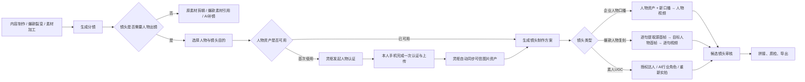

# 数字人分镜制作：页面动线与技术栈规划

日期：2026-09-24  
状态：产品方向已确认，作为后续开发规划；本文不代表功能已经实现。

## 1. 已确认的产品定位

数字人技术主要服务于分镜制作。SD、Runway、HeyGen 统一纳入内容 Agent 可调用的数字人制作技术栈，产品侧共享输入、任务状态、候选结果和验收流程；底层工具仍保留各自的能力和接口差异。

- 顶层创作入口仍然是「视频／图文」。
- 不新增与「视频／图文」同级的数字人、HeyGen、SD 或 Runway 入口。
- 内容 Agent 根据已有图片、视频、企业人物资产和镜头要求，灵活组合生成工具，制作数字人视频并填入对应分镜。
- 数字人视频首先是分镜素材，通过验收后再参与整片合成。
- 同一条视频可以混用人物口播、人物替换、场景演绎和已有实拍素材。
- 用户设置人物、口播、动作、场景及需要保持的内容；供应商和模型信息放在高级设置或任务技术详情中。

两条业务路线都重要，不设置主次：

| 业务场景 | 核心驱动 | 内容 Agent 的任务 |
| --- | --- | --- |
| 素材加工 | 人物资产＋口播内容，结合已有图片、视频 | 将口播分配到镜头，选择出镜表现，生成并填入分镜 |
| 爆款裂变 | 爆款视频逐句复刻＋人物资产 | 对齐原片语句、时间段与画面，以企业人物制作对应镜头 |

## 2. 素材加工动线

选择图／视频素材 → 确认或生成口播 → 选择企业人物 → Agent 编排分镜 → 生成镜头候选 → 审核并填入 → 合成成片。

### 2.1 内容与人物准备

用户可以提供口播，也可以让 Agent 根据产品资料和已有素材生成口播。口播确认后进入镜头制作。

全片设置提供默认企业人物、声音和语言。用户可在制作过程中选择人物库中的人物或补充资料；缺少资料时明确提示用途和缺项。

### 2.2 分镜编排与制作

Agent 按内容组织镜头，将口播语句关联到对应镜头，并决定哪些镜头人物讲解、哪些展示产品、哪些需要人物与场景结合。

分镜面板展示：

- 本镜头口播及目标时长。
- 使用的人物、声音、语言，默认继承全片设置。
- 已有图片、视频及参考素材。
- 人物动作、场景和画面要求。
- 必须保持的人物、产品或背景信息。
- 制作状态、候选视频、质检结果与修改入口。

用户确认候选后填入分镜。修改一句口播或一个人物时，仅使受影响的镜头及下游合成失效，不重做无关镜头。

## 3. 爆款裂变动线

灵感中心选择爆款视频 → 逐句／逐镜分析 → 确认复刻内容 → 选择企业人物 → Agent 制作对应镜头 → 对照验收 → 合成成片。

### 3.0 默认生成路线：逐句首帧重建

爆款裂变的默认路线不是把含原人物的整段爆款视频提交给 Seedance、Runway 或其他视频模型。默认编排如下：

1. Gemini 分析爆款视频，建立真实的口播句子时间轴、镜头时间轴及两者映射。
2. 按每句口播区间在租户内部提取代表性首帧；首帧用于描述构图、人物姿态、产品位置、场景状态与镜头功能。
3. 图像链根据企业人物资产和首帧约束，重建该句的目标人物首帧。原片人物不是身份来源，也不作为视频模型输入。
4. 视频生成链使用“目标人物首帧＋本片该句口播＋动作／场景约束”生成这一句的目标人物视频；根据实际能力选择 Seedance、Runway、Kling、HeyGen 或已注册的组合链。
5. 逐句候选通过人物、口播、产品与画面质检后，按原片节奏拼接回对应分镜，再进入整片装配。

只有用户明确选择“整段原片动作参考”，且源素材具备相应模型输入授权时，才允许把原片片段直接提交给视频生成供应商。该高级路线不得覆盖默认逐句首帧路线，也不得因逐句编排器暂不可用而静默降级为原片直传。

逐句记录除原句、目标句、起止时间和分镜映射外，还需保存：原片首帧时间与提取产物、目标人物首帧版本、逐句视频任务与候选、质检结果，以及最终拼接区间。修改某一句只失效该句的目标首帧、视频候选和必要的下游拼接。

### 3.1 复刻确认

逐句复刻是默认编排依据。页面必须保留原句与本片语句的对应关系；用户可确认原句，或明确调整产品信息、语言及表达，不能由系统静默改写。

| 对照项 | 页面内容与操作 |
| --- | --- |
| 原片口播 | 原文、开始／结束时间、原片播放定位 |
| 本片口播 | 默认带入原句；可编辑产品信息、翻译或修改表达 |
| 原片画面 | 参考片段、人物动作、场景、产品与镜头关系 |
| 制作要求 | 目标企业人物、必须保持和允许改变的内容 |
| 生成结果 | 原片与候选对照，确认或提出修改意见 |

语句与分镜不强制一一对应：一句话可能跨多个镜头，一个镜头也可能含多句话。后台分别保存语句时间轴和镜头时间轴，并维护映射关系；页面联动定位。

### 3.2 人物替换与重新演绎

两种结果预期必须在分镜中明确：

- **保留原镜头替换人物**：用户指定需要保持的动作、产品、背景和镜头结构，后端按实际能力判断是否可执行。
- **参考原片重新演绎**：保留确认的语句、镜头功能及表达节奏，允许重新制作画面。

具有明确派生授权的素材可进入原片人物替换；外部参考进入结构分析和重新制作路线。来源及授权条件在选择参考视频时明确，并作为后台执行条件。

不能在替换失败后静默切换到画面变化较大的重新演绎；如果会改变用户确认的保留要求，应返回待确认状态。

## 4. 页面改造范围

### 4.0 强制上下文补齐闭环（2026-09-25 补充）

当用户在某个人物出镜分镜中没有可用企业人物时，人物资产补齐必须在当前分镜抽屉内完成，不得把“去企业知识库／素材库维护后再返回”作为主路径。

强制交互顺序：

1. 保留当前项目、装配版本、分镜 ID、口播和制作要求上下文。
2. 在当前分镜抽屉展开“添加人物”，上传人物图片，填写授权凭证、本人同意凭证并确认成年人身份。
3. 需要 Seedance 人物链时，从同一补齐区域打开方舟认证；用户返回后在原抽屉填写图片 Asset ID，同步或人工确认 Active 状态。
4. 人物保存成功后同时写入企业人物库，刷新当前素材清单，并自动把新人物 ID 回填到原分镜。
5. 原分镜的人物版本、制作要求和内容确认状态按真实变更失效；不得自动发起付费生成。

企业知识库的人物资产页仅作批量管理、编辑、停用和查看历史版本的入口；不承担内容制作中的必经步骤。

本闭环的验收必须从“内容制作新建草稿”开始真实点击，经过编导分镜、人物镜头、当前抽屉补齐、方舟往返状态和自动回填，确认页面没有把用户导向企业知识库或灵感中心。

| 页面／区域 | 改动 |
| --- | --- |
| 内容制作 → 视频启动区 | 承接素材加工和爆款裂变上下文，保留视频／图文层级，不新增数字人顶层入口 |
| 内容制作 → 全片设置 | 配置默认企业人物、声音和语言，供分镜继承并允许逐镜覆盖 |
| 内容制作 → 口播与分镜编排 | 素材加工展示口播拆句及分镜分配；爆款裂变增加原片逐句、逐镜对照及复刻确认 |
| 内容制作 → 分镜工作台 | 提供统一的人物、口播、参考素材、动作／场景和保留要求设置；支持候选预览、质检、局部重做、确认填入 |
| 灵感中心 → 视频详情 | 分析后进入爆款裂变，携带原片、语句及分镜数据；原独立人物替换流程收进统一分镜制作动线 |
| 企业知识库 → 人物资产 | 统一管理人物照片、参考视频、声音、授权及可用状态；允许制作页内选择或补充资料 |
| 制作任务详情 | 展示逐镜进度、失败原因、重试和费用记录；模型、供应商与调用信息放在技术详情 |

现有 HeyGen 口播面板和 Runway 人物规划面板不再各自承担独立业务流程，其设置和状态并入统一分镜面板。

## 5. 后端技术分层

调用链：

内容 Agent → 分镜制作计划 → 数字人制作服务 → 工具适配层 → 质检与候选库 → 分镜装配 → 成片合成。

| 层级 | 职责 |
| --- | --- |
| 内容 Agent | 理解业务场景，编排口播、人物和分镜，提出制作意图 |
| 分镜制作计划 | 保存口播、时长、人物、输入素材、参考片段、动作、保留要求及验收标准 |
| 数字人制作服务 | 检查资料与授权，根据实际能力、质量、时长和预算制定执行路线 |
| 工具适配层 | 封装 HeyGen、SD 图像处理链、Runway、配音、口型同步及视频加工工具 |
| 质检与候选库 | 保存各版候选，检查人物、口播、口型、时长、画面及产品保真度 |
| 分镜装配与合成 | 将已确认候选按时间轴填入镜头，处理字幕、转场、配乐及整片输出 |

### 5.1 多工具组合与实际能力约束

一个镜头可以调用多个工具，例如人物／场景参考图制作 → 动作视频生成 → 口型与声音处理 → 裁切与合成。分镜任务不永久绑定某一家供应商。

以下是路线示例，不是已接通能力清单：

| 镜头意图 | 可选择的执行路线 |
| --- | --- |
| 人物讲解已确认口播 | 人物资产＋配音 → HeyGen 等口播生成工具 → 质检 |
| 人物在指定场景中出镜 | 人物资产＋场景参考 → 图像处理／生成 → Runway 等视频生成工具 → 必要的声音与口型处理 |
| 原片人物替换 | 授权原片＋人物资产＋保留约束 → 支持相应范围的人物处理链 → 保真质检 |
| 现有素材可满足镜头 | 直接复用、裁切或编排现有素材 |

Agent 提出意图，后端根据已接通、可调用且满足条件的能力校验执行。不能将模型理论能力当作系统当前可用能力；没有可执行路线时返回明确缺项或能力限制。

## 6. 统一数据与版本关系

以下为逻辑数据规划，具体表名和接口在实现时结合现有代码确定。

### 6.1 企业人物资产

同一人物使用内部统一 ID，关联照片、视频、声音、授权与资产版本。HeyGen 人物 ID、图像生成参考资料、视频生成参考素材作为人物资产的工具映射保存。

系统记录该资产支持哪些制作能力、缺少哪些资料，避免用户为不同供应商重复建立人物。

### 6.2 分镜制作记录

| 数据类别 | 必须保存的信息 |
| --- | --- |
| 来源 | 素材加工／爆款裂变、原素材、原片片段、原句与目标语句映射 |
| 制作要求 | 人物资产版本、口播、声音、语言、目标时长、动作、场景及保留约束 |
| 执行计划 | 工具步骤、依赖关系、能力校验结果、质量标准及费用估算 |
| 执行记录 | 工具与模型、输入版本、外部任务标识、状态、实际费用及失败原因 |
| 候选结果 | 视频资产、质检报告、用户反馈与确认状态 |
| 分镜装配 | 最终选中候选、时间轴位置、裁切信息及装配版本 |

输入、执行和候选分别记录版本。历史候选保留，重试不覆盖已确认镜头；重复提交和重复回调应按任务标识去重，避免重复生成和费用。

## 7. 统一状态与验收

主流程状态：

待补资料 → 待确认内容 → 可制作 → 生成中 → 质检中 → 待确认候选 → 已填入分镜。

失败、取消及质检不通过作为可追踪分支，展示原因和可采取的操作。生成成功不等于通过验收，不自动覆盖已经确认的镜头。

### 7.1 验收重点

| 类型 | 验收重点 |
| --- | --- |
| 人物口播 | 人物一致性、语句完整性、声音、口型、音画同步、目标时长 |
| 原片人物替换 | 人物一致性、替换范围、动作连贯性、产品／背景／构图保留情况 |
| 场景重新演绎 | 镜头意图、动作与场景、人物一致性、产品表现及语句节奏 |
| 分镜装配 | 语句与镜头对齐、候选版本、裁切边界、字幕及整片衔接 |

自动质检只能标注系统实际可验证的项目；未实现的指标保留人工预览确认，不展示虚构评分或已通过结论。

## 8. 当前实现基线与迁移位置

本次讨论基于 2026-09-24 查看本地 `localhost:5177` 及当前仓库代码的结果。后续开发需重新核对代码状态。

- `src/components/AiCreateStudio.tsx`：现有 HeyGen 口播生成、分镜工作台以及 Runway 规划面板挂载位置。
- `src/components/ShotProductionPanel.tsx`：现有单镜头制作面板，可作为统一分镜交互的迁移位置。
- `src/components/InspirationDashboard.tsx`：现有「爆款分镜人物替换」入口及创作上下文传递。
- `src/components/studio/RunwayPersonReplacementPanel.tsx`：当前提供逐镜方案规划，按钮明确显示「预览生成尚未接入」。
- `src/lib/runwayPersonReplacement.ts`：现有人物处理方式和逐镜规划逻辑。
- `src/components/enterprise/EnterprisePresenters.tsx`：现有授权人物管理入口。

HeyGen 已有生成交互，实际可用性取决于服务配置。Runway 面板目前仅验证规划与质量门槛，不调用付费生成。统一页面不能被表述为已接通所有生成能力。

## 9. 分阶段落地

### 阶段一：统一分镜交互与现有链路

- 建立统一人物资产引用、分镜制作输入、状态及候选数据结构。
- 将现有 HeyGen 链路迁入统一分镜面板。
- 跑通素材加工的口播确认、人物选择、逐镜生成、验收和装配。
- 保留现有视频／图文入口及已有素材制作能力。

### 阶段二：爆款裂变编排

- 建立原片语句时间轴、镜头时间轴及映射关系。
- 完成逐句复刻确认与原片／候选对照交互。
- 灵感中心将分析上下文传入统一分镜工作台。
- 未接通的路线明确标记「仅支持方案预览」，在生成前暴露能力限制。

### 阶段三：扩展工具链与自动选路

- 接通并验证 SD／Runway 等实际生成与处理链。
- 根据人物资产、现有素材、保留要求、时长、质量和预算选择路线。
- 完成多工具任务编排、费用记录、质检和局部重试。
- 对改变用户保留要求的路线切换重新请求内容确认。

### 完成标准

- 用户无需理解供应商即可完成两条业务路线。
- 每个生成候选可追溯到人物版本、口播、参考素材和分镜要求。
- 同一视频支持不同镜头采用不同制作链，并统一验收和装配。
- 修改局部内容只重做依赖该内容的镜头及必要的下游合成。
- 页面状态与后台真实能力一致，未接通能力不能提交为真实生成任务。

本文仅记录产品与开发规划；不包含代码实现或部署授权。

## 10. 研发进度（2026-09-24，持续更新）

用户已在后续任务中授权按本文开展研发；部署仍未授权。以下记录实现进度，不改变前述目标范围。

### 已落地的第一批改动

- 在现有单镜头面板内扩展数字人制作要求，包含素材加工／爆款裂变上下文、人物口播／人物替换／重新演绎意图、原片语句与时间段、动作、场景、保留内容和内容确认。
- 从爆款分析按时间重叠带入当前镜头的参考内容；原人物替换入口保留替换意图，不静默改为重新演绎。
- 原独立 Runway 规划面板的挂载替换为进入统一分镜设置的说明。
- 新增前后端共享的制作计划校验；尚未接通的参考路线只展示方案，不会送入 HeyGen 口播接口。
- 镜头要求进入候选指纹；修改人物、台词或参考要求会撤销内容确认，使旧候选不能直接采用。
- 候选列表增加视频预览，沿用原有采用、恢复和任务刷新流程。
- 保留旧草稿的口播准入方式，避免无新制作要求的历史任务被错误失效。

### 已落地的第二批改动

- 原片语句改为独立 cue 数据，每条保存原句、本片对应语句、起止时间与关联分镜 ID；支持一句跨多镜和一镜包含多句，旧单段参考数据仍可读取。
- 爆款分析进入分镜时，按时间重叠生成语句与分镜的多对多映射；分镜面板展示逐句对照并允许记录本片改写。
- 企业人物资产增加版本、可用能力、参考素材与工具映射。一个内部人物 ID 可同时关联 HeyGen 人物／声音以及供图像、视频链使用的参考素材。
- 服务端根据真实已保存字段推导人物能力，不信任客户端自行声明；只有人物与声音映射完整时才允许口播，参考制作要求必须具备人物参考资产。
- 企业出镜设置和分镜内新增人物入口均支持录入人物参考素材，并展示“人物口播／参考图／参考视频”等面向用户的能力标签。
- 新增不调用外部服务的浏览器交互夹具 `tests/digital-human-shot.html`，用于验证统一分镜面板及人物能力切换。

### 已落地的第三批改动

- 新增分镜级数字人制作方案记录。方案绑定项目、装配、分镜、输入指纹、业务路线、制作方式、人物资产版本、候选工具、步骤、状态和费用估算；数字人仍是分镜制作能力，不新增与视频／图文并列的内容入口。
- 单镜头面板增加“保存制作方案”。保存前先持久化当前草稿，再由服务端读取已保存的真实分镜要求和人物资产生成方案，避免客户端伪造能力或保存与草稿不一致的结果。
- 方案接口按租户和项目隔离；同一分镜与输入指纹重复保存会复用原记录，不产生重复任务。人物、口播或参考要求改变后，旧方案不会显示为当前方案。
- 素材加工的人物口播方案可标记为可制作；爆款裂变的人物替换／重新演绎仍保存为“仅方案预览”，并列出 Runway、Kling、Seedance 或本地人物处理链等候选工具，但不会调用未接通的供应商。
- 保存方案不发起外部生成、不预占预算、不产生供应商费用。只有用户另行确认单镜头生成和计费后，现有可用口播链才允许提交。
- PocketBase 初始化脚本增加 `studio_digital_human_plans` 集合，用于保存租户内可追溯的分镜制作方案。

### 已落地的第四批改动

- Content Agent 的素材供给计划增加可选的分镜级 `digitalHumanPlan`，记录业务路线、制作方式、企业人物资产、是否依赖参考视频、候选工具及执行状态。数字人方案附着于分镜素材计划，不成为内容类型或整片生产阶段。
- 修正人物资产选路：企业人物资产不再被误判成客户实拍视频；存在已授权人物资产时，素材加工规划为“人物资产＋口播”的 talking 路线，爆款裂变规划为“参考分镜＋人物资产”的 reenact 路线。
- 没有企业人物资产时，Content Agent 不再假定数字人口播能力存在，也不会尝试调用数字人适配器；系统改选可追溯的动态图文等非证据型路线。
- 爆款裂变的 Content Agent 数字人方案继续标记为 `preview_only`，候选技术链为 Runway／Seedance／Kling／Act-Two，未接通前不进入真实供应商执行。
- 脚本基线发生逐镜重建时，数字人方案会按分镜 ID 或顺序重新对齐并保留人物资产与路线信息；涉及工厂、案例、产品效果等真实证据镜头时，事实边界优先，不强行套用数字人。

### 已落地的第五批改动

- 社媒任务进入 Studio 时，会同时带入 Content Agent 生成的分镜级数字人方案，包括来源任务与版本、业务路线、制作方式、企业人物资产、候选工具和执行状态。
- Agent 分镜 ID 与 Studio 分镜 ID 一致时按 ID 映射；脚本转换导致 ID 不一致时按分镜顺序映射。映射结果随 Studio 草稿保存和恢复，不会只存在于前端临时状态。
- Studio 建立新分镜制作设置时，会依据 Agent 方案选择数字人来源并填入素材加工／爆款裂变要求；只有租户人物库中确实存在对应内部人物 ID 时才自动选中人物，否则保持待补人物状态。
- Agent 建议不会自动确认内容、调用供应商或产生费用。分镜面板明确展示来源任务版本、候选技术和“尚未执行”，用户仍需核对人物、口播、参考内容及保留要求后保存制作方案。
- 对爆款裂变，如果 Studio 已有精确参考分析，仍以真实原片时间段、逐句映射、动作和场景数据补全 Agent 的路线建议；缺少参考数据时显示缺项，不伪造参考内容。

### 已落地的第六批改动

- 新增统一数字人执行记录，绑定制作方案、原生成任务、项目、装配、分镜、输入指纹、工具、供应商、人物资产版本、外部任务 ID、候选素材及错误原因。
- 现有 HeyGen 口播提交已接入统一执行记录。付费提交前必须存在与当前草稿指纹一致且可执行的制作方案；Studio 点击生成时会先自动保存并校验方案，再进行预算准入和供应商提交。
- 方案、原生成任务和统一执行记录均按租户隔离。相同请求仍复用原任务；已有未结束任务会阻止新的请求标识，提交结果未知时不会再次调用供应商。
- 费用拆分为估算费用和实际费用：执行完成后标记“待账单对账”，不会把估算值伪装成实际支出；实际费用必须附带账单依据才能标记为已对账。
- 分镜面板读取真实执行记录，展示工具、执行状态、估算费用、实际费用对账状态和失败原因。候选生成成功但下载或技术检查失败时，仍保留原外部任务并展示可追踪错误。
- PocketBase 初始化脚本增加 `studio_digital_human_executions` 集合。若执行记录无法持久化，系统会在调用供应商前撤销本地待提交任务并停止生成。

### 已落地的第七批改动

- 新增供应商无关的分镜数字人质检报告，随统一执行记录保存。质检明确区分系统检查和人工检查，不把“文件可以导入”表述成人物、口型或观感已经通过。
- 系统检查当前只记录实际执行过的媒体入库结果，包括视频文件、画幅、分辨率与音轨准入。入库失败会保存失败依据并保留原外部任务，不触发新的付费生成。
- 所有数字人候选均要求人工核对人物一致性、语句完整性、声音、音画同步和口型；人物替换／重新演绎额外要求核对逐句时间、动作场景以及产品／背景／构图保留约束。
- 分镜面板展示逐项质检状态和证据来源。媒体入库通过后，用户可明确确认人工验收通过或标记不通过；结果按租户持久化到对应执行记录。
- 数字人候选只有在供应商任务完成、媒体通过入库检查且人工质检全部通过后才能采用并填入分镜。人工质检不通过或尚未完成时，候选保留用于对比，但采用按钮被阻止。

### 已落地的第八批改动

- 新增数字人工具能力注册表，分别描述 HeyGen、本地人物处理、Seedance 参考重演、Kling 动作生成和 Runway Act-Two 的支持方式、规划能力、真实执行能力与质检能力。
- 只有服务端显式注册了具备提交和状态查询方法的真实适配器，工具才会标记为“可执行”；仅存在名称、规划逻辑、通用视频接口或环境变量时均不能解锁参考人物生成。
- 现有通用 Seedance 文生视频接口不会被误报为“Seedance 参考人物重演”，因为它不能保证企业人物身份、逐句时间及产品／背景／构图保留约束。
- 分镜面板的技术详情改为逐工具展示“可执行／仅规划”及具体原因。HeyGen 的执行状态同时受服务配置和预算准入控制，参考人物链继续反映服务端真实注册状态。
- 已定义统一参考人物执行适配器契约：适配器必须声明工具、支持的制作方式，并实现幂等提交和外部任务状态查询。当前仓库尚无真实参考人物适配器注册，因此相关按钮仍保持方案预览。

### 已落地的第九批改动

- 企业出镜设置增加“新分镜默认声音”和“新分镜默认布局”，与默认出镜偏好、默认人物共同组成全片数字人默认值。旧企业配置读取时自动补齐连续旁白和全屏布局，不破坏已有草稿。
- Studio 新建分镜制作设置时继承企业默认人物、声音和布局；Content Agent 明确指定人物时仍优先使用任务中的内部人物 ID，每个分镜后续可独立覆盖。
- 单镜头高级设置同步提供默认值编辑，并增加“应用到当前视频全部未锁定数字人分镜”的显式批量操作。批量操作仅处理当前装配中的数字人分镜，不修改已有素材、AI 画面、实拍或其他视频版本。
- 锁定镜头不会被批量覆盖；没有默认人物时保留各镜头原人物。人物发生变化会撤销该镜头的内容确认并使旧候选失效，声音与布局仍遵循原有分层复用规则。
- 默认值保存继续按企业租户隔离，不触发生成、供应商调用或费用。

### 已落地的第十批改动

- 全片默认值的批量应用规则已从页面回调收敛为独立领域函数，明确只处理当前装配中的未锁定数字人分镜；其他视频版本、已有素材、AI 画面、实拍镜头和锁定镜头保持原值。
- 批量更换默认人物继续复用单镜头变更规则：撤销内容确认、增加分镜修订号并使旧输入指纹失效。企业未配置默认人物时保留各镜头当前人物，仅同步声音和布局。
- 参考人物路线的统一质检报告新增时长、参考音轨和运动连续性三项自动检查，可直接承接现有 FFmpeg 人物替换对比指标。
- 自动检查只记录可测量的媒体事实：时长帧差、音轨相关度、停帧差异、运动差异和抽样帧数。人物身份、姿态动作、口型、场景以及产品／背景／构图保留仍必须由人工或后续明确接入的视觉模型检查，不能由整帧相似度替代。
- 参考人物候选即使技术指标全部通过，仍保持“待人工验收”；任一技术项失败会直接进入质检失败，不允许采用为正式分镜。

### 已落地的第十一批改动

- 参考人物工具已接入供应商无关的统一执行编排。服务端只有在明确注入支持当前制作方式的真实适配器后，才会把人物替换／参考重演方案从“仅方案预览”提升为“可制作”。
- 参考人物提交使用独立接口，不复用 HeyGen 人物口播参数。保存的制作方案决定实际工具；人物替换不会静默落到口播接口，口播也不会进入参考视频执行链。
- 提交前先校验租户、草稿状态、分镜锁定状态、输入指纹、人物授权与参考资产、当前可执行方案和适配器能力，再建立统一执行记录。供应商调用使用租户级请求标识做幂等控制。
- 参考执行记录支持提交中、处理中、已完成、失败和提交结果待核对状态。提交回包不确定时不会重新调用供应商；状态刷新只查询原外部任务，已完成任务不会再次查询或导入。
- 参考视频完成后通过专用导入回调进入素材库，并将媒体入库结果与时长、音轨、停帧和运动指标写入同一质检报告。导入或技术检查失败时保留外部任务，允许修复后复查，禁止重新付费生成。
- Studio 根据服务端保存方案自动选择口播或参考人物执行链。参考任务、执行状态、候选视频和人工验收继续显示在当前分镜面板中，不新增数字人内容入口。
- 参考候选只有在执行完成、素材 ID 与输入指纹一致、统一质检全部通过后才能采用。数据库初始化为参考执行请求增加租户内唯一索引，防止页面重试产生重复任务。

### 已落地的第十二批改动

- Content Agent 带入 Studio 的分镜数字人建议会自动物化为当前装配中的数字人分镜设置；用户不需要先逐镜打开面板，草稿保存时也能得到完整的分镜级制作输入。
- Studio 保存带有 Content Agent 建议的草稿后，自动调用批量同步接口。服务端重新读取已保存草稿、输入指纹、企业人物授权和真实工具能力，生成持久化制作方案，不接受前端自行声明“可执行”。
- 自动方案按 Agent 分镜 ID 优先对齐；脚本转换导致 ID 变化时按分镜顺序对齐到真实 shooting slot。找不到分镜或分镜不再是数字人来源时跳过，不为不存在的镜头伪造方案。
- 持久方案记录来源类型、社媒任务 ID 和任务版本。同一分镜输入指纹下收到新的任务版本时更新原记录的来源版本；人物、口播或制作要求变化后产生新指纹和新方案记录，旧版本继续保留用于追溯。
- 用户后续手动保存同一方案不会抹掉 Content Agent 来源信息。分镜面板在已保存方案旁展示 Agent 来源版本，便于区分系统建议、当前草稿和供应商执行结果。
- 批量同步只保存方案，不确认内容、不调用供应商、不预占预算。Agent 方案仍需用户逐镜核对人物、口播、参考内容和保留要求，满足真实适配器与计费准入后才能执行。

### 已落地的第十三批改动

- 参考人物适配器状态协议增加供应商确认的实际人民币金额与账单／用量记录依据。只有金额和依据同时存在且格式有效时，统一执行记录才会自动从“估算／待账单”进入“已对账”。
- 缺少任一费用字段、负数、非数字、异常大金额或无效依据都会阻止状态写入；系统不会用制作方案估算值补成实际费用。未返回真实账单的供应商继续显示“待账单对账”。
- 统一参考人物质检增加姿态与手部时间轴、人物区域外背景结构、关键点异常三组自动代理指标，可承接现有视觉 QA 报告中的姿态配对、手部 PCK、双腕间距、背景 SSIM 和关键点跳变结果。
- 视觉指标缺失不会被当作通过；对应自动质检项会失败并阻止采用。指标通过后仍然只进入人工验收阶段，不能直接采用候选。
- 人脸颜色／纹理相关度继续只作为复核线索，不承担人物身份认证。企业人物身份、口型观感、动作语义和产品／附件细节仍保留独立人工检查，避免把视觉代理指标表述为身份模型结论。

### 已落地的第十四批改动

- 分镜制作方案和统一执行记录增加可读的输入快照，保存实际口播、语言、画幅、目标时长、声音策略、人物内部 ID、人物资产版本、人物参考素材、口播工具映射、产品／背景素材以及完整数字人制作要求。
- 输入快照由服务端从已保存草稿、shooting slot 和企业人物资产生成，不接受客户端提供。输入指纹继续用于快速一致性校验，输入快照用于审核、排障和解释候选来源，两者职责分开。
- 分镜执行详情展示快照中的语言、目标时长和人物版本；执行记录复制当次方案快照，后续企业设置变化不会改写历史执行输入。
- 人物资产版本升级后，即使分镜人物 ID 和口播不变，也会创建新的制作方案记录。旧人物版本的方案、执行和候选继续保留用于追溯，不会被新版本覆盖。
- 生成提交只选择与当前企业人物资产版本一致的制作方案；分镜面板只展示当前人物版本的方案与执行，旧版本候选不能通过采用门槛。

### 已落地的第十五批改动

- 候选人工验收增加可持久化的修改意见。用户标记不通过前必须填写具体反馈，系统记录审核时间，并在执行详情持续展示，不再只保存笼统的“未通过”。
- 人工验收通过时可以补充备注；不通过时，具体意见同时写入各人工检查项的证据和质检报告的统一反馈字段，便于区分人物、口型、动作、场景或保留内容问题。
- 同一分镜再次生成时，服务端查找当前人物版本和输入指纹下最近一次质检失败反馈，将其写入新执行的输入快照。旧执行和旧候选保持不变。
- 参考人物适配器提交参数会收到该条修改意见，使“只重做这一镜”能够依据用户反馈调整生成，而不是无差别重复同一请求。新请求仍使用独立幂等标识和费用准入。
- 页面未填写修改意见时禁用“不通过”操作；服务端仍独立校验，防止绕过页面提交无反馈的失败结论。

### 已落地的第十六批改动

- 参考人物执行适配器增加可选的供应商取消契约，工具能力详情明确记录是否支持取消。只有适配器真实实现取消并由供应商确认成功，页面才会显示“取消原任务”。
- 取消接口按租户隔离并使用执行级互斥锁。只允许取消已有外部任务 ID 的提交中／处理中任务；提交结果未知、已经完成、失败或没有外部任务标识时，不会只修改本地状态来伪装取消。
- 供应商未确认取消时，执行状态保持不变并返回具体原因；供应商确认后持久化为“已取消”，保留原方案、输入快照、外部任务 ID、费用信息和历史记录。
- 对同一已取消任务重复操作会返回原取消记录，不重复调用供应商。取消后的分镜可以使用新的请求标识重新生成，仍遵守人物版本、输入指纹、内容确认和费用准入。
- HeyGen 当前客户端没有可核验的取消 API，因此口播任务不会显示虚假的取消按钮；相关任务继续通过原状态回查处理。

### 已落地的第十七批改动

- 爆款裂变的参考人物候选验收改为当前分镜内的原片／候选片并排对照，不新增数字人内容入口，也不把供应商名称暴露成用户路线。
- 原片播放器按当前分镜绑定的参考起止时间定位，并在区间终点自动暂停，避免验收时误看相邻语句或整条爆款视频。
- 对照区直接展示逐句原片口播和目标口播。点击任一句可同时定位原片的绝对时间和候选片相对该分镜的时间，帮助用户检查逐句复刻、人物替换、动作与节奏。
- 人物替换与重新演绎继续作为同一技术栈下的两种制作方式，不自动互换。页面能力文案依据真实方案状态显示“待补资料”“待确认”“仅方案预览”或“可制作”，不再固定声称参考路线只能预览。
- 原片／候选对照只用于验收已经完成且可播放的候选；候选采用仍受人物版本、输入指纹、技术质检和人工检查结果约束。

### 已落地的第十八批改动

- 共享旁白数字人候选的依赖指纹从整条音频收敛到当前分镜片段。每个镜头记录自己的持久分镜 ID、片段时长和与该分镜重叠的逐句对齐 cue；修改某一句的时间或内容时，只使依赖该片段的数字人候选失效。
- 整条配音文件 URL、总时长和全局对齐变化不再无条件淘汰所有共享旁白候选。人物原声、静音、已有素材和实拍继续忽略与其无关的共享配音信息。
- 声音配置仍是明确依赖：音色、风格、情绪、强度、语速、停顿和发音设置变化会使使用该声音的相关数字人候选失效；上传配音以实际文件身份作为声音配置的一部分。
- 前端保存方案、生成、未完成任务去重、候选采用和面板状态，与服务端保存方案、口播提交、参考人物提交及 Content Agent 方案同步统一使用同一分镜级指纹，避免前后端对有效候选判断不一致。
- 旧草稿或异常数据找不到对应分镜片段时保持保守行为，继续使用全局音频依赖，不会因空片段而误判旧候选仍然有效。

### 已落地的第十九批改动

- 分镜制作方案新增结构化执行路线，不再只保存面向用户的说明文字。每条路线明确记录输入对齐、供应商生成、自动质检、人工验收和填入分镜五个步骤，以及步骤执行者、具体工具和前置依赖。
- 保存方案时根据当前制作方式和服务端真实选中的工具生成路线。人物口播绑定实际 HeyGen 能力；人物替换／参考重演只有在真实适配器可用时才将生成步骤标记为可执行，未接通路线保持等待状态。
- 统一执行记录复制当次方案路线，并随真实任务状态推进：提交／处理中显示生成进行中，提交结果未知显示待核对，完成后进入自动质检，自动项通过后开放人工验收，人工验收通过后才开放填入分镜。
- 技术检查失败、人工验收失败和供应商确认取消会停在对应失败步骤，不会把后续步骤显示为已完成。旧执行记录没有结构化路线时仍可读取，不伪造历史步骤。
- 分镜面板同时展示保存方案的制作路线和本次执行依赖，用户可以看见当前卡在供应商、系统质检、人工验收还是候选装配；供应商仍作为技术详情，不改变业务入口。
- 当前路线结构已经能承载后续多工具串联及逐步费用记录；本批没有虚构 SD／Runway／Kling 调用，真实适配器未注册时对应生成步骤仍不可执行。

### 已落地的第二十批改动

- 参考人物适配器增加真实执行能力画像，可声明支持的制作方式、最长镜头时长、能够保证的人物／动作／产品／背景／构图保留范围、是否提供自动质检，以及每秒估算费用。
- 服务端从用户填写的“必须保留”要求和已绑定的产品／背景素材推导本镜头的强制约束。人物身份始终是基础约束；动作、产品、背景和构图只有在用户要求或素材关系中出现时才成为选路条件。
- 自动选路会先剔除超过时长或缺少保留能力的工具，再优先选择具有质检能力的兼容适配器，并在同等条件下结合已声明估价和候选顺序。仅仅注册了适配器不再等于该工具能执行所有参考人物镜头。
- 没有工具满足当前约束时，制作方案保持不可执行，并明确列出是最长时长不足还是无法保证具体保留内容；系统不会静默改用画面变化更大的路线，也不会落到 HeyGen 口播链。
- 生成提交前再次用当前草稿、镜头时长、保留要求和适配器能力复核已保存方案。适配器能力变化或原工具不再是当前有效选路时，要求重新保存方案，不沿用旧选择发起付费任务。
- 参考路线的估算费用来自被选中适配器明确声明的单价与镜头时长；没有单价时继续显示待供应商确认，不用其他工具或历史估算补值。供应商实际账单仍按原有证据规则独立对账。
- 待补资料与待确认方案的路线第一步现在分别显示“待核对”和“可确认”，不会在输入尚未完整时错误显示为已经完成。

### 已落地的第二十一批改动

- 参考人物制作方案新增持久化选路审计，记录目标时长、必须保留的能力、最终选中工具，以及所有已注册候选工具的兼容结果、淘汰原因、自动质检能力和本镜头估算费用。
- 选路审计由服务端基于已保存草稿和适配器真实能力画像生成，不接受前端声明。方案历史版本保留当次判断，后续工具配置变化不会改写旧方案为何选择或淘汰某个工具。
- 分镜面板增加“选路依据”：用户可以看到某工具因超出最长时长、无法保证产品／背景／构图等要求而被淘汰，以及兼容工具是否带自动质检和预计费用。
- 技术详情同步展示已接入工具声明的最长时长、保留能力、质检方式和每秒估价。没有执行能力画像的旧适配器只视为声明了人物身份能力，不能据此推断它能保留产品、背景或构图。
- `/capabilities` 接口返回的执行能力画像与保存方案使用同一份服务端注册信息，页面披露和后台准入不会各维护一套互相矛盾的能力清单。
- 生成提交继续依据当前能力重新验证；选路审计用于解释和追溯，不作为绕过当前准入条件的凭证。

### 已落地的第二十二批改动

- “采用候选”从纯前端状态改为服务端校验并持久化的分镜装配动作。数字人候选只有在生成完成、素材 ID 一致、输入指纹未变化且人工验收通过后，才能写入草稿的当前分镜和时间轴素材分配。
- 每次成功采用记录执行 ID、候选 ID、素材 ID、装配版本和采用时间，并同时写入统一执行记录与草稿的 `digitalHumanAssemblyAdoptions`。执行路线的“填入分镜”步骤只有在该记录成功保存后才显示已完成。
- 采用前客户端先保存包含候选的当前草稿，服务端随后重新读取并校验候选确实属于本次执行或对应 HeyGen 任务，防止客户端用任意素材 ID 冒充已验收数字人结果。
- 装配接口按租户隔离并串行处理。对同一候选重复采用返回原装配版本，不重复写入；同一执行结果尝试静默改成另一候选会被阻止。
- 分镜锁定、人物／台词／参考要求变化、候选指纹过期、候选未入库、质检未通过或时间轴绑定缺失都会阻止采用。失败不会重新调用供应商，也不会产生生成费用。
- 候选已填入分镜后，原执行的人工验收结论不能被直接改写为失败；如需替换，必须生成或选择新的候选与装配版本，从而保留历史成片所依赖的验收依据。
- 分镜面板在执行详情中展示“已填入分镜”、候选标识和装配版本，制作路线从“待装配”完整推进到“已完成”。已有素材和实拍候选仍沿用原装配逻辑，不要求数字人执行记录。

### 已落地的第二十三批改动

- 内容制作工作台增加当前视频的“数字人制作进度”总览，不再要求用户逐镜打开面板才能判断整条视频还缺哪些数字人镜头。
- 总览只统计当前装配版本中的数字人分镜，并按当前输入指纹和人物资产版本关联方案与执行，避免把旧台词、旧人物或其他视频版本的历史任务混入当前进度。
- 每个分镜统一显示待建立方案、待补资料、待确认内容、仅方案预览、可生成、生成／检查中、提交结果待核对、质检未通过、待人工验收、待填入分镜和已填入分镜等真实状态。
- 总览展示当前阻塞步骤、供应商／系统错误、人工修改意见、单镜预计费用和实际对账费用。技术工具、外部任务标识和装配版本收在可展开的技术记录中。
- 页面汇总当前视频的数字人镜头数量、已填入数量、需要处理的异常数量、预计费用总额和已对账金额；仍未返回实际账单的执行明确标记为部分任务待账单。
- 用户可以从总览直接打开对应分镜处理资料、刷新任务、人工验收、重做或采用候选。总览本身不批量提交生成，也不产生费用。

### 已落地的第二十四批改动

- 参考人物自动选路增加逐镜预算上限硬约束。预算可由服务端配置或按环境注入，并与时长、保留能力和质检能力一起参与方案选择，不再只把低价作为排序偏好。
- 有明确估价的适配器超过预算上限时会被淘汰，选路审计记录本镜头预计金额和预算差异；配置了预算但适配器没有声明价格时，同样不能自动选中，因为系统无法证明付费调用在预算内。
- 多个工具都满足要求时，仍先保证保留约束和真实质检能力，再在兼容工具中比较本镜头估价。预算不会使系统选择一个不能保留产品、背景或构图的低价工具。
- 保存方案记录当次预算上限，并在“选路依据”中与目标时长、必须保留项一起展示。历史方案保留当时的预算判断，不会被管理员后续调整静默改写。
- 生成提交前重新读取当前预算上限并复核选中的适配器。预算收紧、价格画像变化或原工具变为无法验证价格时，阻止付费提交并要求重新保存方案。
- `/capabilities` 同步披露当前参考人物逐镜预算上限，前端能力状态与服务端准入使用同一配置。没有配置预算时明确显示“未配置”，不虚构无限预算或零预算。
- 实际费用仍以供应商账单及证据为准；预算上限控制预计调用准入，不把估价写成真实费用，也不替代任务完成后的对账。

### 已落地的第二十五批改动

- 在本地 5177 调试实例重新完成真实页面结构与交互验收。内容制作顶层继续只呈现“素材加工／爆款裂变”，数字人、HeyGen、SD 和 Runway 均未成为与视频／图文同级入口。
- 统一数字人分镜夹具验证人物口播切换到爆款裂变人物替换后，原片地址与时间段、原片语句、动作、场景、必须保留内容、派生授权和企业人物参考资产均作为独立缺项显示，不会把人物口播能力误当成参考人物能力。
- 页面实际计算尺寸验证分镜面板在 1280×720 调试视口中保持 560px 侧栏宽度和完整高度滚动；此前全页截图因设备像素比为 2 显示缩放，不是组件窄屏布局错误。
- 收敛重复缺项提示：人物／参考资料等具体原因只在“数字人镜头要求”状态卡中完整列出；下方生成区在尚未保存方案时只提示返回上方补齐，避免同一长串错误在面板中出现两次。
- 已保存的服务端方案仍在生成区展示其真实阻断原因，因此适配器能力、预算或后台配置限制不会被通用提示隐藏。可执行方案继续明确“只生成此镜头，已有候选保留”。
- Chrome 扩展连接本轮未暴露可控制标签页，因此视觉验收使用同一 5177 本地开发实例的隔离浏览器标签完成；未修改浏览器数据，未调用模型或供应商。

### 已落地的第二十六批改动

- 数字人供应商适配器新增独立账单查询契约。任务状态、生成结果和最终账单不再要求由同一个状态接口同时返回；供应商可以在任务完成后按外部任务标识查询用量或发票记录。
- 新增统一的供应商自动对账接口，只允许当前租户核对已完成且具有外部任务标识的执行。查询过程不会重新提交生成，也不会把方案估价或预算预占写成实际费用。
- 对账结果继续执行金额与证据成对准入：只有合法金额和供应商用量／发票凭证同时存在时才保存为“已对账”；账单尚未生成、字段残缺或供应商未声明账单能力时保持“待账单”并返回明确原因。
- 已完成的对账按执行记录串行和幂等处理。重复点击直接返回原金额与凭证，不再次查询供应商；跨租户请求不能读取或改变对账结果。
- `/capabilities` 增加逐工具账单查询能力披露。分镜面板仅在当前执行供应商真实声明该能力且执行处于“待账单”时展示“核对供应商账单”，避免提供无法完成的入口。
- Studio 对账成功后即时更新执行记录和已对账金额，并展示实际金额与凭证标识。对账失败沿用分镜错误区，不改变候选、质检或装配状态。

### 已落地的第二十七批改动

- 参考人物执行链新增可注册的模型质检器契约，独立接收源视频、候选视频、当次执行快照和租户上下文，可用于企业人物身份、产品／附件保真及局部伪影检查。
- 参考人物验收新增“产品与附件外观、文字和结构保持正确”及“人物边缘、手部与产品交界处无局部伪影”两个明确检查项。未配置真实模型时两项保持人工验收，不由姿态、背景或关键点代理分数替代。
- 只有质检器同时返回明确结论、0–1 合法置信度、模型标识和可读证据时，服务端才把对应检查从人工切换为自动结果。缺字段、非法置信度或空证据会被忽略并保留人工检查。
- 企业人物身份模型现在可以在具有真实证据时自动通过或阻断 `identity` 检查；原有面部外观相关度仍只是人工参考代理，不会自行确认人物身份。
- 产品保真或局部伪影模型判定失败会把整次候选质检置为失败并阻止采用；模型通过仍需完成口型、逐句时间、动作场景和其他尚未自动化的人工项目。
- 模型质检在候选视频完成导入和基础技术检查后执行。模型服务异常会保留原供应商任务与素材，执行进入可追踪的检查失败路径，不会重新付费生成。

### 已落地的第二十八批改动

- 连续旁白驱动数字人时，服务端不再只生成一次性临时 WAV。统一旁白依据源音频内容、分镜起点、时长和输出格式生成稳定的内容寻址片段，并持久化在当前租户的音频目录。
- 相同源音频与相同时间范围再次用于同一或重做的数字人镜头时复用已有片段，不重复执行 FFmpeg；时间范围或源音频内容变化会生成新的片段 ID，不会误用旧口播。
- 分镜音频统一输出为 16kHz 单声道 WAV，并在上传供应商前校验时间范围、源文件存在性和输出非空。非法区间不会进入供应商上传或付费生成。
- 每次数字人口播执行保存驱动音频片段 ID、SHA-256 校验和、起点和时长。分镜执行详情展示该证据，能够追溯候选视频具体由连续旁白中的哪一段驱动。
- 音频片段限定在企业租户目录，文件名不使用原始上传名称或跨租户路径。临时源文件在切片完成后删除，稳定片段采用原子写入，避免半成品被后续任务复用。
- 供应商音频资产上传继续绑定原幂等请求标识；切片复用不会重新提交已存在的数字人生成任务，也不会绕过预算准入。

### 已落地的第二十九批改动

- 新增基于 Runway 官方 `character_performance` 接口的 Act-Two 真实适配器实现，不再只保留工具名称。请求使用 `act_two` 模型，明确传入企业人物图片／视频、参考动作视频、画幅、身体动作控制和 1–5 级表情强度。
- 适配器按照官方任务协议查询 `PENDING／THROTTLED／RUNNING／SUCCEEDED／FAILED／CANCELLED`，成功后立即把短期输出 URL 交给素材入库链，失败时保留供应商错误码，不自动重新提交付费任务。
- Act-Two 能力画像按官方约束声明最长 30 秒，并仅保证人物身份和动作驱动。它不会声明能保留爆款原片的产品、背景或构图，因此这类强保留要求仍会在自动选路中淘汰 Act-Two。
- 参考人物提交新增服务端素材解析边界：付费调用前必须把当前租户人物资产和分镜参考片段解析为供应商可访问的 HTTPS URL。只有素材解析、预算预占、输出入库和真实适配器同时配置时，工具才会出现在可执行能力中。
- Studio 的 9:16、16:9 和 1:1 画幅分别映射为 Act-Two 官方的 `720:1280`、`1280:720` 和 `960:960`；其他画幅在提交前阻断，不让供应商自行猜测或裁切。
- Runway 终态任务返回的实际 credits 可按管理员配置的人民币换算率生成实际费用和任务证据，进入统一自动对账链。没有合法换算率时继续保持待账单，不用预计 credits 冒充实际人民币费用。
- 官方协议核对依据：[Runway SDK 与任务流程](https://docs.dev.runwayml.com/api-details/sdks/)、[输出 URL 时效与入库要求](https://docs.dev.runwayml.com/assets/outputs/)。实现同时核对了官方 Node SDK 4.20.1 的 `CharacterPerformanceCreateParams` 与任务类型声明。

### 已落地的第三十批改动

- 爆款裂变的参考要求新增“素材库参考视频”绑定。外部视频地址仍用于页面播放与对照，但只有当前租户素材库中的真实视频资产能够作为付费供应商输入，避免把未经归属校验的任意 URL 直接交给 Runway。
- 企业人物输入同样从人物资产绑定的素材 ID 解析，并校验素材属于当前租户或已授权共享、类型为图片／视频且已持久化到对象存储。人物与参考任一素材缺失、越权或仅存在本地临时路径都会在供应商调用前阻断。
- 服务端依据分镜保存的开始／结束时间，用真实 FFmpeg 将素材库原片裁成 Act-Two 要求的 3–30 秒精确参考片段，再上传到租户隔离的对象存储目录并签发一小时短期 HTTPS URL。
- 参考片段以源对象键、起止时间和处理版本生成稳定内容标识。同一分镜重做可复用已经上传的精确片段；原片或时间范围变化会生成新对象，不会把旧爆款语句误用于新镜头。
- 页面选择素材库视频时同步带入其可播放地址，原片播放器、逐句映射和服务端付费输入引用同一素材身份；修改选择会使当前内容确认和旧候选按原指纹规则失效。
- 当参考执行没有配置可核验视觉模型时，姿态、背景和局部伪影代理检查明确降级为人工对照项，并记录降级原因。它们不会保持为无法完成的“自动检查中”，也不会被系统默认判为通过。

### 已落地的第三十一批改动

- Runway 参考人物执行在付费提交前完成全部素材预处理：当前租户人物资产、精确原片区间、输出画幅任一解析失败都不会创建供应商执行记录或预占预算。成功预处理后，执行快照固化原片素材 ID、租户对象键、起点和时长，后续质检不依赖页面临时 URL。
- Act-Two 输出导入新增受控 HTTPS 域名策略、禁止凭据与端口、禁止重定向、120 秒超时和 500MB 流式大小上限。管理员可配置供应商输出域名后缀；未通过域名、内容类型、空文件或媒体参数检查的输出不会进入素材库。
- 供应商短期输出下载后，服务端从执行快照读取同一次任务使用的精确参考片段，使用 FFmpeg 检查候选视频并计算时长差、音轨相关度、运动差异、停帧差异和对比帧数，再将证据交给统一质量门禁。
- 候选视频以当前租户和内容哈希生成对象存储键，保存为可编辑视频素材，并记录来源执行、原片素材、精确片段对象键和技术指标。同一执行重复刷新会复用已经验证并入库的候选，不再次依赖可能已过期的 Runway URL。
- 新增参考人物月度预算账本。每次调用按方案中的逐镜预计费用持久预占，工具与请求标识保证幂等；余额不足、估价非法、预算配置变化或账本异常都会在供应商调用前失败，未知／失败任务不会自动退款。
- Studio 制作路由已接入真实 Act-Two 适配器、精确输入解析、输出导入和预算账本，但继续采用显式开关。只有 API Secret、对象存储、credits 人民币换算率、每秒估价和月度预算均有效时才注册为可执行能力；示例环境全部保持关闭。

### 已落地的第三十二批改动

- 将已有 MediaPipe／OpenCV／scikit-image 原片对比脚本封装为服务端视觉质检适配器。适配器从隔离 Python 环境执行，限制运行时间与输出大小，并要求版本化 JSON 结果；脚本异常、字段缺失、非法计数或超范围指标不会写入质量报告。
- Runway 候选入库现在可在同一份精确原片与候选文件上并行执行基础媒体检查和视觉代理检查。姿态误差、手部 PCK、双腕动作、人物区域外背景 SSIM、关键点跳变及人脸外观代理会随租户素材一起持久化，重复刷新复用同一证据。
- 视觉质检继续采用显式环境配置。没有配置 `DIGITAL_HUMAN_VISUAL_QA_PYTHON` 时，姿态、背景和局部伪影按既有规则转为人工对照；配置后只有真实模型输出可以改变对应自动门禁。
- 人脸外观相关度仍明确标记为代理指标，不能自动确认企业人物身份。人物身份、产品文字与附件结构、局部产品交界伪影仍等待专用模型或人工验收，不把颜色纹理相似度提升为身份结论。
- 已使用本地隔离环境和已知 Act-Two 样例完成真实运行：对比 25 帧，得到姿态归一化误差 0.0713、人物区域外背景 SSIM 0.894、关键点跳变 0 次；该验证不调用外部供应商。
- 核对 HeyGen 官方公开 API 后，当前没有按 `video_id` 返回最终人民币费用或带证据 credits 的稳定公开接口。账户余额快照无法在并发任务中可靠归因，因此仍不开放虚假的自动对账能力；实际费用继续要求供应商账单凭证。

### 已落地的第三十三批改动

- 企业出镜设置不再要求运营人员手填逗号分隔的素材 ID。添加人物时直接读取统一素材库，以图片／视频卡片多选企业人物参考资产，并显示素材名称、类型及本企业／企业共享范围。
- HeyGen 人物 ID 与声音 ID 继续服务“企业人物持续口播”；所选人物图片／视频统一写入 Runway 与 SD 技术映射，服务“参考重演”和“爆款原片人物替换”。供应商字段仍在技术层，不新增视频／图文同级入口。
- 绑定参考资产后，人物能力现在同时标记“参考图制作、参考视频制作、人物替换”，避免企业人物页只展示重演能力而遗漏同等重要的逐句复刻换人路线。
- 企业人物保存前新增服务端租户边界校验。每个参考素材必须对当前企业可见、类型为真实图片或视频，并已持久化到对象存储；缺失、跨租户、音频类型或仅本地临时文件会阻止保存。
- 素材库部分不可用、完全不可用、尚无人物素材以及历史绑定在当前租户不可见时，页面分别给出明确状态，不让用户在无法确认资产身份时继续盲填标识。
- 当前环境没有可证明身份一致性的专用人脸嵌入模型，也没有产品文字／局部结构模型，因此这两项仍保持人工验收；未将 MediaPipe、人脸颜色直方图或整帧相似度改名为身份／产品模型。

### 已落地的第三十四批改动

- 企业人物列表新增“编辑人物资产”，可重新选择 HeyGen 人物／声音、企业人物参考图片视频、透明能力和原生画幅。现有人物卡直接显示所绑定素材名称；历史素材在当前租户不可见时明确标记为不可见资产。
- 服务端不再相信前端提交的 `assetVersion`。每次保存都会对 HeyGen 人物与声音、Runway／SD 参考素材、透明能力和原生画幅生成稳定人物资产指纹，并与服务器上一版本比较。
- 人物名称、默认人物等不影响生成结果的设置变化不会抬高版本；人物声音、参考素材或媒体能力变化会自动递增人物资产版本。旧制作方案与候选继续保留原版本证据，新分镜须保存新方案。
- 参考素材数组在计算版本时去重并排序，单纯调整素材选择顺序不会制造虚假新版本；真实增加、移除或更换资产才会使旧候选失效。
- 编辑保存沿用原人物内部 ID，不会把同一个企业人物误建成第二个人物；页面明确使用“保存人物新版本”，由服务端决定实际是否产生新版本号。

### 已落地的第三十五批改动

- 重新连接用户 Chrome 中已打开的“数字人分镜交互验收”页，并启动当前工作树的 5178 本地开发实例。此前页面来自已停止的旧调试进程，缺少最新素材库绑定且重复展示完整缺项；刷新当前源码后两处均恢复为最新行为。
- 开发验收夹具新增一条真实形态的参考视频和一张企业人物图片，能够在页面直接验证“素材库参考视频”选择、人物参考资产能力以及产品／背景素材选择，不调用模型或供应商。
- 在页面实际切换“爆款裂变 → 保留原镜头替换人物”，确认数字人仍位于单个分镜的制作来源内部，没有成为视频／图文同级入口。
- 实际选择品牌代言人和素材库参考视频，填写 0–4 秒原片区间、原片语句、动作、场景、产品／背景／构图保留要求及派生授权后，页面缺项从七项收敛为只需内容确认。
- 页面同步生成 0–4 秒逐句与分镜映射，人物卡显示“人物资产 V3 · 有参考图／有参考视频／支持人物替换”；确认内容后进入“仅支持方案预览”，明确不会回退调用 HeyGen 口播接口。
- 生成区只显示简洁的“按上方提示补齐并确认”提示，不再复制要求卡中的完整缺项；素材库绑定会同步参考视频地址，页面输入与服务端精确裁片使用同一素材身份。

### 已落地的第三十六批改动

- Content Agent 的真实任务读取链现在会从当前租户的企业出镜设置读取已授权、且至少具有口播映射或人物参考资产的人物 ID。未授权人物、空壳人物和其他租户数据不会进入素材供给规划；人物资产存储异常时任务读取明确失败，不假装当前没有人物。
- 素材加工中，只有真实存在企业人物资产时才建议“企业人物口播”，并生成 `talking` 分镜方案；没有企业人物时退回配音与品牌图文，不再凭空假定存在可用数字人。
- 爆款裂变中，只有参考视频分析绑定的 `referenceSourceId` 同时对应当前任务中仍有效的客户视频素材时，才把它作为数字人原片。普通客户视频和仅有外链的参考地址不会被误当成可提交供应商的参考素材。
- 爆款逐句复刻默认规划为 `replace`，保持原镜头并替换企业人物；只有分镜要求明确写出“重新演绎／reenact／re-perform”时才采用 `reenact`。两条路线继续共用同一套数字人技术栈与分镜面板。
- Agent 分镜方案新增人物资产 ID 和参考素材 ID，并完整穿过社媒任务水合、Studio 草稿与服务端方案同步。Studio 初始化对应分镜时会自动选择仍然有效的企业人物，并绑定素材库参考视频。
- 自动带入只保存可以证明的素材身份和播放地址，不伪造原片起止时间、逐句文本、派生授权或内容确认。上述字段保持为空并在分镜面板形成明确缺项，补齐后才能进入能力与预算检查。
- Agent 只形成未执行的逐镜建议，不调用 HeyGen、Runway、SD 或其他供应商，不产生费用；参考人物路线继续禁止静默回退到口播生成。

### 已落地的第三十七批改动

- 专用模型质检契约纠正了身份与原片的比较对象：企业人物身份必须与已授权企业人物图片／视频比较，不能与爆款原片中的原人物比较；动作、背景、产品和构图才使用当次执行的精确原片片段作为证据。
- 模型质检输入现在明确携带企业人物参考素材 ID、精确裁片对象键、原片素材 ID、已入库候选素材 ID和租户上下文。模型服务可从稳定素材身份取数，不必依赖页面临时 URL，也不会把不同来源的证据混为一谈。
- 候选仍先通过受控下载、精确原片技术对比和租户素材入库，再进入身份／产品专用模型；专用模型不可用时保持人工验收，不改变现有真实性边界。
- 分镜侧栏移除了旧的 HeyGen 人物 ID、声音 ID和逗号分隔人物素材 ID手填入口，也不再允许在单条分镜内新建人物资产。
- 人物授权、供应商映射、参考图片／视频和人物资产版本统一由企业设置维护；分镜面板只选择已保存人物并显示能力与版本。当前视频的默认人物、声音、布局及批量应用仍保留在“全片数字人默认设置”。
- 当前企业没有已授权人物时，分镜明确引导先前往企业设置维护资产，不再用“新增人物”把资产治理混入单镜头制作流程。

### 已落地的第三十八批改动

- 人工验收从“一键通过全部项目”改为逐项结论。人物身份、口播、口型、逐句时间、动作场景、产品保真、局部伪影和保留要求各自选择通过或不通过，页面不再用一个按钮生成无法区分的笼统证据。
- 所有仍待人工检查的项目都明确选择后才能保存验收；任一项目选择不通过时，必须填写具体修改意见。尚未选择完整或缺少失败反馈时按钮保持禁用。
- 服务端继续按检查项键值保存结论和证据。通过项记录用户在原片／候选预览中的逐项确认，失败项记录本次修改意见；下一次单镜头重做仍可读取该意见进入执行快照。
- 自动检查已经得出结论的项目不会再次出现在人工选择表中，避免人工覆盖媒体入库、时长、音轨或真实模型已经产生的可追溯证据。

### 已落地的第三十九批改动

- 新增服务端单镜头生成尝试上限，默认同一租户、草稿、视频版本、分镜、输入指纹和人物资产版本最多生成 3 个候选，可通过 `DIGITAL_HUMAN_MAX_ATTEMPTS_PER_SHOT` 在 1–10 之间配置。
- 尝试次数以持久化执行记录计算，不依赖当前浏览器或进程内计数。更换请求标识、刷新页面或重启服务不会绕过上限；相同请求标识仍先按原幂等记录返回，不会把重复点击多算一次。
- 口播与参考人物路线共用同一次数门禁。提交结果未知、失败、取消或已完成的调用都计入尝试次数，因为它们可能已经产生供应商任务或费用；真正修改分镜要求或升级人物资产后会形成新指纹／版本并重新计算。
- 参考人物路线补齐并发任务门禁：同一镜头已有 `submitting`、`pending` 或 `uncertain` 执行时，即使换请求标识也不能再次提交，必须刷新或取消原任务后再决定是否重做。
- 分镜生成区展示“已生成次数／上限”，说明每个新候选独立计入尝试与供应商费用；达到上限后按钮变为“已达本镜头生成上限”并禁用，服务端仍作为最终权威门禁。
- 上限配置通过能力接口下发，前端不自行猜测管理员配置；所有示例环境文件均加入默认值 3，不启用任何供应商。

### 已落地的第四十批改动

- 参考人物执行快照新增本次供应商实际采用的企业人物输入证据，包括人物素材 ID 和租户对象存储键；不再只保存人物资产下可能包含多张图片／视频的候选列表。
- Runway 输入解析在签发短期地址的同时返回人物素材身份，执行记录在供应商调用前固化该身份。后续编辑企业人物、调整参考素材顺序或短期签名失效都不会改变历史任务实际使用的素材。
- 制作方案中的人物参考素材列表现在正确读取 Runway 工具映射；此前只读取兼容旧字段时，企业人物页保存到 `toolMappings.runway` 的资产可能没有进入方案快照，现已补齐并由路由测试覆盖。
- 身份模型只接收本次实际采用的人物素材 ID，不再接收人物资产的全部候选列表；动作、背景和产品模型继续使用同一次执行的精确原片裁片对象，候选使用已经入库的素材 ID。
- 分镜执行详情新增“实际人物输入”和“精确原片输入”，展示素材 ID、原片起止时间与对象键，便于排查人物版本、供应商结果和质检证据是否来自同一组输入。

### 已落地的第四十一批改动

- 爆款原片人物替换不再只保存“已授权”复选框。用户勾选派生制作与商业使用授权后必须填写授权依据，例如企业自有拍摄说明、素材合同或授权单编号，最长 500 字。
- 授权依据为空、只有空白或超过长度限制时，分镜方案保持“待补资料”，不能保存为可执行方案；取消授权会同时清空原依据，避免隐藏字段继续生效。
- 服务端保存制作方案时将授权依据与服务器确认时间写入输入快照。执行提交再次要求该快照存在，旧草稿中只有布尔值、没有授权证据的方案必须重新确认和保存，不能直接发起付费人物替换。
- 授权快照随输入指纹、人物版本、精确原片和实际人物输入一起进入执行记录。后续改动授权说明会使旧候选失效，历史执行仍保留当时的依据与时间。
- 参考重新演绎仍保留现有版权边界，不把“结构参考”误写成拥有原画面的派生商业授权；本次强制依据只作用于保留原镜头的人物替换路线。

### 已落地的第四十二批改动

- 参考重新演绎新增“结构分析”和“直接模型输入”边界。默认未授权时，原片只用于分析镜头功能、语句节奏和创意结构，页面明确说明不会提交给 Runway、Kling、Seedance 或其他生成供应商。
- 如果用户希望真实执行参考视频驱动的重新演绎，必须单独确认允许把源视频提交给生成模型，并填写最长 500 字的授权依据。该确认不等同于取得保留原画面的商业派生权。
- 服务端以统一函数生成模型输入授权快照：人物替换复用其更严格的派生与商业授权依据，重新演绎使用独立的模型输入授权依据；只有授权状态和有效依据同时存在才生成服务器确认时间。
- 未取得模型输入授权的重新演绎仍可保存分镜要求和方案预览，但服务端不会把方案提升为可执行，不会选中真实适配器、预占预算或上传原片。
- 参考人物执行提交增加最终模型输入授权门禁。即使客户端伪造可执行状态或沿用旧方案，只要服务端方案快照没有授权依据和确认时间，就不能把源视频发送给供应商。
- 人物替换现在同时明确“允许作为模型输入”和“允许派生制作与商业使用”，继续采用同一份更严格授权证据，避免重复勾选但保留完整含义。

### 已落地的第四十三批改动

- 候选采用新增显式人工验收时间门禁。执行记录即使意外出现 `accepted` 状态，只要没有逐项人工验收产生的 `reviewedAt`，服务端仍拒绝把数字人候选填入分镜。
- 成功装配不再只记录执行、候选和素材 ID。草稿的 `digitalHumanAssemblyAdoptions` 同时固化制作方案 ID、输入指纹、人物资产版本、人工验收时间、装配版本和采用时间。
- 同一份扩展装配证据也写入统一执行记录，制作进度面板、草稿恢复和后续成片渲染可以核对双方是否指向同一方案、人物版本与验收结论。
- 当前分镜仍需保持同一输入指纹、未锁定且包含与执行绑定的候选；内容、授权、实际人物输入或人物版本变化后，旧验收和旧装配记录不能用于新分镜。
- 重复采用相同执行和候选继续幂等返回原装配版本，不制造第二个版本；尝试用同一执行改写到其他候选仍被阻止。

### 已落地的第四十四批改动

- 人工验收改为候选级一次性终局决策。服务端只接受处于 `manual_review` 的候选；一旦验收结果进入 `accepted` 或 `failed`，不能再次提交相反结论改写原记录。
- 每次验收必须一次提交当前全部待人工项目。只提交人物身份、遗漏口型／逐句时间／产品保真等部分项目，或混入非待验收项目，服务端都会拒绝，不能通过多次请求拼出不完整结论。
- 任一项目不通过后，失败状态、逐项证据、修改意见和验收时间保持不可变；用户必须依据反馈生成新候选，下一次执行快照继续读取最近失败意见。
- 全部项目通过后同样不能反向改成失败；如采用前发现新问题，应创建新候选和独立验收记录，避免一个执行 ID 在审计历史中出现互相矛盾的结论。
- 页面原有逐项选择和完整性门禁与服务端规则一致，前端体验不会要求用户分批保存；服务端负责阻止绕过页面直接提交部分或重复结论。

### 已落地的第四十五批改动

- 分镜执行详情补齐源视频授权证据展示，审核人无需只依赖后台数据判断原片为何可以进入本次模型调用。
- 人物替换路线展示更严格的“原片派生与商业授权”，包含用户填写的授权依据和服务端确认时间；同一证据同时覆盖源视频作为模型输入的许可，不重复展示两条相同记录。
- 重新演绎路线只展示“原片模型输入授权”，明确它只证明源视频可提交生成模型，不把结构参考许可误写成保留原画面的商业派生权。
- 授权展示直接读取不可变执行快照，不读取后来可能修改的分镜表单或企业资产状态，因此与该次供应商任务、精确原片片段和实际人物输入保持同一证据版本。

### 已落地的第四十六批改动

- 统一纠正 Runway Act-Two 的产品能力归属：它使用企业人物资产和表演驱动视频生成新的表演结果，当前真实适配器只声明支持“重新演绎”，不再被描述为能够保留原像素完成“原镜头人物替换”。
- 分镜方案的换人候选链调整为本地逐帧人物处理与明确声明换人能力的 Kling 链；Act-Two 继续保留在重新演绎候选链，与 Seedance、Kling 一起接受后端真实适配器和镜头约束复核。
- Content Agent 素材供给、Studio 任务水合、统一分镜方案、旧人物处理策略接口和后端工具能力接口同步采用相同的方法矩阵，避免任一入口建议 Act-Two／Seedance 保真换人、而执行层只能重新演绎的跨层矛盾。
- 工具仍属于同一个数字人技术栈；本次修正只影响镜头内部的能力选路，不新增产品入口，也不会把未接通工具标记为可执行。

### 已落地的第四十七批改动

- Runway Act-Two 启动准入从单一布尔值改为可诊断就绪检查，分别核对显式开关、API Secret、对象存储、credits 人民币换算率、每秒估价、逐镜预算和月度预算。
- 任一条件缺失时，能力接口会把具体缺项传到分镜面板的技术详情，例如“缺少对象存储、逐镜预算”，不再统一显示无法指导联调的“服务端未注册”。
- 诊断只返回配置项名称，不返回 API Secret、对象存储凭证、预算值或其他敏感内容；全部条件有效时才创建并注册真实适配器。
- 生产测试命令纳入 Runway 启动就绪契约，后续修改环境准入条件时会同步验证“缺一项即关闭、全部有效才开放”的行为。

### 已落地的第四十八批改动

- 当前 Chrome 中的数字人分镜验收夹具补齐统一技术栈状态，技术详情同时展示 HeyGen、本地逐帧处理、Seedance、Kling 和 Runway Act-Two，不把任一供应商提升为产品入口。
- 页面实际验证“制作来源 → 数字人视频 → 内容来源”的层级：素材加工默认只显示企业人物与口播；切换爆款裂变后才出现素材库原片、原片区间、逐句对照和换人／重演要求。
- 技术详情实际展示 HeyGen 当前可执行，其余链路按真实接入状态标记为“仅规划”；Runway 缺项精确显示为 API Secret、对象存储、逐镜预算和月度预算。
- 验收夹具仍是开发环境只读能力展示，不调用模型、供应商或付费接口；当前交互状态保留在用户原有 Chrome 验收页中。

### 已落地的第四十九批改动

- Runway 费用换算率、每秒估价、逐镜预算和月度预算统一要求为有限正数；`Infinity`、`NaN`、零值和负数均不能解锁付费执行适配器。
- 能力接口增加跨层契约覆盖，验证启动诊断生成的具体缺项会原样进入 `/capabilities` 工具状态，前端无需自行推测服务端环境配置。
- 工具状态仍不包含配置值或密钥，只暴露联调所需的缺项名称；无效数值与未配置采用同一安全关闭行为。

### 已落地的第五十批改动

- Runway Act-Two 状态解析改为严格协议校验：只有 `PENDING`、`THROTTLED` 和 `RUNNING` 进入处理中，`SUCCEEDED`、`FAILED` 和 `CANCELLED` 进入对应终态。
- 供应商返回缺失状态或未来新增的未知状态时，适配器明确报出协议异常，不再把它伪装成正常处理中并无限等待。
- Character Performance 创建接口的官方公开契约未声明可依赖的幂等请求头，因此没有擅自发送非官方字段；提交响应未知时继续依赖持久执行记录进入 `uncertain`，禁止自动重新付费提交并要求核对供应商任务。

### 已落地的第五十一批改动

- 参考人物任务刷新遇到供应商协议异常、网络失败或状态查询错误时，会把明确错误和发生时间写回原执行记录；用户刷新页面后仍能在镜头执行详情与整片进度中看到异常原因。
- 查询失败不会改变原任务为成功或失败，也不会创建新候选；执行继续保留原外部任务 ID，允许稍后只重查同一供应商任务。
- 错误提示明确说明系统不会重新提交生成，测试覆盖“查询失败 → 记录可见 → 再次查询恢复 → 完成后不再请求供应商”的完整链路。

### 已落地的第五十二批改动

- Runway 执行能力画像不再把自动质检固定写成不可用。启动时验证 `DIGITAL_HUMAN_VISUAL_QA_PYTHON` 指向的文件真实存在且可执行，验证通过后才声明当前链路包含自动视觉代理检查。
- 未配置、路径不存在或不可执行时，Runway 生成链仍可按其他准入条件开放，但视觉代理项明确降级为人工验收；候选导入不会尝试启动无效 Python 进程。
- 自动选路和分镜技术详情现在读取同一份真实能力画像，因此“优先选择含自动质检的兼容路线”只会在本机质检运行时确实可用时生效。
- 自动视觉代理仍只覆盖姿态、动作、背景和局部异常，不能据此自动通过企业人物身份或产品结构，原有人工门禁保持不变。

### 已落地的第五十三批改动

- 视觉质检启动检查从“Python 文件可执行”扩展为真实依赖探测，服务启动时使用隔离导入检查确认 OpenCV、MediaPipe 和 scikit-image 均可加载。
- 探测限制为 10 秒，使用 `PYTHONNOUSERSITE=1`，不会从用户全局 site-packages 偶然借用未固定依赖；探测只导入模块，不读取素材、不调用模型或供应商。
- Python 存在但依赖缺失、导入失败或探测超时时，能力画像保持“无自动质检”，候选导入跳过视觉代理并进入人工验收，不等到付费任务完成后才暴露环境错误。

### 已落地的第五十四批改动

- 分镜技术详情将模糊的“含自动质检／需外部质检”改为“含自动视觉代理检查／需人工视觉验收”，用户可以直接判断当前镜头是否需要人工对照。
- 选路依据使用同一组文案，不再把视觉代理检查泛化为人物身份、产品文字或局部结构均已自动验证。
- 每个具有执行能力画像的工具同时提示“人物身份与产品仍按逐项质检结论准入”，避免用户将自动姿态、背景或伪影指标误解为完整商业验收。

### 已落地的第五十五批改动

- 工具能力接口移除按工具名称写死的顶层质检结论。HeyGen 只有真实可执行时才声明其既有自动媒体检查；参考人物工具直接继承已注册适配器的执行画像。
- Runway 的顶层 `qualityInspection` 与 `executionProfile.qualityInspection` 现在始终一致：本机视觉代理依赖探测成功时两者均为真，降级人工验收时两者均为假。
- 未注册的本地、Seedance、Kling 和 Runway 规划能力不再提前宣称具有自动质检，避免 Content Agent 或后续调用方依据虚假能力进行选路。

### 已落地的第五十六批改动

- Runway Act-Two 企业人物输入不再按人物素材数组的第一个元素直接付费执行。服务端会先复核每一项绑定素材的租户访问权和对象存储状态；任一历史映射失效时立即阻断，避免静默换用另一人物资产。
- 人物素材会过滤已知不兼容项：图片／视频以外的类型、超出 `0.5–2.358` 的画幅比例、超过图片 `16 MB` 或视频 `32 MB` 的已知文件大小不会进入候选。元数据不完整的旧素材仍可兼容，但排序优先使用元数据完整且可验证的输入。
- 最终选择与数组顺序无关：先按兼容证据完整度、图片／视频类型排序，再按素材 ID 稳定决策。仅调整人物素材排列不会在同一人物版本下改变 Runway 的实际输入。

### 已落地的第五十七批改动

- Runway 付费提交前会用对象存储实值确认所选企业人物对象真实存在且非空，不再只相信素材记录中的 `objectKey`；对象丢失时在签名和供应商调用前阻断。
- 企业人物图片／视频的实际对象大小会分别按 `16 MB`／`32 MB` 上限复核，即使素材库中的历史 `sizeBytes` 缺失或过期，也不会把超限对象送入 Runway。
- 新裁切和已缓存的逐句参考片段都会按实际对象字节数执行 `32 MB` 门禁；超限片段不会上传或复用为供应商输入。

### 已落地的第五十八批改动

- Runway 人物输入类型不再通过签名 URL 的文件后缀猜测。服务端素材解析会显式产出 `characterType`，生产路由完整传递，Act-Two 适配器按该字段提交图片或视频；无扩展名对象键不会再把人物视频误报为图片。
- 付费预算预占前新增签名地址门禁：人物素材和逐句参考片段均须为无账号信息、非 IP 主机的 HTTPS 域名 URL；本机地址、HTTP 地址和非法签名结果直接阻断。
- 对象存储 `Content-Type` 会与素材记录交叉校验，人物图片／视频类型不一致或缓存参考片段不是视频时拒绝执行，避免依赖供应商返回模糊错误。

### 已落地的第五十九批改动

- 参考人物执行快照新增实际人物输入类型，图片／视频类型与素材 ID、租户对象键一起持久化；技术详情直接展示当次输入类型，旧记录缺失该字段时明确显示历史类型待确认。
- 人物输入类型从对象存储解析、生产路由、适配器请求到执行证据使用同一字段，避免“请求按视频执行、历史记录只能猜测图片”的审计断层。

### 已落地的第六十批改动

- Runway 精确参考片段的内容寻址加入原片对象 ETag。同一对象键内容被覆盖后会产生新的裁切键并重新裁切，不会复用旧对象生成的历史片段。
- 付费输入要求人物对象和原片对象均具有对象版本标识；新上传或缓存的参考片段也必须可读取到 ETag，否则在供应商提交前阻断。
- 执行快照固化人物对象 ETag、原片对象 ETag 和裁切片段 ETag；分镜技术详情展示这些版本证据，使人物、原片与实际提交片段可以逐项追溯。

### 已落地的第六十一批改动

- 参考人物适配器新增“明确拒绝”错误契约。Runway 创建接口返回 `400/401/403/404/422/429` 时，执行记录进入失败终态；断网、超时、`5xx` 或响应缺少任务 ID 仍进入提交结果待核对，继续禁止自动重提。
- 月度参考人物预算账本新增幂等释放能力。只有能够证明供应商未创建任务的明确拒绝，以及预算预占后执行记录尚未创建的本地存储失败，才释放对应工具与请求 ID 的预占；不确定提交继续保留预算保护。
- 页面和整片进度可据统一执行状态区分“供应商明确拒绝，可根据原因修正后重做”与“任务是否创建未知，只能核对原任务”，避免两类故障都长期卡在不确定状态。

### 已落地的第六十二批改动

- 统一执行记录新增供应商提交结果标记：`created` 表示已取得外部任务 ID，`unknown` 表示是否创建仍需核对，`rejected` 表示供应商明确未创建任务；历史记录缺失该字段时继续保守计数。
- 逐镜生成上限从“执行记录总数”修正为“已创建或存在扣费风险的提交次数”。明确拒绝记录完整保留用于审计，但不再消耗付费候选名额；不确定提交仍计数，不能通过新请求绕过重复扣费保护。
- 分镜面板与服务端使用同一统计规则。明确拒绝的执行详情显示“供应商未创建任务，本次不计入生成上限”，用户修正输入后可以继续提交；真实达到上限时前后端同时阻断。

### 已落地的第六十三批改动

- 明确拒绝后的预算释放改为独立容错步骤。即使预算账本暂时不可写，执行记录仍先落为 `failed/rejected`，不会因清理失败停留在“正在提交”或被误认为存在供应商任务。
- 预算释放异常会附加到原供应商拒绝原因中，明确提示管理员核对账本；原始拒绝原因、任务未创建结论和前端次数统计保持不变。
- 预算预占后若执行记录创建失败，同样保留原存储错误并追加释放失败信息，避免清理异常掩盖真正的提交阻断原因。

### 已落地的第六十四批改动

- Runway 候选入库后将租户对象键、内容 SHA-256 和对象 ETag 回写统一执行记录，分镜技术详情可查看当次候选的实际文件证据，不再只保存可被重用的素材 ID。
- 已入库候选复用前会重新读取对象版本；当前 ETag 与质检时保存的 ETag 不一致时拒绝复用历史质检，防止对象被覆盖后沿用旧验收结论。
- 候选采用时将对象键、内容哈希和 ETag 复制到执行装配记录与草稿装配证据。最终分镜可同时追溯方案、人物版本、人工验收时间和候选文件版本。
- 旧供应商或历史记录未提供候选对象证据时继续兼容读取，不伪造哈希；Runway 新执行必须在入库后取得真实对象版本才能形成完整证据。

### 已落地的第六十五批改动

- 候选人工验收和最终填入分镜前新增对象版本二次复核。存在候选输出证据时，服务端必须确认素材 ID 与执行记录一致、对象位于当前租户目录且当前 ETag 未变化。
- 候选对象在技术质检后、人工验收前或验收后、装配前被覆盖时，服务端拒绝沿用历史结论并要求恢复原对象或生成新候选；前端状态不能绕过该门禁。
- 对象版本复核服务不可用时，同样不允许对具有版本证据的新候选完成人工验收或装配。旧记录没有候选对象证据时继续按原人工门禁兼容处理。

### 已落地的第六十六批改动

- 参考人物任务进入完成态后，在下载候选和启动自动／专用模型质检前重新核对当次企业人物对象与精确参考片段对象的 ETag；质检不再读取可能已被覆盖的当前版本冒充历史输入。
- 生产路由先执行人物与片段联合版本门禁，Runway 候选导入器再独立核对精确片段 ETag，形成双层保护。任一层发现版本变化时保持原供应商任务，不重新提交生成。
- 版本不一致会把具体原因写回原执行记录，候选不入库、自动质检不启动；恢复原对象版本后刷新同一外部任务即可继续完成导入与质检。
- 历史执行未保存对象 ETag 时继续按原兼容逻辑读取，不为旧记录伪造版本证据；新 Runway 执行均带真实输入 ETag 并启用门禁。

### 已落地的第六十七批改动

- HeyGen 人物口播候选与参考人物候选统一使用同一套产物证据：下载完成后计算视频内容 SHA-256，对象存储上传后读取真实 ETag，并将素材 ID、对象键、哈希和版本写入数字人执行记录。
- 人工验收和最终填入分镜会复用既有候选版本门禁；口播候选在质检后被覆盖时，不再沿用旧验收结论。
- 对象上传成功但无法取得对象版本时停止写入候选素材，避免形成无法复核的“已完成”执行；本地兼容模式继续保留素材 ID 与内容哈希，不伪造对象 ETag。
- 已有口播素材只有在持久化哈希和当前对象 ETag 都可取得时才恢复完整证据；历史素材证据不全时按兼容逻辑读取。

### 已落地的第六十八批改动

- 候选产物证据扩展为对象存储与租户本地文件两种受控形态。对象存储继续保存对象键、内容 SHA-256 与 ETag；本地模式保存租户文件引用与内容 SHA-256。
- 本地候选在人工验收和最终装配前重新读取实际文件并计算 SHA-256。文件内容变化、文件缺失、跨租户引用或路径逃逸都会使历史质检失效。
- 最终装配证据可记录候选对象键或本地文件引用，保持素材 ID、文件身份、内容哈希、方案、人物版本和人工验收时间之间的完整追溯。
- 页面按实际存储方式展示“对象”或“租户文件”，本地模式不再因为没有对象 ETag 而只留下不可复核的素材 ID。

### 已落地的第六十九批改动

- HeyGen 任务刷新或服务重启后复用已入库口播候选时，会恢复对象存储或租户本地文件的完整产物证据，不再把本地候选退化为只有素材 ID 的历史记录。
- 对象候选只有在素材库已持久化原 ETag 且当前对象版本仍一致时才能复用；不会读取当前 ETag 后补造成历史版本。旧素材没有原版本证据时重新下载原供应商任务结果。
- 本地候选只有在租户路径合法、文件存在且当前 SHA-256 与入库记录一致时才能复用。文件被覆盖后刷新原任务会重新导入同一供应商结果，不会重复发起付费生成。
- 恢复逻辑同时校验内容哈希格式、租户边界与实际存储状态，避免损坏或旧格式素材进入人工验收。

### 已落地的第七十批改动

- 新生成的 HeyGen 口播与参考人物候选必须在导入阶段形成完整产物证据，只有素材 ID 不再允许进入“已生成”和人工验收状态。
- 完整证据要求合法内容 SHA-256，并且具备“对象键＋原 ETag”或“租户本地文件引用”之一。字段残缺、哈希非法或对象版本缺失会保持原供应商任务为待处理。
- 证据导入失败后的刷新只重新下载和检查同一外部任务结果，不重新调用付费生成；补齐真实证据后才能推进媒体检查、人工验收与装配。
- 历史执行记录仍可兼容读取，但兼容逻辑不能再被新导入任务用来制造不可追溯候选。

### 已落地的第七十一批改动

- 数字人对象证据的租户判断从“字符串中包含租户片段”改为严格结构校验，只接受系统生成的 `命名空间/tenants/租户键/文件名` 四段对象键。
- 候选输出、企业人物输入和精确参考片段统一使用该门禁；伪造前缀、追加子路径、路径穿越、错误租户或异常文件名都不能进入对象读取与版本复核。
- 参考人物完成态会在读取对象前先验证人物与片段的精确租户归属，非法键不会触发对象存储请求，避免跨租户存在性探测。
- 合法的素材对象与 Runway 精确片段对象保持兼容，存储格式和既有真实任务不需要迁移。

### 已落地的第七十二批改动

- Runway 候选导入器新增独立租户对象键门禁，不依赖生产路由先行校验。导入器被后台任务或后续编排直接调用时仍会验证精确参考片段归属。
- 执行记录中的精确参考片段键若带伪造前缀、错误租户或异常结构，会在 `Head`／下载前拒绝，不泄露其他租户对象是否存在。
- 已入库候选复用前同时验证候选对象键属于当前租户；素材记录被篡改为其他命名空间或伪造路径时，不读取对象、不复用历史质检。
- 合法参考片段与候选对象继续执行原 ETag、内容哈希、技术质检和人工验收链路。

### 已落地的第七十三批改动

- Runway 已入库候选只有在同时保留合法内容 SHA-256、入库时原 ETag、当前对象存在且当前 ETag 与原版本一致时，才能复用历史技术／视觉质检。
- 历史候选缺少原 ETag 时不再读取当前 ETag 补造版本证据；即使已有哈希和质检指标，也必须从原供应商任务输出重新下载、检查并形成新的完整入库证据。
- 历史哈希格式非法时同样禁止复用，避免把空值、截断值或非 SHA-256 字段升级成可信候选。
- 重新导入只读取原任务输出，不重新提交付费生成；短期输出地址已失效时保持待处理并暴露真实原因。

### 已落地的第七十四批改动

- 新增 `local_head_pipeline` 持久编排适配器基础，将 Runway Act-Two 上游付费驱动任务与本地逐帧人物回贴定义为同一次可恢复执行。当前仅完成编排层，尚未注册为页面可执行能力。
- 同一幂等请求只提交一次 Runway；提交响应丢失且缺少上游任务 ID 时保持不确定状态，后续调用不会再次创建付费任务。
- 上游完成后按稳定编排 ID 执行本地处理，成功产物固化为当前租户对象键；服务重启和重复刷新会复用完成记录，不重复执行本地处理。
- 本地处理临时失败保留原 Runway 任务并只重试幂等本地步骤；实际费用查询与取消继续代理到原 Runway 任务。实际 Python 管线、对象产物导入和生产注册仍属于后续接线工作。

### 已落地的第七十六批改动

- 统一数字人分镜面板新增模型偏好选择：自动、Kling、Seedance（SD）、Runway、自有模型。选择写入分镜要求并贯穿方案候选过滤、服务端能力与预算复核、任务提交和执行记录；未注册能力展示真实原因。
- 新增火山引擎方舟 Seedance 参考人物适配器，使用国内 `ark.cn-beijing.volces.com/api/v3` 视频任务接口，支持人物参考图／视频与原片参考视频、异步任务查询、短期产物导入和 completion tokens 账单证据。用户 API Key 已写入被 Git 忽略且权限为 `0600` 的本地配置；只读无效任务查询返回 `404 ResourceNotFound` 而非鉴权拒绝，生成开关继续关闭。
- Seedance 只注册为“参考原片重新演绎”，不宣称严格保留原片人物替换；输入素材分别携带官方 `reference_image`／`reference_video` 角色，并继续经过授权、租户对象版本、预算及人工验收门禁。
- Seedance 执行要求显式开关、方舟 API Key、模型 ID、对象存储、估价和两级预算全部就绪。当前剪贴板是 IAM AccessKey/SecretAccessKey，不符合视频 API 的 Bearer API Key 要求，未写入配置、未发起网络或付费请求。

### 验证与待完成项

### 已落地的第七十五批改动

- 完整 `AiCreateStudio` 本地验收路径已恢复并实机走通：`tests/production-workbench.html` → 脚本与声音 → 成片制作 → 选择数字人 → 统一数字人分镜面板。该夹具复用正式组件且拦截外部生成，不依赖登录或付费服务。
- `local_head_pipeline` 已完成最小生产接线：仅在 Runway 全部付费准入条件满足，并显式配置 `DIGITAL_HUMAN_FAST_HEAD_ENABLED=true` 与可执行的 `DIGITAL_HUMAN_FAST_HEAD_PYTHON` 时注册为严格人物替换工具。
- 本地处理器下载执行记录绑定的精确原片和同一 Runway 任务候选，运行 `fast_head_pipeline.py`；只有自动门禁进入 `manual_identity_review` 才将产物写入当前租户对象存储并登记完整 SHA-256、ETag、技术及视觉证据。
- 参考任务刷新接口同时支持供应商短期 URL 和本地租户对象产物。本地处理失败只保留待重试状态，不伪报完成；成功产物在重启和重复刷新时按执行 ID 复用。
- 当前运行的 5178 工作台夹具仍明确显示“不连接供应商”；真实严格人物替换需要 Runway 密钥、对象存储、预算和本地 Python 环境共同就绪，未进行付费沙箱调用。

- 第三批回归：`npm run test:production` 通过，共 25 项，包含制作计划、面板渲染、方案幂等保存、服务端阻断、重复提交、租户隔离及真实 FFmpeg 合成测试。
- 第四批回归：社媒素材供给、Content Agent 规划、脚本基线对齐以及完整社媒工作流 HTTP／租户／幂等／证据测试通过；验证无企业人物时不会调用数字人适配器。
- 第五批回归：社媒任务水合、Studio 分镜建议展示、分镜面板及社媒前端合约测试通过；验证 Agent 建议保持未执行状态并可追溯到任务版本。
- 第六批回归：数字人生产测试共 28 项通过，覆盖方案强制绑定、执行状态同步、租户隔离、导入失败追踪、账单对账、重复提交阻断及真实 FFmpeg 装配。
- 第七批回归：数字人生产测试共 30 项通过，新增覆盖系统／人工质检边界、参考路线验收项目、人工验收持久化和未验收候选采用阻断。
- 第八批回归：数字人生产测试共 33 项通过，新增覆盖工具注册、显式适配器准入、通用 Seedance 与参考人物能力隔离，以及页面逐工具状态展示。
- 第九批回归：数字人生产测试共 35 项通过，新增覆盖新分镜继承企业默认值、旧调用兼容、全片默认设置展示和服务端默认值持久化。
- 第十批回归：数字人生产测试共 37 项通过，新增覆盖批量默认值的装配／锁定／来源边界，以及参考视频时长、音轨、停帧和运动指标与人工验收的职责边界。
- 第十一批回归：数字人生产测试共 38 项通过，新增端到端假适配器契约，覆盖能力开放、可执行方案、租户隔离、计费准入回调、幂等提交、原任务状态回查、参考视频导入、自动技术检查和人工验收边界。
- 第十二批回归：数字人生产测试共 38 项通过，扩展服务端契约覆盖 Agent 方案批量同步、按 ID 对齐、租户隔离、同指纹幂等更新、来源任务版本升级及手动保存不丢失来源信息。
- 第十三批回归：数字人生产测试共 40 项通过，新增覆盖供应商实际费用与证据成对准入、金额规范化、缺失／非法账单拒绝，以及视觉代理指标通过、缺项失败和人物身份保持人工验收。
- 第十四批回归：数字人生产测试共 40 项通过，扩展契约覆盖口播与参考路线输入快照、目标时长与语言、人物参考素材、执行快照继承，以及人物资产升级后保留旧方案并创建新版本。
- 第十五批回归：数字人生产测试共 40 项通过，扩展覆盖无修改意见拒绝、反馈与审核时间持久化、页面不通过门槛，以及失败反馈进入下一次参考人物执行输入和适配器参数。
- 第十六批回归：数字人生产测试共 40 项通过，扩展覆盖取消能力披露、跨租户阻断、供应商确认取消、本地状态持久化及重复取消不重复调用供应商。
- 第十七批回归：数字人生产测试共 41 项通过，新增覆盖原片与候选片并排展示、逐句原文／目标口播呈现、分镜区间控制和逐句同步定位；同步更新真实方案状态文案断言。
- 第十八批回归：数字人生产测试共 42 项通过，新增覆盖单镜头配音区间变化只失效对应数字人候选、未受影响镜头继续复用、音色变化仍正确失效相关镜头，以及缺失分镜映射时的保守回退。
- 第十九批回归：数字人生产测试共 43 项通过，新增覆盖结构化步骤依赖、供应商提交与完成状态推进、自动质检、人工验收、装配准入、取消失败状态，以及路线在口播和参考人物服务端记录中的持久化。
- 第二十批回归：数字人生产测试共 44 项通过，新增覆盖最长时长和保留能力阻断、质检能力优先选路、适配器估价、缺失映射说明、输入确认步骤状态，以及服务端方案使用真实能力画像生成工具与费用。
- 第二十一批回归：数字人生产测试共 44 项通过，扩展覆盖能力画像接口披露、服务端选路审计持久化、保留要求记录、兼容结论、方案估价，以及页面选路依据与工具约束展示。
- 第二十二批回归：数字人生产测试共 45 项通过，新增覆盖跨租户采用阻断、候选与执行绑定、草稿分镜及时间轴写入、装配版本幂等、装配步骤完成、采用后验收结论保护，以及页面装配版本展示。
- 第二十三批回归：数字人生产测试共 46 项通过，新增覆盖整片数字人进度汇总、异常数量、逐镜状态、失败原因、人工修改意见、预计／实际费用、待账单提示、装配版本技术记录和打开分镜入口。
- 第二十四批回归：数字人生产测试共 46 项通过，扩展覆盖超预算工具淘汰、未知价格阻断、预算与保留能力共同准入、预算配置接口披露、方案预算快照、页面预算依据，以及预算内参考适配器的服务端执行链。
- 第二十五批回归：数字人生产测试共 46 项通过，扩展覆盖爆款裂变缺项只展示一次和生成区简洁引导；本地页面验证顶层入口、分镜内技术栈位置、人物能力边界与面板实际尺寸。
- 第二十六批回归：数字人生产测试共 46 项通过，扩展覆盖账单查询能力披露、完成态准入、跨租户阻断、供应商金额与凭证规范化、自动对账持久化、重复核对幂等及页面按能力展示对账入口。
- 第二十七批回归：数字人生产测试共 47 项通过，新增覆盖人物身份、产品保真和局部伪影模型证据准入、非法输出保持人工验收、服务端源片／候选片质检输入，以及模型结果对最终人工验收门槛的影响。
- 第二十八批回归：数字人生产测试共 48 项通过，新增真实 FFmpeg 分镜音频切片测试，覆盖内容寻址、同区间复用、区间变化失效、非法范围阻断，以及音频片段证据进入数字人执行快照和页面技术详情。
- 第二十九批回归：数字人生产测试共 49 项通过，新增 Runway Act-Two 官方请求字段、版本请求头、异步状态、短期输出、取消、最终 credits 对账、HTTPS 输入阻断，以及分镜人物／参考素材解析和画幅映射契约。
- 第三十批回归：数字人生产测试共 51 项通过，新增租户素材绑定、对象存储输入要求、跨租户拒绝、真实 FFmpeg 参考片段裁切、稳定片段复用，以及视觉模型缺失时可完成人工验收的降级路径。
- 第三十一批回归：数字人生产测试共 54 项通过，新增 Runway 输出域名约束、租户素材入库、精确原片技术对比、短期 URL 过期后的幂等复用，以及参考人物月度预算持久预占与余额阻断。
- 第三十二批回归：数字人生产测试共 55 项通过，新增视觉质检结构化结果校验、非法指标拒绝、Runway 入库持久化视觉证据及重复刷新复用；另完成一次本地真实 MediaPipe／OpenCV 样例运行。
- 第三十三批回归：数字人生产测试共 58 项通过，新增企业／共享人物素材租户规则、图片视频类型与对象存储要求、工具映射能力推导，以及口播、参考重演、人物替换三类能力同时呈现。
- 第三十四批回归：数字人生产测试共 59 项通过，新增人物资产指纹稳定性、名称与素材顺序不触发版本升级、声音／参考素材变化触发新版本，以及服务端忽略前端伪造版本号的覆盖。
- 第三十五批回归：完成 Chrome 真实交互验收，覆盖爆款裂变切换、人物替换、企业人物选择、素材库原片绑定、逐句区间、派生授权、缺项收敛和口播回退阻断；验收页保留在当前 Chrome 中。
- 第三十六批回归：数字人生产测试共 61 项通过（59 项 TypeScript 与 2 项桌面真实 FFmpeg），新增覆盖 Content Agent 读取当前租户已授权人物、人物存储失败时关闭规划、素材加工人物口播、爆款参考视频绑定、逐句复刻默认换人、明确重新演绎选路，以及人物／参考素材 ID 穿过 Studio 水合。社媒素材供给、Studio 水合和 Content Agent 工作流 3 组定向测试同步通过。
- 第三十七批回归：数字人生产测试继续保持 61 项通过，新增断言专用质检收到精确原片对象、企业人物参考资产及已入库候选，而不是把爆款原人物当成身份来源；页面测试同时确认分镜不再出现 HeyGen ID、素材 ID手填和“新增人物”入口。
- 第三十八批回归：数字人生产测试继续保持 61 项通过，页面覆盖逐项人工验收选择器、完整性门禁、失败反馈入口和保存按钮默认禁用；TypeScript 检查、正式构建与差异格式检查通过。
- 第三十九批回归：数字人生产测试增至 62 项通过（60 项 TypeScript 与 2 项桌面真实 FFmpeg），新增覆盖相同请求幂等、进行中参考任务拒绝并发提交、两次有意重做后第三次被持久上限阻断、阻断前不再次预占预算或调用供应商，以及页面次数展示和按钮禁用。
- 第四十批回归：数字人生产测试保持 62 项通过，扩展覆盖 Runway 人物素材 ID／对象键解析、工具映射人物资产进入方案、实际采用人物证据进入执行快照，以及专用身份质检只读取该次执行的唯一人物输入；正式构建与差异格式检查通过。
- 第四十一批回归：数字人生产测试保持 62 项通过，新增覆盖授权依据缺失阻断、授权依据进入方案快照、服务器确认时间生成、执行前二次门禁以及页面授权依据输入；TypeScript 检查、正式构建与差异格式检查通过。
- 第四十二批回归：数字人生产测试增至 63 项通过（61 项 TypeScript 与 2 项桌面真实 FFmpeg），新增覆盖重新演绎未授权时保持结构分析模式、授权快照生成、人物替换授权复用为模型输入许可、页面不显示隐藏授权字段，以及服务端执行前最终门禁。
- 第四十三批回归：数字人生产测试保持 63 项通过，扩展覆盖伪造 `accepted` 但缺少人工验收时间时采用阻断、完整装配证据同时写入草稿与执行记录、重复采用幂等及装配后验收结论不可改写；正式构建与差异格式检查通过。
- 第四十四批回归：数字人生产测试保持 63 项通过，扩展覆盖部分人工项目提交阻断、全部待验收项目一次提交、通过结论不可反向修改、失败意见进入下一次重做且原失败记录不可洗掉；TypeScript 检查、正式构建与差异格式检查通过。
- 第四十五批回归：数字人生产测试增至 64 项通过（62 项 TypeScript 与 2 项桌面真实 FFmpeg），新增覆盖人物替换只展示派生与商业授权、重新演绎只展示模型输入授权，以及两类证据均来自执行快照；TypeScript 检查、正式构建与差异格式检查通过。
- 第四十六批回归：数字人生产测试增至 65 项通过（63 项 TypeScript 与 2 项桌面真实 FFmpeg），新增覆盖口播、人物替换与重新演绎三类候选矩阵；素材供给、Content Agent 工作流、任务水合及完整社媒工作流四组跨层测试同步通过，旧三模式人物处理 10 项测试与创意变换策略测试同步通过，TypeScript 检查、正式构建与差异格式检查通过。
- 第四十七批回归：数字人生产测试增至 67 项通过（65 项 TypeScript 与 2 项桌面真实 FFmpeg），新增覆盖 Runway 全量缺项诊断、敏感值不回传和全部配置有效时开放；TypeScript 检查、正式构建与差异格式检查通过。
- 第四十八批回归：在当前 Chrome 的 5178 数字人分镜验收页完成真实交互检查，覆盖分镜内入口层级、素材加工／爆款裂变切换、五类底层工具状态和 Runway 精确缺项展示；TypeScript 检查、正式构建与差异格式检查通过。
- 第四十九批回归：数字人生产测试增至 68 项通过（66 项 TypeScript 与 2 项桌面真实 FFmpeg），新增覆盖非有限计费配置拒绝，并在生产路由契约中验证 Runway 缺项经能力接口返回；TypeScript 检查、正式构建与差异格式检查通过。
- 第五十批回归：数字人生产测试增至 69 项通过（67 项 TypeScript 与 2 项桌面真实 FFmpeg），新增覆盖 Runway 缺失状态和未知状态拒绝；TypeScript 检查、正式构建与差异格式检查通过。
- 第五十一批回归：数字人生产测试保持 69 项通过，扩展参考人物端到端契约，覆盖状态查询异常持久化、任务状态保持、禁止重复提交、恢复查询和完成态停止轮询；TypeScript 检查、正式构建与差异格式检查通过。
- 第五十二批回归：数字人生产测试增至 70 项通过（68 项 TypeScript 与 2 项桌面真实 FFmpeg），新增覆盖未配置、路径失效与可执行 Python 三种视觉质检启动状态，并验证 Runway 能力画像只在真实可运行时声明自动质检；TypeScript 检查、正式构建与差异格式检查通过。
- 第五十三批回归：数字人生产测试保持 70 项通过，扩展视觉质检启动契约覆盖依赖导入失败和依赖完整两种结果，并验证只有探测成功才声明能力；TypeScript 检查、正式构建与差异格式检查通过。
- 第五十四批回归：数字人生产测试保持 70 项通过，面板测试同时覆盖自动视觉代理检查、人工视觉验收和人物／产品逐项准入提示；TypeScript 检查、正式构建与差异格式检查通过。
- 第五十五批回归：数字人生产测试保持 70 项通过，扩展工具注册契约覆盖 HeyGen 开关、未注册工具、无质检画像适配器和已验证质检画像适配器的顶层／执行画像一致性；TypeScript 检查、正式构建与差异格式检查通过。
- 第五十六批回归：数字人生产测试增至 71 项通过（69 项 TypeScript 与 2 项桌面真实 FFmpeg），新增覆盖不兼容画幅、超限文件、跨租户映射、图片优先级、素材 ID 稳定选择和数组重排不改变付费输入；TypeScript 检查、正式构建与差异格式检查通过。
- 第五十七批回归：数字人生产测试保持 71 项通过，扩展 Runway 输入契约覆盖人物对象缺失、对象实际大小超限、缓存参考片段实值校验和新裁切片段上传前门禁；TypeScript 检查、正式构建与差异格式检查通过。
- 第五十八批回归：数字人生产测试保持 71 项通过，扩展覆盖无扩展名人物视频的显式类型提交、缺失类型阻断、对象 MIME 不一致阻断、非 HTTPS 域名签名地址阻断，以及人物类型穿过生产路由；TypeScript 检查、正式构建与差异格式检查通过。
- 第五十九批回归：数字人生产测试保持 71 项通过，扩展执行记录与页面契约覆盖实际人物输入类型在解析、提交、快照和技术详情间的一致传递；TypeScript 检查、正式构建与差异格式检查通过。
- 第六十批回归：数字人生产测试保持 71 项通过，扩展覆盖原片 ETag 改变后裁切缓存失效、人物／原片／片段对象版本门禁、三类 ETag 执行快照和页面版本证据；TypeScript 检查、正式构建与差异格式检查通过。
- 第六十一批回归：数字人生产测试增至 72 项通过（70 项 TypeScript 与 2 项桌面真实 FFmpeg），新增覆盖 Runway 明确客户端拒绝与 `5xx` 不确定提交的分类，并扩展预算账本释放幂等、失败终态、预占释放和生成次数上限契约；TypeScript 检查、正式构建与差异格式检查通过。
- 第六十二批回归：数字人生产测试保持 72 项通过，扩展跨层契约覆盖明确拒绝不占候选次数、后续真实任务仍可提交、已创建任务达到上限、旧记录保守计数，以及页面次数与服务端准入一致；TypeScript 检查、正式构建与差异格式检查通过。
- 第六十三批回归：数字人生产测试保持 72 项通过，扩展明确拒绝后的预算释放失败契约，验证执行仍进入失败终态、拒绝标记不丢失、账本异常可见且不误占生成名额；TypeScript 检查、正式构建与差异格式检查通过。
- 第六十四批回归：数字人生产测试保持 72 项通过，扩展覆盖候选 SHA-256／ETag 入库、执行证据展示、对象版本变化拒绝复用历史质检，以及候选文件证据进入最终装配记录；TypeScript 检查、正式构建与差异格式检查通过。
- 第六十五批回归：数字人生产测试保持 72 项通过，扩展候选人工验收与装配契约，覆盖当前租户对象版本复核、验收后对象变化阻断和恢复原版本后正常装配；TypeScript 检查、正式构建与差异格式检查通过。
- 第六十六批回归：数字人生产测试保持 72 项通过，扩展覆盖人物／精确片段输入 ETag 完成态复核、版本变化时禁止候选入库与质检、恢复原版本后只刷新原任务完成，以及导入器独立片段版本门禁；TypeScript 检查、正式构建与差异格式检查通过。
- 第六十七批回归：数字人生产测试保持 72 项通过，扩展 HeyGen 口播候选契约，覆盖素材 ID、对象键、内容 SHA-256 与 ETag 写入执行记录，并复用候选人工验收和装配版本门禁；TypeScript 检查、正式构建与差异格式检查通过。
- 第六十八批回归：数字人生产测试增至 74 项通过（72 项 TypeScript 与 2 项桌面真实 FFmpeg），新增覆盖对象／本地候选证据规范化、租户本地文件哈希复核、跨租户阻断、路径逃逸阻断和内容变化失效；TypeScript 检查、正式构建与差异格式检查通过。
- 第六十九批回归：数字人生产测试增至 76 项通过（74 项 TypeScript 与 2 项桌面真实 FFmpeg），新增覆盖本地候选证据恢复、文件覆盖后拒绝复用、对象候选原 ETag 恢复、当前 ETag 变化失效，以及缺少历史对象版本时不补造证据；TypeScript 检查、正式构建与差异格式检查通过。
- 第七十批回归：数字人生产测试保持 76 项通过，扩展口播完成态契约覆盖新候选缺少产物证据时保持待处理、错误原因持久化、补齐证据后刷新同一任务完成，以及全程不重复创建付费供应商任务；TypeScript 检查、正式构建与差异格式检查通过。
- 第七十一批回归：数字人生产测试增至 78 项通过（76 项 TypeScript 与 2 项桌面真实 FFmpeg），新增覆盖严格对象键结构、错误租户、伪造前缀、追加路径、路径穿越，以及非法人物／参考片段键在对象读取前被阻断；TypeScript 检查、正式构建与差异格式检查通过。
- 第七十二批回归：数字人生产测试保持 78 项通过，扩展 Runway 导入器契约覆盖伪造参考片段键在对象读取前阻断、篡改候选对象键拒绝复用，以及合法租户对象继续完成导入与历史证据复用；TypeScript 检查、正式构建与差异格式检查通过。
- 第七十三批回归：数字人生产测试增至 79 项通过（77 项 TypeScript 与 2 项桌面真实 FFmpeg），新增覆盖 Runway 历史候选缺少原 ETag 或哈希非法时禁止复用旧质检、重新下载原任务结果并重跑检查，以及完整原版本证据继续幂等复用；TypeScript 检查、正式构建与差异格式检查通过。
- 第七十四批定向验证：组合编排适配器 3 项测试通过，覆盖持久幂等提交、重启恢复、完成产物复用、费用与取消归因、不确定提交禁止重试，以及本地处理失败只重试本地步骤；TypeScript 检查与差异格式检查通过。该适配器尚未接入生产注册，不计入当前页面已可执行工具。
- 第七十五批定向验证：本地处理器、持久编排器和生产启动准入共 14 项测试通过，覆盖租户源片版本、Runway 输出域名、自动门禁、对象产物证据、幂等复用、失败不入库与启动配置；TypeScript 检查和差异格式检查通过。完整工作台真实交互已进入“成片制作 → 选择数字人”并打开统一分镜面板。
- `npm run lint` 通过。
- 本地 `npm run build` 通过；仍有构建产物体积提示。
- 已在独立的 5178 本地开发实例完成页面加载和视觉检查：完整内容制作工作台及统一数字人分镜夹具均正常渲染；确认人物能力标签、制作状态和付费生成阻断可见。交互夹具不调用外部模型或供应商。
- 尚未完成：Runway Act-Two 的环境密钥与预算实值配置、真实供应商沙箱联调，具体 SD／Kling 真实适配器，可按任务归因的 HeyGen 账单数据源，以及企业人物身份与产品／附件专用质检器的实际模型部署和阈值校准。
- 当前原片语句带入依赖已有分析中的 `dialogue` 和时间段；缺项会要求补齐，不伪造逐句识别结果。
- 当前已实现从统一旁白音频中真实裁切、持久化和复用分镜驱动片段；直接按分镜文本独立调用配音模型并无缝拼回整条旁白，仍依赖后续配音服务提供分段生成能力。

整体研发目标尚未完成，不能将第一批交互与准入改动视为完整数字人技术栈交付。

## 第七十七批：Seedance 方舟真实提交门禁（2026-09-24）

- 真实 API 单次测试按总费用不超过 8 元执行；计划使用 Seedance 2.0 Fast、4 秒、480p、关闭音频，保守费用上限 4.816 元。
- 方舟创建请求返回 HTTP `403` 且无任务 ID，执行器立即停止并禁止再次提交。留存的直接证据是 message 与 Request ID；`AccessDenied` 来自官方错误码表对相同 message 的映射，并非本地保存的原始 `error.code`。未查询账单，依据官方“仅成功生成任务计费”规则与无任务 ID、无产物事实，推定本轮生成费用为 0 元，仍待账单最终确认。
- 控制台复核显示 Doubao-Seedance-2.0-fast 已开通、2.0 普通版未开通；本次请求使用的模型 ID 是已开通的 `doubao-seedance-2-0-fast-260128`，没有错用普通版。API Key 生效且权限为“全部”，仍不能证明真人素材库权限、项目白名单或具体资源访问权限已开通。官方明确规定 Seedance 2.0/2.5 不接受含真人人脸的普通外部 URL，已授权真人素材必须完成认证、进入私域素材库并以 `asset://<asset ID>` 调用；这是本次输入不满足的前提和 403 的候选原因，但通用 403 不能把它唯一确定为服务端根因。
- 用户已完成企业实名认证，刷新控制台后 Entry 免费试用按钮已可用，企业认证阻塞解除。Entry 为 0 元/月，支持真人认证入库、API 集成和虚拟人像，容量为 50 素材、50 素材组、3 QPM；标准版与 Premium 付费套餐不是最小必要路径。
- 当前阻塞点转为 Entry 开通 KYC：企业需真实确认内容溯源、防深伪和应急预案能力，知悉肖像授权法律责任，并选择自用或接入工具平台；随后提交承诺函并完成手机验证。系统和 Agent 不得代猜、代填或代提交企业事实与法律承诺。KYC 完成后仍需完成真人授权素材入库，取得 Active Asset ID，才可重新评估生成调用。
- 产品交互补充“可信人物素材”前置状态：`未认证 / 处理中 / 可用 / 失败`。只有状态为 `Active` 且存在 Asset ID 时，Seedance 才显示可执行；否则展示缺口并交给路由选择其他已授权技术栈。
- 后端输入契约补充 `trusted_asset_id`、授权证据、素材状态与所属项目。适配器不得把含真人素材的普通 HTTPS URL 当成生产可执行输入。
- 完整证据见 `docs/Seedance方舟单次实测记录-2026-09-24.md`。

## 第七十八批：爆款裂变逐句首帧路线纠偏（2026-09-25）

- 将爆款裂变的“参考原片重新演绎”拆成两种明确路线。默认路线为“逐句首帧重建”：原片只在租户内用于逐句分析和首帧提取，视频生成供应商只接收重建后的目标人物首帧、目标口播及镜头约束。高级路线为“整段原片动作参考”，仅在用户主动选择且具备模型输入授权时开放。
- 逐句 cue 数据增加源首帧时间／产物和目标人物首帧状态／产物，为后续“首帧提取 → 目标人物首帧生成 → 逐句视频生成 → 拼接”持久编排提供输入版本边界。
- 统一分镜页面增加“复刻生成方式”，默认显示逐句首帧路线和每句首帧状态；默认路线不再显示原片模型输入授权控件，也不再声称会把爆款原视频提交给 Seedance、Runway 或 Kling。
- 服务端增加路线门禁：现有整段参考视频适配器只能处理明确选择的直传路线；逐句首帧路线若误调用该接口会被拒绝，不能因编排器未接通而静默退回原片直传。
- 数字人完整生产回归 89 项通过（87 项 TypeScript 与 2 项桌面真实 FFmpeg），TypeScript 检查通过。当前下一步是实现逐句首帧产物的真实提取、目标人物首帧生成和逐句视频任务编排；本批不宣称该新编排器已经可执行。

## 第七十九批：逐句首帧真实提取与前端点击验收（2026-09-25）

- 新增逐句首帧提取服务：按 cue 的首帧时间从当前租户爆款视频中运行真实 FFmpeg，生成内容寻址的 JPEG 素材，保存来源视频、时间、SHA-256 和租户归属；重复提取复用稳定素材 ID。
- 新增生产接口与分镜按钮“提取逐句首帧”。接口重新读取已保存草稿和逐句映射，校验项目、租户、路线及输入指纹，不接受客户端临时伪造的视频路径或 cue。
- 页面在每句记录中展示源首帧缩略图及“源首帧已提取／待重建目标人物首帧”状态。提取会使内容确认失效，要求用户检查新产物后继续下一步。
- 已在 Chrome 打开本地数字人分镜验收页，通过真实点击“提取逐句首帧”验证按钮的处理中状态与完成状态；页面最终可见“首帧 0.00 秒 · 源首帧已提取 · 待重建目标人物首帧”。服务测试使用真实 FFmpeg 生成两条不同时间的图片并验证文件存在。
- 目标人物首帧图像生成、逐句视频生成和最终拼接仍待接通；页面保持真实的“待重建”状态，不把首帧提取误报为完整爆款视频已经生成。

## 第八十批：爆款逐句数字人完整生成编排（2026-09-25）

- 接通“源首帧 → 目标人物首帧 → 逐句视频 → FFmpeg 拼接 → 候选素材”的完整生产编排。目标首帧使用源构图与企业人物参考图生成；视频模型只接收目标人物首帧、该句目标口播和镜头约束，不接收爆款源视频或原人物身份。
- 新增 Seedance 首帧驱动逐句适配器：每句独立创建任务、轮询原任务并下载产物；创建结果缺少任务 ID、超时或状态不确定时不自动重提。生产启用需对象存储、图像模型、方舟 API Key、模型权限及显式 `SEEDANCE_SENTENCE_ENABLED=true`。
- 每句保存目标人物首帧和逐句视频状态；任一句失败即停止拼接并保留明确失败阶段。全部完成后按 cue 顺序使用 FFmpeg 拼接音视频，生成租户候选素材并回到统一分镜候选流程。
- 前端在源首帧全部就绪后展示“生成目标人物逐句视频并拼接”，复用显式供应商计费确认门禁。完成后刷新素材库、写入候选并显示逐句目标首帧和视频状态。
- Chrome 真实点击验证覆盖：提取逐句首帧、确认计费、生成并拼接按钮开放、完成提示和“源首帧已提取 · 目标人物首帧已就绪”状态。验收夹具不调用外部付费供应商；编排测试使用真实 FFmpeg 分别生成两条带音轨句视频并按顺序拼接。
- 完整数字人生产回归 91 项通过（89 项 TypeScript 与 2 项桌面真实 FFmpeg），TypeScript 检查通过。方舟真实账号仍受此前 `403 AccessDenied` 阻断，因此不能把本批写成“供应商真实出片成功”；代码与页面会呈现真实权限错误，不伪造候选。

## 第八十一批：逐句任务幂等、时长归一与候选验收闭环（2026-09-25）

- 新增持久化逐句生成任务记录，以企业和请求标识建立唯一约束。同一请求完成后直接返回原结果；失败、运行中或提交结果不确定时禁止用同一标识再次调用供应商，避免服务重启后的重复计费。
- Seedance 创建任务后立即记录供应商任务 ID；创建响应没有任务 ID 时进入不确定状态并明确禁止自动重提。单测验证模型输入只包含重建后的目标人物首帧与目标口播，不包含爆款源视频。
- 每句 Seedance 产物先按 cue 的真实时长用 FFmpeg 精确裁切，再按原句顺序拼接，修复 Seedance 最短 4 秒导致短句时间轴被拉长的问题。回归测试用两条 4 秒供应商模拟片生成 2 秒最终成片，验证逐句各 1 秒。
- 目标人物首帧、每句视频和最终拼接候选均使用稳定素材 ID 并及时落库；最终候选同时保存租户本地文件、对象存储键、对象版本和内容 SHA-256。中途失败时已完成分句证据仍保留。
- 最终候选会创建统一数字人执行记录，进入现有人工验收与“采用到分镜”门禁；输出状态字段不再改变输入指纹，避免完成生成后因目标首帧／分句视频状态更新而错误判定候选过期。
- Chrome 再次完成真实点击复验：点击“提取逐句首帧”，确认源首帧状态；勾选供应商计费确认后，“生成目标人物逐句视频并拼接”开放；点击后显示目标人物首帧就绪和完整链路完成提示。该页面夹具不调用付费供应商。
- 完整数字人生产回归 95 项通过（93 项 TypeScript 与 2 项桌面真实 FFmpeg）；TypeScript 检查、正式构建和差异格式检查通过。方舟账号的真实 Seedance 调用仍由此前 `403 AccessDenied` 阻断，本批没有伪造供应商出片成功。

## 9. 前端信息架构：按镜头类型选择制作方式（2026-09-25 确认）

内容制作、爆款裂变和素材加工都进入统一的“分镜制作台”。页面的一级对象是镜头，模型和供应商不作为创作入口。内容 Agent 先为镜头推荐画面类型与制作方式，用户可以修改；系统据此选择企业人物、企业素材、授权素材或生成技术栈。

### 9.1 时间线分组

时间线可按下列画面类别分组显示，同时保持原始播放顺序和拖拽排序能力：

| 分组 | 画面类型 | 默认制作目标 |
| --- | --- | --- |
| 人物表达 | 企业人物口播 | 企业人物讲解产品、方案或品牌信息 |
| 人物表达 | 素人 UGC／行业角色 | 呈现真实用户、采购人员、店员等行业表达感 |
| 产品与场景 | 产品特写、工厂操作、使用场景、产品 B-roll | 展示产品、环境、操作或结果 |
| 节奏与信息 | 数据／字幕卡、转场、氛围镜头 | 承接叙事、强化卖点和节奏 |

数字人能力只在“人物表达”镜头中出现；产品、工厂、B-roll、转场和信息镜头不出现人物、口播或数字人设置。

### 9.2 三类分镜卡片

**企业人物口播卡片**用于销售、创始人、主播等已授权企业人物。卡片展示人物、口播、声音、场景、景别和时长，并提供“企业人物生成”与“使用已有企业人物视频”两种制作方式。只有当参考镜头本身为人物镜头时，才额外出现“参考镜头复刻”：页面显示“保留背景、设备、机位、镜头节奏；替换参考人物为企业人物”，并按“源首帧 → 目标人物首帧 → 本句视频候选”组织审核与生成。

**素人 UGC／行业角色卡片**服务 DTC 中的自拍测评、开箱、用户反应、采购人员讲述和门店场景等泛人群表达。用户选择的是角色设定、场景、动作与镜头语言，例如“工厂采购人员、手持自拍、在操作区展示设备”，不是参考视频中某位素人的身份。人物方案提供“AI 行业角色、已授权达人、改为企业人物、改为无人物操作镜头”。默认路线不向生成模型提交参考素人的脸、声音或原视频，只提取镜头节奏、构图、动作与口播结构。

**产品与场景卡片**用于产品特写、工厂、手部操作、使用场景和 B-roll。卡片只展示画面描述、叙事用途、需保留的产品／环境与素材来源；来源为“企业素材、可用参考片段、泛素材、AI 补镜”。不展示人物资产、口播和数字人按钮。

### 9.3 爆款裂变的参考拆解页

上传参考视频后，先进入独立的“参考拆解”页。系统按时间段标记画面类型，并让用户为每段选择目标制作方式后，再写入分镜制作台：

| 参考段落 | 可选目标制作方式 |
| --- | --- |
| 参考素人自拍／测评 | AI 行业角色、已授权达人、企业人物、无人物重写 |
| 参考人物口播 | 企业人物口播、企业人物替换、已有企业人物视频 |
| 工厂／产品／手部镜头 | 企业素材、可引用的授权片段、泛素材、AI 补镜 |
| 数据／字幕／转场 | 品牌模板、自动图文卡、转场素材 |

参考视频中未经授权的真人只可用于本地结构分析；系统不能把其身份、声音或视频作为默认模型输入，也不能将“复刻参考人物”作为可执行承诺。

### 9.4 制作详情与任务可追溯

默认卡片只呈现用户决策所需的信息：画面类型、素材／人物来源、口播、镜头要求、候选和状态。点击“制作详情”才展开内部信息，包括所选路线、输入资产、任务状态、供应商、费用、失败原因和替代方案。这样普通用户围绕镜头完成制作，内部人员仍能排查 Seedance、HeyGen、SD、Runway 等技术栈任务。

## 10. 镜头理解、制作路由与准确性机制（2026-09-25 确认）

模型选择不由“目标人物首帧已就绪”单一条件决定。首帧只证明镜头已有身份、构图和场景约束；路线仍取决于人物身份、口播精度、动作保持、背景保持、授权、时长、预算和当前供应商可用性。

### 10.1 四段决策链

1. **镜头理解 Agent**读取脚本、ASR、关键帧、参考视频分析、企业人物和素材信息，只负责输出结构化镜头需求，不直接选择供应商。
2. **制作路由 Agent**依据需求输出所需能力、首选制作路线、备选路线和可解释原因，不直接绕过资产或授权条件创建任务。
3. **规则与资产门禁**以确定性规则验证人物资产、可信素材状态、参考输入授权、时长、预算、环境配置和供应商可用性，并将能力要求映射为当前可执行的技术栈。
4. **人审与反馈**让用户审核目标人物首帧、制作方案和视频候选；采用、改路线和退回都会记录为后续路由校准证据。

### 10.2 镜头理解 Agent 的结构化输出

镜头理解 Agent 依据脚本的叙事功能、ASR 句子与时间轴、关键帧中的人物／产品／背景证据、企业资产和参考镜头属性，输出可验证的字段：

| 字段 | 示例 |
| --- | --- |
| `shotType` | 企业人物口播、素人 UGC、产品特写、工厂操作、信息卡 |
| `visualRole` | 解释卖点、演示操作、证明结果、承接转场 |
| `identityRequirement` | 必须使用企业人物／只需行业角色／无人物 |
| `speechRequirement` | 精确口型、可后配音、无需口播 |
| `backgroundRequirement` | 保留工厂和设备／允许生成新场景 |
| `motionRequirement` | 轻微手势、保留授权动作参考、无动作保持要求 |
| `referenceUse` | 仅结构分析／首帧构图／已授权动作输入 |
| `evidence` | 源时间段、关键帧 ID、ASR 句子、素材 ID |
| `confidence` | 每个关键判断的独立置信度 |

任何“人物镜头”“必须保留背景”“需精确口型”等结论都必须保留对应时间段、关键帧、ASR 或素材证据，不能只保留自然语言判断。

### 10.3 制作路由 Agent 的职责

制作路由 Agent 将镜头需求转成能力要求和候选路线。例如“销售在工厂设备前讲 3 秒口播，需保持近景机位”应输出企业人物身份、精确口型、背景构图保持、短视频生成等能力；首选为目标人物首帧驱动，备选为已有企业人物视频剪辑，或“人物口播加工厂 B-roll”的拆镜方案。

供应商映射由规则层完成：HeyGen 适合稳定口播；Seedance 适合首帧驱动的短句延展；图像生成链负责目标人物首帧；动作参考工具只在参考输入已授权且确实需要动作保持时参与候选。产品、工厂、手部、B-roll 和转场镜头优先走企业素材、授权素材或 AI 补镜。

### 10.4 准确性与自动化边界

| 校验层 | 校验内容 | 自动化边界 |
| --- | --- | --- |
| 证据层 | ASR、关键帧、人物占比、素材元数据 | 不允许模型凭空声明镜头属性 |
| 语义层 | 结构化镜头需求和置信度 | 低置信字段必须标记待确认 |
| 规则层 | 资产、授权、环境、预算、模型能力 | 不满足时阻断并给出备选路线 |
| 审核层 | 首帧、方案、视频候选 | 高成本或高影响路线须经过可见审核 |

高置信、低风险的判断可以自动推进，例如设备特写匹配企业素材；低置信或高成本判断必须要求确认，例如是否必须由“销售”本人出镜、是否必须保持原背景、是否拥有动作参考的模型输入授权。路由回归集应覆盖企业人物口播、素人 UGC、工厂操作、产品特写、人物替换和无人物补镜等典型镜头；每次调整路由规则后，检查推荐路线、门禁和备选方案是否仍符合预期。

## 11. 下一阶段待开发：JEV 决策与路由层

JEV 计划作为镜头制作的快速决策层接入，位置在“视频／素材理解得到结构化镜头需求”之后、“确定性资产、授权、预算和供应商门禁”之前。它不是视频理解、脚本生成、人物生成或视频生成模型；视频理解仍由视觉／ASR 模型完成，生成仍由 Seedance、HeyGen、图像生成链、素材剪辑或 AI 补镜执行。

### 11.1 计划职责

- 根据结构化镜头状态，在企业人物口播、目标人物首帧驱动、AI 行业角色、已有素材剪辑、授权泛素材和 AI 补镜之间排序候选路线。
- 对“是否必须使用企业人物”“是否要求精确口型”“是否必须保持背景／动作”“是否应拆为人物口播加 B-roll”等窄问题输出类型化选择与置信度。
- 对证据完整性和自动化风险评分，决定自动推荐、要求用户确认或返回备选方案。

### 11.2 不承担的职责

- 不从原始视频自行判断事实；输入必须包含 ASR、关键帧、素材元数据和镜头理解 Agent 的证据。
- 不绕过人物授权、可信素材、模型输入授权、预算、环境和供应商可用性门禁。
- 不直接提交付费生成任务，也不替代人工审核目标首帧或最终候选。

### 11.3 接入方式与验收

第一阶段以“影子路由”运行：JEV 与现有规则同时生成路线建议，但不改变实际执行路径。记录其与既有路线的差异、置信度、用户改路线率、候选验收率、费用和失败原因。通过典型镜头回归集和真实使用数据确认其在企业人物口播、素人 UGC、工厂操作、产品特写、人物替换和无人物补镜中的推荐质量后，才允许高置信、低成本的路由自动推进；真人替换、授权敏感或付费任务继续保留规则门禁与用户确认。

## 12. 当前技术决策：先跑通规则路由，后接入 JEV

当前阶段不等待 JEV，也不将其作为生产链路的单点依赖。先以“视频理解／ASR／关键帧 → 镜头理解 Agent → 规则路由与资产、授权、预算门禁 → 生成或素材制作 → 首帧及候选人审”的既定架构跑通真实链路。

JEV 不承担原始视频理解、ASR、首帧生成、视频生成、人物授权或对象版本校验；它后续只替换或增强“候选路线评分与置信度判断”。因此当前实现应固定输出以下技术中立的决策对象，避免前端或供应商适配器绑定某个路由模型：

```ts
type ShotRoutingDecision = {
  route: 'presenter_talking' | 'first_frame_video' | 'ugc_actor' | 'material_edit' | 'ai_broll';
  confidence: number;
  reasons: string[];
  requiresUserConfirmation: boolean;
};
```

第一版由镜头理解 Agent 加确定性规则生成该对象；JEV 接入后只负责对候选路线和置信度补充评分。这样可以先解决可信人物图片资产、对象存储、首帧重建、逐句视频和候选验收等真实生产阻塞，同时保留未来平滑替换决策层的接口。

## 13. 用户数字人动线：人物能力内嵌于分镜

用户不需要先理解方舟、千问、Seedance、HeyGen 等供应商。数字人是分镜制作中的一种人物镜头制作方式，不是与「视频／图文」并列的产品入口。



### 13.1 前台页面和卡片行为

1. 用户从「内容制作」「爆款裂变」或「素材加工」进入，先生成或编辑分镜。
2. 系统给每张分镜标注画面类型：企业人物、UGC 人物、产品、工厂、B-roll、图文信息。
3. 只有企业人物镜头显示人物区块：选择企业人物、选择新口播或复刻参考镜头、查看人物状态。
4. 未具备可信图片资产时，卡片显示「需完成一次人物图片认证」和「发起认证」。本人经移动端完成认证和上传后，卡片自动变为「可用于人物替换」。
5. 创作者不会输入 Asset ID、进入方舟后台或在主流程中选择模型。

爆款人物复刻卡片固定呈现如下审阅链：

```text
第 01 句 · 00:00–00:03 · 企业人物复刻

参考：保留背景、机位、产品位置和节奏
人物：销售 · 已认证
口播：把重复动作交给设备，销售只负责成交。

[源首帧] → [销售目标首帧] → [本句视频]

[调整口播] [重新生成首帧] [生成本句]
```

### 13.2 用户可见状态

人物资产及其镜头只使用四个用户可理解的状态：

- `人物资料待补齐`
- `等待本人认证`
- `人物可用于制作`
- `该镜头正在生成`

供应商、`asset://`、签名、鉴权和供应商失败码仅在内部制作详情、运维诊断和任务日志中展示。

### 13.3 后台路由

| 用户动作 | 灵枢处理 | 后台技术路线 |
|---|---|---|
| 首次添加人物图片 | 保存授权证据；发起本人认证；同步 Active 图片资产 | 方舟可信素材库 |
| 企业人物新口播 | 人物资产与新口播生成稳定讲解镜头 | HeyGen／人物视频能力 |
| 爆款人物镜头复刻 | 逐句抽取源首帧，保留构图和背景，重建目标人物首帧 | 千问 Image 多图编辑 |
| 逐句人物视频 | 目标首帧和该句口播驱动视频 | Seedance |
| 产品、工厂、B-roll | 跳过人物路线 | 原素材、授权素材、Runway／Seedance 补镜 |
| UGC 素人镜头 | 路由到授权达人、AI 行业角色或重新实拍 | UGC 素材与生成路线 |

方舟的本人移动端认证是首次人物资产准入的一部分；灵枢承担认证发起、状态同步和资产绑定。认证完成后，同一人物的后续内容制作不再需要进入方舟。

### 当前分镜人物补齐闭环实现与验收记录（2026-09-25）

已实现：

- 人物出镜分镜内新增“在当前分镜添加人物”，不再把“去企业设置／知识库维护”作为缺人物时的主操作。
- 抽屉内可上传人物正脸图片、填写授权凭证与本人同意凭证、确认成年人和用途，并从同一区域打开方舟控制台。
- 用户返回原抽屉后可填写图片型 `asset://`，记录控制台 Active 状态；未完成方舟认证时也可先把人物保存为 `ark_pending`，但 Seedance 准入仍会失败关闭。
- 保存动作按顺序执行人物图上传、企业人物版本保存、素材刷新和原分镜 `presenterId` 自动回填。第一位人物同时成为企业默认人物；不会自动发起供应商生成。
- 企业知识库人物页继续作为批量管理入口，当前分镜补齐不依赖页面跳转。

本地真实点击记录：

1. 登录本地测试租户，进入“内容制作”，从空白创建素材加工任务。
2. 填写产品／业务、目标客户和内容意图，点击“一键托管生成”；经营、编导和内容 Agent 成功产出 4 个结构化分镜方案。
3. 该新任务因没有选择企业资料或确认产品事实，被事实门禁停在“等待事实确认”，因此真实任务页面没有进入 Studio 分镜装配。这是本次验收发现的前置体验问题：创建表单允许填写自由文本，但当前事实门禁不把这些字段视为可确认事实，也没有在原任务中提供直接补齐入口。
4. 在开发专用真实浏览器夹具中打开数字人分镜，点击“在当前分镜添加人物”；页面原位显示人物名称、图片上传、授权凭证、本人同意、成年人确认、方舟新窗口、Asset ID 和 Active 回填控件。
5. 实际点击填写人物名称、两项凭证、成年人确认、`asset://asset-inline-test` 和 Active 确认，控件状态均在原抽屉保留；没有出现跳转企业知识库或灵感中心的要求。
6. 浏览器自动化接口不能给原生文件选择控件设置本地路径，因此本轮真实点击没有提交人物图片和最终保存；上传、保存、素材刷新与回填由 TypeScript、组件渲染和源码契约测试覆盖。后续需在具备文件选择能力的浏览器测试中补一条完整提交验收。

本轮不部署、不调用付费供应商。真实方舟认证仍必须由本人按供应商要求完成。
