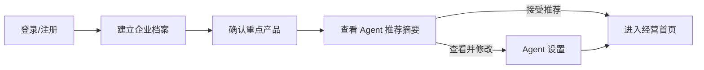
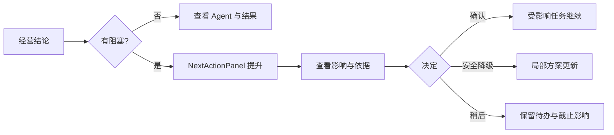
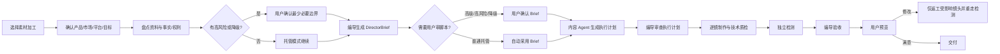
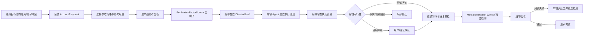
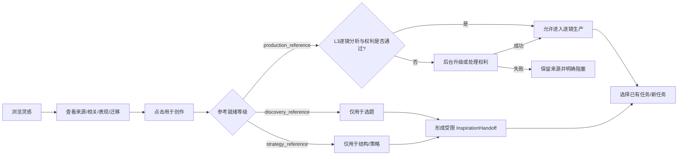
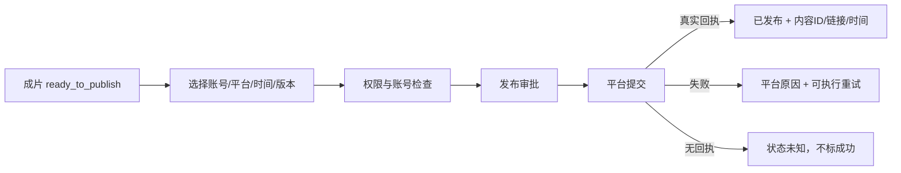

# 灵枢 AI 前端信息架构与交互设计规格 v2.0

> 文档性质：产品信息架构、交互流程、组件行为与视觉排版的实施规格
> 更新日期：2026-09-26
> 适用对象：产品经理、UX/UI 设计师、前端工程师、测试与验收人员
> 业务依据：`PRD-灵枢AI前端交互-v1.md`、`PRD-灵枢AI当前系统-v3.md`
> 视觉基础：`灵枢AI前端设计规范-v1.md`
> 原型用途：`/design-prototype` 仅用于验证本文规则，不是本文的替代品

---

## 0. 如何使用这份规格

这份文档回答五类实施问题：

1. **信息怎么归类**：一个对象放在哪个页面、属于哪个层级、与什么信息并列。
2. **页面怎么排布**：标题、结论、主视觉、商品、状态、按钮、证据和历史分别放在哪里。
3. **流程怎么推进**：用户从哪里进入、每一步看到什么、何时需要确认、失败后如何恢复。
4. **组件怎么响应**：每个按钮、表单、卡片、弹窗在 Hover、按下、加载、禁用、失败时如何表现。
5. **视觉怎么统一**：字体、字号、行高、间距、色彩、圆角、图像与响应式如何落地。

实施优先级：

| 等级 | 含义 | 实施要求 |
| --- | --- | --- |
| P0 | 影响任务完成、真实性或权限安全 | 上线前必须满足，不得用视觉近似替代 |
| P1 | 影响效率、理解或跨页面一致性 | 首个完整版本必须满足 |
| P2 | 体验增强 | 可分期，但不得破坏 P0/P1 规则 |

发生冲突时按以下顺序处理：业务真实性与安全边界 → 用户任务完成 → 本文交互规则 → 视觉表现 → 动效装饰。

---

## 1. 产品体验定义

### 1.1 用户是谁

核心用户不是专业运营、剪辑师或 AI 工程师，而是：

- 时间有限、希望快速知道经营状态的企业老板。
- 不熟悉 AI、视频制作和复杂 SaaS 的一线员工。
- 需要对发布、预算、事实和客户承诺负责的审批人。
- 负责少量专业调整，但不应被迫理解模型或供应商的运营人员。

### 1.2 用户每次进入系统只需要回答四个问题

1. 现在发生了什么？
2. 系统正在替我做什么？
3. 有没有事情必须由我处理？
4. 处理后会影响什么？

页面如果不能在 5 秒内回答其中至少前三个问题，就说明信息结构需要重新整理。

### 1.3 产品体验目标

| 目标 | 用户感受 | 对应界面规则 |
| --- | --- | --- |
| 清楚 | 不需要阅读日志就能知道状态 | 先结论，后对象，再操作，最后证据 |
| 可信 | 系统不伪造进度、事实和回执 | 所有状态带对象、来源与更新时间 |
| 可控 | AI 主动工作，但边界明确 | 事实、权利、预算和对外动作有显式闸门 |
| 克制 | 页面不被说明文字和按钮淹没 | 每个区域一个问题，每页一个最高强调操作 |
| 可恢复 | 失败不等于任务丢失 | 保留已确认数据，说明原因和恢复动作 |

### 1.4 信息优先级

任何页面信息先按“是否改变用户下一步”排序，再按业务层级排序：

| 层级 | 信息 | 是否默认展示 | 示例 |
| --- | --- | --- | --- |
| L0 | 当前结论与必须处理事项 | 必须 | “镜头 04 缺事实，其他镜头继续制作” |
| L1 | 当前对象与任务进度 | 必须 | 产品、视频、客户、Agent、已完成 3/6 |
| L2 | 判断依据与影响范围 | 摘要展示 | 事实来源、受影响镜头、预计耗时 |
| L3 | 日志、模型、供应商、原始数据 | 默认隐藏 | 原始事件、提示词、内部评分、调用记录 |

L3 只能进入抽屉、弹窗、折叠区或管理员诊断页面，不能与主任务争夺首屏注意力。

---

## 2. 用户角色与界面权限

### 2.1 角色视角

| 角色 | 首要任务 | 默认可见操作 | 默认隐藏操作 |
| --- | --- | --- | --- |
| 老板/负责人 | 看经营结论、批准关键动作 | 目标、例外、结果、审批 | 模型、素材技术参数、原始日志 |
| 社媒运营 | 管理灵感、制作、发布与复盘 | 内容任务、逐镜、版本、渠道 | 组织权限、平台管理员能力 |
| 客服/销售 | 处理客户、回复、报价与跟进 | 会话、客户意向、下一步 | 社媒制作细节、广告配置 |
| 审批人 | 判断风险和影响 | 审批对象、依据、影响、决定 | 不相关任务与内部技术步骤 |
| 管理员 | 管理知识、集成、权限与诊断 | 系统配置、审计、失败诊断 | 无权限租户或其他组织数据 |

### 2.2 权限表达

- 无权限的导航项默认不展示，不用灰色项目诱导点击。
- 从深链进入无权限页面时，展示“权限不足”状态页，说明所需角色和返回路径。
- 因账号未连接、资料未就绪而暂不可用的功能可以展示，但必须说明解锁条件。
- 禁用按钮必须对应“当前条件暂不满足”，Hover/Focus 时通过 Tooltip 说明原因；永久无权限操作不显示按钮。

---

## 3. 全局信息架构

### 3.1 页面树

```text
灵枢 AI
├─ 导航外流程
│  ├─ 登录 / 注册
│  └─ 首次配置：企业档案 → 重点产品 → 推荐设置
├─ 生产导航（登录后的左侧导航）
│  ├─ 智能经营
│  │  ├─ 经营首页
│  │  ├─ 周目标
│  │  ├─ Agent 设置
│  │  └─ 实时执行与复盘
│  ├─ 社媒运营
│  │  ├─ 灵感中心：灵感发现 / 我的素材 / 拍摄任务
│  │  ├─ 内容制作：素材加工 / 爆款裂变（仅入口，不是两套任务主数据）
│  │  ├─ 发布与渠道
│  │  └─ 内容监控
│  ├─ 平台投放：投放总览 / 投放计划 / AI 托管
│  ├─ 客户管理：智能客服 / 会话 / 报价 / 订单
│  ├─ 智能体管理：企业知识库 / 记忆 / 定时任务
│  └─ 系统设置：渠道 / 集成 / 组织与权限 / 管理员能力
├─ 任务子路由（不占一级导航）
│  ├─ 统一内容任务 ReplicationJob
│  │  ├─ 上下文与输入
│  │  ├─ 参考/因素（素材加工可跳过）
│  │  ├─ DirectorBrief
│  │  ├─ ContentExecutionPlan 与计划审查
│  │  ├─ 逐镜制作与技术质检
│  │  ├─ 独立检测与编导验收
│  │  └─ 用户验收与交付
│  └─ 审批、发布、客户、报价与订单详情
└─ 原型专用路由（仅开发环境）
   └─ /design-prototype：UI 规范与交互验证，不进入生产导航
```

“素材加工”和“爆款裂变”是统一 `ReplicationJob` 的两个创建模式；进入任务后共享同一任务 ID、版本链、阶段路由、事件流和验收链。不得为二者建立互不兼容的第二套主数据、状态或回执模型。

### 3.2 导航分组原则

- 一级导航按用户认识的业务对象分组，不按后端服务或 Agent 名称分组。
- “Agent 设置”属于智能经营，因为用户设置的是经营协作方式；“企业知识库”属于智能体管理，因为它是跨 Agent 共用资产。
- “灵感中心”只负责发现、理解和引用，不承担脚本、分镜和成片制作。
- “内容制作”只保留素材加工和爆款裂变两个入口；立即/每周只是执行频率。
- 删除的“爆款公式”不得残留导航、空白页、按钮、深链入口或面包屑。

### 3.3 页面层级

| 层级 | 页面类型 | 示例 | 导航行为 |
| --- | --- | --- | --- |
| 一级 | 业务首页 | 经营首页、灵感中心、内容制作 | 左侧导航可直接进入 |
| 二级 | 列表/工作台 | 发布列表、客户列表、任务列表 | 面包屑保留一级入口 |
| 三级 | 任务/对象详情 | 素材加工任务、爆款裂变任务 | 返回时恢复筛选、页码和滚动位置 |
| 临时层 | Drawer/Dialog | 调整范围、Agent 详情、审批 | 不改变左侧导航选中态 |

### 3.4 路径与上下文保持

- 从经营首页点击异常进入任务详情时，详情页顶部显示来源：“从经营首页 · 待处理事项进入”。
- 从灵感中心“用于创作”进入内容任务时，保留 `InspirationHandoff`，返回后恢复原查询快照、页码和滚动位置。
- 浏览器返回应回到用户刚才的业务上下文，不能强制返回固定首页。
- 切换租户或账号后清空前一租户的最近页面、筛选和对象 ID，回到经营首页。

---

## 4. 全局页面骨架与信息规整

### 4.1 阻塞态桌面页面骨架

下图用于“当前存在必须立即处理的阻塞/审批”的页面。正常态不得机械照搬 L0/L1 顺序，应按 4.4 的规则先呈现当前对象/Agent，再呈现下一步。

```text
┌────────── 232px ──────────┬──────────────────── 顶栏 64px ────────────────────┐
│ 品牌                       │ 面包屑 / 当前页面            全局状态 / 通知 / 用户 │
├───────────────────────────┼─────────────────────────────────────────────────────┤
│ 一级导航                   │ 页面标题 H1                          辅助元信息       │
│ - 当前分组                 │ 一句话结论/说明                                        │
│ - 当前页面                 ├─────────────────────────────────────────────────────┤
│                            │ 任务上下文条：产品 / 市场 / 平台 / 对象 / 目标        │
│                            ├─────────────────────────────────────────────────────┤
│                            │ L0 当前结论 / 唯一下一步                              │
│                            ├─────────────────────────────────────────────────────┤
│                            │ L1 当前对象 / 主视觉 / Agent / 列表                   │
│                            ├─────────────────────────────────────────────────────┤
│ 用户与组织                 │ L2 证据摘要 / 次级结果 / 历史                         │
└───────────────────────────┴─────────────────────────────────────────────────────┘
```

### 4.2 页面头部

页面头部只能包含：

1. 面包屑或返回路径。
2. 一个 H1。
3. 一句状态结论或页面说明，最多两行。
4. 必要的更新时间、范围或状态。
5. 最多一个与页面级任务直接相关的操作。

帮助、分享、导出、复制链接等低频操作进入“更多”菜单。页面级主操作如果属于当前结论，应放在结论面板，不固定塞到右上角。

### 4.3 注意力顺序

| 视线 | 用户要看到什么 | 位置 | 视觉手段 |
| --- | --- | --- | --- |
| 第一眼 | 当前结论或阻塞 | 内容区左上、标题下 | H1/重点面板，最多一个强调色 |
| 第二眼 | 当前业务对象 | 结论下方或右侧 | 商品、视频、客户、任务或 Agent 卡 |
| 第三眼 | 唯一下一步 | 与结论相邻 | 单个 Primary Button |
| 第四眼 | 影响和证据摘要 | 主操作附近 | 12–14px 次级文字、短标签 |
| 第五眼 | 历史和技术细节 | 页面下半区或 Overlay | 折叠、抽屉、弹窗 |

### 4.4 动态排序规则

页面顺序不是机械固定，而由“是否需要用户立即处理”决定：

- **正常态**：结论 → Agent/当前对象 → 下一步 → 结果 → 历史。
- **有阻塞/审批**：结论 → 唯一下一步与受影响对象 → Agent/当前对象 → 结果 → 历史。
- **失败态**：失败对象与已保留成果 → 原因 → 恢复动作 → 未受影响内容。
- **完成态**：结果与回执 → 下一步建议 → 过程与历史。

发生动态提升时，界面必须说明“为什么现在优先显示”，处理完成后恢复正常顺序。

### 4.5 内容放置决策表

| 内容 | 放哪里 | 不应放哪里 |
| --- | --- | --- |
| 页面标题 | 内容区左上 | 居中 Hero、卡片内部、侧栏顶部重复 |
| 主视觉 | 需要评估对象时放在标题下；任务型页面可用状态面板替代 | 纯装饰 Hero、与当前决策无关的大图 |
| 商品卡 | 商品影响当前任务时放在上下文或结论右侧 | 每张任务卡重复完整商品资料 |
| 主按钮 | 与当前结论/下一步相邻 | 页面右上固定位置、多个卡片同时高亮 |
| 异常 | 下一步之后、普通结果之前 | 日志底部、Toast 后消失 |
| 证据 | 摘要在当前对象附近，完整证据进抽屉 | 与结论同字号平铺全部字段 |
| 日志 | Agent 详情或任务诊断 | 首页首屏 |
| 模型/提示词/供应商 | 高级诊断 | 普通用户默认流程 |

### 4.6 信息密度限制

- 首屏最多：1 个 H1、1 个结论、1 个 Primary、3 个辅助信息组。
- 一个卡片只回答一个问题；卡片内主操作最多一个。
- 卡片标题 8–16 个汉字；描述默认两行，超过后进入详情。
- 同一状态不得同时在页头、卡片、Toast 和固定底栏重复表达。
- 一个字段只在最相关位置出现一次；其他页面通过引用或上下文条展示摘要。

---

## 5. 字体与排版系统

### 5.1 字体家族

```css
--font-display: "SF Pro Display", "PingFang SC", "Noto Sans SC", system-ui, sans-serif;
--font-sans: "SF Pro Text", "PingFang SC", "Noto Sans SC", system-ui, sans-serif;
--font-mono: "SFMono-Regular", "DM Mono", ui-monospace, monospace;
```

- 中文界面以苹方/思源黑体/系统字体为主，不额外加载装饰性中文字体。
- `font-display` 只用于 Display、H1 和关键结果数字。
- `font-mono` 只用于任务 ID、版本、代码、时间码和需纵向对齐的数字。

### 5.2 字体 Token

| Token | 桌面 | 移动 | 行高 | 字重 | 使用场景 |
| --- | --- | --- | --- | --- | --- |
| Display | 40px | 30px | 1.15 | 700 | 空状态、关键完成结果；普通后台页慎用 |
| H1 | 30px | 26px | 1.25 | 700 | 每页唯一标题 |
| H2 | 22px | 20px | 1.35 | 700 | 一级区块、重点结论 |
| H3 | 17px | 16px | 1.45 | 600–700 | 卡片组、弹窗标题 |
| Body L | 16px | 16px | 1.65 | 400–500 | 结论、重要说明 |
| Body | 14px | 14px | 1.6 | 400–500 | 默认正文、表单和按钮 |
| Body S | 13px | 13px | 1.55 | 400–500 | 密集卡片辅助说明，不承载关键操作 |
| Caption | 12px | 12px | 1.5 | 500–600 | 元数据、更新时间、辅助标签 |
| Micro | 11px | 11px | 1.4 | 600 | 时间码、序号、单位；不得承载关键内容 |
| KPI | 24–32px | 22–28px | 1.1 | 700 | 真实关键数值，使用等宽数字 |

### 5.3 中文排版规则

- H1 最多两行；桌面建议不超过 24 个汉字，移动端不超过 18 个汉字。
- 正文建议每行 28–38 个汉字，阅读宽度 560–680px。
- 中文正文不使用全大写或过宽字距；英文短标签可使用大写并增加 `0.08em` 字距。
- 中文与英文/数字之间由浏览器自然排版，不手工插入多余空格。
- 标题末尾不加句号；状态结论使用完整句子时可不加句号。
- 数据使用等宽数字：`font-variant-numeric: tabular-nums`。
- 禁止用浅灰小字承载错误原因、审批影响、价格、权限或真实性信息。
- 字重只使用 400/500/600/700；不使用依赖字体合成的 650/750/800。
- 正文建议 `line-break: strict; word-break: normal; overflow-wrap: break-word`。
- 中文正文及标题保持 `0` 到 `-0.02em` 字距，不使用过度紧缩的负字距。

### 5.4 截断与展开

| 内容 | 默认行为 | 展开方式 |
| --- | --- | --- |
| 页面标题 | 最多两行，不截断关键对象名 | 改写文案，不提供 Tooltip 兜底 |
| 卡片标题 | 两行截断 | 点击卡片进入详情 |
| 单行状态 | 单行省略 | Hover/Focus Tooltip 展示完整文案 |
| 表格单元格 | 单行省略 | Tooltip；重要字段可固定列宽 |
| 说明正文 | 两行后“查看说明” | 原地折叠展开，不弹新页面 |
| ID/链接 | 中间截断 | 点击复制；Tooltip 显示完整值 |

---

## 6. 色彩、间距与布局 Token

### 6.1 核心色彩

| Token | 色值 | 用途 |
| --- | --- | --- |
| `forest-900` | `#173D31` | 主文字、品牌深色底 |
| `forest-700` | `#27604D` | 次强调、图标 |
| `mint-700` | `#117F51` | Primary、焦点、绿色小字号前景 |
| `mint-600` | `#178B72` | 内容 Agent 身份、图形装饰 |
| `mint-100` | `#EAF6F2` | 选中、信息背景 |
| `canvas` | `#F4F7F2` | 应用背景 |
| `surface` | `#FFFFFF` | 卡片、弹窗 |
| `cream` | `#FFF5DE` | 待确认、温和提醒 |
| `coral` | `#DF765B` | 洞察装饰，不承载白色小字 |
| `coral-text` | `#A45A3B` | 洞察文字 |
| `border` | `#DDE7E1` | 默认边框 |
| `control-border` | `#7D8E85` | 输入框、选择器及仅靠轮廓识别的交互控件边界；对白底对比度 ≥3:1 |
| `text-2` | `#52665E` | 次级正文 |
| `text-3` | `#617169` | 元数据和辅助文字 |

正文和按钮文字对比度至少 4.5:1；大字号至少 3:1。状态不得只靠颜色区分。

`border` 只用于卡片分组、分割线等非交互结构；当控件边界是识别控件的唯一线索时必须使用 `control-border`，也可用达到同等对比度的填充或下划线补足。Focus 仍统一使用 `mint-700`，不能只把浅结构边框加粗作为焦点提示。

### 6.2 Agent 身份色与语义色分离

| 对象 | 身份色 | 允许使用位置 |
| --- | --- | --- |
| 经营 Agent | `#6745A5` | 图标、2–3px 状态线、进度 |
| 编导 Agent | `#356CAE` | 同上 |
| 内容 Agent | `#117F51` | 同上 |
| 客服 Agent | `#A85F28` | 同上 |

Agent 色只表达“谁在工作”，成功/等待/异常仍使用统一语义色和文字。不得给整张卡铺高饱和 Agent 色。

### 6.3 间距、尺寸和圆角

```text
间距：4 / 8 / 12 / 16 / 20 / 24 / 32 / 40 / 48 / 64
控件高度：S 32 / M 40 / L 48；移动端触控目标最小 44×44
圆角：控件 10 / 标准卡片 14 / 重点面板与弹窗 18 / 状态胶囊 999
```

| 场景 | 规则 |
| --- | --- |
| 桌面侧栏 | 展开 232px，收起 72px |
| 顶栏 | 桌面 64px，移动 56px |
| 内容最大宽度 | 1440px |
| 内容左右内边距 | 桌面 32px，平板 24px，移动 16px |
| 区块间距 | 32px |
| 相关卡片间距 | 12–16px |
| 标准卡片内边距 | 20px；移动 16px |
| 阅读型内容宽度 | 760–960px |

### 6.4 栅格

| 断点 | 栅格 | Gutter | 典型布局 |
| --- | --- | --- | --- |
| ≥1280 | 12 列 | 24px | 4 Agent、主内容 8 + 侧栏 4 |
| 768–1279 | 8 列 | 20px | 2 Agent、主内容 5 + 侧栏 3 |
| <768 | 4 列 | 16px | 单列；指定区域可横向滚动 |

### 6.5 卡片视觉

- 默认使用 1px 边框区分层级，不使用大面积阴影。
- Hover 只改变边框和浅背景，不向上位移。
- 阴影只用于 Drawer、Dialog、Popover 和固定操作条。
- 同组卡片高度尽量一致，但不为对齐强行留大面积空白。
- 卡片整卡可点击时，卡内不得再嵌套多个冲突主操作。

### 6.6 图像、图标与动效

- 商品图优先 1:1 或 4:3；视频封面 16:9；竖视频预览 9:16。
- 图像必须标识“客户素材 / 外部参考 / 授权素材 / AI 生成 / 演示数据”。
- 图标统一 Lucide，常规 18px，卡片 20px，空状态 28–32px，线宽 1.75–2px。
- 动效时长：微交互 120–180ms，Overlay 180–240ms，禁止超过 400ms 的常规界面动画。
- 动效不得改变布局，不得遮挡文字；`prefers-reduced-motion` 下停用循环、旋转和大位移。

图像比例与适配：

| 类型 | 比例 | 适配方式 |
| --- | --- | --- |
| 灵感/视频封面 | 16:9 | `cover`，主体不得被文字层遮挡 |
| 商品生活方式图 | 4:3 或 1:1 | `cover` |
| 商品包装/视觉锚点 | 4:3 或 1:1 | 优先 `contain`，不得裁掉包装与标识 |
| 竖版短视频 | 9:16 | 播放器内 `contain`，中性深色底 |
| 横版成片 | 16:9 | `contain` 或按播放器规则适配 |
| 镜头缩略图 | 与最终交付画幅一致 | 不拉伸 |

---

## 7. 基础组件完整交互规格

### 7.1 Button

#### 类型

| 类型 | 用途 | 每个区域数量 |
| --- | --- | --- |
| Primary | 当前唯一下一步、确认保存 | 页面最多 1 个明显 Primary |
| Secondary | 同层非主要操作 | 可多个，但不与 Primary 争夺强调 |
| Tertiary | 返回、取消、查看依据 | 按需 |
| Danger | 删除、撤销不可逆动作 | 只在危险操作确认区 |
| Icon | 工具栏低频动作 | 必须有可访问名称与 Tooltip |

#### 尺寸

| 尺寸 | 高度 | 水平内边距 | 字号 | 图标 |
| --- | --- | --- | --- | --- |
| S | 32px | 12px | 12px | 14px |
| M | 40px | 16px | 14px | 16px |
| L | 48px | 20px | 14–16px | 18px |

移动端任何可点击目标不得小于 44×44px。

#### 状态与行为

| 状态 | 视觉 | 行为 |
| --- | --- | --- |
| Default | 稳定背景、文字和图标 | 可点击 |
| Hover | 背景加深约 6%，边框增强 | 不位移、不增加重阴影 |
| Pressed | 背景再加深，阴影减弱 | 立即提供按下反馈 |
| Focus-visible | 3px 半透明焦点环，距控件 2px | 只对键盘导航稳定可见 |
| Loading | 保留原宽度，显示 Spinner + 动作对象 | 禁止重复点击；文案如“正在保存设置” |
| Disabled | 降低对比度，无阴影 | 不响应点击；若原因重要，提供 Tooltip |
| Success | 短暂显示 Check 与结果文案 | 1–2 秒后恢复或进入下一状态 |
| Error | 保持可重试，不抖动 | 在按钮附近显示原因，不只发 Toast |

按钮文案必须是“动词 + 对象”：`开始制作`、`确认事实边界`、`保存 Agent 设置`。禁止使用没有上下文的“确定”“提交”“好的”。

### 7.2 Link 与文字按钮

- 页面导航使用 Link；当前页面内展开、排序、切换使用 Button。
- Link 的 `default / hover / pressed / focus-visible` 分别为可辨识文字、下划线或颜色加深、短暂按下反馈、与 Button 相同的焦点环。
- Link 不承载异步命令，因此 `loading / disabled / success / error` 为 N/A；需要这些状态的文字外观操作必须实现为 Tertiary Button。不可达的导航不渲染带 `href` 的假 Disabled Link，而应显示普通文本并说明条件。
- “查看详情”“为什么出现”“查看依据”属于 Tertiary，不使用 Primary 外观。
- 外链显示 ExternalLink 图标，并在可访问名称中说明“将在新窗口打开”。

### 7.3 Icon Button

- 桌面默认 40×40px，移动 44×44px。
- 只使用行业通用图标；不明确的操作同时显示文字。
- Hover 显示 Tooltip，延迟 400–600ms；键盘 Focus 立即显示。
- 删除、停止、断开等危险图标不能无确认直接执行。
- Icon Button 完整继承 Button 的 `default / hover / pressed / focus-visible / loading / disabled / success / error` 八态；Loading 时不得只用无名称 Spinner，必须保留可访问动作名称。

### 7.4 Input / Textarea / Select

| 状态 | 视觉与文案 |
| --- | --- |
| Default | 标签在上，输入区 40–48px，高对比边框 |
| Hover | 边框略加深 |
| Focus | 品牌绿边框 + 3px 焦点环 |
| Filled | 保持标签，不用 placeholder 替代标签 |
| Disabled | 浅背景；说明为什么不可编辑 |
| Readonly | 正常可读，显示锁定/来源；不可伪装成 Disabled |
| Error | 红色边框 + 字段下错误 + 修复方式 |
| Success | 仅在异步校验必要时使用，不给每个字段加绿色勾 |

- 表单错误在字段失焦或提交后出现，不在用户输入第一个字符时打断。
- 提交失败自动滚动并聚焦第一个错误字段。
- 必填通过“必填”文字或区块说明表达，不堆叠红色星号。
- 默认值必须标注来源，如“根据企业档案推荐”。
- Select 适用于有限选项；可搜索且超过 8 项时使用 Combobox。

### 7.5 Checkbox / Radio / Switch

- Checkbox 用于可多选项目；Radio 用于互斥且选项同时可见；Select 用于选项多或空间有限。
- Switch 只用于独立、低风险、可安全回滚且切换后立即生效的二元偏好，例如“显示桌面通知”。服务端未确认前保持 Pending，失败恢复原值并就近说明。
- Agent 设置中的真实发布/发送、预算、权限或审批边界不得使用立即生效 Switch；使用 staged Checkbox、Radio 或 Choice 写入草稿，只有用户执行“保存设置”并完成影响确认、服务端原子返回新活动版本后才生效。
- 强制规则使用选中且锁定的 Checkbox + “强制”标签，不显示无效开关。

### 7.6 Tabs

- 一级 Tabs 改变同一业务对象视图，例如“灵感发现 / 我的素材 / 拍摄任务”。
- 二级 Tabs 只改变同一列表的排序或解释，例如“最近发现 / 正在起量 / 高度相关 / 创新参考”。
- Tabs 不用于按步骤推进流程；步骤流程使用 Stepper。
- 本地且能即时呈现的面板使用自动激活：左右箭头/Home/End 移动焦点并立即选中；涉及远程加载或重计算时使用手动激活：方向键只移动焦点，Enter/Space 才选中。Tab 只进入/离开 Tablist。
- Tab 的 `default / hover / pressed / focus-visible` 均需设计；当前项使用独立 `selected` 状态，不得复用 Pressed。`disabled` 使用 `aria-disabled="true"` 并可被方向键跳过；Disabled 原因必须可发现。
- Tab 本身不显示 Success/Error；结果状态属于对应 Panel 或数量徽标。激活远程 Panel 时，Panel 显示 Loading + `aria-busy`；失败在 Panel 内显示 Error 与重试，Tab 仍可切走。Panel 加载不锁定整个 Tablist。
- 移动端允许横向滚动，但当前项必须完整可见。

### 7.7 Card

卡片解剖顺序：

1. 对象名称与来源。
2. 当前状态。
3. 一句结论。
4. 最少必要证据。
5. 一个主操作或整卡进入详情。

整卡交互必须先确定一种原生语义：

- `button-card` 执行页内命令或打开 Overlay，支持 Enter/Space。
- `link-card` 导航到新页面，只由 Enter 激活；Space 保持浏览器滚动语义。
- 卡内“更多”必须阻止冒泡；若嵌套交互超过一个，不再使用整卡点击，改为明确标题 Link 和操作 Button。

交互卡的 `default / hover / pressed / focus-visible` 作用于整卡；`selected/current` 是独立持久状态。`loading` 保留卡片尺寸并标记 Busy；`disabled` 说明不可用条件；`success/error` 在状态区表达业务结果而不是仅改变整卡颜色。不可点击卡片不使用手型指针和 Hover 边框，八态均为 N/A。

### 7.8 StatusPill

- 高度 24–28px，结构为图标/圆点 + 状态文字。
- 状态文案必须包含对象或紧邻对象，如“等待事实确认”，不能只写“等待中”。
- 运行态可使用轻量呼吸点；等待、失败、断线不动画。
- Pill 不承载长错误原因；原因放在 `StateNotice` 或详情。
- StatusPill 是非交互语义展示，因此 `hover / pressed / focus-visible / disabled` 为 N/A；若可点击必须组合成带 Pill 外观的 Button 并继承 Button 八态。`loading / success / error` 是业务状态值，必须同时有文字与图标，不能当作瞬时交互轴。

### 7.9 Toast

| 类型 | 使用条件 | 时长 |
| --- | --- | --- |
| Success | 可撤销或结果已在页面可见的轻量成功 | 3–4 秒 |
| Info | 后台动作已开始且页面已有持续状态 | 4 秒 |
| Warning | 非阻塞风险 | 5–6 秒 |
| Error | 只有页面无法就近显示错误时 | 保持至关闭或提供重试 |

审批失败、保存失败、发布失败等不能只依赖 Toast；必须在相关对象附近保留可恢复错误。

- Toast 容器没有 Pressed/Disabled；其关闭、撤销、重试均为标准 Button，具有完整八态。
- 自动消失 Toast 在 Pointer Hover、键盘焦点进入或窗口失焦时暂停计时；离开后从剩余时长继续，不重新计算整段时长。
- 每条 Toast 有明确关闭按钮；键盘可 Tab 到并用 Enter/Space 关闭，触控可点按关闭。可选的滑动关闭不能成为唯一方式。
- Success/Info 使用 `role="status"` 或 `aria-live="polite"`；需要立即知晓且无法就近呈现的 Error 可用 `role="alert"`，禁止重复播报页面已呈现的同一错误。
- Loading Toast 原则上 N/A；长任务应进入持续任务状态。若仅用于连接建立，必须可转为 Success/Error 并可从任务中心找回。

### 7.10 Drawer / Dialog / Popover

| 组件 | 使用场景 | 宽度/行为 |
| --- | --- | --- |
| Drawer | 需要对照当前页的信息、筛选、任务详情 | 桌面 420–560px；移动全屏 |
| Dialog | 短决策、确认、单对象详情 | 480–720px；内容不宜超过一屏半 |
| Popover | 短菜单、日期、轻量选择 | 不承载关键流程 |

Modal Drawer/Dialog 规则：

- 普通信息 Overlay 打开后焦点进入标题或第一个控件；删除、发布、发送、付费等危险 Dialog 的初始焦点放在“取消/返回”等最不破坏的操作。
- Tab 焦点锁定在 Overlay 内；Esc 关闭非危险 Overlay。
- 关闭后焦点回到触发按钮。
- 标题和关闭按钮固定，内容滚动，操作区固定。
- 有未保存更改时，关闭触发“保存 / 放弃 / 继续编辑”确认。
- 删除或发布等危险确认不可通过点击遮罩关闭。
- 危险 Dialog 在用户尚未检查影响范围、勾选确认或完成必要输入前，Enter 不得直接触发危险主操作。
- Drawer/Dialog 的触发器继承 Button 八态；Modal 状态为 `closed → opening → open → submitting`，确认成功走 `success → closing`，已确认失败走 `error → open(error)` 并保留输入与焦点，响应未知走 `open(status_unknown/reconciling)` 并显示持续状态，不能关闭后伪装成失败或取消。内容 Loading 时保持壳层和关闭说明，Disabled 为 N/A。

Popover 不使用 Modal 焦点锁，也不使页面背景 Inert。它按内容采用 `menu / listbox / grid / dialog` 中对应的 ARIA 模式：Esc 或外点关闭并恢复到触发器；Tab 按该模式关闭后继续页面顺序；方向键、Enter/Space 只遵循具体模式，不能套用 Dialog 键盘规则。关键不可逆流程不得放在 Popover。

### 7.11 Loading / Empty / Error / Offline

| 状态 | 必须回答 | 主操作 |
| --- | --- | --- |
| Loading | 正在加载什么 | 通常无；超过 8 秒显示“仍在处理/后台继续/查看状态”；只有服务端支持且能确认取消时才显示“取消” |
| Empty | 为什么为空，是首次还是筛选结果为空 | 创建、导入或清除筛选之一 |
| Error | 哪个对象失败、原因、已保留什么 | 重试、修改输入或联系管理员 |
| Offline | 最后确认状态和时间、是否自动重连 | 手动重连；不清空已有内容 |
| Permission | 缺什么权限、谁可以授权 | 返回或申请权限 |
| Completed | 结果和回执在哪里 | 查看结果或进入下一业务动作 |

加载时不能先闪现错误的 0。列表刷新失败时保留旧数据和查询条件；局部失败不能替换整个页面。

### 7.12 Table / List / Pagination

- 决策型内容优先卡片；高密度比较和管理任务使用表格。
- 表头在长列表中吸顶；首列为对象，末列为操作。
- 行操作超过两个时收进“更多”。
- 分页用于稳定库存，每页 20–30 条；总数、页码、筛选必须来自同一查询快照。
- 翻页失败保留当前页并在分页附近显示重试，不能把列表清空。
- 可排序表头使用原生 Button 与 `aria-sort`；Enter/Space 切换排序，Focus-visible 清晰可见。Hover/Pressed 只作用于可排序表头，不误导静态表头。
- 行选择使用首列 Checkbox；Shift 可连续选择时必须同时提供“全选本页/清除选择”。键盘通过 Tab 到 Checkbox 和行内操作，不把整行做成不可预测的 Tab Stop。
- 若整行用于导航，则遵循 Link Row 的 Enter 语义；存在嵌套操作时改用明确标题 Link。上下箭头只用于声明了 Grid 语义并实现完整 Roving Focus 的高密度控件，普通 Table 不截获浏览器方向键。
- `loading` 首次使用 Skeleton、刷新保留旧快照并 Busy；`disabled` 仅作用于具体行操作；`success/error` 就近标识受影响行。Empty/Error/Offline 不伪装成一行数据。分页按钮继承 Button 八态。

### 7.13 Select / Combobox

状态流：`closed → open → highlighted → selected → closed`。

- 选项不超过 8 个且无需搜索时优先原生 Select。
- 选项多、需要搜索或远程加载时使用 Combobox/Listbox。
- 加载选项时显示“正在读取选项”，不能先闪现“无结果”。
- 加载失败保留原选值并提供就地重试。
- 原生 Select 保留浏览器/操作系统键盘行为，不用脚本重写。
- 只读 SelectButton + Listbox：Enter/Space/Alt+↓ 打开，↑↓ 与 Home/End 移动，Enter/Space 选择，Esc 关闭并恢复打开前已提交值，Tab 关闭并继续页面顺序。
- 可编辑 Combobox：输入字符（包括 Space）只编辑查询；↓ 打开或移动候选，Enter 选择高亮项，Esc 只关闭候选层且不无条件清空/回滚已输入文字，Tab 离开且不强制选择仅被高亮的候选。
- 多选标签的删除按钮具有明确名称和至少 44px 触控命中区。

### 7.14 Skeleton

- Skeleton 只用于首次加载，不用于刷新和分页。
- 形状和尺寸匹配最终布局，避免内容跳动。
- 刷新时保留旧数据，只显示局部同步状态。
- 容器设置 `aria-busy="true"`，Skeleton 本身 `aria-hidden="true"`。
- 超时后转换为 Error/Offline，不无限播放闪烁动画。
- Reduced Motion 下关闭闪烁，只保留静态浅色块。

### 7.15 业务复合组件

| 组件 | 默认内容 | 主交互 | 关键状态 |
| --- | --- | --- | --- |
| NextActionPanel | 原因、对象、影响、唯一下一步 | Primary 执行，Tertiary 看依据 | 等待、提交、成功、失败、过期 |
| AgentLiveStatusRail | 四 Agent 名称、状态、动作、进度、时间 | 点击整卡打开单 Agent | 无任务、排队、运行、等待、完成、异常、断线 |
| ApprovalCard | 对象、版本、影响、依据、截止 | 批准/退回/稍后 | Pending、Submitting、Expired、Stale |
| ProductContextCard | 图片、产品、市场、事实就绪度 | 打开只读详情 | Ready、NeedsFacts、Outdated |
| InspirationCard | 来源、表现、相关、迁移、权利 | 用于创作 | 待分析、升级中、可用、失败、权利不清 |
| ShotCompareCard | 参考、客户版本、作用、证据、可行性 | 修改/重做单镜头 | 完整、等价、降级、阻断、制作、验收失败 |

### 7.16 组件八态适用总表

`✓` 表示必须出设计与实现；`Panel/子控件` 表示状态由内部对象承载；`N/A` 表示不适用，禁止为了凑状态创造误导反馈。

| 组件 | Default | Hover | Pressed | Focus | Loading | Disabled | Success | Error |
| --- | --- | --- | --- | --- | --- | --- | --- | --- |
| Button / Icon Button | ✓ | ✓ | ✓ | ✓ | ✓ | ✓ | ✓ | ✓ |
| Link | ✓ | ✓ | ✓ | ✓ | N/A | N/A | N/A | N/A |
| Input / Textarea | ✓ | ✓ | N/A | ✓ | 异步校验后缀 | ✓ | 必要时 | ✓ |
| Checkbox / Radio / Switch | ✓ | ✓ | ✓ | ✓ | 远程切换时 | ✓ | ✓ | ✓ |
| Tabs | ✓ | ✓ | ✓ | ✓ | Panel | ✓ | Panel | Panel |
| Interactive Card | ✓ | ✓ | ✓ | ✓ | ✓ | ✓ | 状态区 | 状态区 |
| Static Card | ✓ | N/A | N/A | N/A | ✓ | N/A | 状态区 | 状态区 |
| StatusPill | ✓ | N/A | N/A | N/A | 语义值 | N/A | 语义值 | 语义值 |
| Toast | ✓ | 暂停计时 | 子控件 | 子控件 | 仅连接态 | N/A | 类型 | 类型 |
| Drawer / Dialog | Open | N/A | N/A | Modal 焦点锁 | 内容区 | N/A | 成功后关闭 | Error/Unknown 保持打开 |
| Popover | Closed/Open | 内容模式 | 内容模式 | 模式内导航 | 内容区 | 触发器 | 内容区 | 内容区 |
| Table / List | ✓ | 可交互行 | 可交互行 | 子控件 | 保留快照 | 行操作 | 受影响行 | 受影响行 |
| Select / Combobox | ✓ | ✓ | ✓ | ✓ | 远程选项 | ✓ | 必要时 | ✓ |
| Skeleton | N/A | N/A | N/A | N/A | ✓ | N/A | N/A | 超时转 Error |

命令型控件的统一转换是 `ready/rest → hover|focus-visible → pressed → loading → success|error → ready`；`disabled` 不接收 Hover/Pressed。业务持久态 `selected/current/open/checked` 与上述状态正交。Success/Error 必须在对应业务对象附近留下可追溯结果，不能只靠控件闪烁后消失；响应未知则进入 8.7 的对账流程，不能伪装成 Error 后直接重试。

---

## 8. 产品级交互规则

### 8.1 唯一主操作

- 一页可以有多个可点击元素，但只能有一个最高视觉强调操作。
- 主操作随任务阶段改变，但位置稳定且文案明确。
- 固定底部操作条只用于长表单或多阶段任务；不得遮挡最后一项内容。
- 没有用户动作时不制造按钮；状态卡可以整卡进入详情。

### 8.2 保存模型

| 内容类型 | 保存方式 | 反馈 |
| --- | --- | --- |
| 简单偏好 | 自动保存 | 行内“已保存”状态，不弹 Toast |
| 复杂设置 | 显式保存 | 固定保存条显示未保存/保存中/成功/失败 |
| 多阶段任务 | 每一步自动保存草稿 | 顶部显示草稿时间，下一步前校验 |
| 高风险规则 | 显式保存 + 影响确认 | 确认影响范围后生效 |

- 离开有未保存更改的页面时提示保存、放弃或继续编辑。
- 保存中禁止重复提交，但允许用户继续阅读。
- 保存边界按业务一致性划分，而不是按页面区块外观划分。彼此独立的低风险偏好区块允许部分成功，并逐项列出成功项和失败项；失败项保持 Dirty，不用笼统“保存失败”。
- 同一策略或同一 Agent 的审批红线、真实发布/发送开关、预算、权限范围等高风险字段，必须组装为带 `configVersion` 的单个 Payload 原子提交。服务端任一字段失败时整组不生效，活动版本全部保持旧值，绝不出现“发布已开启但审批边界仍是旧值”。
- 高风险设置始终分开展示“正在编辑的草稿版本”和“当前已生效版本”；只有服务端返回新活动版本与审计记录后才显示“已生效”。版本冲突进入比较/合并，不允许字段级静默覆盖。

### 8.3 异步任务

异步动作点击后按以下顺序反馈：

1. 按钮进入 Loading，防止重复提交。
2. 后端接受后，按钮恢复，页面出现持续任务状态。
3. 显示真实阶段或 `已完成 x/y`，不用伪百分比。
4. 用户离开页面后任务继续；全局任务中心可找回。
5. 完成/失败通过页面状态和通知回流。

### 8.4 审批与高风险动作

审批卡必须同时显示：对象、动作、原因、影响范围、证据、发起人/Agent、截止时间和决定。

| 决定 | 按钮层级 | 后续 |
| --- | --- | --- |
| 批准 | Primary | 显示“批准什么”，记录审批人和时间 |
| 修改后批准 | Secondary | 打开最小编辑区；保存即生成新对象版本，重新校验并创建/绑定新审批后再确认 |
| 拒绝 | Danger/Tertiary | 要求选择或填写原因 |
| 稍后处理 | Tertiary | 保留待办并说明截止时间影响 |

发布、真实发送、报价承诺、广告花费、权限扩大等动作必须二次确认，并在成功后展示真实回执。

“修改后批准”绝不能把编辑后的内容写回原 approval/version：任何编辑都使原审批进入 `stale_version`，新版本必须重新执行事实、权利、预算与权限校验，并取得新的审批 ID 或明确绑定到新版本后，才能提交批准决定。

### 8.5 删除与撤销

- 可恢复删除优先进入回收站，并提供 5–10 秒撤销。
- 不可恢复删除必须展示对象名称、影响数量和不可恢复说明。
- 需要输入对象名确认的方式只用于高影响删除，不滥用。
- 删除按钮不与主业务操作并排放在同一视觉层级。

### 8.6 断线与重连

- 断线后保留最后一次已确认数据和时间。
- 状态改为“实时连接中断”，不得继续播放运行动画。
- 自动重连成功后按事件序号补齐；旧响应不得覆盖新事件。
- 重连超过阈值后提供“重新连接”和“查看系统状态”。
- 离线时全局禁用审批、发布、真实发送、付费、删除、权限变更、渠道解绑等不可逆命令，并在按钮附近解释“重新连接并核对最新版本后可执行”。
- 不可逆命令不得进入 Service Worker、客户端 Outbox 或任何离线队列；重连后也不得自动 Replay。用户必须看到服务器最新对象版本并手动重新提交。
- 普通可编辑内容可保存为“本机草稿”，但不得标记为服务端已保存；重连合并出现冲突时先比较再提交。

### 8.7 不可逆和高风险命令

所有不可逆命令都必须具备：服务端权限、对象版本、幂等键、审计记录和真实回执。

- **真实发送**：AI 草稿不等于已发送；发送前展示接收人、渠道和最终文本，只有渠道回执后标成功。
- **报价/订单承诺**：展示价格、币种、税费、交期、有效期和审批版本。
- **广告/付费生成**：确认账户、预算上限、周期、受众和预计费用；超预算重新审批。
- **权限/成员/渠道解绑**：说明会失去的能力、在途任务和数据归属；完成后重新鉴权。
- **状态未知**：优先 Reconcile，不自动 Replay；关闭弹窗、离线或刷新不能让用户误以为命令已取消或成功。
- 请求失败必须区分 `confirmed_not_accepted` 与 `status_unknown`：前者由服务端明确确认未受理，方可复用原业务参数重新提交；后者进入 Reconcile，复用原幂等键查询，禁止产生新键或改变决定后重试。
- 只有对账确认命令未落库且对象版本未变化时，界面才能回到可提交状态；若已落库则展示真实决定/回执，若版本已变化则进入冲突或失效流程。

### 8.8 统一内容任务主链与职责分离

素材加工和爆款裂变只决定任务输入与前置分析，不改变主链。两种模式均创建统一 `ReplicationJob`，并按同一 `jobId + artifactVersion` 经过以下强制链路：

```text
输入/参考准备
  → DirectorBrief
  → ContentExecutionPlan
  → ExecutionPlanReview
  → 逐镜生产
  → 内容 Agent 技术质检
  → Media Evaluation Worker 独立检测
  → 编导验收
  → 用户验收
  → 交付/发布准备
```

| 阶段/产物 | 责任主体 | 页面必须显示 | 用户闸门 |
| --- | --- | --- | --- |
| 输入/参考准备 | 系统 + 用户事实/权利授权 | 产品、账号、事实、素材、参考就绪度 | 缺事实/权利或目标降级时确认 |
| `DirectorBrief` | 编导 Agent | 目标、受众、钩子、表达结构、事实边界、版本 | 托管普通任务自动采用；高级/高风险/降级时确认 |
| `ContentExecutionPlan` | 内容 Agent | 镜头、素材来源、生成/剪辑方式、成本、特效计划 | 通常无需用户操作 |
| `ExecutionPlanReview` | 编导 Agent | 通过/退回、失败条件、修改要求、受影响镜头 | 系统内强制闸门，未通过不得生产 |
| 逐镜生产 | 内容 Agent | 当前镜头、来源、派生版本、真实 x/y | 仅处理局部阻塞 |
| 技术质检 | 内容 Agent | 画面、音频、字幕、格式的真实检测项 | 无，失败只返工受影响镜头 |
| 独立检测 | `Media Evaluation Worker` | 因素目标/实测、证据帧、原创/权利结果 | 无，硬门槛失败不可绕过 |
| 编导验收 | 编导 Agent | 表达、结构、品牌与任务目标验收 | 无；失败回到计划或局部生产 |
| 用户验收 | 用户 | 成片、逐镜反馈、未解决限制、版本 | 确认交付或局部返工 |

职责分离是强制规则：内容 Agent 不能批准自己生成的 `ContentExecutionPlan`；生成方不能替代 `Media Evaluation Worker` 的独立检测；编导验收不能跳过技术质检与独立检测。界面不得把“生产完成”提前写成“验收通过”。素材加工只允许跳过“参考视频拆解/爆点因素提取”，不得跳过 `DirectorBrief` 之后的任何强制阶段。

### 8.9 统一视频特效计划 `EffectPlanV1`

`EffectPlanV1` 是所有 `ReplicationJob` 的 `ContentExecutionPlan` 版本化组成部分，素材加工与爆款裂变必须复用同一数据结构、计划审查、预览入口和安全降级规则；它不是生产后的装饰性滤镜。

| 区域 | 展示与交互 |
| --- | --- |
| 全局预设 | 自然 / 动感 / 科技 / 电影感；系统按目标推荐一个，托管模式可自动采用并说明理由 |
| 逐镜覆盖 | 每个镜头可继承全局预设，或覆盖强度、时点、持续时间与效果；显示“继承/已覆盖” |
| 预览调整 | 低成本预览原画/效果对比，支持强度和时点微调；保存生成新 `EffectPlanV1` 版本 |
| 锁定区域 | 人脸、产品主体、商标、字幕、价格/事实声明和关键微观状态；效果必须避让，不得遮盖或篡改 |
| 安全降级 | 设备、素材或质量不支持时降为较弱效果/无效果，明确“保留什么、改变什么、影响哪些镜头” |
| 审查结果 | 编导审查表现意图，技术质检检查闪烁/遮挡/格式，独立检测验证锁定区域和事实未受损 |

状态为 `draft → validating → reviewed → producing → applied | partially_degraded | failed`。普通托管用户无需逐镜确认；只有覆盖锁定区域、显著改变事实表达、增加预算或触发目标降级时才提升为 NextAction。任何降级只影响对应镜头，确认后重新生成计划版本并重走 `ExecutionPlanReview → 技术质检 → 独立检测 → 编导验收`。

---

## 9. 核心用户旅程

### 9.1 首次进入



交互约束：每一步只问本阶段必要信息；产品详情从企业资料引用，不重复填写；推荐设置先给摘要，再允许展开。

### 9.2 从经营首页处理异常



### 9.3 素材加工



素材加工创建 `mode=material_adaptation` 的统一 `ReplicationJob`；它跳过参考视频拆解和 `ReplicationFactorSpec` 提取，但不跳过执行计划审查、技术质检、独立检测或编导验收。

### 9.4 爆款裂变



爆款裂变创建 `mode=viral_remix` 的同一 `ReplicationJob`。参考策略可以不同，但 `DirectorBrief` 之后必须完整经过 8.8 主链，不得从可行性判断直接跳到一个未审查的“自动制作”。

### 9.5 灵感用于创作



`discovery_reference` 只能影响选题，`strategy_reference` 只能影响结构和策略；只有 `production_reference` 且 L3 连续逐镜分析通过、权利状态明确，才可作为逐镜参考进入生产。低等级参考可先创建任务，但“用于逐镜生产”保持 Disabled 并显示升级条件，系统不得把低精度分析静默当成生产依据。

### 9.6 发布



---

## 10. 统一状态模型

### 10.1 三条正交状态轴

组件状态不能用一个 `active` 字段全部覆盖，必须拆成三条可组合的轴：

| 状态轴 | 值 | 说明 |
| --- | --- | --- |
| 交互轴 | rest / hover / pressed / focus-visible | 用户当前如何接触控件 |
| 可用轴 | ready / loading / disabled | 控件是否可以接受新命令 |
| 结果轴 | neutral / success / error | 最近一次业务结果 |

持久状态单独命名为 `selected / current / open / checked / expanded`，不能继续叫 `active`。

状态优先级：

1. `disabled` 阻止 Hover 和 Pressed。
2. `loading` 阻止重复激活，但保留当前键盘焦点。
3. `error/success` 改变语义图标和文字，Focus Ring 始终画在最外层。
4. `selected/current` 不得被 Hover 样式覆盖。
5. 所有业务结果同时使用图标、文字和颜色。

### 10.2 业务任务状态映射

后端细状态需要映射为用户能理解、且不丢失真实性的前端表达：

| 后端状态 | 前端主文案 | 用户是否需操作 | 可显示进度 |
| --- | --- | --- | --- |
| `planned` | 已建立任务目标 | 否 | 当前阶段 |
| `reference_ready` | 参考/素材理解完成 | 否 | 已完成阶段 |
| `factor_ready` | 关键表达因素已确认 | 否 | 已完成阶段 |
| `director_ready` | DirectorBrief 已准备 | 仅高级/高风险/降级时 | Brief 版本 |
| `execution_planning` | 内容 Agent 正在制定制作方案 | 否 | 候选/镜头真实数量 |
| `execution_plan_ready` | 执行计划等待编导审查 | 否 | Plan 版本与镜头数 |
| `director_review` | 编导 Agent 正在审核执行方案 | 否 | 已审核 x/y 镜头 |
| `producing` | 正在逐镜制作 | 否 | 已完成 x/y 镜头 |
| `technical_review` | 内容 Agent 正在进行技术质检 | 否 | 已检查 x/y 镜头 |
| `media_evaluation` | 独立检测正在检查因素、原创和复用风险 | 否 | 已检查因素/镜头数量 |
| `creative_review` | 编导 Agent 正在验收表达效果 | 否 | 已验收 x/y 镜头 |
| `asset_review` | 成片等待预览/异常处理 | 是 | 待处理数量 |
| `ready_to_publish` | 成片已准备，等待发布授权 | 是 | 不显示“已发布” |
| `needs_facts` | 缺少事实依据 | 是 | 受影响镜头数量 |
| `needs_rights` | 素材权利待确认 | 是 | 受影响素材/镜头数量 |
| `needs_budget` | 预计超出预算 | 是 | 当前/上限成本 |
| `goal_degraded` | 目标或证明强度将降低 | 是 | 受影响目标与镜头 |
| `failed_recoverable` | 局部步骤失败，可恢复 | 视情况 | 已保留结果 + 失败对象 |

状态推进必须与 8.8 的产物版本一一对应；前端不得根据计时器或单一“完成”布尔值跳过 `execution_plan_ready / director_review / technical_review / media_evaluation / creative_review`。每个状态详情显示责任主体、输入版本、输出版本、开始/完成时间和失败后的回退目标。

### 10.3 表单状态机

```text
pristine/clean
  → dirty
  → validating
      ├─ invalid → dirty（修正）→ validating
      └─ valid → saving
                    ├─ saved → dirty（再次编辑）
                    ├─ save_failed → dirty → validating → saving（重试）
                    └─ version_conflict → reload/merge → clean 或 dirty
```

`offline` 是并列网络状态：离线输入只能标记为“本机草稿”，不能显示“已保存”。
只有 `valid` 可以进入 `saving`；`invalid` 永远不能提交。重试前必须重新校验当前草稿与对象版本。

### 10.4 审批状态机

```text
pending
  → submitting
      ├─ approved | rejected | returned
      ├─ confirmed_not_accepted → pending
      └─ decision_unknown → reconciling
                              ├─ approved | rejected | returned
                              └─ pending（确认未落库且版本仍有效）

并列终止态：expired / revoked / stale_version
```

- 请求发出后锁定所有审批决定。
- 只有服务端审计记录成功才显示“已批准”。
- 对象版本变化时原审批变为 `stale_version`，不得把决定写入新版本。
- 退回/拒绝必须填写原因。
- `decision_unknown` 不等于失败，不显示可改变决定的按钮；对账复用原幂等键，直到服务端确认已落库决定或明确未受理。

### 10.5 发布状态机

```text
draft
  → awaiting_approval
  → ready_to_publish
      ├─ scheduling → scheduled | schedule_failed | schedule_unknown
      │                  ├─ publishing → published | publish_failed | publish_unknown
      │                  └─ canceling → canceled | cancel_failed | cancel_unknown
      └─ publishing → published | publish_failed | publish_unknown

schedule_unknown → schedule_reconciling → scheduled | schedule_failed
publish_unknown → publish_reconciling → published | publish_failed | scheduled
cancel_unknown → cancel_reconciling → canceled | scheduled | published | cancel_failed
```

- “成片完成”“发布包已生成”“请求已发送”“平台处理中”“已发布”是五个不同状态。
- 只有平台内容 ID、URL、时间或正式回执存在时才可显示 `published`。
- 排期、发布、取消网络超时分别进入 `schedule_unknown / publish_unknown / cancel_unknown`；三者使用原 attempt 和幂等键分别对账，禁止盲目重试。
- 多平台任务每个平台独立保存 attempt、状态和回执。
- 只有平台确认取消成功后才进入 `canceled`；取消对账必须允许落到 `canceled / scheduled / published / cancel_failed`，不能先恢复为可发布。排期到点后显式进入 `publishing`，再根据平台回执落到发布结果。
- `schedule_failed / publish_failed / cancel_failed` 是当前 attempt 的已确认失败。只有用户手动重试且重新核对权限、平台对象与版本后，才创建新的 attempt 和幂等键；旧 attempt 保持只读可审计。
- 已发布内容的修改、重发、下架或删除是新的外部平台命令，不是本地对象编辑/删除。每个命令都需要独立权限、对象/平台版本、幂等键、二次确认与平台回执；删除本地记录绝不等于平台内容已撤回。

---

## 11. 核心页面逐页设计规格

### 11.1 智能经营首页

#### 页面要回答的问题

> “今天经营到什么状态，我现在只需要做什么？”

#### 桌面布局

```text
┌ 页面标题：今天只需要确认一件事 ─────────────── 状态/更新时间 ┐
│ 一句话经营结论                                               │
├ NextAction（8列）────────────────┬ 商品上下文（4列）─────────┤
│ 为什么需要处理                   │ 商品图/商品名              │
│ 影响什么                         │ 市场/平台/事实就绪度       │
│ [唯一主操作] [查看依据]          │ [查看上下文]               │
├──────────────────────────────────┴────────────────────────────┤
│ 四 Agent 状态轨：经营 / 编导 / 内容 / 客服                    │
├ 次级待办：待审批 / 待补资料（最多 3 条 + 查看全部）───────────┤
├ 生产与交付结果（8列）───────────┬ 经营洞察（4列）────────────┤
│ 最近结果与回执                   │ 一条可行动洞察              │
└──────────────────────────────────┴────────────────────────────┘
```

正常无阻塞时，将 Agent 状态轨移动到 NextAction 之前；商品上下文进入标题下方的上下文条或与当前任务并列。

次级待办位于最高优先 NextAction（若有）之后、普通结果之前。它只显示摘要和数量，不为每条待办同时放 Primary；最高优先项处理完成后，下一条才提升为 NextAction，避免“唯一下一步”使其他待办完全不可见。

#### 区块规格

| 区块 | 必须展示 | 后置内容 | 交互 |
| --- | --- | --- | --- |
| 页面头部 | 经营结论、本轮目标、更新时间 | 目标来源、历史目标 | 目标可点击进入周目标 |
| NextAction | 为什么现在处理、对象、影响、主按钮 | 完整证据、日志 | Primary 执行；Tertiary 打开依据 Drawer |
| 商品上下文 | 图、名称、市场、平台、事实就绪度 | 完整参数、资料版本 | 整卡打开只读产品 Drawer |
| Agent 状态轨 | 名称、状态、动作、真实数量/阶段、更新时间 | 任务列表、事件 | 整卡打开单 Agent Dialog |
| 次级待办 | 待审批、待补资料、截止时间、受影响对象；最多 3 条 | 完整待办队列 | 点击进入对应对象，不抢占最高优先 Primary |
| 结果 | 产物、版本、完成时间、真实回执状态 | 过程与版本链 | 进入结果详情或发布 |
| 洞察 | 一个结论、一条证据、一项建议 | 完整复盘 | 可交给经营/编导 Agent |

#### Agent 卡交互

| 情形 | 卡片表达 |
| --- | --- |
| 无任务 | “本轮未分配任务”，灰色，无动画 |
| 排队 | “等待上游事实确认”，说明依赖对象 |
| 运行 | Agent 身份色 2px 状态线 + 当前动作 + x/y |
| 等待用户 | 琥珀状态，说明需要用户做什么 |
| 完成 | 成功图标 + 结果摘要 + 完成时间 |
| 异常 | 红色语义状态 + 原因摘要 + 恢复入口 |
| 断线 | 保留最后快照，显示“非实时 · 最后更新 09:42” |

点击卡片后 Dialog 只展示该 Agent：当前任务、任务列表、完成数量、事件时间线、等待/错误原因；有真实任务时才显示“打开任务现场”。

#### 页面状态

- **Loading**：标题骨架 + 4 张固定高度 Agent 骨架；不显示 0。
- **首次空状态**：说明尚未开始本轮经营，并提供“建立本周目标”。
- **部分失败**：保留成功加载的 Agent 和结果，失败区块就地重试。
- **Offline**：顶栏与 Agent 区显示非实时状态，禁止发布/审批等不可逆命令。

#### 移动端

- 直接复用 4.4 的动态排序：正常态为“标题/结论 → 商品上下文与 Agent 横向轨 → 下一步 → 次级待办 → 结果 → 洞察”；阻塞态为“标题/结论 → NextAction + 受影响对象 → Agent 横向轨 → 次级待办 → 结果 → 洞察”。
- Agent 首卡完整露出，横向滚动只作用于状态轨。
- Primary 全宽且至少 44px；依据链接位于其下。

### 11.2 灵感中心

#### 页面要回答的问题

> “系统最近发现了什么，为什么与我的产品有关，哪一条值得拿去创作？”

#### 页面结构

```text
标题 / 最近同步时间                         [调整发现范围]
一级 Tabs：灵感发现 | 我的素材 | 拍摄任务
发现范围条：产品 / 市场 / 沟通对象 / 数据来源 / 版本
二级 Tabs：最近发现 | 正在起量 | 高度相关 | 创新参考
结果摘要：126 条 · 每页固定 30 条 · 第 1/5 页 · 查询快照时间
卡片列表或网格
稳定分页
```

一级 Tabs 改变业务对象；二级 Tabs 只改变同一灵感库存的排序与解释，不能重新创建重复内容。

#### InspirationCard 信息结构

```text
┌ 16:9 封面 ─────────────── 来源类型 / 时长 ┐
│ 平台账号 · 发布时间/暂未获取              │
│ 标题/场景                                  │
├ 来源事实 ─────────────────────────────────┤
│ 表现信号        相关性        可迁移性     │
├ AI 解读：推荐理由（明确标识）──────────────┤
│ 参考等级 / 权利边界      [用于创作]        │
└────────────────────────────────────────────┘
```

卡片三层数据必须分开：

1. **来源事实**：平台、ID、链接、作者、发布时间、公开指标；缺失显示“暂未获取”。
2. **AI 解读**：场景、钩子、结构、证明方式、可迁移内容；注明版本、置信度和复核状态。
3. **使用关系**：收藏、关联任务、采用记录、备注和放弃原因。

相关性、表现信号、可迁移性、分析等级分别显示，禁止合成一个总分。

#### 参考生产就绪等级

| 等级 | 界面名称 | 允许用途 | 进入下一级的条件 |
| --- | --- | --- | --- |
| `discovery_reference` | 选题参考 | 只影响选题和灵感说明 | 完成结构、账号和来源分析 |
| `strategy_reference` | 策略参考 | 只影响结构、节奏和策略，不可作为逐镜生产依据 | 完成 L3 连续逐镜分析与证据定位 |
| `production_reference` | 生产参考 | 可进入逐镜映射与制作 | L3 连续逐镜分析通过、权利明确、版本未过期 |

卡片和“用于创作”Dialog 必须同时展示参考等级、权利状态、分析版本和可执行用途。等级不足或权利不明时，“用于逐镜生产”Disabled，并就近显示“需升级连续逐镜分析/确认权利”；仍可按较低等级形成受限 `InspirationHandoff`，但后续任务不得读取超出等级的字段。

#### “调整发现范围” Drawer

字段顺序：

1. 产品。
2. 市场 / 语言。
3. 沟通对象。
4. 场景簇。
5. 对标账号 / 参考视频。
6. 排除项。
7. 高级：一次性临时关键词，标记“仅此任务”。

Drawer 底部在保存前展示：少量真实样本、可获取字段、预计结果范围、预计成本。保存进入 Loading，成功后刷新查询快照；失败保留输入和旧列表。

#### “用于创作”流程

1. 点击后打开 Dialog。
2. 选择“已有任务 / 新任务”。
3. 可填写一句备注。
4. 展示当前参考等级、权利状态和本次用途：选题 / 策略 / 逐镜生产。
5. `discovery_reference` 只能选择选题，`strategy_reference` 最多选择策略；选择逐镜生产时必须是有效 `production_reference`。
6. 等级不足时显示“系统将升级为生产参考”，不要求用户选模型；升级完成前逐镜生产按钮保持 Disabled。
7. 升级成功且权利明确后形成带 `referenceVersion + allowedUsage` 的 `InspirationHandoff`；失败保留来源事实并明确缺少的条件。
8. 进入内容制作后返回时恢复当前查询快照、每页 30 条的页码和滚动位置。

#### 异常与空状态

| 情形 | 表达 | 恢复动作 |
| --- | --- | --- |
| 首次加载 | 骨架 + “正在读取真实库存” | 无 |
| 真实无库存 | 说明发现范围尚未产生内容 | 调整范围/导入链接 |
| 筛选无结果 | 显示当前筛选条件 | 清除筛选 |
| 翻页失败 | 保留当前页和库存数 | 在分页附近重试 |
| 新链接分析中 | 明确排队和当前等级 | 可离开页面 |
| 分析失败 | 保留来源事实 | 重试/更换参考 |
| 权利不清 | 标记 `reference_only` | 查看权利说明 |

### 11.3 内容制作首页

#### 页面要回答的问题

> “我要用自己的资料做内容，还是参考一条内容的结构？”

#### 信息结构

1. 标题与一句说明。
2. 产品 / 市场 / 平台 / 语言 / 目标上下文条。
3. 两张平级选择卡：素材加工、爆款裂变。
4. 选中后的系统检查摘要。
5. 执行频率：立即 / 每周。
6. 唯一“继续”按钮。

#### EntryChoiceCard

| 内容 | 素材加工 | 爆款裂变 |
| --- | --- | --- |
| 用户需要提供 | 商品、事实；素材可选 | 参考视频可选，系统也可推荐 |
| 系统会做 | 盘点素材并自动补齐 | 逐镜分析结构并替换为真实内容 |
| 最终得到 | 可发布成片 | 结构高还原、内容有原创差异的成片 |
| 零素材支持 | 支持 | 支持，但逐镜评估证据与权利 |

两张入口默认同级，整卡使用 Radio Card 语义，不分别放不同层级 CTA。若系统根据当前资料推荐某一入口，必须显示“根据现有资料推荐”及理由；推荐不等于预选。

#### 选择行为

- Hover/Focus 只强调边框。
- 点击后显示选中图标和浅底，另一张保持可选。
- 选择后页面下方出现检查摘要与一个 Primary“继续检查资料”。
- 更换选择时保留已确认产品上下文，但清空只属于前一种方式的临时输入，并提前说明。
- 立即/每周只在选择制作方式后出现，不作为第三张入口卡。

### 11.4 素材加工任务

#### 页面要回答的问题

> “系统现有资料够不够，缺的部分如何安全补齐，我下一步确认什么？”

#### 页面骨架

```text
返回内容制作
H1 / ReplicationJob 模式 / 当前真实阶段 / 已完成 x/y / 更新时间
任务上下文条：产品 / 账号 / 市场 / 平台 / 目标 / 版本
Stepper：资料 → 导演方案 → 计划审查 → 制作与质检 → 独立/编导验收 → 用户预览 → 交付
主工作区（8列） + 推荐路线/当前对象（4列）
固定操作条：当前结论 + 下一步 + 唯一 Primary
```

素材加工页是统一 `ReplicationJob` 的 `material_adaptation` 视图，复用 8.8 的产物、事件和状态；它不是一套省略计划审查/独立检测的简化后端任务。

#### 七阶段规格

| 阶段 | 页面主问题 | 主体内容 | Primary | 完成条件 |
| --- | --- | --- | --- | --- |
| 资料输入 | 资料够不够 | 企业事实、客户素材、系统补齐、事实/权利缺口 | 确认资料与边界 | 最少事实完成确认 |
| 导演方案 | 系统准备怎么表达 | `DirectorBrief`：选题、主钩子、结构、逐镜目标、事实边界 | 普通托管无按钮并自动采用；仅高级/高风险/降级时“确认方案边界” | Brief 版本有效 |
| 计划审查 | 准备怎样制作 | `ContentExecutionPlan`、素材来源、成本、`EffectPlanV1`、编导审查意见 | 通常无；退回由 Agent 自动往返 | `ExecutionPlanReview=approved` |
| 制作与质检 | 做到哪一步 | 逐镜状态、来源、派生版本、内容 Agent 技术质检 | 通常无；异常时处理当前问题 | 所有可制作镜头技术质检通过 |
| 独立/编导验收 | 是否达到事实、技术和表达目标 | Media Evaluation Worker 证据 + 编导验收 | 硬门槛或降级时处理当前问题 | 独立检测与编导验收均通过 |
| 用户预览 | 成片是否满意 | 播放器、字幕、镜头时间轴、逐镜反馈、未解决限制 | 确认交付版本 | 用户通过或完成局部返工并重走检测 |
| 交付 | 得到了什么 | 成片版本、下载/交付、平台包、回执状态 | 准备发布/查看交付记录 | 产物与版本可追溯 |

#### 资料盘点列表

每一项显示：资料类型、数量/状态、来源、能承担的镜头作用、真实性/权利状态、系统处理方式。

| 类型 | 示例状态 | 界面表达 |
| --- | --- | --- |
| 企业事实 | 8 条已确认，1 条待确认 | 展开可看来源与版本 |
| 客户图片 | 6 张可用 | 标记“客户素材 · 原始文件只读” |
| 人物出镜 | 无 | 系统补齐数字人/配音；不强迫补拍 |
| 场景素材 | 无 | 授权素材或非证明性生成画面 |
| 不可替代证据 | 缺失 | 只阻断对应镜头，给安全降级 |

#### 零素材输入

没有上传素材时仍可创建任务，首屏提供三种同级输入：

1. 粘贴电商商品页、企业官网或产品目录链接；系统展示读取域名、抓取时间和可提取字段。
2. 从企业知识库选择已确认产品与事实。
3. 回答最多 3–5 个只影响当前任务的简短问题，不要求填写完整商品档案。

链接提取完成后进入“一次性事实确认”：逐项区分原文事实、系统结构化结果和未确认推断；用户可批量确认或逐项修正，确认后生成事实版本。抓取失败保留链接并允许改为简短问答。

数字人、克隆/合成配音、授权素材补齐必须显示来源、允许用途和授权状态；未经用户/组织授权时为 `authorization_required`，对应镜头不得生产。普通 TTS 与克隆声音必须使用不同名称和确认文案。

#### 视频特效计划 `EffectPlanV1`

计划审查区直接复用 8.9 的统一 `EffectPlanV1`。素材加工不定义私有特效模型；预览、逐镜覆盖、锁定区域与安全降级的行为和爆款裂变完全一致。

#### 逐镜状态

- 每个镜头显示 `完整实现 / 功能等价 / 目标降级 / 事实或权利阻断`。
- 目标降级需要显式确认；事实/权利阻断不能被全局“继续”绕过。
- 单镜头失败后操作为“重做镜头 04”，不得写成笼统“重新生成”。
- 原始素材只读；所有裁切、字幕、调色、生成扩展形成派生版本。
- 单镜头返工必须回到技术质检 → 独立检测 → 编导验收；旧镜头保持可预览但不能继续作为已通过版本。

### 11.5 爆款裂变任务

#### 页面要回答的问题

> “参考内容的哪些有效结构被保留，我的版本如何替换，哪个镜头需要处理？”

#### 信息顺序

正常态直接复用 4.4：

1. 任务名称、真实阶段、`已完成 x/y`、更新时间。
2. 产品/市场/平台/目标、目标自有账号与参考策略摘要。
3. 前三秒主钩子与两个备选。
4. 逐镜对照。
5. 至少五类 `ReplicationEvaluation` 主结论：爆点保真、身份替换、原创差异、未授权复用风险、账号与事实适配。
6. 成片预览与最终操作。
7. 版本、事件与检测证据。

出现阻塞或目标降级时，在任务结论后立即提升 `NextAction + 受影响镜头/对象`，再展示主钩子和其余内容；不得把阻塞埋在钩子或逐镜列表之后。处理完成后恢复正常态顺序。

#### 账号上下文与参考策略

爆款任务在选择参考前必须先绑定“目标自有账号”或“版本化账号草案”。账号上下文条显示账号、平台、市场、语言、`AccountPlaybook` 版本和更新时间；草案必须标记“未发布账号配置”，不得伪装成已连接账号。

`AccountPlaybook` 摘要至少包含：账号定位、核心受众、语气、视觉身份、禁用表达、CTA 约束、已验证栏目/节奏和最近账号内基线。任务保存所引用版本，Playbook 后续更新不能静默改变在途任务。

参考链必须可追溯为“对标账号 → 代表内容 → 镜头时间线/证据帧”，并为每层展示来源 ID、链接、分析版本、权利和允许用途。支持三种策略：

| 策略 | 何时使用 | 界面与约束 |
| --- | --- | --- |
| `single_source_fidelity` | 明确复刻一条生产级参考的结构功能 | 只有一个主参考；逐镜映射其结构，但必须替换账号身份、栏目包装、CTA 与客户事实 |
| `account_format_series` | 学习某对标账号的系列格式 | 选择 3–8 条代表内容，提炼共同格式；不得把任一单条内容当作逐镜母版 |
| `multi_source_hybrid` | 组合多条参考的不同长处 | 每条参考必须声明唯一用途，如“钩子/节奏/证明/视觉/CTA”；同一用途冲突时先由编导裁决 |

所有策略都禁止复制对标账号名称、人物身份、栏目专属包装、商标和 CTA 身份。周计划任务必须声明唯一“主要实验变量”（如钩子或证明方式）；其他关键变量沿用 `AccountPlaybook` 或账号内基线，并在任务头部持续显示，不能把多变量变化解释成单因素效果。

#### `ReplicationFactorSpec` 爆点因素

生产前在钩子区之后、逐镜对照之前显示“因素摘要”：关键因素数量、硬锁定数量、推断/未知数量、主要实验变量与当前版本。完整详情进入 Drawer，但阻塞因素必须在当前镜头就近展开。

每个因素包含：维度、策略、目标值/范围、容差、重要性（正式枚举 `critical / high / medium / low`）、分析识别置信度、因果置信度、参考证据、检测方法、受影响镜头和负责人。两个置信度必须分列：前者表示“是否识别到该因素”，后者表示“是否有证据认为它造成表现”；证据不足时明确显示“推断”或“未知”，禁止写成已证实因果。

| 策略 | 含义 | 检测/生产约束 |
| --- | --- | --- |
| `lock` | 必须保留在容差内 | `critical` 失败直接阻断对应镜头 |
| `equivalent` | 形式可变但功能等价 | 同时展示参考功能和客户版本如何等价 |
| `bounded` | 可在上下界内变化 | 显示目标范围、实测值和越界方向 |
| `replace_identity` | 必须替换来源身份 | 对标人物、账号、栏目、品牌和 CTA 必须替换为客户身份 |
| `prohibit_reuse` | 禁止复用原素材/受保护表达 | 检测素材指纹、画面片段和专属表达 |
| `free` | 可自由创作 | 不计算保真失败，但仍受事实、权利与品牌边界约束 |

维度至少覆盖环境、光线、构图、镜头运动、人物/物体动作、物体微观状态、事件时间关系、字幕/声音节奏和实测证据。检测失败详情必须并列显示“因素目标 → 容差 → 实测值 → 参考证据帧 → 新成片证据帧 → 失败原因 → 单镜头返工动作”，不能只给抽象分数。

#### 视频特效计划 `EffectPlanV1`

爆款裂变的计划审查区同样复用 8.9：提供全局预设、逐镜覆盖、低成本预览、锁定区域避让与安全降级入口。特效变化若影响 `ReplicationFactorSpec` 的目标/容差，必须生成新计划版本并重新经过编导计划审查；不得把爆款任务的特效藏到素材加工专属页面。

#### 钩子区

- 主钩子字号使用 H2 或 Body L 强调。
- 两个备选默认次级展示，不与主钩子等权竞争。
- 托管模式显示“已自动采用”与采用理由。
- 高风险事实、高级模式或目标降级时显示选择控件与“确认钩子”。
- 更换钩子必须说明受影响的镜头与是否会增加成本。

#### ShotCompareCard

```text
镜头 04 · 10–14s              [缺事实已阻断]
镜头作用：关键证明
参考内容：字幕强调 72 小时留香
客户版本：等待安全改写
来源/证据：内部销售话术 · 证据不足
可行性：blocked_for_facts_or_rights
功能等价方案：改为“持久留香”
[采用安全表达] [补充检测报告] [查看完整依据]
```

逐镜卡至少包含：时间、镜头作用、参考内容、客户版本、来源、证据、四级可行性、功能等价说明、修改入口。

移动端先显示：镜头编号 → 客户版本 → 状态 → 下一步；参考内容和证据折叠后置。

#### 检测结果

不得使用一个总分。至少独立显示：

- 结构/节奏保真。
- 身份替换正确性。
- 原创差异。
- 未授权复用风险。
- 账号适配。
- 事实边界。
- 环境、光线、构图与镜头运动。
- 动作、物体微观状态与时间关系。
- 需要实测的证明证据及其检测版本。

任何 `critical + lock`、身份替换、事实和素材复用硬门槛失败时，其他高分不得抵消；直接定位失败镜头和因素。

#### 自动往返与停止

- 编导退回执行方案时，意见必须包含失败条件、原因码、修改要求和经营影响。
- 自动重试达到次数、预算或截止时间后停止，进入待处理状态。
- 显示“已保留什么”和“继续会增加什么成本”，不能只写“达到上限”。

### 11.6 Agent 设置

#### 页面要回答的问题

> “每个 Agent 可以自主做什么，什么情况下必须找我？”

#### 五页签固定顺序

1. 通用设置。
2. 经营 Agent。
3. 编导 Agent。
4. 内容 Agent。
5. 客服 Agent。

#### 页面结构

```text
H1 / 保存状态
Tabs
当前职责说明
推荐配置摘要（左/上）
设置表单（右/下）
  目标/输入
  执行规则
  对外动作
  审批红线
固定保存条
```

#### 通用设置只出现一次

- 本期经营目标、重点产品、目标市场、目标客户摘要。
- 运营阶段。
- 默认参与方式与自主等级。
- 审批负责人。
- 全局行动边界。
- 总体计划审批和扩大经营范围规则。
- 业务资产就绪度。

上述字段不得在四个 Agent 页签重复。

#### 个性设置

| Agent | 个性内容 | 不应出现 |
| --- | --- | --- |
| 经营 | 发布账号、每周草稿量、真实发布开关、复盘时区、跨周期规则、审批红线 | 镜头、模型、素材供应商 |
| 编导 | 默认发现范围、平台、时间、回看天数、数量、预算、自动化边界、审批红线 | 第二套长期自由关键词 |
| 内容 | 主语言、出镜方式、交付语言、AI 画面边界、事实红线 | 修改经营目标和脚本意图 |
| 客服 | 接待知识、草稿时间、审批截止、发送时段、频控、真实发送开关、审批红线 | 未确认价格/交期承诺 |

#### 保存交互

- 初始 `clean`：保存按钮禁用，显示“所有更改已保存”。
- 修改后 `dirty`：固定条显示“有未保存更改”，按钮启用。
- `saving`：保留按钮宽度，文案“正在保存 Agent 设置”。
- `saved`：显示保存时间和生效范围。
- `save_failed`：保留字段与 Dirty 状态，就近显示原因和重试。
- `version_conflict`：并列展示服务器版本与我的修改，允许重新载入或合并，禁止静默覆盖。
- 切 Tab、关闭页面或导航离开均经过 Dirty Guard。
- 同一 Agent 的预算、审批红线、真实发布/发送开关和权限范围按 8.2 组成单个版本化原子 Payload；任一校验或保存失败时活动配置全部保持旧版本，界面同时保留“未生效草稿”和“当前已生效版本”。

#### 表单排列

- 默认单列阅读；只有天然成对字段双列。
- 说明最多两行，更长内容进入“查看说明”。
- 强制规则锁定并标“强制”。
- 推荐值旁说明来源，但不在每个字段重复大段理由。

### 11.7 发布与渠道

#### 发布确认页固定展示

- 账号、平台、内容版本、可见范围。
- 计划时间和时区。
- 审批状态。
- 事实与权利检查。
- 预计费用。

账号未连接、审批过期、权利/事实阻断、版本不一致时禁用发布，并明确解锁条件。

发布失败时按平台逐条显示原因和重试；一个平台失败不得把其他平台标失败。`schedule_unknown / publish_unknown / cancel_unknown` 必须进入各自的对账路径，禁止自动重复排期、发布或取消。

### 11.8 内容监控

- 顶部持续显示时间范围、账号范围和数据更新时间。
- 区分平台原始数据、系统计算和暂不可用数据。
- 无数据必须说明“未接入 / 尚未同步 / 该周期为零”。
- 趋势图必须有表格或可访问摘要；不能只用颜色区分系列。

#### 发布后学习闭环

复盘先选择同一自有账号内、同平台/市场/内容类型的版本化基线，再比较本次任务声明的唯一主要实验变量。页面同时显示样本量、观察窗口、基线版本、其他变量是否受控以及数据覆盖率。

| 状态 | 页面结论 | 允许动作 |
| --- | --- | --- |
| 数据覆盖不足 | “当前数据不足以更新因果判断” | 延长观察、补接数据；不更新因果置信度 |
| 多变量混杂 | “多个关键变量同时变化，无法归因到单一因素” | 标记混杂变量，建立单变量后续实验 |
| 可更新证据 | “在当前账号与观察范围内，证据支持/不支持该因素” | 审核后回写因素证据与因果置信度 |

回写对象是版本化 `ReplicationFactorSpec`/`AccountPlaybook` 证据，不是覆盖历史结论；保存来源内容、任务版本、平台原始指标、基线、观察窗口和审查人。相关性不得自动改写为因果，跨账号结果不得直接合并为当前账号结论。

### 11.9 客户、报价与订单

- 客户列表优先展示意向、最近动作、负责人和下一步。
- AI 草稿与真实发送使用不同容器与状态。
- 发送前显示接收人、渠道、最终文本和审批状态。
- 报价显示产品、单价/数量、折扣、币种、税费、总额、付款条件、交付、售后承诺、有效期、版本和逐项审批状态；任何未批准承诺都必须就近标记，不能只在页面顶部放一个总状态。
- 订单只能展示正式记录，不根据聊天内容推断成交。

### 11.10 核心页面按钮与交互清单

下表定义关键按钮的层级、点击结果和异步反馈。设计稿与实现不得只画 Default 状态。

| 页面/按钮 | 类型 | 点击后 | Loading | Success | Error/Disabled |
| --- | --- | --- | --- | --- | --- |
| 首页·确认事实边界 | Primary | 打开最小事实确认 Dialog | 正在读取事实版本 | 显示已确认事实与受影响任务恢复 | 版本变化时要求重新确认；无权限时隐藏 |
| 首页·查看判断依据 | Tertiary | 右侧 Drawer 展示来源、版本、影响 | 局部 Skeleton | 保持 Drawer | 加载失败保留结论并重试 |
| 首页·Agent 卡 | Interactive Card | 打开单 Agent Dialog | 卡片保留现状，Dialog Skeleton | 展示任务与事件 | 无真实任务时不显示“打开任务现场” |
| 首页·预览并决定发布 | Secondary/Primary（按当前阶段） | 进入成片验收 | 正在读取指定版本 | 显示成片与发布准备状态 | 版本失效时禁止发布并说明原因 |
| 灵感·调整发现范围 | Secondary | 打开 Drawer，焦点进入第一个字段 | 读取当前版本 | 可编辑 | 无权限时只读并说明负责人 |
| 灵感·保存并重新发现 | Primary | 校验范围并建立新查询快照 | 正在保存发现范围 | 关闭 Drawer，列表显示 Refreshing | 保留字段、旧列表和 Dirty 状态 |
| 灵感·收藏 | Icon/Toggle Button | 更新使用关系 | 只锁当前按钮 | 图标/文字变“已收藏” | 恢复原状态并就近报错 |
| 灵感·不相关 | Tertiary | 要求选择简短原因 | 正在记录 | 卡片从当前排序淡出，可撤销 | 失败保留卡片 |
| 灵感·用于创作 | Secondary | 打开任务选择与用途 Dialog | 读取参考等级、权利和版本 | 形成带 allowedUsage 的 Handoff 或显示升级 | 非 production_reference 时禁用“逐镜生产”，但可选题/策略使用 |
| 灵感·分页 | Pagination Button | 切换同一查询快照页码 | 保留旧列表，分页处 Busy | 新页替换并聚焦列表标题 | 保留当前页与总数，显示重试 |
| 内容首页·入口卡 | Radio Card | 选中素材加工或爆款裂变 | 不适用 | 出现检查摘要与继续按钮 | 不可用时显示条件，不显示假入口 |
| 内容首页·立即/每周 | Radio/Segmented | 只改变执行频率 | 不适用 | 摘要更新下次执行 | 每周所需权限/时间区未就绪时禁用 |
| 内容首页·继续检查资料 | Primary | 创建草稿并进入盘点 | 正在建立任务 | 进入资料输入阶段 | 创建失败保留选择和上下文 |
| 素材加工·选择安全表达 | Secondary | 展开可替代表达或自动采用推荐 | 正在校验事实边界 | 阻塞解除，更新受影响镜头 | 无安全替代时请求最少事实 |
| 素材加工·确认资料与边界 | Primary | 校验事实/权利并生成 DirectorBrief | 编导正在生成导演方案 | 进入导演方案；普通托管自动采用，高风险才等待确认 | 定位具体缺口，不清空已确认项 |
| 素材加工·确认方案边界（条件出现） | Primary | 仅高级/高风险/降级任务冻结 DirectorBrief 版本 | 正在保存方案版本 | 进入执行计划生成，不能直接跳到制作 | 普通托管模式不显示；冲突时展示新旧差异 |
| 统一内容任务·预览/调整特效 | Secondary | 素材加工与爆款裂变均打开同一 EffectPlanV1 逐镜预览 | 正在生成低成本预览 | 保存新计划版本并重新编导审查 | 锁定区域冲突/降级就地说明，不影响其他镜头 |
| 素材加工·重做镜头 | Secondary | 只提交指定镜头/区域 | 当前镜头显示 Pending | 生成新镜头版本 | 失败保留旧版本可预览 |
| 素材加工·确认交付 | Primary | 冻结交付版本 | 正在保存交付版本 | 进入交付记录 | 不等于发布成功，禁止错误文案 |
| 爆款·选择钩子 | Radio Card | 选择主/备选钩子 | 不适用 | 显示受影响镜头 | 高风险事实未确认时不可继续 |
| 爆款·改用安全表达 | Primary（阻塞态） | 更新镜头目标并生成新版本 | 正在更新镜头 04 | 只恢复该镜头制作 | 无可行替代时保持阻断 |
| 爆款·补充检测报告 | Tertiary | 打开证据上传/引用流程 | 上传与校验分开显示 | 证据进入待复核/已确认 | 格式、权利或内容不符就地提示 |
| 爆款·预览当前版本 | Secondary | 打开指定版本播放器 | 正在读取成片 | 可逐镜反馈 | 不可用镜头显示占位与原因 |
| Agent 设置·页签 | Tab | 切换设置对象 | 重面板时 Panel Skeleton | 保持各页草稿 | Dirty 时不丢值；失败保留原 Panel |
| Agent 设置·为什么推荐 | Tertiary | 原地展开或打开 Popover | 无 | 展示简短依据 | 不打开独立页面 |
| Agent 设置·保存设置 | Primary | 校验并提交固定版本 Payload | 正在保存 Agent 设置 | 已保存 + 时间 + 生效范围 | 字段错误聚焦；冲突提供合并选择 |
| Approval·批准 | Primary | 提交带版本的决定 | 锁定全部决定 | 显示服务端审计回执 | 过期/版本变化转 Stale，不覆盖 |
| Approval·修改后批准 | Secondary | 编辑并生成新对象版本，原审批转 Stale | 重新跑事实/权利/预算校验 | 创建/绑定新审批后才允许批准 | 绝不在原 approval/version 上继续批准 |
| Approval·退回 | Secondary/Danger | 先填写原因，再提交 | 正在退回 | 显示退回对象和原因 | 原因为空不可提交 |
| Publish·发布/定时发布 | Primary | 二次确认账号、版本、时间与权限 | 平台处理中 | 真实回执后显示已发布/已排期 | 无回执进入状态未知，禁止盲重试 |
| Publish·取消排期 | Danger/Secondary | 二次确认指定平台排期 | 正在请求平台取消 | 平台回执后显示已取消 | 无回执进入状态未知；不得先恢复可发布 |
| Overlay·关闭 | Icon | 无脏数据时关闭并恢复焦点 | 提交中不把关闭等同取消 | 返回触发点 | Dirty 时先确认；危险提交中说明仍在进行 |

通用交互时序：`PointerDown/KeyDown → Pressed → Command accepted → Loading → Success/Error`。从点击到首次视觉反馈应小于 100ms；网络结果不得用乐观成功伪装。

### 11.11 其余页面模板

其余页面沿用同一注意力顺序，不为每个模块重新发明布局。

| 页面 | 第一眼 | 第二眼 | 唯一主操作 | 关键异常 |
| --- | --- | --- | --- | --- |
| 登录/注册 | 当前模式和身份输入 | 账号状态与帮助 | 登录 / 创建账号 | 凭据错误、网络、账号停用分开表达 |
| 首次配置·企业档案 | 当前第 1/3 步与需要确认的企业信息 | 自动读取的资料及来源 | 保存并继续 | 信息提取失败时允许手工补充 |
| 首次配置·重点产品 | 本期要经营哪个产品 | 商品卡与事实就绪度 | 确认重点产品 | 不要求重复填写完整商品资料 |
| 首次配置·推荐设置 | 推荐的参与方式和审批边界 | 修改影响摘要 | 接受推荐并开始 | “查看并修改”进入 Agent 设置 |
| 周目标 | 本周期目标是否清楚、是否可执行 | 数量、账号、预算、成功标准 | 确认本周目标 | 资源不足、预算不符、账号未就绪 |
| 实时执行 | 当前运行及最大阻塞 | Agent/任务列表 | 处理当前阻塞 | 断线、Worker 离线、业务失败分开 |
| 复盘 | 哪些结果达到目标 | 平台数据、内容版本、证据 | 建立下一轮目标 | 数据覆盖不足时不推断因果 |
| 投放总览 | 花费与目标是否在边界内 | 计划、素材、受众表现 | 处理预算/异常 | 无权限、账户异常、数据延迟 |
| 投放计划 | 账户、预算、周期、受众、目标 | 推荐与预计影响 | 提交审批/启动计划 | 扩大预算或范围需重新审批 |
| 智能客服/会话 | 当前客户意向与下一步 | 会话、AI 草稿、事实来源 | 发送/转人工 | 草稿≠发送；未知回执先对账 |
| 报价 | 报价对象、总额与审批状态 | 产品、数量/单价、折扣、币种、税费、付款、交付、售后承诺、有效期、版本 | 提交审批/发送报价 | 任一承诺未批准或版本变化时旧审批失效 |
| 订单 | 正式订单状态 | 付款、交付、售后记录 | 处理当前订单动作 | 不从聊天内容推断订单 |
| 企业知识库 | 当前资料完整度与待确认事实 | 来源、版本、使用范围 | 添加/确认资料 | 原始资料不被派生内容覆盖 |
| 记忆 | 系统记住了什么、为何使用 | 来源、适用范围、更新时间 | 修改/删除记忆 | 删除说明影响与审计记录 |
| 定时任务 | 下次何时执行、执行什么 | 范围、数量、预算、最近结果 | 新建/保存任务 | Worker 离线与任务失败分开 |
| 渠道/集成 | 连接状态和能力范围 | 账号、权限、上次同步 | 连接/重新授权 | 解绑说明在途任务和数据影响 |
| 组织与权限 | 成员拥有什么权限 | 角色、范围、最近变更 | 邀请/保存权限 | 服务端再次校验并记录审计 |

这些页面的列表、表单、审批、状态与 Overlay 必须直接复用第 7–10 节组件和状态模型，不再定义局部不一致的“加载中/完成/失败”。

---

## 12. 响应式与设备规则

### 12.1 语义断点

| 范围 | 壳层 | 栅格 | 主要变化 |
| --- | --- | --- | --- |
| ≥1280px | 232px 展开侧栏 | 12 列 | Agent 四列，重点区域可 8+4 |
| 768–1279px | 72px 收起侧栏或抽屉 | 8 列 | Agent 两列，复杂双栏改上下 |
| <768px | 56px 顶栏 + 全屏导航抽屉 | 4 列 | 单列流，主操作全宽/固定底部 |

实现可设置微断点：1120px（列表 3→2 列）、860px（壳层转抽屉）、620px（复杂卡片强化单列），但语义和触控规则仍以 1280/768 为主。

### 12.2 移动端规则

- 所有交互目标从 `<768px` 起至少 44×44px。
- 只允许 Tabs、任务上下文、Stepper、Agent 状态轨横向滚动。
- 数据表转换为分组卡片，核心流程不得依赖整页横向滚动。
- Drawer、设置和复杂 Dialog 使用全屏。
- 固定操作条包含 `env(safe-area-inset-bottom)`，不得遮挡页面最后内容。
- 不依赖 Hover 暴露信息；Tooltip 内容必须有点击/Focus 替代路径。
- 页面切换后焦点进入 H1/主内容；移动导航关闭后焦点回菜单按钮。

### 12.3 缩放和回流

- 200% 浏览器缩放仍可完成核心任务。
- 320 CSS px 宽度不出现整页横向滚动。
- 文本放大到 200% 时不遮挡按钮、状态和错误。
- 关键操作不使用固定像素定位压住正文。

---

## 13. 文案与反馈规范

### 13.1 状态文案公式

```text
[对象] + [当前动作/结果] + [用户是否需要操作]
```

| 不推荐 | 推荐 |
| --- | --- |
| 处理中 | 内容 Agent 正在合成镜头 05；无需操作 |
| 失败 | 镜头 04 因事实依据不足暂停；可改用安全表达 |
| 未知 | 平台暂未返回发布结果；系统正在对账，请勿重复发布 |
| 已完成 | 6 个镜头已通过技术和表达验收；等待发布授权 |

### 13.2 错误文案结构

1. 哪个对象出了什么问题。
2. 已保留什么。
3. 为什么发生（可解释时）。
4. 用户可以做什么。

示例：

> TikTok UK 发布请求暂未获得平台回执。成片和发布设置已保留，系统正在对账；请勿重复发布。

### 13.3 命名规则

- 使用用户语言：“发现范围”，不直接展示 `MarketKeywordSet`。
- 使用“素材加工 / 爆款裂变”，不用“模型生成 / 公式套用”。
- 使用“客户版本”，不用“Target Variant”。
- 使用“事实依据不足”，不用“validation_error”。
- 技术名词可在诊断详情中作为辅助信息，不替代用户文案。

---

## 14. 无障碍规格

- 正文/按钮文字对比度 ≥4.5:1，大字 ≥3:1。
- 所有图标按钮具有可访问名称。
- 状态用文字 + 图标 + 颜色，不只靠颜色。
- Tabs 使用 `tablist/tab/tabpanel`、`aria-selected`、Roving Tabindex，支持左右箭头、Home/End。
- Dialog/Drawer：焦点锁定、Esc、关闭后恢复、背景 Inert。
- 表单：`label`、`aria-invalid`、`aria-describedby`，错误后聚焦首个问题。
- 异步阶段变化使用 `aria-live="polite"`，不播报每一个细粒度进度 Tick。
- Skeleton 容器使用 `aria-busy="true"`，骨架本身 `aria-hidden="true"`。
- 图片 Alt 描述业务作用；装饰图使用空 Alt。
- 键盘可完成导航、筛选、创建、审批、保存和预览流程。

---

## 15. 埋点与体验验证

### 15.1 必要事件

| 事件 | 关键参数 | 用途 |
| --- | --- | --- |
| `page_view` | page, source, contextId | 判断入口与返回路径 |
| `next_action_view/click` | action, object, blocker | 验证唯一下一步是否有效 |
| `agent_card_open` | agent, state, taskId | 判断用户是否需要深挖日志 |
| `inspiration_use` | inspirationId, readiness, taskType | 追踪灵感到创作 |
| `entry_select` | material/remix, recommended | 验证入口理解 |
| `workflow_step_complete` | step, duration, retries | 发现流程阻塞 |
| `approval_decide` | object, version, decision | 审批效率与版本一致性 |
| `form_save` | section, result, errorType | 发现设置失败与冲突 |
| `publish_attempt/result` | platform, version, result | 区分请求与真实回执 |
| `state_recovery` | state, action, result | 验证错误是否可恢复 |

不得在埋点中写入完整客户消息、敏感产品资料、提示词、凭据或个人信息。

### 15.2 可用性测试任务

1. 找出今天唯一需要处理的事情并说明影响。
2. 判断四个 Agent 分别在做什么。
3. 找到一条与产品相关的灵感并用于新任务。
4. 在没有视频素材时创建一条素材加工任务。
5. 处理一个“事实不足”的镜头，不影响其他镜头。
6. 修改编导 Agent 的预算边界并保存。
7. 判断一条内容是“成片完成”还是“真实发布成功”。

---

## 16. 设计与开发验收矩阵

### 16.1 全局

- [ ] 用户在 5 秒内能说出当前状态和下一步。
- [ ] 每页只有一个最高强调操作。
- [ ] 所有进度来自真实阶段、数量或回执。
- [ ] 所有异常说明对象、原因、已保留内容和下一步。
- [ ] 页面没有“爆款公式”入口或旧链路。
- [ ] 演示数据与生产数据明确区分。

### 16.2 信息架构

- [ ] 页面树完整区分导航外流程、生产导航、任务子路由与仅开发环境原型路由。
- [ ] 导航按业务对象分组，不按技术服务分组。
- [ ] 返回路径恢复筛选、页码和滚动位置。
- [ ] 切换租户不会带入上一租户页面和对象。
- [ ] 无权限/已删除深链有 403/404 与安全返回。
- [ ] Overlay 不改变左侧导航选中态。

### 16.3 组件交互

- [ ] Button 覆盖 Default/Hover/Pressed/Focus/Loading/Disabled/Success/Error。
- [ ] Link 明确只使用四个交互态；异步文字操作改用 Button，不创造假 Disabled Link。
- [ ] Tabs 明确自动/手动激活，支持 Enter/Space、完整 ARIA、Roving Tabindex 与 Panel Loading/Error。
- [ ] Button Card 与 Link Card 使用各自原生键盘语义，不用 JS 把 Space 强加给链接。
- [ ] StatusPill、Toast、Overlay、Table/List 对八态逐项声明适用或 N/A。
- [ ] Toast 可暂停计时、键盘/触控关闭，并正确使用 live-region。
- [ ] Table/List 的排序、行选择、键盘与 `aria-sort` 经过测试。
- [ ] Drawer/Dialog 有焦点锁、Esc、关闭恢复和 Dirty Guard；危险 Dialog 初始聚焦取消且 Enter 不误提交。
- [ ] 表单保存覆盖 Saving/Failure/Conflict/Offline Draft。
- [ ] 列表刷新/翻页失败保留原快照。
- [ ] Toast 不替代重要的页面级错误。

### 16.4 页面

- [ ] 首页覆盖无任务、运行、等待、失败、完成、断线六态。
- [ ] 首页最高优先 NextAction 后仍可看到待审批/待补资料次级摘要。
- [ ] 灵感中心分开显示来源事实、AI 解读和使用关系。
- [ ] 灵感固定每页 30 条；discovery/strategy/production 三种参考等级严格限制允许用途。
- [ ] 内容制作只有两个入口。
- [ ] 两个入口创建同一 ReplicationJob，完整经过 Brief → Plan → Plan Review → 生产 → 技术质检 → 独立检测 → 编导验收 → 用户验收。
- [ ] 内容 Agent 不自审计划，生成方不替代 Media Evaluation Worker，任何局部返工重走后三道验收。
- [ ] 普通托管模式自动采用 DirectorBrief；只有高级、高风险事实或目标降级要求用户确认。
- [ ] 素材加工支持商品/官网/目录链接、知识库与简短问答三条零素材路径，并单独确认数字人/声音授权。
- [ ] 素材加工与爆款裂变共用同一 EffectPlanV1，覆盖四种预设、逐镜覆盖、预览调整、锁定区域避让与安全降级。
- [ ] 爆款任务绑定目标自有账号/账号草案、AccountPlaybook、三种参考策略和唯一主要实验变量。
- [ ] ReplicationFactorSpec 覆盖六种策略、双置信度、完整因素维度与证据帧/实测返工链。
- [ ] Agent 设置五页签固定，通用字段不重复。
- [ ] 发布只有真实平台回执后才显示成功。
- [ ] 复盘区分覆盖不足、变量混杂、可更新证据，并只向版本化因素/账号证据回写。
- [ ] 报价逐项显示折扣、付款、交付、售后承诺及审批状态。

### 16.5 视觉与响应式

- [ ] 字体、颜色、间距、圆角全部来自 Token。
- [ ] 主要正文不小于 14px；13px Body S 不承载关键内容。
- [ ] 移动触控目标至少 44×44px。
- [ ] 390px 和 200% 缩放下无整页横向滚动。
- [ ] 图片比例、裁切和来源标识正确。
- [ ] Reduced Motion 下无循环和大位移动画。

### 16.6 状态、安全与真实性

- [ ] 高风险 Agent/策略配置按版本化 Payload 原子保存；草稿与活动版本分开展示。
- [ ] 修改审批对象会使原审批 Stale，新版本重新校验并创建/绑定新审批。
- [ ] 审批、发布等响应丢失进入 Unknown/Reconcile，并复用原幂等键，不能盲重试。
- [ ] 离线时不可逆命令禁用、不入队、重连不自动重放；用户核对最新版本后手动提交。
- [ ] 发布排期支持 Canceling/Canceled/Status Unknown；发布后的修改、下架与删除均为独立平台命令。
- [ ] Loading 超时只在后端可确认取消时显示“取消”，关闭 Overlay 不暗示命令已取消。

---

## 17. 设计交付物要求

设计稿或 Figma 文件不能只提供静态页面，必须同时包含：

1. 页面信息架构和区块编号。
2. 正常、加载、空、等待、错误、断线、完成状态。
3. 关键组件的 Hover、Pressed、Focus、Loading、Disabled、Success、Error。
4. 桌面 1440、平板 1024、移动 390 三个主视口。
5. Drawer/Dialog 的打开、提交、失败、脏数据关闭流程。
6. 页面间跳转、返回路径和任务上下文。
7. 文案、数据来源和真实性标记。
8. Token、组件属性、间距和响应式标注。

前端实现验收应以本文的任务完成和状态规则为准，而不是以静态截图像素复刻为唯一标准。
