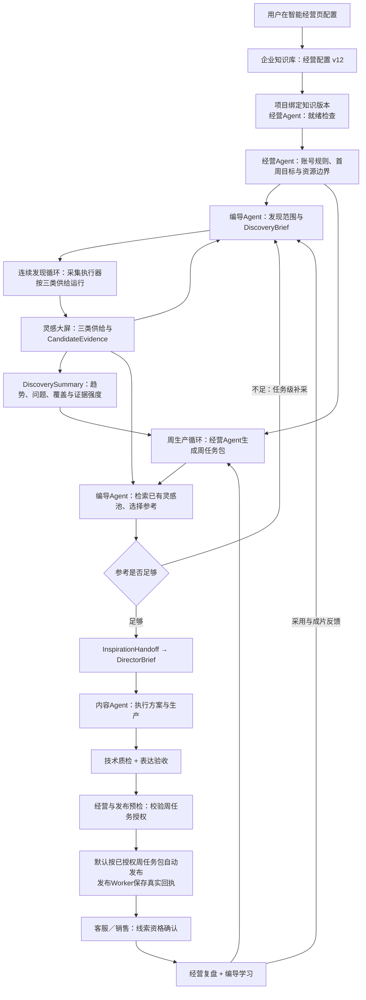

# 从首次配置到成片发布：经营Agent和编导Agent完整闭环示例

**文档定位：经营Agent与编导Agent协作方案的唯一主文档｜示例性质：产品工作流样例，不是对任何企业的收益承诺｜适用：海外B2B个护／化妆品OEM工厂｜日期：2026-09-26**

后续关于角色边界、采集逻辑、账号周频、灵感交接、内容生产、发布承接、接口兼容和实现进度的结论，统一更新本文件。专项审查文件只保存技术核对过程，不另行定义产品方案。

## 1. 场景与边界

示例企业为“澄妍个护制造”（虚拟名称）。它做护肤和身体护理的OEM／ODM，已有工厂实拍、产品图和可公开的包装／灌装素材；计划服务海外品牌方与批发商，已确定经营北美、东南亚和中东的英语内容区，但尚未确认各市场中哪种内容路径最有效。企业可提供英语接待，官网询价页与商务WhatsApp均已准备，价格、交期、认证和合同必须由人工销售确认。

用户选择：TK和FB各建立核心账号、协同账号；IG与YouTube各维护一个核心账号。初期目标是**获取可资格确认的采购咨询**，而不是泛涨粉。

整个过程中，系统不展示模型隐藏思维过程。每个Agent对用户可见的是：它读取了哪些版本化对象、采用了哪些规则和证据、产出了什么、为什么需要退回或人工处理。

这条闭环遵守五层数据边界：

| 层级 | 唯一事实来源／写入者 | 包含什么 | Agent边界 |
|---|---|---|---|
| 企业与商务事实 | 企业知识库、客户、销售、平台连接、素材库 | 产品、MOQ、认证、市场、语言、入口、账号授权、素材权利 | 经营与编导只能引用，不能把推断写成事实 |
| 经营策略 | 经营Agent；客户覆盖优先 | 周目标、账号职责、默认频次、内容方向、CTA、预算和观察指标 | 经营不指定镜头，也不挑选具体参考视频 |
| 发现与创作 | 编导Agent | 发现范围、采集计划、参考选择、钩子、脚本、分镜、证明顺序和验收标准 | 编导不修改市场、账号数量、发布预算或商务承诺 |
| 内容生产 | 内容Agent | 素材匹配、生成、数字人、配音、剪辑和技术质检 | 内容Agent不能改变选题、事实边界和CTA目的，也不直接操作平台发布 |
| 外部执行与业务回写 | 采集执行器、发布Worker、客服Agent、销售／CRM | 确定性采集、平台发布回执、线索初筛、资格与成交状态 | Worker不制定策略；客服Agent只形成候选线索，销售／CRM确认有效询盘与商务结果 |

经营Agent回答：“本周哪类客户，应在什么账号看到什么经营主张，并留下什么可归因的需求？”编导Agent回答：“如何发现合适参考，并用一条具体内容让客户理解主张、相信证据、完成下一步？”内容Agent回答：“如何在素材、权利、成本和技术约束内逐镜实现导演方案？”

## 2. 完整链路概览



用户和经营Agent只需要理解三类供给：行业起量、对标账号、创新参考。关键词、账号抓取、表现分析、相邻行业和评论扩展都是这三类供给内部的后台方法，不作为五套需要用户配置的产品概念。图中的采集、分析和发布均由编排器调度。连续发现循环独立维护灵感池；周生产循环由经营Agent先生成任务包，编导优先匹配已有证据，不足时才发起任务级补采。经营Agent读取的是 `DiscoverySummary`，不逐条挑选爆款视频；具体参考的采用和迁移方式由编导Agent负责。

底层任务仍由编排器派发和回收。图中的“经营Agent → 编导Agent”表示业务对象交接，不表示经营角色绕过现有任务信封直接调用另一个Agent。每次交接都保存输入版本、输出版本、操作者、时间、预算和幂等标识。

## 3. 第0天：用户一次配置企业经营知识

### 3.1 用户在“智能经营页”填写，系统同步企业知识库

| 字段 | 用户输入 | 系统状态 |
|---|---|---|
| 企业角色 | 个护OEM／ODM工厂 | 已确认 |
| 重点产品 | 身体乳、精华、面霜 | 已确认 |
| 可服务语言 | 英语 | 已确认；作为默认内容与采集语言，不推断客户国别 |
| 经营市场 | 北美、东南亚、中东 | 已确认的长期经营范围；各市场效果待验证 |
| 目标受众 | 小批量品牌方、私标品牌、批发商／进口商 | 已确认；项目默认继承 |
| 平台 | TK、FB、IG、YouTube | 已确认 |
| 账号组合 | TK核心＋协同、FB核心＋协同、IG核心、YouTube核心 | 已确认的资源范围 |
| 转化入口 | 官网询价页、商务WhatsApp、FB Messenger、IG DM | 已确认；链接需要后续技术检查 |
| 允许公开的事实 | 生产范围、产品图、工厂实拍、可披露工艺 | 已确认 |
| 禁止承诺 | 最低价、固定交期、未核验认证、治疗或功效、进口税费 | 已确认 |
| 可用素材 | 车间、灌装、包装、产品样品、质检、业务人员出镜 | 部分已核权；缺失项待标注 |
| 周产能 | 约10份基础视频素材、2次现场补拍 | 已确认 |

智能经营页不保存另一份独立的市场、受众和语言表单。它调用企业知识库的统一写服务，生成 `EnterpriseProfile.socialOperatingDefaults v12`，其中包含经营市场、目标受众、英语内容语言、默认平台和可用承接入口。项目创建、经营目标、账号规则和发现范围均读取这个版本。客户以后在企业知识库修改这些信息，会产生 v13；后续经营自动读取 v13，而不是要求再次创建项目。

### 3.2 经营Agent的可见判断

系统创建 `SocialProgram v1` 时绑定 `EnterpriseProfile.socialOperatingDefaults v12`。经营Agent检查企业事实、入口、账号、素材和商务边界，并形成首周经营目标：面向已配置品牌采购，解释规格、打样和合作流程，在已批准产能内获取可资格确认的咨询。结果为：**可以开始发现；市场、受众和英语语言已确定，账号内容职责和CTA形成初稿，具体选题与表达由编导结合采集证据细化。**

生成对象：

```text
SocialProgram v1
EnterpriseProfile.socialOperatingDefaults v12（项目绑定）
EnterpriseFactSet v12
ConversionRouteDraft v1
BusinessContentGoal v1（经营目标、账号职责、资源边界）
```

如官网链接为空、没有销售负责人或没有任何可披露事实，经营Agent必须先显示缺口，不创建虚假的采集结论或周计划。

## 4. 第0—2天：发现计划、采集与灵感大屏

### 4.1 经营目标交接给编导Agent制定发现计划

经营Agent交给编导的要求是：“围绕身体乳等产品、客户配置的市场与英语采购受众，为规格、打样和合作流程寻找真实参考；遵守本周账号、素材和预算边界。”经营Agent决定经营目标、账号、资源和承接边界；编导Agent决定发现范围、采集计划、参考选择和表达方式。经营Agent不逐项指定关键词或选择爆款。

编导Agent读取与 `EnterpriseProfile.socialOperatingDefaults v12` 相匹配的既有发现范围；没有时，基于企业事实、客户问题和用户提供的账号形成 `MarketKeywordSet`，以小样本验证相关性，再生成 `DiscoveryBrief`。灵感中心只保存一份版本化的权威发现范围，Agent设置和定时任务均引用该版本。用户可以固定、排除或直接修改范围；编导Agent可在已确认的产品、市场、受众、语言和预算边界内，依据召回质量自动调整关键词、场景和来源优先级，并记录变更原因。若建议会改变产品、市场、受众、语言、平台或预算等关键经营信息，编导不得自行修改，应交给经营Agent生成影响说明并按经营权限处理，同时向前端用户发送提醒；超出已有授权时再暂停相关任务并请求用户确认。

三类供给的规则如下：

| 供给类型 | 系统怎么找 | 用户需要做什么 | 入池条件 |
|---|---|---|---|
| 行业起量 | 系统根据产品、采购问题、市场和客户指定语言生成检索词；再按同账号近期基线、发布时间和可用互动数据识别高表现候选 | 首次只确认产品、市场、沟通对象和少量场景，不维护长关键词表 | 与业务相关；公开表现可核验；能解释钩子、证明或内容结构 |
| 对标账号 | 用户粘贴确认的主页后直接试采近期内容；系统也可从有效内容作者中提出候选账号 | 可添加、固定、观察或屏蔽账号 | 账号身份和主页可核验；近期内容持续相关；采集稳定；长期核心账号必须经经营Agent确认晋级 |
| 创新参考 | 只从相邻行业／场景，以及高表现内容或评论暴露的新问题中小比例探索 | 可查看“为什么出现”，决定采用或排除；无需配置创新关键词 | 有真实来源和业务锚点；补充新问题或表达；能说明借鉴与替换边界 |

行业起量仍需要关键词检索，但关键词由后台产生。系统先读取产品名称、企业角色、目标买方、客户指定语言及MOQ、样品、定制、交期、认证等采购问题，形成少量场景簇和本地语言变体；用户看到的是“包装适配”“小批量打样”等场景和命中样本，而不是几十个查询字符串。保存后，定时任务使用该版本；编导为某条内容临时补充的查询只属于当前任务，不自动写回长期范围。

“从相对高表现内容反推新场景”采用以下明确规则：

1. 先判断内容是否相对同账号近期基线表现突出；只有单次快照时标为“高表现候选”，有连续快照时才能判断“正在起量”。当前可用初始候选线为账号基线的约1.5倍，后续按平台真实数据校准。
2. 从标题、描述、ASR、OCR、画面和已取得的评论正文提取问题、使用场景、受众和证明方式，并与现有场景簇比对。
3. 已有场景只增加证据和表现快照；未覆盖的内容形成“建议场景”，不会直接改长期策略。
4. 同一新场景至少获得两个独立内容／账号来源支持，或由用户明确确认，才进入小样本验证。验证相关后才成为长期跟踪场景。

“相邻行业和评论问题创新探索”只保留两条路径：

- **相邻行业／场景迁移**：当本行业缺少某种表现方法时，保留一个业务锚点或证明目标，再放宽品类。例如要表现“包装运输不泄漏”，可到食品、清洁用品或工业包装中找泄漏／压力测试的镜头方法。只能迁移动作结构、证明顺序和节奏，不能迁移对方参数、认证或结论。
- **评论问题扩展**：只有取得评论正文时才执行。相近问题在至少三条评论、两个独立内容中出现，或被用户／销售明确提出时，形成 `InnovationSignal`；系统再围绕该问题做一次小样本检索。只有评论总数时不能生成新问题。

创新探索不得使用宽泛的“creative”“viral”一类词漫游。每次必须写明原始业务问题、为什么需要跨行业寻找、可借鉴什么和必须替换什么；没有合格结果时允许本轮为空。

三类供给先按**滚动7天的有效入池内容**观察结构，而不是按采集Actor返回的原始行数机械分配。下表是用于首轮验证的建议起点，并非已经确认的产品硬边界；目前只明确创新参考应保持小比例，建议在10%—20%之间，行业起量与对标账号的最终比例仍需结合有效率、业务相关性和用户后续确认校准：

| 供给类型 | 首轮验证起点 | 暂定观察范围 | 20条有效内容示例 |
|---|---:|---:|---:|
| 行业起量 | 50% | 45%—55% | 10条 |
| 对标账号 | 35% | 30%—40% | 7条 |
| 创新参考 | 15% | 10%—20% | 3条 |

每天目标为10条时，首轮验证可暂按5条行业起量、3—4条对标账号、1—2条创新参考执行，并在7天窗口内比较各类有效率。该数字只能作为可配置实验参数，不得硬编码成长期产品规则。创新参考没有合格内容时不凑数，剩余额度优先补给当前覆盖不足的行业起量或对标账号。用户固定账号的增量检查照常执行，不因最终入池比例而停止；具体生产任务的定向补采也不受日常池比例限制。

编导在 `ScheduledCollectionScope` 中设置平台、时间窗、有效内容目标、三类占比、费用和停止条件；执行器根据各来源历史有效率反推原始抓取量，每次保存 `InspirationCollectionRun`。用户只看到三类供给的结果和成本，不需要管理底层关键词及Actor参数。

### 4.2 采集执行器的执行与质检

采集执行器是后台确定性执行能力，不是客户需要配置的数字员工，也没有账号战略和内容决策权。定时任务和Apify按编导批准的计划执行，分析能力另行产出证据。

1. 按行业起量、对标账号、创新参考三类计划执行；每个运行记录策略版本、内部查询依据、市场／语言、来源、成本、时间和停止原因。
2. 做确定性去重：来源链接、平台内容ID、相似素材聚类。
3. 把工厂、贸易商、B2C品牌、D2C泛行业内容分别打来源标签。
4. 对满足基础可访问性和相关度门槛的候选，生成低成本元数据与快速理解结果。
5. 数据源没返回的粉丝、发布时间、评论正文或视频时长显示“暂未获取”，绝不由模型补写。

**采集质检门 G1：** 每条候选需记录实际召回通道、命中问题、来源和观测时间；来源不可核验时不作为采信证据。其他字段缺失按字段标记，不一律丢弃可浏览内容。L0去重与L1快速理解后即可入池，L2策略和L3精确分析按采用需求与预算升级。

### 4.3 灵感大屏如何展示结果

用户仍在同一个灵感池中浏览 `InspirationItem`，顶部显示发现范围，内容按行业起量、对标账号、创新参考筛选，并展示最近发现的场景。以下是可能出现的发现示例，只有实际采集支持时才展示，不预设为本轮结果：

| 发现 | 证据 | 含义 | 不能得出的结论 |
|---|---|---|---|
| 多数B2B同行用英语，主页放WhatsApp或询价入口 | 公开主页和文案 | 验证英语表达和统一入口的具体写法 | 英语不等于客户都在美国，也不覆盖企业知识库的市场范围 |
| 高频工厂账号常发工艺、样品、MOQ和FAQ | 对标内容分类 | 可做首轮内容支柱 | 不代表日更必然有效 |
| 部分D2C视频使用质地、对比和结果前置 | 创新参考中的实测内容 | 可迁移视觉钩子 | 不可直接搬用零售价格或功效承诺 |
| 评论中有样品、定制、目录和运输问题 | 公开评论与自有信号 | 可成为CTA和FAQ候选 | 单条评论不等于真实市场规模 |

编导Agent依据 `CandidateEvidence` 判断相关性、表现、创新性、可迁移性和生产条件，选择参考并形成 `InspirationHandoff`。例如可迁移“产品对比前置＋参数证明”，必须替换对方品牌、产品效果、数字、工厂和原话。创新参考不强制满足高播放门槛。编导可以自动试采候选账号，并根据相关性、持续产出和采集稳定性将其放入观察池、降级或停止；用户固定和屏蔽的结果优先。候选账号只有在编导提交证据、经营Agent确认其经营相关性和采集成本后，才能晋级为长期核心对标账号，调度器不得自行晋级。

## 5. 第2天：经营Agent形成首周经营方向与账号周计划

本节保留原位置讨论多条经营方向如何并行。下表是首周内容方向与排期依据，**不要求把常规运营全部建成实验**。经营Agent结合编导返回的证据摘要、销售问题和产能完善账号规则及周计划；可执行方向在已批准资源内同时安排，不要求用户择一。只有明确比较主题或CTA等变量时，才附加实验记录。

| 内容方向 | 平台与账号 | 已配置目标买方 | 经营主张 | 内容证据 | CTA与观察指标 |
|---|---|---|---|---|---|
| E1 规格与MOQ | TK核心＋FB核心 | 知识库中的小批量品牌方 | “先确认规格与MOQ，再进入定制” | 产品样品、包装、真实参数卡 | 提交产品、规格、数量、目的国；记录字段完整率 |
| E2 打样与定制 | TK协同＋IG核心 | 知识库中的私标品牌 | “从想法到样品有清晰路径” | 打样、配方／包装选择、可披露流程 | 索取打样清单；记录样品／报价需求数 |
| E3 工厂可信度 | FB核心＋YouTube核心 | 知识库中的批发商／进口商 | “真实工艺和质检可被验证” | 真实车间、灌装、包装、质检 | 查看合作流程或目录；记录主页访问与完整询盘 |
| E4 采购FAQ | FB协同＋TK协同 | 已配置受众中尚未完成资格填写的访客 | “先回答常见采购问题，减少无效往返” | 业务人员／授权数字人＋事实卡 | 留问题及四项资格字段；记录首次响应时间 |

E1—E4仅为本例内容方向代号，不是必填实验ID。各方向通过账号规则、周计划项、事实与CTA引用落地，共享素材并分别安排配额；不需要新增 `OperatingPathExperiment` 才能开始生产。

**经营质检门 G2：** 每个待执行周任务必须具备目标账号、可说的事实、明确入口、销售负责人、产能配额和观察指标。缺项时记录具体阻塞原因，补齐后再进入制作；不阻止其它完整任务推进。

## 6. 第3天：经营Agent交接给编导Agent

经营Agent将 `BusinessContentGoal` 细化为账号周计划和周内容项，以现有经营包交给编导；“周创作委托”是其业务展示，不新增另一份独立策略。以TK协同账号为例：

```text
账号：TK协同账号 v1
本周目标：让潜在品牌采购在评论或DM中留下可资格确认的问题
内容方向：E2打样与定制、E4采购FAQ；本周无必选实验
受众：企业知识库 v12 指定的北美、东南亚和中东英语内容区潜在品牌方；访客的具体国家待资格收集
内容配额：3条打样／定制步骤，2条采购FAQ
可用事实：已确认的MOQ范围、可定制包装项、样品流程
禁止项：未确认认证、固定交期、价格、医学功效、进口税费
CTA：允许评论规格、DM索清单、官网询价，最终由同一销售入口补齐资格信息
观察指标：咨询字段完整率、销售确认有效数；播放与互动作为内容诊断指标
```

这里的“内容配额”是该账号本周的**生产与发布配额**，不等于编导的采集结果上限，也不直接变成搜索 `topK`。它告诉编导最终要交付几条、主题比例和截止时间，用于控制产能；编导的发现范围仍由产品、市场、受众、经营问题、长期发现范围和当前 `productionGap` 决定。

本周需要分别保存两组约束：

| 约束 | 控制什么 | 不能控制什么 |
|---|---|---|
| 生产配额 | 各账号最终发布数、原创母内容数、适配版本数、截止时间和制作产能 | 不能把采集范围截断为同等数量，也不能规定每条内容只能看一个参考 |
| 发现预算 | 采集平台、回看时间、原始结果上限、深度分析条数、费用与失败熔断 | 不能反过来要求把抓到的内容全部生产 |

因此，5条发布任务可以从持续灵感池和更大的候选集合中选择。任务级补采以“是否已覆盖问题、证明方式和可生产参考”为停止条件，同时受单独的结果量与成本上限约束。内容配额会提高选择的任务相关性；只有错误地把它用成采集条数或只搜索五个题目时，才会伤害召回范围和精准度。

编导Agent读取周任务，先检索已有灵感池，按主结构、证明、节奏、CTA位置等用途选择参考并生成 `InspirationHandoff`。缺少包装适配证明时，以 `productionGap` 发起任务级 `DiscoveryBrief`，经同一采集链补齐；临时查询不自动写回长期范围。编导可在经营批准的CTA范围内调整措辞，但不能自行改变市场、账号或承接入口；MOQ冲突则返回 `fact_conflict` 给经营Agent和客户确认。

## 7. 第3—4天：编导Agent产出内容组合与导演方案

### 7.1 编导Agent的可见决策规则

编导Agent为各周任务提出内容，按以下顺序检查：

1. 是否回答当前经营任务的一个买方问题；
2. 是否能用客户真实证据支持；
3. 是否与核心／协同账号本周其他内容重复；
4. 是否能在现有素材、成本和截止时间内生产；
5. CTA是否能把观众导入当前转化路径。

编导先完成需求覆盖，再做账号排期。它不能因为上例只展示TK协同账号，就把整周候选全部收窄到该账号；同一份发现证据可以服务多个账号，但每个账号必须采用不同问题角度、信息深度或表达形式。

### 7.2 本周内容组合示例

上节的TK协同账号只是单账号交接样例。整周规划需要同时维护六个账号的稳定更新，并把客户提供的原始素材包转成账号差异明确的母内容和平台适配版本。默认发布量共26个任务；母内容数量由可用素材、跨平台复用条件和生产能力计算，本例以10条母内容、16条适配版本说明，不作为所有客户的固定限制：

| 账号 | 本周发布数 | 主要职责 | 内容方向 | 与其它账号的差异 |
|---|---:|---|---|---|
| TK核心 | 5 | 建立工厂与产品能力认知 | E1规格／MOQ、E3工厂可信度 | 结论前置、真实过程、短节奏 |
| TK协同 | 5 | 回答具体采购问题并促发互动 | E2打样／定制、E4采购FAQ | 问题前置、业务人员／数字人口播、评论或DM动作 |
| FB核心 | 5 | 系统呈现合作流程与可信证据 | E3工厂可信度、E1规格 | Reels结合说明文案，补充采购背景和入口 |
| FB协同 | 5 | 承接FAQ、交付与资格预筛 | E4采购FAQ、E2定制 | 更完整的问题说明，引导Messenger／表单 |
| IG核心 | 3 | 展示产品、样品、包装与可视化过程 | E2打样／定制、E3可信度 | 视觉一致性更强，Reels与轮播互补 |
| YouTube核心 | 3 | 沉淀可搜索、可解释的流程内容 | E3流程证明、E1采购知识 | Shorts或稍完整讲解，标题承载明确问题 |

默认情况下，TK和FB四个账号各5条，IG和YouTube各3条。这26条属于整周任务包中的**内容生产与发布子包**，不代表整周只有26项工作。经营Agent可以根据素材产能、账号成熟度、近期结果、评论维护和销售承接能力智能调整账号间的任务数量，并同步重排生产任务。调整后系统保存新的 `SocialWeeklyContentPackage` 版本，保留调整依据，并向前端用户发送提醒；用户也可以手动修改或撤回该版本。扩大预算、增加平台／账号或越过已确认经营边界时，仍须先取得新的经营授权。

以下展示六个账号各一条代表任务；本案例的26个发布任务由10条母内容和16条适配版本展开。这里的“原始素材包”“母内容”“平台适配版本”和“最终发布任务”分别保存，不能把客户提供的一份素材直接等同为一条母内容：

| 内容ID | 账号 | 买方问题 | 结构参考 | 内容主张 | CTA |
|---|---|---|---|---|---|
| TK-P-01 | TK核心 | “为什么同类产品MOQ不同？” | 结论前置＋真实工艺证明 | 配方、包装和工艺共同影响MOQ | 查看规格说明／提交需求 |
| TK-S-03 | TK协同 | “我的包装能做吗？” | 规格冲突前置＋样品对比 | 先核对瓶型、容量、数量与工艺 | 留瓶型／容量／数量 |
| FB-P-01 | FB核心 | “工厂怎样控制灌装和包装？” | 流程展开＋质检节点 | 用可披露现场证明合作流程 | 查看合作流程并询价 |
| FB-S-01 | FB协同 | “询价前要准备哪些信息？” | 清单讲解＋评论问答 | 四项信息减少无效往返 | Messenger／表单补齐信息 |
| IG-P-01 | IG核心 | “从包装选择到样品长什么样？” | 视觉序列＋前后对比 | 展示真实样品与可定制边界 | DM索取打样清单 |
| YT-P-01 | YouTube核心 | “小批量私标如何开始？” | 问题拆解＋完整步骤 | 解释需求确认、样品与后续沟通 | 访问说明页／询价页 |

每条内容再生成 `DirectorBrief`。以下仅展示 `TK-S-03` 的关键字段：

| 字段 | 示例值 |
|---|---|
| 经营来源 | E2 打样与定制；TK协同账号策略 v1 |
| 钩子 | “这个瓶子能不能做？先不要只看外观。” |
| 证明顺序 | 目标瓶型 → 容量／工艺选择 → 真实样品对比 → 可定制边界 |
| 必须证据 | 客户真实样品；已确认可定制项；不得生成假客户产品 |
| 可迁移参考 | “规格冲突前置＋对比镜头”的结构，不使用原视频的品牌或参数 |
| CTA | “留言瓶型、容量和预计数量，获取适配清单。” |
| 验收标准 | 观众在15秒内能看到至少两种样品差异；字幕与口播不含未证实MOQ／交期；结尾明确三项留言字段 |

编导到内容Agent的交接链是：

```text
外部参考视频
  → CandidateEvidence（相关性、表现、限制）
  → InspirationHandoff（可借鉴机制、必须替换项、权利边界、时间证据）
  → DirectorBrief（使用客户事实重新形成的视频方案）
  → 新脚本＋连续分镜目标＋素材要求＋验收条件
  → 内容Agent执行
```

因此，内容Agent接收的不是“爆款视频文件＋照着复刻”的任务。`discovery_reference` 只用于选题；`strategy_reference` 可以借鉴钩子类型、信息顺序、证明位置、节奏和CTA位置；只有完成连续时间线分析的 `production_reference` 才能为逐镜设计提供证据。即使达到生产级参考，也必须替换竞品品牌、原台词、产品事实、人物、参数和独特视觉表达。

编导为每个新镜头写清：镜头目的、起止时间、景别、机位运动、视角、构图、可执行动作、起始与结束状态、客户事实引用、所需素材、口播、字幕、环境声／音乐／音效、与下一镜的连续关系及验收条件。新脚本的时间线连续且不重叠，口播时长必须能放进镜头；无法从参考中确认的动作保留为缺失步骤，不能由模型补写。

**编导质检门 G3：** 每个 `DirectorBrief` 必须绑定周任务、账号策略、事实引用和CTA；采用外部参考时附 `InspirationHandoff`、分析等级、用途与使用边界。发现级参考只支持选题发散，结构和精确镜头借鉴须达到相应分析等级。实验引用为可选项，原创任务不强制寻找外部参考。

## 8. 第4—5天：内容Agent规划、生产与两次质检

### 8.1 内容Agent的执行方案

内容Agent不重新解读原爆款，也不复制其脚本。它读取编导生成的新脚本和分镜目标，为每个镜头选择实现方式：客户真实素材、补拍、授权数字人、事实卡／动效，或在允许范围内生成非事实性辅助画面。工厂能力、客户样品、检测结果等证明性画面必须来自真实且已授权的企业素材，生成画面不能冒充经营证据。

它为 `TK-S-03` 提交逐镜实现映射：

| 分镜目标 | 编导给出的动作与状态 | 内容Agent采用的来源 | 可行性与风险 | 备选 |
|---|---|---|---|---|
| 0.0—2.2秒：瓶型冲突钩子 | 两瓶并排静置；手从画外进入，分别指向瓶口和泵头；结束时两瓶仍同位 | 客户真实样品近景；后期加字幕 | 完整实现；需锁定瓶身方向、手部路径和字幕安全区 | 用两张已授权产品图做并排动效；不能宣称已生产该瓶型 |
| 2.2—6.0秒：解释适配条件 | 保持瓶型方向一致，依次突出容量、泵头、表面工艺 | 动态事实卡＋样品细节镜头 | 功能等价；字段只来自事实库 | 业务人员口播＋静态参数卡 |
| 6.0—11.5秒：展示工艺差异 | 从未处理样品切到真实喷涂／印刷样品，明确前后状态 | 客户实拍喷涂／印刷和成品 | 需核验画面确为客户能力；跳过的过程不能补成“完整生产流程” | 只展示可验证的样品前后，不生成工厂过程 |
| 11.5—15.0秒：CTA | 样品留在画面，业务人员或数字人说出三项信息；字幕同步呈现 | 授权数字人或业务人员口播＋CTA事实卡 | 核验形象授权、英语发音和口播时长 | 字幕＋事实卡；压缩文案以适配时长 |

内容Agent必须检查相邻镜头的产品方向、道具位置、手部、人物、服装、光线和场景状态是否连续，并把对白、屏幕文字、环境声、BGM和音效分开处理。如果某镜无法按指定动作和证据实现，它返回 `asset_missing`、`continuity_conflict`、`dialogue_overflow` 或 `goal_degraded` 及影响范围，由编导局部改镜或经营Agent安排补拍。

如果真实样品镜头不存在，内容Agent不得用生成画面冒充客户样品。它只能提出“功能等价”版本：用已授权产品图和明确标注的示意卡解释差异。这个变化被写为 `goal_degraded`，退回编导Agent判断是否仍足以服务E2方向。

### 8.2 双重质检

| 质检门 | 负责人 | 检查内容 | 不通过时 |
|---|---|---|---|
| G4 技术质检 | 内容Agent | 画幅、时长、音画同步、字幕、链接素材、渲染、无敏感泄露 | 局部重渲或更换技术路线 |
| G5 表达验收 | 编导Agent | 钩子、证据顺序、账号语气、CTA、事实边界、与其他账号版本的差异 | 退回指定分镜／文案；不能只写“效果不好” |
| G6 商务与发布预检 | 经营Agent＋规则引擎 | 账号、平台格式、链接、WhatsApp、表单、销售负责人、周任务授权范围 | 阻止该发布任务，先修承接链路或补充授权 |

通过后生成不可变的 `ProductionResult v1`、平台文案版本和 `PublicationPackage v1`。核心账号与协同账号如果使用同一原始镜头，系统对首3秒、字幕、封面、CTA、文案和成片Hash做差异检查；相同或高度重复则退回编导Agent改版。

## 9. 第5—7天：发布、承接与真实回写

### 9.1 发布

默认采用“周内容发布子包一次授权、子包内内容自动发布”。用户确认账号授权、`SocialWeeklyContentPackage` 及其自动发布范围后，通过G4—G6且未越过授权边界的成片不再逐条等待审批，发布Worker按排期调用已授权账号，并保存平台实际返回的发布ID、时间、账号、版本和失败回执。经营Agent对内容子包数量或排期做智能调整时，必须生成新版本并提醒用户；新增平台／账号、扩大预算、改变关键经营信息、使用未经确认的事实或更换转化入口时，自动发布暂停，重新取得相应授权。整周任务包中的采集、评论维护、询盘处理和复盘任务按各自规则执行，不占用26条发布授权。

```text
weekly_package_authorized
→ ready_to_publish
→ publishing
→ platform_receipt_received
→ published
```

没有平台回执时只能显示“待人工发布”或“发布失败”，不能写已发布。

### 9.2 评论、私信与销售交接

客服Agent是创作闭环的下游承接角色，不参与经营方向、参考选择或脚本决策。它读取可访问的评论、私信或表单，按规则形成候选线索和待补字段；只有人工销售或可信CRM可以把候选线索确认成有效询盘，并回写报价、样品、赢单或丢单等商务状态：

| 访客内容 | 分类 | 自动动作 | 人工动作 |
|---|---|---|---|
| “Can I customize 1000 bottles for UAE?” | 采购／可资格确认 | 记录内容ID、产品、数量、国家；生成确认字段草稿 | 销售确认能力后报价 |
| “Price?” | 早期意向 | 询问产品、规格、数量、国家、买方角色 | 未补齐不算合格线索 |
| “I need a job” | 求职 | 礼貌转正确入口或不跟进 | 不进入销售漏斗 |
| 上游包装商推销 | 供应商推销 | 标记排除 | 不记为询盘 |
| 表情／称赞 | 泛互动 | 可致谢 | 不计客资 |

评论、私信、表单和询盘首先要忠实记录并回写灵枢系统，不以完整归因为写入前提。公开评论必须关联平台、账号和来源内容；私信或询盘能可靠识别来源内容时再关联，无法识别时至少关联平台、账号或入口，并把内容来源记录为 `unknown`，留待后续补全。CTA入口、响应时间和资格字段按实际可得情况保存；有实验时才附实验引用，不把新增 `AcquisitionEvent` 作为前置条件。公开评论中的采购疑问不直接算有效询盘；报价、样品、赢单或丢单由人工或已接通CRM回写，灵感池只接收必要摘要与引用。

## 10. 出问题时如何纠偏

### 情形A：采集无法证明哪个已配置市场效果更好

现象：英语内容在各平台均有，但没有足够证据说明北美、东南亚或中东哪个已配置市场带来更多有效咨询。

处理：经营Agent保留客户配置，将市场效果记为待验证，并通过真实咨询的目的国等字段积累反馈。需要内容证据时，由编导补充已配置市场的本地问题查询；GEO方法帮助组织查询，不能证明哪个市场转化更好。缺少依据的地域交付或价格承诺退回修订。

### 情形B：协同账号的内容与核心账号过于重复

现象：两个账号使用同一段素材、同样的钩子、文案和CTA。

处理：G5差异检查不通过。编导Agent收到明确原因：`variant_similarity_too_high`，必须改变问题角度、首3秒、证据排序或CTA；内容Agent无需重做已合规的原始镜头。

### 情形C：业务人员称可承诺“7天打样”，但事实库没有依据

处理：G3事实检查失败，相关字幕和口播不能进入生产。经营Agent创建 `fact_confirmation_request`；客户补充可用边界后生成事实版本v13，只有引用该字段的导演方案和成片需要局部重审。

### 情形D：成片好看，但官网询价页打不开

处理：G6发布预检失败，所有指向该入口的发布任务暂停。经营Agent把转化入口状态置为 `unavailable`；已制作成片可保留，替换为可验证WhatsApp／Messenger入口后只重出CTA尾帧和文案。

### 情形E：播放高，但咨询大多是零售或求职

处理：客服反馈显示采购匹配度低。经营Agent结合样本量检查受众承诺、内容配额和入口；编导检查开头、术语、参考来源与CTA，调整采购表达。有真实留存数据时才判断哪些视觉方式值得保留，并把不适配原因回传发现策略，不能仅凭高播放扩大。

### 情形F：内容Agent缺少真实质检画面

处理：内容Agent提交功能等价方案；编导Agent判断该视频是否仍能证明“工厂可信度”。若不能，E3方向下该周内容项标记 `needs_real_evidence`；编导提出可制作的FAQ或样品选题，经营Agent确认周计划调整并安排补拍。重新采集同行视频不能替代客户真实证据。

### 情形G：客户在企业知识库修改了经营语言或目标受众

现象：客户将企业知识库的英语内容语言扩展为英语和阿拉伯语，或将目标受众新增为区域经销商。系统写入 `EnterpriseProfile.socialOperatingDefaults v13`，并记录客户、修改时间和差异。

处理：经营Agent生成影响清单并调整后续账号规则和周计划；编导据此创建或选择与 v13 匹配的 `MarketKeywordSet`、发现范围和 `DiscoveryBrief` 新版本。本周已批准内容、正在运行的采集任务继续引用 v12 的快照，不被静默改写。若客户要求本周发布阿拉伯语内容，则建立引用 v13 的周任务，编导检查本地表达并补参考，内容Agent完成语言质检；翻译和承接入口未就绪时标记 `blocked_for_language_readiness`。

## 11. 周末复盘：如何进入下一周

经营Agent保存带截止时间的周数据快照，按“经营方向—账号—内容”读取结果；真实实验另行比较，普通内容不强制分实验组。以下是复盘示例，不代表已取得结果，首周数据不足时保持待验证：

| 层级 | 看什么 | 示例决策 |
|---|---|---|
| 经营方向 | 合格咨询数、字段完整率、报价／样品推进、维护工时 | 若E2打样流程咨询完整率持续较高，保留并增加一个变体 |
| 账号 | 发布完成率、入口可用率、内容与线索匹配度 | TK协同账号带来较多规格问题，保持5条／周；FB协同账号低产出，先调整主题不盲目扩量 |
| 内容模式 | 钩子、证据、CTA、播放中位数、低质流量比例 | “规格对比＋三字段CTA”比“泛工厂参观”更易补齐线索字段 |

编导Agent更新的不是“爆款公式”，而是带适用范围的 `CreativeLearning`：

```text
适用：英语B2B个护采购的TK协同账号，产品／包装适配问题
观察：真实样品对比＋三字段CTA带来较多可资格确认咨询
证据：E2方向的周任务、内容TK-S-03等，数据窗口与来源可追溯
边界：样本期短；未验证成交；不可外推到零售或其它市场
下一步：保留结构，测试“样品清单CTA”与“留言规格CTA”
```

经营Agent据此形成下一版账号周计划及经营包，继续引用企业配置v12；客户更新时引用v13并列出影响。编导分别使用相关性反馈、收藏／采用／放弃原因和自有成片表现，在既定产品、市场、受众、语言和预算内自动调整场景、关键词与来源优先级，并保存版本和原因。涉及产品、市场、受众、语言、平台或预算等关键经营信息时，编导只提交变更建议，由经营Agent生成影响说明、按权限形成新版本并向前端用户提醒；超出已有授权时暂停受影响任务并请求确认。外部高表现与自有成片结果分别保存，不能因一次收藏或临时补采自动改长期策略。

## 12. 目标方案的验收点

1. 每条已发布内容能追溯到企业配置版本、企业事实、周任务、账号策略、导演方案、采用的参考、素材来源和发布回执；有可确认来源的咨询才关联客户记录，实验引用为可选。
2. 对标内容与D2C泛行业内容只作为参考，绝不被当作客户实证或直接二创素材。
3. 企业知识库已确认的市场、受众和语言不被公开素材反向覆盖；未确认的市场效果、访客国别、MOQ、交期、认证和成交状态始终显示未知或待确认。
4. Agent遇到问题时能说明影响范围与下一步：重采、改策略、改脚本、局部重做、修入口、补事实或转人工。
5. 默认采用周内容发布子包一次授权后的自动发布模式：批准范围内的内部采集、分析和生产可按各自权限自动执行，26条内容发布任务在子包授权范围内自动排期和发布。经营Agent对整周任务或内容子包智能调整后必须提醒用户；新产品、新市场、关键受众／语言变化、预算越界、未经确认的业务承诺、平台／账号扩张或转化入口变化必须暂停相应任务，生成影响说明并取得新授权。全过程保留版本、提醒和审计记录。

闭环内统一使用以下对象，避免同一含义在不同页面各存一份：

| 阶段 | 权威对象 | 主要引用关系 |
|---|---|---|
| 企业配置 | `EnterpriseProfile.socialOperatingDefaults`、`EnterpriseFactSet` | 项目、账号规则和发现范围引用同一知识版本 |
| 项目与账号 | `SocialProgram`、`OwnedSocialAccount`、`AccountPlaybook` | 账号规则保存核心／协同职责、语言、内容支柱和转化入口 |
| 发现范围 | `MarketKeywordSet`、`DiscoveryBrief`、`ScheduledCollectionScope` | 长期范围、具体发现任务和执行快照分开版本化 |
| 灵感证据 | `InspirationItem`、`CandidateEvidence`、`InspirationHandoff` | 原始来源、模型解读和使用关系分层保存 |
| 周经营与创作 | `WeeklyOperatingPackage`、`SocialWeeklyContentPackage`、周内容项、`DirectorBrief` | 整周任务包包含经营、发现、生产、发布、维护和复盘；内容子包引用账号规则、事实、CTA和选用参考 |
| 生产与发布 | `ContentExecutionPlan`、`ProductionResult`、`PublicationPackage`、平台发布回执 | 逐镜实现与真实外部结果分开保存 |
| 客户承接与复盘 | 评论／私信／表单原始记录、可选来源关联、资格状态、指标快照、`CreativeLearning` | 评论必须关联账号和内容；询盘尽力关联内容，无法确认时允许未知来源并继续保存 |

正常事件顺序为：

```text
business_goal.ready
→ discovery_brief.ready
→ collection_run.completed
→ weekly_item.ready
→ inspiration_handoff.ready
→ director_brief.ready
→ production_plan.ready
→ creative_review.passed
→ artifact.ready
→ weekly_package.authorized
→ publication.ready
→ publication.evidence_received
→ customer_source_attributed（可选）
→ review.snapshot_frozen
```

`weekly_package.authorized` 只表示包内任务获得自动发布权限，`publication.ready` 也不表示已经发布，必须等平台回执；公开评论不自动成为有效询盘；报价、样品、赢单与丢单只能由人工销售或可信业务系统回写。

Agent交接和退回规则如下：

| 从 | 到 | 正式交接物 | 可以继续 | 必须退回／阻塞 |
|---|---|---|---|---|
| 经营 | 编导 | 周任务包、账号规则、事实与CTA引用 | 目标、账号、产能、入口完整 | 事实、入口、销售承接或账号配置缺失 |
| 编导 | 采集执行 | `DiscoveryBrief`、策略版本和执行预算 | 范围、来源、时间窗和停止条件完整 | 试图越过客户市场、语言、预算或权利范围 |
| 编导 | 内容 | `DirectorBrief`、新脚本、连续分镜和素材要求 | 事实、权利、动作和验收标准清楚 | 参考不可迁移、必需证据缺失、口播或连续性不可执行 |
| 内容 | 编导 | `ContentExecutionPlan` 与风险原因码 | 完整实现或经批准的功能等价实现 | `asset_missing`、`continuity_conflict`、`dialogue_overflow`、`goal_degraded` |
| 编导 | 经营 | 表达风险与影响范围 | 不影响经营目标的局部调整 | CTA无法承接、关键证据缺失或需要改变周任务 |
| 发布／客服 | 经营 | 平台回执、评论／私信／表单原始记录、可选来源关联和资格状态 | 原始事件忠实保存，已知账号／内容引用真实，未知来源明确标记 | 原始事件无法保存、伪造来源，或涉及价格／合同／交期确认 |

### 12.1 当前实现状态与目标方案的差距

截至2026-09-26，以下内容只描述当前代码和环境状态，不表示前文目标闭环已经上线：

| 状态 | 当前能力 |
|---|---|
| 已有 | 发现范围界面与保存接口；关键词和对标账号定时采集；四平台不同程度的采集及Apify兜底；视频分析；候选证据和灵感交接的数据结构；周任务与内容生产基础链路 |
| 尚未接通 | 已保存发现范围没有成为定时采集器的唯一输入；数字员工主要自动建立关键词采集；三类供给的比例、创新触发和统一自动调度尚未接通；账号自动发现、试采、晋级与增量跟踪没有闭环；`CandidateEvidence → InspirationHandoff → DirectorBrief` 尚未由运行时自动完成 |
| 当前验证边界 | 相关单元与契约测试已通过；当前开发环境没有 `APIFY_TOKEN`，未完成四平台真实自动采集联调；本方案整周任务包中的26条默认内容发布任务尚未由运行时自动生成 |
| 上线判断 | 局部采集与分析能力存在；完整的编导全自动发现、筛选、交接和生产闭环尚未跑通，不能描述为已经完整上线 |

实施时沿用现有链路增量接入：先让整周任务包覆盖经营、发现、编导、内容、发布、互动承接和复盘，并让其中的内容子包生成及修改六账号默认频次；再让定时采集读取已保存的 `MarketKeywordSet` 与 `DiscoveryBrief`；随后接通可配置的三类供给、账号试采、新场景建议和候选证据；最后接通灵感采用、导演方案、原始互动忠实回写、可选来源关联和复盘。每一步均保留历史版本和旧接口读取，不用一次性重写生产、发布或客户系统。

## 13. 现有代码基础与后续开发计划

本节依据截至2026-09-26的仓库代码核对目标方案。状态分为四类：

- **可复用**：已有服务端、前端或Worker能力，可以直接作为新闭环的基础；
- **结构已有**：类型、投影或局部接口已经存在，但尚未形成权威持久化链路；
- **局部接通**：单段流程可运行，但上下游仍依赖旧对象或人工动作；
- **待开发**：当前没有满足目标方案的实现。

### 13.1 企业配置、经营项目和账号矩阵

| 目标能力 | 当前状态 | 现有代码基础 | 主要缺口 |
|---|---|---|---|
| 企业经营信息作为统一事实来源 | 可复用 | 企业资料读取与版本引用已存在；`SocialProgram` 支持 `enterpriseProfileRef` 和产品档案引用 | 企业资料更新后，还没有统一生成“受影响对象清单＋前端提醒”的事件链 |
| 创建社媒经营项目 | 可复用 | `shared/contracts/socialProgram.ts`、`server/socialPrograms/service.ts` 和 `/api/overseas/social-programs` 已提供项目创建、更新和阶段判断 | 需要把发现范围、周任务包和数字员工运行统一绑定到当前项目与企业知识版本 |
| 自有账号与账号规则 | 可复用 | 已有 `OwnedSocialAccount`、`AccountPlaybook`、转化入口及账号连接能力 | 账号规则尚未自动生成TK／FB主副账号、IG／YouTube主账号的默认组合和职责 |
| 默认六账号周频 | 待开发 | 当前存在周计划、矩阵计划和周任务包能力 | 旧预设仍以少量内容为主，尚未生成TK 5＋5、FB 5＋5、IG 3、YouTube 3的26个默认发布任务 |

`SocialProgram` 当前创建时强制要求市场、目标受众和候选平台，符合“由客户填写市场和受众、按客户要求语言执行”的共识，不需要新增虚假的 `Global/TBD` 冷启动项目。

### 13.2 发现范围、采集执行器与灵感大屏

| 目标能力 | 当前状态 | 现有代码基础 | 主要缺口 |
|---|---|---|---|
| 唯一、版本化的发现范围 | 局部接通 | `/api/overseas/social-discovery/scope` 已能从企业资料派生并保存 `SocialCrawlStrategy`；前端 `DiscoveryScopePanel` 已能读取和编辑 | 当前范围按租户保存，尚未显式引用 `SocialProgram`、企业知识版本和经营目标版本；Agent自动调整与用户提醒没有接口 |
| 三类供给 | 结构已有 | `SocialDiscoveryMode` 已包含 `momentum`、`account`、`innovation`；`DiscoveryBrief` 投影已有三种模式 | 最终比例边界尚未确认；需要先支持可配置比例、滚动7天有效率观察和“创新不足不凑数”，50%／35%／15%只作为首轮验证起点 |
| 四平台采集 | 局部接通 | Scheduler、Crawl Worker、关键词采集、账号采集和Apify／本地Worker路径已经存在 | 默认派生范围目前只列TK、IG、YouTube，需补FB；保存的发现范围尚未成为Scheduler唯一输入，任务仍可保存独立关键词配置 |
| 采集运行记录 | 结构不足 | 已有任务状态、候选ID、导入数、刷新数、失败原因和Worker心跳 | 尚无完整 `InspirationCollectionRun`，不能统一记录策略版本、三类供给、费用、停止原因、原始召回量和有效入池量 |
| 候选证据 | 局部接通 | 灵感视频的 `aiAnalysis.candidateEvidence`、分层分析和大屏展示已经存在 | 证据结构尚未统一强制记录召回通道、命中问题、观测时间、相对账号基线和缺失字段；也没有统一的L0—L3升级任务 |
| 长期对标账号 | 局部接通 | `/social-discovery/accounts/:accountId/decision` 支持试采、跟踪、观察和停止 | 目前接口可以直接写入 `track`，缺少“编导提交晋级证据→经营Agent确认→成为长期核心对标账号”的状态机和权限校验 |
| 新场景与创新信号 | 待开发 | 已有场景簇、关键词证据来源和评论采集基础 | 尚未实现1.5倍账号基线候选、两个独立来源验证新场景、三条评论／两个内容形成 `InnovationSignal` 等规则 |
| `DiscoverySummary` | 待开发 | 灵感池已有候选和分析数据可聚合 | 尚无给经营Agent使用的趋势、买方问题、覆盖缺口、证据强度和来源成本摘要 |

这一阶段的关键改造不是增加新的采集入口，而是让所有定时采集任务只保存 `discoveryScopeId＋version` 和任务级覆盖参数。关键词、账号URL和Actor参数在执行时由该版本解析，避免前端范围、Scheduler配置和编导任务各存一套事实。

### 13.3 经营Agent与周任务包

整周任务包建议命名为 `WeeklyOperatingPackage`。它是经营Agent对一周全部工作的总编排，不等于26条内容任务。`SocialWeeklyContentPackage` 是其中的内容生产与发布子包，两者关系如下：

```text
WeeklyOperatingPackage
├── readiness：企业事实、账号、入口和销售承接检查
├── discovery：连续采集、任务级补采和对标账号管理
├── directing：灵感筛选、采用关系、脚本和导演方案
├── content：母内容、平台适配版本及26个默认发布任务
├── publishing：G6预检、排期、自动发布和回执核对
├── engagement：评论维护、私信／表单记录和候选询盘处理
└── review：指标快照、经营复盘、创作学习和下一周调整
```

26条只规定默认发布任务数。发现任务数、补采任务数、评论维护次数、候选询盘处理数和纠偏任务数根据当周实际情况动态产生，不计入26条内容配额。

| 目标能力 | 当前状态 | 现有代码基础 | 主要缺口 |
|---|---|---|---|
| 月／周经营计划 | 可复用 | `SocialMonthlyPlan`、`SocialWeeklyPlan`、保存接口和激活前置检查已经存在 | 周计划与数字员工 `WeeklyPackage` 是两套相邻模型，尚未建立唯一映射和版本血缘；现有 `WeeklyPackage` 的多任务结构可作为 `WeeklyOperatingPackage` 基础 |
| 经营方向和周内容项 | 局部接通 | 周内容项已包含账号、任务、CTA、事实引用、参考引用和截止时间 | 尚缺经营主张、观察指标、母内容关系、平台适配关系和自动调整原因字段 |
| 智能调整任务包 | 待开发 | 现有矩阵、产能和成熟度评估可作为输入 | 需要实现账号数量重排规则、产能检查、版本差异、前端提醒及用户撤回；预算、平台和关键经营信息越界时必须阻断 |
| 默认包级授权 | 结构已有但策略冲突 | `WeeklyPackage.authorization` 已支持 `bounded`、账号范围和最大发布数，`grantCovers` 可校验授权范围 | 当前推荐包默认 `mode: each`、最多1条；运行策略把内容发布固定为硬审批，和目标方案冲突 |

这里不应把26条内容任务提升成整个周任务包。建议以 `WeeklyOperatingPackage` 作为整周权威编排对象，并以 `SocialWeeklyContentPackage` 保存其中的内容生产与发布子包。继续兼容读取现有 `SocialWeeklyPlan` 和 `WeeklyPackage`，新写入建立稳定引用关系；数字员工运行只消费已激活的整周包版本和对应子包版本。

### 13.4 编导交接、导演方案与内容生产

| 目标能力 | 当前状态 | 现有代码基础 | 主要缺口 |
|---|---|---|---|
| `DiscoveryBrief` | 结构已有 | `socialContentAgentWorkflow` 可以构建发现任务，包含产品、市场、受众、模式、平台、预算和 `productionGap` | 当前只在特定的爆款复刻任务中临时构建，且默认版本为1，没有读取灵感中心保存的权威范围 |
| `InspirationHandoff` | 结构已有 | 已能区分发现级、策略级、生产级参考，并保存可迁移逻辑、替换项和权利边界 | 多数由单个任务运行时投影生成，尚未作为“采用关系”独立保存和版本化，也没有从灵感大屏批量选用进入周任务的正式命令 |
| `DirectorBrief` | 局部接通 | 已包含经营来源、参考分析、CTA、事实、权利限制、连续分镜和验收条件 | `accountRefs` 仍为空，周账号规则和多账号差异没有完整注入；最终门仍包含逐条用户审批语义 |
| 内容执行方案 | 可复用 | `ContentExecutionPlan`、素材供给、真实证据限制、数字人／生成能力、逐镜候选和风险原因已有较完整实现 | 需要把 `asset_missing`、`goal_degraded` 等退回结果正式写回周任务与编导队列，而不只停留在任务内部状态 |
| 成片与双重质检 | 局部接通 | 技术质检、导演验收、事实与权利限制、成片状态均已有基础 | 尚需统一G4／G5／G6结果对象，以及同素材跨账号版本的首3秒、字幕、封面、CTA和Hash差异检查 |

现有代码已经能支撑“参考分析→新脚本和分镜→逐镜执行”，后续不应另建一条“复制爆款脚本”的生产管线。开发重点是让权威发现范围、周任务包、账号规则和采用证据进入现有 `social-content-agent-workflow.v2`。

### 13.5 自动发布、回执和线索承接

| 目标能力 | 当前状态 | 现有代码基础 | 主要缺口 |
|---|---|---|---|
| 发布包和内容冻结 | 可复用 | `PublicationPackage` 已保存内容Hash、包Hash、平台规格检查、账号、素材、文案和来源追踪 | 需要增加周任务包授权引用、账号规则引用和G6预检结果 |
| 定时自动发布 | 局部接通 | 已有排期Worker、幂等租约、重试、平台处理中恢复、未知状态禁止重发和真实回执保存 | 现有数字员工策略仍要求逐项内容发布审批；需要改成包级授权覆盖校验后自动排期与发布 |
| 多平台账号连接 | 局部接通 | TK、FB、IG账号和内容读取接口已存在，发布适配器与YouTube等平台能力已有基础 | 需要逐平台核对“连接、上传、发布、回执、评论读取”五项能力，不能用账号已连接推断自动发布已完整可用 |
| 客服Agent初筛 | 可复用 | 评论／私信读取、客户工作流、资格判断和销售交接均有基础模块 | 需要先忠实回写原始事件；评论关联内容和账号，私信／表单尽力关联内容，不能因缺少完整归因而拒绝保存 |
| 有效询盘与成交状态 | 局部接通 | 人工销售、客户系统及部分来源记录已有写入能力 | 需要强制只有销售或可信CRM可以确认有效询盘、报价、样品、赢单与丢单；内容来源允许为空或 `unknown`，后续可补全 |

“默认自动发布”应实现为**周任务包的有界授权**，不是关闭发布安全检查。每次发布仍需满足账号在授权列表、数量未超上限、日期处于授权周、内容Hash未变化、G4—G6通过、平台连接有效和真实发布许可已开启。任一条件变化都必须退出自动队列。

### 13.6 复盘、学习和提醒

| 目标能力 | 当前状态 | 现有代码基础 | 主要缺口 |
|---|---|---|---|
| 平台指标与发布证据 | 可复用 | 平台指标、发布历史、发布回执及聚合能力已存在 | 需要统一冻结周数据窗口，并按经营方向—账号—内容读取 |
| `CreativeLearning` | 待开发 | 当前已有内容分析和部分复盘数据 | 尚无带适用范围、证据引用、样本边界和下一步动作的版本化学习对象 |
| 经营调整提醒 | 结构可复用 | 仓库已有租户通知能力和前端任务状态 | 前端右上角增加小铃铛消息中心；新消息显示红色未读数字，点击后下拉展示实时消息；增加 `scope_changed`、`weekly_package_adjusted`、`critical_business_change`、`authorization_required` 等事件、差异和跳转目标 |
| 全链路血缘 | 局部接通 | 多数对象已有版本、Hash、来源引用或平台ID | 仍缺从企业配置→发现范围→采集运行→候选证据→采用关系→周任务→导演方案→成片→发布回执→客户资格的统一查询 |

### 13.7 推荐开发顺序

#### P0：统一权威对象和安全边界

1. 确定整周 `WeeklyOperatingPackage` 的权威Schema，覆盖经营就绪、发现、编导、内容、发布、互动承接和复盘七类任务。
2. 确定其 `SocialWeeklyContentPackage` 子包，补齐账号发布任务、母内容／适配关系、经营主张、CTA、事实、指标、产能、预算、授权范围和版本差异；26条只属于该子包。
3. 为现有 `SocialWeeklyPlan`、数字员工 `WeeklyPackage` 建立兼容适配器，禁止多套对象分别修改同一周计划。
4. 把内容子包授权从默认逐条审批改为 `bounded`：限定账号、最多26个默认发布任务、授权周、内容版本和真实发布许可；其它周任务分别按自身外部影响授权，保留所有现有发布回执与防重复保护。
5. 增加关键经营信息变更检测和前端铃铛消息中心；范围内的编导调整只记录版本和理由，重要消息显示未读红色数字并支持跳转处理。
6. 为发现范围、整周任务包、内容子包、发布授权和经营提醒补租户隔离、乐观锁及审计字段。

**P0验收：** 系统能生成包含七类工作的整周任务包，并为六个已绑定账号生成26个内容发布任务；用户一次授权内容子包后，包内合规内容可以进入自动发布队列。调整和异常会进入铃铛消息中心，任何越界修改都会阻断并提醒。

#### P1：接通连续发现循环

1. 让Scheduler仅按保存的发现范围版本生成采集任务，并补入Facebook默认平台。
2. 新增 `InspirationCollectionRun`，记录三类供给、范围版本、查询来源、成本、停止原因和有效率。
3. 实现可配置的三类供给比例、滚动7天有效率观察和创新不足补位；首轮可用50%／35%／15%验证，但在业务边界确认前不得固化为长期默认。
4. 补齐候选证据的召回通道、命中问题、观测时间、账号基线、缺失字段和L0—L3等级。
5. 实现账号试采／观察／停止与经营确认晋级核心对标的状态机。
6. 生成经营Agent读取的 `DiscoverySummary`。

**P1验收：** 不手工填写Scheduler关键词也能按权威范围连续采集；灵感大屏能解释每条内容来自哪类供给、为什么入池、花费多少，并能形成可追溯的经营摘要。

#### P2：接通周任务到导演和生产

1. 经营Agent根据默认频次、账号状态、产能和 `DiscoverySummary` 生成或调整周任务包，并发送版本提醒。
2. 编导从已有灵感池为周任务建立独立的 `InspirationHandoff`；缺口才触发任务级补采。
3. 让 `DirectorBrief` 强制引用账号规则、周任务、事实、CTA、采用证据和权利边界。
4. 将内容Agent的缺素材、连续性冲突、口播超时和目标降级正式回写编导／经营队列。
5. 增加跨账号版本差异检查和G4—G6统一结果。

**P2验收：** 任一成片都能从周任务追溯到参考证据和企业事实；失败能准确返回到编导、经营或补拍环节，不需要人工判断“该找谁处理”。

#### P3：接通发布归因与周末复盘

1. 发布包写入周授权、周任务、账号规则和CTA来源，平台回执写回同一血缘。
2. 评论、私信和表单忠实写回灵枢：评论必须关联账号和内容；私信／询盘尽力关联内容，无法确认时保存账号／入口及 `unknown` 来源；客服Agent只生成候选资格，销售／CRM确认有效询盘。
3. 冻结周指标快照，按经营方向、账号和内容聚合发布完成率、字段完整率、有效询盘及维护工时。
4. 新增 `CreativeLearning`，分别保存外部参考规律和自有内容结果。
5. 经营Agent据此形成下一版任务包；编导在授权范围内更新发现优先级。

**P3验收：** 系统不丢失评论、私信、表单和询盘原始记录；评论可回到账号和内容，能够可靠识别来源的询盘可回到内容，无法识别时明确标记未知来源。系统在证据充分时回答经营归因问题，不为了形成完整链路而猜测来源。

### 13.8 建议优先复用和修改的代码位置

| 范围 | 优先代码位置 | 建议动作 |
|---|---|---|
| 社媒项目与账号规则 | `shared/contracts/socialProgram.ts`、`server/socialPrograms/service.ts`、`server/routes/socialPrograms.ts` | 扩展周任务包引用和知识版本影响，不重写项目服务 |
| 发现范围 | `shared/socialInspirationStrategy.ts`、`server/routes/socialDiscovery.ts`、`src/components/inspiration/DiscoveryScopePanel.tsx` | 增加项目／知识引用、Agent自动调整命令、关键变化提醒 |
| 采集调度 | `server/routes/scheduler.ts`、`server/routes/crawlWorker.ts`、`scripts/local-crawl-worker.ts` | 改为读取权威范围版本，新增运行记录和三类供给配额 |
| 灵感证据 | `src/components/InspirationDashboard.tsx`、视频分析与 `candidateEvidence` 相关代码 | 统一证据字段、等级升级、采用命令和经营摘要 |
| 周任务包 | `src/lib/weeklyPackage.ts`、`server/digitalEmployees/weeklyPackage.ts`、`src/lib/weeklyTaskPackagePresets.ts` | 以现有多任务包扩展整周七类工作；新增六账号26条内容子包、智能调整、铃铛提醒和子包级授权 |
| 编导与内容交接 | `server/starter198/socialContentAgentWorkflow.ts` 及 `shared/contracts/socialContentWorkflow.ts` | 接入权威范围、周任务、账号规则和独立Handoff持久化 |
| 内容生产与质检 | `server/starter198/socialContentDirectorPlan.ts`、生产计划和质量模块 | 回写退回原因，统一G4—G6和跨账号差异检查 |
| 自动发布 | `server/digitalEmployees/runtimePolicy.ts`、`publishingExecution.ts`、`server/publishing/*` | 把硬性逐条审批调整为有界周授权，不削弱回执、Hash、租约和防重发保护 |
| 线索和复盘 | 社交互动、客户工作流、销售资格与指标聚合模块 | 增加内容来源血缘、销售确认门和版本化复盘学习 |

### 13.9 测试与上线判定

每个阶段先在本地和隔离租户完成验证，不因为类型或单元测试存在就宣称链路上线。最低测试集合包括：

1. 契约测试：旧版 `SocialWeeklyPlan`、`WeeklyPackage` 和历史内容任务仍可读取；新版只通过适配器写入权威对象。
2. 权限测试：编导不能改产品、市场和预算；核心对标晋级必须经过经营确认；包外账号和超量发布必须被阻断。
3. 调度测试：范围版本切换不改写运行中的采集任务；重试不会重复入池或重复计费。
4. 生产测试：参考内容不能作为客户事实；缺少真实证据时只能降级或退回。
5. 发布测试：同一内容Hash和授权包不会重复发布；平台处理中、未知回执和部分成功均可恢复且不会盲目重发。
6. 记录与归因测试：评论必须关联内容和账号；无法关联具体内容的询盘仍能保存为未知来源；普通评论不计有效询盘，只有销售／可信CRM确认后进入经营指标。
7. 提醒测试：铃铛未读数、实时下拉消息、已读状态、差异详情和处理页跳转在租户间隔离，重复事件不重复计数。
8. 端到端验收：以一个隔离企业完成“配置→整周任务包→连续采集→26条内容发布任务→导演方案→成片→自动发布测试环境／模拟适配器→回执→评论／候选线索忠实回写→销售确认→周复盘”。

只有P0—P3验收全部通过、四平台真实账号能力逐项核验、后台Worker和所需密钥在目标环境就绪后，才能描述为“经营Agent与编导Agent完整闭环已上线”。
