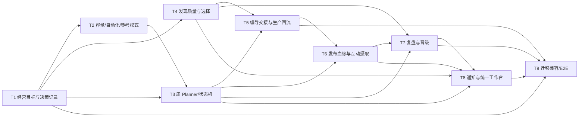

# 经营编导 Agent Gap-V1 开发缺口审计

> 审计日期：2026-09-26
>
> 唯一代码基线：分支 `习习改经营编导Agent`，HEAD `cc8240c feat: 习习改经营编导Agent`
>
> 权威产品方案：`/Users/julia_chen/Documents/ChatGPT/LINGSHU数字人runway/docs/product/经营Agent和编导Agent完整闭环示例-v1.md`
>
> 辅助现状资料：`/Users/julia_chen/Documents/ChatGPT/LINGSHU数字人runway/docs/灵枢开发文档.md` 当前本地内容

## 1. 审计口径与结论

本文件只按当前分支可执行代码、迁移和测试判断实现状态。类型、页面文案、示例数据或文档中的对象名称不单独算“已实现”；只有存在持久化、运行时调用、权限/状态约束及可验证出口时，才认定为已接通。状态含义如下：

- **已有**：当前代码已形成可执行且有测试或明确运行入口的能力，本阶段不得重复开发。
- **部分**：合同或局部链路存在，但缺自动决策、上下游连接、持久化、真实数据入口或端到端验收。
- **缺失**：未找到对应运行时实现，或现有实现不能满足方案的关键语义。
- **外部待验**：代码路径存在，但依赖平台账号、密钥、Worker 或隔离环境验证。

总判断：阶段一已建立版本化周任务包、三类发现范围与采集运行、编导/内容逐镜合同、G4—G6 收据、周包受限发布授权、互动忠实回写、创意学习和通知中心等基础。阶段二不应重建这些能力；核心工作是补上确定性的经营决策内核，把已有对象编排成一条可恢复的周循环，并补齐跨对象血缘、自动事件生产、周复盘晋级和旧链兼容写入边界。

当前仍不能宣称完整闭环已上线，主要因为：

1. `BusinessGoalBuilder`、`CapacityPlanner`、`WeeklyPlanner`、`PromotionAllocator` 等经营决策器不存在；周包当前主要由请求参数生成。
2. 七类周工作流虽已建模，但初始 `taskRefs` 为空，未驱动发现、编导、生产、发布、互动和复盘的任务状态。
3. 发现执行已读取批准范围，但三类有效入池比例、创新证据门槛、库存优先/缺口补采和 CandidateEvidence 自动构建仍未闭环。
4. Starter198 能在单任务内构建 Handoff、DirectorBrief 和执行计划，但未证明它从权威周包任务和灵感池自动选材、独立持久化并按上游变更失效。
5. 受限发布防线已存在；缺的是周任务到发布包/回执的完整血缘和真实四平台验收，不应重写发布安全内核。
6. 互动、销售确认和 CreativeLearning 已有存储接口，但主要是被动写入，尚无平台自动摄取、冻结周快照、经营聚合决策和下一周自动分配。
7. 消息中心功能已存在，但领域服务没有自动生产周包调整、范围变化、关键经营变化和重新授权消息。

## 2. “方案要求—现有实现—代码证据—缺口—依赖—验收条件”矩阵

| # | 主题与方案要求 | 现有实现与状态 | 代码证据 | 精确缺口 | 依赖 | 验收条件 |
|---:|---|---|---|---|---|---|
| 1 | 企业知识版本是项目、账号规则、发现和周包的共同事实源；修改后新任务引用新版本，运行中任务保留快照 | **部分**：`SocialProgram`、周包可保存 `enterpriseProfileRef`；企业资料已有统一服务 | `shared/contracts/socialProgram.ts`；`server/socialPrograms/service.ts`；`server/socialPrograms/weeklyOperatingPackages.ts:291-295` | 未见 `socialOperatingDefaults` 版本差异事件、影响分析和下游失效/保持规则；发现范围未显式引用企业知识版本 | 统一事件/血缘合同 | v12→v13 后生成影响清单；运行中任务仍读 v12，新建任务读 v13；关键变化触发提醒/授权门 |
| 2 | 经营 Agent 就绪检查必须核对事实、入口、销售负责人、账号、素材与商务禁区，缺项不生成虚假周计划 | **部分**：项目 readiness、月/周计划激活检查存在 | `shared/contracts/socialProgram.ts:24-35,238-291`；`server/socialPrograms/service.ts` | 检查维度不足；周包激活未强制每项具备事实、CTA、销售负责人、产能和指标，生成任务默认可为空 | 企业事实协议、账号/入口数据 | 对每个周内容项返回 G2 结构化原因；不完整项阻塞、完整项可继续；不得只返回一段文本 |
| 3 | `BusinessContentGoal` 由事实、产品、市场、受众、账号资源和承接边界确定性生成并版本化 | **缺失**：合同和服务中无独立权威经营目标对象/构建器 | 全仓搜索未找到 `BusinessGoalBuilder`；`WeeklyOperatingPackage.objective` 只是字符串：`shared/contracts/socialProgram.ts:121-139` | 缺稳定 ID、版本、输入引用、决策记录、事实/推断分离及变更影响 | #1、#2 | 相同输入和规则版本产生同一边界；每个目标可追溯事实、账号、CTA、预算、操作者和规则版本 |
| 4 | CapacityPlanner 按预算、素材、截止时间、账号状态、生产/销售承接能力分配配额 | **部分**：支持预算字段和自定义账号数量；默认矩阵为 5/5/5/5/3/3 | `server/socialPrograms/weeklyOperatingPackages.ts:41-46,106-155,248-283` | 默认数量是静态分配；没有容量真值、素材能力、近期结果、互动维护量或销售承接约束，也无可解释的调整决策 | #3、能力注册表、历史快照 | 给定固定夹具输出可复现的母内容/适配/账号配额；超预算或超能力明确降级/阻塞；每项有理由 |
| 5 | AutomationPolicyResolver 决定建议/协作/托管及人工门槛，任何模式都不能越过事实、权利、预算和发布授权 | **部分**：已有逐条/受限发布授权和运行时 fail-closed | `shared/contracts/socialProgram.ts:95-118`；`server/socialPrograms/weeklyOperatingPackages.ts:271-282,422-440`；`server/publishing/scheduledPublisher.ts:99-138` | 自动化模式未成为经营决策对象；发现、参考采用、周包调整与发布的权限门没有统一解析器 | #3、统一 DecisionRecord | 三种模式矩阵化测试；相同边界得到确定门槛；越权动作一律生成阻塞和授权请求，不静默执行 |
| 6 | ReferenceModeResolver 在普通灵感与单视频高保真间选择，事实/权利/生产能力不足时失败关闭 | **部分**：内容合同有参考模式、权利和因素规格，生产侧能处理高保真链 | `shared/contracts/socialContentWorkflow.ts:998-1083`；`server/starter198/socialContentAgentWorkflow.ts` | 缺经营侧模式选择器和预算/能力/权利输入；历史模式迁移与只读投影未统一 | #3、#5、能力真值 | 普通灵感/高保真各一条本地夹具；缺权利或精确分析时高保真不可进入生产，并给出可恢复原因 |
| 7 | 周任务包覆盖 readiness/discovery/directing/content/publishing/engagement/review，内容子包只是其中一部分 | **部分**：七类 workflow 和 26 条默认发布任务已持久化 | `shared/contracts/socialProgram.ts:54-139`；`server/socialPrograms/weeklyOperatingPackages.ts:253-295`；迁移 `pb_migrations/1790726400_create_weekly_operating_packages.js` | workflow 初始全部 `planned` 且 `taskRefs=[]`；没有状态推进、阻塞传播、任务回收及完成判定 | #3—#5、事件合同 | 创建周包后生成七类实际任务引用；任一失败只阻塞影响范围；汇总状态由子任务事件确定而非人工覆盖 |
| 8 | 周包默认 10 条母内容+16 条适配、六账号 26 发布任务；经营 Agent 可基于结果智能调整并版本化提醒 | **部分**：默认数量、版本修订、激活/退役已实现 | `server/socialPrograms/weeklyOperatingPackages.ts:41-46,248-302,352-466` | 调整仍由 API 输入驱动；缺上一周期证据、差异说明、自动再规划、受影响任务处理和自动通知 | #4、#23、#25 | 用上一周夹具生成 v2；保留 `previousVersion`、逐字段原因、任务增删映射；关键越界需新授权 |
| 9 | 周内容项必须含账号职责、买方问题、事实、CTA、指标、截止时间；生产配额与发现预算分离 | **部分**：发布任务有账号、主张、CTA、事实、指标、窗口；周/单条预算独立 | `shared/contracts/socialProgram.ts:78-118`；`server/socialPrograms/weeklyOperatingPackages.ts:157-237` | 默认生成时上述业务字段可为空；没有买方问题、方向引用、销售负责人；发现预算不在同一周任务引用图中 | #3、#4、#7 | 激活前逐项验证 G2；生产数变化不修改发现 resultLimit；任务级补采有独立预算和停止条件 |
| 10 | 权威发现范围版本由项目/知识版本派生并经经营批准；定时器只读该版本 | **已有，需补血缘**：保存时批准、旧版退役，Scheduler 执行批准的活动 scope | `server/routes/socialDiscovery.ts:83-180`；`server/socialDiscovery/service.ts:24-66`；`server/routes/scheduler.ts:1279-1288` | 已有能力不得重做；仅缺 program/businessGoal/enterpriseProfile 直接引用和关键变化影响处理 | #1、#3 | Scheduler 不再接受旁路关键词作为权威输入；运行记录冻结 scope 版本；切版不改写运行中任务 |
| 11 | 三类供给按滚动 7 天“有效入池”调节，创新 10%—20% 为可配置实验而非硬编码 | **部分**：三种 mode、各自平台/上限/频率/预算及汇总存在 | `server/socialDiscovery/domain.ts:1-118`；`shared/contracts/socialContentWorkflow.ts:732-809` | 当前按各 mode `resultLimit` 依次抓取；无滚动有效率配额反馈、10%—20%实验配置、缺口补位或总预算账本 | #10、候选质检 | 7 日窗口按 accepted 而非原始行数计算；创新无合格项不凑数；总额/分项成本与停止原因可追溯 |
| 12 | 行业起量依据同账号基线和连续快照区分“高表现候选/正在起量”，缺字段必须 unknown | **部分**：运行统计有 momentumCandidates，视频/指标模块有快照能力 | `server/socialDiscovery/service.ts:88-151`；`server/socialMetrics/aggregation.ts` | 目前 momentumCandidates 基本等于导入数；未见 1.5x 账号基线、连续快照判定和证据强度；成本仍常为 null | 指标快照、候选证据器 | 单快照只能输出候选；连续快照才可 rising；无发布时间/粉丝/评论正文时字段为 unknown，不推断 |
| 13 | 对标账号支持候选试采、观察/降级/停止；晋级长期核心需经营确认 | **部分**：账号跟踪决策与确认接口存在 | `shared/contracts/socialContentWorkflow.ts:838-861`；`server/routes/socialDiscovery.ts:183-259` | 缺从采集结果自动提出候选、增量调度、稳定性评估及晋级后写回权威长期范围的闭环 | #11、#12、#3 | 候选自动进入 trial；有持续证据才建议 track；未经经营确认不得成为核心；固定/屏蔽优先 |
| 14 | 创新只允许相邻行业迁移和评论问题扩展，分别满足业务锚点与评论证据阈值 | **部分**：innovation mode 和 `productionGap` 可驱动关键词采集 | `server/socialDiscovery/service.ts:32-43,88-151` | 未实现“两独立来源/用户确认”新场景门槛、三评论/两内容阈值、可借鉴/必须替换说明；会把 gap 当单个查询 | #11、互动正文、CandidateEvidence | 规则夹具覆盖两个创新路径；宽泛词漫游被拒；阈值不足只保存 suggestion，不自动改长期范围 |
| 15 | G1 记录实际召回通道、命中问题、来源、观测时间；确定性去重、来源类型、缺失字段和 L0—L3 | **部分**：run 保存 queryBasis/sourceRunRefs/时间与去重计数；分析合同有等级 | `shared/contracts/socialContentWorkflow.ts:775-795`；`server/socialDiscovery/service.ts:66-155`；`shared/socialInspirationStrategy.ts` | 运行级证据存在，单条候选未必保存命中问题/来源类型/观测时间/缺字段；L0—L3 升级未由统一 Worker 编排 | #10—#12 | 每条入池内容可追至 run+query；重复不重复计费；缺字段显式；仅采用时升级昂贵分析 |
| 16 | 经营 Agent 只消费 DiscoverySummary，不逐条挑视频 | **部分**：Summary API 聚合运行、覆盖缺口、成本和待确认账号 | `server/socialDiscovery/domain.ts:81-118`；`server/routes/socialDiscovery.ts:269-286`；`src/lib/socialDiscoveryApi.ts` | Summary 未包含趋势问题、证据强度、业务方向覆盖与可供 WeeklyPlanner 消费的版本引用 | #12—#15 | 同一冻结窗口产生版本化摘要；经营计划只引用摘要，不引用具体灵感项；摘要可解释覆盖和 unknown |
| 17 | 编导先查库存，证据不足才按 productionGap 补采；临时查询不写回长期范围 | **部分**：支持 `production_gap` 运行，合同有 gap；单任务 workflow 可接 Handoff | `server/socialDiscovery/service.ts:46-66`；`server/starter198/socialContentAgentWorkflow.ts:924-956` | 未见按周任务检索灵感库存、覆盖判定、停止条件和补采完成后恢复原任务的编排器 | #7、#15、#16 | 有库存时不新采；缺口时创建独立 brief/run；满足证明/可生产参考或预算耗尽即停止并恢复/阻塞任务 |
| 18 | CandidateEvidence 自动评估相关性、表现、创新、迁移性、权利与完整度 | **部分**：类型与纯函数存在 | `shared/contracts/socialContentWorkflow.ts:811-836`；`shared/socialInspirationStrategy.ts:503-554` | 未见采集入池后的持久化 Worker、成本/重复/完整度统一字段及批量重算/版本策略 | #15 | 新候选自动产生版本化 evidence；输入变更可重算而不覆盖历史；无来源不可成为采信证据 |
| 19 | `CandidateEvidence → InspirationHandoff → DirectorBrief` 自动、独立持久化并显式引用周任务/账号/事实/CTA | **部分**：Starter198 单任务构建 Handoff 和 DirectorBrief，字段较完整 | `server/starter198/socialContentAgentWorkflow.ts:194-330,542-629,924-956`；`shared/contracts/socialContentWorkflow.ts:811-1083` | 构建发生在聚合 workflow 内；Handoff 以 inspirationId 充当引用，未证明独立版本存储、真实候选选择、周发布任务 ID 和经营包版本的强关联 | #7、#17、#18 | 从一个真实周项自动选择参考并保存独立 Handoff/Brief；任何成片可沿稳定 ID 回到周项、事实和证据版本 |
| 20 | DirectorBrief 逐镜包含连续时间、动作状态、镜头语言、声音分层、事实引用、素材要求与验收；外部参考按等级限用 | **已有主体，部分集成**：逐镜合同和构建逻辑已具备 | `shared/contracts/socialContentWorkflow.ts:998-1083`；`server/starter198/socialContentAgentWorkflow.ts:450-629` | 不应重写逐镜模型；需补单镜事实引用精度、口播时长校验、参考等级强制门与上游变更局部失效 | #19 | 时间线无重叠；对白可容纳；发现级证据不能生成精确镜头；修改事实只重审受影响镜头 |
| 21 | 内容 Agent 按镜选择真实素材/补拍/数字人/事实卡/生成辅助画面；失败回传明确原因 | **已有主体**：ExecutionPlan、逐镜 provenance、功能等价/降级与生产回执存在 | `shared/contracts/socialContentWorkflow.ts:1085-1218`；`server/starter198/socialContentProductionHandoff.ts`；`shared/socialContentAssetSupply.ts` | 目标原因码尚未完全对齐方案命名；与经营任务队列/补拍任务的自动回流未接通 | #19、#20 | asset_missing/continuity/dialogue/goal_degraded 可映射到局部改镜、补拍或周包调整；不得把生成画面当经营证据 |
| 22 | G4 技术、G5 表达、G6 商务发布预检顺序执行；跨账号高相似退回 | **已有门架，部分检测缺口**：三门收据和顺序约束存在 | `server/starter198/socialContentProductionHandoff.ts:21-27,347-400,446-458` | 未找到完整跨账号首3秒/字幕/封面/CTA/文案/Hash 相似度实现；G6 与周包项/入口健康实时连接仍需验证 | #19—#21、入口健康 | 三门不能越序或自审；高相似夹具返回明确原因；入口失效只阻塞相关发布并允许替换 CTA 后局部重审 |
| 23 | 周内容子包一次授权，包内自动发布；越账号/数量/时间/关键变化必须暂停，平台回执才算发布 | **已有安全核心，部分血缘/外部待验**：周包授权、撤销、受限运行与发布回执恢复存在 | `server/socialPrograms/weeklyOperatingPackages.ts:390-535`；`server/digitalEmployees/publishingExecution.ts`；`server/publishing/scheduledPublisher.ts:99-138`；`server/publishing/receiptRecovery.ts` | 周发布任务尚未自动转换为每平台 PublicationPackage/Assignment 并携带完整经营血缘；四平台真实能力未逐项验收 | #7、#22 | 包内可自动发布；包外/超量/过期/撤销均拒绝；未知回执不盲重发；成功必须有真实平台 ID 和版本链 |
| 24 | 评论/私信/表单原始记录忠实保存；评论关联账号和内容，未知询盘来源允许 unknown；仅销售/可信 CRM 确认有效 | **已有存储与门槛，部分自动摄取** | `server/socialEngagement/writeback.ts:62-130`；`server/routes/socialEngagement.ts`；迁移 `pb_migrations/1790726400_create_social_interaction_review.js` | 目前是通用写回接口，未见四平台/表单持续摄取 Worker；CRM authority 路由仍要求可信集成；自动补字段/响应 SLA 不完整 | #23、平台连接 | 重复事件幂等；评论无 contentId 拒绝；DM 无法归因仍保存 unknown；普通评论不计有效询盘；销售确认后才入经营指标 |
| 25 | 周末冻结经营方向—账号—内容快照，区分外部参考与自有结果，形成下一周计划 | **部分**：指标聚合、业务快照读取互动/学习、CreativeLearning 版本化存储存在 | `server/socialMetrics/aggregation.ts`；`server/digitalEmployees/businessSnapshot.ts`；`server/socialEngagement/writeback.ts:132-155` | 缺带截止时间的不可变周快照、经营方向聚合、维护工时、样本充分性与自动生成学习/下一周输入 | #16、#23、#24 | 周截止后快照不可改；unknown/unavailable 不补零；按方向/账号/内容输出；学习含窗口、证据、边界和下一步 |
| 26 | PromotionAllocator 基于客户作品相对基线决定观察/复测/扩大，不用原爆款指标替代 | **缺失**：只有创意模式纯函数/记录，没有周晋级决策对象和运行时 | `shared/socialCreativePatternMemory.ts`；全仓未找到 `PromotionAllocator`/`WeeklyPromotionDecision` | 缺相对基线、混杂/数据不足判断、预算/数量/停止条件及下一周引用 | #25、#4 | 数据不足/不可归因不会晋级；晋级可追溯 PublicationReceipt+MetricSnapshot；生成下一周 vN+1 配额而非自由文本 |
| 27 | Agent 调整范围、周包或关键经营信息后自动提醒；支持租户隔离、未读、差异和处理页 | **已有消费端，缺生产接线**：通知存储、幂等、每用户已读、铃铛轮询和跳转均存在 | `server/notifications/agentNotifications.ts:76-220`；`src/components/AgentNotificationBell.tsx`；`pb_migrations/1790726401_create_agent_notification_reads.js` | 除管理 API 外未找到领域服务调用 `createAgentAdjustmentNotification`；因此自动调整不会自然产生消息 | #1、#8、#10、#23 | 四类领域事件自动各产一条幂等通知；差异正确、跨租户不可见、跳转到对应对象、重复事件不增加未读数 |
| 28 | 前端工作台统一显示企业版本、七类周工作、发现摘要、编导交接、生产门、授权、回执、互动与复盘 | **部分**：社媒项目页、发现范围面板、内容工作台、发布页、周包面板、复盘面板和通知铃铛均存在 | `src/components/socialProgram/*`；`src/components/inspiration/DiscoveryScopePanel.tsx`；`src/components/socialContent/*`；`src/components/WeeklyPackagePanel.tsx`；`src/components/WeeklyReviewPanel.tsx` | 页面仍是多个局部读模型；缺以 `programId/packageId/version/taskId` 贯穿的单一周工作台、阻塞定位和血缘详情；部分表单仍可绕过经营自动决策 | #7、#16、#19、#23—#27 | 用户从一页查看七类状态并下钻证据；所有动作回到权威对象；刷新后状态一致；无演示数据冒充真实回执 |
| 29 | 旧 `SocialWeeklyPlan`、Starter198 周任务、历史发布只读兼容；新任务只写统一对象，避免长期双写 | **部分**：新旧合同并存，Starter198 有多处 legacy/provisioning 兼容 | `shared/contracts/socialProgram.ts:161-184`；`shared/contracts/socialContentWorkflow.ts:953-989`；`server/starter198/socialLegacyAccess.ts`；`server/starter198/provisioningCompatibility.ts` | 两个 `SocialWeeklyContentPackage` 语义不同；没有完整迁移映射、读适配器优先级、新写禁止和可重放契约 | 所有上游合同冻结 | 历史记录可读不改；新任务仅写统一周包；适配器输出稳定；双写检测测试失败即阻断发布 |
| 30 | 新集合必须有前向迁移、唯一索引、租户边界、回滚/预检；不得靠运行时修 schema | **部分**：周包、发现、互动学习、通知读取均有迁移 | `pb_migrations/1790553600_create_social_discovery_foundation.js`；`1790726400_create_weekly_operating_packages.js`；`1790726400_create_social_interaction_review.js`；`1790726401_create_agent_notification_reads.js` | 阶段二新增 BusinessGoal/Decision/Event/Snapshot/Promotion 等对象尚无 schema；同时间戳迁移文件需继续验证排序与已部署兼容 | #3、#25、#26、#29 | fresh DB 与已升级 DB 都通过迁移预检；唯一索引支持幂等；降级策略不删除历史；生产运行时不修表 |

## 3. 已有能力：明确不重复开发

以下能力已具备可复用实现，后续任务只允许补连接、血缘或缺失规则，不另起一套平行实现：

1. `SocialProgram`、自有账号、账号 Playbook、月/周计划的基础 CRUD、版本与激活检查。
2. `WeeklyOperatingPackage` 七类工作流骨架、六账号默认 26 条发布任务、10 条母内容默认值、版本修订、激活、退役和受限授权。
3. 权威发现范围保存、用户批准、旧版本退役、Scheduler 读取活动版本、运行快照及三类模式统计。
4. CandidateEvidence/Handoff/DirectorBrief/ContentExecutionPlan/ProductionResult 的核心合同和现有纯函数/单任务构建器。
5. 内容 Agent 素材真实性、功能等价、逐镜 provenance、G4—G6 收据顺序和局部返工基础。
6. 发布 Hash、租约、防重发、不确定回执恢复和 bounded authorization 安全检查。
7. 评论/私信/表单/询盘的通用忠实写回、未知来源、销售确认门和 CreativeLearning 存储接口。
8. Agent 通知的租户隔离、幂等事件键、每用户已读、未读数、铃铛和页面跳转。

## 4. 阶段二可并行新开发会话拆分

### T1：经营目标与决策记录内核

- **文件边界**：新增 `shared/contracts/socialOperatingDecision.ts`、`server/socialOperating/*`、对应测试；只在 `shared/contracts/socialProgram.ts` 增加引用字段，不改发现/生产/发布实现。
- **内容**：实现 BusinessGoalBuilder、统一 DecisionRecord、事实/推断/unknown、输入版本与影响范围；定义确定性规则版本。
- **依赖**：无；是 T2/T3/T4 的上游。
- **测试**：相同输入确定性、缺事实失败关闭、v12→v13 影响集合、租户隔离、版本冲突。
- **完成定义**：可从本地企业/账号/入口夹具生成版本化 BusinessContentGoal，并完整解释输入、规则、证据和阻塞。

### T2：容量、自动化与参考模式解析

- **文件边界**：新增 `server/socialOperating/capacityPlanner.ts`、`automationPolicyResolver.ts`、`referenceModeResolver.ts` 及测试；只读现有能力注册表和发布授权合同。
- **内容**：实现预算/素材/截止/账号/销售承接容量分配；解析建议/协作/托管门槛；选择普通灵感或高保真。
- **依赖**：T1 的 BusinessContentGoal/DecisionRecord。
- **测试**：超预算、能力不可用、权利不足、销售承接不足、三种自动化模式矩阵、确定性快照。
- **完成定义**：输出可直接供周 Planner 使用的配额、模式和人工门槛；不修改发布安全内核。

### T3：整周 Planner 与工作流状态机

- **文件边界**：`server/socialPrograms/weeklyOperatingPackages.ts`、新增 `server/socialPrograms/weeklyPlanner.ts`/`workflowState.ts`、`shared/contracts/socialProgram.ts`、相关 routes/tests；暂不改 Starter198。
- **内容**：从 T1/T2 输出生成完整周包；为七类 workflow 建真实 task refs；实现状态推进、阻塞传播、版本调整、授权失效。
- **依赖**：T1、T2。
- **测试**：26 项默认矩阵、定制矩阵、G2 缺项、局部阻塞、v1→v2 任务映射、撤销授权、事件重放。
- **完成定义**：周包不再依赖人工填完全部业务字段；七类工作可追踪，内容子包与发现预算互不误用。

### T4：发现质量、库存优先与编导选择编排

- **文件边界**：`server/socialDiscovery/*`、`shared/socialInspirationStrategy.ts`、`server/routes/socialDiscovery.ts`、新增 discovery workers/tests；不改周包服务和生产供应商代码。
- **内容**：滚动 7 日有效率配额、账号基线/连续快照、创新阈值、单条 G1、CandidateEvidence 持久化、库存覆盖检查、productionGap 补采与恢复、ReferenceSelector。
- **依赖**：T1 的经营边界；T3 的周任务引用可后接，核心规则可与 T2/T3 并行。
- **测试**：三类比例、创新无结果不凑数、候选/正在起量区分、缺字段 unknown、库存命中、预算停止、候选账号晋级门。
- **完成定义**：一个周任务先命中库存，缺证据才补采，最后产生版本化 CandidateEvidence 和选择决定；不修改长期范围除非满足确认门。

### T5：权威 Handoff/DirectorBrief 与生产回流适配

- **文件边界**：`server/starter198/socialContentAgentWorkflow.ts`、`socialContentTasks.ts`、新增 `server/starter198/socialContentLineage.ts`/存储与测试、必要的 workflow 合同适配；不改供应商实现。
- **内容**：把 T3 周项和 T4 选择结果接入现有构建器；独立持久化 Handoff/Brief；按上游变更局部失效；统一退回原因到周任务/补拍队列。
- **依赖**：T3、T4。
- **测试**：多参考普通灵感、唯一主参考高保真、等级门、事实变化局部重审、逐镜时间/口播、asset/continuity/dialogue/degraded 回流。
- **完成定义**：任一 ProductionResult 可沿稳定 ID 回到周任务、经营目标、企业事实、Handoff 和参考证据；失败可自动归队。

### T6：发布血缘、互动摄取与真实回执

- **文件边界**：`server/digitalEmployees/publishingExecution.ts`、`server/publishing/*`、`server/socialEngagement/*`、对应 routes/workers/tests；不改经营决策器与前端。
- **内容**：周发布项→PublicationAssignment/Package；保存全血缘；接平台评论/私信/表单摄取；保留 unknown 来源与销售/CRM确认门。
- **依赖**：T3、T5；可先用夹具并行开发。
- **测试**：包内/包外、超量、过期、撤销、未知回执、部分成功、重复事件、评论强内容关联、DM unknown、销售确认。
- **完成定义**：模拟适配器全链可恢复；真实四平台能力逐项标注 available/unavailable，未回执绝不显示 published。

### T7：冻结复盘、晋级与下一周回流

- **文件边界**：新增 `server/socialReview/*`、`shared/contracts/socialReview.ts`、迁移与测试；复用 `server/socialMetrics/*` 和 `server/socialEngagement/writeback.ts`，不改发现执行器。
- **内容**：不可变周快照、方向/账号/内容聚合、样本充分性、CreativeLearning 自动生成、PerformanceEvaluator、WeeklyPromotionDecision/PromotionAllocator。
- **依赖**：T3、T6；T4 提供外部参考反馈字段。
- **测试**：截止冻结、累计指标差分、unknown/unavailable、混杂变量、数据不足不晋级、相对基线、下一周引用。
- **完成定义**：一条有充分客户作品证据的链路可生成可审计的下一周分配；不足/不可归因保持观察而非虚假晋级。

### T8：通知生产接线与统一前端工作台

- **文件边界**：`server/notifications/agentNotifications.ts` 仅补领域事件消费者；`src/components/socialProgram/*`、`WeeklyPackagePanel.tsx`、`WeeklyReviewPanel.tsx`、`AgentNotificationBell.tsx` 及新工作台组件/tests；不改领域计算规则。
- **内容**：消费范围/周包/关键信息/授权事件自动发通知；以 program/package/version/task 为主键组装七类工作台和血缘详情。
- **依赖**：T3、T4、T6、T7 的事件稳定后接入；UI 壳和只读投影可先并行。
- **测试**：租户隔离、事件幂等、未读/已读、深链、刷新一致性、阻塞定位、无 mock 冒充真实状态。
- **完成定义**：用户在一个工作台看到完整一周，并能从失败项跳至证据/处理页；所有提醒由领域事件自动产生。

### T9：迁移、旧链兼容与端到端验收

- **文件边界**：`pb_migrations/*`、新增只读 adapters、`server/starter198/socialLegacyAccess.ts`、迁移/契约/E2E 测试；不得在运行时修 schema。
- **内容**：新增对象迁移；统一两个 WeeklyContentPackage 语义映射；旧记录只读、新任务单写；影子运行夹具和隔离租户 E2E。
- **依赖**：T1—T8 合同冻结；可提前设计迁移但最后合并验收。
- **测试**：fresh/upgrade DB、迁移预检、旧记录读取、新写单一路径、事件重放、租户/预算/授权/幂等全链。
- **完成定义**：隔离企业完成“配置→周包→发现→编导→生产→模拟发布→回执→互动→销售确认→复盘→下一周”；旧数据无破坏、无双写。

## 5. 依赖图与建议顺序

建议按以下批次启动：

1. **批次 A**：T1；同时冻结 T9 的迁移命名和兼容原则，但不提前写依赖未定的 schema。
2. **批次 B**：T2、T4 并行；T3 先实现状态机和适配接口，待 T2 输出稳定后接生成器。
3. **批次 C**：T5 与 T6 的模拟适配器部分并行；T6 的真实血缘接线等待 T3/T5。
4. **批次 D**：T7；T8 的只读 UI 壳可提前，领域事件接线等待 T3/T4/T6/T7。
5. **批次 E**：T9 完成迁移、兼容和隔离租户 E2E；之后才进入影子运行，仍不等于生产部署授权。

## 6. 全局测试门与阶段二完成定义

### 6.1 必须通过的测试层

1. **纯规则测试**：经营目标、容量、自动化门、参考模式、候选判定、晋级判定必须对固定输入确定输出。
2. **契约测试**：所有对象显式保存直接上游 ID+版本；事件 schema 可重放；unknown/unavailable 不被序列化成成功或 0。
3. **持久化测试**：租户隔离、唯一幂等键、乐观版本冲突、历史版本不可覆盖、部分写失败回滚。
4. **权限测试**：编导不能改经营关键项；经营不能挑具体镜头；内容不能改 CTA 目的；Worker 不能制定策略；销售确认门不可绕过。
5. **恢复测试**：采集、生成、发布、互动摄取重试不重复入池、计费、发布或记线索；未知回执先恢复再决定重试。
6. **兼容测试**：历史周计划、Starter198 任务和发布记录仍可读；新任务没有旧/新双写。
7. **前端契约测试**：所有状态来自后端权威对象；刷新一致；假数据、建议和真实结果有明显区分。
8. **端到端测试**：隔离租户用 Mock 平台完整跑一周；真实平台只按已取得凭据逐项验收，缺凭据记为外部待验。

### 6.2 阶段二完成定义

同时满足以下条件才可称“阶段二开发完成”，但仍不得据此宣称生产上线：

- 一个版本化 BusinessContentGoal 能自动生成含七类实际任务的 WeeklyOperatingPackage。
- 周任务先查灵感库存，必要时补采，并自动形成 CandidateEvidence、Handoff 和 DirectorBrief。
- ProductionResult 能完整追溯企业事实、周项、账号 Playbook、参考、逐镜执行、三道质检和发布授权。
- 包内发布使用现有 bounded authorization；真实回执缺失时绝不显示已发布。
- 评论/私信/表单忠实写回；来源未知仍保存；只有销售或可信 CRM 能确认有效询盘。
- 周快照冻结后生成有证据边界的 CreativeLearning 和下一周晋级/观察决定。
- 关键范围、周包和授权变化自动产生幂等通知；统一工作台能定位阻塞与处理入口。
- 新任务只写统一对象，历史数据只读兼容；迁移和全链测试通过。

## 7. 非目标与上线边界

- 本审计不修改任何补缺代码，不调整生产配置，不运行迁移，不连接真实平台账号。
- 阶段二开发完成不等于可部署；四平台真实发布、采集、指标和互动权限仍需在隔离环境逐项验证。
- 不以类型存在、单测通过、页面显示或 Mock 成功替代真实平台回执和业务闭环验收。
- 不以外部爆款指标替代客户作品表现，不以公开评论直接计为有效询盘，不以生成画面冒充企业事实。
