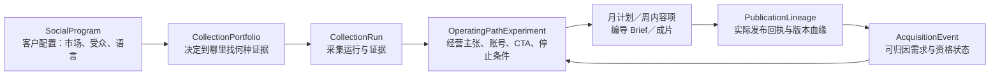

# 经营编导方案：全局数据口径与安全合并审查（v1）

审查日期：2026-09-26
审查范围：`经营Agent和编导Agent完整闭环示例-v1.md`，以及当前社媒项目、发现、Starter 任务、发布指标与客户归因实现。原“经营编导完整闭环示例”和“协同重构方案”的有效内容均已合并进入该主文档，不再单独维护。

## 结论

**方案的业务方向与现有系统大部分兼容，但不能把新文档描述的对象和流程直接并入当前接口。**

现有系统已经具备可复用的骨架：社媒项目、账号、账号规则、月／周计划均已版本化；内容工作流已有经营包、编导 Brief、内容计划和审核链；发布和指标也已有独立记录。新方案应以这些对象为基础扩展，而不是另建一套相同含义的对象。

安全合并的前提是先完成以下六项兼容工作：

1. 将市场、受众、语言和默认平台升级为有版本的企业知识配置，并让项目与 Agent 通过引用读取它。
2. 将发现范围、对标账号决策从“租户唯一”改为“项目可隔离”；保留旧数据和旧接口的读取兼容。
3. 将“经营／编导／采集”定义为**领域责任**，将 Starter 的 `orchestrator/content/traffic/sales` 保留为**任务执行角色**。任务仍须经编排器派发。
4. 用版本化的实验、采集组合、发布血缘和获客事件补齐现有数据模型；不要把结构化数据塞进 `experimentVariables: string[]` 或自由文本指标。
5. 在发布、询盘、销售承接间建立可回溯关系，并确保客户个人信息不进入提示词、灵感库或模型日志。
6. 采用新增表／新增可选字段、双读和按租户灰度的方式迁移；不改写历史工作流，不要求存量项目补全不存在的字段。

满足这些条件后，**可以安全合并为 v3 经营工作流**。在此之前，可合并文档和 UI 展示原则，但不应把它作为自动化发布或自动线索判定的运行逻辑。

## 企业知识库是市场、受众与语言的唯一配置源

市场、目标受众和内容语言属于企业长期经营配置，不属于每次新建项目的临时表单。智能经营页是客户的配置入口；企业知识库是持久化的唯一事实来源；经营 Agent 是只读消费者和差异评估者。

当前 `EnterpriseProfile` 已有可复用的 `company.mainMarkets`、`company.primaryLanguages`、`customers.targetProfiles`、`socialStrategy.routeStrategies` 和 `strategy.focusMarkets`。但它们主要是自由文本，无法可靠地支持多市场、多语言、买方角色和默认 CTA 的匹配。因此在不移除旧字段的前提下，应新增结构化的 `socialOperatingDefaults` 知识段。

```ts
interface SocialOperatingDefaults {
  version: number;
  markets: Array<{
    marketId: string;
    label: string;
    status: 'active' | 'paused';
    languages: string[];
    excludedMarkets?: string[];
  }>;
  audiences: Array<{
    audienceId: string;
    label: string;
    buyerRoles: string[];
    qualificationFields: string[];
  }>;
  defaultPlatforms: SocialPlatform[];
  defaultConversionRoute?: {
    entryType: ConversionRoute['entryType'];
    entryRef?: string;
    callToAction: string;
    handoffTarget?: string;
  };
  updatedAt: string;
  updatedBy: string;
}
```

### 配置、同步与读取规则

| 场景 | 执行方式 | 对 Agent 的影响 |
|---|---|---|
| 首次在智能经营页配置 | 通过统一的企业知识库写服务更新 `tenant_profiles.profile.socialOperatingDefaults`；同时更新旧的展示字段或由其派生展示 | 经营 Agent 从当前活动版本读取默认市场、受众、语言、平台和承接入口 |
| 新建社媒项目 | 前端只选择或确认知识库中的市场／受众组合；服务端读取企业知识版本并创建 `SocialProgram.enterpriseProfileRef` | 不要求客户重复填写；项目继承默认值，可记录经授权的项目级差异 |
| 经营 Agent 下采集指令 | 读取项目所绑定的企业知识版本和项目允许的覆盖项，生成 `CollectionPortfolio.targeting` | 对标素材语言、平台评论或播放数据不能改写客户设置 |
| 客户在企业知识库修改配置 | 写入新的知识版本，保留旧版本；发送“经营配置已变更”事件 | 经营 Agent 对后续采集、实验和下个周计划采用新版本，并输出受影响范围 |
| 已激活的本周计划／正在投放的实验 | 继续引用创建时的知识版本，不能被静默改写 | 若修改涉及语言、市场、CTA、资格字段或禁用市场，创建纠偏任务和新版本后再执行 |

这里的“同步”不应实现为智能经营页与知识库之间互相覆盖的双向复制。两者必须调用同一个写服务：智能经营页提交配置 → 企业知识库产生新版本 → 经营页面读取该版本并展示同步结果。这样客户在企业知识库中的手动修改也会成为后续经营的默认值，不会出现两份配置相互覆盖。

项目可以有少量、显式的 `overrides`，例如某一项目暂不经营知识库默认的第二市场；但项目缺省继承企业知识，不再重复存一份无版本来源的市场、受众和语言字符串。项目级覆盖必须包含原因、操作者、创建时间和有效期。

## 审查依据与当前可复用能力

| 新方案概念 | 当前实现 | 兼容判断 | 合并处理 |
|---|---|---|---|
| 正式经营项目 | `SocialProgram`、`social_programs` | 部分兼容 | 继续作为项目根对象；从企业知识库引用市场、受众、语言和平台默认值 |
| 核心账号／协同账号 | `OwnedSocialAccount.businessRole`、`social_owned_accounts` | 兼容 | 使用受控枚举值 `primary`／`secondary`，保留原 `businessRole` 字段以兼容存量 |
| 账号策略与转化入口 | `AccountPlaybook`、`ConversionRoute` | 高度兼容 | 继续由账号规则版本承载；激活时保持现有 CTA、入口、证据规则校验 |
| 月／周内容计划 | `SocialMonthlyPlan`、`SocialWeeklyPlan`、`WeeklyContentItem` | 部分兼容 | 补实验引用、母素材／变体关系和转化路线版本引用 |
| 发现与对标采集 | `SocialDiscoveryBrief`、`SocialCrawlStrategy`、`social_discovery_scopes` | 部分兼容 | 增加项目维度、采集轨道和证据状态；不能继续租户唯一 |
| 灵感大屏 | `SocialInspirationHandoff` | 兼容 | 保持为可审计证据和表达建议，不直接等同经营策略 |
| 编导 Brief 与内容质检 | `SocialDirectorBrief`、内容计划及现有审核门 | 高度兼容 | 在输入中添加经营实验和血缘引用，不复制创作对象 |
| 任务派发 | `AgentTaskEnvelopeV1` | 有约束地兼容 | 由 `orchestrator` 派发、回收；领域责任写入任务上下文 |
| 发布与指标 | `starter_social_publications`、`starter_social_metric_submissions` | 部分兼容 | 新增发布血缘映射与指标口径；不改动已有回执表 |
| 询盘与成交归因 | WhatsApp 客户记录中的 `sourcePostId/sourceTrackCode` | 部分兼容 | 新增去标识化获客事件，再关联客户／销售系统记录 |

## 需要统一的数据口径

### 1. 对象边界与唯一事实来源

| 对象 | 定义 | 唯一事实来源 | 不应承担的含义 |
|---|---|---|---|
| 企业经营配置 | 市场、受众、语言、默认平台和承接入口的长期配置 | `EnterpriseProfile.socialOperatingDefaults` 的活动版本 | 每个项目单独维护一份无版本来源的副本 |
| 社媒项目 `SocialProgram` | 引用企业经营配置，并承载经授权项目差异的经营根对象 | `social_programs` + `enterpriseProfileRef` | 对客户市场配置的反向猜测 |
| 采集组合 `CollectionPortfolio` | 到何处、以何覆盖配额收集什么证据 | 新增采集组合版本 | 经营主张本身、内容排期 |
| 经营路径实验 `OperatingPathExperiment` | 哪类买方，在何平台／账号，看到何主张和 CTA，验证何结果 | 新增实验版本 | 爬虫关键词或单条视频脚本 |
| 账号规则 `AccountPlaybook` | 某账号稳定的受众承诺、内容支柱、语言、CTA 和固定／实验因素 | `social_playbook_versions` | 某周的单个选题 |
| 周内容项 `WeeklyContentItem` | 本周某账号的一个可制作内容任务 | `social_plan_versions` 的周计划 | 发布回执、线索结果 |
| 编导 Brief | 将周内容项转化为可拍、可审、可执行表达 | 既有 `SocialDirectorBrief` | 经营方向或业务事实的唯一来源 |
| 发布回执 | 某内容版本实际在某平台账号发布的结果 | `starter_social_publications` | 内容策略版本 |
| 获客事件 | 从评论、私信、表单、WhatsApp 等进入的可归因需求信号 | 新增 `social_acquisition_events` | 完整客户档案、自动认定成交 |

`CollectionPortfolio` 与 `OperatingPathExperiment` 不是同一个东西：前者解决“如何找证据”，后者解决“用哪些经营配置做验证”。灵感大屏展示前者的产出，并向后者提供证据；它不能替代经营实验，也不能把单条高播放内容直接升级为策略。

### 2. 事实、推断和结果必须分层

所有面向经营判断的字段需携带以下状态，避免把不完整公开信息写成事实：

| 层级 | 示例 | 写入规则 |
|---|---|---|
| 已验证事实 | 官方主页中的语言、已验证 WhatsApp 入口、平台发布回执 | 标记 `confirmed`，带来源、抓取／确认时间 |
| 证据支持的推断 | 内容语言推断为英语区；多个视频显示工厂检测流程 | 标记 `inferred`，带证据和置信度 |
| 待验证假设 | “规格诊断 CTA 能提高有效咨询” | 只可写入实验，不可作为账号事实 |
| 经营结果 | 7 日有效咨询数、销售接受数、成交数 | 带统计窗口、平台时区、数据来源和可用性状态 |

市场与语言必须拆开。市场、受众与内容语言由客户一次配置到企业知识库；项目和经营 Agent 默认读取绑定的企业知识版本，后续新项目不重复要求填写。客户在企业知识库修改后，变更自动成为后续采集、实验和周计划的默认值。公开素材中的语言只用于补充对标证据，英语素材只能记录为“英语内容区”，不能反向覆盖客户配置或推导为具体国家市场。无法取得发布时间、播放量、评论或地域时，必须写 `unavailable`，不能以 0 代替。

### 3. 指标口径

保留当前内容产量三个字段的含义：

- `originalContentCount`：本周需要新制作的原创母内容数量。
- `adaptationVersionCount`：同一母内容为不同平台／账号制作的可区分版本数量。
- `publicationTaskCount`：实际发布任务数量。

新增指标记录应至少包含：`metricName`、`value`、`unit`、`windowStart`、`windowEnd`、`source`、`sourceTimezone`、`observedAt`、`availability`、`publicationId`。公开视频时间保留平台显示时区和统一 UTC 观测时间；不能用抓取时间替代发布时间。

“有效询盘”必须从模糊评论数中独立出来，建议状态机为：

`captured → needs_qualification → qualified → sales_accepted → quote_sent → sample_requested → won / lost / disqualified`

自动化可创建 `captured`、推荐 `needs_qualification`；`qualified` 及之后必须由销售人员或可信业务系统确认。模型不能仅依据“price?”、“DM me”自动判定有效询盘。

## 当前接口和数据模型的具体冲突

### P0：企业知识库尚缺社媒经营配置的结构化版本

当前 `tenant_profiles.profile` 已保存企业资料，并能被 `readTenantEnterpriseProfile` 读取；`SocialProgram` 也已预留 `enterpriseProfileRef`。但现有市场、语言和客户画像主要是自由文本，`enterpriseProfileRef` 在创建项目时仍为 `null`，因此无法证明某周计划到底采用了哪一版企业设置。

**处理方式：**在 `EnterpriseProfile` 增加 `socialOperatingDefaults`，并在企业知识库更新时产生不可变版本快照或版本记录。智能经营页与企业知识库共用一个写服务；项目创建服务由服务端解析当前版本写入 `enterpriseProfileRef`，不要接受前端重复提交的市场、受众和语言作为唯一事实。已有项目保留其引用版本；下一周计划根据最新版本生成新的项目／计划版本，必要时创建纠偏任务。

### P0：发现范围和跟踪账号没有项目隔离

`social_discovery_scopes` 当前每个租户仅允许一条活动范围；`social_tracked_accounts` 也仅按 `(tenant_id, accountId)` 去重。一个客户同时做多个产品线、市场或账号矩阵时，会覆盖彼此的发现范围和对标判断。

**处理方式：**为发现范围和跟踪账号新增可空 `program_id`，并创建新索引支持“同一项目只有一条活动范围”。旧记录保持 `legacy` 归属，由旧接口继续读取；新接口必须带项目 ID。不能先删除旧唯一索引再直接上线写入。

### P0：角色名称不能直接合并为 Starter 任务角色

当前 `AgentTaskEnvelopeV1` 的角色只有 `orchestrator`、`content`、`traffic`、`sales`，并且服务明确拒绝非 `orchestrator` 发起或指向 `orchestrator` 的任务。新方案中的经营、编导、采集是工作责任，不是可以直接写进当前任务信封的值。

**处理方式：**增加独立字段，例如：

```ts
type SocialDomainOwner = 'business' | 'director' | 'collection_worker' | 'content' | 'customer';

interface SocialTaskContext {
  domainOwner: SocialDomainOwner;
  requestedByDomainOwner?: SocialDomainOwner;
  programRef?: VersionedSocialRef;
  enterpriseProfileRef?: VersionedSocialRef;
}
```

编排器根据 `domainOwner` 选择能力并派发已有 Starter 角色：采集通常由 worker／受控采集执行，内容制作由 `content`，发布由 `traffic`，询盘承接由 `sales`。工作流图可写“经营 → 编导”，但运行事件必须是“经营结论已完成 → orchestrator 创建编导任务”。

### P1：现有发现模式不足以表达首轮探索

当前模式只有 `momentum`、`account`、`innovation`，无法区分对标账号、相似账号、B2B 需求、地域市场、D2C 表达参考和一方数据六类采集轨道。硬把六类塞入关键词，会丢失覆盖率、来源和适用边界。

**处理方式：**新增 `trackType` 与 `SocialCollectionRun`，保留旧三种模式做向后映射。`consumer_attention_reference` 只能提供钩子、镜头和表达启发，不能自动改变 B2B 账号频次、CTA 或询盘口径。

### P1：经营实验与计划关系尚未结构化

当前月计划只有 `experimentVariables: string[]` 与文本成功条件，周计划项没有实验 ID、账号规则版本或转化路线版本。这样无法知道一条成片到底验证了什么。

**处理方式：**新增不可变的 `social_operating_experiment_versions`，至少保存买方、账号、主张、证据、CTA、预算／产能、成功条件、停止条件和状态。周内容项引用实验版本；每次发布再引用周内容项与版本化 CTA。保留旧字符串字段用于展示和存量兼容，不把 JSON 塞入字符串数组。

### P1：发布、指标和线索没有完整血缘

当前发布表和指标表已能记录发布回执和采集时间；WhatsApp 客户记录已有 `sourcePostId`、`sourceTrackCode`。但这些记录没有统一连接到项目、账号、实验、周内容项和转化路线版本，无法支撑“哪条经营主张带来何种需求”的回答。

**处理方式：**新增 `social_publication_lineage`（以 publication ID 为键）和 `social_acquisition_events`。前者保存版本引用；后者仅保存渠道、公开／业务信号、去标识化客户引用、资格状态和处理时间。真实姓名、号码、报价、聊天内容继续保留在客户／销售系统，模型侧只使用经授权、最小化的摘要和 ID。

### P2：现有内容工作流是兼容投影，不是经营系统的唯一事实来源

`buildSocialAgentWorkflow` 当前会从输入 brief 和 weeklyPlanId 合成经营包；在 `viral_replication` 时才生成发现 Brief，并把发现创建者写为 `director_agent`。它适合单次内容生产，不足以保存探索、并行实验与发布后的经营反馈。

**处理方式：**新流程先持久化正式的项目／实验／计划对象，再把已批准版本投影为现有内容工作流输入。保持 v1/v2 可读，新增 v3 扩展字段；不要回写或重算历史工作流。

## 安全合并设计

### 四类对象的最小经营闭环

四类对象不是四张并列的“表”，而是一条从证据到业务结果的链路。保留 `SocialProgram`、账号规则、月／周计划、编导 Brief 和发布回执作为既有主对象；下面四类只补足它们之间现在缺少的关系。



#### A. 采集组合：`CollectionPortfolio`

它回答“在客户设定的市场、受众和语言约束下，本轮要向哪里找什么证据”。经营 Agent 创建，采集 Agent 执行，编导 Agent 只读取已通过筛选的表达证据。

最小字段：

| 字段 | 作用 |
|---|---|
| `portfolioId`、`version`、`programRef`、`status` | 版本、项目归属和活动状态 |
| `targeting` | 继承客户配置的市场、受众、语言；不可由爬取结果覆盖 |
| `tracks[]` | 六类来源：对标账号、相似账号、B2B 需求、地域市场查询、D2C 表达参考、一方业务信号 |
| `quota` | 每轨道平台、样本、时间窗和最大抓取成本；防止只抓最大号 |
| `inclusionRules`／`exclusionRules` | 纳入或排除的行业、语言、内容、账号类型和证据标准 |
| `stopConditions` | 覆盖达到、预算达到、权限失败、重复率过高时如何停止 |
| `evidenceFreshnessDays` | 证据的有效期；过期不能持续作为默认规则 |

产出不是“爆款列表”，而是可追溯的账号、帖子、评论问题、主页入口、发布时间和表达模式证据。每条证据都有来源 URL／平台 ID、观察时间、事实／推断状态和置信度。

#### B. 经营路径实验：`OperatingPathExperiment`

它回答“让哪类客户在什么账号和平台看到什么主张，走哪个入口，留下什么可归因需求”。这是经营 Agent 的主对象，不能被采集关键词或单条脚本替代。

| 字段 | 作用 |
|---|---|
| `experimentId`、`version`、`programRef`、`status` | 不可变版本及生命周期：`draft → approved → running → stopped/completed` |
| `targetBuyer` | 继承客户填写的受众，并可补充采购角色、决策问题、资格条件 |
| `delivery` | 平台、`ownedAccountId`、账号规则版本、每周内容数、计划窗口 |
| `proposition` | 经营主张、需要证明的事实、内容支柱、反例与禁止表达 |
| `conversion` | CTA、入口类型、转化路线版本、必填资格字段、销售承接人 |
| `hypothesis` | 可证伪描述，例如“规格诊断 CTA 比目录 CTA 带来更多补齐数量与目的国的需求” |
| `successCriteria` | 最小样本、观察窗口、有效询盘／销售接受等阈值 |
| `stopConditions` | 入口不可用、事实不成立、重复内容、预算或人力上限、连续低质量线索 |
| `evidenceRefs`／`unknowns` | 支持实验的公开或一方证据，以及尚待验证的部分 |

同一周可运行多个获批实验，但每一个都必须占用已确认账号、预算、素材和销售承接能力。并行是排期策略，不是自动扩号、自动投流或自动发布授权。

#### C. 发布血缘：`PublicationLineage`

它回答“这次实际发布的是哪一个经营实验下、哪一个周内容项、哪一版成片和哪一版 CTA”。它应是对既有 `starter_social_publications` 的附加映射，避免修改发布回执的历史语义。

| 字段 | 作用 |
|---|---|
| `publicationId` | 关联既有发布回执；平台返回的 `platformPostId` 是外部事实 |
| `programRef`、`ownedAccountRef`、`playbookRef` | 识别项目、账号和账号规则版本 |
| `experimentRef`、`weeklyPlanRef`、`weeklyItemId` | 让结果可回到经营实验和本周任务 |
| `directorBriefRef`、`productionResultRef` | 识别表达方案、最终成片及审核版本 |
| `conversionRouteRef`、`ctaVariantId` | 识别用户看到的入口和 CTA 版本 |
| `publishedAt`、`platformTimezone`、`observedAt` | 分开平台发布时间、其显示时区和系统观测时间 |
| `status` | `prepared / approved / published / failed / removed`；只有渠道回执可写入 `published` |

母素材和多平台改版均可指向同一个 `productionResultRef`，但每个平台／账号的首三秒、字幕、封面、文案、CTA 和成片 hash 需要单独记录，以支撑重复度质检和结果比较。

#### D. 获客事件：`AcquisitionEvent`

它回答“哪次可观察的需求信号来自哪个已发布内容，是否变成由销售确认的有效商机”。这是来源归因对象，不能直接等同客户档案或成交。

| 字段 | 作用 |
|---|---|
| `eventId`、`programRef`、`publicationId`、`capturedAt` | 与发布血缘和时间窗口关联 |
| `channel`／`signalType` | 评论、私信、表单、WhatsApp、网站；询价、规格、MOQ、目录、样品、合作等信号 |
| `attribution` | `confirmed / assisted / unknown`，并记录依据；不能因为同一天联系就默认归因 |
| `qualificationState` | `captured → needs_qualification → qualified → sales_accepted → quote_sent → sample_requested → won/lost/disqualified` |
| `qualificationSnapshot` | 仅记录产品、数量、国家／市场、用途等必要字段及其完整性，不放入身份信息 |
| `customerRef`／`salesHandoffRef` | 仅引用客户／销售系统的受控 ID；名称、号码、聊天全文留在原系统 |
| `stateChangedAt`／`changedBy` | 用于评估销售响应时效与状态审计 |

评论区出现“price?”可先生成 `captured`；补齐产品、数量、国家等资格字段后才进入 `qualified`，销售接受后才进入 `sales_accepted`。因此“评论数”“私信数”“有效询盘”“销售接受商机”“成交”不会混为同一个指标。

#### 对现有对象的最小接入方式

| 新对象 | 创建人／执行人 | 消费它的现有对象 | 最小新接口 |
|---|---|---|---|
| `CollectionPortfolio` | 经营 Agent 定义；采集 worker 执行 | `SocialCrawlStrategy`、`SocialInspirationHandoff` | 项目维度的组合保存、运行创建、证据读取 |
| `OperatingPathExperiment` | 经营 Agent 创建；编导 Agent 读取 | `SocialMonthlyPlan`、`SocialWeeklyPlan`、`SocialDirectorBrief` | 创建／批准／停止、周内容项绑定 |
| `PublicationLineage` | 编排器在发布准备时创建；渠道 worker 更新回执 | `starter_social_publications`、`starter_social_metric_submissions` | 以 publication ID 查询、更新渠道回执 |
| `AcquisitionEvent` | 评论／私信／表单／WhatsApp 接入创建；销售确认资格 | 客户工作流、周复盘、经营实验 | 捕获、资格更新、销售承接、按实验聚合 |

这四类对象以 `VersionedSocialRef`、`publicationId`、`weeklyItemId` 连接；不复制彼此的大段 payload。写入均要求 `tenantId`、幂等键、操作者、时间和版本校验，读取按项目权限隔离。

### 新增对象，避免破坏性修改

| 新对象／字段 | 最小内容 | 与现有对象关系 |
|---|---|---|
| `social_collection_portfolio_versions` | 来源轨道、配额、停止条件、执行预算、证据规则 | 属于项目 |
| `social_collection_runs` | 某轨道的执行时间、样本、来源、失败原因、覆盖结果 | 属于采集组合版本 |
| `social_operating_experiment_versions` | 主张、账号、CTA、指标、资源、开始／停止条件 | 被月／周计划、发布血缘引用 |
| `social_publication_lineage` | 发布回执至项目、账号、周内容项、实验、规则、路线版本的引用 | 一对一或一对多关联既有发布表 |
| `social_acquisition_events` | 去标识化来源信号、资格状态、销售承接引用、时间 | 引用发布血缘和客户系统 ID |
| 企业知识版本记录或快照 | `socialOperatingDefaults`、操作者、时间、版本 | 项目通过 `enterpriseProfileRef` 引用；历史 `tenant_profiles` 保持可读 |
| `program_id` | 发现范围、对标账号记录的归属 | 新字段必须可空，以读取历史数据 |

所有新增版本对象采用不可变写入和数字版本号，与现有 `VersionedSocialRef.version: number` 保持一致。展示层可将内容工作流中已有的字符串版本转为适配值，但持久化领域对象不要混用字符串与数字版本。

### 不应做的合并

- 不把 `primary`／`secondary` 变成新的平台、任务角色或客户身份。
- 不扩充 `STARTER_AGENT_ROLES` 来表达业务责任；这会同时影响预算、权限、任务校验和已有 worker 路由。
- 不把“并行运行全部可行经营路径”解释为同时自动开户、自动投流或自动发布。它只表示在已批准账号、预算、素材与承接能力范围内并行排入实验。
- 不用单条播放量、未知地区或抓取失败值驱动市场、频次或预算决策。
- 不把客户姓名、电话、私信全文、报价内容复制进灵感大屏、内容 Brief 或 Agent 任务输入。

## 推荐迁移顺序

### 阶段 0：契约冻结与回归样本

冻结现有 TypeScript 类型、PocketBase collection schema、路由请求／响应样本和历史 `SocialAgentWorkflow v1/v2` 夹具。建立契约测试，确保老的任务信封、发现范围、发布回执和指标提交在 v3 上线后仍可读取。

### 阶段 1：企业知识配置、存储与引用

先为企业知识库增加结构化、版本化的 `socialOperatingDefaults`，让智能经营页经统一写服务更新它。随后创建其余新增对象及发现记录的可空项目归属字段。为每一个新增写接口要求 `tenantId`、幂等键、版本号和审计来源；所有历史记录保持不可变。此阶段不改变旧 UI 的默认读取逻辑。

### 阶段 2：建立领域角色适配器

在任务上下文增加 `domainOwner`、版本化输入引用和责任链。由编排器生成实际 `AgentTaskEnvelopeV1`，并对任务结果进行回收、去重和状态转换。该适配器必须拒绝跨租户引用、过期版本、无权访问的证据和缺少 CTA／事实引用的发布请求。

### 阶段 3：接入采集和灵感大屏

客户创建项目时确认企业、市场、目标受众、内容语言、候选平台和承接方式。经营 Agent 随后写入采集组合并执行采集轨道；大屏只读取带来源和状态的证据。公开对标数据只能影响经营实验的优先级，不得覆盖客户填写的市场、受众和语言。

### 阶段 4：接入计划、内容生产和发布血缘

将实验版本引用写入月计划、周内容项、编导 Brief 和发布血缘。现有内容工作流作为 v3 的生产投影继续使用；UI 先双读新旧数据，再按项目开启新写入。发布仍经过现有媒体评估、编导、用户授权和渠道能力检查。

### 阶段 5：接入获客事件与周复盘

从评论、私信、表单、WhatsApp 及销售系统创建获客事件，关联发布血缘。周复盘仅使用明确可用的数据窗口；对低样本和 `unavailable` 指标给出“继续收集／补证据”的结论，不做虚假的优劣排名。

### 阶段 6：按租户灰度和可回退发布

使用功能开关，例如 `social_operating_v3`。先在内部测试租户影子生成对象和报表，不自动外发；再选择一个低风险租户启用新写入。出现异常时关闭新写入口、继续读取既有项目和发布记录；新增对象不删除，作为审计资料保留。

## 合并验收清单

| 验收项 | 必须证明的结果 |
|---|---|
| 知识配置同步 | 智能经营页保存市场／受众／语言后，企业知识库产生同一版本；后续新项目无需重复填写且能引用该版本 |
| 知识变更影响 | 企业知识库修改语言、市场、CTA 或资格字段后，下一周计划使用新版本；活动计划仍保留原版本并生成待处理纠偏项 |
| 多项目隔离 | 同一租户两个市场可各有一个活动发现范围和同一对标账号的独立判断，互不覆盖 |
| 历史兼容 | 旧 discovery scope、tracked account、workflow v1/v2、发布／指标接口读取结果不变 |
| 并发控制 | 账号规则、月／周计划、实验版本更新都按 `expectedVersion` 冲突返回，不能静默覆盖 |
| 任务安全 | 所有 Starter 任务仍由 `orchestrator` 派发；领域责任不绕过既有任务校验 |
| 证据完整 | 每个周内容项都能回溯至事实来源、账号规则版本、实验版本和 CTA 路线 |
| 发布安全 | 无有效账号连接、无事实引用、无已批准 CTA 或审批未通过时不能形成外部发布操作 |
| 指标可解释 | 所有播放、互动、询盘指标带窗口、来源、时区和可用性；未知值不转为 0 |
| 线索隐私 | Agent 任务、灵感大屏和报告中不含未经授权的姓名、号码、私信全文和报价全文 |
| 回滚能力 | 关闭 v3 开关后，历史项目、现有内容生产和发布回执仍正常运行 |

## 可以立即合并的内容

以下内容不改变运行时数据含义，可先合入产品文档和 UI 文案：

- 核心账号（Primary Account）／协同账号（Secondary Account）的命名和职责说明；
- “客户在企业知识库一次配置、项目继承、再采集验证、再进入周计划”的业务流程；
- 六类采集来源及 D2C 仅用于表达参考的边界；
- 经营 Agent 定义经营问题、编导 Agent 定义表达方案、内容 Agent 执行制作的责任原则；
- 编导 Brief、成片、发布、线索、周复盘的质检门说明。

这些内容应在实现层落为上述对象和适配器后，才启用自动排期、发布和基于询盘的纠偏。

## 审查结果

当前状态为：**可进行“增量式、特性开关保护的 v3 合并”设计与开发；不建议直接替换现有发现接口、任务角色枚举或项目创建接口。**

最先解决的两项是企业知识库的结构化版本，以及项目级发现隔离。客户一次配置市场、受众和语言后，经营 Agent 可以直接围绕所绑定的知识版本下采集指令；后续灵感大屏、并行经营实验、周内容计划和询盘归因才不会串数据。
