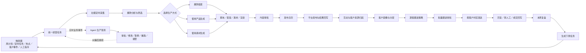

# 数字员工：经营任务编排与生产现场开发方案

> 状态：产品方案已确认，进入 P0 实施  
> 更新日期：2026-09-03

## 1. 产品定位与整体任务流

数字员工应定位为“跨内容与客户模块的经营任务编排层”，而不是第三套独立工作流。业务产物仍保存在原内容、发布和客户模块；数字员工负责触发、编排、监督、审批、纠偏和复盘。



核心原则：

- 每个任务必须落到原有内容、发布或客户能力，不能只生成数字员工自己的泛化结果。
- 生产实况展示可验证的业务状态、输入、产物和外部回执，不展示模型隐藏思维过程。
- 每个任务都能跳回原工作台继续处理，并携带统一 `runId`、`taskId` 和业务对象引用。
- 下游模块的真实状态是任务状态的唯一事实来源；未接通时明确显示“待接入”，不模拟成功。

## 2. 首次登录

首次登录不让用户先创建员工、选择 Agent 或搭工作流，而是直接从已有业务资产生成第一周经营计划。

```text
登录
→ 盘点企业资料、产品、社媒账号、爆款库、内容历史、客户与会话
→ 展示已就绪和缺失项
→ 用户确认本阶段目标、重点产品、市场与客户
→ 设置自动化和审批边界
→ Agent 生成首周任务图
→ 用户预览任务、数量、时间和产物去向
→ 批准启动
→ 自动进入第一个生产任务
```

首次只要求用户确认：

- 目标：涨粉、获客、询盘、成交或老客激活。
- 范围：重点产品、市场、平台、客户层级。
- 节奏：每天采集、每周内容量、发布时间、跟进频率。
- 权限：哪些动作可自动执行，哪些动作必须审批。

示例首周计划：周一自动采集目标市场爆款，精确分析并选择 3 条参考，为重点产品裂变 6 条内容并生成 2 条产品型内容；审核后进入发布日历；发布结果和询盘回流后完成客户分层，周五生成逐客跟进包，审批发送并在周末复盘。

## 3. 常规登录、生产实况与纠偏

常规登录默认进入“今日总览”，而不是员工列表。首屏包括：

- 正在执行：内容、发布、客户三类任务。
- 等待我决策：审批、异常、低置信度结果。
- 今日已完成：产物及其业务去向。
- 接下来 24 小时：采集、发布和跟进计划。

点击任务进入三栏生产现场：

| 区域 | 内容 |
| --- | --- |
| 左侧 | 业务任务图、上游依赖、当前节点、后续节点 |
| 中间 | 爆款分析、脚本、视频、发布排期、客户名单、分层结果、逐客话术 |
| 右侧 | 执行依据、风险、预计完成时间、审批、修改、暂停、重跑、接管 |

每条实时事件必须回答：为什么触发、正在处理哪个业务对象、调用了哪个已有能力、当前进度与真实回执、生成了什么中间产物、下一步去哪里以及是否需要人工介入。

纠偏流程：

```text
发现偏差
→ 修改当前业务对象
→ 查看受影响的下游任务
→ 选择“仅本次生效”或“沉淀为长期规则”
→ 从当前节点继续或重跑下游
→ 保留修改前后版本和操作记录
```

纠偏范围包括：

- 更换爆款、修正精确分析。
- 更换产品，切换爆款裂变、使用产品生成或使用素材生成。
- 修改脚本、替换素材、重新质检或渲染。
- 调整账号、发布时间，取消或重试某个平台。
- 修正客户阶段、意向、BANT、标签和来源归因。
- 排除某些客户，修改逐客话术或批次时段。
- 在 AI 自动、草稿审核和人工接管之间切换。

默认权限：读取、分析、分层、生成草稿和创建内部定时任务可以自动完成；平台发布和批量客户发送需要审批；价格、MOQ、付款、交期等商业承诺以及高风险客户必须人工处理。

## 4. 本周复盘

本周复盘必须基于真实任务、发布和客户结果，而不是用 Agent 生成一段泛化总结。

页面分为：

1. 目标与任务：计划、完成、失败、阻塞、人工接管。
2. 内容表现：采集和分析成功率、产量、渲染成功率、准时发布率、平台结果。
3. 客户表现：新增分层、高意向客户、触达、回复、转人工、报价、成交。
4. 跨模块归因：`爆款 → 裂变内容 → 产品 → 发布 → 询盘 → 客户分层 → 跟进 → 回复/成交`。
5. 下周建议：继续、停止或调整关键词、爆款、产品、平台、节奏及客群，并生成下周任务。

没有真实回写的数据必须显示“尚未接通”或“等待回流”，不能用模拟数值补齐。

## 5. 与现有技术栈的结合边界

### 5.1 已有内容能力

- 经营自动化 Scheduler：关键词视频采集、图文采集、对标账号采集、趋势报告等。
- 灵感中心：爆款基础、策略和全片精确分析，以及人工纠偏。
- 内容创作：爆款裂变、使用产品生成、使用素材生成；脚本、配音、字幕、素材、质检、渲染。
- 发布链路：平台文案适配、账号选择、发布日历、定时发布、逐账号结果与失败重试。
- 效果回流：内容表现、询盘与成交信息。

经营自动化 Scheduler 与发布日历是两个不同系统：前者负责采集、分析和报告，后者才负责真实对外发布。产品与状态命名必须明确区分。

### 5.2 已有客户能力

- WhatsApp 会话导入、客户来源归因。
- 客户阶段、BANT、真实性、意向与优先级判断。
- 单客 AI 草稿、自动回复授权、风险拦截和人工接管。
- 24 小时窗口与消息模板校验。
- 知识缺口、人工修改、发送结果和风格学习记录。

### 5.3 P0 必须补齐

- 统一跨模块任务 ID、业务对象引用和 append-only 事件流。
- 下游真实业务事件聚合到数字员工生产现场。
- 服务端任务交接上下文，替代把浏览器存储当作跨模块任务事实来源。
- 可保存的客户分层、圈选快照、排除名单和批量跟进批次。
- 批次的逐客草稿、审批、计划、发送、暂停、撤销、重试与结果回写。
- 基于真实自然周数据的复盘聚合。
- 将“作品制作完成”与“已经发布到平台”拆成不同状态。

### 5.4 批量发送 Worker（已接通）

批量跟进继续采用“逐客草稿 → 整批审批 → 按逐客计划发送”的模型。Worker 不把批次批准视为发送成功，只处理当前版本已批准且已到计划时间的单客任务。

发送状态流：

```text
approved
→ 发送前重新检查客户、号码、退订、人工接管、BANT/真实性、红线文案与 24 小时窗口
→ sending（写入执行占位，避免进程重启后盲目重发）
→ Meta 接受并返回 message ID
→ sent
→ Webhook 回写 delivered / read / failed
```

运行约束：

- `FOLLOWUP_WORKER_ENABLED=false` 时为手动触发模式；手动 dispatch 仍必须同时满足租户已允许真实客户消息、批次版本已审批、Meta WhatsApp 凭据有效及逐客安全检查。
- 显式设置 `FOLLOWUP_WORKER_ENABLED=true` 后，每 15 秒扫描批次，但只处理租户已授权、凭据有效、已批准且到期的任务；扫描间隔、最大重试次数和逐客间隔均可通过环境变量配置。
- 当前版本采用单活 Worker，部署时只能在一个服务实例启用后台扫描，避免多个实例竞争同一发送项。
- 文本气泡逐条保存 Meta message ID；如果一条逐客任务只发送了部分气泡，状态进入 `partial_sent` 并停止自动重试，交由人工核对。
- 临时网络或限流错误采用指数退避，永久错误直接失败；进程在取得 Meta 回执后立即持久化，不凭本地调用结果伪造送达。
- 超出 24 小时窗口的客户必须使用已审核模板；模板未配置或未审核时继续拦截。
- Meta Webhook 的 `sent / delivered / read / failed` 回执写回逐客任务、批次统计、周复盘及 Agent 生产现场事件流。

## P0 验收口径

- 数字员工首页包含“今日总览、生产现场、本周复盘、规则与权限”四个视图。
- 首次登录能够从业务资产盘点进入首周任务预览和批准启动。
- 新工作流任务由真实业务节点组成，并能跳转到对应工作台。
- 生产现场能够持续显示可验证事件、中间产物、阻塞与外部动作回执。
- 用户能够审批、纠偏、暂停、重跑或接管，并保留版本与审计记录。
- 客户分层和批量跟进采用“逐客草稿 → 人工抽检/整批批准 → 分时发送”的安全默认模式。
- 周复盘只使用真实聚合数据；无数据项明确标识数据缺口。

## 6. 真实用户全链路审计与修复基线（2026-09-03）

本轮以“清空数字员工状态 → 首次配置 → 确认周目标与工作流 → 批准计划 → 观看生产现场 → 进入原内容/客户工作台 → 纠偏 → 查看复盘”为完整路径进行验收。以下项目不是独立页面优化，而是同一条业务链路的强制契约。

### 6.1 计划必须真实反映用户选择

- `enabledWorkflows` 必须决定任务图中的节点与依赖，未选择的工作流不得仍生成任务。
- 内容生产可以根据用户选择从爆款裂变、产品生成、素材生成分别进入；没有选择爆款能力时，不得被爆款分析永久阻塞。
- 批准前必须检查社媒账号、企业产品、可用素材、真实客户等资源，并按所选工作流列出“已就绪 / 缺失 / 可跳过”。
- 同一租户存在运行中目标时，不允许重复创建另一条活跃周计划；需要先完成、取消或明确替换。

### 6.2 启动、执行与 Worker 状态必须可信

- 批准计划后除创建后续定时任务外，还要触发首次执行，并自动进入生产现场。
- “已入队、Worker 执行中、执行成功、执行失败、Worker 离线”是不同状态，前端不得把入队显示成执行完成。
- 中文关键词必须以参数数组安全传给采集器，搜索目标不能误作 `Referer`。
- 模型未配置、调用超时、候选被隐藏或质量不足时，界面必须展示原因、影响范围、重试与人工恢复入口。
- 列表加载和异步任务等待必须有明确加载态与自动刷新，不能先显示错误的零值再悄然变化。

### 6.3 任务完成证据必须属于本次运行

- 内容项目、作品、发布记录、客户分层及跟进批次必须携带或可追溯到当前 `runId`、`taskId` 或任务创建的业务对象引用。
- 任务观察器只能使用该任务启动后、本次运行关联的证据；租户历史数据不能让新任务自动完成。
- 深链进入原工作台时必须携带 Agent 来源、当前任务、重点产品和返回路径，并落到能完成当前动作的具体子视图。
- 模拟客户与真实客户必须明确区分；模拟数据不得计入真实客户任务和周复盘。

### 6.4 纠偏必须改变执行结果

- 纠偏需明确支持：修改参数并重跑、跳过可选节点、人工完成、降级到其他工作流、人工接管后交还。
- 提交纠偏后必须重算受影响的下游依赖，不能只记录一个新版本后继续等待同一条件。
- 每次纠偏保留修改前后参数、操作者、影响节点和执行结果，并在生产现场即时反馈。
- 与当前任务无关的动作不得普遍出现，例如只有客户承接任务才展示“查看承接会话”。

### 6.5 页面交互与复盘必须解释当前处境

- 首次配置保存后自动滚动到周目标；计划批准后自动进入生产现场。
- 企业名称、行业、重点产品应复用企业中心的真实实体；内部指标 slug 和能力代码统一转换为业务语言。
- 运行中的规则页使用“调整配置”语义，不再显示“首次配置 / 保存并进入周目标”。
- 创作工作台缺少产品或素材时必须阻止生成并显示具体校验；切换创作模式不得覆盖用户填写的项目名称。
- 活跃或阻塞中的周计划也能查看阶段复盘，说明已完成、等待、阻塞多久、为何阻塞及下一步。
- 全局助手默认不得遮挡首次配置、计划批准、审批和纠偏等核心操作。

### 6.6 回归验收路径

1. 将测试账号恢复到无配置、无目标、无运行记录的初始状态。
2. 分别选择“仅产品生成”“仅素材生成”“爆款裂变 + 发布”“客户分层 + 批量跟进”创建计划，核对任务节点和依赖差异。
3. 对缺账号、缺产品、缺真实客户的组合验证批准前预检与跳过/补齐路径。
4. 批准可执行计划，确认首次任务立即入队，生产现场依次展示 Worker 的真实状态和回执。
5. 从生产现场进入内容与客户工作台完成动作，确认返回后仅当前任务被对应证据推进。
6. 在阻塞节点分别测试重试、改参数、跳过、人工完成和人工接管，确认下游任务重新计算。
7. 查看进行中复盘和自然周复盘，确认模拟数据、历史无关数据和未接通数据均未被伪装成成果。

本地测试账号可使用 `npm run digital-employee:reset-local -- <local_tenant_id>` 回到数字员工初始状态。命令会先按时间创建备份，只清理该租户的数字员工编排记录、数字员工创建的定时任务及对应采集队列，不删除企业产品、内容素材、普通客户或人工创建的定时任务。

首次配置保存时，系统会把企业名称、行业、目标市场和主营业务补充到同租户企业档案的空字段中；企业中心已有值优先，数字员工不得覆盖更完整的企业资料。

### 6.7 可重复的上限验收

完成一次隔离租户验收后，使用只读验收器生成统一证据报告：

```bash
DIGITAL_EMPLOYEE_E2E_TENANT_ID=<local_tenant_customer_...> \
npm run verify:digital-employee-e2e
```

报告逐项核验首次配置、首周目标、公开来源、视频级精确分析、真实产品与素材、成片文件及质量回执、发布安全停靠、逐客草稿审批、WhatsApp provider message id、周复盘和 mock/demo/fixture 污染。结果分为：

- `passed`：有可核验证据，或在没有发布账号时正确安全停靠且没有伪造回执。
- `waived`：仅用于本轮已明确豁免的外部通道回执；豁免项会单独列入 `waivers`，不会被伪装成已经接通。
- `blocked`：缺少真实输入、模型、账号、授权测试接收方或外部回执，流程保持失败即停。
- `failed`：发现违反真实性或授权边界的结果，例如未接账号却出现发布回执、消息状态为 sent 但没有 provider message id。

真实 WhatsApp 验收使用独立的强确认命令，只允许整个已审批批次命中同一个明确授权的测试客户与测试号码；混入任何其他接收方都会拒绝执行：

```bash
WHATSAPP_E2E_CONFIRM=SEND_TO_AUTHORIZED_TEST_RECIPIENT \
WHATSAPP_E2E_TENANT_ID=<tenant> \
WHATSAPP_E2E_BATCH_ID=<batch> \
WHATSAPP_E2E_CUSTOMER_ID=<customer> \
WHATSAPP_E2E_RECIPIENT=<number> \
npm run verify:whatsapp-real-send
```

Meta 暂时不可连接、且本轮验收已经明确允许跳过真实发送时，可为统一报告加入显式豁免。此参数只豁免 provider 回执，不豁免客户分层、逐客草稿、人工审批，也不会掩盖缺少 `provider_message_id` 的假发送状态：

```bash
DIGITAL_EMPLOYEE_E2E_TENANT_ID=<local_tenant_customer_...> \
DIGITAL_EMPLOYEE_E2E_WAIVE_WHATSAPP=true \
DIGITAL_EMPLOYEE_E2E_WHATSAPP_WAIVER_REASON='Meta 当前暂不可连接' \
npm run verify:digital-employee-e2e
```

视频级精确分析只在启用“爆款裂变”时默认必选；仅产品生成或仅自有素材生成不会因缺少视频语义模型被误判为失败。可通过 `DIGITAL_EMPLOYEE_E2E_REQUIRE_EXACT_ANALYSIS=true` 强制核验。

当前无法连接 Meta 时，可以运行一条会自行创建并精确清理隔离租户的非 Meta 全链路冒烟。它使用本机现有的真实产品图和自有视频，执行公开来源采集、产品/素材两条内容生产路径、成片质检、客户分层、逐客草稿审批、发送预检失败即停及周复盘；不会调用真实发布或消息发送接口：

```bash
npm run smoke:digital-employee-non-meta
```

隔离测试租户验收结束后先预览清理范围，再显式确认执行：

```bash
DIGITAL_EMPLOYEE_E2E_TENANT_ID=<local_tenant_customer_...> \
npm run cleanup:digital-employee-e2e

DIGITAL_EMPLOYEE_E2E_TENANT_ID=<local_tenant_customer_...> \
DIGITAL_EMPLOYEE_E2E_CLEANUP_CONFIRM=CLEAN_ISOLATED_LOCAL_TENANT \
npm run cleanup:digital-employee-e2e -- --apply
```

清理器只接受随机生成的本地客户租户 ID，动态扫描本地业务集合，同时清除该租户的认证记录、素材、企业资产、成片、采集与用量引用；其他租户保持不变。被移出的数据会进入带时间戳的可恢复备份，并在命令结束前再次扫描活动数据确认无残留。
