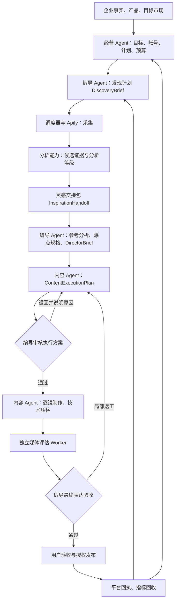
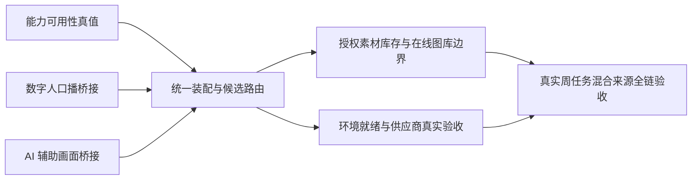

# 灵枢开发文档

> 用途：持续记录产品讨论、Agent 协作方案、开发共识、实现进展与验收证据。
> 建立日期：2026-09-25
> 最近更新：2026-09-25
> 首次代码核对基线：`codex/safe-merge-inspiration-director-20260924`，合并提交 `28f2f92`，包含远端 `9d6095c`。
> 核对范围包含当时本地未提交的数字人开发改动；不代表这些改动已提交、部署或完成真实业务验收。

## 1. 文档维护与状态口径

用户于 2026-09-25 明确要求：此后开发和讨论过程中形成的共识与进展，一同写入本文档。

- 已确认共识：用户明确确认的决策或要求，记录日期和适用范围。
- 目标方案：需求文档描述的预期行为，不等于当前实现。
- 代码核查：注明核查日期、基线、实现入口与缺口。
- 已验证进展：注明验证命令、结果和边界；不能以单元测试代替真实业务验收。
- 待讨论建议：尚未确认的优先级、设计取舍与实施方案，不写成既定共识。
- 后续变更同时更新对应正文与末尾记录，不只追加日志；历史结论被替代时说明原因。
- 跨会话开发者需主动读取和维护本文档；本文档不会自动向其他会话发送消息或采集其进展。

仓库已有 [灵枢 AI 产品开发文档](灵枢AI产品开发文档.md)，其开头基线是 2026-09-10 的历史快照。本文记录本次整合及后续讨论，不将旧文档的能力状态自动视为最新状态。

## 2. 需求来源与整体结论

本次阅读的文件：

1. 用户提供的 [PRD-灵枢AI当前系统-v3(1).md](/Users/julia_chen/Downloads/PRD-灵枢AI当前系统-v3(1).md)，正文版本为 v3.5，更新日期 2026-09-24。
2. 用户提供的 [灵感大屏行业采集与编导交接策略-v1.md](/Users/julia_chen/Downloads/灵感大屏行业采集与编导交接策略-v1.md)，更新日期 2026-09-23。

两份文档可以组成同一套流程。PRD v3.5 已吸收采集策略的大部分内容：采集策略细化“参考从哪里来、怎样筛选”，PRD 负责“如何转成导演方案、制作、验收和复盘”。文档内容作为需求与设计材料，不作为执行采集、付费调用、发布或部署的授权。

2026-09-25 代码核查结论：主要交接结构、部分执行链和阻断规则已实现；完整的多 Agent 自动经营闭环尚未完成。不能因为存在类型定义、页面或 Agent 名称，就认定对应自主决策与交接已完成。

## 3. Agent 职责与整体交接流程

核心为经营 Agent、编导 Agent、内容 Agent。采集、分析、媒体检测、发布与指标 Worker 执行具体工作。Apify Actor 是采集工具，不是另一个数字员工；定时任务也不承担内容方向决策。



### 3.1 各角色的决定权

| 角色 | 负责决定或产出 | 不应越权决定 |
| --- | --- | --- |
| 经营 Agent | 为什么做、做多少、目标产品与受众、账号平台、CTA、预算、节奏、成功标准 | 具体镜头、素材片段、模型与供应商 |
| 编导 Agent | 发现方向、参考选择、爆点因素与置信度、钩子、叙事、逐镜效果、事实边界、验收标准和最终表达放行 | 擅自改变经营目标，提前锁死具体素材或技术路线 |
| 内容 Agent | 候选素材、片段、模型、供应商、数字人、配音、字幕、剪辑、渲染、技术质检与修复 | 改写事实、叙事与关键验收标准，自行批准最终创意质量 |
| 采集与分析能力 | 按范围采集、保存来源与费用、输出分析证据与缺失项 | 自行扩大市场、预算、授权范围或决定生产采用 |
| 媒体评估 Worker | 按冻结规格检测并记录证据、失败项和风险 | 修改导演目标、放宽权重或自行发布 |
| 平台与指标 Worker | 发布执行、真实回执、账号基线和指标快照 | 将相关性认定为因果，擅自更改账号策略 |

核心边界：编导定义“要达到什么效果”，内容 Agent 决定“具体怎么做”。

### 3.2 每一步传递什么

| 交接 | 正式交付内容 | 接收方动作与门槛 |
| --- | --- | --- |
| 经营 → 编导 | 目标、事实来源、账号、受众、CTA、预算、截止时间、成功标准；`WeeklyContentPackage` 或 `AdHocBusinessContext` | 决定表达与参考方向，不擅自改变经营目标 |
| 编导 → 采集执行器 | `DiscoveryBrief`：平台、词簇、账号、时间范围、数量、费用和停止条件 | 先查库存，必要时按批准范围补采；任务临时扩词不得静默写回长期策略 |
| 采集／分析 → 编导 | `CollectionRunResult`、`CandidateEvidence`、来源、费用、分析版本、缺失项与权利边界 | 分别判断相关性、平台内表现、可迁移性，选择参考 |
| 灵感中心 → 编导 | `InspirationHandoff`：为何选、可借鉴内容、必须替换内容、证据、风险与就绪等级 | 根据等级用于选题、结构参考或逐镜设计 |
| 编导 → 内容 | `DirectorBrief`；裂变任务另附 `ReferenceAnalysis` 与 `ReplicationFactorSpec` | 选择具体素材、时间片段、模型、供应商、成本与备选路线 |
| 内容 → 编导 | `ContentExecutionPlan`：逐镜候选、成本、耗时、可行性、权利、来源与 fallback | 生成 `ExecutionPlanReview`；明确失败条件、原因码、修改要求及目标影响 |
| 审核通过 → 内容执行 | 已锁定的导演与执行方案版本 | 制作、技术质检；失败按受影响镜头修复，往返受预算、次数和期限限制 |
| 制作／评估 → 编导 | `ProductionResult`、技术质检、独立 `ReplicationEvaluation` 及原始证据 | 最终表达验收，通过或局部退回；不能用生成模型自评替代独立检测 |
| 用户验收 → 发布执行 | 已验收成片、发布包、目标账号及独立发布授权 | 按权限审批执行，保存真实平台回执；确认制作计划不等于授权发布 |
| 发布／指标 → 经营与编导 | 自有账号表现、发布时间与指标范围、采用／放弃反馈 | 调整计划、来源优先级和因素证据；外部高播放不等于自有业务效果 |

### 3.3 交接对象应如何关联

目标方案要求通过可保存、可追溯的结构化对象交接，不只传聊天记录或脚本文字。

- 绑定同一经营项目、目标账号、内容任务和版本引用。
- 下游明确引用上游版本，审核结果对应具体执行方案版本。
- 企业事实、参考视频、分析、素材与成片保留来源关系。
- 参考或导演方案变更产生新版本，按影响范围使下游结果失效或重做。
- 单视频高保真任务冻结唯一主参考；其他参考只能补充约定角色。
- 新任务以统一对象为主数据，旧任务只读适配，是需求目标；当前尚不能认定此迁移全部完成。

### 3.4 灵感的三级生产门槛

| 等级 | 使用范围 | 不能据此承诺 |
| --- | --- | --- |
| `discovery_reference` | 选题探索、继续查找参考 | 已能生成可靠逐镜方案 |
| `strategy_reference` | 钩子、结构、证明顺序、节奏与 CTA 参考 | 已具备完整精确镜头证据 |
| `production_reference` | 连续逐镜分析足够完整，辅助精确分镜设计 | 自动获得原素材下载、改编或发布权利 |

关键时间线缺失、来源失效、权利不明或关键观察证据不足时，不应作为生产级参考。事实和身份元素仍须替换为已确认的企业信息。

### 3.5 DirectorBrief 的逐镜内容

每镜至少应包含：叙事作用、目标视觉、必须证据、动作开始／路径／结束状态、景别与机位、空间连续性、声音层、时间范围、真实性与权利边界、允许变化、引用的爆点规格、可观察的验收条件。

具体 `assetId`、素材片段、模型、供应商、提示词、重试策略由内容 Agent 的执行计划管理。不能以“高级感”“爆款感”等抽象描述独立充当验收条件。

## 4. 当前完成度：2026-09-25 代码核查

| 环节 | 状态 | 已有能力与主要缺口 |
| --- | --- | --- |
| 经营项目、自有账号、月周计划 | 基础数据与 API 已有，页面部分完成 | 有版本与激活门槛；计划页只有月计划表单，周计划编辑器尚待接入 |
| 发现范围、角色、市场与词簇 | 部分实现 | 有页面、保存 API 与版本；调度仍从企业资料／关键词重新构建策略，未完整消费已保存范围 |
| 对标账号积累与晋级 | 状态与记录已铺设 | 有账号决策 API；未看到试采、增量采集、定期复核调度的完整连接 |
| 灵感 → 编导 | 对象与等级判断已有 | 能从参考分析生成 Handoff；完整候选筛选、自动补采、分析升级后续跑未形成已验证闭环 |
| 编导 → 内容 → 审核 | 结构和规则门槛已有 | 有逐镜审核与生产前检查；多个角色输出仍由同一函数从旧任务派生 |
| 内容制作与技术质检 | 已有实际执行链 | 有自动生产、素材供给、渲染与质检；本地数字人改动仍未提交，不能全部算入远端版本 |
| 爆点规格与独立媒体评估 | 规格、评估器、阻断框架已有 | 完整因素、身份替换、复用风险检测证据链未接齐 |
| 发布、指标与策略回流 | 基础能力已有，完整闭环未证实 | 有发布包、回执与指标记录；自动回写词簇、账号晋级、Playbook 与因素证据未证实 |

不提供总体百分比：尚未建立统一验收项及权重，百分比会掩盖关键连接点缺失。

## 5. 四个关键断点及代码依据

### 5.1 保存发现范围与实际采集口径尚未统一

发现范围保存于独立集合；关键词采集函数仍调用 `resolveCrawlStrategy`，从企业资料与任务关键词重建策略。页面确认范围与执行口径存在不一致风险。

依据：[发现范围存储](../server/routes/socialDiscovery.ts)、[采集调度 executeVideoKeywordCrawl](../server/routes/scheduler.ts)。

### 5.2 Agent 对象展示不等于独立、持久化的交接

`buildSocialAgentWorkflow` 一次构建发现计划、导演方案、执行计划和审核结果；任务读取时从旧任务、参考分析和素材计划生成这些对象。执行计划主要由已有 `AssetSupplyPlan` 转换。

已有结构与规则不等于完成“各方独立保存版本 → 退回修改 → 锁定执行”。

依据：[工作流构建](../server/starter198/socialContentAgentWorkflow.ts)、[任务读取适配](../server/starter198/socialContentRecords.ts)。

### 5.3 新经营主链尚未完整连接原生产主链

新服务可以保存月周计划，但周计划编辑器尚未完成。当前主要生产读取路径未显式传入完整新经营上下文；账号、Playbook、周任务与成片的版本关系仍需贯通。

依据：[计划页面](../src/components/socialProgram/SocialPlanningPage.tsx)、[经营项目服务](../server/socialPrograms/service.ts)。

### 5.4 评估框架已能识别缺证据，检测证据的生产链尚未齐备

评估器主要消费检测结果。当前生产调用仅显式传入输出文案，未提供完整因素检测、身份替换和复用风险证据。最终创意审核主要检查方案通过、镜头存在、验收条件存在，不能等同于独立编导逐镜查看成片。

准确状态：已建立评估与拦截框架，尚未完成 PRD 所述独立成片检测与表达验收。

依据：[生产评估调用](../server/starter198/socialContentAutoProduction.ts)、[评估适配器](../server/starter198/replicationEvaluationAdapter.ts)、[证据评估器](../server/lib/replicationEvaluation.ts)。

## 6. 待讨论的整合建议

以下来自本次分析，尚不标记为用户已确认的产品决策。

1. **按参考模式确定保真范围。** 采集策略偏向迁移钩子、结构和节奏；新版 PRD 扩展至动作、环境、物体状态等有证据的保真。建议普通灵感迁移结构，单视频高保真冻结逐镜因素，避免所有参考采用同一标准。
2. **按自动化模式决定采用权限。** 建议模式由用户选择；协作模式保留关键确认；托管模式在批准范围内自动采用。统一文档中“默认自动选择”与模式差异的关系。
3. **优先验证一个完整经营任务。** 从周任务读取已保存范围，召回一条参考，完成版本化交接、制作、独立检测、验收与结果回流，再扩大多平台和账号自动积累。尚未据此启动实施或付费实测。

## 7. 验证证据与限制

2026-09-25 合并任务中已通过：

- `pnpm run lint` 与 `pnpm run build`。
- `pnpm run test:social-programs` 与 `pnpm run test:social-content-frontend`。
- EffectPlan 契约、桌面特效合成及桌面配音渲染测试。
- 创作工作台流程契约、素材匹配回归、口播冻结、服务端 Studio 流程契约及社媒内容工作流测试。

构建有大于 500 kB 的分包提示，不影响本次构建成功。未运行完整测试集；未以真实采集、付费生成、外部发布和发布后指标完成端到端验收。本次文档创建没有重复运行上述测试。

## 8. 共识与进展记录

| 日期 | 类型 | 记录 | 证据与边界 |
| --- | --- | --- | --- |
| 2026-09-25 | 已验证进展 | 拉取远端 `9d6095c`，合并为 `28f2f92`；恢复本地开发改动，处理创作工作台一处冲突 | 保留数字人配音校验与特效校验；未推送、部署或执行数据库迁移 |
| 2026-09-25 | 代码核查 | 梳理两份文档及 Agent 交接，识别四个关键断点 | 见第 4、5 节；不是线上验收报告 |
| 2026-09-25 | 用户明确要求 | 数字人开发测试使用合并后的最新工作区代码 | 用户请求转告另一会话；因没有跨会话发送工具且界面访问受限，未实际送达，已提供转发文本 |
| 2026-09-25 | 已确认共识 | 建立本文档，后续讨论共识与开发进展持续记录 | 用户明确要求；待讨论方案与已实现事实分开记录 |
| 2026-09-25 | 代码核查 | 清点内容 Agent 技术栈与素材来源，确认并非全部跑通 | 见第 9 节；本轮只运行不会产生付费调用的本地契约与渲染测试 |
| 2026-09-25 | 已确认开发安排 | 并行处理内容 Agent 断点，先开发能力真值、数字人口播桥接和 AI 辅助画面桥接 | 已创建三个开发会话；主会话负责依赖协调、集成验证和文档维护，见第 10 节 |
| 2026-09-25 | 已验证进展 | 第一批三个并行任务完成核心实现并通过集成检查 | 能力真值、数字人口播桥接、AI 辅助画面桥接已落地；全库 TypeScript 检查和三个专项测试通过，尚未进行真实供应商全链验收 |
| 2026-09-25 | 代码核查 | 复核内容 Agent 之前的经营 Agent 与编导 Agent 技术栈和决策路径 | 职责、对象和主要门槛基本明确；经营决策引擎、编导自主推理、持久化交接和反馈学习仍有关键缺口，见第 11 节 |

后续记录格式：日期、类型、决策／变更、涉及对象或文件、验证结果、剩余问题。每次开发前重新检查 Git 状态，避免沿用本文首次基线而忽略后续并行改动。

## 9. 内容 Agent 技术栈与素材来源清点（2026-09-25）

### 9.1 结论

内容 Agent 的技术栈和素材来源接口**没有全部跑通**。当前主链可可靠执行的是：客户已上传素材、企业知识与事实来源读取、本地安全图文／事实卡、已有共享素材的受控选用、FFmpeg 合成与技术质检。

数字人口播、参考人物重演、通用 AI 图片／视频生成各自存在接口或适配器，但没有完整接入社媒内容 Agent 的逐镜素材执行器；其中 Seedance 当前真实 API 记录为 HTTP 403，不能标记为跑通。在线授权图库目前是“读取已有共享库存”，不是实时检索供应商接口。

代码中的 `CAPABILITIES.availability = available` 目前表达的是规划候选，不足以证明该能力在生产执行器中已注册并可调用。后续可执行状态必须以“适配器已注册 + 环境就绪 + 无付费的契约测试通过 + 受控真实调用成功 + 产物导入与质检通过”为准。

### 9.2 内容 Agent 声明的七类镜头来源

| 来源策略 | 默认社媒素材执行适配器 | 当前判断 | 说明 |
| --- | --- | --- | --- |
| `customer_real_asset` | `existing_customer_asset.v1` | 本地主链已接通 | 可选择任务或租户已有图片／视频，并检查事实证据引用 |
| `customer_product_image_animation` | `existing_customer_asset.v1` | 名称与实际能力不完全一致 | 当前适配器选择已有产品图；没有在该适配器内真正生成景深、运镜或视频动效，后续渲染可把静态图铺到时间线 |
| `authorized_digital_presenter` | 默认未注册 | 未接入内容 Agent 主链 | HeyGen 和数字人生产路由另有实现，但 `executeSocialAssetSupplyPlan` 的默认调用没有注入数字人适配器 |
| `licensed_stock_asset` | `authorized_shared_library.v1` | 条件可用 | 只读取已经进入共享素材库存且带授权引用的素材；没有在线图库搜索／下载供应商接口。当前本地两条 `licensed-stock` 记录缺少 `authorizationRef`，不能通过零素材授权门槛 |
| `non_evidentiary_ai_visual` | 默认未注册 | 未接入内容 Agent 主链 | Studio 有 Gemini 图片、Gemini/Veo 视频及 Seedance 通用视频接口，但社媒逐镜执行器未注册对应适配器 |
| `motion_graphics` | `system_safe_motion_graphics.v1` | 本地主链已接通 | 使用 Sharp/SVG 生成明确标注的安全说明画面，可进入合成链 |
| `verified_fact_card` | `system_safe_motion_graphics.v1` | 本地主链已接通 | 仅允许使用已确认事实引用，产出本地图文卡 |

依据：[能力声明](../server/starter198/socialContentAgentWorkflow.ts)、[素材执行器](../server/starter198/socialContentAssetSupplyExecution.ts)、[默认适配器](../server/starter198/socialContentAutoProduction.ts)。

### 9.3 技术栈与供应商接口状态

| 技术或接口 | 代码能力 | 当前环境／真实证据 | 判定 |
| --- | --- | --- | --- |
| FFmpeg / `ffmpeg-static` | 视频探测、裁切、时长校验、音轨与画面合成、桌面渲染 | 本轮视频来源规划和桌面配音渲染回归通过 | 已跑通本地技术链 |
| Sharp + SVG | 生成图文、安全示意图、事实卡 | 默认素材执行器已接线 | 已跑通本地主链 |
| 客户上传与租户素材库 | 本地文件、PocketBase／对象存储记录、租户隔离、来源版本 | 素材库隔离、分页、失败状态、SHA 去重测试通过 | 代码主链可用；对象存储环境仍需单独验收 |
| 企业知识源 | 企业档案读取、事实引用与版本哈希 | SourceOptions 会与素材库并行读取 | 代码主链可用 |
| 共享授权素材 | 读取共享库并要求授权引用 | 只有已有库存读取；本地 `materials.json` 的两条 licensed-stock 没有授权引用 | 未达到正式授权素材接口验收 |
| Qwen 文本／VL／ASR | 文案、画面分析、时间线分析、素材分析、ASR | 当前 shell 与 `.env.local` 未发现 DashScope 配置 | 代码存在，当前环境未就绪 |
| Gemini 文本／图片／Veo | 文案、海报图、视频生成 Worker | 当前未发现 Gemini Key 或视频启用配置；未注入社媒素材执行器 | 未跑通内容 Agent 主链 |
| HeyGen | Avatar 列表、音频上传、视频提交、轮询、字幕、产物导入、幂等与重试 | `.env.local` 有 Key 且 `HEYGEN_GENERATION_ENABLED=true`；本轮测试均为拦截网络的契约测试，没有执行真实付费生成 | 条件就绪，真实端到端未在本轮验证；未接入社媒逐镜素材执行器 |
| Runway Act-Two | 参考人物重演适配器、轮询、预算、输入与输出校验 | 适配器契约测试通过；历史有网页实测成片。当前 `.env.local` 未发现 API Secret 或启用开关 | 代码与实验能力存在，当前服务环境不可执行 |
| Seedance 通用视频 | Studio API、任务轮询、预算、下载与入库 | `.env.local` 有 Key，但 `SEEDANCE_VIDEO_ENABLED=false` | 当前关闭 |
| Seedance 参考人物／逐句视频 | 参考适配器、可信 Asset URI、逐句首帧与任务 ID 追踪 | 适配器契约测试通过；真实 API 多次返回 HTTP 403、没有任务 ID或产物；参考开关为 false，逐句开关未启用 | 未跑通 |
| Kling Motion | 规划工具 ID 与 UI 选项 | 没有真实服务端执行适配器；历史网页任务曾被内容审核拒绝 | 未接入 |
| 本地 Fast Head | Python 局部人物处理、MediaPipe 兼容与质检代码 | 当前开关、Python 路径未配置；仅发现一个 MediaPipe 分割模型，本地 MuseTalk runner 未配置 | 未达到可执行状态 |
| 本地 MuseTalk Worker | 本地任务服务、Runner 调用、质量状态 | Worker 代码存在；Runner 未配置，不能据此生成数字人 | 框架存在，模型执行未跑通 |
| TTS | 统一旁白可由 MiniMax、Piper 或 XTTS 就绪判断 | 当前 `.env.local` 未发现三者配置 | 当前环境未就绪 |
| BGM | 仓库内置 Mixkit 来源音乐 | 有静态来源说明及本地资源 | 可作为已有库存使用；授权范围仍随交付包保留来源记录 |
| Apify／灵感采集 | 产生参考素材与元数据 | 当前 `.env.local` 未发现 `APIFY_TOKEN`；且参考素材受 `reference_only` 权利边界限制 | 当前环境未跑通，不能直接作为生产素材 |

### 9.4 本轮执行的安全验证

以下验证全部通过，并通过 mock／本地夹具避免真实付费调用：

- 社媒素材供给计划与内容 Agent 工作流测试。
- 数字人生产路由的版本、幂等、租户隔离、参考适配器与质量证据测试。
- HeyGen v3 请求格式、音频上传、输出隔离、并发幂等、失败状态和用户授权测试。
- Runway Act-Two、Seedance Reference、Seedance 逐句视频及数字人 Provider Registry 契约测试。
- 素材库租户隔离、部分失败、分页、SHA 去重、素材分析队列测试。
- 视频来源时长与片段规划、桌面配音渲染回归。

这些测试证明代码边界与失败处理，不证明第三方账号权限、余额、供应商 SLA、真实画质或全链产物可用。

### 9.5 主要缺口与建议验收顺序

1. 将能力注册表的 `availability` 改为运行时计算，只有真实适配器注册且环境就绪时才显示可执行。
2. 为 `authorized_digital_presenter` 建立社媒素材执行适配器，把 HeyGen／受控数字人生产结果回写为 `SocialProductionAsset`。
3. 为 `non_evidentiary_ai_visual` 建立明确供应商适配器，将 Gemini 图片、Veo／Seedance 视频接入逐镜执行，同时保留预算、权利、幂等与来源记录。
4. 建立正式授权素材清单与 `authorizationRef`，先跑通已有共享库存；若需要在线图库，再单独实现供应商搜索、下载、授权快照与缓存接口。
5. 完成 Qwen、TTS、对象存储的环境就绪检查，不能由接口存在推断可用。
6. 在明确预算与授权后，按“单镜头 → 产物下载 → 入库 → 技术质检 → DirectorBrief 验收”分别做 HeyGen、Runway、Seedance 的真实验收。真实生成可能产生费用，需在具体测试任务中另行确定预算。
7. 最后用一个真实周任务验证混合来源：客户素材 + 授权库存 + 数字人 + 本地图文，并保存逐镜 provenance、成本与失败回退记录。

## 10. 内容 Agent 断点并行开发安排（2026-09-25）

### 10.1 第一批并行任务

| 开发会话 | 任务 | 主要输出 | 约束 |
| --- | --- | --- | --- |
| `/root/capability_runtime_truth` | 能力可用性真值 | 区分规划候选与真实可执行状态；缺适配器或环境时不产生可执行候选 | 优先不改自动生产装配文件，避免交叉冲突 |
| `/root/digital_presenter_bridge` | 数字人口播桥接 | 为 `authorized_digital_presenter` 建立逐镜素材适配器，接入受控数字人能力并保存授权、预算、幂等和来源 | 禁止真实付费调用；用 mock／契约测试 |
| `/root/ai_visual_bridge` | AI 辅助画面桥接 | 为 `non_evidentiary_ai_visual` 建立逐镜适配器，复用已有图片／视频生成能力并保存声明、预算、幂等和来源 | 只能产出非证明性画面；禁止伪造客户事实 |

三个会话均基于当前共享工作区工作，必须保护既有未提交数字人改动，不得部署、推送或发起真实付费生成。各会话不编辑本文档，由主会话统一整合。

### 10.2 依赖关系



能力真值定义是执行候选展示的基础；两个桥接器可以先按现有适配器协议独立开发，集成时再统一注册。授权素材工作独立于外部生成，但全链验收依赖授权记录、环境就绪及三个第一批任务完成。

### 10.3 第二批任务

1. 补齐共享素材的 `authorizationRef`、授权快照和准入校验；在线图库若需要实时检索，作为独立供应商接口实现。
2. 对 Qwen、TTS、对象存储、Apify、HeyGen、Runway、Seedance 做环境预检与受控真实验收；付费调用前形成明确测试输入、次数和预算。
3. 使用一个真实周任务验证客户素材、授权库存、数字人、AI 辅助画面和本地图文的混合生产，并记录逐镜 provenance、成本、质检与回退。

### 10.4 第一批完成状态

截至 2026-09-25，三个并行任务已完成核心实现：

- 能力注册区分规划支持与运行时真实可执行状态；缺适配器或环境时不再生成可执行候选。
- 新增受控数字人口播桥接器，强制校验租户授权人物、同意凭证、预算、幂等、供应商完成状态和真实本地产物；尚未完成 HeyGen ports 的部署装配与真实生成验收。
- 新增非证明性 AI 画面逐镜适配器，支持 Gemini 图片入口与统一视频生成端口，包含预算、幂等、超时、来源记录、真实性声明及证明型镜头硬阻断；Veo／Seedance 仍需抽取共享 gateway 并完成真实生成验收。
- 主会话修复并行合并后测试文件的三个 TypeScript 类型问题。`pnpm exec tsc --noEmit --pretty false`、三个专项测试及 `git diff --check` 均通过。

当前状态不是“技术栈达到上限标准”。已达到的是适配器协议、真实性边界和失败处理的工程基线；未达到的是供应商真实执行覆盖、正式授权库存、媒体评估证据、混合来源全链质量和持续运行指标。达到上限标准至少还需完成第 10.3 节以及质量／成本／可靠性门槛的真实验收。

## 11. 经营 Agent 与编导 Agent 技术栈、决策路径核查（2026-09-25）

### 11.1 结论

两个 Agent 的**产品职责、数据对象和理想决策顺序基本清楚**，但还不能说“所有技术栈和决策路径都已清晰并跑通”。

- 经营 Agent：领域对象和阶段门槛清楚，真正的诊断、策略生成、计划生成和结果复盘引擎不清楚，当前更接近版本化经营配置与状态机。
- 编导 Agent：输入输出契约、逐镜字段、参考门槛、审核规则和责任边界较清楚，是内容 Agent 之前最成熟的一层；但自主发现、候选选择、创作推理、独立版本存储及最终成片表达判断仍未完整落地。
- 当前 `buildSocialAgentWorkflow` 会在一次函数调用中同时派生经营上下文、发现计划、导演方案、内容执行计划和编导审核。它能证明契约可组装，不能证明三个 Agent 已经各自独立运行、持久化交接并完成自动往返。

### 11.2 经营 Agent

#### 已清楚的部分

经营 Agent 的主路径已被定义为：

```text
企业与产品事实
  → 选择从零搭建或账号修复
  → 对标研究／账号诊断
  → 确认获客入口与 CTA
  → 建立 AccountPlaybook
  → 激活月计划
  → 生成并激活周计划
  → 形成 WeeklyContentPackage 或 AdHocBusinessContext
  → 交给编导 Agent
  → 回收发布结果并进入复盘
```

当前已有：

- `SocialProgram` 阶段状态机与 readiness 门槛；
- `OwnedSocialAccount`、版本化 `AccountPlaybook`、获客路径和 CTA；
- `SocialMonthlyPlan`、`SocialWeeklyPlan`、预算、成功标准和版本引用；
- 周任务与即时任务的经营上下文契约；
- 服务端并发版本校验和计划激活门槛。

#### 尚不清楚或未接通的部分

1. **没有明确的经营决策引擎。** 代码能保存用户输入和检查必填项，但没有完整实现“账号诊断 → 对标差距 → 栏目组合 → 数量与预算分配 → 月计划 → 周任务”的可解释决策器。
2. **阶段 readiness 可被输入更新，但证据生成链不足。** `diagnosisComplete`、`benchmarkRoundComplete`、`conversionRouteConfirmed` 等状态有定义，尚需规定由哪个 Worker／Agent 根据什么证据推进，哪些必须人工确认。
3. **周计划生成器和前端尚未完成。** 服务端可以保存周计划，页面明确说明周计划编辑器仍在后续里程碑；未看到活动周计划自动创建统一社媒生产任务的完整桥接。
4. **成功标准没有计算口径。** 当前 `successCriteria` 和 `metricTargets` 多为文字；需要指标名称、来源、时间窗、基线、目标值、归因限制和异常处理。
5. **复盘闭环未形成决策。** 发布与指标对象存在，但未看到它们稳定更新 AccountPlaybook、内容组合、实验变量、预算分配和下一周计划。
6. **“技术栈”缺少显式编排层。** 尚未明确经营 Agent 使用哪个模型、哪些确定性规则、哪些检索工具、如何记录推理依据、如何评估建议质量和防止无证据策略漂移。

因此经营 Agent 的准确状态是：**经营领域模型和流程骨架清楚，智能决策技术栈与闭环尚未定型。**

### 11.3 编导 Agent

#### 已清楚的部分

编导 Agent 的理想决策路径已较完整：

```text
接收经营目标与事实边界
  → 形成 DiscoveryBrief
  → 优先检索库存，不足时任务级补采
  → 比较 CandidateEvidence
  → 生成 InspirationHandoff
  → 检查参考就绪等级与权利边界
  → 形成 ReferenceAnalysis
  → 裂变任务冻结 ReplicationFactorSpec
  → 生成逐镜 DirectorBrief
  → 审核 ContentExecutionPlan
  → 读取独立媒体检测证据
  → 最终表达放行或局部返工
```

当前已有：

- `DiscoveryBrief`、`CandidateEvidence`、`InspirationHandoff`；
- L1／L2／L3 与三级参考就绪门槛；
- 参考时间线、镜头观察、权利与迁移边界；
- `ReplicationJob`、`TimelineBeat`、`ReplicationFactorSpec`；
- 逐镜 `DirectorBrief` 的目标、动作、连续性、声音、事实边界、允许变化和验收条件；
- `ExecutionPlanReview` 的逐镜失败原因、修改要求、预算／事实／权利阻断；
- `ReplicationEvaluation` 的独立评估契约和不允许内容 Agent 自我放行的责任边界。

#### 尚不清楚或未接通的部分

1. **发现到采用的编排未贯通。** 已保存发现范围未成为调度器唯一输入，`CandidateEvidence` 的评估函数也未接入可见的服务端生产路径。
2. **候选选择缺少明确策略实现。** 相关性、表现、可迁移性、重复、权利和成本的字段存在，但排序权重、冲突处理、主参考选择以及建议／协作／托管模式下的权限尚未固化为完整决策器。
3. **导演方案仍大量依赖确定性派生。** 当前实现会从 `replicationScript`、`AssetSupplyPlan` 和参考分析拼装 `DirectorBrief`；尚未看到一个以模型推理为核心、再由规则校验的正式编导运行时。
4. **旧编导方案与新对象并存。** `StoredSocialDirectorPlan` 仍包含历史 `formula`、预绑定素材片段和锁定脚本等语义；目标方案要求新 DirectorBrief 不提前锁死素材，迁移边界仍需清理。
5. **Agent 输出缺少独立持久化和版本生命周期。** 多个对象读取时即时重建，未完整实现各 Agent 输出单独保存、审批、退回、锁定、失效和恢复。
6. **爆点因果证据仍不足。** 当前可以从参考观察生成因素规格，但账号内相对表现、留存时间点、重复模式与实验结果尚未稳定接入，容易把可观察特征误写成因果因素。
7. **最终表达审核尚未真正自动化。** 独立评估器会在缺检测证据时阻断，但因素、身份替换、原创复用与音画检测器还未完整供给证据；编导最终放行目前不能视为真实逐镜视觉审核。
8. **编导技术栈尚需明确。** 应明确视频理解／ASR／OCR／镜头检测、LLM 推理、检索与排序、规则门槛、版本存储、媒体检测器分别由哪个组件承担，以及模型降级时允许和禁止改变什么。

因此编导 Agent 的准确状态是：**决策协议和结构化交接最清楚，实际智能编排与证据闭环尚未跑通。**

### 11.4 清晰度矩阵

| 层面 | 经营 Agent | 编导 Agent |
| --- | --- | --- |
| 责任边界 | 清楚 | 清楚 |
| 核心数据对象 | 基本清楚 | 清楚 |
| 理想决策顺序 | 基本清楚 | 清楚 |
| 阶段门槛 | 有骨架，证据来源不足 | 较清楚，部分检测证据不足 |
| 模型／规则／工具分工 | 不清楚 | 部分清楚 |
| Agent 独立运行与持久化交接 | 未完成 | 未完成 |
| 前端可操作闭环 | 月计划前基本有骨架，周计划缺失 | 有展示和部分入口，自动补采与往返不完整 |
| 发布后反馈学习 | 未完成 | 未完成 |

### 11.5 建议先补齐的定义

以下为待讨论建议，不自动作为已确认排期：

1. 先定义经营 Agent 的决策表：每个阶段输入证据、规则、模型任务、输出对象、人工门槛、失败与回退。
2. 定义指标契约：基线、目标值、时间窗、平台来源、最小样本量与不可归因状态。
3. 将活动周计划的 `WeeklyContentItem` 确定性转换为统一生产任务，并冻结账号 Playbook、产品事实和月计划版本。
4. 将编导 Agent 拆成可审计步骤：发现规划、候选排序、参考选择、参考分析、因素判断、DirectorBrief 生成、执行方案审核、成片表达审核。
5. 明确每一步是确定性规则、模型推理还是外部工具，并为模型输出增加 schema 校验、证据引用、置信度、重试与降级规则。
6. 各 Agent 输出独立持久化；禁止在读取页面时悄悄重算并覆盖历史决策。
7. 用一个真实周任务作为纵向验收：经营决策 → 编导发现与方案 → 内容生产 → 独立检测 → 发布回执 → 下一轮经营与编导调整。

## 12. 内容 Agent 前三层贯通进展（2026-09-25）

### 12.1 本轮口径

本轮“前三层”按以下边界执行：

1. **真实供应商装配层**：数字人口播和非人物 AI 画面必须接到受预算、幂等、租户授权与产物校验约束的真实供应商端口。
2. **素材与运行环境层**：统一核对 Qwen、TTS、对象存储、Apify、HeyGen、Runway、Seedance 和授权库存，严格区分“有凭据”“配置完整”“已有真实运行证据”和“生产可用”。
3. **独立质量证据层**：生产模型不能自我放行；参考视频与成片必须由独立 Worker 形成可审计证据，证据不足时阻断发布。

“接口跑通”不再用 API Key 是否存在来判断。必须保留供应商任务回执、产物或失败证据，并经过对应质量门禁。

### 12.2 第一层：真实供应商装配

已完成代码贯通：

- HeyGen 数字人口播已接入社媒自动生产。只有功能开关、API Key、对象存储、正数预算、租户内授权人物、人物授权引用及同意凭证全部满足时才注册。任务使用稳定幂等键；只有供应商完成、文件下载、哈希、对象存储上传及对象版本检查全部成功后，才生成可用素材。
- 非人物 AI 画面已支持 `seedance | veo` 供应商选择。Seedance 此处只允许纯文本概念画面，禁止接收人物参考图、参考视频或身份输入；数字人爆款复刻继续走独立管线。
- Veo 页面路由和内容 Agent 复用同一共享 Worker，避免出现页面与 Agent 两套供应商真值。
- Seedance 爆款复刻使用当前最新代码和已更新的 Key。已留存的真实证据显示：纯文本 4 秒、480p 请求创建成功，任务 `cgt-20260925165009-5jpsd` 最终 `succeeded` 并返回视频地址；非真人首帧图任务 `cgt-20260925165519-htmmg` 创建成功并进入 `running`。这证明新 Key 和创建接口已恢复，不能据此宣称真人复刻或页面整链已完成。

当前阻断：

- 共享环境中 `SEEDANCE_VIDEO_ENABLED`、`SEEDANCE_REFERENCE_ENABLED` 仍为关闭，`SEEDANCE_SENTENCE_ENABLED` 未启用；对象存储缺 endpoint/account、access key 和 secret key，因此当前页面不能执行逐句首帧生产链。
- 真人普通 HTTPS 图片仍会触发供应商隐私内容准入拒绝；现有可信“销售”资产是视频资产，不能作为逐句路线的图片首帧。仍需 Active 的可信人物图片资产。
- HeyGen 桥已通过 Mock 与契约测试，但本轮没有新增真实付费任务回执，因此状态是“真实端口已装配、运行证据待补”。Runway 当前未配置。

### 12.3 第二层：素材与运行环境

新增统一只读 readiness 报告，逐项输出凭据、开关、配置完整度、真实验证证据和生产可用状态，且不读取或回显密钥值。

当前安全核查结果：

| 依赖 | 当前状态 | 缺口 |
| --- | --- | --- |
| Qwen / DashScope | 配置完整 | 尚无本轮运行验证证据 |
| TTS | Qwen TTS 配置完整 | 尚无本轮运行验证证据 |
| Apify | Instagram 采集／视频与 Facebook 采集配置完整 | 尚无本轮运行验证证据 |
| HeyGen | 配置完整 | 真实任务与产物验收待补 |
| Seedance | Key 和模型已识别；已有纯文本真实成功证据 | 当前执行开关关闭；参考／逐句路线缺对象存储与可信人物图片资产 |
| 对象存储 | 未就绪 | endpoint/account、access key、secret key 缺失 |
| Runway | 未就绪 | 凭据、开关、对象存储与成本配置缺失 |
| 授权素材库存 | 本地两条 Pexels 电路板素材已补来源和许可证证据 | 跨租户共享库存仍必须由调用方传入租户过滤快照及 `authorizationRef` |

Pexels 两条本地素材已经记录来源页、`Pexels License`、许可证地址和取证时间。许可证记录不替代素材中人物、商标或财产等项目级权利审查。

### 12.4 第三层：独立质量证据

已新增本地独立媒体证据 Worker，并接入爆款复刻评估适配器和社媒自动生产：

- 使用 FFmpeg 对参考视频和成片做逐帧／时序运动、冻结状态和音频波形相关性检查。
- 生成可审计的因素证据与连续帧、音频复用风险证据，附检测器版本、证据文件引用、置信度和能力限制。
- 调用方提供的更强检测证据优先；本地 Worker 只补缺，不覆盖外部可信证据。
- 缺参考视频、身份替换、产品／品牌识别或其他必需证据时继续阻断发布，不能把运动代理误写为身份或产品识别通过。

因此第三层的**执行链和失败闭锁已经跑通**；运动／音频／基础复用代理已有自动证据。人脸身份一致性、产品与品牌语义识别仍需独立视觉模型或人工审核证据，当前不得标为完全自动验收。

### 12.5 联合验证

本轮验证结果：

- `pnpm exec tsc --noEmit --pretty false` 通过。
- readiness、HeyGen bridge、数字人 adapter、Seedance／Veo gateway、AI 画面 adapter、独立媒体证据、复刻评估、Agent workflow、自动生产和 Studio workflow 共 11 组专项测试通过。
- 自动生产完成单素材 MP4 本地渲染验证。
- `git diff --check` 通过。

没有部署、推送或改动生产环境。本轮没有发起新的付费供应商调用；Seedance 真实成功结论来自当前工作区已经留存的任务回执和实测记录。

### 12.6 当前完成度

前三层已经从“接口声明”推进到“代码可执行、真值可区分、证据不足会阻断”。仍不能标记为全量生产闭环完成，剩余硬阻断为：对象存储配置、Seedance 逐句开关与可信人物图片资产、HeyGen 真实任务回执、Runway 配置，以及身份／产品语义检测器。以上缺口补齐后，才能进行一个真实周任务的混合来源全链验收。

### 12.7 中断恢复与外部配置工程化（2026-09-25）

已确认并行会话中断前后的唯一共享任务空间为 `/Users/julia_chen/Documents/ChatGPT/LINGSHU数字人runway`，分支为 `codex/safe-merge-inspiration-director-20260924`，HEAD `28f2f92` 已包含指定修复提交 `9d6095c`。三个子会话没有创建独立 worktree；中断前写入的未提交代码均保留在主工作树，因此本地实际内容新于 HEAD。

恢复后完成：

- 新增对象存储与 Seedance 逐句链的静态预检和只读连通性检查。对象存储使用 `HeadBucket`，Seedance 只查询模型列表；错误输出脱敏，不回显密钥。
- 逐句预检与真实运行时保持一致：要求 `SEEDANCE_SENTENCE_ENABLED`、Seedance Key／模型、Seedream Key 和对象存储，不再错误依赖普通视频开关。
- Runtime readiness 增加 HeyGen、Runway Act-Two、Seedance Reference 和自定义数字人供应商检查；配置不完整时不得声明 `digital_human` 可用。
- 逐句生产在读取或外发任何人物图片前强制校验租户所有权、人物绑定、Active 方舟 `asset://` 图片资产、授权引用、同意凭证、供应商范围、用途和有效期。
- 统一 `sd`／`seedance` 映射；授权证据发生变化时进入人物资产指纹和版本更新。
- 增加 `check:content-external-config` 与 `check:content-external-connectivity` 命令，并补齐各环境模板。

本地当前真实缺口：

- 对象存储缺 endpoint/account、access key、secret key；现有 bucket 名和公共地址不能代替前三项凭据。
- Seedance 逐句链的最终首帧已切换为 Seedream；真实运行仍需要一条绑定到授权人物且状态为 Active 的方舟可信图片 `asset://`，以及供应商可访问的 COS／HTTPS 地址。
- HeyGen Key 与开关已配置，但仍被对象存储阻断，且尚无真实任务和产物验收证据。
- Runway 缺 API secret、启用开关、对象存储及两项计费参数；当前只有预算上限。

恢复后的对象存储／Seedance、供应商 readiness 和可信人物资产专项测试全部通过；全量 TypeScript 检查与 `git diff --check` 通过。未部署、推送或发起付费调用。

### 12.8 本地存储、首帧模型与虚拟人物图（2026-09-25）

- 开发阶段允许原图、生成首帧、中间视频和成片先存本地；迁移服务器后切换腾讯云 COS。存储实现需要保持 local／COS 可替换，业务层不得依赖 R2 专属字段。
- 本地文件只能解决持久化，不能自动解决供应商取件。Seedance 真实调用所用首帧仍需方舟 `asset://` 或供应商可访问的短期公网 URL；`localhost` 地址不可作为真实供应商输入。
- 用户提供的 `IMG_0474.JPG` 已按“用户提供、带豆包 AI 生成标记的虚拟人物参考图”导入本地素材库，素材 ID 为 `presenter-virtual-737fcd7625cd13ca`，SHA-256 为 `737fcd7625cd13ca3ce3ccd5c96fdd7a67ba2e573b5953fff81ef1b668c51b68`。
- 该图当前状态为 `pending_registration`。后续应进入方舟“虚拟人像”资产流程；在供应商返回 Active 图片型 `asset://` 前，不得标记为 Seedance 可信首帧资产。
- 首帧模型建议：开发草稿使用 `qwen-image-2.0`，关键首帧使用 `qwen-image-2.0-pro`；两者均复用现有 DashScope 凭据，支持图像编辑和多图参考。Gemini Flash／Pro 作为效果对照或回退，不作为当前默认依赖。

### 12.9 存储重构与真人参考图（2026-09-25）

已确认开发环境采用本地系统存储，生产环境采用腾讯云 COS。第一阶段重构已完成：

- 新增供应商无关的 `objectStorage` 接口，支持 `local | cos` 驱动；非生产环境默认 local，生产环境默认 cos。
- Local 驱动把对象写入 `data/media/object-storage`，包含路径越界防护、内容类型元数据、上传、文件上传、读取、Range 流、HEAD、删除和本地媒体 URL。
- COS 驱动使用 `COS_REGION`、`COS_BUCKET`、`COS_SECRET_ID`、`COS_SECRET_KEY`，支持私有对象签名 URL。开发环境不再要求 R2 凭据。
- 应用运行时、发布、WhatsApp、数字员工和本地到 COS 迁移脚本已统一改用通用存储接口；旧 `server/storage/r2.ts` 已删除。仅历史“旧 R2 → COS”复制工具保留独立旧源客户端。
- 本地存储和“供应商可访问”分开判定。本地保存可用不代表 Seedance 能访问；没有显式 HTTPS 开发地址时，真实供应商提交会提前阻断，避免付费任务拿到无效 `localhost` URL。
- 单条视频换人首帧的唯一源画面上限默认设置为 3，可用 `DIGITAL_HUMAN_MAX_FIRST_FRAMES_PER_VIDEO` 调整。普通产品、工厂和 B-roll 镜头不进入该首帧链。

用户提供的 `IMG_2090.HEIC` 已转为移除 EXIF／GPS 元数据的 JPEG 并导入本地素材库：

- 素材 ID：`presenter-real-0e52e719967a30bb`
- 分辨率：3230 × 4306
- 清洗后 SHA-256：`0e52e719967a30bbb8fad978c52fd0a1077c322d5a65a5ab157535915cc8034d`
- 当前状态：真人参考图已本地入库；主体授权证据和方舟 Active 图片资产仍待登记，未伪装为可外发资产。

全量 TypeScript 检查、对象存储测试、逐句拼接测试、人物资产准入测试和 `git diff --check` 已通过。未部署、推送或调用付费供应商。

### 12.10 首帧成本与方舟资产登记结论（2026-09-25）

- 按每条成片 2–3 张换人首帧计算，若每张使用 1 张原镜头首帧和 1 张人物参考图，千问 `qwen-image-3.0` 1K 的估算为每张约 0.22 元、每条视频约 0.44–0.66 元；`qwen-image-3.0-pro` 1K 每张约 0.29 元、每条约 0.58–0.87 元。使用 Pro 2K 时每条约 1.08–1.62 元。实际输入多于两张时，每增加一张输入图约增加 0.02 元。
- 当前产品尚未完成方舟素材资产自动登记。现有代码只验证已回写的 Active `asset://`，没有 `CreateAsset`、状态轮询、审核失败处理或 Asset ID 自动回写页面。
- 当前 Entry 权益下，真人首次认证仍需要控制台操作；官方 Assets API 自动集成属于更高权益能力。真人主体认证是“每个人物一次”，不应要求每条视频或每张首帧重复登录登记。
- 为避免千问生成的每张含人脸首帧再次走方舟登记，建议最终首帧改用同一方舟账号的 Seedream。官方规则允许同账号近 30 天内受支持模型生成的含人脸原始产物进入 Seedance 二次创作信任链。Seedream 5.0 当前约 0.22 元／张，2–3 张约 0.44–0.66 元，与千问标准版接近。
- 推荐生产路线：千问可用于低成本草稿或构图探索；真人主体完成一次方舟认证后，最终 2–3 张首帧由 Seedream 生成并直接交给 Seedance。这样避免为每张最终首帧手工登记，也无需为低频任务购买高价 Assets API 权益包。

### 12.11 已确认的产品决策（2026-09-25）

用户已确认以下开发基线：

1. 最终人物首帧默认使用 Seedream，千问作为人工选择的草稿或备用模型。
2. 每条成片最多生成 3 张不同构图的换人首帧，首帧总预算上限为 2 元。
3. 当前 Entry 版本接受每个真人首次登录方舟完成一次认证；后续视频复用已认证人物，不重复认证。
4. 当前阶段不购买高价 Assets API 权益包。
5. `IMG_2090.HEIC` 对应的本地素材 `presenter-real-0e52e719967a30bb` 作为首个真实链路验收人物；供应商外发前仍须补齐主体授权证据及方舟 Active 图片资产。
6. 开发环境使用本地系统存储，生产环境统一使用腾讯云 COS。

详细实施计划见 `docs/plans/数字人首帧与Seedance生产链实施计划-2026-09-25.md`。

### 12.12 已确认规划的执行进展（2026-09-25）

产品规划与六项决策已完整固化在第 12.11 节和详细实施计划中。批次 A 的 A1 存储迁移现已完成：

- Local／COS 运行时接口已覆盖上传、文件上传、下载、Range 流、HEAD、删除、签名 URL 和公共地址。
- 生产环境强制使用 COS；缺少 `COS_REGION`、`COS_BUCKET`、`COS_SECRET_ID` 或 `COS_SECRET_KEY` 时 readiness 标记失败，不能宣称生产就绪。
- 应用代码已清除 R2 模块和 `r2*` 函数引用；历史旧 R2 数据复制工具作为独立迁移源保留。
- 本地存储在没有显式 HTTPS 公网基址时仍不可提交给 Seedance 等外部供应商。
- 已通过全库 TypeScript 检查、生产构建、对象存储测试、媒体访问顺序测试、runtime readiness、租户绑定对象读取契约和 `git diff --check`。完整租户隔离测试脚本目前被一个与本次迁移无关的首页账号导航旧断言提前阻断，本次存储相关断言已单独通过。
- 阶段一剩余项是 Mock S3/COS 的签名与对象版本契约测试；尚未连接真实 COS、部署、推送或调用付费模型。下一步按依赖顺序进入 A2 Seedream 首帧网关与 A3 人物认证页面。

### 12.13 Seedream 首帧与人物认证 Entry 流程（2026-09-25）

批次 A 的 A2 核心链路和 A3 Entry 流程已经落地：

- 新增供应商无关首帧协议和 Seedream 5.0 适配器。人物首帧只允许一张源构图与一张已授权人物图片，默认只生成一张最终图片，不请求组图。
- 新增每成片预算账本：最多 3 个不同构图、总预算 2 元；默认单张估算 0.22 元。输入完全一致时复用完成回执；网络超时、响应不明或入库校验失败时保留预算并阻止自动重提。
- 逐句链默认由 Seedream 生成最终首帧。同一个源构图跨多句只调用一次；结果保存到 Local／COS，记录内容哈希、模型、供应商请求 ID、对象版本和预计费用后才交给 Seedance。
- 人物管理页面现在分别显示本地素材、主体授权和方舟认证。用户可回填方舟项目、图片型 `asset://`、对应本地人物图，或前往方舟完成首次认证。
- 当前 Entry 方案没有 Assets API 权益时，状态查询明确提示执行一次控制台人工确认。只有控制台确认为 Active，并具备授权编号、本人同意凭证、成年人确认和对应人物图片时，服务端才接受 Active 状态并写回可信图片资产；后续视频直接复用。
- 已通过首帧协议／Seedream Mock／预算／幂等／不确定状态、人物认证、逐句生产、readiness、外部预检、生产路由回归和全库 TypeScript 检查。尚未进行真实付费生成、真实 GetAsset 查询或生产部署。

下一步进入批次 B：补齐人物镜头识别与构图聚类，使“非人物镜头调用数为 0、同构图只生一张、超过 3 簇等待人工合并”成为显式产品行为；同时补充千问人工草稿入口。

### 12.14 人物镜头识别、构图聚类与混合拼接（2026-09-25）

批次 B 的人物镜头路由和构图去重已经落地：

- 每条逐句记录显式保存 `personShot`、分类来源、构图信息／构图簇及非人物替换素材。参考分析证据明确时自动预分类，不明确时要求用户在镜头编辑器确认。
- 只有人物镜头进入 Seedream 首帧和 Seedance 人物视频链。同一构图簇跨多句只生成一张首帧；产品、工厂、信息图和 B-roll 不产生人物首帧费用。
- 非人物镜头必须选择本企业视频素材，系统直接进入本地裁切与混合拼接。当前不会把未获授权的爆款原视频直接复制进成片。
- 人物构图超过 3 簇时，系统输出全部构图簇和合并建议并阻断供应商调用，等待用户调整；不会静默删除镜头。没有人物镜头的视频明确返回普通素材混剪路线，人物首帧调用数为 0。
- 已通过 33 项专项／回归测试、全库 TypeScript 检查和生产构建。尚未执行真实付费生成。

下一步进入批次 C：加强 Seedance 逐镜任务持久化和独立质量检测，把身份、动作、产品／品牌、背景、音画和复用风险证据绑定到每个镜头的返工决策。

### 12.15 Seedance 逐镜任务与质量证据（2026-09-25）

批次 C 已完成任务持久化和逐镜质量数据的第一部分：

- Seedance 每个逐句任务在供应商受理后立即把 `cueId → taskId` 写入生产作业；即使后续下载、入库或检测失败，也能核对原任务并阻止重复付费提交。
- 每个人物镜头记录媒体自动检查，以及身份、运动、产品／品牌／文字、背景、音画同步和复用风险七类逐镜检查。没有独立检测证据的项目保持待人工验收，生产模型不能自我放行。
- 逐镜人工／独立检测结果通过专用接口写回；每项必须提供明确判断和证据，系统计算 `failedCueIds`。非人物镜头记录企业素材引用与复用风险证据。
- 已实现只针对 `failedCueIds` 的修复执行器。修复时创建新作业，只重新生成失败人物镜头；其余镜头必须同时具备通过的逐镜证据和可读取的既有成片素材，随后直接复用。证据或素材不完整时失败关闭，不会整条视频重做或重复付费。
- 批次 C 仍未完成独立语义质检：媒体可读性已有自动检查；身份、产品／品牌／文字等项目在没有独立检测证据时保持待人工验收。真实付费联合验收仍需主体授权、方舟 Active 图片资产和明确的付费执行窗口。

### 12.16 产品规划与决策总表（2026-09-25）

以下内容是本轮已经确认并作为后续开发基线执行的完整产品规划。若后续讨论改变其中任一项，应在本节追加日期、变更原因、影响范围和迁移方案，不覆盖历史结论。

| 主题 | 已确认决策 | 当前产品行为 | 后续工作 |
|---|---|---|---|
| 存储 | 开发环境使用本地系统存储；生产环境使用腾讯云 COS | Local／COS 已由同一对象存储接口承载，生产缺 COS 四项配置时 readiness 失败 | 生产迁移时补真实 COS 配置和真实环境验收；未经明确授权不部署 |
| 最终首帧模型 | 最终人物首帧默认 Seedream；千问为人工选择的草稿或备用 | Seedream 网关、入库、哈希、幂等和预算账本已接入逐句链 | 增加千问人工草稿入口；禁止自动跨供应商重试 |
| 首帧数量 | 只有人物镜头需要换人首帧；每条成片最多 3 个不同构图 | 非人物镜头走企业素材；同构图跨语句复用；超过 3 簇时阻断并给出合并建议 | 在真实参考视频上验证自动分类和人工修正体验 |
| 首帧成本 | 单条成片首帧预算上限 2 元 | Seedream 默认按约 0.22 元／张预估，2–3 张约 0.44–0.66 元；第四张或超预算在调用前拒绝 | 真实调用后按账单校准单价；保留模型、请求 ID、估算与实际费用依据 |
| 千问价格参考 | `qwen-image-3.0` 1K 约 0.22 元／张，2–3 张约 0.44–0.66 元；Pro 1K 约 0.29 元／张，2–3 张约 0.58–0.87 元；Pro 2K 约 1.08–1.62 元／条 | 仅作为方案比较和未来草稿入口的成本基线 | 上线选择器时展示预估，实际价格变化时重新核对供应商计费 |
| 真人认证 | 当前 Entry 版允许每个真人首次在方舟完成一次认证，后续视频复用 | 页面区分本地图片、授权证据和方舟认证；只接受绑定图片、授权齐全且控制台已为 Active 的资产 | 不要求每条视频或每张首帧重复认证 |
| Assets API | 当前阶段不采购高价 Assets API 权益 | 当前仍需一次人工登录／控制台确认和 Asset ID 回填；没有自动 CreateAsset、轮询或自动回写 | 获得管理面 AK/SK 和权益后再实现只读状态同步及自动承接，不绕过真人认证 |
| 首个验收人物 | 使用 `IMG_2090.HEIC` 对应清洗后素材 `presenter-real-0e52e719967a30bb` | 已本地入库并移除 EXIF／GPS；尚未伪装为可外发资产 | 补主体授权证据和方舟 Active 图片资产后才能真实外发 |
| Seedance 生产 | 每镜头持久化任务 ID；供应商受理后不自动重新创建 | Seedream 最终首帧入库并确认后才提交；任务 ID 立即持久化 | 用真实 Active 人物资产做受控的单条视频联合验收 |
| 质量门禁 | 生产模型不能自我放行；缺独立证据时保持待验收 | 每镜头保存媒体、身份、动作、产品／品牌／文字、背景、音画和复用风险状态 | 接入独立本地技术检测与独立视觉语义检测；身份和产品项不得用弱代理冒充通过 |
| 局部返工 | 只重做失败镜头，复用其余已验收镜头 | `failedCueIds` 可创建新修复作业；通过镜头按素材 ID 复用 | 增加页面上的逐镜质检和“一键重做失败镜头”操作 |
| 真实付费与部署 | Mock／本地验证先行，真实付费集中在冻结输入后的联合验收 | 当前未部署，也未因本规划触发新的付费调用 | 真实调用前冻结人物、参考片、镜头数、预算和验收项；生产部署需用户另行明确授权 |

执行顺序保持为：A（Local／COS、Seedream 网关、人物认证）→ B（人物镜头识别、构图聚类、预算去重）→ C（Seedance 任务留痕、逐镜质检、局部返工）→ D（真实单条视频联合验收、问题修复、文档回写）。A、B 已完成；C 的任务留痕、技术检测、可选独立身份／产品语义检测、页面验收和局部返工已完成，音素级口型检测仍待接入；D 尚未开始。

### 12.17 逐镜独立检测与页面返工闭环（2026-09-25）

批次 C 又完成以下进展：

- 每个人物生成镜头会从本地参考视频裁出对应时间段，再由独立 FFmpeg 检测器对参考片段和候选片段进行时长、音轨、运动差异、停帧差异、整帧相似度和音频相关度检查。
- 配置 `DIGITAL_HUMAN_VISUAL_QA_PYTHON` 时，同一镜头还会运行本地视觉代理，检查姿态配对、手部／手腕、人物区域外背景 SSIM 和关键点异常。视觉代理的脸部外观相关度不作为身份认证结论。
- 检测结果采用保守判定：明确的运动、时长、音轨或复用异常自动标记该镜头失败；代理指标正常仍不能证明动作语义、人物身份、口型同步或产品／品牌／文字正确，这些项目继续等待独立模型或人工逐镜验收。
- 分镜页面已显示每个镜头的七类状态和证据，支持逐项通过／不通过并填写验收依据。刷新或重新进入页面后，通过逐句作业只读接口恢复同一份持久化记录。
- 当 `failedCueIds` 非空时，页面提供“只重做失败镜头”。修复作业仅重新提交失败镜头，其余镜头必须具备已通过证据和可读取素材后才可复用。
- 新增独立证据映射测试、逐句作业读取测试和页面契约测试；本轮 25 项定向测试通过，随后完整 `test:production` 的 100 项 Node 测试和 2 项桌面 FFmpeg 测试全部通过；全库 TypeScript 检查、生产构建及 `git diff --check` 也通过。构建只有既有的大 chunk 提示，没有失败。

当前剩余边界：身份一致性、产品／品牌／文字和真正的口型同步仍没有独立语义模型自动结论；因此 C 批次不能标记为全部完成，真实付费联合验收也尚未开始。

### 12.18 独立语义质检适配器与人物授权边界（2026-09-25）

- 新增默认关闭的千问 VL 独立语义质检适配器。启用后，每个逐句镜头本地抽取参考片和候选片的开头、中间、结尾帧，并与已授权人物图一同提交，分别判断人物身份一致性和产品／品牌／可见文字保持。
- 返回协议要求 `pass | fail | unknown`、0–1 置信度、具体可见证据和真实帧标签。自动通过阈值为 0.85；失败结论最低置信度为 0.60；低置信或 `unknown` 保持人工验收。伪造帧标签、缺少证据或结构异常的响应被拒绝。
- 静态采样帧不能证明口型与发音同步，因此适配器明确禁止输出口型结论；音画同步仍由结构检测和人工验收共同完成。
- `DIGITAL_HUMAN_SEMANTIC_QA_ENABLED` 默认关闭；启用时 readiness 和外部预检同时要求 DashScope 密钥／密钥文件及 `QWEN_DIGITAL_HUMAN_QA_MODEL`。当前默认模型配置为 `qwen3-vl-flash`。
- 真人原有授权只覆盖方舟，不能自动扩展到百炼。人物设置新增单独的“允许阿里云百炼接收人物图和候选采样帧进行质量检测”授权；服务端要求精确的 `providerScopes: dashscope → quality_inspection`。旧版“供应商列表 + 用途列表”的笛卡尔组合不能授权新供应商，避免勾选质检后被误解为同时授权百炼人物生成。未明确授权时不外发人物图，只记录阻断原因并保留人工验收。
- 本轮完整生产测试共 110 项 Node 测试和 2 项桌面 FFmpeg 测试通过；runtime readiness、外部预检、TypeScript、生产构建和 `git diff --check` 均通过。未执行真实百炼、Seedream 或 Seedance 付费调用。

批次 C 当前完成了技术检测、可选独立身份／产品语义检测、逐镜人工验收和失败镜头局部重做。真正的音素级口型同步自动检测仍未完成，因此批次 C 继续保持“部分完成”。

### 12.19 Entry 方舟认证路径恢复（2026-09-25）

- 核查当前页面时发现并修复了一处与已确认产品决策不一致的回归：页面一度只保留 Assets API 自动同步，导致没有高级权益的 Entry 用户无法完成首次人物认证闭环。
- 人物设置现在同时提供两条路径：有 `VOLCENGINE_ACCESS_KEY_ID`／`VOLCENGINE_SECRET_ACCESS_KEY` 时使用只读 `ListAssets` 同步；没有管理面权益时，在方舟控制台确认图片资产为 Active 后点击“控制台已显示 Active”。
- 人工确认不是无条件放行。服务端仍要求有效图片型 `asset://`、对应本企业人物图片、授权编号、本人同意凭证和成年人确认；保存成功后绑定可信人物图片，后续视频复用该人物。
- 当前仍不采购 Assets API 高级权益，也没有实现或伪装自动 `CreateAsset`、上传真人素材或绕过本人认证。
- 人物认证、页面授权、百炼语义适配器和证据映射共 13 项定向测试、TypeScript 检查及 `git diff --check` 通过。

### 12.20 千问首帧草稿适配器（2026-09-25）

- 新增 `QwenFirstFrameGenerator`，复用供应商无关首帧协议、对象存储入库、内容哈希、幂等和每成片 2 元预算账本。请求严格限定一张原构图和一张已授权人物图，只生成一张草稿。
- 默认模型为 `qwen-image-3.0`，默认估算费用为 0.22 元／张，可用 `QWEN_FIRST_FRAME_ESTIMATED_CNY` 调整。千问草稿与 Seedream 最终首帧共用同一成片预算，因此选择草稿会占用预算，不能绕开 3 张构图和 2 元上限。
- 网络或下载状态不明时进入 `uncertain` 并保留预算，禁止自动重提；明确拒绝才释放预占。Seedream 失败时不会自动调用千问，千问失败也不会自动切换 Seedream。
- 适配器契约和不确定状态测试、首帧生产回归、TypeScript 及 `git diff --check` 通过。当前只完成服务端适配器；页面上的显式草稿选择、独立的人物生成用途授权和草稿确认流程仍待接入，因此实施计划中的“千问人工草稿入口”暂不标记完成。

### 12.21 千问人工构图草稿闭环（2026-09-25）

本轮把已确认的“Seedream 正式首帧、千问可选草稿”决策完整落实到产品和代码：

- 分镜页面增加“生成千问构图草稿（可选）”操作。只有逐句人物镜头均已提取源首帧、用户已确认供应商计费时才可触发；系统不会后台自动调用千问。
- 新增 `/sentence-first-frame-drafts` 服务端入口和 Qwen Image 适配器。请求固定使用一张源构图和一张已授权人物图，只生成一张草稿；产物经 Local／COS 入库、HEAD 复核后记录对象版本、内容哈希、供应商请求 ID、模型与预计费用。
- 百炼人物图生成使用独立的精确授权 `dashscope → person_replacement`。页面把它与 `dashscope → quality_inspection` 分开；只有质检授权不能用于生图，旧版供应商／用途平面列表也不能交叉推导该权限。
- 千问草稿以分析素材保存，并在逐句镜头旁显示预览和费用。产品明确提示“仅供构图比较，最终 Seedance 输入仍由 Seedream 生成”，所以草稿不会被误当作方舟信任链中的正式首帧。
- 千问草稿与 Seedream 正式首帧共用每条成片最多 3 个构图、总额 2 元的预算账本。相同输入复用已完成回执；网络或下载状态不确定时保留预算并禁止自动重提，也不会跨供应商自动回退。
- 修复了构图簇取源图时误用构图指纹作为素材 ID 的问题；现在统一从簇内代表镜头解析真实 `sourceFirstFrame.materialId`。

相关产品规划、成本边界、人物认证方案、质量门禁和真实验收前置条件均保留在第 12.11、12.16 节及 `docs/plans/数字人首帧与Seedance生产链实施计划-2026-09-25.md`。当前仍未执行真实付费生图、真实人物外发、推送或部署。真实联合验收继续受三项前置条件约束：主体授权证据、方舟 Active 图片资产、用户明确指定的付费测试窗口。

本轮最终验证：完整 `test:production` 共 113 项 Node 测试与 2 项真实 FFmpeg 桌面测试全部通过；TypeScript 全库检查、Vite 生产构建和 `git diff --check` 通过。构建仅保留既有的大 chunk 提示。

### 12.22 生图供应商选择与草稿请求留痕收口（2026-09-25）

完成度审计发现并修复两项与既定决策不一致的边界：

- 通用海报生图入口此前仍保留“千问失败后自动尝试 Seedream”的旧分支。现已删除隐式跨供应商回退；该入口明确执行千问，失败只返回原错误，其他供应商必须由产品层显式选择后单独发起。这与正式人物首帧默认 Seedream 的专用生产链互不混用。
- 千问首帧草稿路由新增持久化请求回执。请求在任何供应商调用前先写入 `running` 记录；完成后保存完整结果，失败后保存失败原因。同一租户和 `requestId` 的完成请求直接复用原结果；运行中或状态未知请求拒绝重复提交；失败请求要求修正输入并使用新请求标识。不同租户不能读取或复用该回执。
- `imageGen` 回归测试已加入 `test:production`，覆盖有序参考图、供应商参考图数量上限和禁止跨供应商回退；生产路由测试覆盖草稿回执持久化、同请求复用与租户隔离。

实施计划 A2 中“通用图片入口”和“千问只由操作者选择、不自动跨供应商重试”现均已完成。真实供应商联合验收的外部前置条件没有变化。

本轮收口后的验证基线更新为：`test:production` 117 项 Node 测试和 2 项真实 FFmpeg 测试全部通过；全库 TypeScript 检查、Vite 生产构建和 `git diff --check` 通过。构建仍只有既有的大 chunk 提示。

### 12.23 本地存储预检纠偏与最终外部阻断（2026-09-25）

- 修正了外部预检仍按旧云桶规则判断的问题。开发环境选择 `OBJECT_STORAGE_DRIVER=local` 时，现在明确返回 `local_object_storage_configured／available`；不会要求 R2 或 COS 凭据，也不会发起云存储请求。
- 生产环境的 COS 强制门禁仍由对象存储运行时保持；本次修正没有放宽生产环境要求。外部供应商取件仍必须使用 HTTPS 或经核验的 `asset://`，本地文件路径不会被误判为可外发地址。
- 已执行只读外部连通性检查：本地对象存储可用；Seedance 凭据已被服务端接受，配置模型出现在模型列表中。检查没有创建视频或图片任务，不产生模型费用。
- 首个真人素材 `presenter-real-0e52e719967a30bb` 的权威记录仍为 `rightsReviewStatus=pending_subject_consent_evidence`、`seedanceTrustedAssetStatus=pending_registration`。因此不能进入真人外发和付费联合验收，也不能伪造为 Active。

下一步外部动作保持不变：取得真人主体的可留档同意凭证，在同一方舟账号完成一次图片资产认证并回填 Active `asset://`；随后由用户指定受控付费测试窗口，再运行单条视频联合验收。

### 12.24 当前分镜内人物补齐主链（2026-09-25）

数字人制作页的缺人物体验已从“跳到企业设置维护后再回来”改为当前分镜内闭环：上传人物图、登记授权与本人同意、确认成年人、打开／返回方舟认证、回填 Asset ID 和 Active 状态，保存后写入企业人物库并自动选回原分镜。企业知识库人物页降为集中管理入口，不再是内容制作必经页面。

实现会先上传人物图片，再保存企业人物版本，刷新 Studio 素材列表，最后把新人物 ID 回填当前分镜；任何一步失败都留在原抽屉显示错误，不自动提交付费生成。方舟未完成时保存为 `ark_pending`，Seedance 准入规则不变。

真实点击验收从内容制作新建草稿开始，编导与内容 Agent 成功输出 4 个分镜方案；新任务随后被“缺少最少必要事实”门禁阻断，未能从真实任务页进入 Studio。这暴露出一个独立的上游体验缺口：自由文本业务信息没有变成可确认事实，且阻断卡片缺少原位补齐操作。数字人抽屉本身已在开发夹具中完成真实点击，验证新增入口及授权／方舟控件留在原分镜，没有把用户导向企业知识库或灵感中心。文件选择和最终提交仍需支持文件选择的浏览器测试补验。
