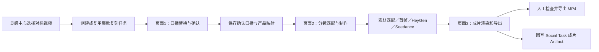
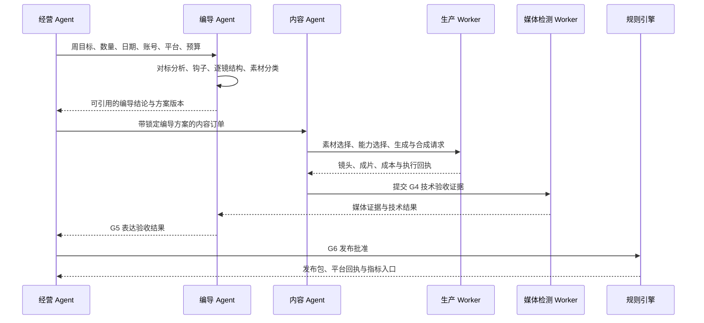

# 爆款复刻模式：内容制作三页面全链路

> 文档状态：基于 2026-10-08 当前工作区代码整理  
> 适用范围：灵感中心选中对标视频后，进入内容制作的“口播替换与确认 → 分镜匹配与制作 → 成片渲染和导出”流程  
> 正式 AIGC 路径：**HeyGen + Seedance**。Runway 不属于当前正式产品路径；代码中的 `runway_seedance` 是历史内部标识，实际执行方是 Seedance。

## 1. 先说明三个页面的真实结构

从用户视角看，这是连续的三个页面：

1. 口播替换与确认；
2. 分镜匹配与制作；
3. 成片渲染和导出。

从代码结构看，它们不是三个独立路由：

- 第一页由 `SocialCreationWorkbench` 独立实现；
- 第二页和第三页共用 `AiCreateStudio`，分别由 `material`、`preview` 等内部步骤状态控制；
- 三页共用 `ReplicationWorkbenchHeader` 显示步骤和返回关系；
- 页面之间传递的不是临时界面文本，而是任务 ID、项目草稿、确认口播、产品映射、参考视频分析和版本信息。

主要实现位置：

- `src/components/socialContent/SocialCreationWorkbench.tsx`
- `src/components/AiCreateStudio.tsx`
- `src/components/socialContent/ReplicationWorkbenchHeader.tsx`
- `src/components/socialContent/SocialContentPlanningPage.tsx`
- `src/App.tsx`

## 2. 两条并存的生产链路

当前系统同时存在两条链路，二者共享任务、编导方案、素材和成片等数据，但触发方式不同。

### 2.1 三页面人工制作链路

用户在三个页面中逐步确认产品、口播、人物、素材、首帧、配音、字幕和渲染结果。前端主要调用 Studio API，并持续保存 `studio_projects` 草稿。



### 2.2 经营 Agent 派单的一键托管链路

经营 Agent 创建正式内容任务后，后端编排器把已经锁定的编导方案交给持久生产队列。内容 Agent 和后台 Worker 执行素材选择、生成、合成及质量检查。网页关闭不会中断任务。


三页面人工操作不会在每次点击时让多个 Agent 相互“聊天”。Agent 协作主要表现为版本化任务对象、交接单、执行计划和质量门禁。一键托管任务才会进入后台持久队列自动推进。

## 3. 从灵感中心进入爆款复刻

### 3.1 用户操作

1. 用户在灵感中心打开已经完成分析的对标视频；
2. 点击“爆款复刻”；已经有任务时按钮显示“继续制作”；
3. 系统创建或复用 Social Content Task；
4. 系统把参考视频、封面、逐镜分析、产品词和任务 ID 带到内容制作；
5. 内容制作先打开第一页，而不是直接进入复杂 Studio。

入口实现位于 `InspirationDashboard.tsx` 的 `enterInspirationWorkflow`。页面导航目标为 `smartAssets`，请求中包含：

- `creationPath: 'viral_replication'`；
- `continueTaskId`；
- 参考视频 URL 和缩略图；
- 编导逐镜分析；
- 原片口播与产品词。

如果用户从内容制作首页手动选择“爆款复刻”，系统会先带用户回灵感中心选片。爆款复刻必须有一个明确、可追溯的对标视频，不能从空白 Studio 凭空开始。

### 3.2 后端准备

前端读取或刷新：

- `GET /api/overseas/starter-198/social-content/tasks/:taskId`
- `POST /api/overseas/starter-198/social-content/tasks/:taskId/refresh-reference`

对标分析必须达到 `ready`，并包含完整时间线、逐镜区间、口播行、画面描述和产品词，才能进入正式复刻。

主要数据：

- `starter_social_content_tasks`：任务主记录；
- `starter_social_task_sources`：参考视频和事实来源；
- `starter_inspiration_handoff_versions`：灵感分析向编导和内容侧的版本化交接；
- `trend_videos`：灵感中心视频及分析投影。

## 4. 页面一：口播替换与确认

### 4.1 页面目标

第一页不重新创作整篇脚本。它保留爆款原片的逐句结构和时间关系，只替换其中的产品身份、品牌身份和必要企业信息，并允许用户逐句人工修改。

### 4.2 前端交互

页面采用三栏布局：

- **左栏：逐句口播卡片**
  - 显示原口播、时间范围、原片首帧和覆盖分镜；
  - 显示替换后的新口播；
  - 用户可以逐句编辑；
  - 当前播放时间会自动高亮相应口播卡片；
  - 点击卡片可让中间播放器跳到对应时间。
- **中栏：对标视频播放器**
  - 播放原始参考视频；
  - 与左侧逐句口播、分镜时间同步；
  - 用户可以核对“原句—原画面—新句”是否合理。
- **右栏：产品与品牌替换**
  - 从企业知识库选择企业产品；
  - 将原片中的每个产品词映射到一个企业产品；
  - 自动读取企业品牌名和 CTA；
  - 原片识别不出的产品词可手工补充。

页面会每 10 秒轮询任务。第一次读取时会尝试刷新参考分析；分析完成后，将 `referenceVideoAnalysis.shots`、`spokenLines` 和 `narrationProducts` 转换为页面的分镜、口播和产品位。

### 4.3 产品映射规则

进入下一页前必须满足：

1. 原片识别出的产品位数量与所选企业产品数量一致；
2. 每个产品位都有非空 `sourceTerm` 和有效 `productId`；
3. 同一个企业产品不能被重复占用；
4. 产品必须仍存在于当前企业产品目录；
5. 旧任务中的过期 `productId` 只能通过唯一、精确的产品名或 SKU 迁移，不能模糊猜测。

### 4.4 口播名与口播生成

若原片是英文，而企业产品名或品牌名是中文，前端先调用：

```text
POST /api/overseas/studio/speech-names
```

后端使用 Qwen `qwen-plus` 生成适合口播的英文名称。这里只转换产品名和品牌名，不重新改写原片句式。结果按租户和内容哈希缓存在：

```text
data/tts/<tenant>/speech-names-<hash>.json
```

前端随后按映射替换原句中的产品和品牌身份，并高亮替换词。用户仍可逐句修改最终口播。

### 4.5 页面一门禁

“确认口播，进入分镜匹配”只有在以下条件成立时可用：

- 对标分析已经完成；
- 产品映射完整且唯一；
- 英文口播名生成成功；
- 每条原口播都有一条对应的新口播；
- 每条新口播均非空；
- 真实 ASR/字幕来源可核验，不能拿画面描述代替口播事实。

确认后，页面向 Studio 传递：

- `confirmedSpeech`：原句、新句、时间范围；
- `identityMappings.products`：原产品词、企业产品 ID、企业产品名；
- `identityMappings.brand`：原品牌词和企业品牌名；
- `continueTaskId`；
- 参考视频和逐镜上下文。

## 5. 页面二：分镜匹配与制作

### 5.1 页面初始化

`AiCreateStudio` 接收第一页确认结果后会再次校验：

- 口播条数是否仍与原片一致；
- 每条原句是否仍能一一匹配；
- 产品映射是否完整；
- 参考视频、任务和项目是否仍属于当前租户；
- 编导分析版本是否仍然有效。

通过后，系统：

1. 建立带时间戳的新脚本；
2. 按原片时间切点建立新视频分镜；
3. 新建或更新 `studio_projects` 草稿；
4. 把主产品的规范 ID 回写 Social Task；
5. 自动进入 `material` 步骤。

项目接口：

```text
GET  /api/overseas/studio/projects/:id
POST /api/overseas/studio/projects
GET  /api/overseas/studio/projects/:id/evidence
```

### 5.2 页面布局与交互

- **左侧：爆款视频分镜／新建视频分镜**
  - 查看原分镜和新分镜的对应关系；
  - 查看钩子、镜头功能、口播、素材分类和时间范围；
  - 必要时重新拉取参考分析。
- **中间：画面预览**
  - 预览当前分镜的原片、候选素材、首帧或生成结果；
  - 检查人物、产品、构图和镜头节奏。
- **右侧：逐镜制作配置**
  - 选择照片数字人、视频数字人、本地素材、智能匹配或待拍；
  - 选择企业人物、产品素材和素材来源；
  - 查看生成状态、失败原因和重试入口。
- **底部：时间轴和批量操作**
  - 查看所有镜头是否已经匹配；
  - 一次性生成所有智能分镜；
  - 进入首帧审核或成片设置。

### 5.3 每类镜头如何制作

#### 真人口播镜头

当前正式路径：

- **HeyGen**：授权企业照片人物的口播视频；
- **Seedance**：参考人物、首帧和动作约束的视频生成路径；
- 用户也可以选择已有企业人物素材或本地视频。

人物识别和人物授权没有确认时，数字人选项不可执行。付费调用前还必须锁定人物版本，避免人物资产更新后继续用旧版本生成。

#### 产品、工厂、消费者使用与效果演示镜头

优先顺序通常为：

1. 当前企业已经拥有且符合镜头条件的素材；
2. 与参考结构相符的企业素材切片；
3. Seedance 产品／概念视频；
4. Qwen/Seedream 首帧或图片生成；
5. 明确标记的待拍清单。

系统不能用说明卡、纯文字占位图冒充正式产品镜头。

### 5.4 素材上传与分析

素材上传接口：

```text
POST /api/overseas/studio/materials/file
```

后端进行：

- 文件大小、类型和租户校验；
- 流式写入临时目录；
- SHA-256 内容哈希；
- 媒体写入对象存储；
- 元数据写入 `materials`；
- 临时文件清理。

素材分析接口包括：

```text
POST /api/overseas/studio/materials/:id/analysis
POST /api/overseas/studio/materials/:id/analyze-segments
```

本地 `materials.json` 和 `data/media` 只承担旧数据兼容。新素材的权威记录是数据库元数据加对象存储文件。

### 5.5 首帧与逐句视频

逐句首帧路线会先提取每个人物镜头的原片首帧，再把首帧重建成企业授权人物，最后按已确认口播逐句生成视频。

主要接口：

```text
POST /api/overseas/studio/production/sentence-first-frames
POST /api/overseas/studio/production/photo-talking-first-frames
POST /api/overseas/studio/production/sentence-first-frame-drafts
POST /api/overseas/studio/production/sentence-replication-jobs
GET  /api/overseas/studio/production/sentence-replication-jobs/:id/status
POST /api/overseas/studio/production/sentence-replication-jobs/:id/retry-failed
```

付费作业使用 `requestId` 做幂等控制。供应商一旦接受任务，外部任务 ID 会立即写入数据库。即使前端超时，也只继续查询原任务，不会盲目重复付费生成。

相关集合：

- `studio_first_frame_draft_jobs`；
- `studio_sentence_replication_jobs`；
- `studio_digital_human_plans`；
- `studio_digital_human_executions`；
- `studio_social_presenter_jobs`；
- `materials`。

### 5.6 页面二门禁

进入第三页前必须：

- 已生成有效 Storyboard；
- 每个镜头都有明确来源；
- 所需人物已授权并锁定版本；
- 所需素材已关联、生成或明确标为待拍；
- 数字人作业状态确定，不能处于结果未知状态；
- 项目草稿保存成功。

如果还有未完成分镜，系统会留在第二页并将用户定位到对应镜头。若批量任务可以收尾，系统会先完成批次收口，再进入第三页。

## 6. 页面三：成片渲染和导出

### 6.1 前端交互

用户在第三页完成：

- 选择声音、语速和语气；
- 上传或选择已授权的个人声音样本；
- 生成、试听和确认配音；
- 检查字幕文本和字幕时间；
- 选择配乐、音效和画面动效；
- 检查封面和结尾；
- 渲染正式视频；
- 在中间播放器完整验收成片；
- 勾选人工验收确认；
- 导出 MP4。

数字人镜头通常保留供应商返回的口播音轨；普通素材镜头使用统一 TTS 和时间轴配音。

### 6.2 配音技术栈

主要接口：

```text
POST /api/overseas/studio/tts
POST /api/overseas/studio/tts/batch
POST /api/overseas/studio/tts/align
POST /api/overseas/studio/tts/asr
```

后端返回真实音频、逐句时间码和质量报告。前端依据测量后的 cue 调整字幕和分镜时间，不使用估算时长冒充真实对齐结果。

### 6.3 渲染技术栈

渲染分为两步：

1. `POST /api/overseas/studio/render`
   - 校验素材白名单、租户、配额和 RenderSpec；
   - 生成不可篡改的 manifest；
   - 返回短期签名 render token。
2. `POST /api/overseas/studio/render/local`
   - 校验 token、manifest hash、租户、任务 ID、防重放和并发限制；
   - 调用 `desktop/render.cjs`；
   - 使用 ffmpeg 合成视频、音轨、字幕、配乐、转场和结尾；
   - 输出 MP4 并返回可下载路径。

辅助技术包括：

- ffmpeg / ffprobe：视频、音轨、时长、编码和合成；
- `sharp`：图片、封面和画面处理；
- 对象存储：素材和供应商结果；
- 内容哈希、签名 token、请求幂等键：防重复和防串租户。

### 6.4 页面三门禁

渲染前统一检查：

- 是否缺脚本或分镜；
- 是否有镜头没有素材；
- 字幕是否有可验证来源；
- 配音是否有真实时间码；
- 数字人口播是否完成；
- 是否存在已经过期的旧成片版本；
- 当前项目版本是否已保存。

渲染完成后，“导出 MP4”仍保持禁用，直到用户勾选：

> 我已检查中间播放器中的画面、口播、字幕、配乐和结尾，同意导出当前版本。

在 Social Task 场景下，正式成片还会回写为内容 Artifact，记录：

- `projectId`；
- 输出 URL；
- 生成来源和使用的模型；
- 质量状态；
- 是否允许发布；
- 与任务、编导方案和产品事实的 lineage。

## 7. 后端技术栈与数据库

### 7.1 服务端

- Node.js + TypeScript；
- Express 路由；
- Studio、Production、Starter-198 Social Content 三组领域接口；
- 后台持久 Worker；
- BullMQ + Redis 作为可选快速唤醒层；
- ffmpeg / ffprobe + `sharp` 处理媒体；
- Qwen 处理口播名和部分图片能力；
- HeyGen 处理授权人物口播；
- Seedance 处理视频生成；
- 对象存储保存大文件和供应商结果。

### 7.2 数据库切换

统一数据访问接口是 `DataStore`。切换点位于 `server/storage/index.ts`：

- 默认业务后端可以是 PocketBase；
- 配置 PostgreSQL 后，业务集合可切换到 PostgreSQL；
- 当前认证迁移期仍使用 PocketBase；
- 所有业务读取必须带租户边界。

### 7.3 关键集合

| 领域 | 关键集合 | 用途 |
|---|---|---|
| 任务 | `starter_social_content_tasks` | 单条内容任务主状态、版本、产品、模式 |
| 来源 | `starter_social_task_sources` | 参考视频、知识事实、CTA、账号来源 |
| 编导 | `starter_social_director_plan_versions`、`starter_social_director_brief_versions` | 锁定创意、分镜、时长、事实边界和验收条件 |
| 交接 | `starter_social_production_handoffs`、`starter_social_production_receipts` | 编导向内容交接及内容执行回执 |
| 血缘 | `starter_social_content_lineage` | 任务、来源、方案、成片版本之间的可追溯关系 |
| 返工 | `starter_social_content_rework_queue` | 失败镜头、修改原因和返工状态 |
| 项目 | `studio_projects` | 三页面 Studio 草稿及完整制作配置 |
| 素材 | `materials`、`starter_social_content_files` | 企业素材、生成素材和成片文件记录 |
| 数字人 | `studio_social_presenter_jobs`、`studio_digital_human_plans`、`studio_digital_human_executions` | 人物任务、计划、供应商执行和质量状态 |
| 逐句生成 | `studio_first_frame_draft_jobs`、`studio_sentence_replication_jobs` | 首帧和逐句视频付费作业，保存幂等与供应商任务 ID |
| 队列 | `content_execution_jobs`、`content_execution_limits`、`durable_operation_leases` | 后台生产任务、并发限制和跨进程租约 |
| 输出 | `starter_social_content_artifacts`、`starter_social_delivery_packages` | 成片 Artifact 和可发布交付包 |
| 发布 | `starter_social_publications`、`starter_social_metric_submissions` | 发布状态、回执和效果指标 |

### 7.4 队列可靠性

数据库中的 `content_execution_jobs` 是任务权威来源。BullMQ/Redis 只负责快速唤醒和降低延迟：

- Redis 暂时不可用时，数据库扫描仍会恢复任务；
- 浏览器关闭不会中止生产；
- Worker 崩溃后，通过持久租约和作业状态恢复；
- 外部供应商已接受的任务不会因本地超时而重复提交；
- 成本、结果未知或供应商回执不完整时进入核对状态，而不是直接重跑。

## 8. Agent 与 Agent 如何协作

### 8.1 经营 Agent

经营 Agent 是任务和经营目标的所有者，负责：

- 周目标和关键指标；
- 要生产多少条内容；
- 每条内容的日期、账号、平台和市场；
- 预算和付费能力边界；
- 把编导分析结果写入详细选题排期；
- 创建正式内容订单；
- 最终发布验收和发布节奏。

经营 Agent 不直接生成镜头，也不由编导 Agent 指挥。它消费编导结论后形成排期，再将锁定任务派给内容 Agent。

### 8.2 编导 Agent

编导 Agent 负责把对标视频分析变成可执行、可验收的方案：

- 首个分镜作为钩子；
- 逐镜时间线、口播和画面功能；
- 真人口播、工厂生产、产品展示、消费者使用与效果演示四类素材；
- 创意意图和叙事结构；
- 每镜头必须保留和必须替换的内容；
- 时长、事实边界和 CTA；
- 内容 Agent 的验收条件；
- 修改后新版本和版本差异。

编导交付的是版本化的 `DirectorBrief`、`ContentExecutionPlan`、逐镜审查和生产交接单，而不是一句自然语言指令。

### 8.3 内容 Agent

内容 Agent 只能在已锁定的编导方案下执行：

- 选择企业已有素材；
- 选择 HeyGen、Seedance 或其他已经注册且可用的生产能力；
- 生成首帧、数字人口播和产品镜头；
- 执行重试、合成、字幕、配音和技术交付；
- 产生执行回执、成片和质量证据。

内容 Agent 不得：

- 自行改写编导 Brief；
- 发明产品事实；
- 修改来源血缘；
- 擅自改变输出规格；
- 为了塞进时长而压缩已经确认的爆款口播；
- 自行通过编导表达门或经营发布门。

若已确认口播和目标镜头时长冲突，内容 Agent 必须把问题退回编导 Agent，由编导生成新的锁定版本。对于爆款复刻，优先补充视觉覆盖或重新匹配素材，不能私自删词压词。

### 8.4 质量门与回流

制作完成后按顺序通过：

1. **G4 技术门——内容 Agent**  
   检查格式、时长、音画同步、字幕、素材血缘、渲染结果和敏感信息。
2. **媒体检测——Media Evaluation Worker**  
   检查文件、画面、音轨和可机器验证的媒体证据。
3. **G5 表达门——编导 Agent**  
   检查钩子、证据顺序、账号语气、CTA、事实边界和版本差异。
4. **G6 发布门——经营 Agent**  
   检查账号、平台格式、转化路径、销售负责人、预算和本周发布授权。
5. **规则引擎**  
   执行最终确定性规则，生成发布包。

任何 Agent 都不能自审自己无权通过的门。



## 9. 已实现程度与边界

### 已实现

- 三页面前端交互和跨页恢复；
- 对标分析、产品映射和口播确认门禁；
- Studio 项目草稿、素材上传、首帧、逐句视频、TTS 和渲染；
- Social Task、编导方案、生产交接和血缘版本；
- 持久生产队列、失败重试、阻塞通知和供应商任务幂等；
- G4/G5/G6 的数据合同、顺序和权限约束；
- 成片 Artifact 和 Delivery Package。

### 部分实现或受部署开关影响

- `metrics_worker`、`media_evaluation_worker` 和最终五段门禁的协作合同已经定义，但是否全自动常驻执行取决于运行时 Worker 注册和部署开关；
- HeyGen 和 Seedance 的真实执行依赖对应 API Key、对象存储、预算、人物授权和功能开关；
- 自动发布、自动放量需要独立的发布 Worker、平台授权和经营审批；
- “应用授权”页面仍在开发中。

## 10. 关键代码索引

| 模块 | 文件 |
|---|---|
| 灵感中心入口 | `src/components/InspirationDashboard.tsx` |
| 页面一 | `src/components/socialContent/SocialCreationWorkbench.tsx` |
| 页面一与 Studio 桥接 | `src/components/socialContent/SocialContentPlanningPage.tsx` |
| 页面二、三 | `src/components/AiCreateStudio.tsx` |
| 三步骤头部 | `src/components/socialContent/ReplicationWorkbenchHeader.tsx` |
| Studio API 客户端 | `src/lib/studioApi.ts` |
| Social Task API 客户端 | `src/lib/socialContentApi.ts` |
| Studio 路由 | `server/routes/studio.ts` |
| 数字人／逐句视频路由 | `server/routes/production.ts` |
| Social Task 路由 | `server/starter198/socialContentRouter.ts` |
| 经营、编导、内容工作流 | `server/starter198/socialContentAgentWorkflow.ts` |
| 编导到内容交接 | `server/starter198/socialContentProductionHandoff.ts` |
| 编导方案约束 | `server/starter198/socialContentDirectorPlan.ts` |
| 内容生产执行 | `server/starter198/socialContentProductionExecution.ts` |
| 持久生产队列 | `server/starter198/socialContentProductionQueue.ts` |
| 输出和交付包 | `server/starter198/socialContentOutputs.ts` |
| 统一数据访问 | `server/storage/index.ts` |
| Starter 集合定义 | `server/starter198/repository.ts` |

## 11. 与自由创作模式的对照（2026-10-08 核查）

### 11.1 产品边界

两种模式面向不同任务：

- **爆款复刻**：输入是已经完成编导分析的对标视频、真实口播、钩子分镜和逐镜结构；目标是在企业产品和品牌约束下复刻被验证过的表达结构。
- **自由创作**：输入是一个企业产品和用户上传的一段开场钩子视频；Gemini 根据企业资料及钩子画面生成一套新口播和分镜，再进入逐镜制作。
- **数字员工**：新建的 Agent 内容任务只应走爆款复刻。自由创作保留为人工内容制作能力，不参与经营 Agent → 编导 Agent → 内容 Agent 的自动排期和自动生产。

### 11.2 三个页面的前端对照

| 页面 | 爆款复刻 | 自由创作 | 对齐状态 |
|---|---|---|---|
| 1. 口播确认 | 原片逐句口播、多产品映射、品牌替换、逐句编辑和确认 | 单选企业产品、上传 1 个视频钩子、Gemini 生成新脚本；当前只能查看或整版重生成 | **未对齐**：自由创作缺少编辑后确认，也没有第一页草稿恢复 |
| 2. 分镜制作 | 保留原片时间结构、原片/新片对照、按镜头复刻 | 按 Gemini 新脚本切分，首镜绑定钩子，其余镜头选择素材、数字人、智能生成或补拍 | **底座复用，业务分叉合理**；进入第三页的前端门禁偏松 |
| 3. 成片渲染 | 配音、字幕、配乐、动效、质检、渲染、验收和导出 | 复用同一页面与同一渲染链 | **基本对齐**；手动自由创作的任务恢复能力弱于托管生产 |

自由创作的第一页和爆款复刻共用 `SocialCreationWorkbench` 与 `ReplicationWorkbenchHeader`。第二、三页共用 `AiCreateStudio`、`StudioWorkbenchFrame`、分镜列表、时间轴、素材选择、批量生成、质检、渲染及导出组件。复用的是页面骨架和生产能力，两个模式并不是同一套业务数据。

### 11.3 共用的后端技术栈与数据

| 能力 | 是否复用 | 说明 |
|---|---|---|
| 素材上传与分析 | 是 | 共用 Studio materials API、对象存储和 `materials` 元数据 |
| 项目保存与恢复 | 是 | 共用 `studio_projects`；自由创作第一页确认前仍主要依赖组件内存及一次性 `ow_video_kickoff` |
| 脚本生成 | 部分 | 自由创作显式使用 Gemini；爆款复刻以原片分析、ASR 和产品/品牌替换为输入 |
| 首帧和视频生成 | 是 | 共用 Seedream/Qwen 图片、Seedance 视频、授权后的 HeyGen 数字人口播；正式链路不使用 Runway |
| 翻译、TTS 与字幕对齐 | 是 | 共用 Qwen/MiniMax/XTTS、Qwen ASR 和实测时间码 |
| 渲染与导出 | 是 | 共用 render manifest、短期 token、FFmpeg 合成和 MP4 导出 |
| 社媒 Artifact | 有条件复用 | 只有带 `socialContentTaskId` 的任务才写 Starter 文件、Artifact、验收与交付记录 |
| Agent 编排 | 不应复用自由创作 | 经营、编导、内容 Agent 的新任务应只接受爆款复刻方案 |

### 11.4 自由创作是否已经全链路跑通

**不能认定为全部跑通。** 当前代码具备从选品、上传钩子、Gemini 生成脚本、逐镜制作到渲染导出的主链；构建与接口存在不等于全部用户场景已经闭环。核查出的功能性卡点如下：

1. 第一页生成结果使用只读 `<pre>`，用户不能修改口播后确认，只能整版重新生成。
2. 第一页的产品、上传文件和脚本在进入 Studio 前没有草稿；刷新、离开或打开“我的创作”会丢失进度。
3. Studio 读取 `ow_video_kickoff` 后立即删除；首次项目保存前发生关闭或异常时，恢复窗口不足。
4. 入口文案表示系统会自动组织素材，实际却强制上传一段视频钩子，描述与门禁不一致。
5. 第一次交接协议还不能持久表示“每一句口播 → 指定素材”的绑定。
6. 页面二的“查看成片设置”只检查已有分镜，完整素材、配音和质量门禁到真正渲染时才阻断，步骤状态与可执行状态不完全一致。
7. 普通“新建内容 → 自由创作”只建立 Studio 项目，不创建 Starter 社媒任务，因此没有 Agent handoff、G5/G6 验收、Artifact 和 Delivery Package。
8. 手动渲染不是 `content_execution_jobs` 式的数据库持久任务，浏览器或进程中断后的恢复能力弱于托管生产。
9. “我的创作”仍插入硬编码演示成片，会与真实项目历史混在一起。

因此，自由创作当前应标记为：**人工三页制作主链可用，完整交互、恢复和任务闭环待补齐**。

### 11.5 数字员工当前实现与目标不一致

当前代码尚未落实“数字员工不走自由创作”：

- Agent 默认配置仍启用 `product_content`；
- Agent 配置页会把 `viral_clone`、`product_content`、`material_content` 一起开启；
- 后端会在 clone、product、material 三条路线间均衡分配；
- 周排期新增内容默认是 product；
- 缺少精确对标分析时可能保留 product/material，而不是阻塞并退回编导；
- 周任务包编译会再次加入 `product_content`。

目标规则应调整为：

1. 人工用户继续可以从内容制作页进入自由创作。
2. 所有新建数字员工内容任务只允许 `viral_clone`。
3. 经营 Agent 提供数量、日期、账号、平台和目标；编导 Agent 必须为每条任务补齐精确对标、钩子及逐镜分析；内容 Agent 只执行已锁定的爆款复刻方案。
4. 没有精确对标分析时，任务进入阻塞状态并退回编导补充，不得自动降级为产品生成或素材生成。
5. 历史 product/material 任务保持可读、可续跑；新 revision 和新 run 应用 clone-only 规则。

落地顺序应为：先在服务端限制数字员工新任务的合法 route，再收口 Agent 配置页和周排期编辑器，最后补数据迁移及回归测试。仅修改前端会让旧客户端或直接 API 继续创建自由创作 Agent 任务。
